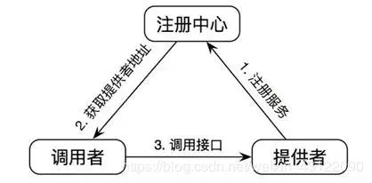
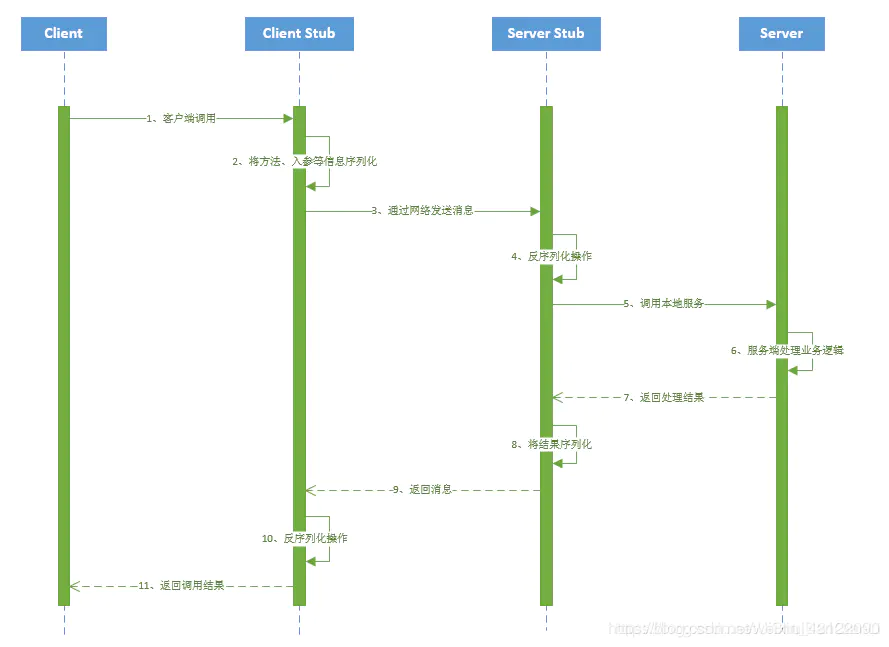
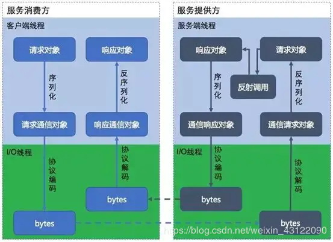

# 理论准备

## RPC

### 为什么要有RPC

- http接口是在接口不多、系统与系统交互较少的情况下，解决信息孤岛初期常使用的一种通信手段；优点就是简单、直接、开发方便。利用现成的http协议进行传输。但是如果是一个大型的网站，内部子系统较多、接口非常多的情况下，RPC框架的好处就显示出来了，首先就是长链接，不必每次通信都要像http一样去3次握手什么的，减少了网络开销；其次就是RPC框架一般都有注册中心，有丰富的监控管理；发布、下线接口、动态扩展等，对调用方来说是无感知、统一化的操作。第三个来说就是安全性。最后就是最近流行的服务化架构、服务化治理，RPC框架是一个强力的支撑。
- socket只是一个简单的网络通信方式，只是创建通信双方的通信通道，而要实现rpc的功能，还需要对其进行封装，以实现更多的功能。
- RPC一般配合netty框架、spring自定义注解来编写轻量级框架，其实netty内部是封装了socket的，较新的jdk的IO一般是NIO，即非阻塞IO，在高并发网站中，RPC的优势会很明显

### 什么是RPC

- RPC（Remote Procedure Call Protocol）远程过程调用协议，它是一种通过网络从远程计算机程序上请求服务，而不需要了解底层网络技术的协议。简言之，RPC使得程序能够像访问本地系统资源一样，去访问远端系统资源。比较关键的一些方面包括：通讯协议、序列化、资源（接口）描述、服务框架、性能、语言支持等。





- 简单的说，RPC就是从一台机器(客户端)上通过参数传递的方式调用另一台机器(服务器)上的一个函数或方法(可以统称为服务)并得到返回的结果。

### PRC架构组件

- 一个基本的RPC架构里面应该至少包含以下4个组件：

    1、客户端（Client）:服务调用方（服务消费者）

    2、客户端存根（Client Stub）:存放服务端地址信息，将客户端的请求参数数据信息打包成网络消息，再通过网络传输发送给服务端

    3、服务端存根（Server Stub）:接收客户端发送过来的请求消息并进行解包，然后再调用本地服务进行处理4、服务端（Server）:服务的真正提供者





- 具体调用过程：

    1、服务消费者（client客户端）通过调用本地服务的方式调用需要消费的服务；

    2、客户端存根（client stub）接收到调用请求后负责将方法、入参等信息序列化（组装）成能够进行网络传输的消息体；

    3、客户端存根（client stub）找到远程的服务地址，并且将消息通过网络发送给服务端；

    4、服务端存根（server stub）收到消息后进行解码（反序列化操作）；

    5、服务端存根（server stub）根据解码结果调用本地的服务进行相关处理；

    6、本地服务执行具体业务逻辑并将处理结果返回给服务端存根（server stub）；

    7、服务端存根（server stub）将返回结果重新打包成消息（序列化）并通过网络发送至消费方；

    8、客户端存根（client stub）接收到消息，并进行解码（反序列化）；

    9、服务消费方得到最终结果；

```
而RPC框架的实现目标则是将上面的第2-10步完好地封装起来，也就是把调用、编码/解码的过程给封装起来，让用户感觉上像调用本地服务一样的调用远程服务。
```

### RPC和SOA、SOAP、REST的区别

- 1、REST

    可以看着是HTTP协议的一种直接应用，默认基于JSON作为传输格式,使用简单,学习成本低效率高,但是安全性较低。

- 2、SOAP

    SOAP是一种数据交换协议规范,是一种轻量的、简单的、基于XML的协议的规范。而SOAP可以看着是一个重量级的协议，基于XML、SOAP在安全方面是通过使用XML-Security和XML-Signature两个规范组成了WS-Security来实现安全控制的,当前已经得到了各个厂商的支持 。

    它有什么优点？简单总结为：易用、灵活、跨语言、跨平台。

- 3、SOA

    面向服务架构，它可以根据需求通过网络对松散耦合的粗粒度应用组件进行分布式部署、组合和使用。服务层是SOA的基础，可以直接被应用调用，从而有效控制系统中与软件代理交互的人为依赖性。

    SOA是一种粗粒度、松耦合服务架构，服务之间通过简单、精确定义接口进行通讯，不涉及底层编程接口和通讯模型。SOA可以看作是B/S模型、XML（标准通用标记语言的子集）/Web Service技术之后的自然延伸。

- 4、REST 和 SOAP、RPC 有何区别呢?

    没什么太大区别，他们的本质都是提供可支持分布式的基础服务，最大的区别在于他们各自的的特点所带来的不同应用场景 。

### RPC框架需要解决的问题？

- 1、如何确定客户端和服务端之间的通信协议？
- 2、如何更高效地进行网络通信？
- 3、服务端提供的服务如何暴露给客户端？
- 4、客户端如何发现这些暴露的服务？
- 5、如何更高效地对请求对象和响应结果进行序列化和反序列化操作？

### RPC的实现基础？

- 1、需要有非常高效的网络通信，比如一般选择Netty作为网络通信框架；
- 2、需要有比较高效的序列化框架，比如谷歌的Protobuf序列化框架；
- 3、可靠的寻址方式（主要是提供服务的发现），比如可以使用Zookeeper来注册服务等等；
- 4、如果是带会话（状态）的RPC调用，还需要有会话和状态保持的功能；

### RPC使用了哪些关键技术？

- 1、动态代理

    生成Client Stub（客户端存根）和Server Stub（服务端存根）的时候需要用到Java动态代理技术，可以使用JDK提供的原生的动态代理机制，也可以使用开源的：CGLib代理，Javassist字节码生成技术。

- 2、序列化和反序列化

    在网络中，所有的数据都将会被转化为字节进行传送，所以为了能够使参数对象在网络中进行传输，需要对这些参数进行序列化和反序列化操作。

    - 序列化：把对象转换为字节序列的过程称为对象的序列化，也就是编码的过程。反序列化：把字节序列恢复为对象的过程称为对象的反序列化，也就是解码的过程。 目前比较高效的开源序列化框架：如Kryo、FastJson和Protobuf等。
    - 反序列化：把字节序列恢复为对象的过程称为对象的反序列化，也就是解码的过程。 目前比较高效的开源序列化框架：如Kryo、FastJson和Protobuf等。

- 3、NIO通信

    出于并发性能的考虑，传统的阻塞式 IO 显然不太合适，因此我们需要异步的 IO，即 NIO。Java 提供了 NIO 的解决方案，Java 7 也提供了更优秀的 NIO.2 支持。可以选择Netty或者MINA来解决NIO数据传输的问题。

- 4、服务注册中心

    可选：Redis、Zookeeper、Consul 、Etcd。一般使用ZooKeeper提供服务注册与发现功能，解决单点故障以及分布式部署的问题(注册中心)。

### 主流RPC框架有哪些

- 1、RMI

    利用java.rmi包实现，基于Java远程方法协议(Java Remote Method Protocol) 和java的原生序列化。

- 2、Hessian

    是一个轻量级的remoting onhttp工具，使用简单的方法提供了RMI的功能。 基于HTTP协议，采用二进制编解码。

- 3、protobuf-rpc-pro

    是一个Java类库，提供了基于 Google 的 Protocol Buffers 协议的远程方法调用的框架。基于 Netty 底层的 NIO 技术。支持 TCP 重用/ keep-alive、SSL加密、RPC 调用取消操作、嵌入式日志等功能。

- 4、Thrift

    是一种可伸缩的跨语言服务的软件框架。它拥有功能强大的代码生成引擎，无缝地支持C + +，C#，Java，Python和PHP和Ruby。thrift允许你定义一个描述文件，描述数据类型和服务接口。依据该文件，编译器方便地生成RPC客户端和服务器通信代码。

    最初由facebook开发用做系统内个语言之间的RPC通信，2007年由facebook贡献到apache基金 ，现在是apache下的opensource之一 。支持多种语言之间的RPC方式的通信：php语言client可以构造一个对象，调用相应的服务方法来调用java语言的服务，跨越语言的C/S RPC调用。底层通讯基于SOCKET。

- 5、Avro

    出自Hadoop之父Doug Cutting, 在Thrift已经相当流行的情况下推出Avro的目标不仅是提供一套类似Thrift的通讯中间件,更是要建立一个新的，标准性的云计算的数据交换和存储的Protocol。支持HTTP，TCP两种协议。

- 6、Dubbo

    Dubbo是 阿里巴巴公司开源的一个高性能优秀的服务框架，使得应用可通过高性能的 RPC 实现服务的输出和输入功能，可以和 Spring框架无缝集成。

### RPC的实现原理架构图





也就是说两台服务器A，B，一个应用部署在A服务器上，想要调用B服务器上应用提供的函数/方法，由于不在一个内存空间，不能直接调用，需要通过网络来表达调用的语义和传达调用的数据。

比如说，A服务器想调用B服务器上的一个方法：

- 1、建立通信

    首先要解决通讯的问题：即A机器想要调用B机器，首先得建立起通信连接。

    主要是通过在客户端和服务器之间建立TCP连接，远程过程调用的所有交换的数据都在这个连接里传输。连接可以是按需连接，调用结束后就断掉，也可以是长连接，多个远程过程调用共享同一个连接。

    通常这个连接可以是按需连接（需要调用的时候就先建立连接，调用结束后就立马断掉），也可以是长连接（客户端和服务器建立起连接之后保持长期持有，不管此时有无数据包的发送，可以配合心跳检测机制定期检测建立的连接是否存活有效），多个远程过程调用共享同一个连接。

- 2、服务寻址

    要解决寻址的问题，也就是说，A服务器上的应用怎么告诉底层的RPC框架，如何连接到B服务器（如主机或IP地址）以及特定的端口，方法的名称名称是什么。

    通常情况下我们需要提供B机器（主机名或IP地址）以及特定的端口，然后指定调用的方法或者函数的名称以及入参出参等信息，这样才能完成服务的一个调用。

    可靠的寻址方式（主要是提供服务的发现）是RPC的实现基石，比如可以采用Redis或者Zookeeper来注册服务等等。

    - 2.1、从服务提供者的角度看：

        当服务提供者启动的时候，需要将自己提供的服务注册到指定的注册中心，以便服务消费者能够通过服务注册中心进行查找；

        当服务提供者由于各种原因致使提供的服务停止时，需要向注册中心注销停止的服务；

        服务的提供者需要定期向服务注册中心发送心跳检测，服务注册中心如果一段时间未收到来自服务提供者的心跳后，认为该服务提供者已经停止服务，则将该服务从注册中心上去掉。

    - 2.2、从调用者的角度看：

        服务的调用者启动的时候根据自己订阅的服务向服务注册中心查找服务提供者的地址等信息；

        当服务调用者消费的服务上线或者下线的时候，注册中心会告知该服务的调用者；

        服务调用者下线的时候，则取消订阅。

- 3、网络传输

    - 3.1、序列化

        当A机器上的应用发起一个RPC调用时，调用方法和其入参等信息需要通过底层的网络协议如TCP传输到B机器，由于网络协议是基于二进制的，所有我们传输的参数数据都需要先进行序列化（Serialize）或者编组（marshal）成二进制的形式才能在网络中进行传输。然后通过寻址操作和网络传输将序列化或者编组之后的二进制数据发送给B机器。

    - 3.2、反序列化

        当B机器接收到A机器的应用发来的请求之后，又需要对接收到的参数等信息进行反序列化操作（序列化的逆操作），即将二进制信息恢复为内存中的表达方式，然后再找到对应的方法（寻址的一部分）进行本地调用（一般是通过生成代理Proxy去调用, 通常会有JDK动态代理、CGLIB动态代理、Javassist生成字节码技术等），之后得到调用的返回值。

- 4、服务调用

    B机器进行本地调用（通过代理Proxy和反射调用）之后得到了返回值，此时还需要再把返回值发送回A机器，同样也需要经过序列化操作，然后再经过网络传输将二进制数据发送回A机器，而当A机器接收到这些返回值之后，则再次进行反序列化操作，恢复为内存中的表达方式，最后再交给A机器上的应用进行相关处理（一般是业务逻辑处理操作）。

```
通常，经过以上四个步骤之后，一次完整的RPC调用算是完成了，另外可能因为网络抖动等原因需要重试等。
```


# 环境准备


- 实体类

    ```java
    public class User {
    
        private Integer id;
        private String username;
    
    }
    ```

- Service

    ```java
    public interface IUserService {
    
        public User findUserById(Integer id) ;
    }
    ```

    ```java
    public class UserServiceImpl implements IUserService {
    
    
        public User findUserById(Integer id) {
            if (id > 100) {
                return new User(id, "Lena");
            } else {
                return new User(id, "Anderson");
            }
    
        }
    }
    ```

    


# 1 原始的Socket连接访问


- Server

    ```java
    public class Server {
    
        private static boolean running = true;
    
        public static void main(String[] args) {
            try {
                ServerSocket ss = new ServerSocket(8888);
                System.out.println("===============> 开始监听");
                while (running) {
                    Socket s = ss.accept();
                    InetAddress inetAddress = s.getInetAddress();
                    System.out.println("接收到来自ip = " + inetAddress + "的请求！");
                    process(s);
                    s.close();
                }
                ss.close();
            } catch (IOException e) {
                e.printStackTrace();
            } finally {
                System.out.println("已经返回！");
            }
        }
    
        public static void process(Socket socket) throws IOException {
            InputStream inputStream = socket.getInputStream();
            OutputStream outputStream = socket.getOutputStream();
            DataInputStream dataInputStream = new DataInputStream(inputStream);
            DataOutputStream dataOutputStream = new DataOutputStream(outputStream);
    
            // 接收来自客户端的请求
            int id = dataInputStream.readInt();
            UserServiceImpl userService = new UserServiceImpl();
            User user = userService.findUserById(id);
            // 将获得到的数据返回给Client
            dataOutputStream.writeInt(user.getId());
            dataOutputStream.writeUTF(user.getUsername());
            dataOutputStream.flush();
    
            dataInputStream.close();
            dataOutputStream.close();
    
        }
    }
    ```

- Client

    ```java
    public class Client {
    
    
        public static void main(String[] args) throws IOException {
            Socket s = new Socket("localhost", 8888);
            ByteArrayOutputStream baos = new ByteArrayOutputStream();
            DataOutputStream dos = new DataOutputStream(baos);
            // 底层调用了baos.write
            dos.writeInt(12);
    
            // 向服务器端发送请求
            s.getOutputStream().write(baos.toByteArray());
            s.getOutputStream().flush();
    
            // 接受来自服务端的信息
            DataInputStream dis = new DataInputStream(s.getInputStream());
    
            int id = dis.readInt();
            String username = dis.readUTF();
            User user = new User(id, username);
            System.out.println("得到了一个User：");
            System.out.println(user);
    
            dos.close();
            dis.close();
            s.close();
    
    
    
        }
    }
    ```

> 这是最底层的通信方式，归根结底都是通过网络将数据转成二进制进行交互！


# 2 对客户端隐藏网络请求细节

- Client

    ```java
    public class Client {
        public static void main(String[] args) throws IOException {
            Stub stub = new Stub();
            System.out.println(stub.findUserById(123));
        }
    }
    ```

- Stub （代理、桩）

    ```java
    public class Stub {
    
    
        public User findUserById(Integer id) throws IOException {
            Socket s = new Socket("localhost", 8888);
            ByteArrayOutputStream baos = new ByteArrayOutputStream();
            DataOutputStream dos = new DataOutputStream(baos);
            // 底层调用了baos.write
            dos.writeInt(id);
    
            // 向服务器端发送请求
            s.getOutputStream().write(baos.toByteArray());
            s.getOutputStream().flush();
    
            // 接受来自服务端的信息
            DataInputStream dis = new DataInputStream(s.getInputStream());
    
            int readInt = dis.readInt();
            String username = dis.readUTF();
            User user = new User(readInt, username);
    
            // dos会自动帮助关闭baos的流，手动关闭也不会出错
            dos.close();
            s.close();
            dis.close();
    
    
            return user;
    
        }
    }
    ```

> 到了这一层，至少Client已经不需要去管Socket啦！
>
> 但是，这里只能访问一个类，太弱了吧。整个动态代理！


# 3 启用动态代理


- Stub

    ```java
    public class Stub {
    
        public static IUserService getStub() {
            InvocationHandler handler = new InvocationHandler() {
    
                /**
                 * 定义处理器，方法实际执行者
                 * @param proxy 被代理的对象
                 * @param method 被代理对象的实际执行方法
                 * @param args 方法的参数
                 * @return
                 * @throws Throwable
                 */
                @Override
                public Object invoke(Object proxy, Method method, Object[] args) throws Throwable {
                    Socket s = new Socket("localhost", 8888);
                    ByteArrayOutputStream baos = new ByteArrayOutputStream();
                    DataOutputStream dos = new DataOutputStream(baos);
                    // 底层调用了baos.write
                    dos.writeInt(123);
    
                    // 向服务器端发送请求
                    s.getOutputStream().write(baos.toByteArray());
                    s.getOutputStream().flush();
    
                    // 接受来自服务端的信息
                    DataInputStream dis = new DataInputStream(s.getInputStream());
    
                    int readInt = dis.readInt();
                    String username = dis.readUTF();
                    User user = new User(readInt, username);
    
                    // dos会自动帮助关闭baos的流，手动关闭也不会出错
                    dos.close();
                    s.close();
                    dis.close();
    
                    return user;
                }
            };
    
    
            // 生成动态代理对象
            // 三个参数：1、ClassLoader；2、interfaces；3、handler
            Object o = Proxy.newProxyInstance(IUserService.class.getClassLoader(), new Class[]{IUserService.class}, handler);
    
            return (IUserService) o;
        }
    
    
    }
    ```

- Client

    ```java
    public class Client {
    
        public static void main(String[] args) {
            IUserService service = Stub.getStub();
            System.out.println(service.findUserById(123));
        }
    }
    ```

> 这里只是为了过渡到动态代理的模式，用了Proxy和InvocationHandler。
>
> 实际使用中跟动态代理的关系不大。因为不管调用什么方法，都执行findUserById （因为invoke方法中的Method参数并没有使用）


# 4 动态代理发挥作用


- Stub

    ```java
    public class Stub {
    
        public static IUserService getStub() {
            InvocationHandler handler = new InvocationHandler() {
    
                /**
                 * 定义处理器，方法实际执行者
                 * @param proxy 被代理的对象
                 * @param method 被代理对象的实际执行方法
                 * @param args 方法的参数
                 * @return
                 * @throws Throwable
                 */
                @Override
                public Object invoke(Object proxy, Method method, Object[] args) throws Throwable {
                    Socket s = new Socket("localhost", 8888);
    
                    ObjectOutputStream oos = new ObjectOutputStream(s.getOutputStream());
    
                    String methodName = method.getName();
                    // 泛型支持
                    Class<?>[] parameterTypes = method.getParameterTypes();
                    //1.写入方法名
                    oos.writeUTF(methodName);
                    //2.写入方法参数类型 基于1和2，这样就可以在所有重载函数中精确找到方法
                    oos.writeObject(parameterTypes);
                    //3.写入具体参数
                    oos.writeObject(args);
                    oos.flush();
    
                    // 接受来自服务端的信息
                    DataInputStream dis = new DataInputStream(s.getInputStream());
    
                    int readInt = dis.readInt();
                    String username = dis.readUTF();
                    User user = new User(readInt, username);
    
                    // dos会自动帮助关闭baos的流，手动关闭也不会出错
                    oos.close();
                    s.close();
                    dis.close();
    
                    return user;
                }
            };
    
    
            // 生成动态代理对象
            Object o = Proxy.newProxyInstance(IUserService.class.getClassLoader(), new Class[]{IUserService.class}, handler);
    
            return (IUserService) o;
        }
    
    
    }
    ```

- Client

    ```java
    public class Client {
    
        public static void main(String[] args) {
            IUserService userService = Stub.getStub();
            User user = userService.findUserById(23);
            System.out.println(user);
        }
    }
    ```

- Server

    ```java
    public class Server {
    
        private static boolean running = true;
    
        public static void main(String[] args) {
            try {
                ServerSocket ss = new ServerSocket(8888);
                System.out.println("===============> 开始监听");
                while (running) {
                    Socket s = ss.accept();
                    InetAddress inetAddress = s.getInetAddress();
                    System.out.println("接收到来自ip = " + inetAddress + "的请求！");
                    process(s);
                    s.close();
                }
                ss.close();
            } catch (IOException e) {
                e.printStackTrace();
            } catch (InvocationTargetException e) {
                e.printStackTrace();
            } catch (NoSuchMethodException e) {
                e.printStackTrace();
            } catch (IllegalAccessException e) {
                e.printStackTrace();
            } catch (ClassNotFoundException e) {
                e.printStackTrace();
            } finally {
                System.out.println("已经返回！");
            }
        }
    
        public static void process(Socket socket) throws IOException, ClassNotFoundException, NoSuchMethodException, InvocationTargetException, IllegalAccessException {
            InputStream inputStream = socket.getInputStream();
            OutputStream outputStream = socket.getOutputStream();
            // 换成了ObjectInputStream
            ObjectInputStream ois = new ObjectInputStream(inputStream);
            DataOutputStream dataOutputStream = new DataOutputStream(outputStream);
    
            // 读入方法名
            String methodName = ois.readUTF();
            // 读入参数类型
            Class[] parameterTypes = (Class[]) ois.readObject();
            // 读入参数
            Object[] args = (Object[]) ois.readObject();
    
            UserServiceImpl userService = new UserServiceImpl();
            // 根据方法名 & 方法参数 精确获取方法
            Method method = userService.getClass().getMethod(methodName, parameterTypes);
            // 调用方法获得数据
            User user = (User) method.invoke(userService, args);
    
            dataOutputStream.writeInt(user.getId());
            dataOutputStream.writeUTF(user.getUsername());
            dataOutputStream.flush();
    
            ois.close();
            dataOutputStream.close();
    
        }
    }
    ```

> 在这个版本中，代码能够支持IUserService接口下的所有方法的反射调用。


# 5 修改原本返回id和username，改为Object

返回值用Object封装，支持任意类型。


- Stub修改部分

    ```java
    // 接受来自服务端的信息
    ObjectInputStream dis = new ObjectInputStream(s.getInputStream());
    User user = (User) dis.readObject();
    ```

- Server.process()

    ```java
    public static void process(Socket socket) throws IOException, ClassNotFoundException, NoSuchMethodException, InvocationTargetException, IllegalAccessException {
        InputStream inputStream = socket.getInputStream();
        OutputStream outputStream = socket.getOutputStream();
        // 新增的内容
        ObjectInputStream ois = new ObjectInputStream(inputStream);
        ObjectOutputStream oos = new ObjectOutputStream(outputStream);
    
        // 读入方法名
        String methodName = ois.readUTF();
        // 读入参数类型
        Class[] parameterTypes = (Class[]) ois.readObject();
        // 读入参数
        Object[] args = (Object[]) ois.readObject();
    
        UserServiceImpl userService = new UserServiceImpl();
        // 根据方法名 & 方法参数 精确获取方法
        Method method = userService.getClass().getMethod(methodName, parameterTypes);
        // 调用方法获得数据
        User user = (User) method.invoke(userService, args);
    
        // 写入的是对象 ：修改处
        oos.writeObject(user);
        oos.flush();
    
        ois.close();
        oos.close();
    
    }
    ```

- pojo

    ```java
    /**
    * 要要网络通信中传递Object，就必须实现Serializable
    */
    public class User implements Serializable {
    
        private Integer id;
        private String username;
    
    }
    ```

> 至此，依然存在问题：
>
> 返回的对象必须是User, 不能是其他的，也不能是List<User>
>
> 而且也只能用于User对象，我们需要支持更多的对象。


# 6 支持返回任意类型的对象


之前我们的Stub返回一个IUserService对象。现在我们要返回Object。

- Stub

    ```java
    package com.kicc.rpc06;
    
    import com.kicc.common.pojo.User;
    import com.kicc.common.service.IUserService;
    
    import java.io.ObjectInputStream;
    import java.io.ObjectOutputStream;
    import java.lang.reflect.InvocationHandler;
    import java.lang.reflect.Method;
    import java.lang.reflect.Proxy;
    import java.net.Socket;
    import java.util.List;
    
    /**
     * @author Kicc
     * @date 20/7/9 下午 4:12
     */
    public class Stub {
    
        public static Object getStub(final Class clazz) {
            InvocationHandler handler = new InvocationHandler() {
    
                /**
                 * 定义处理器，方法实际执行者
                 * @param proxy 被代理的对象
                 * @param method 被代理对象的实际执行方法
                 * @param args 方法的参数
                 * @return
                 * @throws Throwable
                 */
                @Override
                public Object invoke(Object proxy, Method method, Object[] args) throws Throwable {
                    Socket s = new Socket("localhost", 8888);
    
                    ObjectOutputStream oos = new ObjectOutputStream(s.getOutputStream());
    
                    String clazzName = clazz.getName();
                    String methodName = method.getName();
                    Class<?>[] parameterTypes = method.getParameterTypes();
                    Class<?> returnType = method.getReturnType();
    
                    //0.写入类型
                    oos.writeUTF(clazzName);
                    //1.写入方法名
                    oos.writeUTF(methodName);
                    //2.写入方法参数类型 基于1和2，这样就可以在所有重载函数中精确找到方法
                    oos.writeObject(parameterTypes);
                    //3.写入具体参数
                    oos.writeObject(args);
                    //4.写入返回值类型
    //                oos.writeObject(returnType);
                    oos.flush();
    
                    // 接受来自服务端的信息
                    ObjectInputStream ois = new ObjectInputStream(s.getInputStream());
                    Object o = ois.readObject();
    
                    // dos会自动帮助关闭baos的流，手动关闭也不会出错
                    oos.close();
                    s.close();
                    ois.close();
    
                    return o;
                }
            };
    
    
            // 生成动态代理对象,通过clazz生成
            Object o = Proxy.newProxyInstance(clazz.getClassLoader(), new Class[]{clazz} , handler);
    
            return o;
        }
    
    
    }
    ```

    - 修改1：增加了getStub的参数 Class
    - 修改2：修改返回值类型为Object
    - 增加了类型的获取 String clazzName = clazz.getName();
    - 动态代理对象也生成了Object，参数都与clazz相关

- Client

    ```java
    public class Client {
    
        public static void main(String[] args) {
            IUserService userService = (IUserService) Stub.getStub(IUserService.class);
            User user = userService.findUserById(23);
            System.out.println(user);
    
    
        }
    }
    ```

- Server

    ```java
        private static void process(Socket socket) throws IOException, ClassNotFoundException, NoSuchMethodException, InvocationTargetException, IllegalAccessException, InstantiationException {
            InputStream inputStream = socket.getInputStream();
            OutputStream outputStream = socket.getOutputStream();
            ObjectInputStream ois = new ObjectInputStream(inputStream);
    
    
    
            // 读入 class
            String clazzname = ois.readUTF();
            System.out.println("类型为 "+ clazzname);
            // 读入方法名
            String methodName = ois.readUTF();
            // 读入参数类型
            Class[] parameterTypes = (Class[]) ois.readObject();
            // 读入参数
            Object[] args = (Object[]) ois.readObject();
    
            Class clazz = null;
    
            // 从服务注册表中找到具体类 用Spring注入
            clazz = UserServiceImpl.class;
    
            // 根据方法名 & 方法参数 精确获取方法
            // 相当于 new UserServiceImpl().findUserById(id);
            Method method = clazz.getMethod(methodName, parameterTypes);
    
            // 调用方法获得数据
            Object o =  method.invoke(clazz.newInstance(), args);
    
            ObjectOutputStream oos = new ObjectOutputStream(outputStream);
            oos.writeObject(o);
            oos.flush();
    
            ois.close();
            oos.close();
    
        }
    }
    ```


> 解决：List<Object>这样的返回类型已支持。因为Object也是List的父类。
>
> Server中的对象用Spring注入就行。


# 7 对6举例说明

现在，除了User类、IUserService接口、UserServiceImpl实现类之外，我们又有了Product相关的类。


Stub 和 Server 几乎不需要变动，（Server需要找到对应的实现，可以通过clazzname找，Spring注入也可）。就能在Client中直接调用!

```java
public class Client {

    public static void main(String[] args) {
        IProductService productService = (IProductService) Stub.getStub(IProductService.class);

        List<User> allProducts = productService.findAllProducts();

        System.out.println(allProducts);


    }
}
```


# 8 序列化实现方式

之前讲到，网络通信最终是传递的是序列化的二进制数据。以上都是基于Java原生的序列化技术。效率不高。


**常见的RPC序列化框架**：

1. java.io.Serializable
2. Hessian
3. google protobuf
4. faceboot Thrift
5. kyro
6. fst
7. json 序列化框架：对象先转化成json，再由框架转成二进制
    1. Jackson
    2. google Gson
    3. Ali FastJson
8. xmlrpc (xstream)
9. ...


基于Hessian举例：

> Hessian是一种二进制Web服务协议，它使Web服务可以使用，而无需大型框架，也无需学习新的协议集。由于它是二进制协议，因此非常适合发送二进制数据，而无需使用附件扩展协议。Hessian由Caucho Technology，Inc.开发

```java
public class HelloHessian {
    public static void main(String[] args) throws IOException {
        User kicc = new User(1, "大哥大");
        byte[] bytes = serialize(kicc);
        System.out.println(bytes.length);
    }

    public static byte[] serialize(Object o) throws IOException {
        ByteArrayOutputStream byteArrayOutputStream = new ByteArrayOutputStream();
        Hessian2Output hessian2Output = new Hessian2Output(byteArrayOutputStream);
        // 核心写入
        hessian2Output.writeObject(o);
        hessian2Output.flush();
        byte[] bytes = byteArrayOutputStream.toByteArray();
        byteArrayOutputStream.close();
        hessian2Output.close();
        return bytes;
    }

    public static Object deserialize(byte[] bytes) throws IOException {
        ByteArrayInputStream inputStream = new ByteArrayInputStream(bytes);
        Hessian2Input hessian2Input = new Hessian2Input(inputStream);
        Object o = hessian2Input.readObject();
        inputStream.close();
        hessian2Input.close();
        return o;
    }

}
```

- 序列化
    - 创建字节输出流
    - 创建Hession输出流
    - 写入对象
    - 字节输出流导入字节数组 （为了return 字节数组而写，不写也可以）


# 9 JDK的序列化和Hessian的比较


```java
public static void main(String[] args) throws IOException {
    User kicc = new User(1, "大哥大");
    byte[] bytes = hessianSerialize(kicc);
    System.out.println(bytes.length);

    byte[] bytes1 = jdkSerialize(kicc);
    System.out.println(bytes1.length);
}

52
194
```

可以看到，JDK的序列化字节数组的长度为194，而Hessian序列化的字节数组长度为194。足足有4倍差距。


把JDK原生的序列化替换只需要：

```java
// Hessian方式 输出流
Hessian2Output oos = new Hessian2Output(s.getOutputStream());
// 原生 输出流
ObjectOutputStream oos = new ObjectOutputStream(s.getOutputStream());
// Hessian 输入流
Hessian2Input ois = new Hessian2Input(s.getInputStream());
// JDK 输入流
ObjectInputStream ois = new ObjectInputStream(s.getInputStream());
```

接受一个Stream，包装成Hessian。


# 10 消息编码和解码

## 一、消息数据结构 

在invoke方法中封装通信细节，信的第一步就是要确定客户端和服务端相互通信的消息结构。客户端的请求消息结构一般需要包括以下内容：

- 接口名称 （IUserService）
- 方法名 Method
- 参数类型 、 参数值
- 超时时间
- requestID

服务器端的数据结构：

1. 返回值
2. 状态code
3. requestID 


## 二、为什么需要requestID ?

简单的说，请求是异步的，同一个服务端可能收到来自同一个客户端的多个不同请求。requestID用来唯一标识，避免返回给错误的请求。

具体解决：（基于netty）

1. client线程每次通过socket调用一次远程接口前，生成一个唯一的ID，即requestID（requestID必需保证在一个Socket连接里面是唯一的），一般常常使用AtomicLong从0开始累计数字生成唯一ID；
2. 将处理结果的回调对象callback，存放到全局ConcurrentHashMap里面put(requestID, callback)；
3. 当线程调用channel.writeAndFlush()发送消息后，紧接着执行callback的get()方法试图获取远程返回的结果。在get()内部，则使用synchronized获取回调对象callback的锁，再先检测是否已经获取到结果，如果没有，然后调用callback的wait()方法，释放callback上的锁，让当前线程处于等待状态。
4. 服务端接收到请求并处理后，将response结果（此结果中包含了前面的requestID）发送给客户端，客户端socket连接上专门监听消息的线程收到消息，分析结果，取到requestID，再从前面的ConcurrentHashMap里面get(requestID)，从而找到callback对象，再用synchronized获取callback上的锁，将方法调用结果设置到callback对象里，再调用callback.notifyAll()唤醒前面处于等待状态的线程。


# 11 RPC 小结

RPC中，除了序列化这一部分以外，另外一部分很重要的是网络的传输协议。

> 不仅序列化框架可以选择，网络的传输协议也可以选择。

常见的用TCP、IP协议进行二进制数据的传输，也可以用Http、Mail、UDP等。

- http+json，Restful
- http1.0 只支持文本
- http2.0 (gRPC) 支持二进制
- TCP
    - 同步、异步、阻塞、非阻塞
- WebService


RPC只是一种通信方式，实现方式可以用CORBA（古老）、TCP/UDP二进制传输（最古老、最底层）、各种WebService（SOA、SOAP、RDDI..)、RestFu Api、RMI（Java的RPC自带实现）.


# 12 服务的发布

如何让别人使用我们的服务呢？

- 人肉告知
- 自动告知


**人肉告知方式：**

> 人肉告知的方式：如果你发现你的服务一台机器不够，要再添加一台，这个时候就要告诉调用者我现在有两个ip了，你们要轮询调用来实现负载均衡；调用者咬咬牙改了，结果某天一台机器挂了，调用者发现服务有一半不可用，他又只能手动修改代码来删除挂掉那台机器的ip。现实生产环境当然不会使用人肉方式。


**自动告知方式**：zookeeper


> zookeeper充当一个服务注册表（Service Registry），让多个`服务提供者`形成一个集群，让`服务消费者`通过服务注册表获取具体的服务访问地址（ip+端口）去访问具体的服务提供者。

具体来说，zookeeper就是个分布式文件系统，每当一个服务提供者部署后都要将自己的服务注册到zookeeper的某一路径上: /{service}/{version}/{ip:port}, 比如我们的HelloWorldService部署到两台机器，那么zookeeper上就会创建两条目录：分别为/HelloWorldService/1.0.0/100.19.20.01:16888  /HelloWorldService/1.0.0/100.19.20.02:16888。


zookeeper提供了“心跳检测”功能，它会定时向各个服务提供者发送一个请求（实际上建立的是一个 Socket 长连接），如果长期没有响应，服务中心就认为该服务提供者已经“挂了”，并将其剔除，比如100.19.20.02这台机器如果宕机了，那么zookeeper上的路径就会只剩/HelloWorldService/1.0.0/100.19.20.01:16888。

　　

服务消费者会去监听相应路径（/HelloWorldService/1.0.0），一旦路径上的数据有任务变化（增加或减少），zookeeper都会通知服务消费方服务提供者地址列表已经发生改变，从而进行更新。

　　

更为重要的是zookeeper与生俱来的容错容灾能力（比如leader选举），可以确保服务注册表的高可用性。