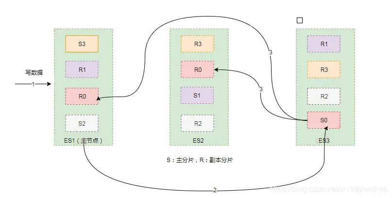
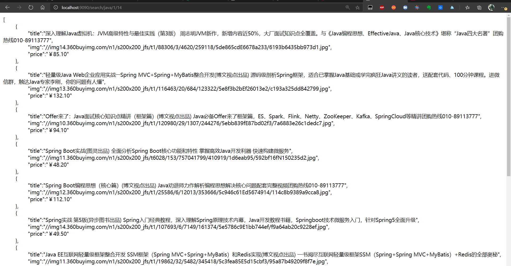
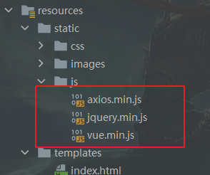
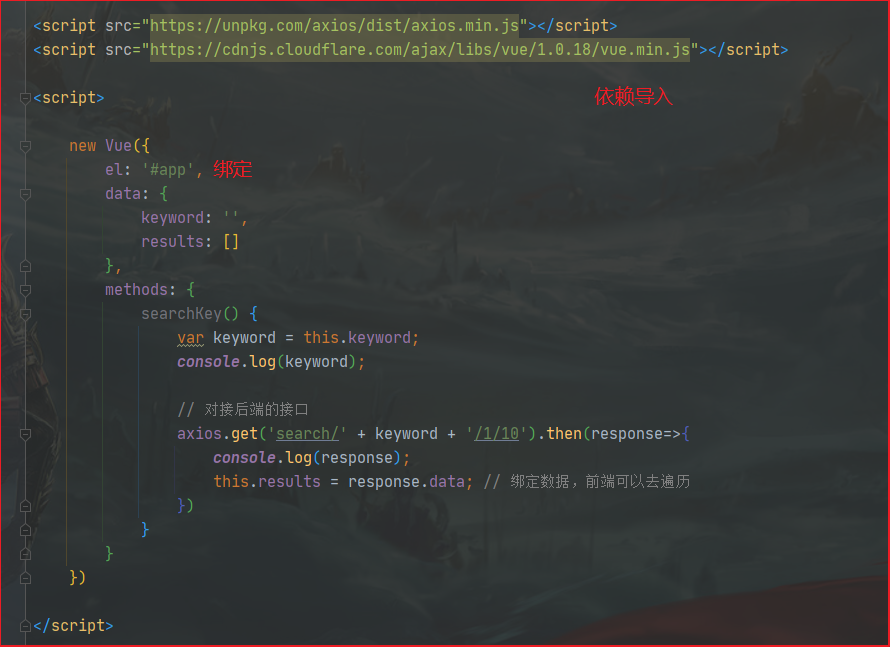
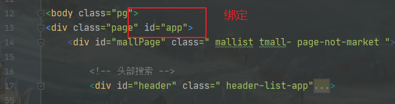
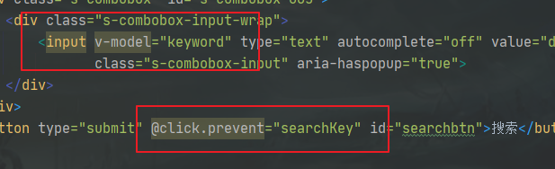
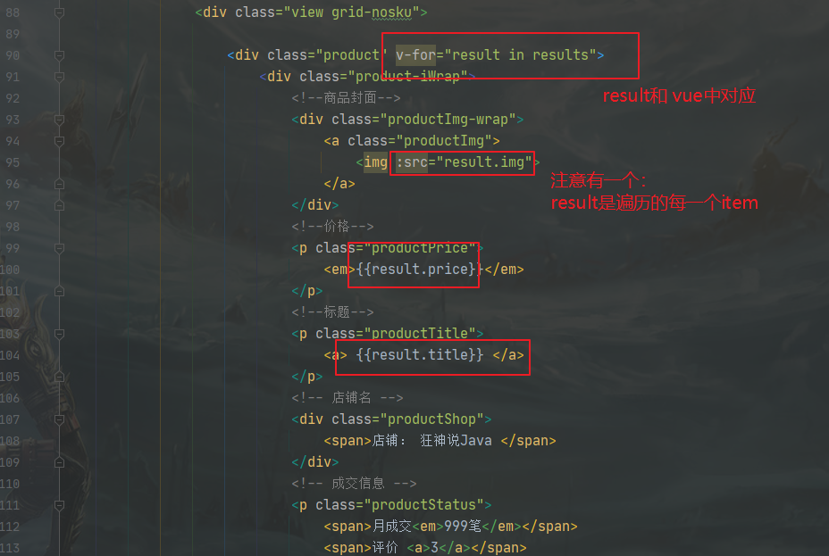
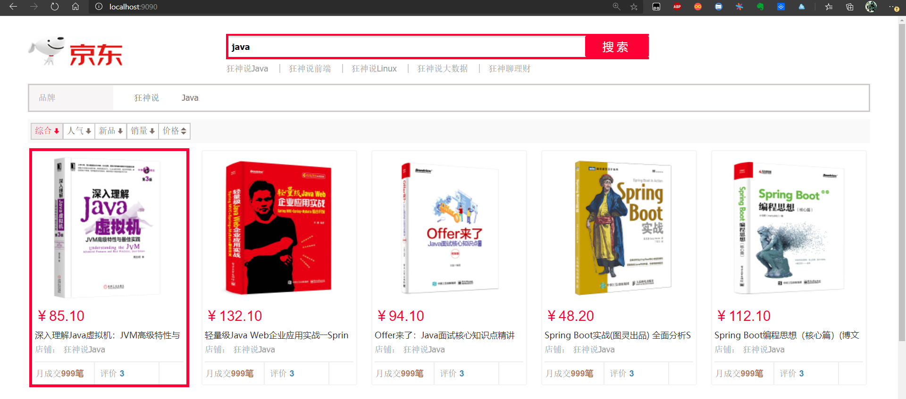
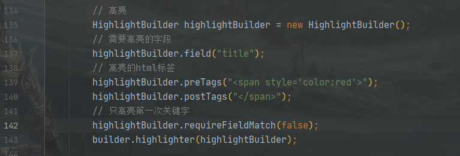
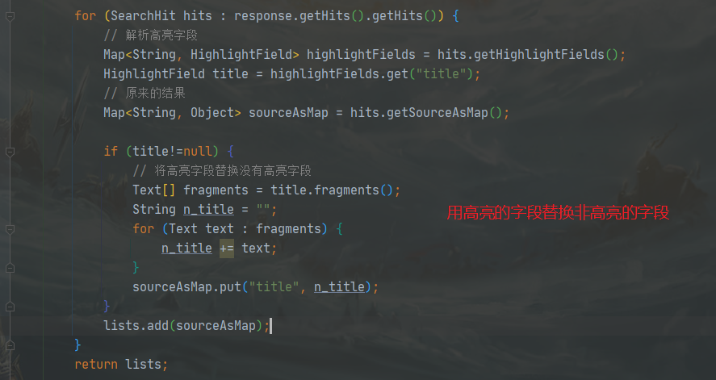

# What is ElasticSearch

我们的应用经常需要添加检索功能，开源的 ElasticSearch 是目前**全文搜索引擎**的 首选。

Elasticsearch是一个**开源**的**高可扩展**的**分布式**搜索服务，提供Restful API，底层基于Lucene，采用 多shard(分片)的方式保证数据安全，并且提供自动resharding的功能，github 等大型的站点也是采用了ElasticSearch作为其搜索服务。


# ES与Solr的区别


### ElasticSearch简介

开源的、高可扩展、分布式搜索框架。

适用于大数据。


### Solr简介

Java开发、基于Lucence

用POST方法向Solr服务器发送一个描述Field及其内容的XML文档，Solr根据xml文档添加、删除、更新索引。

用GET请求，对Solr返回Xml、Json等格式的查询结果进行解析，组织页面布局。Solr不提供构建UI的功能，Solr提供了一个管理界面，通过管理界面可以查询Solr的配置和运行情况。


不管是 Solr 还是 Elasticsearch 底层都是依赖于 Lucene，而 Lucene 能实现全文搜索主要是因为它实现了**倒排索引**的查询结构。

**如何理解倒排索引呢？假如现有三份数据文档，文档的内容如下分别是：**

1. Java is the best programming language.
2. PHP is the best programming language.
3. Javascript is the best programming language.


**正排索引：**


**倒排索引：**


**倒排索引(Inverted Index)**：倒排索引是实现“单词-文档矩阵”的一种具体存储形式，通过倒排索引，可以根据单词快速获取包含这个单词的文档列表。倒排索引主要由两个部分组成：“单词词典”和“倒排文件”。


## 什么是ELK

ElasticSearch + Logstash + Kibana

- Logstash是ELK中的中央数据流引擎，用于从不同目标（文件/数据存储/MQ）收集不同的格式数据，经过过滤后支持输出到不同目的地（文件/MQ/Redis/Es/Kafka等）。
- Kibana可以将ES的数据通过友好的界面展示出来，提供数据实时分析功能


# ElasticSearch 安装

1. #### 第一步 拉取镜像

```bash
docker pull elasticsearch:7.8.0
```

2. #### 第二步 运行Elasticsearch

```bash
# -p 代表映射端口，这里我们将es的9200和9300这两个需要用到的端口映射成相同的外部端口号，discovery.type这边使用的是开发环境的配置，single-node代表是单节点非集群，--name 给容器取一个别名。
sudo docker run -p 9200:9200 -p 9300:9300 -e "discovery.type=single-node" elasticsearch:7.8.0
```

3. #### 第三步 检查是否运行成功

访问 `http://localhost:9200` ，默认情况下无法外网访问。可以另开`SSH`窗口，运行`curl http://localhost:9200`

4. #### 第四步 守护进程运行 (后台运行)

```bash
sudo docker run -itd -p 9200:9200 -p 9300:9300 -e "discovery.type=single-node" elasticsearch:7.8.0
```


# Kibana 安装

一、拉取镜像

```txt
docker pull docker.elastic.co/kibana/kibana:7.8.0
```


二、启动

```bash
docker run --link YOUR_ELASTICSEARCH_CONTAINER_NAME_OR_ID:elasticsearch -p 5601:5601 {docker-repo}:{version}

docker run --link es01:elasticsearch -p 5601:5601 kibana:7.8.0
```


三、测试访问

IP:5601


四、控制台代码编写


# ES-head 安装

> 可视化界面

**一、安装**

```bash
docker run --name es-head -p 9100:9100 mobz/elasticsearch-head:5
```


**二、支持跨域**

在容器 running下，进入容器

```bash
docker exec -it es01 bash
```


编辑 `config/elasticsearch.yml`

```yml
http.cors.enabled: true
http.cors.allow-origin: "*"
```


> 问题：数据浏览406

字符编码格式错误！


解决办法：docker

- ```bash
    docker exec -it ... /bin/bash # 进入容器
    ```

- ```
    cd _site
    ```

- ```bash
    vim vendor.js
    ```

- 将 6886行 contentType: "application/x-www-form-urlencoded" 修改为 contentType: "application/json;charset=UTF-8"
    然后再将 7574行 var inspectData = s.contentType === "application/x-www-form-urlencoded" && 修改为 var inspectData = s.contentType === "application/json;charset=UTF-8" &&

- 刷新浏览器


### ES-head的作用

我们一般只用ES-head来查看数据，不做查询。因为查询是用Json的，ES-head中编写Json不方便。

查询就用Kibana，查询更加方便。


# ES 核心

知道了如何使用 ES 之后， 就来学习一下ES的数据结构、实现原理吧

在一个集群中有N个节点。每个节点处于不同的服务器上。

在每一个节点上有一个主分片，每一个主分片至少有一个复制分片，至多有N-1个复制分片，分布在非本机的其他节点中。

主分片用来执行写操作，复制分片用来执行读操作。当一个索引（indices）被创建后，主分片数量不能增加（不然hash得全部重新计算），复制分片可以调整。




如上图，总共有三个节点。每一个节点上有S主分片，同颜色的复制分片散落在集群中的其他节点上。

1. 客户端向 ES1节点（协调节点）发送写请求，通过路由计算公式得到值为0，则当前数据应被写到主分片 S0 上。

2. ES1 节点将请求转发到 S0 主分片所在的节点 ES3，ES3 接受请求并写入到磁盘。

3. 并发将数据复制到两个副本分片 R0 上，其中通过乐观并发控制数据的冲突。一旦所有的副本分片都报告成功，则节点 ES3 将向协调节点报告成功，协调节点向客户端报告成功。


==集群、节点、索引、类型、文档、分片、映射== 都是什么？

> elasticsearch是面向文档的。以下给出了关系型数据库和 ES的客观对比！

| RDB                 | ES                 |
| ------------------- | ------------------ |
| 数据库 （database） | 索引（indices）    |
| 表（tables）        | 类型 （types）     |
| 行（rows）          | 文档 （documents） |
| 字段（colums）      | fields             |


1、索引

2、字段类型

3、文档

4、Lucence索引（倒排索引、分片）


# IK分词器

用于中文分词


### 手动压缩包 安装

一、安装

https://github.com/medcl/elasticsearch-analysis-ik


二、解压到ES的plugin下


### docker install IK

```shell
# 进入容器es
docker exec -it es /bin/bash
# 使用bin目录下的elasticsearch-plugin install安装ik插件
bin/elasticsearch-plugin install https://github.com/medcl/elasticsearch-analysis-ik/releases/download/v7.8.0/elasticsearch-analysis-ik-7.8.0.zip
# 再重启下容器
docker restart es
```


上面的docker直接安装速度会很慢，可以将zip文件拷贝到docker容器中

```bash
# ik 是 解压后的文件夹
docker cp ik es01:/usr/share/elasticsearch/plugins/
```


### 验证分词器效果

```shell
# 增加一个叫test001的索引
curl -X PUT http://localhost:9200/test001
# 成功返回 {"acknowledged":true,"shards_acknowledged":true,"index":"test001"}

# ik_smart分词
curl -X POST \
'http://127.0.0.1:9200/test001/_analyze?pretty=true' \
-H 'Content-Type: application/json' \
-d '{"text":"我们是软件工程师","tokenizer":"ik_smart"}'

# ik_max_word分词
curl -X POST \
'http://127.0.0.1:9200/test001/_analyze?pretty=true' \
-H 'Content-Type: application/json' \
-d '{"text":"我们是软件工程师","tokenizer":"ik_max_word"}'
```


### 在Kibana中使用

- **ik_smart**


- **ik_max_word**


### 自定义关键词

观察  `狂神说`

因为没有一个字典会记录 `狂神说`，所以我们需要手动的添加一个包含 `狂神说`的字典，并配置的IK分词器中。


现在就可以直接识别 `狂神说`


# RESTFul 风格说明


| method | url地址                                         | 描述                   |
| ------ | ----------------------------------------------- | ---------------------- |
| PUT    | localhost:9200/索引名称/类型名称/文档id         | 创建文档（指定文档id） |
| POST   | localhost:9200/索引名称/类型名称                | 创建文档（随机文档id） |
| POST   | localhost:9200/索引名称/类型名称/文档id/_update | 修改文档               |
| DELETE | localhost:9200/索引名称/类型名称/文档id         | 删除文档               |
| GET    | localhost:9200/索引名称/类型名称/文档id         | 查询文档通过文档id     |
| POST   | localhost:9200/索引名称/类型名称/_search        | 查询所有数据           |

新版本中 已经不使用 类型名称 改用 _doc


> 测试

一、创建一个索引

```
PUT /索引名/类型名/文档id
{
	Json请求体
}
```


二、创建索引类型规则


# 常用注解 @Document @Field

```java
public @interface Document {
 
String indexName(); //索引库的名称，个人建议以项目的名称命名
 
String type() default ""; //类型，个人建议以实体的名称命名
 
short shards() default 5; //默认分区数
 
short replicas() default 1; //每个分区默认的备份数
 
String refreshInterval() default "1s"; //刷新间隔
 
String indexStoreType() default "fs"; //索引文件存储类型
}
```


```java
public @interface Field {
 
FieldType type() default FieldType.Auto; //自动检测属性的类型，可以根据实际情况自己设置
 
FieldIndex index() default FieldIndex.analyzed; //默认情况下分词，一般默认分词就好，除非这个字段你确定查询时不会用到
 
DateFormat format() default DateFormat.none; //时间类型的格式化
 
String pattern() default ""; 
 
boolean store() default false; //默认情况下不存储原文
 
String searchAnalyzer() default ""; //指定字段搜索时使用的分词器
 
String indexAnalyzer() default ""; //指定字段建立索引时指定的分词器
 
String[] ignoreFields() default {}; //如果某个字段需要被忽略
 
boolean includeInParent() default false;
}
```


# API讲解

零、Autowierd

```java
@Autowired
@Qualifier("restHighLevelClient")
private RestHighLevelClient client;
```


一、创建索引

```java
@Test
void testCreateIndex() throws IOException {
   // 1、创建索引请求
   CreateIndexRequest request = new CreateIndexRequest("kicc_index");
   // 2、客户端执行请求IndicesClient，请求后获得响应
   CreateIndexResponse createIndexResponse = client.indices().create(request, RequestOptions.DEFAULT);

   System.out.println(createIndexResponse);
}
```


二、判断索引是否存在

```java
/**
 * 判断索引是否存在
 * @throws IOException
 */
@Test
void testIndexExist() throws IOException {
   GetIndexRequest request = new GetIndexRequest("kicc_index");
   boolean exists = client.indices().exists(request, RequestOptions.DEFAULT);
   System.out.println(exists?"索引存在":"索引不存在");
}
```


三、插入文档

```java
/**
 * 测试插入文档
 * 1、创建Index请求
 * 2、设置请求的Id，超时
 * 3、.source方法放入Json
 * 4、用client发送请求
 */
@Test
void testAddDocument() throws IOException {
   User user = new User("Kicc", 23);

   // 创建请求，ES中都是用Request
   IndexRequest request = new IndexRequest("kicc_index");

   // 规则  put /kicc_index/_doc/1
   request.id("1");
   request.timeout(TimeValue.timeValueSeconds(1));

   // 将我们的数据放入请求 Json; 导入 fastjson
   IndexRequest source = request.source(JSON.toJSONString(user), XContentType.JSON);

   // 客户端发送请求，获取响应结果
   IndexResponse index = client.index(request, RequestOptions.DEFAULT);

   System.out.println(index.getIndex());
   System.out.println(index.status());
   System.out.println(index.toString());
   System.out.println(index.getResult());
}
```


四、测试文档存在与否

```java
/**
 * 测试文档存在与否
 * @throws IOException
 */
@Test
void testIsExist() throws IOException {
   // 返回Get的Request
   GetRequest getRequest = new GetRequest("kicc_index", "1");

   // 不获取返回的 _source 的上下文 （不设置也可以）
   getRequest.fetchSourceContext(new FetchSourceContext(false));

   boolean exists = client.exists(getRequest, RequestOptions.DEFAULT);
   System.out.println(exists);
}
```


五、测试文档获取：根据id

```java
/**
 * 测试文档获取：根据id
 * 1、获取Get请求
 * 2、client发送get请求
 * 3、调用结果的各种返回：getSourceAsString
 */
@Test
void testGetDocument() throws IOException {
   GetRequest getRequest = new GetRequest("kicc_index", "2");
   GetResponse documentFields = client.get(getRequest, RequestOptions.DEFAULT);
   String sourceAsString = documentFields.getSourceAsString();
   System.out.println(sourceAsString);
   System.out.println(documentFields);
}
```


六、测试更新文档

```java
/**
 * 测试更新文档
 * 1、获取Update请求
 * 2、设置超时
 * 3、.doc方法添加Json字符串 （实际调用了.source()方法)
 * 4、client发送更新请求
 */
@Test
void testUpdateDocument() throws IOException {
   UpdateRequest updateRequest = new UpdateRequest("kicc_index", "1");
   User user = new User("凯哥", 18);

   // 超过一秒就不执行
   updateRequest.timeout("1s");
   updateRequest.doc(JSON.toJSONString(user), XContentType.JSON);

   UpdateResponse update = client.update(updateRequest, RequestOptions.DEFAULT);
   System.out.println(update);

   testGetDocument();

}
```


七、测试删除文档

```java
/**
 * 测试删除文档
 * 1、delete请求
 * 2、client发送删除请求
 */
@Test
void testDeleteDocument() throws IOException {
   DeleteRequest deleteRequest = new DeleteRequest("kicc_index", "1");
   deleteRequest.timeout("1s");

   DeleteResponse deleteResponse = client.delete(deleteRequest, RequestOptions.DEFAULT);
   System.out.println(deleteResponse);

}
```


八、大批量的插入数据

```java
    /**
    * 大批量的插入数据
    * 1、创建bulk请求
    * 2、设置超时（根据实际请求，可以设置大一点）
    * 3、循环 add加入：每一个都是Index请求；请求中添加Json字符串
    * 4、client发送批量请求
    */
   @Test
   void testBulkRequest() throws IOException {
      BulkRequest bulkRequest = new BulkRequest("kicc_index");
      bulkRequest.timeout("10s");

      ArrayList<User> users = new ArrayList<>();
      users.add(new User("Kicc", 12));
      users.add(new User("Kicc", 13));
      users.add(new User("Kicc", 14));
      users.add(new User("Jaya", 15));
      users.add(new User("Jaya", 16));
      users.add(new User("Jaya", 18));

       // 创建批量数据
      for (int i = 0; i < users.size() ; i++) {
         bulkRequest.add(
               new IndexRequest(ESCont.ES_INDEX)
                     .id(""+(i+1))
                     .source(JSON.toJSONString(users.get(i)), XContentType.JSON)
         );
      }

      // 批量删除
//    for (int i = 0; i < 6; i++) {
//       bulkRequest.add(new DeleteRequest(ESCont.ES_INDEX, ""+(i+1)));
//    }
		// 发送请求
      BulkResponse bulkResponse = client.bulk(bulkRequest, RequestOptions.DEFAULT);
      System.out.println(bulkResponse.hasFailures());
   }
```


九、查询

```java
    /**
    * 查询
    * SearchRequest 搜索请求
    * SearchSourceBuilder 条件构造
    * HighlightBuilder 构建高亮
    * TermQueryBuilder 精确查询
    * MatchAllQueryBuilder 查询全部
    * xxx QueryBuilder 对应各类查询
    * @throws IOException
    */
   @Test
   void testSearch() throws IOException {
      SearchRequest searchRequest = new SearchRequest(ESCont.ES_INDEX);

      // 构建搜索条件
      SearchSourceBuilder sourceBuilder = new SearchSourceBuilder();
      
      // 查询条件 我们使用QueryBuilders 工具 来实现
      // termQuery：精确查询
      // matchAllQuery：查询全部
//    TermQueryBuilder queryCondition = QueryBuilders.termQuery("age", "15");
      MatchAllQueryBuilder queryCondition = QueryBuilders.matchAllQuery();

      // Builder 根据查询条件  查询
      sourceBuilder.query(queryCondition);

      // 超时设置
      sourceBuilder.timeout(new TimeValue(60, TimeUnit.SECONDS));

      // 添加 查询条件 到 请求
      searchRequest.source(sourceBuilder);

      // 发送请求
      SearchResponse searchResponse = client.search(searchRequest, RequestOptions.DEFAULT);

      // 获得结果
      String s = JSON.toJSONString(searchResponse.getHits());
      System.out.println(s);
      System.out.println("=============================");

      for (SearchHit hit : searchResponse.getHits().getHits()) {
         System.out.println(hit.getSourceAsMap());
      }

   }
```


# 京东实战

## 1、创建SpringBoot项目。进行必要配置。添加前端模板


## 2、完成数据采集：爬取京东数据

==将工具类注册到Spring中==

```java
package com.kicc.utils;

import com.kicc.vo.Content;
import org.jsoup.Jsoup;
import org.jsoup.nodes.Document;
import org.jsoup.nodes.Element;
import org.jsoup.select.Elements;
import org.springframework.stereotype.Component;

import java.io.IOException;
import java.net.MalformedURLException;
import java.net.URL;
import java.util.ArrayList;
import java.util.List;

/**
 * @author Kicc
 * @date 20/8/16 下午 9:27
 */
@Component
public class HtmlParseUtils {

    public static void main(String[] args) throws IOException {
        new HtmlParseUtils().parseJD("Redis").stream().forEach(System.out::println);
    }


    public List<Content> parseJD(String keyword) throws IOException {
        String url = "https://search.jd.com/Search?keyword=" + keyword;
        Document parse = Jsoup.parse(new URL(url), 30000);

        Element j_goodsList = parse.getElementById("J_goodsList");

        Elements lis = j_goodsList.getElementsByTag("li");

        List<Content> contents = new ArrayList<>();

        for (Element li : lis) {
            String img = li.getElementsByTag("img").eq(0).attr("src");
            String price = li.getElementsByClass("p-price").eq(0).text();
            String title = li.getElementsByClass("p-name").eq(0).text();

            Content content = new Content(title, img, price);

            contents.add(content);

        }

        return contents;
    }

}
```


## 3、添加Controller，测试把京东数据 ==> 爬取 ==> 转存到ES


### 3.1 添加Service

利用封装好的爬取Utils，将爬取得到的数据转存到ES中。

```java
package com.kicc.service;

import com.alibaba.fastjson.JSON;
import com.kicc.utils.HtmlParseUtils;
import com.kicc.vo.Content;
import org.elasticsearch.action.bulk.BulkRequest;
import org.elasticsearch.action.bulk.BulkResponse;
import org.elasticsearch.action.index.IndexRequest;
import org.elasticsearch.client.RequestOptions;
import org.elasticsearch.client.RestHighLevelClient;
import org.elasticsearch.common.xcontent.XContentType;
import org.springframework.beans.factory.annotation.Autowired;
import org.springframework.stereotype.Service;

import java.io.IOException;
import java.util.List;

/**
 * @author Kicc
 * @date 20/8/16 下午 10:04
 * 业务编写
 */
@Service
public class ContentService {

    @Autowired
    private RestHighLevelClient restHighLevelClient;

    @Autowired
    private HtmlParseUtils htmlParseUtils;

    public Boolean saveJD(String keyword) throws IOException {
        // 批量请求
        BulkRequest bulkRequest = new BulkRequest("jd_goods");
        bulkRequest.timeout("2m");

        // 爬取得到的数据
        List<Content> contents = htmlParseUtils.parseJD(keyword);
		
        // 装入数据
        for (int i = 0; i < contents.size(); i++) {
            System.out.println(contents.get(i));
            bulkRequest.add(
                    new IndexRequest("jd_goods")
                            .id(""+(i+1))
                            .source(JSON.toJSONString(contents.get(i)), XContentType.JSON)
            );
        }
	
        // 发送请求给ES
        BulkResponse bulk = restHighLevelClient.bulk(bulkRequest, RequestOptions.DEFAULT);
        System.out.println(bulk.hasFailures());
		
        // 返回Success/Failure
        return !bulk.hasFailures();

    }

}
```


### 3.2 添加Controller

```java
@Controller
public class ContentController {

    @Autowired
    private ContentService contentService;

    // 根据关键字转存数据
    @ResponseBody
    @RequestMapping(value = "/parse/{keyword}", method = RequestMethod.GET)
    public Boolean parse(@PathVariable("keyword") String keyword) throws IOException {

        return contentService.saveJD(keyword);
    }
}
```


## 4、测试查询

从ES中查询

```java
public List<Map<String, Object>> search(String keyword, int pageNo, int pageSize) throws IOException {

    if (pageNo<0) {
        pageNo = 0;
    }

    if (pageSize<1) {
        pageSize = 1;
    }

    SearchRequest searchRequest = new SearchRequest("jd_goods");

    // 构建搜索条件
    SearchSourceBuilder builder = new SearchSourceBuilder();

    // 分页
    builder.from(pageNo);
    builder.size(pageSize);

    // 查询条件 我们使用 QueryBuilders 工具来实现
    // termQuery：精确查询
    // matchAllQuery：查询全部
    TermQueryBuilder termQueryBuilder = QueryBuilders.termQuery("title", keyword);
    builder.query(termQueryBuilder);
    builder.timeout(new TimeValue(60, TimeUnit.SECONDS));

    // 执行搜索
    searchRequest.source(builder);
    SearchResponse response = restHighLevelClient.search(searchRequest, RequestOptions.DEFAULT);

    // 解析结果
    List<Map<String, Object>> lists = new ArrayList<Map<String, Object>>();

    for (SearchHit documentFields : response.getHits()) {
        lists.add(documentFields.getSourceAsMap());
    }
    return lists;

}
```


添加Controller

```java
@ResponseBody
@RequestMapping(value = "/search/{keyword}/{pageNo}/{pageSize}", method = RequestMethod.GET, produces = "application/json; charset=utf-8")
public Object search(@PathVariable("keyword") String keyword,
                                        @PathVariable("pageNo") int pageNo,
                                        @PathVariable("pageSize") int pageSize) throws Exception {
    if (pageNo<0) {
        throw new Exception("分页起始位置需要大于0");
    }

    if (pageSize<=0) {
        throw new Exception("分页大小建议大于等于1");
    }

    List<Map<String, Object>> search = contentService.search(keyword, pageNo, pageSize);
    Object s = JSON.toJSON(search);

    return s;
}
```





## 5、连接前端Vue

### 5.1、导入js依赖




### 5.2、修改html










### 5.3、测试效果




## 6、添加搜索关键字高亮

**给搜索添加高亮**




**解析高亮字段**




**效果**


# 面试问题

## 详细描述一下Elasticsearch更新和删除文档的过程。

- 删除和更新也都是写操作，但是Elasticsearch中的文档是不可变的，因此不能被删除或者改动以展示其变更；
- 磁盘上的每个段都有一个相应的.del文件。当删除请求发送后，文档并没有真的被删除，而是在.del文件中被标记为删除。该文档依然能匹配查询，但是会在结果中被过滤掉。当段合并时，在.del文件中被标记为删除的文档将不会被写入新段。
- 在新的文档被创建时，Elasticsearch会为该文档指定一个版本号，当执行更新时，旧版本的文档在.del文件中被标记为删除，新版本的文档被索引到一个新段。旧版本的文档依然能匹配查询，但是会在结果中被过滤掉。


