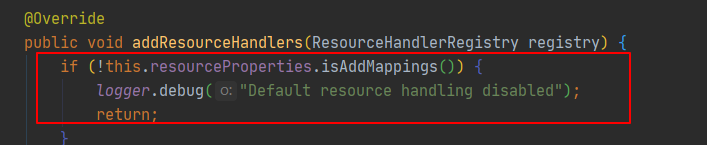
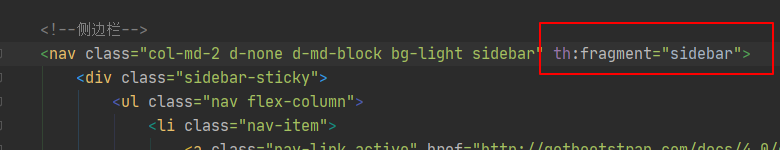
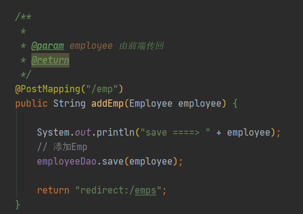

# 1 微服务

微服务是一种架构风格。 力求：**高内聚，低耦合。**

## 1.1 对比最原始的架构

- all in one:

    这种架构方式，我们把所有的e


## 1.2 特性

1. “组件化”， “多服务”

    - 组件是一个可以独立更换和升级的软件单元。
    - 服务可以单独部署，如果一个应用系统**[4]**由在单个进程中的多个软件库所组成，那么对任一组件做一处修改，都不得不重新部署整个应用系统。
    - 使用服务部署，比起进程内调用，远程调用更加昂贵。

2. **围绕“业务功能”组织团队**

    

    1. 按照智能分：容易产生孤岛式
    2. 按照业务功能（business capability)划分，

3. **“做产品”而不是“做项目”**

4. **“智能端点”与“傻瓜管道”** （smart endpoint and dumb pipes)

5. 


# 2 SpringBoot 原理


自动配置：


**pom.xml**

- spring-boot-dependencies: 核心依赖在父工程中。
- 我们在写或者引入SpringBoot依赖的时候，不需要指定版本。因为有仓库。


## **2.1 启动器**


```xml
<dependency>
    <groupId>org.springframework.boot</groupId>
    <artifactId>spring-boot-starter</artifactId>
</dependency>
```

就是SpringBoot的启动场景。

- 比如spring-boot-starter-web， 他会帮助我们自动导入web应用所需要的环境依赖。
- springboot会将所有的功能场景，都变成一个个的启动器
- 我们需要使用什么功能，就只需要找到对应的启动器就可以了。


## **2 .2 主程序**


```java
//@SpringBootApplication ： 标注这个类是一个springboot的应用
// same as @Configuration @EnableAutoConfiguration @ComponentScan
@SpringBootApplication 
public class Springboot01HelloApplication {

    public static void main(String[] args) {
        // 将springboot应用启动
        SpringApplication.run(Springboot01HelloApplication.class, args);
    }

}
```


## **2.3 注解：**


> ## @SpringBootApplication


作用：标注在某个类上说明这个类是SpringBoot的主配置类 ， SpringBoot就应该运行这个类的main方法来启动SpringBoot应用；

进入这个注解：可以看到上面还有很多其他注解！

 ```java
@SpringBootConfiguration
@EnableAutoConfiguration
@ComponentScan(
    excludeFilters = {@Filter(
    type = FilterType.CUSTOM,
    classes = {TypeExcludeFilter.class}
), @Filter(
    type = FilterType.CUSTOM,
    classes = {AutoConfigurationExcludeFilter.class}
)}
)
public @interface SpringBootApplication {
    // ......
}
 ```


> A single `@SpringBootApplication` annotation can be used to enable those three features, that is:
>
> - `@EnableAutoConfiguration`: enable [Spring Boot’s auto-configuration mechanism](https://docs.spring.io/spring-boot/docs/2.3.0.RELEASE/reference/html/using-spring-boot.html#using-boot-auto-configuration)
> - `@ComponentScan`: enable `@Component` scan on the package where the application is located (see [the best practices](https://docs.spring.io/spring-boot/docs/2.3.0.RELEASE/reference/html/using-spring-boot.html#using-boot-structuring-your-code))
> - `@Configuration`: allow to register extra beans in the context or import additional configuration classes


如果不想使用@SpringBootApplication注解 （一次性使用三个功能太多了）， 那么可以分开使用：

```java
package com.example.myapplication;

import org.springframework.boot.SpringApplication;
import org.springframework.context.annotation.ComponentScan
import org.springframework.context.annotation.Configuration;
import org.springframework.context.annotation.Import;

@Configuration(proxyBeanMethods = false)
@EnableAutoConfiguration
@Import({ MyConfig.class, MyAnotherConfig.class })
public class Application {

    public static void main(String[] args) {
            SpringApplication.run(Application.class, args);
    }

}
```

这里，就不直接使用@ComponentScan注解，而是换成了 @Import， 来显式的导入我们需要的组件！


> ## @ComponentScan

进入SpringBootApplication可以看到ComponentScan这个注解。它对应了XML配置中的元素。

作用：自动扫描并加载符合条件的组件或者bean ， 将这个bean定义加载到IOC容器中。**Scan**

这个注解再往下走，没有包含其他特殊的类了。


> ## @SpringBootConfiguration

@SpringBootApplication中另一个非常重要的注解。

作用：SpringBoot的配置类 ，标注在某个类上 ， 表示这是一个SpringBoot的配置类；

```java
@Configuration
public @interface SpringBootConfiguration {
    @AliasFor(
        annotation = Configuration.class
    )
    boolean proxyBeanMethods() default true;
}
```

再往上一级就是@Configuration，而@Configuration就熟悉了。再往上一级是@Component。也就是我们熟悉的Spring组件!

> 这里的 @Configuration，说明这是一个配置类 ，配置类就是对应Spring的xml 配置文件；
>
> 里面的 @Component 这就说明，启动类本身也是Spring中的一个组件而已，负责启动应用！


> ## @EnableAutoConfiguration

这个注解负责：**开启自动配置功能**。

以前我们需要自己配置的东西，而现在SpringBoot可以自动帮我们配置 ；@EnableAutoConfiguration 告诉SpringBoot开启自动配置功能，这样自动配置才能生效；

```java
@AutoConfigurationPackage
@Import(AutoConfigurationImportSelector.class)
public @interface EnableAutoConfiguration {

   String ENABLED_OVERRIDE_PROPERTY = "spring.boot.enableautoconfiguration";

   /**
    * Exclude specific auto-configuration classes such that they will never be applied.
    * @return the classes to exclude
    */
   Class<?>[] exclude() default {};

   /**
    * Exclude specific auto-configuration class names such that they will never be
    * applied.
    * @return the class names to exclude
    * @since 1.3.0
    */
   String[] excludeName() default {};

}
```


> ## @AutoConfigurationPackage：自动配置包


```Java
@Import(AutoConfigurationPackages.Registrar.class)
public @interface AutoConfigurationPackage {
}
```

@Import: Spring底层注解。给容器中导入一个组件；

AutoConfigurationPackages.Registrar.class： 将主启动类的所在包以及包下面所有子包里面的组件扫描的Spring容器中；


> @Import(AutoConfigurationImportSelector.class) : 给容器导入组件；


AutoConfigurationImportSelector：自动配置导入选择器，那么它会导入哪些组件的选择器呢？我们点击去这个类看源码：

1、这个类中有一个这样的方法

 getCandidateConfigurations

```java
/** 获得候选的配置
*/
protected List<String> getCandidateConfigurations(AnnotationMetadata metadata, AnnotationAttributes attributes) {
   List<String> configurations = SpringFactoriesLoader.loadFactoryNames(getSpringFactoriesLoaderFactoryClass(),
         getBeanClassLoader());
   Assert.notEmpty(configurations, "No auto configuration classes found in META-INF/spring.factories. If you "
         + "are using a custom packaging, make sure that file is correct.");
   return configurations;
}
```

2、这个方法又调用了  SpringFactoriesLoader 类的静态方法！我们进入SpringFactoriesLoader类loadFactoryNames() 方法


再往下追溯，可以发现

```java
public static List<String> loadFactoryNames(Class<?> factoryType, @Nullable ClassLoader classLoader) {
    String factoryTypeName = factoryType.getName();
    return (List)loadSpringFactories(classLoader).getOrDefault(factoryTypeName, Collections.emptyList());
}

private static Map<String, List<String>> loadSpringFactories(@Nullable ClassLoader classLoader) {
...
}
```

> 在loadSpringFactories方法中，多次出现了一个文件：**"META-INF/spring.factories"**,这个就是我们需要的spring配置工厂。


## 2.4 spring.factories 配置

在这个文件中，保存了大量的AutoConfiguration类。这些都是JavaConfig类。（代替Spring中的xml）

随便打开一个查看源码：**WebMvcAutoConfiguration**


所以，

- 自动配置真正实现是从classpath中搜寻所有的META-INF/spring.factories配置文件 ，
- 并将其中对应的 org.springframework.boot.autoconfigure. 包下的配置项，通过反射实例化为对应标注了 @Configuration的JavaConfig形式的IOC容器配置类 ， 
- 然后将这些都汇总成为一个实例并加载到IOC容器中。

**需要注意的是：**

spirng.factories中的这么多配置并不会全部生效，因为有注解@ConditionalOnClass，只要在条件合适的情况下**(导入了对应的starter）**才能生效!


## 2.5 Run 方法

>  SpringApplication

**这个类主要做了以下四件事情：**(重要)

1、推断应用的类型是普通的项目还是Web项目

2、查找并加载所有可用初始化器 ， 设置到initializers属性中

3、找出所有的应用程序监听器，设置到listeners属性中

4、推断并设置main方法的定义类，找到运行的主类


# 3 Application.properties 配置

## 3.1 外部配置的优先级 （随着版本更新 可能会变化 目前是2.1.6）

1. [Devtools global settings properties](https://docs.spring.io/spring-boot/docs/2.1.6.RELEASE/reference/html/using-boot-devtools.html#using-boot-devtools-globalsettings) on your home directory (`~/.spring-boot-devtools.properties` when devtools is active).
2. [`@TestPropertySource`](https://docs.spring.io/spring/docs/5.1.8.RELEASE/javadoc-api/org/springframework/test/context/TestPropertySource.html) annotations on your tests.
3. `properties` attribute on your tests. Available on [`@SpringBootTest`](https://docs.spring.io/spring-boot/docs/2.1.6.RELEASE/api/org/springframework/boot/test/context/SpringBootTest.html) and the [test annotations for testing a particular slice of your application](https://docs.spring.io/spring-boot/docs/2.1.6.RELEASE/reference/html/boot-features-testing.html#boot-features-testing-spring-boot-applications-testing-autoconfigured-tests).
4. Command line arguments.
5. Properties from `SPRING_APPLICATION_JSON` (inline JSON embedded in an environment variable or system property).
6. `ServletConfig` init parameters.
7. `ServletContext` init parameters.
8. JNDI attributes from `java:comp/env`.
9. Java System properties (`System.getProperties()`).
10. OS environment variables.
11. A `RandomValuePropertySource` that has properties only in `random.*`.
12. [Profile-specific application properties](https://docs.spring.io/spring-boot/docs/2.1.6.RELEASE/reference/html/boot-features-external-config.html#boot-features-external-config-profile-specific-properties) outside of your packaged jar (`application-{profile}.properties` and YAML variants).
13. [Profile-specific application properties](https://docs.spring.io/spring-boot/docs/2.1.6.RELEASE/reference/html/boot-features-external-config.html#boot-features-external-config-profile-specific-properties) packaged inside your jar (`application-{profile}.properties` and YAML variants).
14. Application properties outside of your packaged jar (`application.properties` and YAML variants).
15. Application properties packaged inside your jar (`application.properties` and YAML variants).
16. [`@PropertySource`](https://docs.spring.io/spring/docs/5.1.8.RELEASE/javadoc-api/org/springframework/context/annotation/PropertySource.html) annotations on your `@Configuration` classes.
17. Default properties (specified by setting `SpringApplication.setDefaultProperties`).


## 3.2 application.yaml 配置 （建议）

POJO:

```java
public class Person {

    private String name;
    private List<String> hobbys;
    private int age;
    private String sex;
    private Dog dog;
    private String location;
    private Map<String, Object> maps;
```

```java
public class Dog {

    private String name;
    private int age;
```


application.yaml

```yaml
person:
  name: Kaige
  hobbys:
    - code
    - soccer
    - swim
  age: 23
  sex: male
  location: NB
  maps: {k1: v1, k2: v2}
  dog:
    name: 小黑
    age: 3
```

 

Then 添加注解

```java
@Component
@ConfigurationProperties(prefix = "person")
public class Person {

    private String name;
    private List<String> hobbys;
    private int age;
    private String sex;
    private Dog dog;
    private String location;
    private Map<String, Object> maps;
```

这样就能直接注入属性了！


同时，yaml还支持需要 ${} 占位符操作。比如 ${random.int} ${random.uuid}。可以在配置文件中完成这部分代码，就可以减少不必要的代码。


```yaml
debug: true # 用于查看哪些类生效，哪些不生效！
```


## 3.3 与spring.factories的联系

首先，spring.factories下的XxxAutoConfiguration类都有注解 @Configuration。表示这个是个配置类！

举例，

展开


- @Configuration：表示这是一个配置类
- @EnableConfigurationProperties：
    - ServierProperties：
    - 带有一个@ConfigurationProperties注解，表明能从.yaml中取配置。字段：port、address等就是application.yaml中可以配置的属性！
    - 
- @ContionalOnWebApplication：Spring的底层注解：根据不同的条件将某个Bean加载到应用上下文中。


## 3.4 ConditionalOnXxx


| @ConditionalOnProperty          | application.properties 或 application.yml 文件中 mybean.enable 为 true 才会加载 MyCondition 这个 Bean，如果没有匹配上也会加载，因为 matchIfMissing = true，默认值是 false。 |
| ------------------------------- | ------------------------------------------------------------ |
| **@ConditionalOnBean**          | 某个（另外的）Bean存在时加载                                 |
| **ConditionalOnMissingBean**    | 某个（另外的）Bean不存在时加载                               |
| @ConditionalOnClass             | 某个（另外的）类存在与classpath中加载                        |
| @ConditionalOnMissingClass      | 某个（另外的）类不存在与classpath中加载                      |
| @ConditionalOnExpression        | 多个复杂属性判断                                             |
| @ConditionalOnSingleCandidate   |                                                              |
| @ConditionalOnResource          | bean依赖的资源存在，比如logback.xml                          |
| @ConditionalOnJndi              | 只有指定的资源通过 JNDI 加载后才加载 bean                    |
| @ConditionalOnJava              | 只有运行指定版本的 Java 才会加载 Bean                        |
| @ConditionalOnWebApplication    | 只有运行在 web 应用里才会加载这个 bean                       |
| @ConditionalOnNotWebApplication |                                                              |
| @ConditionalOnCloudPlatform     | 特定的云平台下运行                                           |


## 3.5 自动装配的原理! （重点）

1. SpringBoot启动会加载大量的自动配置类。；
2. 查看需要的功能是否有在SpringBoot中默认写好的自动配置类中；
3. 再看自动配置类中到底配置了哪些组件；（只要我们需要的组件存在其中，我们就不需要再手动配置了）
4. 给容器中自动配置类添加组件的时候，会从properties类中获取某些属性。我们只需要再配置文件中指定这些属性的值即可；
    1. xxxAutoConfiguration：自动配置类；给容器添加组件
    2. xxxProperties：封装配置文件中的相关属性；
    3. 2 和 **application.yaml**的属性值相互对应。


# 4 JRS 303 校验

在Java类上添加注解 @Validated； 在需要校验的字段上添加 注解。

```java
@Component //注册bean
@ConfigurationProperties(prefix = "person")
@Validated  //数据校验
public class Person {
    @Email(message="邮箱格式错误") //name必须是邮箱格式    
    private String name;}
```


## 4.1 常用参数

```yaml

@NotNull(message="名字不能为空")
private String userName;
@Max(value=120,message="年龄最大不能查过120")
private int age;
@Email(message="邮箱格式错误")
private String email;

空检查
@Null       验证对象是否为null
@NotNull    验证对象是否不为null, 无法查检长度为1的字符串
@NotBlank   检查约束字符串是不是Null还有被Trim的长度是否大于0,只对字符串,且会去掉前后空格.
@NotEmpty   检查约束元素是否为NULL或者是EMPTY.
    
Booelan检查
@AssertTrue     验证 Boolean 对象是否为 true  
@AssertFalse    验证 Boolean 对象是否为 false  
    
长度检查
@Size(min=, max=) 验证对象（Array,Collection,Map,String）长度是否在给定的范围之内  
@Length(min=, max=) string is between min and max included.

日期检查
@Past       验证 Date 和 Calendar 对象是否在当前时间之前  
@Future     验证 Date 和 Calendar 对象是否在当前时间之后  
@Pattern    验证 String 对象是否符合正则表达式的规则
```


# 5 多环境切换

同一个application.yaml可以被放在多个不同的位置：

```xml
file:./config/   		根目录下的config文件夹  				优先级1
file:./			 		根目录									优先级2
classpath:/config/		resources 下的config目录				优先级3
classpath:/				resources目录							优先级4
```

环境的切换可以通过优先级高覆盖的方式进行。


```yaml
# 默认配置
server:
  port: 8081
spring:
# 选择 哪个环境
  profiles:
    active: dev

# 用---分割
---
server:
  port: 8082
spring:
  profiles: dev
---
server:
  port: 8083

spring:
  profiles: test
```


# 6 SpringBoot Web开发


## 6.1静态资源

WebMvcAutoConfiguration.java中：

```java
@Override
public void addResourceHandlers(ResourceHandlerRegistry registry) {
   if (!this.resourceProperties.isAddMappings()) {
      logger.debug("Default resource handling disabled");
      return;
   }
   Duration cachePeriod = this.resourceProperties.getCache().getPeriod();
   CacheControl cacheControl = this.resourceProperties.getCache().getCachecontrol().toHttpCacheControl();
   if (!registry.hasMappingForPattern("/webjars/**")) {
      customizeResourceHandlerRegistration(registry.addResourceHandler("/webjars/**")
            .addResourceLocations("classpath:/META-INF/resources/webjars/")
            .setCachePeriod(getSeconds(cachePeriod)).setCacheControl(cacheControl));
   }
   String staticPathPattern = this.mvcProperties.getStaticPathPattern();
   if (!registry.hasMappingForPattern(staticPathPattern)) {
      customizeResourceHandlerRegistration(registry.addResourceHandler(staticPathPattern)
            .addResourceLocations(getResourceLocations(this.resourceProperties.getStaticLocations()))
            .setCachePeriod(getSeconds(cachePeriod)).setCacheControl(cacheControl));
   }
}
```


> 1. webjars方式

涉及到一个webjars:

打开webjars官网 https://www.webjars.org/，可以通过maven的方式导入依赖。比如导入一个jquery，我们就能在jquery的jar包下找到   

```xml
 META-INF/resources/webjars/...
```

这样，在开启服务后，我们通过访问

```
localhost:8080/webjars/jquery/0.0.0/jquery.js
```

实现静态资源的访问。


> 2. properties方式


通过getStaticLocations()：


可以看到，总共有四种路径，都支持静态资源的访问。（classpath：指的就是resources目录）

同时，这几个路径有优先级区别。 resources > static > public 。

> > 通常来说，会在public下放公共的js，static放一些图片资源，resources：upload上传的文件。


> 3. 如果在application.yaml中定义了pattern路径，那么这个优先级是最高的。前面说的webjars和四种路径都失效了！




在.yaml设置为false就无法通过 1 和 2 的方式访问静态资源了。

> > 默认的staticPathPattern = "/**"


在类


下，所以可以在yaml中配置：


现在，所有的静态资源都通过 **/heeelo** 访问。

注意：不是说静态资源放在了 classpath: heeelo下，而是必须先通过 localhost:8080/heeelo/ 来访问静态资源。依然是原本的  resources > static >  public 的优先级顺序。

> > 设置静态资源位置
> >
> > spring.resources.static-locations

修改静态资源访问路径：


现在 可以访问heeelo目录下的静态资源了！ 而且优先级比resources还要高！

> 总结

**“spring.mvc.static-path-pattern”用于阐述HTTP请求地址，而“spring.resources.static-locations”则用于描述静态资源的存放位置。**


## 6.2 首页的定制

```java
WebMvcAutoConfiguration.java:
```


index.html可以放在任意静态资源目录下。但是不能放在template下直接访问。

>  在template目录下的所有页面，只能通过controller来跳转!
>
>  同时，需要模板引擎的支持。thymeleaf


# 7 模板引擎 Thymeleaf

导入Thymeleaf 3.x依赖：

```xml
<!--Thymeleaf 3.x。 不要用2.x-->
<dependency>
    <groupId>org.thymeleaf</groupId>
    <artifactId>thymeleaf-spring5</artifactId>
</dependency>

<dependency>
    <groupId>org.thymeleaf.extras</groupId>
    <artifactId>thymeleaf-extras-java8time</artifactId>
</dependency>
```


把html放在template下，通过controller跳转视图。


- 取值操作：

```xml
${value}
```

- 遍历

```java
model.addAttribute("users", Arrays.asList("user1", "user2"));
```

```html
<h5 th:each="user:${users}" th:text="${user}"></h5>
```


>  基础 语法 

- Simple expressions:
    - Variable Expressions: `${...}`
    - Selection Variable Expressions: `*{...}`
    - Message Expressions: `#{...}`
    - Link URL Expressions: `@{...}`
    - Fragment Expressions: `~{...}`
- Literals
    - Text literals: `'one text'`, `'Another one!'`,…
    - Number literals: `0`, `34`, `3.0`, `12.3`,…
    - Boolean literals: `true`, `false`
    - Null literal: `null`
    - Literal tokens: `one`, `sometext`, `main`,…
- Text operations:
    - String concatenation: `+`
    - Literal substitutions: `|The name is ${name}|`
- Arithmetic operations:
    - Binary operators: `+`, `-`, `*`, `/`, `%`
    - Minus sign (unary operator): `-`
- Boolean operations:
    - Binary operators: `and`, `or`
    - Boolean negation (unary operator): `!`, `not`
- Comparisons and equality:
    - Comparators: `>`, `<`, `>=`, `<=` (`gt`, `lt`, `ge`, `le`)
    - Equality operators: `==`, `!=` (`eq`, `ne`)
- Conditional operators: **（三元运算符，前端专用）**
    - If-then: `(if) ? (then)`
    - If-then-else: `(if) ? (then) : (else)`
    - Default: `(value) ?: (defaultvalue)`
- Special tokens:
    - No-Operation: `_`

All these features can be combined and nested:

```html
'User is of type ' + (${user.isAdmin()} ? 'Administrator' : (${user.type} ?: 'Unknown'))
```


# 8 MVC 配置原理

> If you want to keep those Spring Boot MVC customizations and make more [MVC customizations](https://docs.spring.io/spring/docs/5.2.6.RELEASE/spring-framework-reference/web.html#mvc) (interceptors, formatters, view controllers, and other features), you can add your own `@Configuration` class of type `WebMvcConfigurer` but **without** `@EnableWebMvc`.

默认原有MVC自动配置：


如果想定义一个自己的视图解析器：

```java
@Controller
public class MyMvcConfig implements WebMvcConfigurer {

    @Bean
    public ViewResolver myViewResolver() {
        return new MyViewResolver();
    }

    public static class MyViewResolver implements ViewResolver {
        @Override
        public View resolveViewName(String viewName, Locale locale) throws Exception {
            return null;
        }
    }
}
```

按照上面的描述：编写一个类，继承 WebMvcConfigurer，增加<font color='orange'>@Configuration</font>注解。


**But without @EnableWebMvc：**

添加了这个注解之后，默认的  WebMVCAutoConfiguration就全部失效了。

> 原因：
>
> @EnableWebMvc 导入了DelegatingWebMvcConfiguration
>
> DelegatingWebMvcConfiguration 继承了 WebMvcConfigurationSupport


如果存在WebMvcConfigurationSupport，那么整个WebMvcAutoConfiguration就会失效。


# 9 Web 开发

前端引入thymeleaf依赖：

```html
<html lang="en" xmlns:th="http://www.thymeleaf.org">
```


## 9.1 国际化

1. 配置 i18n文件


- 创建对应语言的properties文件，定义需要使用不同语言前端文本的字段（多语言）

- 在.html页面中配置 

    

2. 国际化文件配置

    这里涉及到SpringBoot对国际化的自动配置! 有一个类:<font color='cornflowerblue'>MessageSourceAutoConfiguration</font>.

    有属性spring.messages.basename = "messages"。设置成我们的路径：

    

3. 自定义 LocaleResolver 组件

    ```java
    public class MyLocaleResolver implements LocaleResolver {
    
    
        @Override
        public Locale resolveLocale(HttpServletRequest request) {
            // 接受来自前端的参数, lang = "zh_CN"
            String language = request.getParameter("lang");
    
            Locale locale = Locale.getDefault();
    
            if (!StringUtils.isEmpty(language)) {
                String[] s = language.split("_");
    
                locale = new Locale(s[0], s[1]);
            }
    
            return locale;
        }
    
        @Override
        public void setLocale(HttpServletRequest request, HttpServletResponse response, Locale locale) {
    
        }
    }
    ```

    - 在Spring中有一个国际化的Locale （区域信息对象）；里面有一个叫做LocaleResolver （获取区域信息对象）的解析器！

    

    看到默认里，初始化了AcceptHeaderLocaleResolver，实现了LocaleResolver。那我们也跟着这个来实现一个自己的 LocaleResovler。

4. 将自定义类注册到Spring容器：@Bean

    ```java
    @Configuration
    public class MyMvcConfig implements WebMvcConfigurer {
    
        @Bean
        public LocaleResolver localeResolver() {
            return new MyLocaleResolver();
        }
    }
    ```

    

5. 前端编写跳转方式

    ```html
    <a class="btn btn-sm" th:href="@{/index.html(lang=zh_CN)}">中文</a>
    <a class="btn btn-sm" th:href="@{/index.html(lang=en_US)}">English</a>
    ```

    跳转到index.html页面并附带参数，这个参数被MyLocaleResovler截获。

    

## 9.2 页面与Controller的交互

完成登录：

- 成功登录，跳转到dashboard
- 登录失败，提示用户名密码错误

> 1、前端表单


查看表单、按钮。添加

```html
<form class="form-signin" th:action="@{/user/login}">
```

点击登录后跳转的url： /usr/login。


> 2、后端controller

添加 Logincontroller：

```java
@Controller
public class LoginController {

    @RequestMapping("/user/login")
    public String login(@RequestParam("username") String username,
                        @RequestParam("password") String password,
                        Model model) {
        if (!StringUtils.isEmpty(username) && "123456".equals(password)) {
            return "dashboard";
        } else {
            // 登陆失败
            model.addAttribute("msg", "用户名或者密码错误！");
            return "index";
        }
    }

}
```

路由为刚才设置的 /usr/login，执行 login() 方法。 参数为从form接收的 username 和 password。继续回前端设置


> 3、前端参数传递

```html
<input type="text" name="username" class="form-control" required="" autofocus="" th:placeholder="#{login.username}">

<input type="password" name="password" class="form-control"  required="" th:placeholder="#{login.password}">
```

必须在 <input> 设置name，传递参数！

登录成功可以跳转到dashboard视图，登录失败则需要返回index视图，同时携带msg消息。

**如何显示这个msg？**

在 index.html页面 增加 消息的显示

```html
<p style="color: #ff0000" th:text="${msg}" th:if="${not #strings.isEmpty(msg)}"></p>
```

定义显示msg的条件：msg需要不为空，说明是尝试过登录的。

thymeleaf的条件判断语法：

- If-then: `(if) ? (then)`
- If-then-else: `(if) ? (then) : (else)`
- Default: `(value) ?: (defaultvalue)`

布尔运算符：

- Binary operators: `and`, `or`
- Boolean negation (unary operator): `!`, `not`

#strings. 是thymeleaf的string工具类。

```html
th:if="${not #strings.isEmpty(msg)}"
```


> 问题1：dashboard-url栏中出现了 表单信息

```html
http://localhost:8080/user/login?username=2018202110061&password=123456
```

因为直接返回的  dashboard 视图，所以会把信息附带在url中。

解决：<font color='orange'>加视图</font>

```java
    if (!StringUtils.isEmpty(username) && "123456".equals(password)) {
        return "redirect:/main.html";
    } else {
        // 登陆失败
        model.addAttribute("msg", "用户名或者密码错误！");
        return "index";
    }
}
```

将成功登录重定向到 main.html

同时在 自定义 MVC Config中添加视图：


这里的main.html可以用任意的字符串代替，取main也可以，甚至可以取dashboard。只要Controller和Configuration两者相互对应就可以。


> 问题2：直接在地址栏输入main.html也可以到dashboard

在Configuration中增加了视图控制后，现在不需要正确登录也能直接到dashboard.html页面了。

解决办法：<font color='orange'>加拦截器</font>

自定义拦截器： LoginHandlerInterceptor 实现 HandlerInterceptor接口

重写方法

```java
public boolean preHandle(HttpServletRequest request, HttpServletResponse response, Object handler) throws Exception {

	// 进行逻辑判断，如果ok就返回true，不行就返回false，返回false就不会处理请求
    return false;
}
```

**思考：如果登录成功会怎么样？**

> > 会有session！

所以只要request.getSession()能获取到session就可以了！<font color='red'>因此我们需要在登录成功的时候添加session。</font>


```html
session = <"loginUser", username>
```

- 编写拦截器:

```java
public class LoginHandlerInterceptor implements HandlerInterceptor {


    /**
     * 进行逻辑判断，如果ok就返回true，不行就返回false，返回false就不会处理请求
     * @param request
     * @param response
     * @param handler
     * @return
     * @throws Exception
     */
    @Override
    public boolean preHandle(HttpServletRequest request, HttpServletResponse response, Object handler) throws Exception {


        Object loginUser = request.getSession().getAttribute("loginUser");

        if (loginUser==null) {
            request.setAttribute("msg", "请先登录！");
            request.getRequestDispatcher("/index.html").forward(request, response);
            return false;
        } else {
            return true;
        }
    }
```

通过request.getSession().getAttribute() 获得对应的session，如果session存在，则返回true；否则跳转到index页面，并带一个msg消息！


- 配置拦截器

同样在自定义Configuration中，重写 addInterceptors 方法


1. 添加拦截器
2. 添加拦截的路径
3. 排除不需要拦截的资源、路径
    - /index.html   /
    - /user/login
    - 静态资源文件

效果如下：


> 回顾Spring中，request.getRequestDispatcher

- Web应用是  请求\响应 架构， 而request和response就是在服务器端生成的相应的两个对象，request能够获取客户端传递的参数以及相关的一些信息，而response就是给客户端相关的页面信息。

- request.getRequestDispatcher.forward(request.response) 表示将客户端的请求转向（forward）到getRequestDispatcher（）方法中参数定义的页面或者链接。

- ```
    说通俗点就是，当一个客户端的请求到这个页面后，不做处理或者不处理完，将请求转给另一个页面处理，然后再响应给客户端。
    ```


## 9.3 查询 + 前端展示

> dashboard.html 主要内容


包含：

- 导航栏
- 侧边栏
- 内容显示区域


> list.html 主要内容


包含：

- 导航栏
- 侧边栏
- 内容显示区域


两个页面除了内容显示区域不同之外，导航栏和侧边栏是一致的，因此代码冗余。提取出来到commoms。

> thymeleaf 中的 th:fragment 和 th:insert / replace 用于模板

创建 common/common.html

- 导航栏


- 侧边栏




dashboard.html 和 list.html 中使用


> 问题：将list.html 按照如下目录防止后，list.html无法访问common.html


点击员工管理，高亮员工管理按钮，且返回所有员工的信息。

1. 设置高亮 & 创建  路由跳转

    

2. EmployeeController

    ```java
    @Controller
    public class EmployeeController {
    
    
        @Autowired
        private EmployeeDao employeeDao;
    
        @RequestMapping("/emps")
        public String list(Model model) {
    
            Collection<Employee> employees = employeeDao.getAll();
            model.addAttribute("emps", employees);
    
            return "emps/list";
        }
    }
    ```

3. 前端显示数据

    


## 9.4 添加

> 1. 跳转controller，到添加信息的视图


- 增加 `添加员工` 按钮：


- 添加路由跳转


> > 它是一个按钮，当有跳转功能的时候，用 a 标签。

- 添加Controller


由于部门是 <select> ， 所以需要先把部门信息提取出来。 （性别就两项，不需要提取了）

add.html中，有一个添加信息的表单： action

其他前端内容不赘述，部门如何展示：


通过th:each 输出从controller取到的部门信息。

> 2. 提交表单内容， 写入数据库



表单提交的method=“post”，链接到此Controller，接受前端的employee各字段数据<font color='orange'>（保证前端每个input 的 name属性和 Employee类一致）</font>

添加成功后，返回list.html


## 9.5 更新

与添加类似，步骤总结：

1. 更新按钮，跳转路由

    ```html
    <a class="btn btn-sm btn-primary" th:href="@{/emp/} + ${emp.getId()}">
       编辑
    </a>
    ```

2. Controller接受前端id字段，跳转更新页面

    ```java
    @GetMapping("/emp/{id}")
    public String toUpdatePage(Model model, @PathVariable Integer id) {
    
        // 查询原来的员工数据
        Employee emp = employeeDao.getEmployeeById(id);
    
        model.addAttribute("emp", emp);
    
    
        // 查询部门信息，需要在前端进行展示
        Collection<Department> departments = departmentDao.getDepartments();
    
        model.addAttribute("depts", departments);
    
        return "emps/update";
    }
    ```

3. 更新页面表单展示带有的信息， action=更新路由 method="post"

    1. radio
    2. select
    3. action

4. 修改数据

    ```java
    @PostMapping("/updateEmp/{id}")
    public String updateEmp(Employee employee,  @PathVariable Integer id) {
        System.out.println("需要修改的employ 的 ID =" + id);
        employee.setId(id);
        employeeDao.save(employee);
    
        return "redirect:/emps";
    }
    ```

5. 返回list.html


## 9.6 修改


- 添加路由跳转

```html
<a class="btn btn-sm btn-danger" th:href="@{/delEmp/} + ${emp.getId()}">
   删除
</a>
```

- Controller删除数据

```java
@GetMapping("/delEmp/{id}")
public String deleteEmp(Model model, @PathVariable("id") Integer id) {

    employeeDao.deleteEmployeeById(id);
    return "redirect:/emps";
}
```


## 9.7 404 error

在template下创建error文件夹，放入404.html


## 9.8 注销


```java
@RequestMapping("/user/logout")
public String logout(HttpSession session) {
	// 干掉session
    session.invalidate();
    return "redirect:/index.html";
}
```


# 10 CommandLineRunner

> 在我们实际工作中，总会遇到这样需求，在项目启动的时候需要做一些初始化的操作，比如初始化线程池，提前加载好加密证书等。

 `CommandLineRunner`，`CommandLineRunner` 接口的 `Component` 会在所有 `Spring Beans `都初始化之后，`SpringApplication.run() `之前执行，非常适合在应用程序启动之初进行一些数据初始化的工作。


只需要实现CommandLineRunner 或者ApplicationRunner 接口。重写 run方法。 两个接口的区别是：

- CommandLineRunner. run(String... args)
- ApplicationRunner.run(ApplicationArguments args)


实现过程分三部分：

1. 实现CommandLineRunner接口
2. 添加Component注解
3. 添加Order注解


我们可以创建**多个**实现`CommandLineRunner`和`ApplicationRunner`接口的类。为了使他们按一定顺序执行，可以使用`@Order`注解或实现`Ordered`接口。


# 11 WebFlux 响应式编程


## 响应式编程 Reactive Programming

> 面向数据流和变化传播的编程范式


举例说明：

例如，在命令式编程环境中，a=b+c 表示将表达式的结果赋给 a，而之后改变 b 或 c 的值不会影响 a 。但在响应式编程中，a 的值会随着 b 或 c 的更新而更新。


**特点：**异步 +  事件驱动

我们以前编写的大部分都是阻塞类的程序，当一个请求过来时任务会被阻塞，直到这个任务完成后再返回给前端；响应式编程接到请求后只是提交了一个请求给后端，后端会再安排另外的线程去执行任务，当任务执行完成后再异步通知到前端。


# 12 ElasticSearch 整合


## 是什么

我们的应用经常需要添加检索功能，开源的 ElasticSearch 是目前全文搜索引擎的 首选。

Elasticsearch是一个分布式搜索服务，提供Restful API，底层基于Lucene，采用 多shard(分片)的方式保证数据安全，并且提供自动resharding的功能，github 等大型的站点也是采用了ElasticSearch作为其搜索服务。


## 基本概念

- **文档**：一个员工数据。
- **索引**：存储数据到ElasticSearch的过程。


## 常用注解 @Document @Field

```java
public @interface Document {
 
String indexName(); //索引库的名称，个人建议以项目的名称命名
 
String type() default ""; //类型，个人建议以实体的名称命名
 
short shards() default 5; //默认分区数
 
short replicas() default 1; //每个分区默认的备份数
 
String refreshInterval() default "1s"; //刷新间隔
 
String indexStoreType() default "fs"; //索引文件存储类型
}
```


```java
public @interface Field {
 
FieldType type() default FieldType.Auto; //自动检测属性的类型，可以根据实际情况自己设置
 
FieldIndex index() default FieldIndex.analyzed; //默认情况下分词，一般默认分词就好，除非这个字段你确定查询时不会用到
 
DateFormat format() default DateFormat.none; //时间类型的格式化
 
String pattern() default ""; 
 
boolean store() default false; //默认情况下不存储原文
 
String searchAnalyzer() default ""; //指定字段搜索时使用的分词器
 
String indexAnalyzer() default ""; //指定字段建立索引时指定的分词器
 
String[] ignoreFields() default {}; //如果某个字段需要被忽略
 
boolean includeInParent() default false;
}
```


## 问题

> 保证ES的版本与SpringBoot项目中的版本一致，否则无法连接。

如何修改版本依赖：


在pom.xml中增加对应依赖的版本，就会覆盖默认的版本。


根据官方文档

https://www.elastic.co/guide/en/elasticsearch/client/java-rest/current/java-rest-high-getting-started-initialization.html

我们首先需要创建一个对象，注入Bean。


目前的版本7.x.x 已经不怎么使用 Jest、原生的API，基本上都使用Rest API。源码中也为我们提供了几个对象：


- 查看第一个 BuilderConfiguration：


> 给了两个Bean，一些默认的配置都在这个类中构建。

- RestHighLevelClientConfiguration


> 我们常用的这个类构建自己的：例如官方文档中给出的第一个例子

```java
@Configuration
public class ElasticSearchConfig {

    /**
     * <bean id="restHighLevelClient" class="RestHighLevelClient"></>
     * @return
     */
    @Bean
    public RestHighLevelClient restHighLevelClient() {
        RestHighLevelClient client = new RestHighLevelClient(
                RestClient.builder(
                        new HttpHost("192.168.1.114", 9200, "http")
                )
        );
        return client;
    }

}
```

配置了RestHighLevelClient，上面的@ConditionalOnMissingBean注解就生效了。要是想用他默认的，bean的名称就是elasticsearchRestHighLevelClient， 而我们的对象叫 ：restHighLevelClient。

- 第三个：普通的RestClient


> 平时也不用这个 Low Level的API。


## ES-Java API 测试

**一、创建索引测试**

```java
@SpringBootTest
class KiccEsApiApplicationTests {

   @Autowired
   @Qualifier("restHighLevelClient")
   private RestHighLevelClient client;

   @Test
   void testCreateIndex() throws IOException {
      // 1、创建索引请求
      CreateIndexRequest request = new CreateIndexRequest("kicc_index");
      // 2、客户端执行请求IndicesClient，请求后获得响应
      CreateIndexResponse createIndexResponse = client.indices().create(request, RequestOptions.DEFAULT);

      System.out.println(createIndexResponse);
   }

}
```

打开 ES-head，连接ES，可以看到

```bash
docker run -p 9100:9100 mobz/elasticsearch-head:5
```


>  常用API

```java
package com.kicc;

import com.alibaba.fastjson.JSON;
import com.kicc.pojo.User;
import com.kicc.utils.ESCont;
import org.apache.lucene.util.QueryBuilder;
import org.elasticsearch.action.bulk.BulkRequest;
import org.elasticsearch.action.bulk.BulkResponse;
import org.elasticsearch.action.delete.DeleteRequest;
import org.elasticsearch.action.delete.DeleteResponse;
import org.elasticsearch.action.get.GetRequest;
import org.elasticsearch.action.get.GetResponse;
import org.elasticsearch.action.index.IndexRequest;
import org.elasticsearch.action.index.IndexResponse;
import org.elasticsearch.action.search.SearchRequest;
import org.elasticsearch.action.search.SearchResponse;
import org.elasticsearch.action.update.UpdateRequest;
import org.elasticsearch.action.update.UpdateResponse;
import org.elasticsearch.client.RequestOptions;
import org.elasticsearch.client.RestHighLevelClient;
import org.elasticsearch.client.indices.CreateIndexRequest;
import org.elasticsearch.client.indices.CreateIndexResponse;
import org.elasticsearch.client.indices.GetIndexRequest;
import org.elasticsearch.common.unit.TimeValue;
import org.elasticsearch.common.xcontent.XContentType;
import org.elasticsearch.index.query.MatchAllQueryBuilder;
import org.elasticsearch.index.query.QueryBuilders;
import org.elasticsearch.index.query.TermQueryBuilder;
import org.elasticsearch.search.SearchHit;
import org.elasticsearch.search.builder.SearchSourceBuilder;
import org.elasticsearch.search.fetch.subphase.FetchSourceContext;
import org.junit.jupiter.api.Test;
import org.springframework.beans.factory.annotation.Autowired;
import org.springframework.beans.factory.annotation.Qualifier;
import org.springframework.boot.test.context.SpringBootTest;

import java.io.IOException;
import java.util.ArrayList;
import java.util.concurrent.TimeUnit;

@SpringBootTest
class KiccEsApiApplicationTests {

   @Autowired
   @Qualifier("restHighLevelClient")
   private RestHighLevelClient client;

   @Test
   void testCreateIndex() throws IOException {
      // 1、创建索引请求
      CreateIndexRequest request = new CreateIndexRequest("kicc_index");
      // 2、客户端执行请求IndicesClient，请求后获得响应
      CreateIndexResponse createIndexResponse = client.indices().create(request, RequestOptions.DEFAULT);

      System.out.println(createIndexResponse);
   }

   /**
    * 判断索引是否存在
    * @throws IOException
    */
   @Test
   void testIndexExist() throws IOException {
      GetIndexRequest request = new GetIndexRequest("kicc_index");
      boolean exists = client.indices().exists(request, RequestOptions.DEFAULT);
      System.out.println(exists?"索引存在":"索引不存在");
   }

   /**
    * 测试插入文档
    * 1、创建Index请求
    * 2、设置请求的Id，超时
    * 3、.source方法放入Json
    * 4、用client发送请求
    */
   @Test
   void testAddDocument() throws IOException {
      User user = new User("Kicc", 23);

      // 创建请求，ES中都是用Request
      IndexRequest request = new IndexRequest("kicc_index");

      // 规则  put /kicc_index/_doc/1
      request.id("1");
      request.timeout(TimeValue.timeValueSeconds(1));

      // 将我们的数据放入请求 Json; 导入 fastjson
      IndexRequest source = request.source(JSON.toJSONString(user), XContentType.JSON);

      // 客户端发送请求，获取响应结果
      IndexResponse index = client.index(request, RequestOptions.DEFAULT);

      System.out.println(index.getIndex());
      System.out.println(index.status());
      System.out.println(index.toString());
      System.out.println(index.getResult());
   }

   /**
    * 测试存在与否
    * @throws IOException
    */
   @Test
   void testIsExist() throws IOException {
      // 返回Get的Request
      GetRequest getRequest = new GetRequest("kicc_index", "1");

      // 不获取返回的 _source 的上下文 （不设置也可以）
      getRequest.fetchSourceContext(new FetchSourceContext(false));

      boolean exists = client.exists(getRequest, RequestOptions.DEFAULT);
      System.out.println(exists);
   }

   /**
    * 测试文档获取：根据id
    * 1、获取Get请求
    * 2、client发送get请求
    * 3、调用结果的各种返回：getSourceAsString
    */
   @Test
   void testGetDocument() throws IOException {
      GetRequest getRequest = new GetRequest("kicc_index", "2");
      GetResponse documentFields = client.get(getRequest, RequestOptions.DEFAULT);
      String sourceAsString = documentFields.getSourceAsString();
      System.out.println(sourceAsString);
      System.out.println(documentFields);
   }

   /**
    * 测试更新文档
    * 1、获取Update请求
    * 2、设置超时
    * 3、.doc方法添加Json字符串 （实际调用了.source()方法)
    * 4、client发送更新请求
    */
   @Test
   void testUpdateDocument() throws IOException {
      UpdateRequest updateRequest = new UpdateRequest("kicc_index", "1");
      User user = new User("凯哥", 18);

      // 超过一秒就不执行
      updateRequest.timeout("1s");
      updateRequest.doc(JSON.toJSONString(user), XContentType.JSON);

      UpdateResponse update = client.update(updateRequest, RequestOptions.DEFAULT);
      System.out.println(update);

      testGetDocument();

   }

   /**
    * 测试删除文档
    * 1、delete请求
    * 2、client发送删除请求
    */
   @Test
   void testDeleteDocument() throws IOException {
      DeleteRequest deleteRequest = new DeleteRequest("kicc_index", "1");
      deleteRequest.timeout("1s");

      DeleteResponse deleteResponse = client.delete(deleteRequest, RequestOptions.DEFAULT);
      System.out.println(deleteResponse);

   }

   /**
    * 大批量的插入数据
    * 1、创建bulk请求
    * 2、设置超时（根据实际请求，可以设置大一点）
    * 3、循环 add加入：每一个都是Index请求；请求中添加Json字符串
    * 4、client发送批量请求
    */
   @Test
   void testBulkRequest() throws IOException {
      BulkRequest bulkRequest = new BulkRequest("kicc_index");
      bulkRequest.timeout("10s");

      ArrayList<User> users = new ArrayList<>();
      users.add(new User("Kicc", 12));
      users.add(new User("Kicc", 13));
      users.add(new User("Kicc", 14));
      users.add(new User("Jaya", 15));
      users.add(new User("Jaya", 16));
      users.add(new User("Jaya", 18));

      for (int i = 0; i < users.size() ; i++) {
         bulkRequest.add(
               new IndexRequest(ESCont.ES_INDEX)
                     .id(""+(i+1))
                     .source(JSON.toJSONString(users.get(i)), XContentType.JSON)
         );
      }

      // 批量删除
//    for (int i = 0; i < 6; i++) {
//       bulkRequest.add(new DeleteRequest(ESCont.ES_INDEX, ""+(i+1)));
//    }

      BulkResponse bulkResponse = client.bulk(bulkRequest, RequestOptions.DEFAULT);
      System.out.println(bulkResponse.hasFailures());
   }


   /**
    * 查询
    * SearchRequest 搜索请求
    * SearchSourceBuilder 条件构造
    * HighlightBuilder 构建高亮
    * TermQueryBuilder 精确查询
    * MatchAllQueryBuilder 查询全部
    * xxx QueryBuilder 对应各类查询
    * @throws IOException
    */
   @Test
   void testSearch() throws IOException {
      SearchRequest searchRequest = new SearchRequest(ESCont.ES_INDEX);

      // 构建搜索条件
      SearchSourceBuilder sourceBuilder = new SearchSourceBuilder();
      
      // 查询条件 我们使用QueryBuilders 工具 来实现
      // termQuery：精确查询
      // matchAllQuery：查询全部
//    TermQueryBuilder queryCondition = QueryBuilders.termQuery("age", "15");
      MatchAllQueryBuilder queryCondition = QueryBuilders.matchAllQuery();

      // Builder 根据查询条件  查询
      sourceBuilder.query(queryCondition);

      // 超时设置
      sourceBuilder.timeout(new TimeValue(60, TimeUnit.SECONDS));

      // 添加 查询条件 到 请求
      searchRequest.source(sourceBuilder);

      // 发送请求
      SearchResponse searchResponse = client.search(searchRequest, RequestOptions.DEFAULT);

      // 获得结果
      String s = JSON.toJSONString(searchResponse.getHits());
      System.out.println(s);
      System.out.println("=============================");

      for (SearchHit hit : searchResponse.getHits().getHits()) {
         System.out.println(hit.getSourceAsMap());
      }

   }

}
```


# X. 部署

>  依赖管理：Maven


> 开启防火墙端口 8080


## X.1 jar 包部署 （默认）

> 清理缓存 + 打包

```bash
mvn clean
mvn package
```

得到xxxx.jar


> 开启服务

```bash
nohup java -jar xxx.jar &
```


## X.2 war包部署


> 修改pom.xml


> 新增SpringBootServletInitializer实现类

```java
public class SpringBootStartApplication extends SpringBootServletInitializer {
    @Override
    protected SpringApplicationBuilder configure(SpringApplicationBuilder builder) {
        return builder.sources( RuoYiApplication.class) ;

    }

}
```

> 清理缓存 + 打包

```bash
mvn clean
mvn package
```

> 就war包放入tomcat/WEBAPPS


> 开启服务器本地tomcat服务

开启服务后，tomcat会自动在webapps目录下，生成对应的war包文件夹。

> 问题：无法通过ip：8080 直接访问，需要 /xxx

解决：加映射 <Host> 标签内

```bash
<Context path="/" docBase="/usr/local/tomcat/tomcat9/webapps/ruoyi" reloadable="false"></Context>
```


把webapps/ruoyi路径  映射到 /

这样再访问 ip:8080就能直接访问到ruoyi项目！


> 如果配置了前端，那么前后端的交互已经完成！
>
> 接下来，就是考虑多配置几台后端服务器来缓解压力！


## X.3 小集群

环境配置：

- 一台前端服务器：192.168.1.114
- 一台后端服务器A：192.168.1.115
- 一台后端服务器A：192.168.1.116


> 前端配置


增加命名为ruoyi的组：

- server1 ，配置流量权重为5；
- server2，配置流量权重为3；


- proxy_pass由原来的 http://192.168.1.115:8080/ 到 ruoyi


这样，通过访问前端 192.168.1.114:80，(前端去访问后台 192.168.1.115/116:8080) 就能实现所有功能。