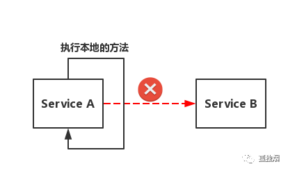

# Dubbo面试题 

喜欢问RPC框架

## 基础问题

### 为什么要用？

在微服务架构出来之前，大多数的应用都是一种 `all in one` 的形式呈现的。这种方式的架构在 服务、模块量少的情况下表现的很好。

但是，随着服务量越来越多、服务和服务之间的调用、依赖关系也变的更加复杂 ==> **诞生** ==> SOA (面向服务) 架构体系。于是出现：

- 服务提供
- 服务调用
- 连接处理
- 通信协议
- 序列化方式
- 服务发现
- 服务路由
- ...

Dubbo就是对这么多的行为进行一个封装，进行综合治理。


### 是什么？

根据官网的描述，Dubbo是一个Java开发的，高性能的RPC框架。

提供了服务自动注册、自动发现等功能

可以和Spring无缝集成


### 使用场景？

- RPC调用，调用远程的服务就像本地方法调用一样
- 服务自动注册与发现：不再需要写死服务提供方地址，注册中心基于接口名查询服务提供者的IP地址，并且能够平滑添加或删除服务提供者。


### 可以解决的问题

微服务的四个核心问题

- 服务多，客户端如何访问？API 网关
- 服务多，服务之间如何通信？ RPC、HTTP
- 服务多，如何治理？ Zookeeper
- 服务如果挂了，如何处理？ Hystrix


为此，无论是SpringCloud Netflix \ Dubbo+Zookeeper \ SpringCloud Alibaba，都是针对性地去解决这四个问题。

> 客户端如何访问？

有api网关

- zuul组件


> 如何通信？

Http 、RPC

- Dubbo


> 如何治理？

服务的注册与发现

- Zookeeper
- Erueka


> 意外情况的应对

熔断机制

- Hystrix


### 带来的其他问题

- 数据一致性问题
- 网络通信问题


### 核心功能是什么

- Remoting：网络通信框架
- Cluster：服务框架，提供基于接口方法的透明远程过程调用，包括多协议支持，以及软负载均衡，失败容错，地址路由，动态配置等集群支持。
- Register：服务注册。都是自动的。很方便的增加或者删除一个或多个机器。


### 核心组件


**Provider**：暴露服务的服务提供方

**Consumer**：调用远程服务消费方

**Registry**：服务注册与发现注册中心

**Monitor**：监控中心和访问调用统计

**Container**：服务运行容器


### Dubbo 服务器注册与发现的流程？

- 服务容器Container负责启动，加载，运行服务提供者。
- 服务提供者Provider在启动时，向注册中心注册自己提供的服务。
- 服务消费者Consumer在启动时，向注册中心订阅自己所需的服务。
- 注册中心Registry返回服务提供者地址列表给消费者，如果有变更，注册中心将基于长连接推送变更数据给消费者。
- 服务消费者Consumer，从提供者地址列表中，基于软负载均衡算法，选一台提供者进行调用，如果调用失败，再选另一台调用。
- 服务消费者Consumer和提供者Provider，在内存中累计调用次数和调用时间，定时每分钟发送一次统计数据到监控中心Monitor。


## （重点）负载均衡策略

**啥是负载均衡？**

在单次的服务调用上，选择一台合适的服务器进行服务调用。并且设置不止一台服务器提供服务。消费者可以通过策略选择最合适的服务器进行服务的调用。缓解一台服务器的压力。


**与之相关的还有两个概念**

1. 负载均衡
2. 集群容错
3. 服务路由

> 用一个例子来说明这三个概念

有一个Dubbo的用户服务，在北京部署了10个，在上海部署了20个。一个杭州的服务消费方发起了一次调用，然后发生了以下的事情:

1. 根据配置的路由规则，如果杭州发起的调用，会路由到比较近的上海的20个 Provider。**（服务路由）**
2. 根据配置的随机负载均衡策略，在20个 Provider 中随机选择了一个来调用，假设随机到了第7个 Provider。**（负载均衡）**
3. 结果调用第7个 Provider 失败了。
4. 根据配置的Failover集群容错模式，重试其他服务器。**（集群容错）**
5. 重试了第13个 Provider，调用成功。
6. 

上面的第1，2，4步骤就分别对应了路由，负载均衡和集群容错。Dubbo中，**先通过路由，从多个 Provider 中按照路由规则**，选出一个子集。再根据负载均衡从子集中选出一个 Provider 进行本次调用。如果调用失败了，根据**集群容错策略**，进行重试或定时重发或快速失败等。 可以看到Dubbo中的路由，负载均衡和集群容错发生在**一次RPC调用**的**不同阶段**。最先是路由，然后是负载均衡，最后是集群容错。 本文档只讨论负载均衡，路由和集群容错在其他的文档中进行说明。


### Dubbo提供了哪些策略？

- **Random LoadBalance:** **随机选取**提供者策略，**有利于动态调整提供者权重**。截面碰撞率高，调用次数越多，分布越均匀。
    - 不是说完全的随机，每个provider是有一个权重的
    - 比如说性能好一点的机器，权重就大一点

- **RoundRobin LoadBalance:** 轮询负载均衡，平均分布，但是存在请求累积的问题。
    - 比如：第二台机器很慢，但没挂，当请求调到第二台时就卡在那，久而久之，所有请求都卡在调到第二台上，导致整个系统变慢。

- **LeastActive LoadBalance:** 最少活跃调用策略，解决慢提供者接收更少的请求。
    - 让执行服务慢的机器接收更少的请求，执行快的机器多执行点请求

- **ConstantHash LoadBalance:** 一致性 Hash 策略，使**相同参数请求**总是发到同一提供者，一台机器宕机，可以基于虚拟节点，分摊至其他提供者，避免引起提供者的剧烈变动。
    - 一致性Hash算法可以和缓存机制配合起来使用。比如有一个服务getUserInfo(String userId)。设置了Hash算法后，相同的userId的调用，都会发送到同一个 Provider。这个 Provider 上可以把**用户数据在内存中进行缓存**，减少访问数据库或分布式缓存的次数。如果业务上允许这部分数据有一段时间的不一致，可以考虑这种做法。减少对数据库，缓存等中间件的依赖和访问次数，同时减少了网络IO操作，提高系统性能。


## 配置负载均衡

如果不指定负载均衡，默认使用随机负载均衡。我们也可以根据自己的需要，显式指定一个负载均衡。 可以在多个地方类来配置负载均衡，比如 Provider 端，Consumer端，服务级别，方法级别等。

### 服务端服务级别

```xml
<dubbo:service interface="..." loadbalance="roundrobin" />
```

该服务的所有方法都使用roundrobin负载均衡。

### 客户端服务级别

```xml
<dubbo:reference interface="..." loadbalance="roundrobin" />
```

该服务的所有方法都使用roundrobin负载均衡。

### 服务端方法级别

```xml
<dubbo:service interface="...">
    <dubbo:method name="hello" loadbalance="roundrobin"/>
</dubbo:service>
```

只有该服务的hello方法使用roundrobin负载均衡。

### 客户端方法级别

```xml
<dubbo:reference interface="...">
    <dubbo:method name="hello" loadbalance="roundrobin"/>
</dubbo:reference>
```

只有该服务的hello方法使用roundrobin负载均衡。

和Dubbo其他的配置类似，多个配置是有覆盖关系的：

1. 方法级优先，接口级次之，全局配置再次之。
2. 如果级别一样，则**消费方优先**，提供方次之。

所以，上面4种配置的优先级是:

1. 客户端方法级别配置。
2. 客户端接口级别配置。
3. 服务端方法级别配置。
4. 服务端接口级别配置。


## 集群容错方案

> 定义

在一个集群中有许多的服务器，当客户端发起一个服务调用请求后，会通过负载均衡策略选一个provider。但是在线上环境中存在着各种各样的情况，会使我们某次的服务调用不成功。这个时候，集群就需要有一种容错机制，找到下一个可以调用的provider。


### 内置容错策略

Dubbo主要内置了如下几种策略：

- Failover(失败自动切换，**默认**)
    - 当主服务器不行，自动切换的备用服务器。默认是最多重试**两次**。选一个可行的备用地址。
- Failsafe(失败安全)
    - 出现异常时，直接忽略。通常用于写入审计日志等操作。
- Failfast(快速失败)
    - 只发起一次调用，失败立即报错。通常用于非幂等性的写操作，比如新增记录。
    - 比如post的一个写操作在服务器已经写完成，但是在返回给调用者的过程中出错，此时不应该**重试**
- Failback(失败自动恢复)
    - 失败自动恢复，后台记录失败请求，定时重发。通常用于消息通知操作。
    - 在Failsafe的基础上，开启另一个线程去异步调用原来的请求，如果继续失败，则忽略；如果成功，调用方也不会知道第二次重试成功，适用于**实时性要求不高**，且**不需要返回值**的一些异步操作。
- Forking(并行调用，**必须要给爷成功了**)
    - 开启多个调用，只要有一个成功了就成功。在**资源充足**，且对于**失败的容忍度较低**的场景下，可以采用此策略。
- Broadcast(广播调用)
    - 对所有的provider发起一个调用，通常用于通知所有提供者更新缓存或日志等本地资源信息。**只要有一个出错**，就认为出错。


### 具体配置 （面试应该不需要问）


#### Failover

以XML方式为例，具体配置方法如下：

服务提供方，服务级配置

```xml
<dubbo:service interface="org.apache.dubbo.demo.DemoService" ref="demoService" cluster="failover" retries="2" />
```

服务提供方，方法级配置

```xml
<dubbo:service interface="org.apache.dubbo.demo.DemoService" ref="demoService"cluster="failover">
     <dubbo:method name="sayHello" retries="2" />
 </dubbo:reference>
```

服务调用方，服务级配置

```xml
<dubbo:reference id="demoService" interface="org.apache.dubbo.demo.DemoService" cluster="failover" retries="1"/>
```

服务调用方，方法级配置：

```xml
 <dubbo:reference id="demoService" interface="org.apache.dubbo.demo.DemoService" cluster="failover">
     <dubbo:method name="sayHello" retries="3" />
 </dubbo:reference>
```

Failover可以自动对失败进行重试，对调用者屏蔽了失败的细节，但是Failover策略也会带来一些副作用：

- 重试会额外增加一下开销，例如增加资源的使用，在高负载系统下，额外的重试可能让系统雪上加霜。
- 重试会增加调用的响应时间。
- 某些情况下，重试甚至会造成资源的浪费。考虑一个调用场景，A->B->C，如果A处设置了超时100ms，再B->C的第一次调用完成时已经超过了100ms，但很不幸B->C失败，这时候会进行重试，但其实这时候重试已经没有意义，因此在A看来这次调用已经超时，A可能已经开始执行其他逻辑。


#### Failsafe(失败安全)

具体配置方法：

服务提供方，服务级配置

```xml
<dubbo:service interface="org.apache.dubbo.demo.DemoService" ref="demoService" cluster="failsafe" />
```

服务调用方，服务级配置

```xml
<dubbo:reference id="demoService" interface="org.apache.dubbo.demo.DemoService" cluster="failsafe"/>
```

其中服务调用方配置优先于服务提供方配置。


#### Failfast(快速失败)

具体配置方法：

服务提供方，服务级配置

```xml
<dubbo:service interface="org.apache.dubbo.demo.DemoService" ref="demoService" cluster="failfast" />
```

服务调用方，服务级配置

```xml
<dubbo:reference id="demoService" interface="org.apache.dubbo.demo.DemoService" cluster="failfast"/>
```

其中服务调用方配置优先于服务提供方配置。


#### Failback(失败自动恢复)

具体配置方法：

服务提供方，服务级配置

```xml
<dubbo:service interface="org.apache.dubbo.demo.DemoService" ref="demoService" cluster="failsafe" />
```

服务调用方，服务级配置

```xml
<dubbo:reference id="demoService" interface="org.apache.dubbo.demo.DemoService" cluster="failsafe"/>
```

其中服务调用方配置优先于服务提供方配置。

按照目前的实现，Failback策略还有一些局限，例如内存中的失败调用列表没有上限，可能导致堆积，异步重试的执行间隔无法调整，默认是5秒。


#### Forking(并行调用)

具体配置方法：

服务提供方，服务级配置

```xml
<dubbo:service interface="org.apache.dubbo.demo.DemoService" ref="demoService" cluster="forking" />
```

服务调用方，服务级配置

```xml
<dubbo:reference id="demoService" interface="org.apache.dubbo.demo.DemoService" cluster="forking"/>
```

其中服务调用方配置优先于服务提供方配置。


#### Broadcast(广播调用)

具体配置方法：

服务提供方，服务级配置

```xml
<dubbo:service interface="org.apache.dubbo.demo.DemoService" ref="demoService" cluster="broadcast" />
```

服务调用方，服务级配置

```xml
<dubbo:reference id="demoService" interface="org.apache.dubbo.demo.DemoService" cluster="broadcast"/>
```

其中服务调用方配置优先于服务提供方配置。


## 超时策略

- 服务提供者端设置超时时间 （推荐，因为服务提供者更清楚服务的特性）
- 服务消费者端设置超时时间 （优先级更高）


### 调用超时后行为

- dubbo 在调用服务不成功时，默认是会重试两次。


## 通信协议

### 使用的通信框架

Netty


### Dubbo支持的协议

- **Dubbo**： 单一长连接和 NIO 异步通讯，适合大并发小数据量的服务调用，以及消费者远大于提供者。传输协议 TCP，异步 Hessian 序列化。Dubbo推荐使用dubbo协议。

- **RMI**： 采用 JDK 标准的 RMI 协议实现，传输参数和返回参数对象需要实现 Serializable 接口，使用 Java 标准序列化机制，使用阻塞式短连接，传输数据包大小混合，消费者和提供者个数差不多，可传文件，传输协议 TCP。 多个短连接 TCP 协议传输，同步传输，适用常规的远程服务调用和 RMI 互操作。在依赖低版本的 Common-Collections 包，Java 序列化存在安全漏洞。

- **WebService**：基于 WebService 的远程调用协议，集成 CXF 实现，提供和原生 WebService 的互操作。多个短连接，基于 HTTP 传输，同步传输，适用系统集成和跨语言调用。

- **HTTP**： 基于 Http 表单提交的远程调用协议，使用 Spring 的 HttpInvoke 实现。多个短连接，传输协议 HTTP，传入参数大小混合，提供者个数多于消费者，需要给应用程序和浏览器 JS 调用。

- **Hessian**：集成 Hessian 服务，基于 HTTP 通讯，采用 Servlet 暴露服务，Dubbo 内嵌 Jetty 作为服务器时默认实现，提供与 Hession 服务互操作。多个短连接，同步 HTTP 传输，Hessian 序列化，传入参数较大，提供者大于消费者，提供者压力较大，可传文件。

- **Memcache**：基于 Memcache实现的 RPC 协议。

- **Redis**：基于 Redis 实现的RPC协议。


## RPC

### 为什么要有RPC

- http接口是在接口不多、系统与系统交互较少的情况下，解决信息孤岛初期常使用的一种通信手段；优点就是**简单、直接、开发方便**。利用现成的http协议进行传输。但是如果是一个大型的网站，内部子系统较多、接口非常多的情况下，RPC框架的好处就显示出来了，首先就是**长链接**，不必每次通信都要像http一样去3次握手什么的，减少了网络开销；其次就是RPC框架一般都有**注册中心**，有丰富的==监控管理；发布、下线接口、动态扩展==等，对调用方来说是无感知、统一化的操作。第三个来说就是**安全性**。最后就是最近流行的服务化架构、服务化治理，RPC框架是一个强力的支撑。
- socket只是一个简单的网络通信方式，只是创建通信双方的通信通道，而要实现rpc的功能，还需要对其进行封装，以实现更多的功能。
- RPC一般配合netty框架、spring自定义注解来编写轻量级框架，其实netty内部是封装了socket的，较新的jdk的IO一般是NIO，即非阻塞IO，在高并发网站中，RPC的优势会很明显


### PRC架构组件 （重点 10个步骤）

- 一个基本的RPC架构里面应该至少包含以下4个组件：

    1、客户端（Client）:服务调用方（服务消费者）

    2、客户端存根（Client Stub）:存放服务端地址信息，将客户端的请求参数数据信息打包成网络消息，再通过网络传输发送给服务端

    3、服务端存根（Server Stub）:接收客户端发送过来的请求消息并进行解包，然后再调用本地服务进行处理4、服务端（Server）:服务的真正提供者

**序列化x2 反序列化x2**


- 具体调用过程：

    1、服务消费者（client客户端）通过调用本地服务的方式调用需要消费的服务；

    2、客户端存根（client stub）接收到调用请求后负责将方法、入参等信息序列化（组装）成能够进行网络传输的消息体；

    3、客户端存根（client stub）找到远程的服务地址，并且将消息通过网络发送给服务端；

    4、服务端存根（server stub）收到消息后进行解码（反序列化操作）；

    5、服务端存根（server stub）根据解码结果调用本地的服务进行相关处理；

    6、本地服务执行具体业务逻辑并将处理结果返回给服务端存根（server stub）；

    7、服务端存根（server stub）将返回结果重新打包成消息（序列化）并通过网络发送至消费方；

    8、客户端存根（client stub）接收到消息，并进行解码（反序列化）；

    9、服务消费方得到最终结果；

```
而RPC框架的实现目标则是将上面的第2-10步完好地封装起来，也就是把调用、编码/解码的过程给封装起来，让用户感觉上像调用本地服务一样的调用远程服务。
```


## dubbo实现原理

dubbo是阿里巴巴开源的分布式服务框架，采用层次结构设计，共分为10层

- 服务接口层：服务提供方根据业务需求编写接口和实现，服务调用方使用接口调用服务
- 配置层：配置参数
- 服务代理层：stub，根据服务接口生成的本地代理
- 服务注册层：封装服务地址的注册和发现
- 集群层：封装多个服务提供者的路由及负载均衡
- 监控层：监控服务的调用次数和耗时
- 远程调用层：封装rpc，Protocol是服务域，它是Invoker暴露和引用的主功能入口，它负责Invoker的生命周期管理。Invoker是实体域，它是Dubbo的核心模型，其它模型都向它靠扰，或转换成它，它代表一个可执行体，可向它发起invoke调用。
- 信息交换层：封装请求响应模式，同步转异步
- 网络传输层：抽象mina和netty为统一接口
- 序列化层：封装的序列化方式和工具


# 微服务面试题


> 什么是微服务

微服务本身是一种架构，它通过将许多功能分解到多个离散的服务中心来实现解耦。在使用、调用过程中，只要去寻找对应的服务，而不是传统的 `all in one`的策略。


### 传统架构与微服务架构的区别

#### 开发模式

在传统的开发模式中，我们将所有功能打在一个 WAR 包内，基于三层架构和 MVC 来对应用进行解耦，并部署在一个 JavaEE 容器中。我们可以方便的对其进行集中式管理，与微服务架构相比，因为所有功能都在本地，所以功能间没有通信的问题。**（通信问题也是微服务最需要解决的问题）**

#### 


##### 微服务架构


开发者关注每一个模块（服务）功能的开发。完全是逻辑的开发，不会涉及到任何的前端。

完全地解耦，可以进行独立的部署、独立的开发。维护起来也更加方便。分布式的管理，各个开发团队之之间也不需要有过多的麻烦。

减小了单台服务器的压力。

甚至，每一个服务我可以使用不同的语言不同的实现。

每一个服务可以有自己独立的数据库，缓存。数据库也可以不一样。


## 服务的监控、熔断、降级、雪崩



面对这么一个场景，`Service A` 不断调用 `Service B` 但是一直失败。失败到达了一定的阈值以后，`Service B`的调用就不继续了。而会去调用本地的**降级方法**！


### 服务雪崩


在一个服务调用链上的服务一个接一个地歇逼，全部的服务都可能不能用了。就造成了服务雪崩。


### 服务熔断

当下游的服务因为某种原因突然**变得不可用**或**响应过慢**，上游服务为了保证自己整体服务的可用性，不再继续调用目标服务，直接返回，快速释放资源。如果目标服务情况好转则恢复调用。


- 一开始处于 `Closed` 状态，表示服务正常运行
- 当错误的请求数达到了一定的阈值，转为 `Open` 状态，此时上游的调用直接返回 false
- 预设了一个时间，从 `Open` 后开始计时，达到这个时间后，转为`half Open`
- 开放一部分的请求，如果成功调用了，那么就开放。 转为`Closed`


### 服务降级

这里有两种场景:

- 当下游的服务因为某种原因**响应过慢**，下游服务主动停掉一些不太重要的业务，释放出服务器资源，增加响应速度！
- 当下游的服务因为某种原因**不可用**，上游主动调用==本地==的一些降级逻辑，避免卡顿，迅速返回给用户！