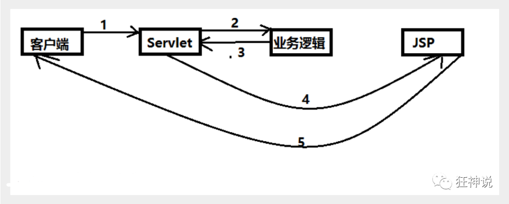
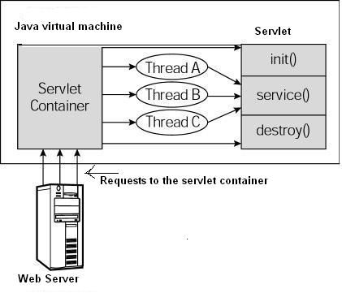

# SpringMVC

Spring MVC是Spring Framework的一部分，是基于Java实现MVC的轻量级Web框架。

## 1.1 什么是MVC


MVC三层架构：

- Model
- View
- Controller


## 1.2 早期架构


Model1优点：架构简单，比较适合小型项目开发；(没有controller层)

Model1缺点：JSP职责不单一，职责过重，不便于维护；

此时的JSP就是一个serlvet层。


## 1.3 Model2




1. 用户发请求
2. Servlet接收请求数据，并调用对应的业务逻辑方法
3. 业务处理完毕，返回更新后的数据给servlet
4. servlet转向到JSP，由JSP来渲染页面
5. 响应给前端更新后的页面


### 职责

- controller：
    - 取得表单数据
    - 调用业务逻辑
    - 转向指定的页面
- model：
    - 业务逻辑
    - 保存数据的状态
- view
    - 显示页面


## 1.4 SpringMVC 特点

1. 轻量级，简单易学
2. 高效，基于请求响应的MVC框架
3. 与Spring兼容性好，无缝结合
4. 约定大于配置
5. 功能强大：RESTful、数据验证、格式化、本地化、主题
6. 简介灵活


# 2 Servlet


## 2.1、 Servlet 是什么？


Java Servlet 是运行在 Web 服务器或应用服务器上的程序，它是作为来自 Web 浏览器或其他 HTTP 客户端的请求和 HTTP 服务器上的数据库或应用程序之间的中间层。


Java Servlet

```java
public class HelloServlet extends HttpServlet {
    // 由于get、post只是请求实现的不同方式，可以相互调用。业务逻辑一样。

    @Override
    protected void doGet(HttpServletRequest req, HttpServletResponse resp) throws ServletException, IOException {
        super.doGet(req, resp);
        System.out.println("执行doGet方法");
        PrintWriter writer = resp.getWriter();
        writer.print("Hello, Servlet");


    }
}
```

 

web.xml

```xml
<?xml version="1.0" encoding="UTF-8"?>
<web-app xmlns="http://xmlns.jcp.org/xml/ns/javaee"
         xmlns:xsi="http://www.w3.org/2001/XMLSchema-instance"
         xsi:schemaLocation="http://xmlns.jcp.org/xml/ns/javaee
                      http://xmlns.jcp.org/xml/ns/javaee/web-app_4_0.xsd"
         version="4.0"
         metadata-complete="true">

    <servlet>
        <servlet-name>hello</servlet-name>
        <servlet-class>com.kicc.servlet.HelloServlet</servlet-class>
    </servlet>
    
    <servlet-mapping>
        <servlet-name>hello</servlet-name>
        <url-pattern>/hello</url-pattern>
    </servlet-mapping>

</web-app>
```


配置完tomcat之后，运行后。就是一个完整的web程序。


## 2.2 servlet 生命周期

- Servlet 通过调用 **init ()** 方法进行初始化。
- Servlet 调用 **service()** 方法来处理客户端的请求。
- Servlet 通过调用 **destroy()** 方法终止（结束）。
- 最后，Servlet 是由 JVM 的垃圾回收器进行垃圾回收的。



上图显示了一个典型的 Servlet 生命周期方案。

- 第一个到达服务器的 HTTP 请求被委派到 Servlet 容器。
- Servlet 容器在调用 service() 方法之前加载 Servlet。
- 然后 Servlet 容器处理由多个线程产生的多个请求，每个线程执行一个单一的 Servlet 实例的 service() 方法。


## 2.3 带Servlet的架构


# 3 Apache、Nginx、tomcat的区别

### 静态性


Apache和Nginx是Http服务器。都能够将某一个文本文件的内容通过HTTP协议返回到客户端，但是这个文本文件的内容是固定的——也就是说无论何时、任何人访问它得到的内容都是完全相同的，这样的资源我们称之为**静态**资源。


### 动态性

Tomcat能够**动态**的生成资源并返回到客户端。动态资源则与之相反，在不同的时间、不同的客户端访问得到的内容是不同的，例如：

- 包含显示当前时间的页面
- 显示当前IP地址的页面


Apache HTTP Server和Nginx本身不支持生成动态页面，但它们可以通过其他模块来支持（例如通过Shell、PHP、Python脚本程序来动态生成内容）。
如果想要使用Java程序来动态生成资源内容，使用这一类HTTP服务器很难做到。[Java Servlet](https://link.zhihu.com/?target=http%3A//www.tianmaying.com/tutorial/servlet-intro)技术以及衍生的[Java Server Pages](https://link.zhihu.com/?target=http%3A//www.tianmaying.com/tutorial/jsp-intro)技术可以让Java程序也具有处理HTTP请求并且返回内容（由程序动态控制）的能力，Tomcat正是支持运行Servlet/JSP应用程序的容器（Container）:


Tomcat运行在JVM之上，它和HTTP服务器一样，绑定IP地址并监听TCP端口，同时还包含以下指责：

- 管理Servlet程序的生命周期
- 将URL映射到指定的Servlet进行处理
- 与Servlet程序合作处理HTTP请求——根据HTTP请求生成HttpServletResponse对象并传递给Servlet进行处理，将Servlet中的HttpServletResponse对象生成的内容返回给浏览器

### 搭配使用

虽然Tomcat也可以认为是HTTP服务器，但通常它仍然会和Nginx配合在一起使用：

- 动静态资源分离——运用Nginx的反向代理功能分发请求：所有动态资源的请求交给Tomcat，而静态资源的请求（例如图片、视频、CSS、JavaScript文件等）则直接由Nginx返回到浏览器，这样能大大减轻Tomcat的压力。
- 负载均衡，当业务压力增大时，可能一个Tomcat的实例不足以处理，那么这时可以启动多个Tomcat实例进行水平扩展，而Nginx的负载均衡功能可以把请求通过算法分发到各个不同的实例进行处理


# 4 框架概述

## 4.1 中心控制器 DispatcherServlet


**可能遇到的问题：访问出现404，排查步骤：**

1. 查看控制台输出，看一下是不是缺少了什么jar包。
2. 如果jar包存在，显示无法输出，就在IDEA的项目发布中，添加lib依赖！
3. 重启Tomcat 即可解决！


## 4.2 执行原理


图为SpringMVC的一个较完整的流程图，实线表示SpringMVC框架提供的技术，不需要开发者实现，**虚线表示需要开发者实现**。


**简要分析执行流程**

1. DispatcherServlet表示前置控制器，是整个SpringMVC的控制中心。用户发出请求，DispatcherServlet接收请求并拦截请求。

    我们假设请求的url为 : http://localhost:8080/SpringMVC/hello

    *如上url拆分成三部分：*

    http://localhost:8080服务器域名

    SpringMVC部署在服务器上的web站点

    hello表示控制器

    通过分析，如上url表示为：请求位于服务器localhost:8080上的SpringMVC站点的hello控制器。

2. HandlerMapping为处理器映射。DispatcherServlet调用HandlerMapping,HandlerMapping根据请求url查找Handler。

    ```java
    <bean id="/hello" class="com.kicc.controller.HelloController"/>
    ```

    

3. HandlerExecution表示具体的Handler,其主要作用是根据url查找控制器，如上url被查找控制器为：hello。

    ```java
    public class HelloController implements Controller {
    
    
        public ModelAndView handleRequest(HttpServletRequest request, HttpServletResponse response) throws Exception {
            //ModelAndView 模型和视图
            ModelAndView mv = new ModelAndView();
    
    
            //封装对象，放在ModelAndView中。Model
            mv.addObject("msg","HelloSpringMVC!");
            //封装要跳转的视图，放在ModelAndView中
            //: /WEB-INF/jsp/hello.jsp
            mv.setViewName("hello");
            return mv;
        }
    
    }
    ```

    ​	

4. HandlerExecution将解析后的信息传递给DispatcherServlet,如解析控制器映射等。

     

    **5-8处理业务，指定视图，返回数据。**

5. HandlerAdapter表示处理器适配器，其按照特定的规则去执行Handler。

6. Handler让具体的Controller执行。

7. Controller将具体的执行信息返回给HandlerAdapter,如ModelAndView。

8. HandlerAdapter将视图逻辑名或模型传递给DispatcherServlet。

     

     

    **9-12视图解析：**

9. DispatcherServlet调用视图解析器(ViewResolver)来解析HandlerAdapter传递的逻辑视图名。

    ```java
    <!--视图解析器:DispatcherServlet给他的ModelAndView-->
    <bean class="org.springframework.web.servlet.view.InternalResourceViewResolver" id="InternalResourceViewResolver">
        <!--前缀-->
        <property name="prefix" value="/WEB-INF/jsp/"/>
        <!--后缀-->
        <property name="suffix" value=".jsp"/>
    </bean>
    ```

    

10. 视图解析器将解析的逻辑视图名传给DispatcherServlet。

11. DispatcherServlet根据视图解析器解析的视图结果，调用具体的视图。

12. 最终视图呈现给用户。


# 5 原理讲解


## 5.1 配置DispatcherServlet

- 配置DispatcherServlet，这个是SpringMVC的核心：请求分发器。

```xml
<!--1.注册DispatcherServlet-->
<servlet>
    <servlet-name>springmvc</servlet-name>
    <servlet-class>org.springframework.web.servlet.DispatcherServlet</servlet-class>
</servlet>
```

- 添加映射

```xml
<!--/ 匹配所有的请求；（不包括.jsp）-->
<!--/* 匹配所有的请求；（包括.jsp）-->
<servlet-mapping>
<servlet-name>springmvc</servlet-name>
<url-pattern>/</url-pattern>
</servlet-mapping>
```

注意：

​		/ 只匹配所有的请求，不会匹配jsp页面

​		/* 匹配所有的请求，会匹配jsp


- DispatcherServlet要绑定Spring的配置文件

```xml
<!--关联一个springmvc的配置文件:【servlet-name】-servlet.xml-->
<init-param>
    <param-name>contextConfigLocation</param-name>
    <param-value>classpath:springmvc-servlet.xml</param-value>
</init-param>
```

- 创建resources/springmvc-servlet.xml 与上面的配置相对应。
- 设置启动级别

```xml
<!--启动级别-1-->
<load-on-startup>1</load-on-startup>
```


## 5.2 配置映射器、适配器、解析器

原理讲解中，我们进行了显式地配置。实际开发中，都会用注解代替。

- 映射器

```xml
<bean class="org.springframework.web.servlet.handler.BeanNameUrlHandlerMapping"/>
```

- 适配器

```xml
<bean class="org.springframework.web.servlet.mvc.SimpleControllerHandlerAdapter"/>
```

- 视图解析器 （可以用别的，甚至自定义）

```xml
<!--视图解析器:DispatcherServlet给他的ModelAndView-->
<bean class="org.springframework.web.servlet.view.InternalResourceViewResolver" id="InternalResourceViewResolver">
    <!--前缀-->
    <property name="prefix" value="/WEB-INF/jsp/"/>
    <!--后缀-->
    <property name="suffix" value=".jsp"/>
</bean>
```

注意：前缀最后加斜杠，这里用的文件还是.jsp


## 5.3 编写controller

```java
public class HelloController implements Controller {


    public ModelAndView handleRequest(HttpServletRequest request, HttpServletResponse response) throws Exception {
        //ModelAndView 模型和视图
        ModelAndView mv = new ModelAndView();
        
        // 假设我们有业务 返回result
        String result = "HelloSpringMVC";

        //封装对象，放在ModelAndView中。Model
        mv.addObject("msg", result);
        //封装要跳转的视图，放在ModelAndView中
        //: /WEB-INF/jsp/hello.jsp
        mv.setViewName("hello");
        return mv;
    }

}
```


完成了业务、确定返回的视图之后。我们就需要调用视图解析器。

hello.jsp是我们跳转的视图名。 <bean id="/任意"> 可以取任何名字，只是我们访问的url；

由于我们使用了BeanNameUrlHandlerMapping需要根据bean的id名去找controller，所以我们需要添加一个bean

```xml
<bean id="/hello" class="com.kicc.controller.HelloController"/>
```


# 6 实际注解开发


## 6.1 创建Module

- 创建空的Maven项目
- 导入依赖（父项目已有可以忽略）
- 完善Maven资源过滤问题
- 添加Web框架支持


## 6.2 web.xml

```xml
<?xml version="1.0" encoding="UTF-8"?>
<web-app xmlns="http://xmlns.jcp.org/xml/ns/javaee"
        xmlns:xsi="http://www.w3.org/2001/XMLSchema-instance"
        xsi:schemaLocation="http://xmlns.jcp.org/xml/ns/javaee http://xmlns.jcp.org/xml/ns/javaee/web-app_4_0.xsd"
        version="4.0">
 
 
   <!--1.注册DispatcherServlet-->
   <servlet>
       <servlet-name>SpringMVC</servlet-name>
       <servlet-class>org.springframework.web.servlet.DispatcherServlet</servlet-class>
       <!--通过初始化参数指定SpringMVC配置文件的位置，进行关联-->
       <init-param>
           <param-name>contextConfigLocation</param-name>
           <param-value>classpath:springmvc-servlet.xml</param-value>
       </init-param>
       <!-- 启动顺序，数字越小，启动越早 -->
       <load-on-startup>1</load-on-startup>
   </servlet>
 
 
   <!--所有请求都会被springmvc拦截 -->
   <servlet-mapping>
       <servlet-name>SpringMVC</servlet-name>
       <url-pattern>/</url-pattern>
   </servlet-mapping>
 
 
</web-app>
```


## 6.3 添加springmvc-servlet.xml

```xml
<?xml version="1.0" encoding="UTF-8"?>
<beans xmlns="http://www.springframework.org/schema/beans"
      xmlns:xsi="http://www.w3.org/2001/XMLSchema-instance"
      xmlns:context="http://www.springframework.org/schema/context"
      xmlns:mvc="http://www.springframework.org/schema/mvc"
      xsi:schemaLocation="http://www.springframework.org/schema/beans
       http://www.springframework.org/schema/beans/spring-beans.xsd
       http://www.springframework.org/schema/context
       https://www.springframework.org/schema/context/spring-context.xsd
       http://www.springframework.org/schema/mvc
       https://www.springframework.org/schema/mvc/spring-mvc.xsd">
 
 
   <!-- 自动扫描包，让指定包下的注解生效,由IOC容器统一管理 -->
   <context:component-scan base-package="com.kicc.controller"/>
   <!-- 让Spring MVC不处理静态资源 -->
   <mvc:default-servlet-handler />
   <!--
   支持mvc注解驱动
       在spring中一般采用@RequestMapping注解来完成映射关系
       要想使@RequestMapping注解生效
       必须向上下文中注册DefaultAnnotationHandlerMapping
       和一个AnnotationMethodHandlerAdapter实例
       这两个实例分别在类级别和方法级别处理。
       而annotation-driven配置帮助我们自动完成上述两个实例的注入。
    -->
   <mvc:annotation-driven />
 
 
   <!-- 视图解析器 -->
   <bean class="org.springframework.web.servlet.view.InternalResourceViewResolver"
         id="internalResourceViewResolver">
       <!-- 前缀 -->
       <property name="prefix" value="/WEB-INF/jsp/" />
       <!-- 后缀 -->
       <property name="suffix" value=".jsp" />
   </bean>
 
 
</beans>
```

1. 自动扫描包
2. 添加<mvc:default-servlet-handler />  可以过滤 .js .css .html .mp3等静态资源
3. 添加注解支持 （这样就可以使用@Controller）
4. 添加视图解析器

注意：

- 在视图解析器中我们把所有的视图都存放在/WEB-INF/目录下，这样可以保证视图安全，因为这个目录下的文件，客户端不能直接访问。
- 也可以不使用视图解释器，只需要在controller的实现方法中 直接返回 
    - "/WEB-INF/jsp/hello.jsp"
    - "forward:/WEB-INF/jsp/hello.jsp"
    - "redirect:/WEB-INF/jsp/hello.jsp"


## 6.4 创建Controller

```java
@Controller
@RequestMapping("/hello")
public class HelloController {

    @RequestMapping("/h1")
    public String hello(Model model) {

        model.addAttribute("msg", "hello Spring MVC Annotation.");

        // WEB-INF/jsp/hello.jsp
        return "hello";
    }
}
```

访问 localhost:8080/hello/h1 就会调用 hello()方法，跳转到hello.jsp 视图。


## 6.5 创建hello.jsp 视图

```jsp
<%@ page contentType="text/html;charset=UTF-8" language="java" %>
<html>
<head>
   <title>SpringMVC</title>
</head>
<body>
${msg}
</body>
</html>
```


## 6.6 启动Tomcat


## 6.7 与实现接口Controller方式的对比

**说明：**

- 实现接口Controller定义控制器是较老的办法
- 缺点是：**一个控制器中只有一个方法**，如果要多个方法则需要定义多个Controller；定义的方式比较麻烦；

原因是Controller接口是一个函数式接口

```java
@FunctionalInterface
public interface Controller {
    @Nullable
    ModelAndView handleRequest(HttpServletRequest var1, HttpServletResponse var2) throws Exception;
}
```

里面只有一个返回值为ModelAndView的方法。


# 7 RestFul 风格

传统

```java
// localhost:8080/add?a=1&b=2
@RequestMapping("/add")
public String trandition(int a, int b, Model model) {
    int res = a + b;
    model.addAttribute("msg", "结果是"+res);
    return "hello";
}
```

原本的定义和请求方式，都是URL中显式地传递参数。


RestFul

```java
// localhost:8080/add/1/2
@RequestMapping(value="/add/{a}/{b}", method = RequestMethod.GET)
public String trandition(int a, int b, Model model) {
    int res = a + b;
    model.addAttribute("msg", "结果是"+res);
    return "hello";
}
```

```java
// localhost:8080/add/1/2
@GetMapping(value="/add/{a}/{b}")
public String trandition(@PathVariable int a, @PathVariable int b, Model model) {
    int res = a + b;
    model.addAttribute("msg", "结果是"+res);
    return "hello";
}
```


## 7.1 数据处理


- 前端返回参数

```java
//@RequestParam("username") : username提交的域的名称 .
@RequestMapping("/hello")
public String hello(@RequestParam("username") String name){
    System.out.println(name);
    return "hello";
}
```

只要是前端发送来的请求参数，我们都把RequestParam()加上。可以提醒自己这个是从前端来的。


- 前端返回对象

    ```java
    public class User {
        private int id;
        private String name;
        private int age;
        //构造
        //get/set
        //tostring()
    }
    ```

    提交数据 : http://localhost:8080/mvc04/user?name=kuangshen&id=1&age=15

    ```java
    @RequestMapping("/user")
    public String user(User user){
        System.out.println(user);
        return "hello";
    }
    ```

    

根据地址栏的三个参数和自动拼接成一个User对象。

且这里的name id age 必须和User类的字段保持一致。


### 数据显示到前端

1. ModelAndView

    ```java
    public class ControllerTest1 implements Controller {
     
        public ModelAndView handleRequest(HttpServletRequest httpServletRequest, HttpServletResponse httpServletResponse) throws Exception {
            //返回一个模型视图对象
            ModelAndView mv = new ModelAndView();
            mv.addObject("msg","ControllerTest1");
            mv.setViewName("test");
            return mv;
        }
    }
    ```

    

2. ModelMap

    ```java
    @RequestMapping("/hello")
    public String hello(@RequestParam("username") String name, ModelMap model){
        //封装要显示到视图中的数据
        //相当于req.setAttribute("name",name);
        model.addAttribute("name",name);
        System.out.println(name);
        return "hello";
    }
    ```

    

3. Model

    ```java
    @RequestMapping("/ct2/hello")
    public String hello(@RequestParam("username") String name, Model model){
        //封装要显示到视图中的数据
        //相当于req.setAttribute("name",name);
        model.addAttribute("msg",name);
        System.out.println(name);
        return "test";
    }
    ```

    

**区别：**

```
Model 只有寥寥几个方法只适合用于储存数据，简化了新手对于Model对象的操作和理解；
 
ModelMap 继承了 LinkedMap ，除了实现了自身的一些方法，同样的继承 LinkedMap 的方法和特性；
 
ModelAndView 可以在储存数据的同时，可以进行设置返回的逻辑视图，进行控制展示层的跳转。
```


# 8 中文乱码问题

如果遇到中文的乱码问题

https://www.bilibili.com/video/BV1aE41167Tu?p=13

https://blog.csdn.net/qq_33369905/article/details/106647331


在springmvc-servlet 中加入配置 (只要用了Jackson库，就把它加上)  加上报错了。目前为解决

```xml
<mvc:annotation-driven>
    <mvc:message-converters register-defaults="true">
        <bean class="org.springframework.http.converter.StringHttpMessageConverter">
            <constructor-arg value="UTF-8"/>
        </bean>
        <bean class="org.springframework.http.converter.json.MappingJackson2HttpMessageConverter">
            <property name="objectMapper">
                <bean class="org.springframework.http.converter.json.Jackson2ObjectMapperFactoryBean">
                    <property name="failOnEmptyBeans" value="false"/>
                </bean>
            </property>
        </bean>
    </mvc:message-converters>
</mvc:annotation-driven>
```


# 9 JSON

在前后端分离的架构中，我们在Controller中不需要返回视图解析器了。直接返回Json跟前端交互。

创建User类

```java
@Data
@AllArgsConstructor
@NoArgsConstructor
public class User {
    private String name;
    private int age;
    private String sex;
}
```


## 9.1 Jackson


创建UserController

```java
@RestController
public class UserController {

    @RequestMapping(value = "/j1", produces = "text/plain;charset=UTF-8")
    @ResponseBody //这句话加了之后，就不会走视图解析器，会直接返回一个字符串
    public String json1() throws JsonProcessingException {

        ObjectMapper omapper = new ObjectMapper();

        User user = new User("Kicc", 24, "男");

        String s = omapper.writeValueAsString(user);

        return s;
    }
}
```

1. 加了RestController注解后，类中的方法都返回Json，而不是视图。
2. 如果类上面不加RestController这个注解。那么可以在方法上加ResponseBody注解。效果一致
    1. 也就是说RestController = @ResponseBody + @Controller
3. 用了Jackson这个库。需要创建一个ObjectMapper实例。把String传入进去。返回。


需要返回的是多个Json：

```java
@RequestMapping("/j2")
public String json2() throws JsonProcessingException {

    List<User> users = new ArrayList<User>();

    User user3 = new User("user1", 20, "male");
    User user = new User("user2", 21, "male");
    User user1 = new User("user3", 22, "female");
    User user2 = new User("user4", 23, "female");

    users.add(user);
    users.add(user1);
    users.add(user2);
    users.add(user3);

    return new ObjectMapper().writeValueAsString(users);
}
```


返回日期：

```java
public String json3() throws JsonProcessingException {

    Date date = new Date();

    SimpleDateFormat sdf = new SimpleDateFormat("yyyy-MM-dd HH:mm:ss");
    
    return new ObjectMapper().writeValueAsString(sdf.format(date));
}
```

默认日期Date是时间戳输出。要用SimpleDateFormat 转化一下。


同样，Jackson中提供了这种日期转化的支持：

```java
@RequestMapping("/j3")
public String json3() throws JsonProcessingException {

    ObjectMapper objectMapper = new ObjectMapper();
    // 不使用时间戳
    objectMapper.configure(SerializationFeature.WRITE_DATES_AS_TIMESTAMPS, false);

    SimpleDateFormat sdf = new SimpleDateFormat("yyyy-MM-dd HH:mm:ss");

    objectMapper.setDateFormat(sdf);

    Date date = new Date();

    return new ObjectMapper().writeValueAsString(date);
}
```

- 需要配置一个不使用时间戳的configure
- 再setDateFormat


因为每个类中都用到了ObjectMapper，所以可以整个Utils。


```java
public class JsonUtils {

    public static String getJson(Object object) {
        return getJson(object, "yyyy-MM-dd HH:MM:ss");
    }

    public static String getJson(Object object, String dateFormat) {

        ObjectMapper objectMapper = new ObjectMapper();

        SimpleDateFormat sdf = new SimpleDateFormat(dateFormat);
        objectMapper.setDateFormat(sdf);

        try {
            return objectMapper.writeValueAsString(object);
        } catch (JsonProcessingException e) {
            e.printStackTrace();
        }
        return null;

    }
}
```


## 9.2 FastJson (alibaba)

```java

        System.out.println("*******Java对象 转 JSON字符串*******");
        String str1 = JSON.toJSONString(list);
        System.out.println("JSON.toJSONString(list)==>"+str1);
        String str2 = JSON.toJSONString(user1);
        System.out.println("JSON.toJSONString(user1)==>"+str2);
 
        System.out.println("\n****** JSON字符串 转 Java对象*******");
        User jp_user1=JSON.parseObject(str2,User.class);
        System.out.println("JSON.parseObject(str2,User.class)==>"+jp_user1);
 
        System.out.println("\n****** Java对象 转 JSON对象 ******");
        JSONObject jsonObject1 = (JSONObject) JSON.toJSON(user2);
        System.out.println("(JSONObject) JSON.toJSON(user2)==>"+jsonObject1.getString("name"));
 
        System.out.println("\n****** JSON对象 转 Java对象 ******");
        User to_java_user = JSON.toJavaObject(jsonObject1, User.class);
        System.out.println("JSON.toJavaObject(jsonObject1, User.class)==>"+to_java_user)
```

- toJSONString()
- parseObject()：解析为一个Java对象
- toJSON()：js对象
- toJavaObject()


# 10 SSM 整合

pom.xml文件：

1. 包依赖

    - junit
    - mysql-connect-java, 
    - 数据连接池 c3p0
    - servlet-api, jsp-api, jstl, 
    - mybatis, mybatis-spring
    - spring-jdbc, spring-webmvc
    - lombok

2. 非resources下的xml文件包含：

    ```xml
    <build>
        <resources>
            <resource>
                <directory>src/main/java</directory>
                <includes>
                    <include>**/*.properties</include>
                    <include>**/*.xml</include>
                </includes>
                <filtering>false</filtering>
            </resource>
            <resource>
                <directory>src/main/resources</directory>
                <includes>
                    <include>**/*.properties</include>
                    <include>**/*.xml</include>
                </includes>
                <filtering>false</filtering>
            </resource>
        </resources>
    </build>
    ```

    


## 10.1 Mybatis 层

1. 创建POJO类

    ```java
    @Data
    @AllArgsConstructor
    @NoArgsConstructor
    public class Books {
        private int bookID;
        private String bookName;
        private int bookCounts;
        private String detail;
    }
    ```

2. 创建db.properties

    ```xml
    jdbc.driver=com.mysql.jdbc.Driver
    jdbc.url=jdbc:mysql://localhost:3306/ssmbuild?useSSL=true&useUnicode=true&characterEncoding=utf8
    jdbc.username=root
    jdbc.password=admin
    ```

3. 创建mybatis-config.xml

    ```xml
    <?xml version="1.0" encoding="UTF-8" ?>
    <!DOCTYPE configuration
            PUBLIC "-//mybatis.org//DTD Config 3.0//EN"
            "http://mybatis.org/dtd/mybatis-3-config.dtd">
    <configuration>
    
        <typeAliases>
            <package name="com.kicc.pojo"/>
        </typeAliases>
    <!--    <mappers>-->
    <!--        <mapper resource="com/kicc/dao/BookMapper.xml"/>-->
    <!--    </mappers>-->
    
    </configuration>
    ```

4. 


## 10.2 Spring-dao 层

1. 创建 Spring-dao.xml

    1. 关联数据库配置文件

        ```xml
        <!--1. 关联数据库配置文件-->
        <context:property-placeholder location="classpath:database.properties"/>
        ```

        

    2. 数据库连接池

        ```xml
        <!--2. 连接池
            dbcp: 半自动化， 不能自动连接
            c3p0: 自动化操作（自动化的加载配置文件，并且可以自动设置到对象中）
            druid
            hikari：SpringBoot2.x 默认集成
         -->
        <bean id="dataSource" class="com.mchange.v2.c3p0.ComboPooledDataSource">
            <property name="driverClass" value="${jdbc.driver}"/>
            <property name="jdbcUrl" value="${jdbc.url}"/>
            <property name="user" value="${jdbc.username}"/>
            <property name="password" value="${jdbc.password}"/>
        </bean>
        ```

        c3p0还有一些其他的配置：

        ```xml
               <!-- c3p0连接池的私有属性 -->
                <property name="maxPoolSize" value="30"/>
                <property name="minPoolSize" value="10"/>
                <!-- 关闭连接后不自动commit -->
                <property name="autoCommitOnClose" value="false"/>
                <!-- 获取连接超时时间 -->
                <property name="checkoutTimeout" value="10000"/>
                <!-- 当获取连接失败重试次数 -->
                <property name="acquireRetryAttempts" value="2"/>
        
        ```

    3. 添加sqlSessionFactory

        ```xml
        <!-- 3.配置SqlSessionFactory对象 -->
        <bean id="sqlSessionFactory" class="org.mybatis.spring.SqlSessionFactoryBean">
            <!-- 注入数据库连接池 -->
            <property name="dataSource" ref="dataSource"/>
            <!-- 配置MyBaties全局配置文件:mybatis-config.xml -->
            <property name="configLocation" value="classpath:mybatis-config.xml"/>
            <property name="mapperLocations">
                <list>
                    <value>classpath:com/kicc/dao/BookMapper.xml</value>
                </list>
            </property>
        </bean>
        ```

        在sqlSessionFactory的 mapperLocations中配置了xml路径后，就不需要去mybatis-config.xml中配置mapper了。（两个文件配置一个就好）

    4. 添加一个能省去创建MapperImpl的配置

        ```xml
        <!--4. 配置dao接口扫描包，动态的实现了Dao接口 可以注入到Spring容器中-->
        <bean class="org.mybatis.spring.mapper.MapperScannerConfigurer">
            <!--注入 sqlSessionFactory-->
            <property name="sqlSessionFactoryBeanName" value="sqlSessionFactory"/>
            <!--要扫描的包-->
            <property name="basePackage" value="com.kicc.dao"/>
        </bean>
        ```

        - 添加了这个配置之后我们就不需要再去手动实现MapperImpl

        - 如果我们不用这个接口扫描包，则必须创建一个MapperImpl：

            ```java
            public class BookMapperImpl extends SqlSessionDaoSupport implements BookMapper{
                public int addBook(Books book) {
                    return getSqlSession().getMapper(BookMapper.class).addBook(book);
                }
            
                public int deleteBookById(Integer id) {
                    return getSqlSession().getMapper(BookMapper.class).deleteBookById(id);
                }
            
                public int updateBook(Books book) {
                    return getSqlSession().getMapper(BookMapper.class).updateBook(book);
                }
            
                public Books queryBookById(Integer id) {
                    return getSqlSession().getMapper(BookMapper.class).queryBookById(id);
                }
            
                public List<Books> queryAllBook() {
                    return getSqlSession().getMapper(BookMapper.class).queryAllBook();
                }
            }
            ```

    再绑定一个bean：

    ```xml
    <bean id="bookMapper" class="com.kicc.dao.BookMapperImpl">
        <property name="sqlSessionFactory" ref="sqlSessionFactory"/>
    </bean>
    ```

    