# 1 SpringSecurity

> 实际开发中，安全第一！


安全框架：shiro、SpringSecurity。两者大致相同。

做两件事：认证、授权。 Authentication、Authorize。


- 功能权限
- 访问权限
- 菜单权限
- ... 拦截器，过滤器：大量原生代码 冗余


# 2 实战

## 1 环境描述


新建空的SpringBoot项目，导入一些文件。

导入thymeleaf 依赖（不导入security依赖）

```xml
        <dependency>
            <groupId>org.thymeleaf</groupId>
            <artifactId>thymeleaf-spring5</artifactId>
        </dependency>

        <dependency>
            <groupId>org.thymeleaf.extras</groupId>
            <artifactId>thymeleaf-extras-java8time</artifactId>
        </dependency>

<!--        <dependency>-->
<!--            <groupId>org.springframework.boot</groupId>-->
<!--            <artifactId>spring-boot-starter-security</artifactId>-->
<!--        </dependency>-->
```


文件结构描述：

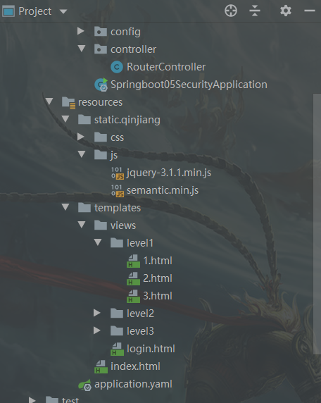


导入了css、js、html文件。使用Thymeleaf引擎。关闭cache。spring.thymeleaf.cache=false;


>  测试Controller


```java
@Controller
public class RouterController {

    @RequestMapping({"/", "/index"})
    public String index() {
        return "index";
    }
}
```

访问 localhost:8080可以正常跳转到 index；==之前不小心直接导入了security的依赖，发现不能显示index.html而是必须先登录（不是login.html，security的登录)。==


index.html展示

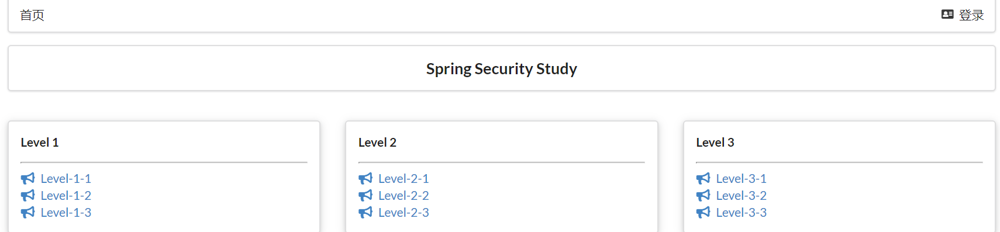

添加Security后预期达到的目标：

- 不允许直接跳转到index，必须先登录
- Level 1 2 3分别对应不同级别的用户，Level 1用户只能看到Level1的信息，Level 3用户可以 看到 Level 1 2 3.
- **Authentication & Authorize**


## 2 添加Security： AOP方式 （不会影响之前的任何内容）

重要的类：

- WebSecurityConfigurerAdapter：自定义Security策略  （适配器模式）
- AuthenticationManagerBuilder：自定义认证策略    （建造者模式）
- @EnableWebSecurity：开启WebSecurity模式


### 1 新增自定义配置


```java
package com.kicc.config;

import org.springframework.security.config.annotation.web.WebSecurityConfigurer;
import org.springframework.security.config.annotation.web.builders.HttpSecurity;
import org.springframework.security.config.annotation.web.configuration.EnableWebSecurity;
import org.springframework.security.config.annotation.web.configuration.WebSecurityConfigurerAdapter;

/**
 * @author Kicc
 * @date 20/7/14 下午 5:05
 */

@EnableWebSecurity
public class SecurityConfig extends WebSecurityConfigurerAdapter {

    /**
     * 链式编程
     * 授权 Authorize
     * @param http
     * @throws Exception
     */
    @Override
    protected void configure(HttpSecurity http) throws Exception {
        // 首页所有人可以访问
        // 但是功能也只有对应有权限的人才能访问
        http.authorizeRequests()
                .antMatchers("/").hasAnyRole("vip1", "vip2", "vip3") // 第一次登录空白身份，所以直接去登录
                .antMatchers("/level1/**").hasRole("vip1")
                .antMatchers("/level2/**").hasRole("vip2")
                .antMatchers("/level3/**").hasRole("vip3");
        // 没有权限跳转到登录页面
        http.formLogin()
                // 自己的login页面
                // 登录时通过controller访问/toLogin,/toLogin返回login.html视图
                .loginPage("/toLogin")
                // 前端传过来的 name是 username
                .usernameParameter("username")
                // 密码的name是password
                .passwordParameter("password")
                // 实际用login登录，与login.html中提交的form href一致。
                .loginProcessingUrl("/login");
        
        // 开启注销, 成功跳回到首页
        http.logout().deleteCookies("remove").logoutSuccessUrl("/");
    }
}
```

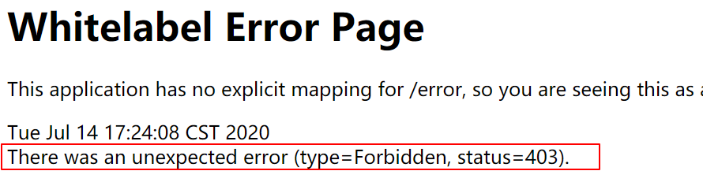

请求不允许


设置没有权限就到登录页

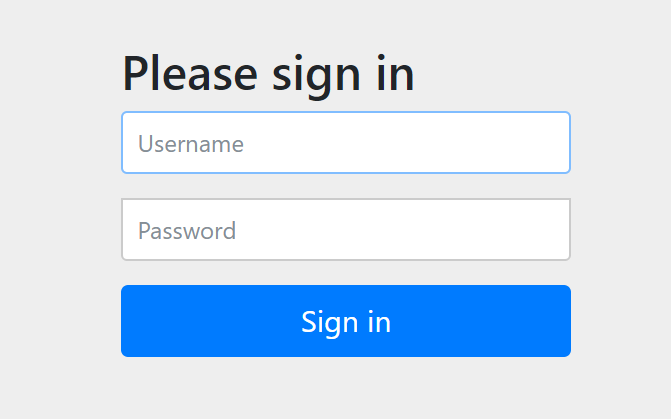

查看源码发现：

```java
/**
* The most basic configuration defaults to automatically generating a login page at
* the URL "/login", redirecting to "/login?error" for authentication failure. The
* details of the login page can be found on
* {@link FormLoginConfigurer#loginPage(String)}
*/
// 没有权限的访问就到/login， 错误就去/login?error
```


**一、内存中数据认证**

Override 认证配置 Authentization

```java
/**
 * 认证，用于login登录
 * 可以从内存中直接读，正规的需要从数据中读取
 * @param auth
 * @throws Exception
 */
@Override
protected void configure(AuthenticationManagerBuilder auth) throws Exception {
    auth.inMemoryAuthentication()
    .withUser("Kicc")
    .password("123456").roles("vip2", "vip3")
    .and()
    .withUser("root")
    .password("1112333").roles("vip1", "vip2", "vip3")
    .and()
    .withUser("guest")
    .password("123456").roles("vip1");
}
```

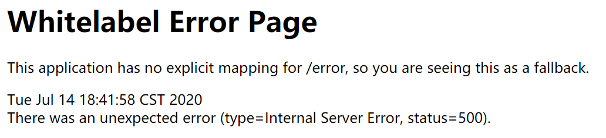

出现500错误。**解决：需要添加password的加密！**


```java
/**
 * 认证
 * 可以从内存中直接读，正规的需要从数据中读取
 * @param auth
 * @throws Exception
 */
@Override
protected void configure(AuthenticationManagerBuilder auth) throws Exception {
    auth.inMemoryAuthentication().passwordEncoder(new BCryptPasswordEncoder()) // 任选一种加密方式
    .withUser("Kicc")
    .password(new BCryptPasswordEncoder().encode("123456")).roles("vip2", "vip3")
    .and()
    .withUser("root")
    .password(new BCryptPasswordEncoder().encode("123456")).roles("vip1", "vip2", "vip3")
    .and()
    .withUser("guest")
    .password(new BCryptPasswordEncoder().encode("123456")).roles("vip1");
}
```


**二、数据库中数据认证**


```java
@Autowired
private DataSource dataSource;
 
@Autowired
public void configureGlobal(AuthenticationManagerBuilder auth)
  throws Exception {
    auth.jdbcAuthentication()
      .dataSource(dataSource)
      .withDefaultSchema()
      .withUser(User.withUsername("user")
        .password(passwordEncoder().encode("pass"))
        .roles("USER"));
}
 
@Bean
public PasswordEncoder passwordEncoder() {
    return new BCryptPasswordEncoder();
}
```


> 还有一个问题：进入首页后，Vip1的用户应该只能去看level1的内容。现在是level1 2 3都展示出来了。

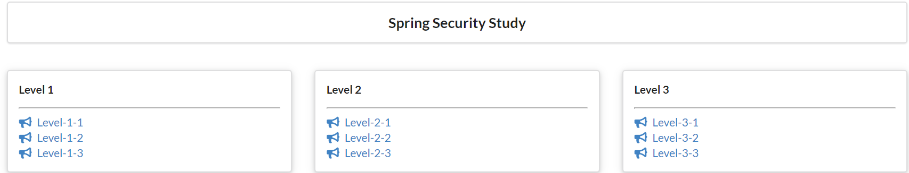

这个是前端的显示功能，与thymeleaf相关。需要用到thymeleaf和security的整合。


### 2 整合thymeleaf


导入依赖

```xml
<!--spring security 和 thymeleaf的整合-->
<dependency>
    <groupId>org.thymeleaf.extras</groupId>
    <artifactId>thymeleaf-extras-springsecurity5</artifactId>
</dependency>
```


前端修改：

- 导入命名空间

    ```html
    <html lang="en" xmlns:th="http://www.thymeleaf.org"
          xmlns:sec="http://www.thymeleaf.org/extras/spring-security">
    ```

- 认证

    ```html
    <!--登录注销-->
    <div class="right menu">
    
        <!--如果未登录-->
        <div sec:authorize="!isAuthenticated()"> // 如果没有登录
            <!--未登录：显示登录-->
            <a class="item" th:href="@{/toLogin}">
                <i class="address card icon"></i> 登录
            </a>
        </div>
    
    
        <div sec:authorize="isAuthenticated()"> // 如果已经登录
            <a class="item">
                用户名：<span sec:authentication="name"></span>
                &nbsp; 角色（权限）：<span sec:authentication="principal.authorities"></span>
            </a>
        </div>
        
        <div sec:authorize="isAuthenticated()">
            <!--如果已经登录：显示用户名，注销-->
            <a class="item" th:href="@{/logout}">
                <i class="sign-out icon"></i> 注销
            </a>
        </div>
    ```

    

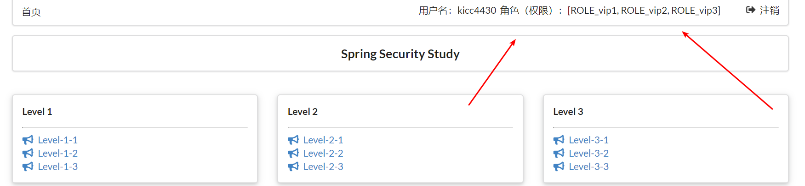


**只显示对应等级的内容：**

```html
<!-- 验证权限：只有是vip1的用户才能显示这个div-->
<!-- 这样就实现了同一个页面的动态展示！-->
<div class="column" sec:authorize="hasRole('vip1')">
    <div class="ui raised segment">
        <div class="ui">
            <div class="content">
                <h5 class="content">Level 1</h5>
                <hr>
                <div><a th:href="@{/level1/1}"><i class="bullhorn icon"></i> Level-1-1</a></div>
                <div><a th:href="@{/level1/2}"><i class="bullhorn icon"></i> Level-1-2</a></div>
                <div><a th:href="@{/level1/3}"><i class="bullhorn icon"></i> Level-1-3</a></div>
            </div>
        </div>
    </div>
</div>

<!-- 验证权限：只有是vip2的用户才能显示这个div-->
<!-- 这样就实现了同一个页面的动态展示！-->
<div class="column" sec:authorize="hasRole('vip1')">
    <div class="ui raised segment">
        <div class="ui">
            <div class="content">
                <h5 class="content">Level 1</h5>
                <hr>
                <div><a th:href="@{/level1/1}"><i class="bullhorn icon"></i> Level-1-1</a></div>
                <div><a th:href="@{/level1/2}"><i class="bullhorn icon"></i> Level-1-2</a></div>
                <div><a th:href="@{/level1/3}"><i class="bullhorn icon"></i> Level-1-3</a></div>
            </div>
        </div>
    </div>
</div>

<!-- 验证权限：只有是vip3的用户才能显示这个div-->
<!-- 这样就实现了同一个页面的动态展示！-->
<div class="column" sec:authorize="hasRole('vip1')">
    <div class="ui raised segment">
        <div class="ui">
            <div class="content">
                <h5 class="content">Level 1</h5>
                <hr>
                <div><a th:href="@{/level1/1}"><i class="bullhorn icon"></i> Level-1-1</a></div>
                <div><a th:href="@{/level1/2}"><i class="bullhorn icon"></i> Level-1-2</a></div>
                <div><a th:href="@{/level1/3}"><i class="bullhorn icon"></i> Level-1-3</a></div>
            </div>
        </div>
    </div>
</div>
```


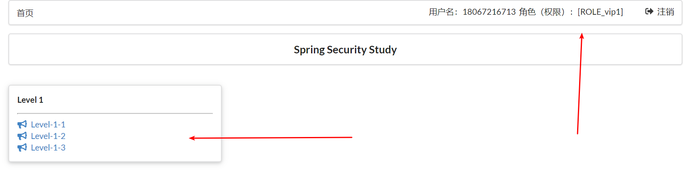


### 3 常用功能


- 记住我 Remember me

    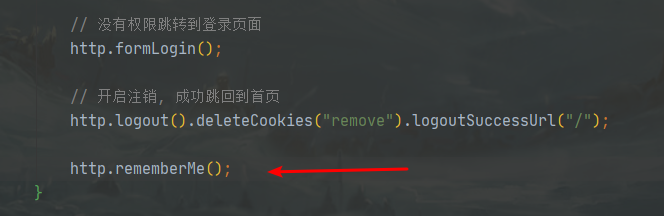

    开启了记住我功能，那么会在本地产生一个两周时长的 cookie

    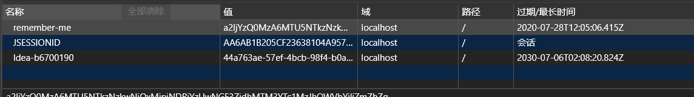


​		接受前端的remember me 参数

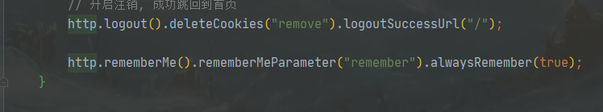

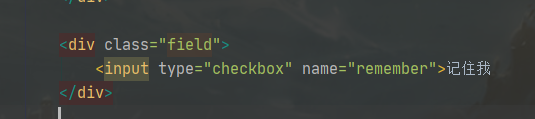


总结：

- 认证
    - 通过数据库读取用户信息进行认证
- 授权：
    - 登录
    - 注销
    - 根据权限显示页面


Spring Security 帮我们把登录注销方面的活都干了。我们也不需要自己写这方面的拦截器。


