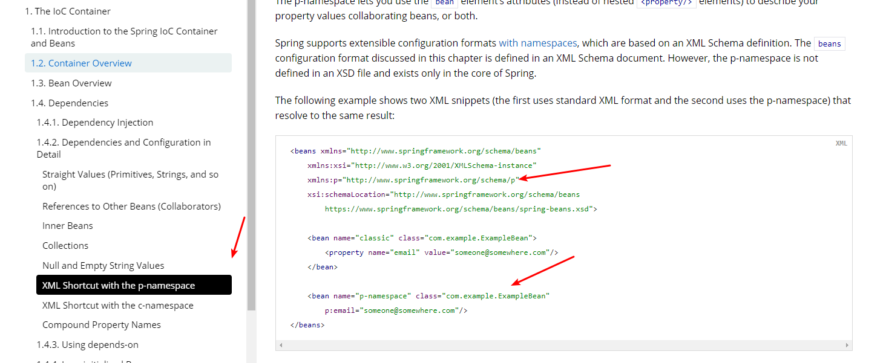
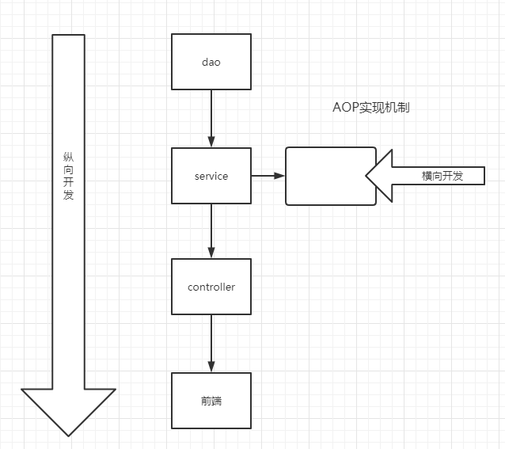
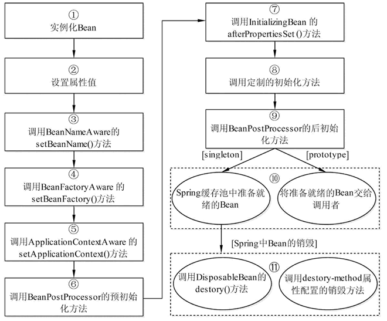

## 1、Spring


- Spring是一个开源的免费容器（框架）
- Spring是一个轻量级的、非入侵式的框架
- 控制反转，面向切面编程
- 支持事务的处理，对框架整合的支持

**总之，Spring是一个轻量级的IOC和面向切面的编程框架。主要用来解决企业应用开发的复杂性。**

Spring是一个基于IOC和AOP的结构J2EE系统的框架

IOC 反转控制 是Spring的基础，Inversion Of Control


## 2、IOC Inversion of Control

简单说就是创建对象由以前的程序员自己new 构造方法来调用，变成了交由Spring创建对象

### 思想逻辑

- 在传统的做法中，Dao编写是JavaBean。程序修改的主动权是在程序员手中，因此当需求发生变化时，程序员需要手动地去修改代码。

    ```java
    public class UserServiceImpl implements UserService{
        private UserDao userDao = new UserDaoImpl();
    
    
        public void getUser() {
            userDao.getUser();
        }
    }
    ```

    

    在业务层的实现中，创建了一个DaoImpl的实现对象。

    

    假设此时我们多了一个MySQL的Dao接口

    ```java
    public class UserDaoMysqlImpl implements UserDao{
        public void getUser() {
            System.out.println("Get Mysql information from UserDao.");
        }
    }
    ```

    

    那么我们需要手动去修改业务层（new UserDaoMysqlImpl()）

    ```java
    public class UserServiceImpl implements UserService{
        private UserDao userDao = new UserDaoMysqlImpl();
    
    
        public void getUser() {
            userDao.getUser();
        }
    }
    ```

    

    

    **重点来了！**

    之后用了 set注入的方式，程序不再具有主动性，而是变成l被动接受的对象。这是最初的IoC思想。

    这样我们在创建UserServiceImpl实例的时候，不需要去修改原来的程序，只要在传入userDao.

    ```java
    public class UserServiceImpl implements UserService{
        private UserDao userDao;
    
        // 利用set实现动态值的注入
        public void setUserDao(UserDao userDao) {
            this.userDao = userDao;
        }
    
        public void getUser() {
            userDao.getUser();
        }
    }
    ```

    

- Spring 究竟干了啥子

>用了Spring之后，对象的创建、管理、控制都交给Spring来完成。这就是Ioc的本质。程序员也不需要去修改程序代码，用户的需求改变也不需要去main中传入什么参数去获取不同的service。只需要在xml文件中去修改就行了。

### IOC创建对象的方式
1.使用无参数构造方法创建对象，默认！
2.假设我们要使用有参数构造，在xml里需要把property改为constructor-arg

#### xml 文件注入 格式

```xml
    <bean id="user" class="com.kicc.pojo.User">
        <constructor-arg index="0" value="Kicc"/>
        <constructor-arg index="1" value="25"/>
    </bean>
```


#### 用过annotation方式注入
Annotation注解的方式是后期一直使用的，更加方便。SpringBoot中也大量使用，不再用xml

不过评论里说，每种注解方有各自得应用场景。（后续补充


### 与传统方式比较

#### 传统方式

通过new 关键字主动创建一个对象

#### IOC方式
对象的生命周期由Spring来管理，直接从Spring那里去获取一个对象。 IOC是反转控制 (Inversion Of Control)的缩写，就像控制权从本来在自己手里，交给了Spring。


#### 打个比喻：
- 传统方式：相当于你自己去菜市场new 了一只鸡，不过是生鸡，要自己拔毛，去内脏，再上花椒，酱油，烤制，经过各种工序之后，才可以食用。
- 用 IOC：相当于去馆子(Spring)点了一只鸡，交到你手上的时候，已经五味俱全，你就只管吃就行了。


## Spring 配置

 ### 别名 alias


<alias name="myApp-dataSource" alias="subsystemA-dataSource"/> 

 ### Bean的配置
```xml
<!-- 
    id: bean 的唯一标识符，也就是相当于我们学的对象名
    class：bean对象所对应的全限定名：包名 + 类型
    name：也是别名，而且name可以同时取多个别名
-->
    <bean id="user" class="com.kicc.pojo.User" name="user2,user3 user4;user5">
        <constructor-arg index="0" value="Kicc"/>
        <constructor-arg index="1" value="25"/>
    </bean>
```


 ### import 

 用于团队开发，多个人开发了多个类。也写了多个beans.xml文件。
 最终创建一个总的xml文件，然后将所有的xml导入。


ApplicationContext.xml

```xml
<?xml version="1.0" encoding="UTF-8"?>
<beans xmlns="http://www.springframework.org/schema/beans"
       xmlns:xsi="http://www.w3.org/2001/XMLSchema-instance"
       xmlns:p="http://www.springframework.org/schema/p"
       xmlns:c="http://www.springframework.org/schema/c"
       xsi:schemaLocation="http://www.springframework.org/schema/beans
        https://www.springframework.org/schema/beans/spring-beans.xsd">

    <import resource="beans.xml"/>
    <import resource="userBeans.xml"/>


</beans>
```


## 4、DI 依赖注入 Dependency Inject. 

简单地说就是拿到的对象的属性，已经被注入好相关值了，直接使用即可。

### 4.1、构造器注入
上面讲的beans.xml就是构造器注入，只要有构造方法就可以用。

### 4.2、Set方法注入【重点】

- 依赖注入：set注入
    - 依赖：bean对象的创建依赖与容器
    - 注入：bean对象中的所有属性，由容器来注入

【环境搭建】
1. 复杂类型

    ```java
    public class Address {
        private String address;
    
        public String getAddress() {
            return address;
        }
    
        @Override
        public String toString() {
            return "Address{" +
                    "address='" + address + '\'' +
                    '}';
        }
    
        public void setAddress(String address) {
            this.address = address;
        }
    }
    ```

    

2. 真实测试对象

    ```java
    public class Student {
        private String name;
        private Address address;
    
        private String[] books;
        private List<String> hobbies;
        private Map<String, String> card;
        private Set<String> games;
    
        private Properties info;
        private String wife = null;
    ```

3. beans.xml

    ```xml
    <?xml version="1.0" encoding="UTF-8"?>
    <beans xmlns="http://www.springframework.org/schema/beans"
           xmlns:xsi="http://www.w3.org/2001/XMLSchema-instance"
           xsi:schemaLocation="http://www.springframework.org/schema/beans
            https://www.springframework.org/schema/beans/spring-beans.xsd">
    
        <!--    <bean id="user" class="com.kicc.pojo.User">-->
        <!--&lt;!&ndash;        参数下标赋值&ndash;&gt;-->
        <!--        <constructor-arg index="0" value="Kiccccc"/>-->
        <!--    </bean>-->
        <bean id="student" class="com.kicc.pojo.Student">
            <property name="name" value="凯哥"/>
            <!--引用其他bean注入-->
            <property name="address" ref="address"/>
            <!--数组方式注入-->
            <property name="books">
                <array>
                    <value>红楼梦</value>
                    <value>西游记</value>
                    <value>三国演义</value>
                    <value>水浒传</value>
                </array>
            </property>
    
            <!--List方式注入-->
            <property name="hobbies">
                <list>
                    <value>吉他</value>
                    <value>写字</value>
                    <value>游泳</value>
                    <value>编程</value>
                </list>
            </property>
    
            <!--Map注入-->
            <property name="card">
                <map>
                    <entry key="身份证" value="330224"/>
                    <entry key="手机号" value="1592743"/>
                </map>
            </property>
    
            <!--Set注入-->
            <property name="games">
                <set>
                    <value>LOL</value>
                    <value>AOA</value>
                    <value>DOTA</value>
                </set>
            </property>
    
            <!--null注入-->
            <property name="wife">
                <null></null>
            </property>
    
            <!--Properties-->
            <property name="info">
                <props>
                    <prop key="学号">2018202110061</prop>
                    <prop key="生日">19960309</prop>
                    <prop key="username">Kicc</prop>
                    <prop key="password">123456</prop>
                </props>
            </property>
    
    
        </bean>
    
        <bean id="address" class="com.kicc.pojo.Address">
            <property name="address" value="第五大道"/>
        </bean>
    
    </beans>
    ```

    测试

    ```java
    public class MyTest {
        public static void main(String[] args) {
            ApplicationContext context = new ClassPathXmlApplicationContext("beans.xml");
    
            Student student = (Student) context.getBean("student");
            String name = student.toString();
            System.out.println("name = " + name);
    
            /*name = Student
            {name='凯哥',
            address=Address{address='第五大道'},
            books=[红楼梦, 西游记, 三国演义, 水浒传],
            hobbies=[吉他, 写字, 游泳, 编程],
            card={身份证=330224, 手机号=1592743},
            games=[LOL, AOA, DOTA],
            info={学号=2018202110061, 生日=19960309, password=123456, username=Kicc},
            wife='null'}
            */
        }
    ```

    

4. 

###  4.3、拓展方法注入

我们可以使用p和c命名空间进行注入。

官方解释：


userBeans.xml

```xml
<?xml version="1.0" encoding="UTF-8"?>
<beans xmlns="http://www.springframework.org/schema/beans"
       xmlns:xsi="http://www.w3.org/2001/XMLSchema-instance"
       xmlns:p="http://www.springframework.org/schema/p"
       xmlns:c="http://www.springframework.org/schema/c"
       xsi:schemaLocation="http://www.springframework.org/schema/beans
        https://www.springframework.org/schema/beans/spring-beans.xsd">

    <!--    <bean id="user" class="com.kicc.pojo.User">-->
    <!--&lt;!&ndash;        参数下标赋值&ndash;&gt;-->
    <!--        <constructor-arg index="0" value="Kiccccc"/>-->
    <!--    </bean>-->

    <!--p命名空间注入，可以直接注入属性的值：properties-->
    <bean id="user" class="com.kicc.pojo.User" p:name="沈晨凯" p:age="24"/>

    <!--c命名空间注入，通过构造器注入（有参数构造器）：constructor-arg-->
    <bean id="user2" class="com.kicc.pojo.User" c:name="凯哥" c:age="24"/>


</beans>
```


测试

用set方式获得 property

```java
@Test
public void test2() {
    ApplicationContext context = new ClassPathXmlApplicationContext("userBeans.xml");
    User user =  context.getBean("user", User.class);
    System.out.println(user);
	}
}
```


用构造器方式c命名空间注入

```java
@Test
public void test2() {
    ApplicationContext context = new ClassPathXmlApplicationContext("userBeans.xml");
    User user =  context.getBean("user2", User.class);
    System.out.println(user);
	}
}
```


注意点：p命名空间和c命名空间不能直接使用。需要导入约束。

```xml
xmlns:p="http://www.springframework.org/schema/p"
xmlns:c="http://www.springframework.org/schema/c"
```


### 4.4、Bean的作用域

| Scope                                                        | Description                                                  |
| :----------------------------------------------------------- | :----------------------------------------------------------- |
| [singleton](https://docs.spring.io/spring/docs/5.3.0-SNAPSHOT/spring-framework-reference/core.html#beans-factory-scopes-singleton) | (Default) Scopes a single bean definition to a single object instance for each Spring IoC container. |
| [prototype](https://docs.spring.io/spring/docs/5.3.0-SNAPSHOT/spring-framework-reference/core.html#beans-factory-scopes-prototype) | Scopes a single bean definition to any number of object instances. |
| [request](https://docs.spring.io/spring/docs/5.3.0-SNAPSHOT/spring-framework-reference/core.html#beans-factory-scopes-request) | Scopes a single bean definition to the lifecycle of a single HTTP request. That is, each HTTP request has its own instance of a bean created off the back of a single bean definition. Only valid in the context of a web-aware Spring `ApplicationContext`. |
| [session](https://docs.spring.io/spring/docs/5.3.0-SNAPSHOT/spring-framework-reference/core.html#beans-factory-scopes-session) | Scopes a single bean definition to the lifecycle of an HTTP `Session`. Only valid in the context of a web-aware Spring `ApplicationContext`. |
| [application](https://docs.spring.io/spring/docs/5.3.0-SNAPSHOT/spring-framework-reference/core.html#beans-factory-scopes-application) | Scopes a single bean definition to the lifecycle of a `ServletContext`. Only valid in the context of a web-aware Spring `ApplicationContext`. |
| [websocket](https://docs.spring.io/spring/docs/5.3.0-SNAPSHOT/spring-framework-reference/web.html#websocket-stomp-websocket-scope) | Scopes a single bean definition to the lifecycle of a `WebSocket`. Only valid in the context of a web-aware Spring `ApplicationContext`. |


1、Singleton 全局只有一个实例 （默认机制）

```xml
<bean id="accountService" class="com.something.DefaultAccountService"/>

<!-- the following is equivalent, though redundant (singleton scope is the default) -->
<bean id="accountService" class="com.something.DefaultAccountService" scope="singleton"/>
```


2、Prototype 每次从容器中取对象都会是一个新的对象

````xml
<bean id="accountService" class="com.something.DefaultAccountService" scope="prototype"/>
````


3、其余request、session、application、这些个只能在web开发中使用到。


## 5、Bean的自动装配

- 自动装配是Spring满足bean依赖的一种方式！
- Spring会在上下文中自动寻找，并自动装配属性！


Spring中有三种自动装配方式

1. 在xml中显式地配置
2. 在java中显式地配置
3. 隐式地自动装配bean【重要】


### 5.1、测试

1. 环境搭建
    - 一个人有两个宠物

```java
public class Person {
    private String name = "凯哥";
    // 如果required = fasle, 传入的是null或者不传也行

    @Resource
    private Dog dog;

    @Resource(name = "cat22")
    private Cat cat;
```

### 5.2、byName 自动装配

不使用自动装配：

```xml
<bean id="cat22" class="com.kicc.pojo.Cat"/>
<bean id="dog" class="com.kicc.pojo.Dog"/>

<bean id="kai" class="com.kicc.pojo.Person">
    <property name="name" value="kai"/>
    <property name="dog" ref="dog"/>
    <property name="cat" ref="cat22"/>
</bean>
```

使用byName的装配：（减少了dog和cat的重复引用）

```xml
    <bean id="cat" class="com.kicc.pojo.Cat"/>
    <bean id="dog" class="com.kicc.pojo.Dog"/>

    <!--autowire byName: 会自动在上下文中查找，和自己对象set方法后面的值相对应的 bean id
                 byType: 会自动在上下文中查找，和自己对象属性类型相对应的 bean id。必须保证只有一个。
    -->
    <bean id="kai" class="com.kicc.pojo.Person" autowire="byName">
        <property name="name" value="凯哥"/>

    </bean>
```


### 5.3、 byType 自动装配

```xml
    <bean class="com.kicc.pojo.Cat"/>
    <bean class="com.kicc.pojo.Dog"/>

    <!--autowire byName: 会自动在上下文中查找，和自己对象set方法后面的值相对应的 bean id
                 byType: 会自动在上下文中查找，和自己对象属性类型相对应的 bean id。必须保证只有一个。
    -->
    <bean id="kai" class="com.kicc.pojo.Person" autowire="byType">
        <property name="name" value="凯哥"/>

    </bean>
```


小结：

- byName的时候，需要保证所有的bean的id唯一，并且这个bean需要和自动注入的属性的set方法的值一致！
- byType的时候，需要保证所有bean的class唯一，并且这个bean需要和自动注入的属性的类型一致！

### 5.4、使用注解实现自动装配


使用注解必须：

1. 导入约束：context约束

2. 配置注解的支持

    ```xml
    <?xml version="1.0" encoding="UTF-8"?>
    <beans xmlns="http://www.springframework.org/schema/beans"
        xmlns:xsi="http://www.w3.org/2001/XMLSchema-instance"
        xmlns:context="http://www.springframework.org/schema/context"
        xsi:schemaLocation="http://www.springframework.org/schema/beans
            https://www.springframework.org/schema/beans/spring-beans.xsd
            http://www.springframework.org/schema/context
            https://www.springframework.org/schema/context/spring-context.xsd">
    
        <context:annotation-config/>
    
    </beans>
    ```


@Autowired

直接在属性上使用即可！也可以在set方法上使用！

使用Autowired我们可以不用编写Set方法。（反射）前提是你这个自动装配的属性在IOC容器中存在，且符合名字byName


科普

```java
@NUllable 字段标记了这个注解，说明这个字段可以为null
```

```java
public @interface Autowired {
    boolean required() default true;
}
```


测试代码

```java
public class Person {
    private String name = "凯哥";
    // 如果required = fasle, 传入的是null或者不传也行
    @Autowired(required = false)
    private Dog dog;
    @Autowired
    private Cat cat;
```


如果@Autowired自动装配的环境比较复杂，自动装配无法通过一个注解【@Autowired】完成的时候、我们可以使用@Qualifier(value = "xxx") 去配置@Autowired的使用，指定一个唯一的bean对象注入！


```java
@Autowired
@Qualifier(value = "cat22")
private Cat cat;
```


@Resource注解

```java
public class Person {
    private String name = "凯哥";
    // 如果required = fasle, 传入的是null或者不传也行

    @Resource
    private Dog dog;
    
    @Resource(name = "cat22")
    private Cat cat;
```


小结：

@Resource和@Autowired的区别：

- 都是用来自动装配的，都可以放在属性字段上
- @Autowired 通过byTye的方式实现，而且必须要求这个对象存在。
- @Resource默认通过byName方式实现，如果找不到名字，则通过byType实现。如果两个都找不到，就报错。
- 执行的顺序不同：@Autowired通过byType的方式实现。@Resource默认通过byName的方式实现。


## 6、使用注解开发


在Srping4之后，要使用注解开发，必须要保证aop的包导入

@AutoWired、@Resource、是用在属性字段上的。

下面要讲的@Component、@Repository、@Controller、@Service是用在类上的。用了这几个注解之后，不需要在xml中添加bean了。

### 6.1、bean


### 6.2、属性如何注入

```java	
@Component
public class User {
    private String name;
    
    // 相当于<property name="name" value="kicc"/>
    @Value("kicc")
    public void setName(String name) {
        this.name = name;
    }

    public String getName() {
        return name;
    }
}
```


### 6.3、衍生的注解

@Component有几个衍生的注解。在web开发中，会按照mcvc三层架构分层

- dao 【@Repository】

- service 【@Service】

- controller 【@Controller】

    这四个注解的功能是一致的，都是代表将某个类注册到Spring中，装配Bean

### 6.4、自动装配置

```
- @Autowired: 自动装配通过类型，名字。
    如果Autowired不能唯一自动装配属性，则需要通过@Qualifier(value = "xxx")
- @Nullable  字段标记了这个注解，说明这个字段可以为null；
- @Resource:  自动装配通过名字，类型。
- @Component: 组件，放在类上。说明这个类已经被Spring管理了。
```


### 6.5、作用域

```java
/*
等价于 <bean id="user" class="com.kicc.dao.User"/>
* */
@Component
@Scope("singleton")
public class User {
    private String name;

    // 相当于<property name="name" value="kicc"/>
    @Value("kicc")
    public void setName(String name) {
        this.name = name;
    }

    public String getName() {
        return name;
    }
}
```


### 6.6、小结

xml 和 注解:

- xml 万能的，适用于任何场景。维护简单方便。
- 注解不是自己类用不了，维护相对复杂。

**xml和注解的最佳实践：**

- xml用来管理bean
- 注解只负责完成属性的注入
- 我们在使用的过程中，只需要注意一个问题：必须让注解生效，就需要开启注解的支持

```xml
<context:component-scan base-package="com.kicc.dao"/>
<context:annotation-config/>
```


## 7、 使用Java的方式配置Spring（抛弃xml）

我们现在要完全不使用Spring的xml配置，全权交给java来做

JavaConfig是Spring的一个子项目。用JavaConfig类代替xml的作用。


实体类

```java
// Component注解的意思是这个类已经被Spring托管，注册到容器中了。
@Component
public class User {
    private String name;

    @Override
    public String toString() {
        return "User{" +
                "name='" + name + '\'' +
                '}';
    }

    public String getName() {
        return name;
    }

    @Value("kaige") //注入属性值
    public void setName(String name) {
        this.name = name;
    }
}
```


配置类


```java
package com.kicc.config;

import com.kicc.pojo.User;
import org.springframework.context.annotation.Bean;
import org.springframework.context.annotation.ComponentScan;
import org.springframework.context.annotation.Configuration;
import org.springframework.context.annotation.Import;

/**
 * @author Kicc on 20/6/9.
 */
@Configuration
@ComponentScan("com.kicc.pojo")
@Import(KiccConfig2.class)
public class KiccConfig {

    /**
     * 注册一个bean，就相当于之前写的一个bean标签
     * 这个方法的名字，= bean.id
     * 方法的返回值, = bean.class
     * @return
     */
    @Bean
    public User getUser () {
        return new User();
    }
}
```


测试类

```java
public class MyTest {
    public static void main(String[] args) {
        // 如果完全使用了配置类方式去做，我们就只能通过AnnotationConfig上下文来获取容器，通过配置类的class对象加载！
        ApplicationContext context = new AnnotationConfigApplicationContext(KiccConfig.class);
        User getUser = context.getBean("getUser", User.class);
        System.out.println(getUser.getName());
    }
}
```


这种纯Java的配置方法，在SpringBoot中随处可见。


## 8、代理模式


### 8.1、静态代理

角色分析：

- 抽象角色： 一般会使用接口或者抽象类来解决
- 真实角色： 被代理的角色
- 代理角色： 代理真实角色，代理真实角色后，我们一般会做一些附属操作
- 客户：访问代理对象的人！


代码步骤：

 1. 接口

    ```java
    //租房接口
    public interface Rent {
        /**
         * 出租
         */
        public void rent();
    }
    ```

 2. 真实角色

    ```java
    // 房东
    public class Landlord implements Rent {
    
    
        public void rent() {
            System.out.println("房东要出租房子");
        }
    }
    ```

 3. 代理角色

    ```java
    public class Proxy {
        private Landlord landlord;
    
        public Proxy(){}
    
        public Proxy(Landlord landlord) {
            this.landlord = landlord;
        }
    
        public void rent() {
            seeHouse();
            landlord.rent();
            contract();
            fare();
        }
    
        public void seeHouse() {
            System.out.println("中介带你看房");
        }
    
        public void contract() {
            System.out.println("签合同");
        }
        public void fare() {
            System.out.println("收中介费");
        }
    }
    ```

    

 4. 客户端访问代理角色

    ```java
    public class Client {
        public static void main(String[] args) {
            //房东要租房子
            Landlord landlord = new Landlord();
            //代理，中介帮房东租房子。但是呢？代理角色一般会有附属操作。
            Proxy proxy = new Proxy(landlord);
            proxy.rent();
        }
    }
    ```

    


代理模式的好处：

- 可以使真实角色的操作更加纯粹 （房东租房）不需要去关注一些公共业务
- 公共就交给了代理角色。实现了业务的分工。
- 公共业务发生扩展的时候，方便集中管理

缺点：

- 一个真实角色就会产生一个代理角色；代码量就多了。开发效率变低。


### 8.2、加深理解

接口

```java
public interface UserService {
    public void add();
    public void delelte();
    public void update();
    public void query();
}
```


实现类1

```java
public class UserServiceImpl implements UserService {

    public void add() {
        System.out.println("增加了一个用户");
    }

    public void delelte() {
        System.out.println("删除了一个用户");

    }

    public void update() {
        System.out.println("修改了一个用户");

    }

    public void query() {
        System.out.println("查询了一个用户");

    }
}
```


实现类2

```java
public class UserServiceImpl2 implements UserService {
    public void add() {
        System.out.println("实现2");
        System.out.println("增加了一个用户");
    }

    public void delelte() {
        System.out.println("实现2");

        System.out.println("删除了一个用户");

    }

    public void update() {
        System.out.println("实现2");

        System.out.println("修改了一个用户");

    }

    public void query() {
        System.out.println("实现2");

        System.out.println("查询了一个用户");

    }
}
```


现在想添加一个log，则利用代理类

```java
public class UserServiceProxy implements UserService {

    private UserService userService;

    // 两个实现类共用一个接口
    public void setUserService(UserService userService) {
        this.userService = userService;
    }

    public void add() {
        log("add");
        userService.add();
    }

    public void delelte() {
        log("delete");

        userService.delelte();
    }

    public void update() {
        log("update");

        userService.update();
    }

    public void query() {
        log("query");

        userService.query();
    }

    public void log(String msg) {
        System.out.println("[Debug] 使用了" + msg);
    }
}
```


测试类（没有用代理）这种情况下，如果想增加log，就只能去改变原来代码的逻辑（很不好

```java
public class Client {
    public static void main(String[] args) {
        UserService userService = new UserServiceImpl();

        userService.add();
    }
}
```


测试类（用了代理）

```java
public class Client {
    public static void main(String[] args) {
        // 实现类2进行代理
        UserService userService = new UserServiceImpl2();
        UserServiceProxy proxy = new UserServiceProxy();
        proxy.setUserService((UserServiceImpl2) userService);

        // 实现类1进行代理
//        UserService userService = new UserServiceImpl();
//        UserServiceProxy proxy = new UserServiceProxy();
//        proxy.setUserService((UserServiceImpl) userService);


        proxy.add();
    }
}
```


在不改变原来业务代码的基础上，可以添加一些新的功能。有点类似与Python的装饰器。

在公司开发中，为增加新的功能而改动原来可行的代码是大忌。

但是，确实增加了代码量 （==足足增加了一倍==）！这也是缺点之一。我们用动态代理解决这个问题。

> 假如现在又有一个新的接口 IProductService，那么同样的为ProductServiceImpl也得实现一个ProductServiceProxy代理。




业务的开发一般按照纵向发展，从数据层一直到前端。后续开发中想要添加新的功能或做出一点修改。那么就需要面向切面编程。（横向） AOP


### 10.3、动态代理（利用反射）

- 动态代理和静态代理角色一样
- 动态代理的代理类是动态生成的，不是我们直接写好的！
- 动态代理分为两类：基于接口的动态代理，基于类的动态代理
    - 基于接口---jdk 动态代理 【我们在这里使用】
    - 基于类：cglib
    - java字节码实现：javassit


主要涉及到两个重要的类 Proxy 和 InvocationHandler

- Proxy：java.lang.reflect.Proxy。提供了创建动态类代理和实例的静态方法。下面 f 就是一个代理实例。

    ```java
    Foo f = (Foo) Proxy.newProxyInstance(Foo.class.getClassLoader(),
                                              new Class<?>[] { Foo.class },
                                              handler);
    ```

- InvocationHandler：is the interface implemented by the *invocation handler* of a proxy instance. 是由代理实例的invocation handler实现的接口。


动态代理类实现InvocationHandler接口

```java
package com.kicc.demo04;

import java.lang.reflect.InvocationHandler;
import java.lang.reflect.Method;
import java.lang.reflect.Proxy;

/**
 * @author Kicc on 20/6/9.
 */
public class ProxyInvocationHandler implements InvocationHandler {

    /**
     * 被代理的接口
     */
    private Object target;

    /**
     * 必须实现setter方法
     * @param target
     */
    public void setTarget(Object target) {
        this.target = target;
    }

    /**
     * 生产动态代理类/实例，
     * 在得到代理类的时候，我们告诉了它我们要的是target这个类
     * 第三个参数就是一个InvocationHandler
     */
    public Object getProxy() {
        return  Proxy.newProxyInstance(this.getClass().getClassLoader(),
                target.getClass().getInterfaces(), this);
    }

    /**
     * 处理代理的实例，并返回结果（真实地调用）
     * @param proxy
     * @param method
     * @param args
     * @return
     * @throws Throwable
     */
    public Object invoke(Object proxy, Method method, Object[] args) throws Throwable {
        log(method.getName());
        Object result = method.invoke(target, args);
        return result;
    }

    public void log(String msg) {
        System.out.println("执行了" + msg + "方法");
    }
}
```


测试

```java
public class Client {
    public static void main(String[] args) {

        // 真实的角色 （等价于房东）
        UserServiceImpl userService = new UserServiceImpl();
        
        // 真实的角色2
        ProductServiceImpl productService = new ProductServiceImpl()

        //代理角色，不存在
        ProxyInvocationHandler pih = new ProxyInvocationHandler();

        // 设置要代理的对象
        pih.setTarget(userService);
        
        // 设置要代理的对象为product
        pih.setTarget(productService);

        // 动态生成代理对象 （强转成接口，而不是实现类）
        UserService userService = (UserService) pih.getProxy();
        
        // 动态生成代理对象
        IProductService proxy = (IProductService) pih.getProxy();

        // 代理对象调用方法, 此时会去调用invoke方法，有三个参数：proxy=userService,method=add,args=null
        userService.add();


    }
}
```


动态代理的好处：

- 可以使真实角色的操作更加纯粹 （房东租房）不需要去关注一些公共业务
- 公共就交给了代理角色。实现了业务的分工。
- 公共业务发生扩展的时候，方便集中管理
- 一个动态代理类可以代理多个类。他代理的是一类业务。
    - 静态代理中，我们实现了userServiceProxy，那么这个代理类只能为UserService这个接口的实现类进行代理。
    - 动态代理则可以为许多相似功能的接口实现类进行代理。比如说这里的Product和User


- 对于原本的静态代理。有一个接口UserService。

    实现类 UserServiceImpl。 为了加一个log，实现了一个代理类 UserServiceProxy（实现类的实例作为字段）。用这个代理类去唯一代理实现类；

    那么我每实现一个UserService，就需要写一个对应的Proxy。代码量翻倍。

- 动态代理。有一个接口UserService。

    实现类UserServiceImpl。为了加一个log，实现一个ProxyInvocationHandler。（字段是Object，不是实现类）。用这个类去生成代理实现实例。

    使用时：

    1. 创建实现类的实例
    2. 生成代理角色（不是代理类、代理实例）
    3. 代理角色设置对象，1中的实例
    4. 动态的生成代理对象：getProxy
    5. 代理对象调用方法。==代码中调用了实现类的方法， 底层是调用了反射中的invoke方法==。

    


## 9、AOP Aspect Oriented Program	


### 9.1、 什么是AOP

​	

首先，在面向切面编程的思想里面，把功能分为核心业务功能，和周边功能。

- 所谓的核心业务，比如登陆，增加数据，删除数据都叫核心业务
- 所谓的周边功能，比如性能统计，日志，事务管理等等


周边功能在Spring的面向切面编程AOP思想里，即被定义为<u>**切面**</u>

在面向切面编程AOP的思想里面，核心业务功能和切面功能分别**独立进行开发**
然后把切面功能和核心业务功能 "**编织**" 在一起，这就叫AOP

### 共2类业务

### 9.2、AOP在Spring中的作用

提供声明式事务：；允许用户自定义切面

- 横切关注点：跨越应用程序多个模块的方法或功能。即是，与我们业务逻辑无关的，但是我们需要关注的部分，就是横切关注点。如日志，安全，缓存，事务等等...
- 切面（Aspect）：横切关注点 被模块化的特殊对象。即，它是一个类。
- 通知（Advice）：切面必须要完成的工作。即，它是类中的一个方法。
- 目标（Target）：被通知的对象。
- 代理（Proxy）：向目标对象应用通知后创建的对象。
- 切入点（PointCut）：切面通知执行的 位置
- 连接点（JointPoint）：与切入点匹配的执行点。


### 9.3、使用Spring实现Aop（跟代理实现的功能类似）

【重点】 使用AOP织入，需要导入一个依赖包

```xml
<dependency>
    <groupId>org.aspectj</groupId>
    <artifactId>aspectjweaver</artifactId>
    <version>1.8.13</version>
</dependency>
```


#### 方式一：使用Spring的接口

用添加一个前置功能，只要去实现Spring提供的 MethodABeforeAdvice接口就可以。


接口

```java
public interface UserService {
    public void add();
    public void delete();
    public void update();
    public void query();
}
```


实现类

```java
public class UserServiceImpl implements UserService{
    public void add() {
        System.out.println("增加一个用户");
    }

    public void delete() {
        System.out.println("删除一个用户");

    }

    public void update() {
        System.out.println("更新一个用户");

    }

    public void query() {
        System.out.println("查询一个用户");

    }
}
```


前置切入

```java
import org.springframework.aop.MethodBeforeAdvice;

import java.lang.reflect.Method;

/**
 * @author Kicc on 20/6/10.
 */
public class Log implements MethodBeforeAdvice {
    /**
     * Logger
     * @param method 要执行对的目标对象的方法
     * @param args 参数
     * @param target 目标对象
     * @throws Throwable
     */
    public void before(Method method, Object[] args, Object target) throws Throwable {
        System.out.println(target.getClass().getName() + "." + method.getName() + " is running!");
    }
}
```


后置切入

```java
import org.springframework.aop.AfterReturningAdvice;

import java.lang.reflect.Method;

/**
 * @author Kicc on 20/6/10.
 */
public class LogAfter implements AfterReturningAdvice {

    /**
     *
     * @param returnValue 返回的对象
     * @param method
     * @param args
     * @param target
     * @throws Throwable
     */
    public void afterReturning(Object returnValue, Method method, Object[] args, Object target) throws Throwable {
        if (returnValue!=null){
            System.out.println(target.getClass().getName() + "执行" + method.getName() + "后返回了" + returnValue.getClass().getName());
        }
        else{
            System.out.println(target.getClass().getName() + "执行" + method.getName() + "后返回了" + returnValue);

        }

    }
}
```


原生Spring API xml方式切入

```xml
<?xml version="1.0" encoding="UTF-8"?>
<beans xmlns="http://www.springframework.org/schema/beans"
       xmlns:xsi="http://www.w3.org/2001/XMLSchema-instance"
       xmlns:aop="http://www.springframework.org/schema/aop"
       xsi:schemaLocation="http://www.springframework.org/schema/beans
        https://www.springframework.org/schema/beans/spring-beans.xsd
        http://www.springframework.org/schema/aop
        https://www.springframework.org/schema/aop/spring-aop.xsd">


    <bean id="userService" class="com.kicc.service.UserServiceImpl"/>
    <bean id="log" class="com.kicc.log.Log"/>
    <bean id="logAfter" class="com.kicc.log.LogAfter"/>

<!--    方式一：使用原生Spring API接口-->
    <!--配置AOP，需要导入AOP的约束-->
    <aop:config>

        <!--切入点,expression：表达式 execution（要执行的位置）-->
        <aop:pointcut id="pointcut" expression="execution(* com.kicc.service.UserServiceImpl.*(..))"/>

        <!--执行环绕增加！-->
        <aop:advisor advice-ref="log" pointcut-ref="pointcut"/>
        <aop:advisor advice-ref="logAfter" pointcut-ref="pointcut"/>

    </aop:config>

</beans>
```

​	

	1. 导入AOP的依赖
 	2. 配置AOP
     - 添加切入点（需要执行的位置）这里是对于UserServiceImpl下所有方法
     - 添加环绕（前后）。需要指定用哪个实例和哪个切入点。execution


#### 方式二 ： 自定义实现AOP（主要是自定义切面）


- 自定义切面类：

```java
public class Diy {
    public void before() {
        System.out.println("============= 执行前 ===========");
    }

    public void after() {
        System.out.println("============= 执行后 ===========");
    }
}
```

- 编写xml

```xml
<!--方式二：自定义类-->
<bean id="diy" class="com.kicc.diy.Diy"/>

<aop:config>
    <!--自定义切面，ref用引用的类-->
    <aop:aspect ref="diy">
        <!--定义切入点-->
        <aop:pointcut id="point" expression="execution(* com.kicc.service.UserServiceImpl.*(..))"/>
        <!--通知-->
        <aop:before method="before" pointcut-ref="point"/>
        <aop:after method="after" pointcut-ref="point"/>

    </aop:aspect>
</aop:config>
```

1. bean注入切面类
2. 在aop中定义切面Aspect
3. 定义切入点PointCut，完成表达式
4. 加入通知Advice（具体的方法）


#### 方式三：注解方式

注解实现类

```java
@Aspect //声明了这是个切面类
public class AnnotationPointCut {

    // @Before 完成了Advice，value则定义了切入点
    @Before(value ="  execution(* com.kicc.service.UserServiceImpl.*(..))")
    public void before() {
        System.out.println("================ 执行前 ===================");
    }

    @After(value = "execution(* com.kicc.service.UserServiceImpl.*(..))")
    public void after() {
        System.out.println("================ 执行后 ===================");
    }
}
```


xml

```xml
<!--方式三 注解-->
<bean id="annotationPointCut" class="com.kicc.diy.AnnotationPointCut"/>

<aop:aspectj-autoproxy/>
```


测试

```java
public class MyTest {
    public static void main(String[] args) {
        ApplicationContext context = new ClassPathXmlApplicationContext("applicationContext.xml");
        UserService userService = (UserService) context.getBean("userService");
        userService.add();
    }
}
```


注意：测试类中的代码没有改变。


总结：

- AOP本身只是一种思想，在Spring中的实现，编码也很简单。
- 目的是在不改变原有代码逻辑的基础上，进行功能的增加。
- 相比于手动实现动态代理，我们不需要去创建代理类、实例。我们getBean也是在获得原来的service，只是自动地加入了切面类。


## 10、整合Mybatis


步骤：

1. 导入相关jar包
2. 编写配置文件
3. 测试


### 10.1 Mybatis-Spring


mybatis-cfg.xml基本上就不需要了。可以剩下 别名和settings

```xml
<?xml version="1.0" encoding="UTF-8" ?>
<!DOCTYPE configuration
        PUBLIC "-//mybatis.org//DTD Config 3.0//EN"
        "http://mybatis.org/dtd/mybatis-3-config.dtd">
<configuration>

    <properties resource="db.properties"/>
    
    <typeAliases>
        <typeAlias type="com.kicc.pojo.User" alias="User"/>
    </typeAliases>

<!--    <settings>-->
<!--        <setting name="" value=""/>-->
<!--    </settings>-->

</configuration>
```


#### 在spring的xml中进行配置


- 配置dataSource：用于连接数据库

```xml
<!--Datasource: 使用Spring的数据源替换Mybatis的配置 c3p0 dbcp druid-->

<bean id="dataSource" class="org.springframework.jdbc.datasource.DriverManagerDataSource">
    <property name="driverClassName" value="com.mysql.jdbc.Driver"/>
    <property name="url" value="jdbc:mysql://localhost:3306/mybatis?useSSL=true&amp;useUnicode=true&amp;characterEncoding=UTF-8"/>
    <property name="username" value="root"/>
    <property name="password" value="admin"/>

</bean>
```


- 配置SqlSessionFactory： 全局唯一实例

```xml
<bean id="sqlSessionFactory" class="org.mybatis.spring.SqlSessionFactoryBean">
    <property name="dataSource" ref="dataSource" />
    <!--绑定Mybatis配置文件-->
    <property name="configLocation" value="classpath:mybatis-cfg.xml"/>
    <property name="mapperLocations" value="com/kicc/mapper/UserMapper.xml"/>
</bean>
```

configLocation: mybatis配置文件的路径

mapperLocations：mappers的路径

可以将mybatis中的配置都放入Spring中


- 配置SqlSession（Template）：在Spring中广泛使用XXXTemplate

```xml
<!--这个Template就是我们mybatis中的sqlsession-->
<bean id="sqlSession" class="org.mybatis.spring.SqlSessionTemplate">
    <!--因为没有set方法，只能用构造器注入-->
    <constructor-arg index="0" ref="sqlSessionFactory"/>
</bean>
```

Template类只能使用构造器方式注入。


- 用SqlSessionDaoSupport。就不用上述的Template注入了。

```java
public class UserDaoImpl extends SqlSessionDaoSupport implements UserDao {
  public User getUser(String userId) {
    return getSqlSession().selectOne("org.mybatis.spring.sample.mapper.UserMapper.getUser", userId);
  }
}
```

需要基础extends SqlSessionDaoSupport。这样能直接调用getSqlSession()获得一个SqlSession实例。

因为新的实现类不需要注入sqlSession，但是父类SqlSessionDaoSupport需要一个SqlSessionFactory注入。

```xml
<bean id="userMapper2" class="com.kicc.mapper.UserMapperImpl2">
    <property name="sqlSessionFactory" ref="sqlSessionFactory"/>
</bean>
```


在mybatis的使用中，我们无需创建Impl实现类。**现在的情况是有一个接口，一个xml，一个实现类。**

Spring中需要创建：

```java
public class UserMapperImpl implements UserMapper {

    /**
     * 我们所有的操作，都使用sqlSession来执行，在原来，现在都使用sqlSessionTemplate
     */
    private SqlSessionTemplate sqlSession ;

    public void setSqlSession(SqlSessionTemplate sqlSession) {
        this.sqlSession = sqlSession;
    }

    public List<User> getUserList() {
        UserMapper mapper = sqlSession.getMapper(UserMapper.class);
        return mapper.getUserList();
    }
```

有一个唯一字段 **SqlSessionTemplate**

编写CRUD直接使用Spring-mybatis框架提供的方法。例如这里用的是


#### 总结

1. 编写数据源dataSource配置
2. sqlSessionFactory
3. sqlSessionTemplate
4. 需要给接口加实现类
5. 将自己写的实现类，注入Spring


整合过程的顺序：


# 11 声明式事务

## 11.1、回顾事务


1. 一组业务要么全部成功，要么全部失败
2. 事务在项目开发中，十分重要。涉及到了数据的一致性问题。
3. 确保完整性和一致性。


ACID原则：

- Atomic：要么全部成功，要么全部失败。
- Consistency：事务前后的某个状态要保证一致。比如A给B转钱。两个人的金额总数保持一致。
- Isolation：
    - 一个事务执行过程中，对其他事务是隔离的。
- Duration：
    - 事务一旦提交，无论系统发生什么问题，结果都被保存下来了。持久把保存到存储器中。


## 11.2、Spring中的事务


- 声明式事务：AOP
- 编程式事务：try catch () {rollback}


错误的事务范例：

```java
public List<User> getUserList() {
    UserMapper mapper = getSqlSession().getMapper(UserMapper.class);

    User wdb = new User((Integer) 5, "王大伯", "99797652...");

    mapper.insertUser(wdb);
    mapper.deleteUser(5);

    return mapper.getUserList();
}
```

在获取UserList方法中，首先插入一个用户，然后删除一个用户。


insert和delete的sql语句：

```xml
<insert id="insertUser" parameterType="User">
    insert into mybatis.user (id, name, pwd) values (#{id}, #{name}, #{pwd});
</insert>

<delete id="deleteUser" parameterType="int">
    deletes from mybatis.user where id=${id};
</delete>
```

可以看到，我故意设置了deletes，是一个错误的语法。但是插入的语句是对的。


那么执行getUserList方法后，在正确的事务机制中，应该不会提交任何事务。**（原子性）**


实际结果是插入成功了，这违反了事务的原则。因此我们需要添加事务功能！


在spring-dao.xml中：

```xml
<bean id="transactionManager" class="org.springframework.jdbc.datasource.DataSourceTransactionManager">
    <property name="dataSource" ref="dataSource"/>
</bean>

<!--结合AOP，实现事务的织入-->
<!--配置事务通知-->
<tx:advice id="txAdvice" transaction-manager="transactionManager">
    <!--给哪些方法 配置事务-->
    <!--配置事务的传播特性： new propagation =-->
    <tx:attributes>
        <tx:method name="add" propagation="REQUIRED"/>
        <tx:method name="delete" propagation="REQUIRED"/>
        <tx:method name="update" propagation="REQUIRED"/>
        <tx:method name="query" propagation="REQUIRED"/>
    </tx:attributes>
</tx:advice>

<!--配置事务切入-->
<aop:config>
    <aop:pointcut id="txPointCut" expression="execution(* com.kicc.mapper.UserMapper.*(..))"/>
    <aop:advisor advice-ref="txAdvice" pointcut-ref="txPointCut"/>
</aop:config>
```

1. 添加transcationMangaer的bean **（开启声明式事务）**
2. 配置事务的通知 Active （方法）
3. 配置事务的切入（切入点和对象）

在这里我们利用AOP，在不改变原来代码的情况下，添加了一个事务的功能！把事务功能看作一个方法！


注意 tx:method 的 传播特性总由7种方法：

- REQUIRED（默认值）：在有transaction状态下执行；如当前没有transaction，则创建新的transaction；
- SUPPORTS：如当前有transaction，则在transaction状态下执行；如果当前没有transaction，在无transaction状态下执行；
- MANDATORY：必须在有transaction状态下执行，如果当前没有transaction，则抛出异常IllegalTransactionStateException；
- REQUIRES_NEW：创建新的transaction并执行；如果当前已有transaction，则将当前transaction挂起；
- NOT_SUPPORTED：在无transaction状态下执行；如果当前已有transaction，则将当前transaction挂起；
- NEVER：在无transaction状态下执行；如果当前已有transaction，则抛出异常IllegalTransactionStateException。
- nest

一般用默认的就行。或者用nested


# 面试


### Spring中都用到了什么设计模式

1.工厂模式：BeanFactory就是一个简单工厂模式的体现。用来创建对象的实例

2.单例模式：每一个Bean默认都是单例模式的

3.代理模式：AOP中主要用到了动态代理的模式

4.模板方法：用来解决代码重复的问题， JDBCTemplate、RedisTemplate


### 什么是IOC

控制反转是Spring的基础。它将之前需要由程序员直接操控对象的调用权限交给了容器来进行。通过容器来实现对象的装配和管理。

所以说，控制反转的概念就是对组件对象控制权的转移， 从程序代码本身 ==> 外部的Spring容器。

加入到容器之后，每当我们需要使用一个对象，不需要重新new，只要去容器中注册的对象中寻找就可以了。


### IOC的作用是什么？

- 解耦，不是由程序本身去维护对象，把这个管理交给了容器
- 我们的程序变得更加简单，只需要去关心具体的逻辑。
- 可以减少大量的代码量。


**标准回答：**

Spring中的IOC就是一个容器，容器存放着大量的对象。IOC容器实际上就是一个Map。当我们需要使用某一个对象时，不需要手动地再去创建一个对象。而是去容器中找现成的对象。而且这个对象是经过依赖注入好的对象。那么我们之所以要使用这种工厂模式来获取对象，是因为：

最开始的程序类与类之间可能存在着强引用关系。导致代码的耦合性非常高。比如说有两个类中我都定义了一个String 类型的变量，这两个变量的值是一样的。现在业务变化了，要把这两个String的值都改成另一个值。那么我需要去改两处。

为了简化代码，降低耦合度。我可以设计一个类来存放一个静态变量。两个String都可以引用这个静态变量。而这个其实就是一个简单的工厂模式和IOC的思想。

Spring框架就是这种思想的集中体现，它更大的简化了我们手动创建工厂的流程。把所有的配置bean都写到一个xml文件中，代表着IOC容器。

后来随着发展，xml的配置确实很麻烦。渐渐地大家都喜欢用注解来写代码，SpringBoot就诞生了。


### IOC大概是怎么实现的

工厂模式 + 反射

通过class的 全限定名加载对象，保存在容器内部。供后续的程序进行调用。


### 讲讲依赖注入

依赖注入就是在程序初始化的时候，通过配置的XML文件，自动地创建一个类的实例变量。同时通过 **构造器注入**或者是**set方法注入**的方式（还有额外的使用 p\c 命名空间方式注入），将对象的一些属性绑定。


简单的说，就是让容器帮我们管理所有的对象。我们在需要的时候只要从容器中去取就可以了。


### BeanFactroy 和 ApplicationContext有什么区别

这两个是Spring的两大核心的接口。都可以用来做Spring的容器。

ApplicationContext 是 BeanFactory 的子类。


**BeanFactory**：是Spring里面最底层的接口，包含了各种Bean的定义，读取bean配置文档，管理bean的加载、实例化，控制bean的生命周期，维护bean之间的依赖关系。


ApplicationContext 是我们更常用的，额外提供了BeanFactory不具备的一些功能。在容器启动的时候，一次性创建了配置文件中的所有Bean。如果配置有错，那么在启动的时候就会报错。程序在后续使用中，可以直接从容器中获取bean。

这么做类似于单例模式中的饿汉式，在程序初始化阶段就将所有 的对象都初始化完毕了。唯一的缺点就是一开始比较耗费内存。


### Spring 是线程安全的吗

不是

当bean是有状态的，那么在多线程下的请求是不安全的。程序员需要自己去维护线程安全的问题。最简单的是将Springbean的 作用域由默认的 Singleton 改为Prototype


### 如何处理Spring中并发编程的安全问题

在Spring事务中，源码中有用到ThreadLocal这个类，用来做线程的隔离。在一个线程下用ThreadLocal set的量 只能在当前线程中获取到，其他线程中调用同一个ThreadLocal对象的get方法也是获取不到的。


### 了解Spring事务吗？

嗯。Spring中的事务分为两种：一种是编程式事务；一种是声明式事务。

编程式事务就是通过编程的方式来管理事务。

声明式事务是说 业务代码和事务管理进行分离，在Spring中的是通过AOP切面切入的方式织入。

而如果不进行这两事务的配置，那么Spring默认是没有事务的。


### 那么你知道Spring事务中有多少种传播行为

Spring事务总共有7种，被称为传播方式

默认的传播方式是 `REQUIRED`：如果当前没有事务，创建一个新事务；已经有了就加入当前的事务

`SUPPORTERS`：支持当前的事务，如果没有事务，就不用事务

`MANDATORY`：支持当前的事务，如果没有事务，抛出异常

`Requires_new`：创建新事务，不管存不存在，都用新的事务

`NOT_SUPPORTED`：以非事务方式执行操作，如果当前有事务，就挂起

`NEVER`：以非事务方式执行，如果存在事务，则抛出异常

`NESTED`：如果当前存在事务，则在嵌套事务内执行。如果没有事务，按 `REQUIRED`执行。


### Spring AOP and AspectJ AOP 有什么区别？AOP 有哪些实现方式？

Spring AOP用的是动态代理模式；AspectJ AOP用的是静态代理模式。


静态代理模式是在编译阶段生成AOP代理类，在编译阶段就将AspectJ（切面）织入到字节码文件中。在运行阶段得到的就是增强后的AOP对象。

而Spring AOP是一种动态代理模式的体现。这种方式不会去修改字节码文件中的代码。而是每次运行过程中在内存中临时为方法生成一个AOP对象。这个AOP对象是包含了目标对象的全部方法（**反射**），并且在特点的切入点做了某些处理，并回调原来的对象方法。以完成一个功能织入、增强的目的。


### 简单叙述一下动态代理的实现

用JDK实现动态代理的步骤是 

- 实现 InvocationHandler 接口，重写 invoke() 方法。传入被代理的目标对象。通过反射得到这个对象的方法，将额外织入的代码与原本方法中执行的业务代码绑定在一起。
- 通过Proxy类，传入这个 InvocationHandler的实现。动态的生成一个代理对象。


### JDK动态代理和CGLIB动态代理的区别

这两种动态代理的方式都是Spring AOP的具体实现方式。

- JDK方式**只能提供接口**的代理，**不支持类**的代理。  有一个核心接口：InvocationHandler，和一个核心类 Proxy。 我们通过创建一个InvocationHandler，并且通过里面的 invoke() 方法 反射调用目标类中的代码，动态地将横切的逻辑和原本的业务编织在一起。接着我们利用Proxy类传入这个handler，动态地创建一个某个接口的实例，生成真正的代理对象。

- 如果说代理类（Proxy）==没有==实现 InvocationHandler 接口，那么Spring AOP会选择使用CGLIB来动态代理类。Cglib可以用来直接代理类，而不是需要接口。 Code Generation Library 是一个代码生成的类库，可以在运行时动态的生成指定类的一个子类对象，并覆盖其中特定的方法并添加增强的代码。从而实现AOP。

    ```java
    class Student {
    	private String name = "zhangsan";
    	public String getStuName() {
    		return name;
    	}
    }
    // Cglib代理
    public void testx() {
       //创建一个Enhancer对象
       Enhancer enchaner = new Enhancer();
       //设置被代理的类
       enchaner.setSuperclass(Student.class);
       //创建一个回调接口
       Callback interceptor = new MethodInterceptor() {
    
          @Override
          public Object intercept(Object obj, Method method, Object[] args, MethodProxy proxy)
                throws Throwable {
             System.err.println("原方法名是 ： " + method.getName());
             System.err.println("原方法声明的类为 " + method.getDeclaringClass());
              // 对应实际调用的getStuName
             System.err.println("我是 " + (String) proxy.invokeSuper(obj, args));
             System.err.println("我调用结束了");
             return null;
          }
       };
       enchaner.setCallback(interceptor);
       Student student = (Student) enchaner.create();
       student.getStuName();
    
    }
    原方法名是 ： getStuName
    原方法声明的类为 class com.neo.Student
    我是 zhangsan
    我调用结束了
    ```

    在调用`getStuName`前后，进行了一个拦截。添加了一些新的方法。

    

    

    ```java
    public void test2() {
       //创建一个Enhancer对象
       Enhancer enchaner = new Enhancer();
       //设置被代理的类
       enchaner.setSuperclass(Student.class);
    
       //创建一个回调接口
       Callback interceptor = new MethodInterceptor() {
    
          @Override
          public Object intercept(Object obj, Method method, Object[] args, MethodProxy proxy)
                throws Throwable {
             System.err.println("原方法名是 ： " + method.getName());
             System.err.println("原方法声明的类为 " + method.getDeclaringClass());
             System.err.println("我是 " + (String) proxy.invokeSuper(obj, args));
             System.err.println("我调用结束了");
             return proxy.invokeSuper(obj, args);
          }
       };
       CallbackFilter callbackFilter = new CallbackFilter() {
    
          @Override
          public int accept(Method method) {
             if ("getStuName".equals(method.getName())) {
                System.err.println("我将此方法过滤掉了，不对该方法进行拦截");
                return 1;
             }
             return 0;
          }
       };
       Callback[] callbacks = new Callback[] { interceptor, NoOp.INSTANCE };
       enchaner.setCallbackFilter(callbackFilter);
       enchaner.setCallbacks(callbacks);
       Student student = (Student) enchaner.create();
       System.err.println(student.getStuName());
       System.err.println(student.getRename());
    }
    我将此方法过滤掉了，不对该方法进行拦截
    zhangsan
    原方法名是 ： getRename
    原方法声明的类为 class com.neo.Student
    我是 rename
    我调用结束了
    rename
    ```

    第二个例子是设置：哪些方法进行代理，代理的方式是什么，哪些方法不使用代理（NoOp.INSTANCE)


### Bean 的生命周期


**有啥用？**

Spring容器可以管理singleton作用域的生命周期，在此作用域下，Spring精确地知道Bean何时被创建，何时初始化完成，以及何时被销毁。


而对于`prototype`作用域的Bean，Spring只负责创建，当容器创建了Bean的实例后，Bean的实例就交给客户端代码管理，Spring容器将不再跟踪其生命周期。每次客户端请求`prototype`作用域的Bean时，Spring容器都会创建一个新的实例，并且不会管那些配置成`prototype`的实例。


当一个Bean被加载的Spring容器中来时，它就拥有了生命。而Spring在保证一个Bean能够使用之前，需要完成许多必要的工作。




1、根据配置调用Bean的构造方法、工厂方法实例化Bean

2、设置属性值。DI 依赖注入，利用依赖注入完成Bean中的所有属性值的配置注入

3、如果Bean实现了 `BeanNameAware` 接口，则Spring调用Bean的 `setBeanName()`方法传入当前的Bean的id值。

4、如果Bean实现了`BeanFactoryAware`接口，则Spring调用 `setBeanFactory()` 方法传入当前工厂实例的引用。	

​	==补充==： xxxAware接口，类似于反射。是让Bean可以了解到Spring容器对其进行管理的细节。不然只要容器单方面的管理Bean，而Bean却无法得知一些关于Factory、Spring的信息。

5、如果 Bean 实现了 `ApplicationContextAware` 接口，则 Spring 调用 `setApplicationContext()` 方法传入当前 ApplicationContext 实例的引用。

6、如果 `BeanPostProcessor` 和 Bean 关联，则 Spring 将调用该接口的预初始化方法 `postProcessBeforeInitialzation()` 对 Bean 进行加工操作，此处非常重要，Spring 的 AOP 就是利用它实现的。

7、如果Bean实现了 `InitializationBean`接口，则Spring将调用 `afterPropertiesSet()` 方法

8、如果在配置文件中通过 init-method 属性指定了初始化方法，则调用该初始化方法。

9、如果 BeanPostProcessor 和 Bean 关联，则 Spring 将调用该接口的初始化方法 postProcessAfterInitialization()。此时，Bean 已经可以被应用系统使用了。

10、如果在 <bean> 中指定了该 Bean 的作用范围为 scope="singleton"，则将该 Bean 放入 Spring IoC 的缓存池中，将触发 Spring 对该 Bean 的生命周期管理；如果在 <bean> 中指定了该 Bean 的作用范围为 scope="prototype"，则将该 Bean 交给调用者，调用者管理该 Bean 的生命周期，Spring 不再管理该 Bean。

11、如果 Bean 实现了 DisposableBean 接口，则 Spring 会调用 destory() 方法将 Spring 中的 Bean 销毁；如果在配置文件中通过 destory-method 属性指定了 Bean 的销毁方法，则 Spring 将调用该方法对 Bean 进行销毁。