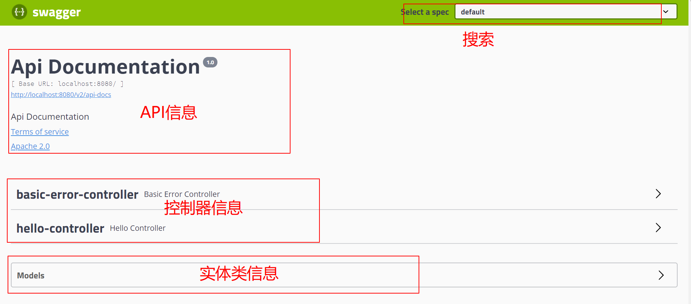
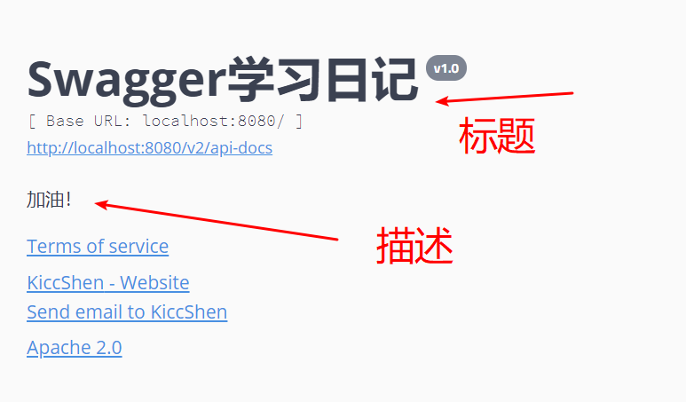
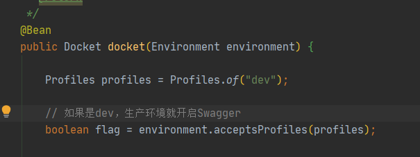
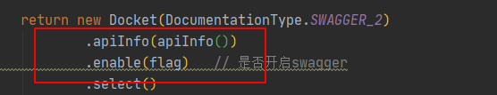
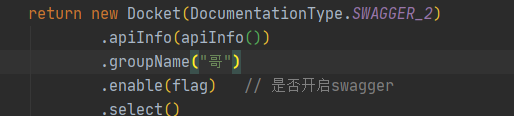
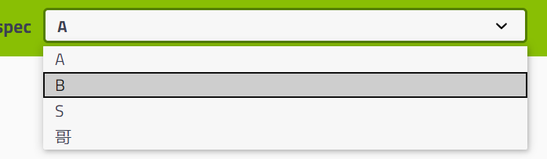
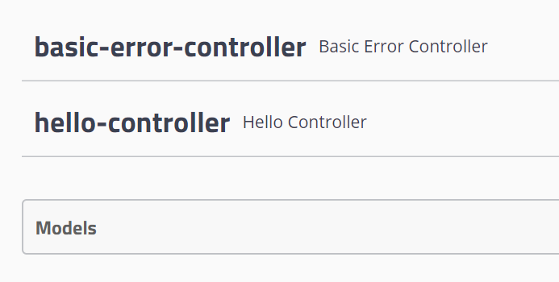

# 产品需求


前后端分离：

- 前端测试后端接口：postman
- 后端提供接口，需要实时更新最新的消息及改动。


# Swagger

- 号称最流行的APIs框架；
- RestFul API 文档在线自动生成工具=>API文档与API定义同步更新
- 直接运行，可以在线测试API接口
- 支持多种语言


在项目中使用Swagger需要springbox;

- swagger2
- ui


# Spring Boot 中集成 Swagger

1. 新建一个空的SpringBoot项目

2. 导入依赖 

    ```xml
    <dependency>
        <groupId>io.springfox</groupId>
        <artifactId>springfox-swagger2</artifactId>
        <version>2.9.2</version>
    </dependency>
    
    <dependency>
        <groupId>io.springfox</groupId>
        <artifactId>springfox-swagger-ui</artifactId>
         <version>2.9.2</version>
    </dependency>
    ```

3. 编写hello工程

4. 配置Swagger：添加Config

    ```java
    @Configuration
    @EnableSwagger2 // 开启Swagger
    public class SwaggerConfig {
    
    }
    ```

5. 测试 localhost:8080/swagger-ui.html

    > 这个静态文件从 webjars中来的，也是Springboot的静态资源文件访问路径之一。




# 配置Swagger相关


一、ApiInfo配置

```java
/**
 * 配置 Swagger 的 Docket 的 bean实例
 * @return
 */
@Bean
public Docket docket() {
    return new Docket(DocumentationType.SWAGGER_2).apiInfo(apiInfo());
}

/**
 * 配置Swagger信息=apiInfo
 * @return
 */
private ApiInfo apiInfo() {


    // 作者信息
    Contact contact = new Contact("KiccShen", "www.aliyun.com", "kiccshen@whu.edu.cn");

    return new ApiInfo(
            "Swagger学习日记",
            "加油！",
            "v1.0", "www.nowcoder.com",
            contact,
            "Apache 2.0",
            "http://www.apache.org/licenses/LICENSE-2.0",
            new ArrayList());

}
```

在Swagger中， 需要通过Docket实例进行管理。首先，需要配置的是ApiInfo。




其实就 Title 和 Desc 有用。


**二、Swagger 扫描接口**


Docket.select() 

```java
    @Bean
    public Docket docket() {
        return new Docket(DocumentationType.SWAGGER_2)
                .apiInfo(apiInfo())
                .enable(false)   // 是否开启swagger
                .select()
                // RequestHandlerSelectors：配置要扫描接口的方式
//                .apis(RequestHandlerSelectors.basePackage("com.kicc.swagger.controller")) //扫描指定包
//                .apis(RequestHandlerSelectors.withClassAnnotation(RestController.class))  // 扫描带有RestController注解的类
                .apis(RequestHandlerSelectors.withMethodAnnotation(GetMapping.class))    // 扫描带有GetMapping注解的方法
                // 通过路径过滤
                .paths(PathSelectors.ant("/bye/**"))  //要扫描 url = /bye/下的
                .build();
    }
```

链式调用：

- new Docket() ->
- apiInfo() ->  ；swagger 配置信息
- enable() ->  ；是否开启swagger
- select() ->   ； 开启选择
- apis()->       ； 指定如何扫描
- paths()->    ；  指定如何过滤路径
- build()         ； 最终构建


> 问：我只希望我的Swagger在生产环境中使用，在发布的时候不使用。

- 判断是不是生产环境  flag = true \ false
- 获取项目的环境。 ==Environment==.acceptsProfiles()，



- 用flag去开启或者关闭swagger 




> 根据上面的问题，如何获得环境？

通过Environment去获取Profiles


# 配置API文档的分组





## 配置多个分组

配置多个Docket就可以啦，用于多人协同开发。自己写自己的文档！

```java
@Bean
public Docket docket1() {
    return new Docket(DocumentationType.SWAGGER_2).groupName("A");
}

@Bean
public Docket docket3() {
    return new Docket(DocumentationType.SWAGGER_2).groupName("B");
}

@Bean
public Docket docket2() {
    return new Docket(DocumentationType.SWAGGER_2).groupName("S");
}
```





# Model （实体类) 配置





让实体类被扫描到：

```java
/**
 * 只要我们的接口，返回值中存在实体类。就能被扫描到
 * @return
 */
@RequestMapping(value = "/user", method = RequestMethod.POST)
public User user() {
    return new User();
}
```


让网页中的Controller和Model显示更多注释

- @Api("")
- @ApiModel("")
- @ApiModelProperty("")
- ...


```java
@ApiModel("实体用户类")
public class User {

    @ApiModelProperty("用户名")
    public String username;
    @ApiModelProperty("用户密码")
    public String password;
}
```

