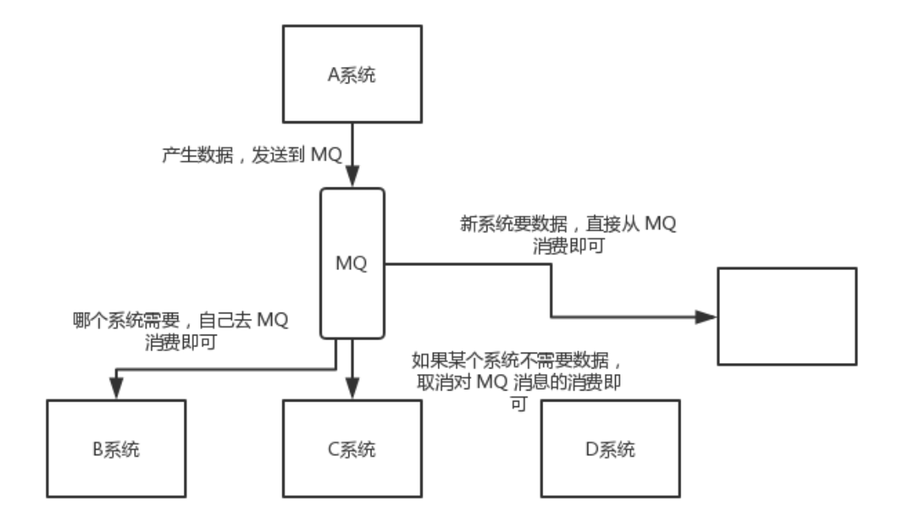
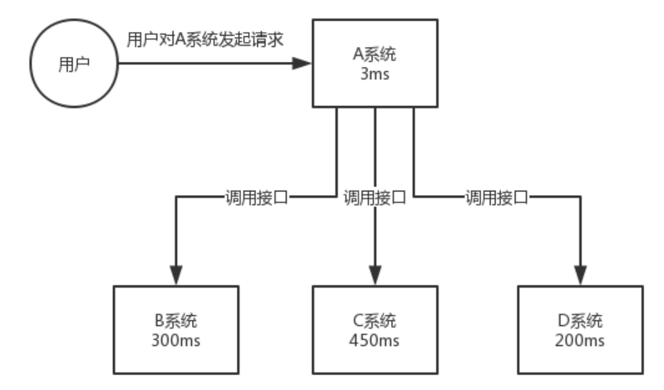
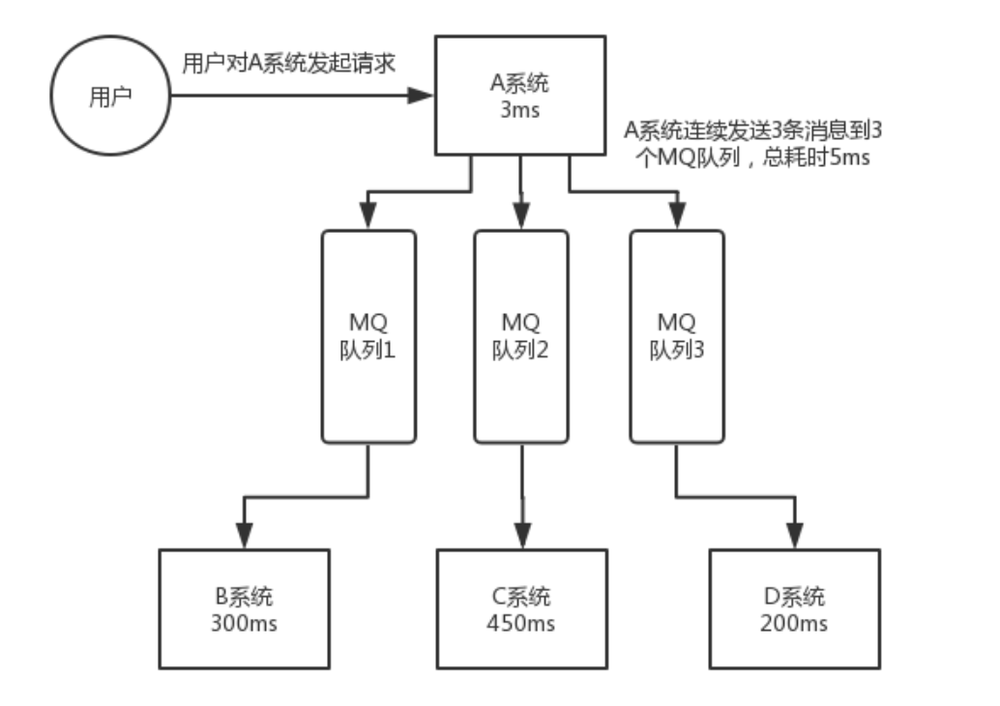

# 1 什么 是消息队列MQ

> 简单理解：要把传输的数据放在队列里。


# 2 为什么需要MQ

> 不用MQ的业务场景中存在着什么问题？


## 2.1 问题1：耦合性高


### 2.1.1 问题描述


```java
public class SystemA {

    // 系统B和系统C的依赖
    SystemB systemB = new SystemB();
    SystemC systemC = new SystemC();

    // 系统A独有的数据userId
    private String userId = "Java3y";

    public void doSomething() {

        // 系统B和系统C都需要拿着系统A的userId去操作其他的事
        systemB.SystemBNeed2do(userId);
        systemC.SystemCNeed2do(userId);

    }
}
```

有如上的这么一个简单的业务场景：A系统产生了数据（消息）userId。提供给B、C调用。


- 场景变化1：B说它抛弃这个接口，不再使用SystemBNeed2do。 A就需要把这个业务接口关闭。
- 场景变化2：突然来了一个C系统需要用userId，那么A系统要再加上C系统的接口。
- 场景变化3：D、E、F...


每一次调用A系统产生的数据的 其他系统发生变化时，连带着会需要手动改变A系统。这种系统架构的耦合性太高。


### 2.1.2 解耦

在系统A与其他系统中间添加MQ，A系统会产生数据发送到MQ；其他系统需要的时候去MQ中取就可以了。

需要注意的是，这里的调用求是不直接同步调用。




## 2.2 响应太慢


### 2.2.1 问题描述




用户对A系统发起请求，希望在尽可能短的时间内得到反馈。

- A调用B接口：300ms
- 调用C接口：450ms
- 调用D接口：200ms

同步地把BCD三个接口都调用需要花费950 + 3 +5 ms。


### 2.2.2 异步





在系统A与其他系统中添加MQ，用户得到反馈的时间缩减到 3 + 5 ms. 

**举例说明：**

火车票订单：用户下单后，希望马上得到订票成功的系统提示。这个时间需要控制在非常短。

而后续有短信通知，火车票的详细信息这个业务并不是那么重要，可以作为BCD系统中的业务。过个几分钟发过来用户也不会着急。


## 2.3 短时请求数爆炸


### 2.3.1 问题描述

类似于限时秒杀的活动，短时间内用户的访问量激增。假设每秒的并发请求超过了MySQL可以操作的最大值。系统就会崩溃。

### 2.3.2 削峰

增加MQ，先把消息放入到队列中，MySQL按照它能处理的峰值速度慢慢处理。用户只要知道我下单成功了。具体的数据库持久化信息当时没有存入数据库也没有关系。只要存储的过程不出错，那么慢慢来就没有任何问题。


> 用了MQ之后能解决什么问题？


# 3 优点

- 解耦
- 削峰
- 异步


# 4 缺点

## 4.1 系统可用性降低

在原有的系统架构上增加了一个MQ（或者多个MQ），势必增加了系统崩坏的可能性。

> 保证高可用

不同的MQ有各自的方案

https://gitee.com/shishan100/Java-Interview-Advanced/blob/master/docs/high-concurrency/how-to-ensure-high-availability-of-message-queues.md


## 4.2 系统复杂性提高

多加了一个MQ，如何保证消息没有重复消费？又如何处理消息丢失的情况？


## 4.3 一致性问题

如何保证所有系统的请求一致。


# 5 常见的MQ


- Kafka：大数据领域一哥。
- ActiveMQ：年代久远，算了吧。
- RabbitMQ ：开源，社区活跃。
- RocketMQ：阿里出品，大厂必备。


