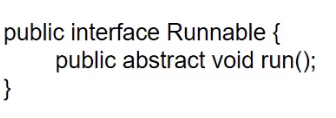

# 并发

同一个对象被多个线程操作。

## 线程不安全


- 多个线程同时操作一个对象，产生线程不安全现象

假设这里是买火车票的情况

```java
public class ThreadTest1 implements Runnable {

    private int ticketNum = 10;

    @lombok.SneakyThrows
    public void run() {

        while (true) {
            if (ticketNum<=0) {
                break;
            }
            Thread.sleep(200);

            System.out.println(Thread.currentThread().getName() + "-->拿到了第"+ticketNum-- + "张票");

        }
    }

}
```


测试

```java
public class MyTest {

    public static void main(String[] args) {
        ThreadTest1 ticket = new ThreadTest1();

        // 多线程操作同一个对象，出现资源被重复使用的现象
        new Thread(ticket, "小明").start();
        new Thread(ticket, "老师").start();
        new Thread(ticket, "黄牛").start();
    }

}
```

```
小明-->拿到了第10张票
黄牛-->拿到了第9张票
老师-->拿到了第8张票
老师-->拿到了第7张票
小明-->拿到了第7张票
黄牛-->拿到了第6张票
老师-->拿到了第4张票
黄牛-->拿到了第3张票
小明-->拿到了第5张票
小明-->拿到了第2张票
黄牛-->拿到了第0张票
老师-->拿到了第1张票
```

可以看到，同一张票有多次被取到的情况。


# 线程状态


## 死亡

如何停止一个线程？

- 不推荐JDK提供的 stop(), destroy()方法。【已废弃】
- 推荐线程自己停下来。
- 建议使用一个标志位进行终止变量。当flag=false，则线程终止。


```java
public class TestStop implements Runnable {
    private boolean flag = true;

    public void run() {
        int i=0;
        while (flag) {
            System.out.println("run .... Thread" + i++);
        }
    }


    public void stop() {
        this.flag = false;
    }
}
```


## 创建


## 就绪

当线程调用start()方法时，线程就进入了就绪状态。


## 运行


## 阻塞

- 线程休眠
    - sleep(millis)：模拟网络延迟，放大问题的发生性。**不会释放锁。**
- 线程礼让
    - yield：A线程执行yield，并不能保证A不再执行。礼让不一定成功。


## 守护线程

```java
public class TestDeamon {

    public static void main(String[] args) {
        God god = new God();
        You you = new You();

        Thread thread = new Thread(god);
        thread.setDaemon(true);
        thread.start(); // 上帝守护线程启动，JVM不需要等待其结束
        
        new Thread(you).start();
    }

}


class God implements Runnable {

    public void run() {
        while (true) {
            System.out.println("God bless you");
        }
    }
}

class You implements Runnable {

    public void run() {
        for (int i = 0; i < 100; i++) {
            System.out.println("你一直开心的活着, 第" + i + "年");
        }
        System.out.println(" ========= go to heaven.=========");
    }
}
```

- 用thread.setDeamon(true) 将一个用户线程设置为守护线程。JVM就不需要等待他执行完毕。只要其他的用户线程执行完毕，那么程序就可以退出了。**（实际中推出前还守护线程还执行了一会）**


# 线程同步

队列+锁


## 不同步的情况

错误的范例：银行取钱

```java
public class UnsafeBank {
    public static void main(String[] args) {
        Account account = new Account(100, "度假基金");

        Withdraw kai = new Withdraw(account, 50, "Kai");
        Withdraw lei = new Withdraw(account, 100, "Lei");

        kai.start();
        lei.start();
    }
}


class Account {
    int money;
    String name;

    public Account(int money, String name) {
        this.money = money;
        this.name = name;
    }

    public int getMoney() {
        return money;
    }

    public void setMoney(int money) {
        this.money = money;
    }
}


class Withdraw extends Thread {

    private Account account;
    private int withdrawMoney;
    private int nowMoney;

    public Withdraw(Account account, int withdrawMoney, String name) {
        super(name);
        this.account = account;
        this.withdrawMoney = withdrawMoney;
    }

    @SneakyThrows
    @Override
    public void run() {
        // 判断有没有钱
        if (account.money-withdrawMoney<0) {
            System.out.println(Thread.currentThread().getName() + "钱不够了，取不了");
        }

        Thread.sleep(1000);

        //卡内余额 = 原本的钱 - withDrawMoney
        account.money = account.money-withdrawMoney;
        //你手里的钱
        nowMoney = nowMoney+withdrawMoney;

        System.out.println(account.name + "余额为：" + account.money);
        System.out.println(this.getName() + "手里的钱为：" + nowMoney);

    }

}
```

度假基金余额为：0
度假基金余额为：0
Lei手里的钱为：100
Kai手里的钱为：50

度假基金余额为：50
度假基金余额为：50
Kai手里的钱为：50
Lei手里的钱为：100

度假基金余额为：-50
度假基金余额为：-50
Kai手里的钱为：50
Lei手里的钱为：100


这三种输出都有可能发生。


## synchronized

在代码中，分为同步方法和同步块。

对一个大的方法使用同步，有可能会极大地影响性能：

- 一个方法中，可能分为只读和其他操作代码。只读的代码不需要进行同步。（对其加了同步就造成了资源的浪费）
- 用作方法的关键字时，默认锁this对象。

```java
@SneakyThrows
@Override
public synchronized void run() {
    // 判断有没有钱
    if (account.money-withdrawMoney<0) {
        System.out.println(Thread.currentThread().getName() + "钱不够了，取不了");
    }

    Thread.sleep(1000);

    //卡内余额 = 原本的钱 - withDrawMoney
    account.money = account.money-withdrawMoney;
    //你手里的钱
    nowMoney = nowMoney+withdrawMoney;

    System.out.println(account.name + "余额为：" + account.money);
    System.out.println(this.getName() + "手里的钱为：" + nowMoney);

}
```


对run方法进行加锁后，取钱出错的问题依然存在，这是因为：

- 加锁的对象是this，而取钱的对象应该是account。所以锁无效
- 形象的说，两个人去银行取钱，我把银行锁了（而不是账户），那有区别吗？
- 应该改为：

```java
class Withdraw extends Thread {

    private Account account;
    private int withdrawMoney;
    private int nowMoney;

    public Withdraw(Account account, int withdrawMoney, String name) {
        super(name);
        this.account = account;
        this.withdrawMoney = withdrawMoney;
    }

    @SneakyThrows
    @Override
    public void run() {

        synchronized (account) {

            // 判断有没有钱
            if (account.money - withdrawMoney < 0) {
                System.out.println(Thread.currentThread().getName() + "钱不够了，取不了");
                return;
            }

            Thread.sleep(100);

            //卡内余额 = 原本的钱 - withDrawMoney
            account.money = account.money - withdrawMoney;
            //你手里的钱
            nowMoney = nowMoney + withdrawMoney;

            System.out.println(account.name + "余额为：" + account.money);
            System.out.println(this.getName() + "手里的钱为：" + nowMoney);
        }

    }

}
```

> P20


# Lambda 表达式


## 为什么要使用

- 避免匿名内部类定义过多
- 可以让你的代码看起来很简洁
- 去掉了一堆没有意义的代码，只留下核心的逻辑


## 函数式接口

- 任何接口，如果只包含唯一一个抽象方法，那么它就是一个函数式接口




## lambda 演化过程

1. 接口 + 实现类

    ```java
    interface ILike {
        public abstract void lambda() ;
    }
    
    class Like implements ILike {
    
        public void lambda() {
            System.out.println("I like lambda 1.");
        }
    }
    ```

2. 内部类

    ```java
    public class TestLambda {
    
        static class Like2 implements ILike {
    
            public void lambda() {
                System.out.println("I like lambda 2.");
            }
        }
    
    
        public static void main(String[] args) {
            Like like1 = new Like();
            like1.lambda();
    
            new Like2().lambda();
    
        }
    }
    ```

3. 方法内部类

    ```java
    public static void main(String[] args) {
        Like like1 = new Like();
        like1.lambda();
    
        new Like2().lambda();
    	
        // 方法内部类
        class Like3 implements ILike {
    
            public void lambda() {
                System.out.println("I like lambda 3.");
            }
        }
        
        new Like3().lambda();
    
    
    
    }
    ```

4. 匿名类

    ```java
    new ILike() {
    
        public void lambda() {
            System.out.println("I like lambda 4.");
        }
    }.lambda();
    ```

5. lambda表达式

    ```java
    like = ()->{
            System.out.println("I like lambda 5.");
    };
    
    like.lambda();
    ```

6. 带参数的lambda表示式

    ```java
    interface ILove {
        void love(int a) ;
    }
    
    ILove love = null;
    love = (int a)->{
    System.out.println("i like this one -->" +  a);
    };
    ```

    