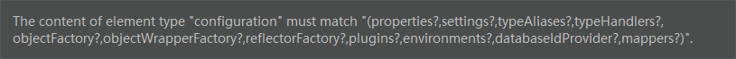

# 1、Mybatis


## 1.1、什么是Mybatis


- MyBatis 是一款优秀的**持久层框架**。

- 它支持自定义 SQL、存储过程以及高级映射。
- MyBatis 免除了几乎所有的 JDBC 代码以及设置参数和获取结果集的工作。
- MyBatis 可以通过简单的 XML 或注解来配置和映射原始类型、接口和 Java POJO（Plain Old Java Objects，普通老式 Java 对象）为数据库中的记录。

通过Maven获取

```xml
<!-- https://mvnrepository.com/artifact/org.mybatis/mybatis -->
<dependency>
    <groupId>org.mybatis</groupId>
    <artifactId>mybatis</artifactId>
    <version>3.4.6</version>
</dependency>
```


## 1.2、持久化

数据持久化

- 持久化：就数据的瞬时状态 <==> 持久状态 转化过程。


## 1.3、持久层

常见的DAO、Service、Controller层。

- 完成持久化工作的代码块。
- 层界限十分明显。


# 2、第一个Mybatis程序

搭建环境-->导入Mybatis-->


## 2.1、导入依赖

```xml
<dependencies>

    <dependency>
        <groupId>mysql</groupId>
        <artifactId>mysql-connector-java</artifactId>
        <version>5.1.29</version>
    </dependency>

    <dependency>
        <groupId>junit</groupId>
        <artifactId>junit</artifactId>
        <version>4.12</version>
        <scope>test</scope>
    </dependency>

    <dependency>
        <groupId>org.mybatis</groupId>
        <artifactId>mybatis</artifactId>
        <version>3.4.6</version>
    </dependency>

</dependencies>
```


## 2.2、 创建一个模板


- 编写Mybatis核心配置文件

```xml
<?xml version="1.0" encoding="UTF-8" ?>
<!DOCTYPE configuration
        PUBLIC "-//mybatis.org//DTD Config 3.0//EN"
        "http://mybatis.org/dtd/mybatis-3-config.dtd">
<configuration>
    <environments default="development">
        <environment id="development">
            <transactionManager type="JDBC"/>
            <dataSource type="POOLED">
                <property name="driver" value="$com.mysql.jdbc.Driver"/>
                <property name="url" value="jdbc:mysql://localhost:3306/mybatis?useSSL=true&amp;useUnicode=true&amp;characterEncoding=UTF-8"/>
                <property name="username" value="root"/>
                <property name="password" value="$admin"/>
            </dataSource>
        </environment>
    </environments>
    <mappers>
        <mapper resource="org/mybatis/example/BlogMapper.xml"/>
    </mappers>
</configuration>
```


- 编写mybatis工具类

```java
public class MybatisUtils {
    private static SqlSessionFactory sqlSessionFactory;

    static {
        // 使用Mybatis的第一步：获取sqlSessionFactory对象
        try {
            String resource = "org/mybatis/example/mybatis-config.xml";
            InputStream inputStream = Resources.getResourceAsStream(resource);
            sqlSessionFactory = new SqlSessionFactoryBuilder().build(inputStream);

        } catch (IOException e) {
            e.printStackTrace();
        }
    }

    /**
     * 既然有了 SqlSessionFactory，顾名思义，我们可以从中获得 SqlSession 的实例。
     * SqlSession 提供了在数据库执行 SQL 命令所需的所有方法。
     * 你可以通过 SqlSession 实例来直接执行已映射的 SQL 语句。
     * @return
     */
    public static SqlSession getSqlSession() {
        SqlSession session =  sqlSessionFactory.openSession();
        return session;
    }

}
```

使用的时候MybatisUtils.getSession()


## 2.3、编写代码

- 实体类

    ```java
    public class User {
        private String name;
        private int id;
        private String pwd;
    
        public User() {
    
        }
    
        public User(String name, int id, String pwd) {
            this.name = name;
            this.id = id;
            this.pwd = pwd;
        }
    ```

    

- Dao/Mapper接口

    ```java
    public interface UserMapper {
    
        public List<User> getUserList() ;
    }
    ```

- 接口实现类（用xml代替）

    ```xml
    <?xml version="1.0" encoding="UTF-8" ?>
    <!DOCTYPE mapper
            PUBLIC "-//mybatis.org//DTD Mapper 3.0//EN"
            "http://mybatis.org/dtd/mybatis-3-mapper.dtd">
    <!--namespace=绑定一个对应的Mapper/Dao接口-->
    <mapper namespace="com.kicc.dao.UserMapper">
        <!--select 查询语句： id是对应的方法，返回值类型是User.先不用管List-->
        <select id="getUserList" resultType="com.kicc.pojo.User">
            select * from mybatis.user;
        </select>
    </mapper>
    ```

    ## 2.4、测试

junit测试

```java
    @Test
    public void test() {
        // 第一步：获取session实例
        SqlSession session = MybatisUtils.getSqlSession();

        // 方式一：获取Mapper
        UserDao userDao = session.getMapper(UserDao.class);


        List<User> users =  userDao.getUserList();

        for (User user : users) {
            System.out.println(user.toString());
        }

        session.close();

    }
}
```


常见问题：

- Maven由于约定大于配置，我们之后可能遇到我们写的配置文件，无法被导出或者生成的问题，解决方案：

```xml
<!--在build中配置resources，来防止我们资源导出失败的问题-->
<build>
    <resources>
        <resource>
            <directory>src/main/resources</directory>
            <includes>
                <include>**/*.properties</include>
                <include>**/*.xml</include>
            </includes>
            <filtering>true</filtering>
        </resource>
        <resource>
            <directory>src/main/java</directory>
            <includes>
                <include>**/*.properties</include>
                <include>**/*.xml</include>
            </includes>
            <filtering>true</filtering>
        </resource>
    </resources>
</build>
```

- XML文件中尽量不涉及中文
- 如果运行失败，将UTF-8改为UTF8试试


总结：

- 在mybatis-config.xml中配置jdbc连接
- 在mybatis-config.xml中设置mapper的resource：具体Mapper实现的xml文件（用xml文件代替传统的DAOImpl实现类）
- 创建sqlSession连接类
- 创建实体类User （pojo）
- 创建接口UserMapper（UserDao）
- UserMapper.xml实现。
    - 定义命名空间namespace=接口
    - 具体sql操作：定义id（绑定的方法），返回类型。
- 使用（测试）：
    1. 获取Session实例（数据库连接）
    2. 通过Session获取Mapper(UserDao.class)的实例
    3. 通过实例调用具体方法。


# 3、CRUD

## 3.1、命名空间

namespace中的包名要和Dao/Mapper接口的包名一致


## 3.2、select

选择，查询语句；

- id：接口中对应的方法
- resultType：sql语句返回的执行值
- parameterType：参数类型

```xml
<select id="getUserList" resultType="com.kicc.pojo.User">
    select * from mybatis.user;
</select>

<select id="getUserById" resultType="com.kicc.pojo.User">
    select * from mybatis.user where id = #{id};
</select>
```


## 3.3、基本增删改

插入举例：

接口：

```java
/**
 * 插入一个用户
 * @param user
 * @return
 */
public boolean doCreate(User user) ;
```


xml

```xml
<!--对象中的属性可以直接取出来-->
<insert id="doCreate" parameterType="com.kicc.pojo.User" >
    INSERT INTO mybatis.user (id, name, pwd) values (#{id}, #{name}, #{pwd});
</insert>
```

因为规定了ParameterType，因此#{id},#{name},#{pwd}都是User下的属性。


更新：

```xml
<update id="updateUser" parameterType="com.kicc.pojo.User">
    UPDATE mybatis.user SET name=#{name}, pwd=#{pwd} WHERE id=#{id};
</update>
```


测试：

```java
@Test
public void testUpdateUser() {
    SqlSession session = MybatisUtils.getSqlSession();

    UserMapper userMapper = session.getMapper(UserMapper.class);

    User user = new User(4, "Kris", "99887745123!");

    if (userMapper.updateUser(user)) {
        System.out.println("更新成功！");
    }


    session.commit();
    session.close();
}
```

注意 **增删改必须要加事务的Commit！必须提交事务！**


## 3.4、万能的Map


可以传参Map<key,value>

接口：

```java
/**
 * 通过Map更新一个用户
 * @return
 */
boolean updateUser2(Map<String, Object> map) ;
```


xml:

```xml
<update id="updateUser2" parameterType="map">
    UPDATE mybatis.user SET name=#{name} WHERE id=${id};
</update>
```


测试

```java
@Test
public void testUpdateUser2() {
    SqlSession session = MybatisUtils.getSqlSession();

    UserMapper mapper = session.getMapper(UserMapper.class);

    Map<String, Object> map = new HashMap<String, Object>();
    map.put("name", "KKKrics");
    map.put("id", 4);
    mapper.updateUser2(map);

    session.commit();
    session.close();

}
```


与传入User对象比较：

- 如果一个User对象有很多字段，那么更新update的时候，必须new 一个对象，传入所有的参数。
- 如果使用HashMap，只要传入id（用于定位），再传入需要修改的字段就足够。
- 而且在xml中，只需要传入#{key}就可以。能直接获取value


**可以用于实体类参数过多的情况！**


## 3.5、模糊查询


1. Java代码执行的时候，传入通配符%%

    ```java
    List<User> users = mapper.getUserLike("K%K%");
    ```

2. 在SQL拼接中使用通配符。（安全，防止SQL注入）

```xml
<select id="getUserLike" parameterType="string" resultType="com.kicc.pojo.User">
    select * from mybatis.user where name like "%"#{value}"%";
</select>
```


# 4、配置解析

MyBatis 的配置文件包含了会深深影响 MyBatis 行为的设置和属性信息。 

## 4.1、核心配置文件

configuration（配置）

- [properties（属性）](https://mybatis.org/mybatis-3/zh/configuration.html#properties)
- [settings（设置）](https://mybatis.org/mybatis-3/zh/configuration.html#settings)
- [typeAliases（类型别名）](https://mybatis.org/mybatis-3/zh/configuration.html#typeAliases)
- [typeHandlers（类型处理器）](https://mybatis.org/mybatis-3/zh/configuration.html#typeHandlers)
- [objectFactory（对象工厂）](https://mybatis.org/mybatis-3/zh/configuration.html#objectFactory)
- [plugins（插件）](https://mybatis.org/mybatis-3/zh/configuration.html#plugins)
- environments（环境配置）
    - environment（环境变量）
        - transactionManager（事务管理器）**JDBC | MANAGED 两种**
        - dataSource（数据源） **UNPOOLED | POOLED | JNDI**
- [databaseIdProvider（数据库厂商标识）](https://mybatis.org/mybatis-3/zh/configuration.html#databaseIdProvider)
- [mappers（映射器）](https://mybatis.org/mybatis-3/zh/configuration.html#mappers)


## 4.2、环境配置

更换环境：

```xml
<environments default="test">
    <environment id="development">
        <transactionManager type="JDBC"/>
        <dataSource type="POOLED">
            <property name="driver" value="com.mysql.jdbc.Driver"/>
            <property name="url" value="jdbc:mysql://localhost:3306/mybatis?useSSL=true&amp;useUnicode=true&amp;characterEncoding=UTF-8"/>
            <property name="username" value="root"/>
            <property name="password" value="admin"/>
        </dataSource>
    </environment>

    <environment id="test">
        <transactionManager type="MANAGED"></transactionManager>
        <dataSource type="UNPOOLED"></dataSource>
    </environment>

</environments>
```

把default的改为id为test的环境即可。


- transactionManager：事务管理器
    - **JDBC**：默认
    - **MANAGED**

- dataSource：用于连接数据库
    - **POOLED**：用完可以回收，连完先不关闭数据库。能使并发 Web 应用快速响应请求。
    - **JNDI**用于EJB，现在不怎么用。
    - **UNPOOLED**：这个数据源的实现会每次请求时打开和关闭连接。虽然有点慢，但对那些数据库连接可用性要求不高的简单应用程序来说，是一个很好的选择。


## 4.3、属性（properties）


这些属性可以在外部进行配置，并可以进行动态替换。你既可以在典型的 Java 属性文件中配置这些属性，也可以在 properties 元素的子元素中设置。【db.properties】

不需要直接写在mybatis-config.xml中，可以写在properties中再导入。

<properties></properties>标签必须写到xml中<configuration>的第一个位置。否则有如下错误：




db.properties:

```sh
driver=com.mysql.jdbc.Driver
url=jdbc:mysql://localhost:3306/mybatis?useSSL=true&useUnicode=true&characterEncoding=UTF-8
username=root
password=admin
```


xml

```xml
<!--引入外部配置文件-->
<properties resource="db.properties"/>

<environments default="development">
    <environment id="development">
        <transactionManager type="JDBC"/>
        <dataSource type="POOLED">
            <property name="driver" value="${driver}"/>
            <property name="url" value="${url}"/>
            <property name="username" value="${username}"/>
            <property name="password" value="${password}"/>
        </dataSource>
    </environment>
```

```xml
<!--引入外部配置文件-->
<properties resource="db.properties">
    <property name="username" value="root"/>
    <property name="password" value="123456"/>
</properties>
```

 两种方式都可以，优先读取db.properties.


## 4.4、类型别名（typeAlias）

- 为每一个类起一个别名（包下类别少，可以自定义别名）

```xml
<!--给实体类起别名-->
<typeAliases>
    <typeAlias alias="User" type="com.kicc.pojo.User"/>
</typeAliases>
```

- 也可以指定package（包下类多时，使用，不能diy别名）

```xml
    <!--给实体类起别名-->
    <typeAliases>
<!--        <typeAlias alias="User" type="com.kicc.pojo.User"/>-->
        <package name="com.kicc.pojo"/>
    </typeAliases>
    
```

​	指定package的情况下，别名会默认用Java Bean类型的小写

- 用注解


## 4.5、Settings

这是 MyBatis 中极为重要的调整设置，它们会改变 MyBatis 的运行时行为。 下表描述了设置中各项设置的含义、默认值等。

| 设置名             | 描述                                                         | 有效值        | 默认值 |
| :----------------- | :----------------------------------------------------------- | :------------ | :----- |
| cacheEnabled       | 全局性地开启或关闭所有映射器配置文件中已配置的任何缓存。     | true \| false | true   |
| lazyLoadingEnabled | 延迟加载的全局开关。当开启时，所有关联对象都会延迟加载。 特定关联关系中可通过设置 `fetchType` 属性来覆盖该项的开关状态。 | true \| false | false  |

| logImpl | 指定 MyBatis 所用日志的具体实现，未指定时将自动查找。 | SLF4J \| LOG4J \| LOG4J2 \| JDK_LOGGING \| COMMONS_LOGGING \| STDOUT_LOGGING \| NO_LOGGING | 未设置 |
| ------- | ----------------------------------------------------- | ------------------------------------------------------------ | ------ |
|         |                                                       |                                                              |        |


## 4.6、其他配置

- plugins
    - mybatis-plus
    - 通用mapper


## 4.7、映射器（mappers）

用resource

```xml
    <mappers>
        <mapper  resource="com/kicc/dao/UserMapper.xml"/>
    </mappers>
```

用class

```xml
    <mappers>
        <mapper class="com.kicc.dao.UserMapper"/>
    </mappers>
```

用package

```xml
    <mappers>
        <package name="com.kicc.dao"/>
    </mappers>
```

