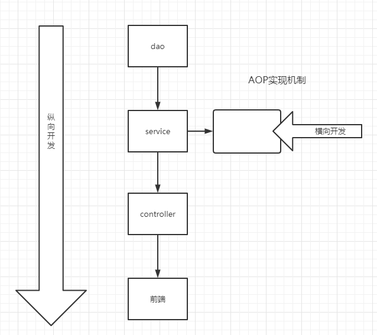
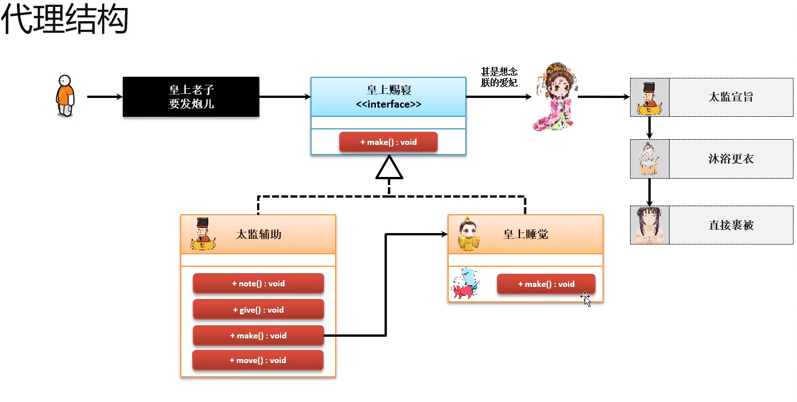
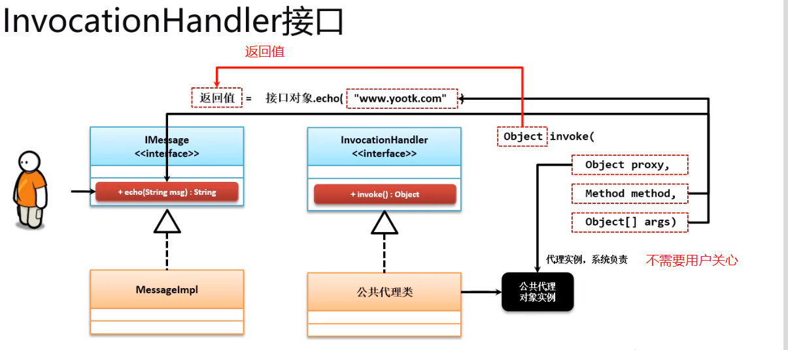
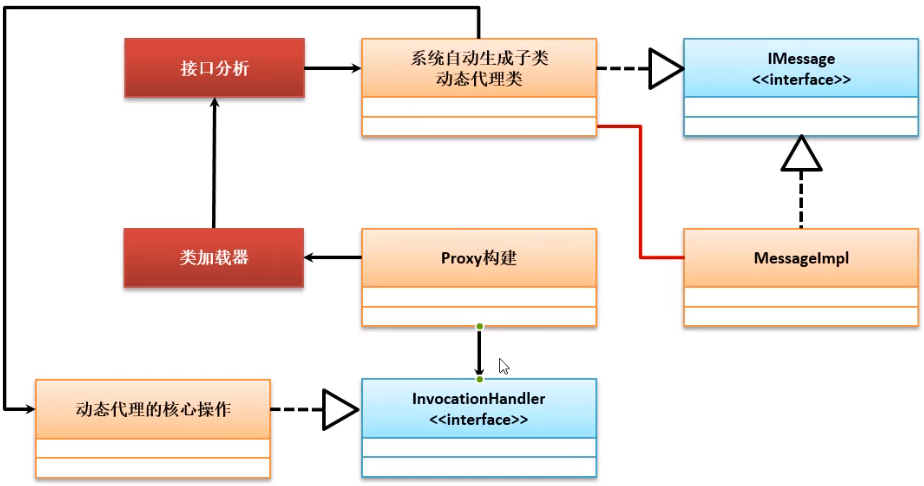

# **1** 单例模式

## 介绍

### 意图：

保证一个类仅有一个实例，并提供一个访问它的全局访问点。

### 主要解决：
一个全局使用的类频繁地创建与销毁。
### 何时使用：
当您想控制实例数目，节省系统资源的时候。

### 如何解决：
判断系统是否已经有这个单例，如果有则返回，如果没有则创建。

### 关键代码：
构造函数是私有的。

### 应用实例:

1、一个班级只有一个班主任。
2、Windows 是多进程多线程的，在操作一个文件的时候，就不可避免地出现多个进程或线程同时操作一个文件的现象，所以所有文件的处理必须通过唯一的实例来进行。
3、一些设备管理器常常设计为单例模式，比如一个电脑有两台打印机，在输出的时候就要处理不能两台打印机打印同一个文件。

### 优点：
1、在内存里只有一个实例，减少了内存的开销，尤其是频繁的创建和销毁实例（比如管理学院首页页面缓存）。
2、避免对资源的多重占用（比如写文件操作）。

### 缺点：

没有接口，不能继承，与单一职责原则冲突，一个类应该只关心内部逻辑，而不关心外面怎么样来实例化。

### 使用场景：

1、要求生产唯一序列号。
2、WEB 中的计数器，不用每次刷新都在数据库里加一次，用单例先缓存起来。
3、**创建的一个对象需要消耗的资源过多**，比如 I/O 与数据库的连接等。

### 注意事项：
getInstance() 方法中需要使用同步锁 synchronized (Singleton.class) 防止多线程同时进入造成 instance 被多次实例化。


## 实现方式


1. 【懒汉式，线程不安全。】
    特点：简单，不支持多线程。严格来说，不算是单例。

  因为没有加锁，如果多线程创建的时候，根据调度时间不同，可能会创建多个实例。

```java
public class Singleton {  
    private static Singleton instance;  
    private Singleton (){}  
  
    public static Singleton getInstance() {  
    if (instance == null) {  
        instance = new Singleton();  
    }  
    return instance;  
    }  
}
```


2. 【懒汉式，线程安全。】
 特点：简单，支持多线程。效率低。不同步。

 加synchronized 是为了实现多线程。为了保证可以线程安全。

 ```java
 public class Singleton {  
     private static Singleton instance;  
     private Singleton (){}  
     public static synchronized Singleton getInstance() {  
     if (instance == null) {  
         instance = new Singleton();  
     }  
     return instance;  
     }  
 }
 ```

 

3. 饿汉式
    特点：常用。容易出现垃圾对象。
    优点：没有加锁。效率高。
    缺点：类加载的时候就初始化了，浪费内存。

  ```java
  public class Singleton {  
      private static Singleton instance = new Singleton();  
      private Singleton (){}  
      public static Singleton getInstance() {  
      return instance;  
      }  
  }
  ```

  

4. 双检锁/双重校验锁（DCL，即 double-checked locking）
    特点：多线程。性能高，Lazy初始化（不需要类加载时读入内存）
    用了volatile关健字。保证所有线程中的值都一样。

  ```java
  public class Singleton {  
      private volatile static Singleton singleton;  
      private Singleton (){}  
      public static Singleton getSingleton() {  
      if (singleton == null) {  
          synchronized (Singleton.class) {  
          if (singleton == null) {  
              singleton = new Singleton();  
          }  
          }  
      }  
      return singleton;  
      }  
  }
  ```

  

5. 登记式/静态内部类

  ```java
  public class Singleton {  
      private static class SingletonHolder {  
      private static final Singleton INSTANCE = new Singleton();  
      }  
      private Singleton (){}  
      public static final Singleton getInstance() {  
      return SingletonHolder.INSTANCE;  
      }  
  }
  ```

  

6. 枚举

  ```java
  public enum Singleton {  
      INSTANCE;  
      public void whateverMethod() {  
      }  
  }
  ```

  

5和6不怎么用。 6是最好的，但是用的人不多。以后用到了再说。
平常使用就用3就行。


# 2 工厂模式

## 2.1简单工厂


### 定义接口

举例 Shape 接口，定义了一个空的draw方法

```java
public interface Shape {
   void draw();
}
```


### 具体类接口实现
具体实现三个不同shape的类 implements Shape

```java
Rectangle.java
public class Rectangle implements Shape {
 
   @Override
   public void draw() {
      System.out.println("Inside Rectangle::draw() method.");
   }
}

Square.java
public class Square implements Shape {
 
   @Override
   public void draw() {
      System.out.println("Inside Square::draw() method.");
   }
}

Circle.java
public class Circle implements Shape {
 
   @Override
   public void draw() {
      System.out.println("Inside Circle::draw() method.");
   }
}
```


### 工厂类具体实现
```java
public class ShapeFactory {
    
   //使用 getShape 方法获取形状类型的对象
   public Shape getShape(String shapeType){
      if(shapeType == null){
         return null;
      }        
      if(shapeType.equalsIgnoreCase("CIRCLE")){
         return new Circle();
      } else if(shapeType.equalsIgnoreCase("RECTANGLE")){
         return new Rectangle();
      } else if(shapeType.equalsIgnoreCase("SQUARE")){
         return new Square();
      }
      return null;
   }
}
```


### 测试

```java
public class FactoryPatternDemo {
 
   public static void main(String[] args) {
      ShapeFactory shapeFactory = new ShapeFactory();
 
      //获取 Circle 的对象，并调用它的 draw 方法
      Shape shape1 = shapeFactory.getShape("CIRCLE");
 
      //调用 Circle 的 draw 方法
      shape1.draw();
 
      //获取 Rectangle 的对象，并调用它的 draw 方法
      Shape shape2 = shapeFactory.getShape("RECTANGLE");
 
      //调用 Rectangle 的 draw 方法
      shape2.draw();
 
      //获取 Square 的对象，并调用它的 draw 方法
      Shape shape3 = shapeFactory.getShape("SQUARE");
 
      //调用 Square 的 draw 方法
      shape3.draw();
   }
}
```


在这个工厂类中通过传入不同的type可以new不同的形状，**返回结果为Shape 类型**，这个就是简单工厂核心的地方了。 这里就体现了面向对象的精髓。


## 2.2 工厂模式


### 工厂方法模式

与简单工厂类似，区别在于创建了多个工厂类。针对不同的对象提供不同的工厂。

继续说上面的shape，最好是把Shape改成Drawer，因为实现的方法是draw，这样能对应起来。
（自己知道就好）

现在要创建一个接口

```java
public interface DrawerFactory {
    Shape getDrawer();
}
```
针对每一个对象，创建一个自己的工厂类实现ShapeFactory

```java
public class CircleDrawerFactory implments DrawerFactory {
    @Override
    public Shape getDrawer() {
        return new CircleDrawer();    // CircleDrawer = CircleShape
    }
}
```

使用：

```java
CircleDrawerFactory factory = new CircleDrawerFactory();
Shape shape = factory.getDrawer();
shape.draw();
```

无论是什么factory，后面的两句都是一致的。

适用场景：
　（1）客户端不需要知道它所创建的对象的类。例子中我们不知道每个图片加载器具体叫什么名，只知道**创建它的工厂名**就完成了创建过程。　　
 （2）客户端可以通过子类来指定创建对应的对象。以上场景使用于采用工厂方法模式。


# 3 代理模式


## 3.1 静态代理

角色分析：

- 抽象角色： 一般会使用接口或者抽象类来解决
- 真实角色： 被代理的角色
- 代理角色： 代理真实角色，代理真实角色后，我们一般会做一些附属操作
- 客户：访问代理对象的人！


代码步骤：

 1. 接口

    ```java
    //租房接口
    public interface Rent {
        /**
         * 出租
         */
        public void rent();
    }
    ```

 2. 真实角色

    ```java
    // 房东
    public class Landlord implements Rent {
    
    
        public void rent() {
            System.out.println("房东要出租房子");
        }
    }
    ```

 3. 代理角色

    ```java
    public class Proxy {
        private Landlord landlord;
    
        public Proxy(){}
    
        public Proxy(Landlord landlord) {
            this.landlord = landlord;
        }
    
        public void rent() {
            seeHouse();
            landlord.rent();
            contract();
            fare();
        }
    
        public void seeHouse() {
            System.out.println("中介带你看房");
        }
    
        public void contract() {
            System.out.println("签合同");
        }
        public void fare() {
            System.out.println("收中介费");
        }
    }
    ```

    

 4. 客户端访问代理角色

    ```java
    public class Client {
        public static void main(String[] args) {
            //房东要租房子
            Landlord landlord = new Landlord();
            //代理，中介帮房东租房子。但是呢？代理角色一般会有附属操作。
            Proxy proxy = new Proxy(landlord);
            proxy.rent();
        }
    }
    ```

    


代理模式的好处：

- 可以使真实角色的操作更加纯粹 （房东租房）不需要去关注一些公共业务
- 公共就交给了代理角色。实现了业务的分工。
- 公共业务发生扩展的时候，方便集中管理

缺点：

- 一个真实角色就会产生一个代理角色；代码量就多了。开发效率变低。


### 3.1.1、加深理解

接口

```java
public interface UserService {
    public void add();
    public void delelte();
    public void update();
    public void query();
}
```


实现类

```java
public class UserServiceImpl implements UserService {

    public void add() {
        System.out.println("增加了一个用户");
    }

    public void delelte() {
        System.out.println("删除了一个用户");

    }

    public void update() {
        System.out.println("修改了一个用户");

    }

    public void query() {
        System.out.println("查询了一个用户");

    }
}
```


现在想添加一个log，则利用代理类

```java
public class UserServiceProxy implements UserService {

    private UserServiceImpl userService;

    public void setUserService(UserServiceImpl userService) {
        this.userService = userService;
    }

    public void add() {
        log("add");
        userService.add();
    }

    public void delelte() {
        log("delete");

        userService.delelte();
    }

    public void update() {
        log("update");

        userService.update();
    }

    public void query() {
        log("query");

        userService.query();
    }

    public void log(String msg) {
        System.out.println("[Debug] 使用了" + msg);
    }
}
```


测试类（没有用代理）这种情况下，如果想增加log，就只能去改变原来代码的逻辑（很不好

```java
public class Client {
    public static void main(String[] args) {
        UserService userService = new UserServiceImpl();

        userService.add();
    }
}
```


测试类（用了代理）

```java
public class Client {
    public static void main(String[] args) {
        UserService userService = new UserServiceImpl();
        UserServiceProxy proxy = new UserServiceProxy();
        proxy.setUserService((UserServiceImpl) userService);

        proxy.add();
    }
}
```


在不改变原来业务代码的基础上，可以添加一些新的功能。有点类似与Python的装饰器。

在公司开发中，为增加新的功能而改动原来可行的代码是大忌。

但是，确实增加了代码量！这也是缺点之一。我们用动态代理解决这个问题。




业务的开发一般按照纵向发展，从数据层一直到前端。后续开发中想要添加新的功能或做出一点修改。那么就需要面向切面编程。（横向） AOP

## 3.2 动态代理 （利用反射）


- 动态代理和静态代理角色一样
- 动态代理的代理类是动态生成的，不是我们直接写好的！
- 动态代理分为两类：基于接口的动态代理，基于类的动态代理
    - 基于接口---jdk 动态代理 【我们在这里使用】
    - 基于类：cglib
    - java字节码实现：javassit


主要涉及到两个重要的类 Proxy 和 InvocationHandler

- Proxy：java.lang.reflect.Proxy。提供了创建动态类代理和实例的静态方法。下面 f 就是一个代理实例。

    ```java
    Foo f = (Foo) Proxy.newProxyInstance(Foo.class.getClassLoader(),
                                              new Class<?>[] { Foo.class },
                                              handler);
    ```

- InvocationHandler：is the interface implemented by the *invocation handler* of a proxy instance. 是由代理实例的invocation handler实现的接口。


动态代理类实现InvocationHandler接口

```java
package com.kicc.demo04;

import java.lang.reflect.InvocationHandler;
import java.lang.reflect.Method;
import java.lang.reflect.Proxy;

/**
 * @author Kicc on 20/6/9.
 */
public class ProxyInvocationHandler implements InvocationHandler {

    /**
     * 被代理的接口
     */
    private Object target;

    /**
     * 必须实现setter方法
     * @param target
     */
    public void setTarget(Object target) {
        this.target = target;
    }

    /**
     * 生产动态代理类/实例
     */
    public Object getProxy() {
        return  Proxy.newProxyInstance(this.getClass().getClassLoader(),
                target.getClass().getInterfaces(), this);
    }

    /**
     * 处理代理的实例，并返回结果（真实地调用）
     * @param proxy
     * @param method
     * @param args
     * @return
     * @throws Throwable
     */
    public Object invoke(Object proxy, Method method, Object[] args) throws Throwable {
        log(method.getName());
        Object result = method.invoke(target, args);
        return result;
    }

    public void log(String msg) {
        System.out.println("执行了" + msg + "方法");
    }
}
```


测试

```java
public class Client {
    public static void main(String[] args) {

        // 真实的角色 （等价于房东）
        UserServiceImpl userService = new UserServiceImpl();

        //代理角色，不存在
        ProxyInvocationHandler pih = new ProxyInvocationHandler();

        // 设置要代理的对象
        pih.setTarget(userService);

        // 动态生成代理对象 （强转成接口，而不是实现类）
        UserService proxy = (UserService) pih.getProxy();

        // 代理对象调用方法
        proxy.add();


    }
}
```


动态代理的好处：

- 可以使真实角色的操作更加纯粹 （房东租房）不需要去关注一些公共业务
- 公共就交给了代理角色。实现了业务的分工。
- 公共业务发生扩展的时候，方便集中管理
- 一个动态代理类可以代理多个类。他代理的是一类业务。


- 对于原本的静态代理。有一个接口UserService。

    实现类 UserServiceImpl。 为了加一个log，实现了一个代理类 UserServiceProxy（实现类的实例作为字段）。用这个代理类去唯一代理实现类；

    那么我每实现一个UserService，就需要写一个对应的Proxy。代码量翻倍。

- 动态代理。有一个接口UserService。

    实现类UserServiceImpl。为了加一个log，实现一个ProxyInvocationHandler。（字段是Object，不是实现类）。用这个类去生成代理实现实例。

    使用时：

    1. 创建实现类的实例
    2. 生成代理角色（不是代理类、代理实例）
    3. 代理角色设置对象，1中的实例
    4. 动态的生成代理对象：getProxy
    5. 代理对象调用方法。

    


# 4 适配器模式


适配器模式（Adapter Pattern）是作为两个不兼容的接口之间的桥梁。这种类型的设计模式属于结构型模式，它结合了两个独立接口的功能。


## 介绍

**意图：**将一个类的接口转换成客户希望的另外一个接口。适配器模式使得原本由于接口不兼容而不能一起工作的那些类可以一起工作。

**主要解决：**主要解决在软件系统中，常常要将一些"现存的对象"放到新的环境中，而新环境要求的接口是现对象不能满足的。

**何时使用：** 1、系统需要使用现有的类，而此类的接口不符合系统的需要。 2、想要建立一个可以重复使用的类，用于与一些彼此之间没有太大关联的一些类，包括一些可能在将来引进的类一起工作，这些源类不一定有一致的接口。 3、通过接口转换，将一个类插入另一个类系中。（比如老虎和飞禽，现在多了一个飞虎，在不增加实体的需求下，增加一个适配器，在里面包容一个虎对象，实现飞的接口。）

**如何解决：**继承或依赖（推荐）。

**关键代码：**适配器继承或依赖已有的对象，实现想要的目标接口。

**应用实例：** 1、美国电器 110V，中国 220V，就要有一个适配器将 110V 转化为 220V。 2、JAVA JDK 1.1 提供了 Enumeration 接口，而在 1.2 中提供了 Iterator 接口，想要使用 1.2 的 JDK，则要将以前系统的 Enumeration 接口转化为 Iterator 接口，这时就需要适配器模式。 3、在 LINUX 上运行 WINDOWS 程序。 4、JAVA 中的 jdbc。

**优点：** 1、可以让任何两个没有关联的类一起运行。 2、提高了类的复用。 3、增加了类的透明度。 4、灵活性好。

**缺点：** 1、过多地使用适配器，会让系统非常零乱，不易整体进行把握。比如，明明看到调用的是 A 接口，其实内部被适配成了 B 接口的实现，一个系统如果太多出现这种情况，无异于一场灾难。因此如果不是很有必要，可以不使用适配器，而是直接对系统进行重构。 2.由于 JAVA 至多继承一个类，所以至多只能适配一个适配者类，而且目标类必须是抽象类。

**使用场景：**有动机地修改一个正常运行的系统的接口，这时应该考虑使用适配器模式。

**注意事项：**适配器不是在详细设计时添加的，而是解决正在服役的项目的问题。


## 实现


- 我们有MediaPlayer 这个接口，它有一个实现类 AudioPlayer，用来播放音频。
- 我们有AdvancedMediaPlayer接口，它有两个实现类VlcPlayer，Mp4Player用来播放视频。


### 目标

让 *AudioPlayer* 播放其他格式的音频文件。为了实现这个功能，我们需要创建一个实现了 *MediaPlayer* 接口的适配器类 *MediaAdapter*，并使用 *AdvancedMediaPlayer* 对象来播放所需的格式。


### 代码

- 接口 MediaPlayer.java

    ```java
    public interface MediaPlayer {
       public void play(String audioType, String fileName);
    }
    ```

- AdvancedMediaPlayer.java

    ```java
    public interface AdvancedMediaPlayer { 
       public void playVlc(String fileName);
       public void playMp4(String fileName);
    }
    ```

- 实体类

    ```java
    public class VlcPlayer implements AdvancedMediaPlayer{
       @Override
       public void playVlc(String fileName) {
          System.out.println("Playing vlc file. Name: "+ fileName);      
       }
     
       @Override
       public void playMp4(String fileName) {
          //什么也不做
       }
    }
    ```

    ```java
    public class Mp4Player implements AdvancedMediaPlayer{
     
       @Override
       public void playVlc(String fileName) {
          //什么也不做
       }
     
       @Override
       public void playMp4(String fileName) {
          System.out.println("Playing mp4 file. Name: "+ fileName);      
       }
    }
    ```

- 适配器类

    - 实现了原本的接口MediaPlayer （也就是AudioPlayer的接口；
    - 类内部有一个AdvancedMediaPlayer 字段；
    - 构造器中实例化 AdvancedMediaPlayer ；
    - 重写service业务函数。（原本的play只能播放音频

    ```java
    public class MediaAdapter implements MediaPlayer {
     
       AdvancedMediaPlayer advancedMusicPlayer;
     
       public MediaAdapter(String audioType){
          if(audioType.equalsIgnoreCase("vlc") ){
             advancedMusicPlayer = new VlcPlayer();       
          } else if (audioType.equalsIgnoreCase("mp4")){
             advancedMusicPlayer = new Mp4Player();
          }  
       }
     
       @Override
       public void play(String audioType, String fileName) {
          if(audioType.equalsIgnoreCase("vlc")){
             advancedMusicPlayer.playVlc(fileName);
          }else if(audioType.equalsIgnoreCase("mp4")){
             advancedMusicPlayer.playMp4(fileName);
          }
       }
    }
    ```

- 实现最终（原本）的类

    - 包含了适配器类
    - 重写的play方法 （通过适配器去调用）

    ```java
    public class AudioPlayer implements MediaPlayer {
       MediaAdapter mediaAdapter; 
     
       @Override
       public void play(String audioType, String fileName) {    
     
          //播放 mp3 音乐文件的内置支持
          if(audioType.equalsIgnoreCase("mp3")){
             System.out.println("Playing mp3 file. Name: "+ fileName);         
          } 
          //mediaAdapter 提供了播放其他文件格式的支持
          else if(audioType.equalsIgnoreCase("vlc") 
             || audioType.equalsIgnoreCase("mp4")){
             mediaAdapter = new MediaAdapter(audioType);
             mediaAdapter.play(audioType, fileName);
          }
          else{
             System.out.println("Invalid media. "+
                audioType + " format not supported");
          }
       }   
    }
    ```

- 测试

    ```java
    public class AdapterPatternDemo {
       public static void main(String[] args) {
          AudioPlayer audioPlayer = new AudioPlayer();
     
          audioPlayer.play("mp3", "beyond the horizon.mp3");
          audioPlayer.play("mp4", "alone.mp4");
          audioPlayer.play("vlc", "far far away.vlc");
          audioPlayer.play("avi", "mind me.avi");
       }
    }
    ```

逻辑总结：

1. 目标是要给AudioPlayer在原本能播放音频的情况下，添加视频的播放功能
2. 创建一个Adapter类实现原本的接口。将Advanced作为字段。play方法实际调用了视频播放的功能
3. 实现类。Adapter作为字段。AudioMedia().play() --> AdapterMedia().play() --> AdvancedMedia().play()
4. 一级一级往上调用的一个过程。


# 5 代理模式


### 静态代理



为主体对象额外添加功能，非入侵的功能添加。


> 缺点

- 代码量重复。
- 只能为某一类的对象进行代理。


### 动态代理

**要点：**

- InvocationHandler 接口
- Proxy


```java
public interface InvocationHandler {

    // 就只有一个实现方法
    public Object invoke(Object proxy, Method method, Object[] args)
        throws Throwable;
}
```

在invoke方法中，有三个重要的参数

- Object proxy：代理的对象实例，这个实例的传递由动态代理
- Method method：代理对象的方法
- Object[] args：代理对象方法的参数





1、使用InvocationHandler最为重要的目的是创建公共代理类，所以InvocationHandler是JDK系统所支持的动态代理实现的执行接口标准，接口标准下一定需要提供有一个**具体的实现类**，实现所有的辅助性业务。

2、动态代理与原始静态代理最大的区别在于，其所有的代理操作程序类是由系统负责的





如果要想生成这样的动态接口代理子类，就必须使用Proxy类来完成，本类采用如下的方法实现动态接口子类的创建：

```java
public static Object newProxyInstance(ClassLoader loader,
                                      Class<?>[] interfaces,
                                      InvocationHandler h)
    throws IllegalArgumentException
```


**3、实现动态代理模式**

```java
package com.kicc.proxy;

import java.lang.reflect.InvocationHandler;
import java.lang.reflect.Method;
import java.lang.reflect.Proxy;

/**
 * @author Kicc
 * @date 20/7/26 下午 7:07
 */


class SeverProxy implements InvocationHandler {

    /**
     * 核心的业务对象
     */
    private Object target ;


    /**
     * 由于动态代理设计模式需要保存有真是业务的主体对象，那么这个时候就需要将真是业务对象传递到本方法之中
     * 同时基于Proxy系统类，动态创建有一个代理业务类对象
     * @param target 要绑定的真是业务对象
     * @return 系统生成的代理类对象
     */
    public Object bind(Object target) {
        this.target = target;

        // 获取真实业务主题所在类对应的类加载器，因为需要分析真实业务主题接口所拥有的方法，才可以构建动态子类
        // 所有的动态代理都是基于接口的设计应用，那么此时就要获取全部的接口信息
        // 当前的类为InvocationHandler接口子类，所以使用this描述的是本接口的实例化对象
        return Proxy.newProxyInstance(target.getClass().getClassLoader(),
                target.getClass().getInterfaces(),
                this);
    }

    public Object invoke(Object proxy, Method method, Object[] args) throws Throwable {

        Object returnInvoke = null ;
        if (connect()) {
            returnInvoke = method.invoke(this.target, args);
            close();
        }

        return returnInvoke;
    }

    public boolean connect() {
        System.out.println("【成功建立连接】");
        return true;
    }

    public void close() {
        System.out.println("【执行完毕，关闭连接】");
    }
}


interface IMessage {
    public String echo(String msg) ;
}

class MessageImpl implements IMessage {

    public String echo(String msg) {
        return "【ECHO】" + msg;
    }
}


public class ProxyDemo {
    public static void main(String[] args) {
        IMessage message = (IMessage) new SeverProxy().bind(new MessageImpl());
        System.out.println(message.echo("gogogogo"));
    }
}
```

