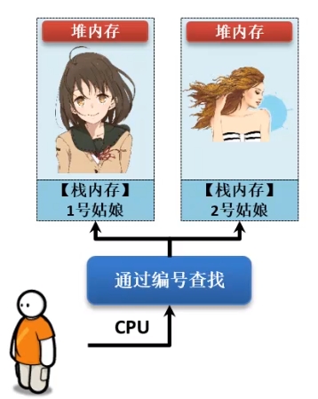
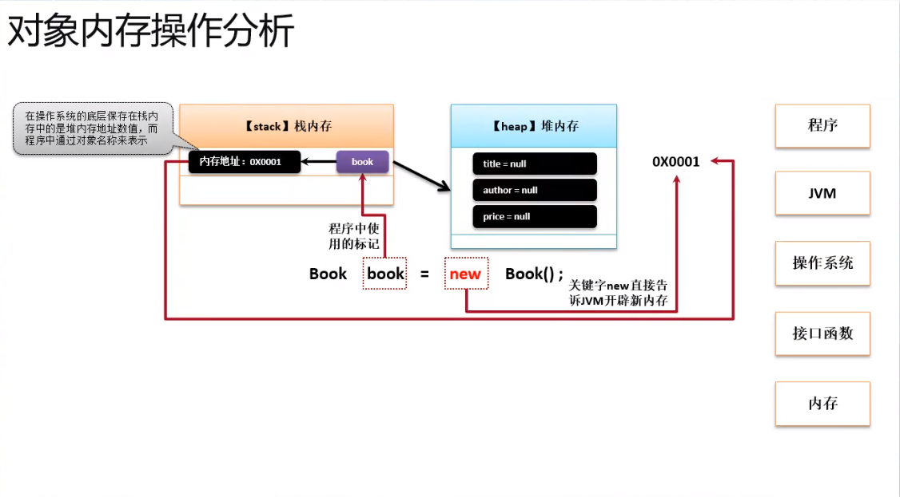
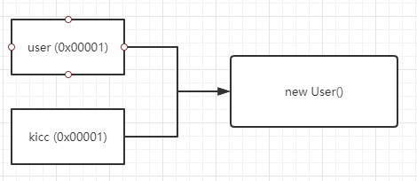
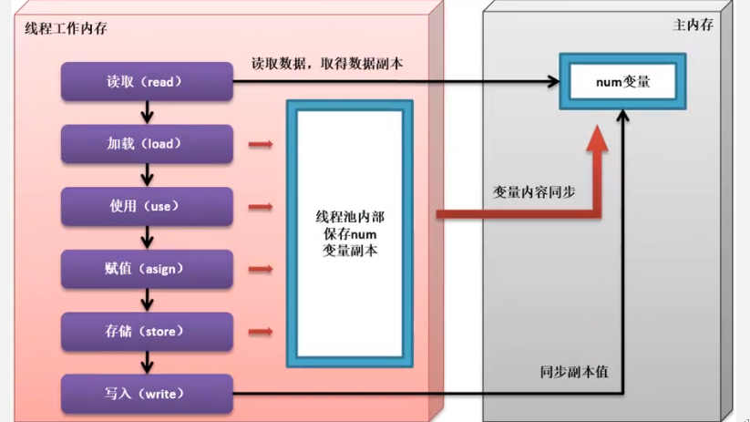

# Java 内存区域

Java 虚拟机在执行 Java 程序的过程中会把它管理的内存划分成若干个不同的数据区域。


**线程私有的：**

- 程序计数器
- 虚拟机栈
- 本地方法栈

**线程共享的：**

- 堆
- 方法区
- 直接内存


### 2.1 程序计数器

程序计数器是一块较小的内存空间，可以看作是当前线程所执行的字节码的行号指示器。**字节码解释器工作时通过改变这个计数器的值来选取下一条需要执行的字节码指令，分支、循环、跳转、异常处理、线程恢复等功能都需要依赖这个计数器来完。**

另外，**为了线程切换后能恢复到正确的执行位置，每条线程都需要有一个独立的程序计数器，各线程之间计数器互不影响，独立存储，我们称这类内存区域为“线程私有”的内存。**

**从上面的介绍中我们知道程序计数器主要有两个作用：**

1. 字节码解释器通过改变程序计数器来依次读取指令，从而实现代码的流程控制，如：顺序执行、选择、循环、异常处理。
2. 在多线程的情况下，程序计数器用于记录当前线程执行的位置，从而当线程被切换回来的时候能够知道该线程上次运行到哪儿了。

**注意：程序计数器是唯一一个不会出现OutOfMemoryError的内存区域，它的生命周期随着线程的创建而创建，随着线程的结束而死亡。**

> 特点：线程私有、指示接下来需要执行哪一行代码。


### 2.2 Java 虚拟机栈

**与程序计数器一样，Java虚拟机栈也是线程私有的，它的生命周期和线程相同，描述的是 Java 方法执行的内存模型。**

**Java 内存可以粗糙的区分为堆内存（Heap）和栈内存(Stack),其中栈就是现在说的虚拟机栈，或者说是虚拟机栈中局部变量表部分。** （实际上，Java虚拟机栈是由一个个栈帧组成，而每个栈帧中都拥有：局部变量表、操作数栈、动态链接、方法出口信息。）

**局部变量表主要存放了编译器可知的各种数据类型**（boolean、byte、char、short、int、float、long、double）、**对象引用**（reference类型，它不同于对象本身，可能是一个指向对象起始地址的引用指针，也可能是指向一个代表对象的句柄或其他与此对象相关的位置）。

**Java 虚拟机栈会出现两种异常：StackOverFlowError 和 OutOfMemoryError。**

- **StackOverFlowError：** 若Java虚拟机栈的内存大小不允许动态扩展，那么当线程请求栈的深度超过当前Java虚拟机栈的最大深度的时候，就抛出StackOverFlowError异常。
- **OutOfMemoryError：** 若 Java 虚拟机栈的内存大小允许动态扩展，且当线程请求栈时内存用完了，无法再动态扩展了，此时抛出OutOfMemoryError异常。

Java 虚拟机栈也是线程私有的，每个线程都有各自的Java虚拟机栈，而且随着线程的创建而创建，随着线程的死亡而死亡。

> 特点：线程私有、保存局部变量表、可能出现两种异常。


### 2.3 本地方法栈 Native

和虚拟机栈所发挥的作用非常相似，区别是： **虚拟机栈为虚拟机执行 Java 方法 （也就是字节码）服务，而本地方法栈则为虚拟机使用到的 Native 方法服务。** 在 HotSpot 虚拟机中和 Java 虚拟机栈合二为一。

本地方法被执行的时候，在本地方法栈也会创建一个栈帧，用于存放该本地方法的局部变量表、操作数栈、动态链接、出口信息。

方法执行完毕后相应的栈帧也会出栈并释放内存空间，也会出现 StackOverFlowError 和 OutOfMemoryError 两种异常。

> 特点：与2.2基本一致，区别就是这个为Native方法服务。


### 2.4 堆

Java 虚拟机所管理的内存中最大的一块，Java 堆是所有线程共享的一块内存区域，在虚拟机启动时创建。**此内存区域的唯一目的就是存放对象实例，几乎所有的对象实例以及数组都在这里分配内存。**

Java 堆是垃圾收集器管理的主要区域，因此也被称作**GC堆（Garbage Collected Heap）**.从垃圾回收的角度，由于现在收集器基本都采用分代垃圾收集算法，所以Java堆还可以细分为：新生代和老年代：在细致一点有：Eden空间、From Survivor、To Survivor空间等。**进一步划分的目的是更好地回收内存，或者更快地分配内存。**


**在 JDK 1.8中移除整个永久代，取而代之的是一个叫元空间（Metaspace）的区域（永久代使用的是JVM的堆内存空间，而元空间使用的是物理内存，直接受到本机的物理内存限制）。**

> 特点：内存空间大、所有线程共享、VM启动时被创建、管理实例对象和数组、用于垃圾回收。


### 2.5 方法区

**方法区与 Java 堆一样，是各个线程共享的内存区域，它用于存储已被虚拟机加载的类信息、常量、静态变量、即时编译器编译后的代码等数据。虽然Java虚拟机规范把方法区描述为堆的一个逻辑部分，但是它却有一个别名叫做 Non-Heap（非堆），目的应该是与 Java 堆区分开来。**

HotSpot 虚拟机中方法区也常被称为 **“永久代”**，本质上两者并不等价。仅仅是因为 HotSpot 虚拟机设计团队用永久代来实现方法区而已，这样 HotSpot 虚拟机的垃圾收集器就可以像管理 Java 堆一样管理这部分内存了。但是这并不是一个好主意，因为这样更容易遇到内存溢出问题。

**相对而言，垃圾收集行为在这个区域是比较少出现的，但并非数据进入方法区后就“永久存在”了。**

> 特点：线程共享；存储类信息、常量、static、编译后代码


### 2.6 运行时常量池

运行时常量池是方法区的一部分。Class 文件中除了有类的版本、字段、方法、接口等描述信息外，还有常量池信息（用于存放编译期生成的各种字面量和符号引用）

既然运行时常量池时方法区的一部分，自然受到方法区内存的限制，当常量池无法再申请到内存时会抛出 OutOfMemoryError 异常。

**JDK1.7及之后版本的 JVM 已经将运行时常量池从方法区中移了出来，在 Java 堆（Heap）中开辟了一块区域存放运行时常量池。**


> 特点：在heap中的一块区域；存储常量池信息。
>
> 在JVM执行类时，将类加载到内存，jvm就会将**class常量池**中的内容存放到**运行时常量池**中


### 常量池小总结

- 1.**全局常量池**在每个VM中只有一份，存放的是字符串常量的引用值。
- 2.class常量池是在编译的时候每个class都有的，在编译阶段，存放的是常量的**符号引用。**
- 3.运行时常量池是在类加载完成之后，将每个class常量池中的符号引用值转存到运行时常量池中，也就是说，每个class都有一个运行时常量池，类在解析之后，将符号引用替换成直接引用，与全局常量池中的引用值保持一致。


### 2.7 直接内存

直接内存并不是虚拟机运行时数据区的一部分，也不是虚拟机规范中定义的内存区域，但是这部分内存也被频繁地使用。而且也可能导致OutOfMemoryError异常出现。

JDK1.4中新加入的 **NIO(New Input/Output) 类**，引入了一种基于**通道（Channel）** 与**缓存区（Buffer）** 的 I/O 方式，它可以直接使用Native函数库直接分配堆外内存，然后通过一个存储在 Java 堆中的 DirectByteBuffer 对象作为这块内存的引用进行操作。这样就能在一些场景中显著提高性能，因为**避免了在 Java 堆和 Native 堆之间来回复制数据**。

本机直接内存的分配不会收到 Java 堆的限制，但是，既然是内存就会受到本机总内存大小以及处理器寻址空间的限制。

> 特点：不是规范，但经常被用。


### 重点

> 堆栈的区别

**heap：**保存对象的真实信息

**stack：**保存核心的基础信息，也就是对象在堆内存中的地址


> CPU寻找Java对象的过程



## HotSpot 虚拟机对象探秘


### 3.1 对象的创建

下图便是 Java 对象的创建过程，我建议最好是能默写出来，并且要掌握每一步在做什么。


**①类加载检查：** 虚拟机遇到一条 new 指令时，首先将去检查这个指令的参数是否能在常量池中定位到这个类的**符号引用**，并且检查这个符号引用代表的类是否已被加载过、解析和初始化过。如果没有，那必须先执行相应的类加载过程。

**②分配内存：** 在**类加载检查**通过后，接下来虚拟机将为新生对象**分配内存**。对象所需的内存大小在类加载完成后便可确定，为对象分配空间的任务等同于把一块确定大小的内存从 Java 堆中划分出来。**分配方式**有 **“指针碰撞”** 和 **“空闲列表”** 两种，**选择那种分配方式由 Java 堆是否规整决定，而Java堆是否规整又由所采用的垃圾收集器是否带有压缩整理功能决定**。

**③初始化零值：** 内存分配完成后，虚拟机需要将分配到的内存空间都初始化为零值（不包括对象头），这一步操作保证了对象的实例字段在 Java 代码中可以不赋初始值就直接使用，程序能访问到这些字段的数据类型所对应的零值。

> 代码中有赋值的字段也先初始化零值。在第五步可以再进行初始化。

**④设置对象头：** 初始化零值完成之后，**虚拟机要对对象进行必要的设置**，例如这个对象是那个类的实例、如何才能找到类的元数据信息、对象的哈希吗、对象的 GC 分代年龄等信息。 **这些信息存放在对象头中。** 另外，根据虚拟机当前运行状态的不同，如是否启用偏向锁等，对象头会有不同的设置方式。

**⑤执行 init 方法：** 在上面工作都完成之后，从虚拟机的视角来看，一个新的对象已经产生了，但从 Java 程序的视角来看，对象创建才刚开始，`<init>` 方法还没有执行，所有的字段都还为零。所以一般来说，执行 new 指令之后会接着执行 `<init>` 方法，把对象按照程序员的意愿进行初始化，这样一个真正可用的对象才算完全产生出来。


结合下图把 `Book book  = new Book()` 底层执行的流程过一遍

1. **new关键字：**先在常量池中定位类的符号引用，有则用，无则加载
2. 告诉JVM开辟一块堆内存
3. 初始化null（引用对象）、0（普通类型）
4. 调用构造方法初始化
5. 把堆地址的信息放到栈内存中
    1. book是程序中的名字，而在JVM中就是一个内存地址。两者是一致的




**NullPointerException：**Java程序员最常见的异常！在编译期间并不会报错，但是运行期间会出错。这个异常都是引用数据类型引起的，所以一旦出现就要查引用数据类型的实例化问题（开辟对内存问题）。


**引用传递：**

```java
User xiaoming = new User("xiaoming");

User kicc = user;  // 进行了引用传递

kicc.name = "kicc";

sout(user.name); // 输出的也是 kicc，
```


根据内存分析，``kicc` 和 `user ` 两个声明对象是保存在栈空间的，对应了一个堆内存地址，这个内存地址指向了堆空间中的实例对象。当 通过 kicc 修改name时，把内存中的实例对象的name修改后，那么同样引用这个对象的user也改变了。




**值传递：**

众所周知：**局部变量**被存储在栈中，**对象实例**和**静态变量**存储在堆中。

```java
public class ObjectDemo {
    public static void main(String[] args) {
        int i = 10;  // 局部变量
        change(i);
        System.out.println(i);
    }

    public static void change(int temp) {
        temp = 100;  // 复制时，JVM先去栈中寻找有没有100，如果没有就创建一个 让temp指向100； 跟i无关
    }
}
```


### 3.2 对象的内存布局

在 Hotspot 虚拟机中，对象在内存中的布局可以分为3快区域：**对象头**、**实例数据**和**对齐填充**。

**Hotspot虚拟机的对象头包括两部分信息**，**第一部分用于存储对象自身的自身运行时数据**（哈希吗、GC分代年龄、锁状态标志等等），**另一部分是类型指针**，即对象指向它的类元数据的指针，虚拟机通过这个指针来确定这个对象是那个类的实例。

**实例数据部分是对象真正存储的有效信息**，也是在程序中所定义的各种类型的字段内容。

**对齐填充部分不是必然存在的，也没有什么特别的含义，仅仅起占位作用。** 因为Hotspot虚拟机的自动内存管理系统要求对象起始地址必须是8字节的整数倍，换句话说就是对象的大小必须是8字节的整数倍。而对象头部分正好是8字节的倍数（1倍或2倍），因此，当对象实例数据部分没有对齐时，就需要通过对齐填充来补全。

> 总共三个部分：对象头、实例数据和对齐填充。


### 3.3 对象的访问定位

建立对象就是为了使用对象，我们的Java程序通过栈上的 reference 数据来操作堆上的具体对象。对象的访问方式有虚拟机实现而定，目前主流的访问方式有**①使用句柄**和**②直接指针**两种：

1. **句柄：** 如果使用句柄的话，那么Java堆中将会划分出一块内存来作为句柄池，reference 中存储的就是对象的句柄地址，而句柄中包含了对象实例数据与类型数据各自的具体地址信息；

    

    ==方法区中的对象类型数据是这个类的一些信息不包含具体的数据；实例池中的对象实例数据就是这个类初始化后得到具体对象的数据。==

2. **直接指针：**  如果使用直接指针访问，那么 Java 堆对像的布局中就必须考虑如何防止访问类型数据的相关信息，reference 中存储的直接就是对象的地址。


**这两种对象访问方式各有优势。使用句柄来访问的最大好处是 reference 中存储的是稳定的句柄地址，在对象被移动时只会改变句柄中的实例数据指针，而 reference 本身不需要修改。使用直接指针访问方式最大的好处就是速度快，它节省了一次指针定位的时间开销。**

> 两种方式来定位一个对象：直接指针 & 使用句柄


# 常量池补充


### String 类和常量池

**1 String 对象的两种创建方式：**

```
     String str1 = "abcd";
     String str2 = new String("abcd");
     System.out.println(str1==str2);//false
复制代码
```

这两种不同的创建方法是有差别的，第一种方式是在常量池中拿对象，第二种方式是直接在堆内存空间创建一个新的对象。


记住：只要使用new方法，便需要创建新的对象。


**2 String 类型的常量池比较特殊。它的主要使用方法有两种：**

- 直接使用双引号声明出来的 String 对象会直接存储在常量池中。
- 如果不是用双引号声明的 String 对象，可以使用 String 提供的 intern 方String.intern() 是一个 Native 方法，它的作用是：如果运行时常量池中已经包含一个等于此 String 对象内容的字符串，则返回常量池中该字符串的引用；如果没有，则在常量池中创建与此 String 内容相同的字符串，并返回常量池中创建的字符串的引用。

```
	      String s1 = new String("计算机");
	      String s2 = s1.intern();
	      String s3 = "计算机";
	      System.out.println(s2);//计算机
	      System.out.println(s1 == s2);//false，因为一个是堆内存中的String对象一个是常量池中的String对象，
	      System.out.println(s3 == s2);//true，因为两个都是常量池中的String对
复制代码
```

**3 String 字符串拼接**

```
		  String str1 = "str";
		  String str2 = "ing";
		  
		  String str3 = "str" + "ing";//常量池中的对象
		  String str4 = str1 + str2; //在堆上创建的新的对象	  
		  String str5 = "string";//常量池中的对象
		  System.out.println(str3 == str4);//false
		  System.out.println(str3 == str5);//true
		  System.out.println(str4 == str5);//false
复制代码
```


尽量避免多个字符串拼接，**因为这样会重新创建对象**。如果需要改变字符串的话，可以使用 StringBuilder 或者 StringBuffer。

### String s1 = new String("abc");这句话创建了几个对象？

**创建了两个对象。**

**验证：**

```java
		String s1 = new String("abc");// 堆内存的地址值
		String s2 = "abc";
		System.out.println(s1 == s2);// 输出false,因为一个是堆内存，一个是常量池的内存，故两者是不同的。
		System.out.println(s1.equals(s2));// 输出true

```

**结果：**

```bash
false
true
```

**解释：**

先有字符串"abc"放入常量池，然后 new 了一份字符串"abc"放入Java堆(字符串常量"abc"在编译期就已经确定放入常量池，而 Java 堆上的"abc"是在运行期初始化阶段才确定)，然后 Java 栈的 str1 指向Java堆上的"abc"。

### 8种基本类型的包装类和常量池

- **Java 基本类型的包装类的大部分都实现了常量池技术，即Byte,Short,Integer,Long,Character,Boolean；这5种包装类默认创建了数值[-128，127]的相应类型的缓存数据，但是超出此范围仍然会去创建新的对象。**

- **两种浮点数类型的包装类 Float,Double 并没有实现常量池技术。**

- > 因为float和Double是浮点数，后面的数位太多了。

```
		Integer i1 = 33;
		Integer i2 = 33;
		System.out.println(i1 == i2);// 输出true
		Integer i11 = 333;
		Integer i22 = 333;
		System.out.println(i11 == i22);// 输出false
		Double i3 = 1.2;
		Double i4 = 1.2;
		System.out.println(i3 == i4);// 输出false
复制代码
```

**Integer 缓存源代码：**

```
/**
*此方法将始终缓存-128到127（包括端点）范围内的值，并可以缓存此范围之外的其他值。
*/
    public static Integer valueOf(int i) {
        if (i >= IntegerCache.low && i <= IntegerCache.high)
            return IntegerCache.cache[i + (-IntegerCache.low)];
        return new Integer(i);
    }

复制代码
```

**应用场景：**

1. Integer i1=40；Java 在编译的时候会直接将代码封装成Integer i1=Integer.valueOf(40);，从而使用常量池中的对象。
2. Integer i1 = new Integer(40);这种情况下会创建新的对象。

```java
  Integer i1 = 40;
  Integer i2 = new Integer(40);
  System.out.println(i1==i2);//输出false

```

**Integer比较更丰富的一个例子:**

```java
  Integer i1 = 40;
  Integer i2 = 40;
  Integer i3 = 0;
  Integer i4 = new Integer(40);
  Integer i5 = new Integer(40);
  Integer i6 = new Integer(0);
  
  System.out.println("i1=i2   " + (i1 == i2));
  System.out.println("i1=i2+i3   " + (i1 == i2 + i3));
  System.out.println("i1=i4   " + (i1 == i4));
  System.out.println("i4=i5   " + (i4 == i5));
  System.out.println("i4=i5+i6   " + (i4 == i5 + i6));   
  System.out.println("40=i5+i6   " + (40 == i5 + i6));     

```

结果：

```java
i1=i2   true
i1=i2+i3   true
i1=i4   false
i4=i5   false
i4=i5+i6   true
40=i5+i6   true

```

解释：

语句i4 == i5 + i6，==因为+这个操作符不适用于Integer对象==，**首先i5和i6进行自动拆箱操作**，进行数值相加，即i4 == 40。然后Integer对象无法与数值进行直接比较，所以i4自动拆箱转为int值40，最终这条语句转为40 == 40进行数值比较。


# volatile 关键字

**误区：**volatile有同步的作用。

**一、传统的程序变量的操作流程**

1、如果要想进行变量修改，那么一定要通过主内存将某一个变量的内容拷贝到线程内存之中，此时为一个变量副本；

2、随后在线程内存里面针对于变量的副本数据进行处理操作（赋值、修改）

3、当所有的线程内存中的变量修改完成后则需要与主内存中的变量内容进行同步处理；

所以线程内存和主内存之间的变量就会存在**同步延迟**。




二、加了volitale

不再进行副本的定义，直接操作主内存中的变量值。

**作用：**

使用volitale定义的变量可以直接进行底层内存变量的直接操作，这样可以让数据的同步更加高效！（减少了延迟）

但是要注意：并没有直接完成的同步的操作！