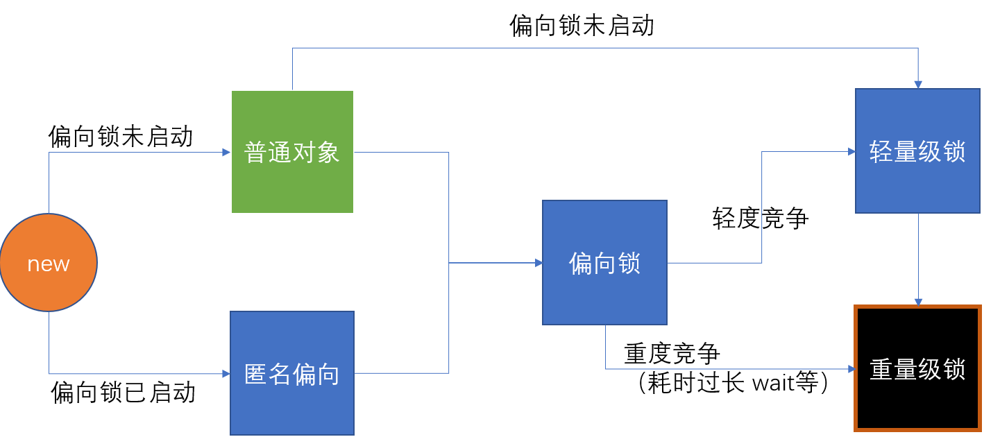
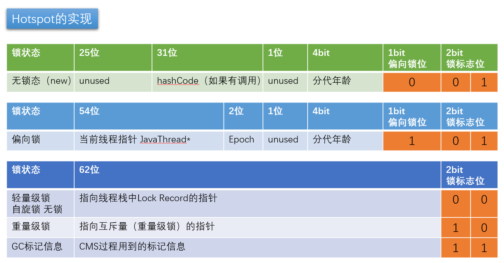
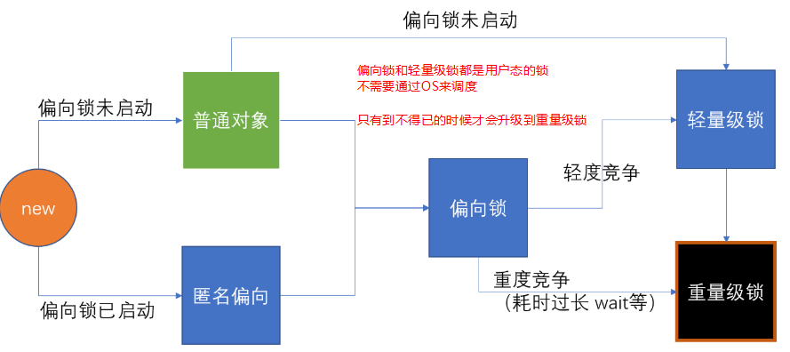

****

# 多线程基础

**看看CPU的主要组成**


> 什么是线程和进程？

**线程：**进程中负责程序执行的执行单元。一个进程中至少有一个线程。

**多线程：**解决多任务同时执行的需求，合理使用CPU资源。多线程的运行是根据CPU切换完成，如何切换由CPU决定，因此多线程运行具有不确定性。

**线程池：**基本思想还是一种对象池的思想，开辟一块内存空间，里面存放了众多**(未死亡)**的线程，池中线程执行调度由池管理器来处理。当有线程任务时，从池中取一个，执行完成后线程对象归池，这样可以**避免反复创建线程对象所带来的性能开销**，节省了系统的资源。


> 和进程的区别？

一个进程是一个独立(self contained)的运行环境，它可以被看作一个程序或者一个应用。 Windows中的QQ、Chrome、Idea都是一个进程。

线程是在进程中执行的一个任务。线程是进程的子集，一个进程可以有很多线程，每条线程并行执行不同的任务。不同的进程使用不同的内存空间，而所有的线程**共享一片相同**的内存空间。

别把它和栈内存搞混，**每个线程都拥有单独的栈内存**用来存储本地数据。


> JVM级别的线程和OS中的线程关系

**Hotspot中的实现方式：**

- 内核线程与JVM线程 1：1. 
- jdk1.2之前， synchronized(o)  由OS帮忙管理线程：属于**重量级锁** （==与之相对应的就是轻量级锁，不需要OS的帮忙==）
- 发展到协程后，在JVM内部有虚拟的寄存器，虚拟的PC，管理用户空间的线程。属于轻量级的线程。


> Runnable 和 Thread 都能实现线程，用哪一个？

Java不支持多继承，但是可以实现多个接口。如果需要继承其他类，就使用Runnable


> Runnable 和 Callable 区别？

它们的主要区别是 Callable 的 call() 方法可以返回值和抛出异常，而 Runnable 的 run() 方法没有这些功能。Callable 可以返回装载有计算结果的 Future 对象。


> 线程池的优点

1）避免线程的创建和销毁带来的性能开销。
2）避免大量的线程间因互相抢占系统资源导致的阻塞现象。
3｝能够对线程进行简单的管理并提供定时执行、间隔执行等功能。


## 并发

同一个对象被多个线程操作。

### 线程不安全


- 多个线程同时操作一个对象，产生线程不安全现象

假设这里是买火车票的情况

```java
public class ThreadTest1 implements Runnable {

    private int ticketNum = 10;

    @lombok.SneakyThrows
    public void run() {

        while (true) {
            if (ticketNum<=0) {
                break;
            }
            Thread.sleep(200);

            System.out.println(Thread.currentThread().getName() + "-->拿到了第"+ticketNum-- + "张票");

        }
    }

}
```


测试

```java
public class MyTest {

    public static void main(String[] args) {
        ThreadTest1 ticket = new ThreadTest1();

        // 多线程操作同一个对象，出现资源被重复使用的现象
        new Thread(ticket, "小明").start();
        new Thread(ticket, "老师").start();
        new Thread(ticket, "黄牛").start();
    }

}
```

```
小明-->拿到了第10张票
黄牛-->拿到了第9张票
老师-->拿到了第8张票
老师-->拿到了第7张票
小明-->拿到了第7张票
黄牛-->拿到了第6张票
老师-->拿到了第4张票
黄牛-->拿到了第3张票
小明-->拿到了第5张票
小明-->拿到了第2张票
黄牛-->拿到了第0张票
老师-->拿到了第1张票
```

可以看到，同一张票有多次被取到的情况。


## 线程状态


### 死亡

如何停止一个线程？

- 不推荐JDK提供的 stop(), destroy()方法。【已废弃】
- 推荐线程自己停下来。
- 建议使用一个标志位进行终止变量。当flag=false，则线程终止。


```java
public class TestStop implements Runnable {
    private boolean flag = true;

    public void run() {
        int i=0;
        while (flag) {
            System.out.println("run .... Thread" + i++);
        }
    }


    public void stop() {
        this.flag = false;
    }
}
```


### 创建


### 就绪

当线程调用start()方法时，线程就进入了就绪状态。


### 运行


### 阻塞

- 线程休眠
    - sleep(millis)：模拟网络延迟，放大问题的发生性。**不会释放锁。**
- 线程礼让
    - yield：A线程执行yield，并不能保证A不再执行。礼让不一定成功。


### 守护线程

```java
public class TestDeamon {

    public static void main(String[] args) {
        God god = new God();
        You you = new You();

        Thread thread = new Thread(god);
        thread.setDaemon(true);
        thread.start(); // 上帝守护线程启动，JVM不需要等待其结束
        
        new Thread(you).start();
    }

}


class God implements Runnable {

    public void run() {
        while (true) {
            System.out.println("God bless you");
        }
    }
}

class You implements Runnable {

    public void run() {
        for (int i = 0; i < 100; i++) {
            System.out.println("你一直开心的活着, 第" + i + "年");
        }
        System.out.println(" ========= go to heaven.=========");
    }
}
```

- 用thread.setDeamon(true) 将一个用户线程设置为守护线程。JVM就不需要等待他执行完毕。只要其他的用户线程执行完毕，那么程序就可以退出了。**（实际中推出前还守护线程还执行了一会）**


## 状态时间的转移


1、新建状态（New）：新创建了一个线程对象。
2、就绪状态（Runnable）：线程对象创建后，其他线程调用了该对象的start()方法。该状态的线程位于可运行线程池中，变得可运行，等待获取CPU的使用权。
3、运行状态（Running）：就绪状态的线程获取了CPU，执行程序代码。
4、阻塞状态（Blocked）：阻塞状态是线程因为某种原因放弃CPU使用权，暂时停止运行。直到线程进入就绪状态，才有机会转到运行状态。阻塞的情况分三种：
（一）、等待阻塞：运行的线程执行wait()方法，JVM会把该线程放入等待池中。(wait会释放持有的锁)
（二）、同步阻塞：运行的线程在获取对象的同步锁时，若该同步锁被别的线程占用，则JVM会把该线程放入锁池中。
（三）、其他阻塞：运行的线程执行sleep()或join()方法，或者发出了I/O请求时，JVM会把该线程置为阻塞状态。当sleep()状态超时、join()等待线程终止或者超时、或者I/O处理完毕时，线程重新转入就绪状态。（注意,sleep是不会释放持有的锁）
5、死亡状态（Dead）：线程执行完了或者因异常退出了run()方法，该线程结束生命周期。


> 其他四种的状态都比较好理解，阻塞状态需要多注意点。尤其是wait和同步 synchronized


## 线程调度


常用调度方法介绍


### Thread.sleep(long millis)  

线程睡眠：使线程转到阻塞状态。millis参数设定睡眠的时间，以毫秒为单位。当睡眠结束后，就转为就绪（Runnable）状态。sleep()平台移植性好。


### Object.wait() 

线程等待：导致当前的线程等待，直到其他线程调用此对象的 notify() 方法或 notifyAll() 唤醒方法。这个两个唤醒方法也是Object类中的方法，行为等价于调用 wait(0) 一样。


### Thread.yield()

> 我让了，你能不能拿到看你自己的本事了

线程让步：**暂停**当前正在执行的线程对象，把执行机会让给相同或者更高优先级的线程。

 **yield()应该做的是让当前运行线程回到可运行状态，以允许具有相同优先级的其他线程获得运行机会。**

因此，使用yield()的目的是让相同优先级的线程之间能适当的轮转执行。但是，实际中无法保证yield()达到让步目的，因为让步的线程还有可能被线程调度程序**再次选中**。

```java
class ThreadYield extends Thread{
    public ThreadYield(String name) {
        super(name);
    }
 
    @Override
    public void run() {
        for (int i = 1; i <= 50; i++) {
            System.out.println("" + this.getName() + "-----" + i);
            // 当i为30时，该线程就会把CPU时间让掉，让其他或者自己的线程执行（也就是谁先抢到谁执行）
            if (i ==30) {
                this.yield();
            }
        }
	
}
}
 
public class Main {
 
	public static void main(String[] args) {
		
		ThreadYield yt1 = new ThreadYield("张三");
    	ThreadYield yt2 = new ThreadYield("李四");
        yt1.start();
        yt2.start();
	}
 
}
```

运行结果：

第一种情况：李四（线程）当执行到30时会CPU时间让掉，这时张三（线程）抢到CPU时间并执行。

第二种情况：李四（线程）当执行到30时会CPU时间让掉，这时李四（线程）抢到CPU时间并执行。

sleep能保证在规定的时间内，当前线程肯定不执行。

yield是将当前线程的运行状态终止，重新放入runnable状态。如果这时候恰好又竞争到了执行，会被立即执行。

yield的 退让 指只会让给优先级 >= 自身的线程，如果没有比自身线程优先级高的，则会继续执行。


### Thread.join()

线程加入：等待其他线程终止。在当前线程中调用另一个线程的join()方法，则当前线程转入阻塞状态，直到另一个进程运行结束，当前线程再由阻塞转为就绪状态。 

```java
@Test
public void test2() throws InterruptedException {
    Thread t1 = new Thread(new MyThread2("线程3"));
    Thread t2 = new Thread(new MyThread2("线程4"));
    t1.start();
    t1.join();
    System.out.println("主线程");

    t2.start();

}
}
```

```
线程3运行  :  0
线程3运行  :  1
线程3运行  :  2
线程3运行  :  3
线程3运行  :  4
主线程
线程4运行  :  0
线程4运行  :  1
线程4运行  :  2
线程4运行  :  3
线程4运行  :  4
```


比如在main线程中调用了t1.join()，那么输出“主线程”的语句必须等待t1结束后才能得到cpu的执行。

```java
@Test
public void test2() throws InterruptedException {
    System.out.println("主线程");

    Thread t1 = new Thread(new MyThread2("线程3"));
    Thread t2 = new Thread(new MyThread2("线程4"));
    t1.start();
    t1.join();

    t2.start();

}
}
```

```
主线程
线程3运行  :  0
线程3运行  :  1
线程3运行  :  2
线程3运行  :  3
线程3运行  :  4
线程4运行  :  0
线程4运行  :  1
线程4运行  :  2
线程4运行  :  3
线程4运行  :  4
```


​		**为什么要用join方法？**

​		在很多情况下，主线程生成并起动了子线程，如果子线程里要进行大量的耗时的运算，主线程往往将于子线		程之前结束，但是如果主线程处理完其他的事务后，需要用到子线程的处理结果，也就是主线程需要等待子		线程执行完成之后再结束，这个时候就要用到join()方法了。


### Object.notify(all)

线程唤醒：唤醒在此对象监视器上等待的单个线程。如果所有线程都在此对象上等待，则会选择唤醒其中一个线程。选择是任意性的，并在对实现做出决定时发生。

线程通过调用其中一个 wait 方法，在对象的监视器上等待。 直到当前的线程放弃此对象上的锁定，才能继续执行被唤醒的线程。被唤醒的线程将以常规方式与在该对象上主动同步的其他所有线程进行竞争；例如，唤醒的线程在作为锁定此对象的下一个线程方面没有可靠的特权或劣势。类似的方法还有一个notifyAll()，唤醒在此对象监视器上等待的所有线程。


## 线程同步

> 队列+锁


### 不同步的情况

错误的范例：银行取钱

```java
public class UnsafeBank {
    public static void main(String[] args) {
        Account account = new Account(100, "度假基金");

        Withdraw kai = new Withdraw(account, 50, "Kai");
        Withdraw lei = new Withdraw(account, 100, "Lei");

        kai.start();
        lei.start();
    }
}


class Account {
    int money;
    String name;

    public Account(int money, String name) {
        this.money = money;
        this.name = name;
    }

    public int getMoney() {
        return money;
    }

    public void setMoney(int money) {
        this.money = money;
    }
}


class Withdraw extends Thread {

    private Account account;
    private int withdrawMoney;
    private int nowMoney;

    public Withdraw(Account account, int withdrawMoney, String name) {
        super(name);
        this.account = account;
        this.withdrawMoney = withdrawMoney;
    }

    @SneakyThrows
    @Override
    public void run() {
        // 判断有没有钱
        if (account.money-withdrawMoney<0) {
            System.out.println(Thread.currentThread().getName() + "钱不够了，取不了");
        }

        Thread.sleep(1000);

        //卡内余额 = 原本的钱 - withDrawMoney
        account.money = account.money-withdrawMoney;
        //你手里的钱
        nowMoney = nowMoney+withdrawMoney;

        System.out.println(account.name + "余额为：" + account.money);
        System.out.println(this.getName() + "手里的钱为：" + nowMoney);

    }

}
```

```
度假基金余额为：0
度假基金余额为：0
Lei手里的钱为：100
Kai手里的钱为：50

度假基金余额为：50
度假基金余额为：50
Kai手里的钱为：50
Lei手里的钱为：100

度假基金余额为：-50
度假基金余额为：-50
Kai手里的钱为：50
Lei手里的钱为：100
```


这三种输出都有可能发生。


### synchronized

在代码中，分为同步方法和同步块。

对一个大的方法使用同步，有可能会极大地影响性能：

- 一个方法中，可能分为只读和其他操作代码。只读的代码不需要进行同步。（对其加了同步就造成了资源的浪费）
- 用作方法的关键字时，默认锁this对象。

```java
@SneakyThrows
@Override
public synchronized void run() {
    // 判断有没有钱
    if (account.money-withdrawMoney<0) {
        System.out.println(Thread.currentThread().getName() + "钱不够了，取不了");
    }

    Thread.sleep(1000);

    //卡内余额 = 原本的钱 - withDrawMoney
    account.money = account.money-withdrawMoney;
    //你手里的钱
    nowMoney = nowMoney+withdrawMoney;

    System.out.println(account.name + "余额为：" + account.money);
    System.out.println(this.getName() + "手里的钱为：" + nowMoney);

}
```


对run方法进行加锁后，取钱出错的问题依然存在，这是因为：

- 加锁的对象是this，而取钱的对象应该是account。所以锁无效
- 形象的说，两个人去银行取钱，我把银行锁了（而不是账户），那有区别吗？
- 应该改为：

```java
class Withdraw extends Thread {

    private Account account;
    private int withdrawMoney;
    private int nowMoney;

    public Withdraw(Account account, int withdrawMoney, String name) {
        super(name);
        this.account = account;
        this.withdrawMoney = withdrawMoney;
    }

    @SneakyThrows
    @Override
    public void run() {

        synchronized (account) {

            // 判断有没有钱
            if (account.money - withdrawMoney < 0) {
                System.out.println(Thread.currentThread().getName() + "钱不够了，取不了");
                return;
            }

            Thread.sleep(100);

            //卡内余额 = 原本的钱 - withDrawMoney
            account.money = account.money - withdrawMoney;
            //你手里的钱
            nowMoney = nowMoney + withdrawMoney;

            System.out.println(account.name + "余额为：" + account.money);
            System.out.println(this.getName() + "手里的钱为：" + nowMoney);
        }

    }

}
```

> P20


## Lambda 表达式


### 为什么要使用

- 避免匿名内部类定义过多
- 可以让你的代码看起来很简洁
- 去掉了一堆没有意义的代码，只留下核心的逻辑


### 函数式接口

- 任何接口，如果只包含唯一一个抽象方法，那么它就是一个函数式接口


### lambda 演化过程

1. 接口 + 实现类

    ```java
    interface ILike {
        public abstract void lambda() ;
    }
    
    class Like implements ILike {
    
        public void lambda() {
            System.out.println("I like lambda 1.");
        }
    }
    ```

2. 内部类

    ```java
    public class TestLambda {
    
        static class Like2 implements ILike {
    
            public void lambda() {
                System.out.println("I like lambda 2.");
            }
        }
    
    
        public static void main(String[] args) {
            Like like1 = new Like();
            like1.lambda();
    
            new Like2().lambda();
    
        }
    }
    ```

3. 方法内部类

    ```java
    public static void main(String[] args) {
        Like like1 = new Like();
        like1.lambda();
    
        new Like2().lambda();
    	
        // 方法内部类
        class Like3 implements ILike {
    
            public void lambda() {
                System.out.println("I like lambda 3.");
            }
        }
        
        new Like3().lambda();
    
    
    
    }
    ```

4. 匿名类

    ```java
    new ILike() {
    
        public void lambda() {
            System.out.println("I like lambda 4.");
        }
    }.lambda();
    ```

5. lambda表达式

    ```java
    like = ()->{
            System.out.println("I like lambda 5.");
    };
    
    like.lambda();
    ```

6. 带参数的lambda表示式

    ```java
    interface ILove {
        void love(int a) ;
    }
    
    ILove love = null;
    love = (int a)->{
    System.out.println("i like this one -->" +  a);
    };
    ```


# Synchronized 和 Volitale


## Volitale


### 定义原理

>  如果一个字段被声明为volatile.Java线程内存模型确保所有线程看到这个变量的值是一致的.


### JMM底层考虑

> volitable底层实现

MESI缓存一致性协议

当B线程修改了volitale修饰的变量时，线程B会立刻通过总线发送回主内存。 其他用到了这个变量的线程就能监听到这个变化，让自己线程中的这个变量**失效**！那么线程在下次用到这个变量的时候，发现这个变量已经失效了，所以需要再去主内存读取一遍。


volitale会在store的时候进行lock，

并发编程中存在三大特性：可见性、有序性、原子性

**注意：**

- volitale可以保证可见性、有序性，无法保证原子性


> JMM 内存模型   没有volatile情况下的


> 多个线程共同修改一个变量

```java
public class Volatile {


    private static volatile int num = 0;

    public static void increase() {
        num ++ ;
    }

    public static void main(String[] args) throws InterruptedException {

        Thread [] threads = new Thread[10];
        for (int i = 0; i < 10; i++) {
            threads[i] =  new Thread(new Runnable() {
                @Override
                public void run() {
                    for (int j = 0; j < 1000; j++) {
                        increase();
                    }
                }
            });
            threads[i].start();
        }

        for (Thread thread : threads) {
            thread.join();
        }

        System.out.println("num = " + num);
    }
}

// 第一次执行
num = 9929 
// 第二次执行
num = 9822
```

解释一下为什么结果是 小于或等于10000：


**简单的说，也就是有的加1操作就被丢失了！所以即便是加上了 volitable，也无法保证原子性**


> 线程A读取变量，线程B修改变量

```java
public class JMM {

    private static boolean initFlag = false;

    public static void main(String[] args) throws InterruptedException {

        new Thread(new Runnable() {
            @Override
            public void run() {
                System.out.println("wait ...");
                while (!initFlag){
                }
                System.out.println("success================");
            }
        }).start();

        Thread.sleep(2000);

        new Thread(new Runnable() {
            @Override
            public void run() {
                prepareData();
            }
        }).start();
    }

    public static void prepareData() {
        System.out.println(" 开始 ！");
        initFlag = true;
        System.out.println(" 结束 ！ ");
    }
}
```


因为B线程store回主内存的过程中只要经过了总线，那么线程A就能监听到这种变化，也就有可能去主内存中再次读取变量的值。而线程B的store和write原子操作是lock的，这个过程非常快，执行完之后线程A就会因为变量的失效而再从主内存中获取变量。

只是在这个程序中，线程A只负责read，那么只要线程B修改过之后，A总能在某个时间点读取到这种变化


#### volitale 为什么保证有序性

>  volatile关键字能禁止指令重排序

volatile关键字禁止指令重排序有两层意思：

　　1）当程序执行到volatile变量的读操作或者写操作时，在其前面的操作的更改肯定全部已经进行，且结果已经对后面的操作可见；在其后面的操作肯定还没有进行；

　　2）在进行指令优化时，不能将在对volatile变量访问的语句放在其后面执行，也不能把volatile变量后面的语句放到其前面执行。

```java
//x、y为非volatile变量
//flag为volatile变量
 
x = 2;        //语句1
y = 0;        //语句2
flag = true;  //语句3
x = 4;         //语句4
y = -1;       //语句5
```

根据上面这段代码，可以保证的是 `x=2;y=0`肯定会先于 `flag=true` 执行 `x=4;y=-1;`肯定会后于 `flag=true`执行

这就是 volitale 能保证有序性的原因


实际应用：

懒汉式的单例模式应用

```java
class Singleton25 {
    private volatile static Singleton25 instance;

    private Singleton25(){}

    public static Singleton25 getInstance() {
        if (null==instance) {
            synchronized (Singleton25.class) {
                if (null==instance) {
                    instance = new Singleton25();
                }
            }
        }
        return instance;
    }
}
```

相比于懒汉式，因为需要保证线程安全。我们会在getInstance()方法上加 `sychronized`关键字，但是这样有一个问题是，每次都进入同步方法、都进行了加锁操作。影响了效率。


现在我们在getInstance中先判断单例是不是存在，存在就直接返回，不存在再加锁。所以也就只有第一次才会加锁。

而 `volatile`关键字保证了代码执行的有序性，和数据的可见性。

**解释：**

`instance = new Singleton25()` 这一句代码可以分为3句：

1、分配堆中的内存空间

2、初始化instance

3、instance指向堆中的内存空间


如果不加volatile，由于指令的重排，可能变成 1->3->2。那么在多线程的情况下，1和3先执行了，第二个线程发现instance不为空，就直接返回了。但其实第一个线程还没有进行第二步的初始化呢。


## Sychronized

在jdk1.6之前是一个重量级的锁，JDK1.6之后进行了大量的优化。伴随着的是大量的锁升级过程。


### 在Java源码级别上


**synchronized实现同步的基础**

Java中每一个对象都可以作为锁,有如下三种表现:

- 对于普通同步方法, 锁是当前实例对象
- 对于静态同步方法, 锁是当前类的Class对象.
- 对于同步方法块,     锁是synchronized括号里配置的对象


> 加锁到底加了什么？

修改了对象的对象头


> 锁里面存了什么信息？

HashCode、锁的标志位、分代年龄


JVM基于进入和退出**Monitor**对象来实现**方法同步**和**代码块同步**,但是两者实现细节不同,代码块同步是使用**monitorenter**和**monitorexit**指令实现的.而方法同步是使用另外一种方式实现的.

其中，有一次 `moniterenter` 和 两次 `moniterexit`. 两次退出的目的是在同步代码块线程因为异常退出的时候，也能正常地进行锁的释放。避免了死锁的出现。


## 锁升级过程


### JDK8 markword实现表：

>  我们平时所说的加锁就是修改markword的内容





**自旋锁什么时候升级为重量级锁？**

**为什么有自旋锁还需要重量级锁？**

> 自旋是消耗CPU资源的，如果锁的时间长，或者自旋线程多，CPU会被大量消耗
>
> 重量级锁有等待队列，所有拿不到锁的进入等待队列，不需要消耗CPU资源

**偏向锁是否一定比自旋锁效率高？**

> 不一定，在明确知道会有多线程竞争的情况下，偏向锁肯定会涉及锁撤销，这时候直接使用自旋锁
>
> JVM启动过程，会有很多线程竞争（明确），所以默认情况启动时不打开偏向锁，过一段儿时间 延迟4S 再打开

**所以当我程序手动设定sleep 5S，那么程序将可能打开偏向锁**

new - 偏向锁 - 轻量级锁 （无锁, 自旋锁，自适应自旋）- 重量级锁

synchronized优化的过程和markword息息相关

用markword中最低的三位代表锁状态 其中1位是偏向锁位 两位是普通锁位

1. Object o = new Object()
    锁 = 0 01 无锁态 
    注意：如果偏向锁打开，默认是匿名偏向状态

2. o.hashCode()
    001 + hashcode

    ```java
    00000001 10101101 00110100 00110110
    01011001 00000000 00000000 00000000
    ```

    little endian big endian 

    00000000 00000000 00000000 01011001 00110110 00110100 10101101 00000000

3. 默认synchronized(o) 
    00 -> 轻量级锁
    默认情况 偏向锁有个时延，默认是4秒
    why? 因为JVM虚拟机自己有一些默认启动的线程，里面有好多sync代码，这些sync代码启动时就知道肯定会有竞争，如果使用偏向锁，就会造成偏向锁不断的进行锁撤销和锁升级的操作，效率较低。

    ```shell
    -XX:BiasedLockingStartupDelay=0
    ```

4. 如果设定上述参数
    new Object () - > 101 偏向锁 ->线程ID为0 -> Anonymous BiasedLock 
    打开偏向锁，new出来的对象，默认就是一个可偏向匿名对象101

5. 如果有线程上锁
    **上偏向锁，指的就是，把markword的线程ID改为自己线程ID的过程**
    偏向锁不可重偏向 批量偏向 批量撤销

6. 如果有线程竞争
    撤销偏向锁，升级轻量级锁
    线程在自己的线程栈生成LockRecord ，用CAS操作将markword设置为指向自己这个线程的LR的指针，设置成功者得到锁

7. 如果竞争加剧
    竞争加剧：有线程超过10次自旋， -XX:PreBlockSpin， 或者自旋线程数超过CPU核数的一半， 1.6之后，加入自适应自旋 Adapative Self Spinning ， JVM自己控制
    升级重量级锁：-> 向操作系统申请资源，linux mutex , CPU从3级-0级系统调用，线程挂起，进入等待队列，等待操作系统的调度，然后再映射回用户空间

(以上实验环境是JDK11，打开就是偏向锁，而JDK8默认对象头是无锁)

偏向锁默认是打开的，但是有一个时延，如果要观察到偏向锁，应该设定参数

**如果计算过对象的hashCode，则对象无法进入偏向状态！**

> 轻量级锁重量级锁的hashCode存在与什么地方？
>
> 答案：线程栈中，轻量级锁的LR中，或是代表重量级锁的ObjectMonitor的成员中

关于epoch: (不重要)

> **批量重偏向与批量撤销**渊源：从偏向锁的加锁解锁过程中可看出，当只有一个线程反复进入同步块时，偏向锁带来的性能开销基本可以忽略，但是当有其他线程尝试获得锁时，就需要等到safe point时，再将偏向锁撤销为无锁状态或升级为轻量级，会消耗一定的性能，所以在多线程竞争频繁的情况下，偏向锁不仅不能提高性能，还会导致性能下降。于是，就有了批量重偏向与批量撤销的机制。
>
> **原理**以class为单位，为每个class维护**解决场景**批量重偏向（bulk rebias）机制是为了解决：一个线程创建了大量对象并执行了初始的同步操作，后来另一个线程也来将这些对象作为锁对象进行操作，这样会导致大量的偏向锁撤销操作。批量撤销（bulk revoke）机制是为了解决：在明显多线程竞争剧烈的场景下使用偏向锁是不合适的。
>
> 一个偏向锁撤销计数器，每一次该class的对象发生偏向撤销操作时，该计数器+1，当这个值达到重偏向阈值（默认20）时，JVM就认为该class的偏向锁有问题，因此会进行批量重偏向。每个class对象会有一个对应的epoch字段，每个处于偏向锁状态对象的Mark Word中也有该字段，其初始值为创建该对象时class中的epoch的值。每次发生批量重偏向时，就将该值+1，同时遍历JVM中所有线程的栈，找到该class所有正处于加锁状态的偏向锁，将其epoch字段改为新值。下次获得锁时，发现当前对象的epoch值和class的epoch不相等，那就算当前已经偏向了其他线程，也不会执行撤销操作，而是直接通过CAS操作将其Mark Word的Thread Id 改成当前线程Id。当达到重偏向阈值后，假设该class计数器继续增长，当其达到批量撤销的阈值后（默认40），JVM就认为该class的使用场景存在多线程竞争，会标记该class为不可偏向，之后，对于该class的锁，直接走轻量级锁的逻辑。


没错，我就是厕所所长

加锁，指的是锁定对象

锁升级的过程

JDK较早的版本 OS的资源 互斥量 用户态 -> 内核态的转换 重量级 效率比较低

现代版本进行了优化

无锁 - 偏向锁 -轻量级锁（自旋锁）-重量级锁


偏向锁 - **markword 上记录当前线程指针**，下次同一个线程加锁的时候，不需要争用，只需要判断线程指针是否同一个，所以，偏向锁，偏向加锁的第一个线程 。hashCode备份在线程栈上 线程销毁，锁降级为无锁

有争用 - 锁升级为轻量级锁 - 每个线程有自己的LockRecord在自己的线程栈上，用CAS去争用markword的LR的指针，指针指向哪个线程的LR，哪个线程就拥有锁

**自旋超过10次，升级为重量级锁** - 如果太多线程自旋 CPU消耗过大，不如升级为重量级锁，进入等待队列（不消耗CPU）-XX:PreBlockSpin


自旋锁在 JDK1.4.2 中引入，使用 -XX:+UseSpinning 来开启。JDK 6 中变为默认开启，并且引入了自适应的自旋锁（适应性自旋锁）。

自适应自旋锁意味着自旋的时间（次数）不再固定，而是由前一次在同一个锁上的自旋时间及锁的拥有者的状态来决定。如果在同一个锁对象上，自旋等待刚刚成功获得过锁，并且持有锁的线程正在运行中，那么虚拟机就会认为这次自旋也是很有可能再次成功，进而它将允许自旋等待持续相对更长的时间。如果对于某个锁，自旋很少成功获得过，那在以后尝试获取这个锁时将可能省略掉自旋过程，直接阻塞线程，避免浪费处理器资源。


偏向锁由于有锁撤销的过程revoke，会消耗系统资源，所以，在锁争用特别激烈的时候，用偏向锁未必效率高。还不如直接使用轻量级锁。


# ThreadLocal

> 具有线程的隔离性，一个ThreadLocal中set的变量只能本线程去get，其他线程是无法获得的。

## 概念

**关键词：** 1、数据传输  2、多线程

**在项目开发过程之中，ThreadLocal是一个最为重要的引用数据类型的传递操作类，利用这个类可以非常轻松的实现数据的传输，同时也可以保证多个线程下的数据传输的正确性。**


```java
package com.kicc.threadlocal;

/**
 * @author Kicc
 * @date 20/7/27 下午 9:55
 */
public class Test1 {


    public static void main(String[] args) {
        String [] values = new String[]{
                "String1",
                "String2",
                "String3"
        } ;

        for (String value:values) {
            new Thread(() -> {

                Resource.message = new Message();
                Resource.message.setContent(value);
                MessagePrint.print();

            }).start();
        }
    }

}

class Resource {
    public static Message message;
}

class MessagePrint {
    public static void print() {
        System.out.println("【MessagePrint】" + Resource.message.getContent());
    }
}

class Message {
    private String content ;

    public String getContent() {
        return content;
    }

    public void setContent(String content) {
        this.content = content;
    }
}
```

**预期的输出结果**

```
【MessagePrint】String1
【MessagePrint】String2
【MessagePrint】String3
```


**输出结果**

```
【MessagePrint】String1
【MessagePrint】String1
【MessagePrint】String1
或者
【MessagePrint】String2
【MessagePrint】String2
【MessagePrint】String2
或者
【MessagePrint】String3
【MessagePrint】String3
【MessagePrint】String3
```


通过多线程的执行分析就可以发现当前程序设计的问题； 现在原本设计有三个线程对象，希望的处理形式是可以每一个线程都执行各自的信息输出，但是最终执行的结果却安全不正确了。那么是什么原因呢？


> 引入ThreadLocal

**重要的三个方法**：

| No.  | 方法名称                 | 类型 |                                      |
| ---- | ------------------------ | ---- | ------------------------------------ |
| 01   | public void set(T value) | 普通 | 保存数据，每一个线程只能保存一个数据 |
| 02   | public T get()           | 普通 | 获取当前线程保存的数据               |
| 03   | public void remove()     | 普通 | 清楚线程的数据                       |


```java
package com.kicc.threadlocal;

/**
 * @author Kicc
 * @date 20/7/27 下午 9:55
 */
public class Test1 {


    public static void main(String[] args) {
        String [] values = new String[]{
                "String1",
                "String2",
                "String3"
        } ;

        for (String value:values) {
            new Thread(() -> {
                // set：哪一个线程独占对象
                Resource.MESSAGE_THREAD_LOCAL.set(new Message());
                // 设置值
                Resource.MESSAGE_THREAD_LOCAL.get().setContent(value);
                MessagePrint.print();

            }).start();
        }
    }
}


class Resource {
    // 定义ThreadLocal 存储线程独占的 Message
    public static final ThreadLocal<Message> MESSAGE_THREAD_LOCAL = new ThreadLocal<Message>();
}

class MessagePrint {
    /**
     * 获取当前线程所保存的Message对象，并打印输出
     */
    public static void print() {
        System.out.println("【MessagePrint】" + Resource.MESSAGE_THREAD_LOCAL.get().getContent());
    }
}

class Message {
    private String content ;

    public String getContent() {
        return content;
    }

    public void setContent(String content) {
        this.content = content;
    }
}
```

**程序输出**

```
【MessagePrint】String1
【MessagePrint】String2
【MessagePrint】String3
```


**本程序直接利用了ThreadLocal实现多个线程对象不同的数据存储，由于所有的存储都是以当前对象的形式作为了Key，那么只要当前对象有数据就可以直接获取数据并且实现引用对象的传输。在实际的项目开发过程里，一般使用ThreadLocal的代码都属于核心的资源对象传输。**


### 原理

**有这么一段代码**

```java
package com.kicc.threadlocal;

import java.sql.Time;
import java.util.concurrent.TimeUnit;

/**
 * @author Kicc
 * @date 20/7/28 下午 1:05
 */
public class Test2 {


    static ThreadLocal<Person> tl = new ThreadLocal<>();

    public static void main(String[] args) {

		// 如果在一个Thread中，使用了threadLocal进行set
        // 那么在其他的线程中使用同一个threadLocal进行get是无法获取到的
        // 只能同一个Thread中调用同一个threadLocal才可以get到
        new Thread(()-> {
            try {
                TimeUnit.SECONDS.sleep(1);
            } catch (InterruptedException e) {
                e.printStackTrace();
            }
            tl.set(new Person());
        }).start();


        new Thread(()->{
            try {
                TimeUnit.SECONDS.sleep(2);
            } catch (InterruptedException e) {
                e.printStackTrace();
            }

            Person person = tl.get();
            System.out.println(person);
        }).start();

    }


}


class Person {
    private String name = "sss" ;
}
```

**输出结果**

null


> set 方法


1. set 是 传入一个对象

2. 获取当前线程

3. 把当前线程传入getMap，获取一个ThreadLocalMap

    1. 
    2. 这个`t.threadLocals`是Thread类持有的字段
    3. 

4. map.set(this. value)： this指的是当前的ThreadLocal；而这个map是每个线程独占的

    1. ```java
        private void set(ThreadLocal<?> key, Object value) {
        
            // We don't use a fast path as with get() because it is at
            // least as common to use set() to create new entries as
            // it is to replace existing ones, in which case, a fast
            // path would fail more often than not.
        
            // 创建一个Entry对象 = 【Key - value】
            Entry[] tab = table;
            int len = tab.length;
            int i = key.threadLocalHashCode & (len-1);
        
            for (Entry e = tab[i];
                 e != null;
                 e = tab[i = nextIndex(i, len)]) {
                ThreadLocal<?> k = e.get();
        
                if (k == key) {
                    e.value = value;
                    return;
                }
        
                if (k == null) {
                    replaceStaleEntry(key, value, i);
                    return;
                }
            }
        
            // 把key-value装入 tab中， key = ThreadLocal， value = person
            tab[i] = new Entry(key, value);
            int sz = ++size;
            if (!cleanSomeSlots(i, sz) && sz >= threshold)
                rehash();
        }
        ```

    2. ```java
        // Entry 是一个静态内部类，是弱引用的子类
        static class Entry extends WeakReference<ThreadLocal<?>> {
            /** The value associated with this ThreadLocal. */
            Object value;
        
            Entry(ThreadLocal<?> k, Object v) {
                // 构造方法调用了父类构造
                // 也就是创建了一个 WeakReference 指向了k， k=threadLocal
                super(k);
                value = v;
            }
        }
        ```

    3. **为什么要使用弱引用？**

        1. 若是强引用，即使手动设置 `tl=null`，但key的引用依然指向ThreadLocal对象，所以会有内存的泄露。
        2. 若是弱引用，当我们设置 `tl=null`，此时只有 map中的key有一个弱引用指向 ThreadLocal对象，GC一次就能回收
        3. **但是**，如果手动设置 `tl=null`， key作为一个弱引用，很容易被回收；不过 key对应的value (person) 这块内存就永远不可能被访问到了！也会造成内存的泄露
        4. 因此为了避免这些问题，当一个ThreadLocal中的数据不再使用的时候，要 手动执行 remove 方法移除。


> 整体流程图


**每个线程有自己独占的Map：threadlocals，因此是完全的线程隔离的。**


## 面试问题


### 1、ThreadLocal用在什么地方？

> 如果在单线程的环境下，是不需要使用ThreadLocal的。

Spring中的事务用到了ThreadLocal，目的是让同一个线程始终操作同一个连接。而不是使用不同的连接去操作数据库。


> ThreadLocal的用途

- **保存线程上下文信息，在任意需要的地方可以获取！！！**

- **线程安全的，避免某些情况需要考虑线程安全必须同步带来的性能损失！！！**


> 保存线程上下文信息，在任意需要的地方可以获取


> 线程安全的，避免某些情况需要考虑线程安全必须同步带来的性能损失


每个线程往ThreadLocal中读写数据是线程隔离，互相之间不会影响的，所以**ThreadLocal无法解决共享对象的更新问题！**


### 2、ThreadLocal中使用的Map为什么是数组，而不是链表？


在ThreadLocal.set方法中，使用的是Entry数组保存的 Key-Value 对，Entry是弱引用的子类。

一个线程中可以有多个ThreadLocal来存放不同类型的对象，所有的对象都可以放在当前线程的ThreadLocalMap里，就用数组来存放。


### 3、没有用链表如何解决Hash冲突

可以看待用了一个  `threadLocalHashCode`来解决冲突， 存储的时候会根据ThreadLocal对象的hash值，定位到Table的 index。

- 如果index上是空的，就初始化一个Entry放在这个位置上
- 如果index不是空的，而且key相等，刷新覆盖即可
- 如果index不是空的，但是key不相等，那就找下一个空的位置，放进去


同样，在get的时候，根据ThreadLocal对象的hash值，定位到Table中

- 如果和当前位置的key一致，则返回
- 如果不一致，继续找


### 4、说说对象都存放在哪里？

在Java中，栈内存归属于单个线程，每个线程都会有一个栈内存，其存储的变量只能在其所属线程中可见，即栈内存可以理解成线程的私有内存，而堆内存中的对象对所有线程可见，堆内存中的对象可以被所有线程访问。


#### 5、那么是不是说ThreadLocal的实例以及其值存放在栈上呢？

不是的。ThreadLocal是一个实例对象。Java中的实例对象都是存放在堆内存中的。

因为ThreadLocal实例实际上也是被其创建的类持有（更顶端应该是被线程持有），而ThreadLocal的值其实也是被线程实例持有，它们都是位于堆上，只是通过一些技巧将可见性修改成了线程可见。


#### 6、有办法共享 不同线程的ThreadLocal数据吗？

有一个办法。


每一个Thread实例在初始化的时候，会传入 `inheritThreadLocals=true` 表示存在。

我们可以在父线程（主线程）中创建一个  `InheritableThreadLocal` 实例，然后在子线程中得到这个 `InheritableThreadLocal` 实例设置的值。


只要存在父线程，那么子线程初始化的时候就会把父线程的 `inheritableThreadLocals` 传递给子线程。


# 基础三大类


## Java Thread

不推荐使用的方式。自JDK1.0.性能上不高。


> 线程的状态

```java
public static enum State {
   /**
    * A Thread which has not yet started.
    */
   NEW,
   /**
    * A Thread which is running or suspended.
    */
   RUNNABLE,
   /**
    * A Thread which is blocked on a monitor.
    */
   BLOCKED, 
   /**
    * A Thread which is waiting with no timeout.
    * 可以一直等
    */
   WAITING,
   /**
    * A Thread which is waiting with a timeout.
    * 超时等待，时间过了就不等了
    */
   TIMED_WAITING, 
   /**
    * A thread which is no longer alive.
    */
   TERMINATED }
```


>sleep 和 wait 区别

**1、来自不同的类**

- wait：Object
- sleep：Thread

开发中不会使用 Thread.sleep， 而是JUC下的 `TimeUnit`


**2、关于锁的释放**

- sleep：不会释放锁
- wait：放弃当线程的锁


**3、使用的范围不同**

- sleep：可以在任意程序处使用
- wait：在同步代码中使用


**4、是否需要捕获异常**

- sleep：需要捕获异常
- wait：不必要


> Demo

```java
class MyThread1 extends Thread {
    private String name;
    public MyThread1(String name) {
        this.name = name;
    }

    @Override
    public void run() {
        for (int i = 0; i < 5; i++) {
            System.out.println(name + "运行：" + i);
            try {
                sleep( (int) Math.random()*10);
            } catch (InterruptedException e) {
                e.printStackTrace();
            }
        }
    }
}

public class Main {
    public static void main(String[] args) {
        MyThread1 t1 = new MyThread1("线程1");
        MyThread1 t2 = new MyThread1("线程2");
        t1.start();
        t2.start();

    }
}
```

多次重复执行得到的结果会不同。


注意：start()方法调用后 **并不是** 立即执行了多线程代码。而是将该线程变成了可运行态（Runnable）。

什么时候执行时OS说了算。


## Java Runnable 

推荐使用的方式 JDK1.0

与Callable的区别：

- Runnable 接口 run 方法无**返回值**；Callable 接口 call 方法有返回值，是个泛型，和Future、FutureTask配合可以用来获取异步执行的结果
- Runnable 接口 run 方法只能抛出运行时异常，且**无法捕获处理**；Callable 接口 call 方法允许抛出异常，可以获取异常信息


## J.U.C Callable


一个问题：无法返回。

```java
package com.kicc.runnable;

/**
 * @author Kicc
 * @date 20/7/27 下午 2:52
 */


public class MyThread implements Runnable {

    private String result = "【返回结果】";
    @Override
    public void run() {
        for (int i = 0; i < 10; i++) {
            result += "Gooo.!";
        }
    }


    public String getResult() {
        return this.result;
    }
}
```


```java
package com.kicc.test;

import com.kicc.runnable.MyThread;

/**
 * @author Kicc
 * @date 20/7/27 下午 2:54
 */
public class RunnableTest {
    public static void main(String[] args) {
        MyThread myThread = new MyThread();
        Thread t1 = new Thread(myThread);
        t1.start();
        try {
            t1.join();
        } catch (InterruptedException e) {
            e.printStackTrace();
        }
        System.out.println(myThread.getResult());
    }
}
// 输出
【返回结果】
```

如果不加 `join`，无法在线程执行之前得到 `result`


```java
@FunctionalInterface
public interface Callable<V> {
    /**
     * Computes a result, or throws an exception if unable to do so.
     *
     * @return computed result
     * @throws Exception if unable to compute a result
     */
    V call() throws Exception;
}
```

当前给出的call()方法的功能就类似于Runnable接口里面的run()方法的功能，因为这个方法是线程的主体方法。这个主体方法的一个最大的特征就是可以有一个数据的返回结果，并且返回结果的类型可以通过外部的泛型来进行动态声明。

​	因为Callable接口牵扯到其最终的结果返回，所以它的使用会比较繁琐，Callable采用了**异步**的处理架构，所以虽然其是一个线程类，由Thread启动，但是对于异步数据的返回就必须使用一个最为重要的接口：Future。

> Thread类的构造方法


Thread类中没有一个构造方法是接受Callable对象的


> Future接口


异步数据返回的  `get()` 方法就是接受Callable接口里面的`call()`方法返回的数据信息


**但是**Thread 和 Future Callable没有什么联系， 所以需要一个中间的联系人：


但是到这里，Thread和Callable之间还是不存在什么联系。而我们看到在``RunnableFuture接口``下，有一个实现类`FutureTask`

所以FutureTask也是一个Runnable、Future

这个类下有两个构造方法：


> 联系Callable接口


> 补救方法（兼容Runnable）


> 所有的联系


- FutureTask 实现了 RunnableFuture 接口
- RunnableFuture 接口 继承了 Future 和 Runnable 两个接口
- FutureTask的构造方法中可以传入 Runnable 或者 Callable
- 所以FutureTask 接收 Callable， 自己是一个Runnable（也是一个Future）
- Thread 接收 FutureTask 是因为 Thread 可以接收 Runnable
- Thread 启动线程后，通过FutureTask.get 获得 异步的返回结果


所以，最终是

```java
task = new FutureTask(new CallableImpl<V>)
new Thread(task)
result = task.get()
```


> 实战，使用Callable实现多线程


```java
public class CallableThread implements Callable<String> {
    @Override
    public String call() throws Exception {
        String result = "" ;
        for (int i = 0; i < 10; i++) {
            result+="Gooooooo.!" + i;
        }
        // 异步返回
        return result;
    }


}
```


```java
@Test
public void testCallable() throws ExecutionException, InterruptedException {
    CallableThread mythread = new CallableThread();

    FutureTask<String> task = new FutureTask<String>(mythread);


    Thread thread = new Thread(task);

    thread.start();

    // 通过future.get
    System.out.println(task.get());
}
```


### 细节注意

1、 开启一个 futureTask后，如果没有get，他的任务是在运行的，结果是被缓存了

2、futureTask是一个阻塞的，一般会把get放在最后去调用。


## 区分使用使用场景

**区分的点：**

如果不需要返回值就使用Runnable，如果需要线程执行完毕后有一个返回值就使用Callable.


如果一个类继承Thread，则不适合资源共享。但是如果实现了Runnable接口的话，则很容易的实现资源共享。


> Runnable 和 Thread 两种方式的区别

**总结：**

实现Runnable接口比继承Thread类所具有的优势：

1）：适合多个相同的程序代码的线程去处理同一个资源

2）：可以避免java中的单继承的限制

3）：增加程序的健壮性，代码可以被多个线程共享，代码和数据独立

4）：线程池只能放入实现Runnable或callable类线程，不能直接放入继承Thread的类


因为main方法也启动了一个线程，在java中所有的线程都是同时启动的，至于什么时候可以运行，哪个优先执行是取决于cpu的调度。


在Java程序中，至少启动了两个线程。 main和Gc。

每当Java执行一个（主）类的时候，实际上都会启动一个JVM。对应到操作系统中就是JVM开启了一个**进程**。


# 线程池

> 什么是线程池

是一种池化技术，可以方便地管理线程。初始化一定大小的线程池。需要使用线程的时候从线程池中获取，任务执行完毕之后再把线程归还到线程池中。方便复用。


> ThreadPoolExecutor 的 7 个参数

**`ThreadPoolExecutor` 3 个最重要的参数：**

- **`corePoolSize` :** 核心线程数定义了最小可以同时运行的线程数量。
- **`maximumPoolSize` :** 当队列中存放的任务达到队列容量的时候，当前可以同时运行的线程数量变为最大线程数。
- **`workQueue`:** 当新任务来的时候会先判断当前运行的线程数量是否达到核心线程数，如果达到的话，线程就会被存放在队列中。


`ThreadPoolExecutor`其他常见参数:

1. **`keepAliveTime`**:当线程池中的线程数量大于 `corePoolSize` 的时候，如果这时没有新的任务提交，核心线程外的线程不会立即销毁，而是会等待，直到等待的时间超过了 `keepAliveTime`才会被回收销毁；
2. **`unit`** : `keepAliveTime` 参数的时间单位。
3. **`threadFactory`** :线程工厂，当executor 创建新线程的时候会用到。
4. **`handler`** :饱和策略。关于饱和策略下面单独介绍一下。


> 4 种 拒绝策略

- **`ThreadPoolExecutor.AbortPolicy`**：抛出 `RejectedExecutionException`来拒绝新任务的处理。
- **`ThreadPoolExecutor.CallerRunsPolicy`**：调用执行自己的线程(==main线程==)运行任务，也就是直接在调用`execute`方法的线程中运行(`run`)被拒绝的任务，如果执行程序已关闭，则会丢弃该任务。因此这种策略会降低对于新任务提交速度，影响程序的整体性能。如果您的应用程序可以承受此延迟并且你要求任何一个任务请求都要被执行的话，你可以选择这个策略。
- **`ThreadPoolExecutor.DiscardPolicy`：** 不处理新任务，直接丢弃掉。
- **`ThreadPoolExecutor.DiscardOldestPolicy`：** 此策略将丢弃最早的未处理的任务请求。


> 线程池种的状态

```java
private static final int RUNNING    = -1 << COUNT_BITS;
private static final int SHUTDOWN   =  0 << COUNT_BITS;
private static final int STOP       =  1 << COUNT_BITS;
private static final int TIDYING    =  2 << COUNT_BITS;
private static final int TERMINATED =  3 << COUNT_BITS;
```

- RUNNING 自然是运行状态，指可以接受任务执行队列里的任务

- SHUTDOWN 指调用了 shutdown() 方法，不再接受新任务了，但是队列里的任务得执行完毕。

- STOP 指调用了 shutdownNow() 方法，不再接受新任务，同时抛弃阻塞队列里的所有任务并中断所有正在执行任务。

- TIDYING 所有任务都执行完毕，在调用 shutdown()/shutdownNow() 中都会尝试更新为这个状态。

- TERMINATED 终止状态，当执行 terminated() 后会更新为这个状态。


> shutdown stop shutdownNow

阿里面试的问题：线程池种的状态。Stop和 Shutdown的区别？

- Stop状态是执行 `shutdownNow`方法之后进入的状态。不再接收新的任务，也会抛弃队列中的任务并且中断所有执行中的任务 
- shutdown状态是执行了 `shutdown`方法之后进入的状态。不再接收新任务。但是队列中的任务会执行完毕。


> 四种线程池

- FixedThreadPool
    - 采用无界的队列，队列是不可能满的，任务多了可能会OOM
- SingleThreadPool
    - 也采用无界队列，造成OOM
- CachedThreadPool
    - 核心线程数=0，最大线程数=MAX_VALUE。任务提交速度>任务处理速度时，资源将被耗尽
- 


# 进阶 JUC


**回顾之前的加锁方式：**

```java
package com.kicc.juc;

import java.util.Date;

/**
 * @author Kicc
 * @date 20/7/27 下午 5:09
 */
public class SaleTicketDemo1 {


    public static void main(String[] args) {

        Ticket ticket = new Ticket();

        Date date = new Date();
        long start = date.getTime();

        new Thread(()->{
            for (int i = 0; i < 50; i++) {
                ticket.sale();
            }
        }, "线程A").start();


        new Thread(()->{
            for (int i = 0; i < 50; i++) {
                ticket.sale();
            }
        }, "线程B").start();


        new Thread(()->{
            for (int i = 0; i < 50; i++) {
                ticket.sale();
            }
        }, "线程C").start();


    }
}


class Ticket {

    private int num = 50 ;

    public synchronized void sale() {
        if (num>0) {
            System.out.println(Thread.currentThread().getName() +
                    "卖出了第" + (num--) + "票， 剩余：" + num );
        }
    }
}
```

要使程序按照顺序输出，则必须使用 `synchronized` 关键字


## Lock 锁


Lock接口是JUC中的锁接口，它有这么几个实现类。


> 使用方式（来自源码）


```java
Lock l = ;
l.lock();
try(){
    
} finally {
    l.unlock();
}
```


###  ReentranLock， 可重入锁

>  ReentranLock， 可重入锁


- 公平锁：不允许插队，按照顺序来。 
    - A线程需要执行 3小时， B线程需要3秒，B需要等3h才执行3s
- **非公平锁：不公平，可以插队。** （默认使用）


```java
package com.kicc.juc;

import java.util.Date;
import java.util.concurrent.locks.Lock;
import java.util.concurrent.locks.ReentrantLock;

/**
 * @author Kicc
 * @date 20/7/27 下午 5:09
 */
public class SaleTicketDemo1 {


    public static void main(String[] args) {

        Ticket2 ticket = new Ticket2();

        Date date = new Date();
        long start = date.getTime();

        new Thread(()->{for (int i = 0; i < 50; i++) { ticket.sale();}}, "线程A").start();


        new Thread(()->{for (int i = 0; i < 50; i++) {ticket.sale(); }}, "线程B").start();

        new Thread(()->{for (int i = 0; i < 50; i++) {ticket.sale(); }}, "线程C").start();


    }
}


class Ticket {

    private int num = 50 ;

    public synchronized void sale() {
        if (num>0) {
            System.out.println(Thread.currentThread().getName() +
                    "卖出了第" + (num--) + "票， 剩余：" + num );
        }
    }
}

class Ticket2 {

    private int num = 50 ;

    // 定义一个可重入锁
    Lock lock = new ReentrantLock();

    public void sale() {

        lock.lock();

        try {
            // try 中放置业务逻辑
            if (num>0) {
                System.out.println(Thread.currentThread().getName() +
                        "卖出了第" + (num--) + "票， 剩余：" + num );
            }
        } catch (Exception e) {
            e.printStackTrace();
        } finally {
            // finally中释放锁
            lock.unlock();
        }

    }
}
```


> Lock锁、synchronzied 之间的区别

1. synchronized 是Java关键字，Lock是接口，有几个实现类
2. synchronized 无法判断锁的状态，Lock可以判断是否获取了锁
3. synchronized 会自动释放，lock需要手动释放锁！如果不释放，会死锁
4. synchronized 
    - 线程A获得锁后，线程B只能等待
    - 线程A若不幸进入了阻塞，线程B还是只能等待 （此时CPU就没有工作了！！！==我们搞这么多高并发的东西，根本的目的就是尽可能的利用CPU的全部性能==）
5. synchronized 是可重入锁，不可以中断，非公平；Lock 是可重入锁，可以判断锁，非公平（但是可以手动设置为公平）
6. synchronized 适合锁少量的同步代码；Lock 适合大量同步代码；


### synchronized 原理


早在JDK1.0-1.2时， synchronized 关键字是一把重量级的锁。JVM的线程与OS中的线程是1：1的对应关系。多线程下的每一次线程切换都需要经过OS的调度，效率不高。


在Golang语言中，有协程的概念。用户态的线程和内核态的线程是M：N的关系。一个OS中的线程管理着许多的协程。协程也被称为轻量级线程。协程在用户态中的切换效率高。不再需要过多依赖OS的帮助。


到了JDK1.6以上，这种重量级的线程调度方式发生了变化。**出了JVM内部的锁升级过程！**

### 

**JDK1.6后的版本在使用关键字 synchronized 的时候不是直接用互斥量进行加锁（这是一种重量级锁）。而是一开始没有锁，慢慢的会出现锁的升级。**


> 锁升级的过程

- 当第一个线程来的时候，并没有发生锁的竞争。将资源的markword信息修改，改成当前线程的ID号。这里也就是偏向锁
- 当有第二个线程来竞争，需要把偏向锁**撤销**，多个线程开始自旋锁的竞争。这是一个用户态的竞争，不涉及OS。
    - 补充：如果是OS级别的锁竞争。OS会维护一下队列，没有竞争到锁的线程都会进入等待队列中。
    - 忙竞争自旋锁时，对应的就是 CAS。 一个线程在自己的栈中进行操作，当写入主内存的时候进行一个比较操作，如果这个变量已经被修改过了，那么就重新操作一遍。
- 但是自旋的过程是在消耗CPU的


### CAS


> 如何处理ABA问题

除了判断需要修改的值是否不同之外，可以加一个版本号。没经过一次修改，版本号必须要改动，这样就可以判断是否修改过。


> 来有一个面试的问题：
>
> 重量级锁的效率是否一定比自旋锁低？

**不是的，要分场景：**

- 当有一个线程A占用了锁，同时它的执行很快就会结束的情况下，其他的线程使用自旋锁方式可以较快地进行修改操作
- 当一个线程B占用了锁，但是它的执行时间非常长，**其他的线程要执行的时间又很短**，它们使用自选锁方式不停的自旋转等待，一直等不到执行。这种情况下，自旋锁还不如重量级锁。
- 自旋等待是需要消耗cpu资源的，如果一直执行不到，那么再怎么自旋也没用。不如用个重量级锁，竞争到cpu资源后，立刻执行一下。


> 问题2 ：
>
> CAS compare And swap 这个操作是原子操作吗？

**面试官，不是的。**

当线程A执行完compare 发现 当前变量被没有被修改过时，线程B可以抢先在线程A写入之前 修改变量的值。 那么也就是说线程B的修改操作被线程A覆盖！

但是 


`AtomicInteger.incrementAndGet()` 方法最底层是调用了native 方法，这是一个cpp的实现方法。

```c++
UNSAFE_ENTRY(jboolean, Unsafe_CompareAndSwapInt(JNIEnv *env, jobject unsafe, jobject obj, jlong offset, jint e, jint x))
  UnsafeWrapper("Unsafe_CompareAndSwapInt");
  oop p = JNIHandles::resolve(obj);
  jint* addr = (jint *) index_oop_from_field_offset_long(p, offset);
  // 这一行
  return (jint)(Atomic::cmpxchg(x, addr, e)) == e;
UNSAFE_END
```


```c++
// Atomic::cmpxchg 方法
inline jint     Atomic::cmpxchg    (jint     exchange_value, volatile jint*     dest, jint     compare_value) {
  int mp = os::is_MP();
    // 最终执行了一个汇编语句：LOCK_IF_MP 表示如果是多核心的CPU，则会加一个锁
    // 也就是说在执行 compare And Swap的时候 Java层面不是一个原子性的操作
    // 但是会在汇编层面上在线程和cpu之间的总线加一个锁
  __asm__ volatile (LOCK_IF_MP(%4) "cmpxchgl %1,(%3)"
                    : "=a" (exchange_value)
                    : "r" (exchange_value), "a" (compare_value), "r" (dest), "r" (mp)
                    : "cc", "memory");
  return exchange_value;
}
```

因此，反推回来`AtomicInteger.incrementAndGet()` 就是一个原子性操作了。


```java
package com.kicc.threadlocal;

import java.util.Arrays;
import java.util.concurrent.CountDownLatch;
import java.util.concurrent.TimeUnit;
import java.util.concurrent.atomic.AtomicInteger;

/**
 * @author Kicc
 * @date 20/7/28 下午 10:11
 */
public class CAS {


    private static AtomicInteger m = new AtomicInteger(0);
//    private static int m=0;

    public static void main(String[] args) throws InterruptedException {

        Thread[] threads = new Thread[100];

//        CountDownLatch latch = new CountDownLatch(threads.length);
        Object o = new Object();

        for (int i = 0; i < threads.length; i++) {
            new Thread(()->{
                    for (int j = 0; j < 1000; j++) {
                        m.incrementAndGet();
                    }
                    // 将count值减1
//                    latch.countDown();
            }).start();
        }

        // count == 0 后，才继续执行后续代码
//        latch.await();

        //TimeUnit.SECONDS.sleep(3);
        System.out.println(m);
    }

}
```

**输出是多少？**

小于等于100000


**为什么？** 不是说 `AtomicInteger.incrementAndGet()` 是一个原子性的操作吗？

其实 m 的值是 100000，但是主线程可能在另外100个线程执行完之前就 输出了。而 自增的操作依然在进行，所以输出就可能小于100000.

我添加一个 `CountDownLatch latch = new CountDownLatch(threads.length);`保证让所有的线程执行完毕。

```java
package com.kicc.threadlocal;

import java.util.Arrays;
import java.util.concurrent.CountDownLatch;
import java.util.concurrent.TimeUnit;
import java.util.concurrent.atomic.AtomicInteger;

/**
 * @author Kicc
 * @date 20/7/28 下午 10:11
 */
public class CAS {


    private static AtomicInteger m = new AtomicInteger(0);
//    private static int m=0;

    public static void main(String[] args) throws InterruptedException {

        Thread[] threads = new Thread[100];

        CountDownLatch latch = new CountDownLatch(threads.length);
        Object o = new Object();

        for (int i = 0; i < threads.length; i++) {
            new Thread(()->{
                    for (int j = 0; j < 1000; j++) {
                        m.incrementAndGet();
                    }
                    // 将count值减1
                    latch.countDown();
            }).start();
        }

        // count == 0 后，才继续执行后续代码
        latch.await();

        // 如果不使用latch，让主线程睡几秒也能使输出稳定在100000
        //TimeUnit.SECONDS.sleep(3);
        System.out.println(m);
    }

}
```


### 生产者与消费者问题

#### 在不使用JUC下如何实现

> 通过wait 、 notifyAll 方法实现 生产者与消费者

```java
package com.kicc.produceservice;

/**
 * @author Kicc
 * @date 20/7/27 下午 7:18
 */
public class Demo {
    public static void main(String[] args) {
        Service service = new Service();

        new Thread(()->{
            for (int i = 0; i < 10; i++) {
                try {
                    service.increment();
                } catch (InterruptedException e) {
                    e.printStackTrace();
                }
            }
        }, "A线程").start();


        new Thread(()->{
            for (int i = 0; i < 10; i++) {
                try {
                    service.decrement();
                } catch (InterruptedException e) {
                    e.printStackTrace();
                }
            }
        }, "B线程").start();
    }

}

// 解耦
// 业务类
class Service {
    private int num = 0;


    // 
    public synchronized void increment() throws InterruptedException {
        if (num!=0) {
            this.wait();
        }
        System.out.println(Thread.currentThread().getName() + ", num:" + num);
        num++;
        // 我加完了，通知其他的线程可以执行了
        this.notifyAll();
    }

    public synchronized void decrement() throws InterruptedException {
        if (num==0) {
            this.wait();
        }
        System.out.println(Thread.currentThread().getName() + ", num:" + num);
        num--;
        // 我减完了，通知其他的线程可以执行了
        this.notifyAll();
    }


}
```


> 虚假唤醒问题

**有线程被异常唤醒**

```java
public class Demo {
    public static void main(String[] args) {
        Service service = new Service();
        int times = 11;

        new Thread(()->{
            for (int i = 0; i < times; i++) {
                try {
                    service.increment();
                } catch (InterruptedException e) {
                    e.printStackTrace();
                }
            }
        }, "A线程").start();


        new Thread(()->{
            for (int i = 0; i < times; i++) {
                try {
                    service.decrement();
                } catch (InterruptedException e) {
                    e.printStackTrace();
                }
            }
        }, "B线程").start();

        new Thread(()->{
            for (int i = 0; i < times; i++) {
                try {
                    service.increment();
                } catch (InterruptedException e) {
                    e.printStackTrace();
                }
            }
        }, "C线程").start();

        new Thread(()->{
            for (int i = 0; i < times; i++) {
                try {
                    service.decrement();
                } catch (InterruptedException e) {
                    e.printStackTrace();
                }
            }
        }, "D线程").start();
    }

}
```

现在有四个线程去执行 `increment` 和 `decrement` 方法。

预期的话，应该是

```
A线程, num:0
B线程, num:1
A线程, num:0
B线程, num:1
A线程, num:0
B线程, num:1
A线程, num:0
B线程, num:1
A线程, num:0
B线程, num:1
C线程, num:0
D线程, num:1
C线程, num:0
D线程, num:1
C线程, num:0
D线程, num:1
C线程, num:0
D线程, num:1
C线程, num:0
D线程, num:1
```


**而实际**

```java
A线程, num:0
B线程, num:1
A线程, num:0
B线程, num:1
A线程, num:0
B线程, num:1
A线程, num:0
B线程, num:1
C线程, num:0
A线程, num:1
B线程, num:2
A线程, num:1
B线程, num:2
B线程, num:1
C线程, num:0
A线程, num:1
D线程, num:2
D线程, num:1
C线程, num:0
B线程, num:1
A线程, num:0
B线程, num:1
C线程, num:0
D线程, num:1
C线程, num:0
D线程, num:1
C线程, num:0
D线程, num:1
A线程, num:0
B线程, num:1
C线程, num:0
D线程, num:1
A线程, num:0
B线程, num:1
D线程, num:0
D线程, num:-1
D线程, num:-2
C线程, num:-3
D线程, num:-2
D线程, num:-3
A线程, num:-4
C线程, num:-3
... 程序没有执行完毕
    
    
```

> 上面问题的核心是: A被唤醒后,仍然需要先获取锁再**继续执行逻辑**,而唤醒-获取锁并不是原子性的,唤醒之后锁可能被其他线程获取,这时A再次获取到锁时,产品已经没了,由于是**继续执行**,就没有再检查产品数量,导致异常情况的出现

也就是说一个线程被唤醒了，但是并没有及时的获得锁，但是已经把变量获取到了。


> 解决办法

把 `if` 换成 `while`


#### JUC版本的实现

```java
// 官方注释
* class BoundedBuffer {
*   <b>final Lock lock = new ReentrantLock();</b>
*   final Condition notFull  = <b>lock.newCondition(); </b>
*   final Condition notEmpty = <b>lock.newCondition(); </b>
*
*   final Object[] items = new Object[100];
*   int putptr, takeptr, count;
*
*   public void put(Object x) throws InterruptedException {
*     <b>lock.lock();
*     try {</b>
*       while (count == items.length)
*         <b>notFull.await();</b>
*       items[putptr] = x;
*       if (++putptr == items.length) putptr = 0;
*       ++count;
*       <b>notEmpty.signal();</b>
*     <b>} finally {
*       lock.unlock();
*     }</b>
*   }
*
*   public Object take() throws InterruptedException {
*     <b>lock.lock();
*     try {</b>
*       while (count == 0)
*         <b>notEmpty.await();</b>
*       Object x = items[takeptr];
*       if (++takeptr == items.length) takeptr = 0;
*       --count;
*       <b>notFull.signal();</b>
*       return x;
*     <b>} finally {
*       lock.unlock();
*     }</b>
*   }
* }
* </pre>
```

可以很明显的看到 这里涉及到一个新的接口  `Condition` 用来代替之前的监视器

- Object.wait() ==> Condition.await();
- Object.notifyAll() ==> Condition.signalAll()


```java
package com.kicc.juc;

import java.util.concurrent.locks.Condition;
import java.util.concurrent.locks.Lock;
import java.util.concurrent.locks.ReentrantLock;

/**
 * @author Kicc
 * @date 20/7/27 下午 7:45
 */
public class ProduceConsumeDemo {
    public static void main(String[] args) {
        Service service = new Service();
        int times = 3;

        new Thread(()->{
            for (int i = 0; i < times; i++) {
                try {
                    service.increment();
                } catch (InterruptedException e) {
                    e.printStackTrace();
                }
            }
        }, "A线程").start();


        new Thread(()->{
            for (int i = 0; i < times; i++) {
                try {
                    service.decrement();
                } catch (InterruptedException e) {
                    e.printStackTrace();
                }
            }
        }, "B线程").start();

        new Thread(()->{
            for (int i = 0; i < times; i++) {
                try {
                    service.increment();
                } catch (InterruptedException e) {
                    e.printStackTrace();
                }
            }
        }, "C线程").start();

        new Thread(()->{
            for (int i = 0; i < times; i++) {
                try {
                    service.decrement();
                } catch (InterruptedException e) {
                    e.printStackTrace();
                }
            }
        }, "D线程").start();
    }

}


class Service {
    private int num = 0;

    // 可重入锁
    Lock lock = new ReentrantLock();
    // 监视器
    Condition condition = lock.newCondition();


    public void increment() throws InterruptedException {

        lock.lock();

        try {
            // 业务逻辑
            while (num!=0) {
                condition.await();
            }
            System.out.println(Thread.currentThread().getName() + ", num:" + num);
            num++;
            // 唤醒
            condition.signalAll();

        } catch (Exception e) {
            e.printStackTrace();
        } finally {
            lock.unlock();
        }
    }

    public void decrement() throws InterruptedException {

        // 先加锁
        lock.lock();

        try {
            while (num==0) {
                condition.await();
            }
            System.out.println(Thread.currentThread().getName() + ", num:" + num);
            num--;
            condition.signalAll();

        } catch (Exception e) {
            e.printStackTrace();
        } finally {
            // 释放锁
            lock.unlock();
        }

    }

}
```

> 那么Condition的优势是什么呢？

**精准地通知唤醒**


> 场景设定

有三个线程A、B、C，A线程执行完去唤醒B、B线程执行完去唤醒C、C线程执行完去唤醒A。

```java
package com.kicc.juc;

import java.util.concurrent.locks.Condition;
import java.util.concurrent.locks.Lock;
import java.util.concurrent.locks.ReentrantLock;

/**
 * @author Kicc
 * @date 20/7/27 下午 8:14
 */
public class SpecificSignal {


    public static void main(String[] args) {

        int times = 5;
        Data data = new Data();

        new Thread(()->{
            for (int i = 0; i < 5; i++) {
                data.printA();
            }
        }, "线程A").start();

        new Thread(()->{
            for (int i = 0; i < 5; i++) {
                data.printB();
            }
        }, "线程B").start();

        new Thread(()->{
            for (int i = 0; i < 5; i++) {
                data.printC();
            }
        }, "线程C").start();
    }


}


class Data {

    /**
     * number == 1, 执行A
     * number == 2, 执行B
     * number == 3, 执行C
     */
    private int number = 1;
    private Lock lock = new ReentrantLock();

    private Condition conditionA = lock.newCondition();
    private Condition conditionB = lock.newCondition();
    private Condition conditionC = lock.newCondition();

    public void printA() {
        lock.lock();

        try {
            while (number!=1) {
                // 监视器A是线程A的监视器
                conditionA.await();
            }
            System.out.println(Thread.currentThread().getName() + "AAAA");
            number = 2;
            // 去唤醒B
            conditionB.signal();

        } catch (InterruptedException e) {
            e.printStackTrace();
        } finally {
            lock.unlock();
        }
    }

    public void printB() {
        lock.lock();

        try {
            while (number!=2) {
                // 监视器B是线程B的监视器
                conditionB.await();
            }
            System.out.println(Thread.currentThread().getName() + "BBBBB");
            number = 3;
            // 去唤醒C
            conditionC.signal();

        } catch (InterruptedException e) {
            e.printStackTrace();
        } finally {
            lock.unlock();
        }
    }

    public void printC() {
        lock.lock();

        try {
            while (number!=3) {
                // 监视器C是线程C的监视器
                conditionC.await();
            }
            System.out.println(Thread.currentThread().getName() + "CCCCC");
            number = 1;
            // 去唤醒A
            conditionA.signal();

        } catch (InterruptedException e) {
            e.printStackTrace();
        } finally {
            lock.unlock();
        }
    }

}
```

**有了精确的线程唤醒，那么可以做到流程的稳定。**

**在多线程并发的情况下，也必须按照既定的顺序进行执行**


### 8锁现象

####  1 & 2

> 如何判断锁的是谁 永远知道什么是锁，锁到底锁的是谁。


```java
package com.kicc.lock8;

/**
 * @author Kicc
 * @date 20/7/27 下午 8:36
 * 8 锁，关于锁的 8 个问题
 * 1、标准情况下，两个线程先打印 发短信还是打电话？ 两个都是同步方法，共用一个对象
 * 2、send方法延迟 5秒， 两个线程先打印 发短信 还是 打电话？
 */
public class Test1 {

    public static void main(String[] args) {
        Phone phone = new Phone();

        // 有锁的存在
        new Thread(()->{
            // 先创建，先得到锁
            phone.send();
        }, "A").start();


        new Thread(()->{
            phone.call();
        }, "B").start();
    }
}


class Phone {

    // synchronized 方法 锁住的对象是方法 的调用者。
    // 两个方法都是锁住了方法的调用者，显然两个方法的调用者是同一个对象
    // 谁先得到了锁，谁就可以先执行
    public synchronized void send() {
        System.out.println("发短信");
    }

    public synchronized void call() {
        System.out.println("打电话");
    }

}
```

**请问以上代码的输出是？**

发短信

打电话


即便

```java
class Phone {

    public synchronized void send() throws InterruptedException {
		// 即便send方法中 sleep若干时间， 因为锁已经获得了，
        // 那么其他方法也只能等待send方法执行完毕
	    TimeUnit.SECONDS.sleep(5);
        System.out.println("发短信");
    }

    public synchronized void call() {
        System.out.println("打电话");
    }

}
```


####  3 & 4

> 同步方法与非同步方法

```java
package com.kicc.lock8;

import java.util.concurrent.TimeUnit;

/**
 * @author Kicc
 * @date 20/7/27 下午 8:43
 */
public class Test2 {

    public static void main(String[] args) {
        Phone2 phone = new Phone2();

        new Thread(()->{
            try {
                phone.send();
            } catch (InterruptedException e) {
                e.printStackTrace();
            }
        }, "A").start();


        new Thread(()->{
            phone.hello();
        }, "B").start();


    }
}


class Phone2 {

    public synchronized void send() throws InterruptedException {
        TimeUnit.SECONDS.sleep(5);
        System.out.println("发短信");
    }

    public synchronized void call() {
        System.out.println("打电话");
    }

    public void hello() {
        System.out.println("Hello");
    }
}
```

**请问以上代码的输出是？**

Hello  

 (等待5s) 发短信


因为hello方法不是一个同步方法，所以它不受到同步锁的约束。

```java
package com.kicc.lock8;

import java.util.concurrent.TimeUnit;

/**
 * @author Kicc
 * @date 20/7/27 下午 8:43
 * 3、增加了一个普通方法hello后，先执行发短信还是hello？
 * 4、两个对象，两个同步方法，各自调用 send 和 call， 哪个先执行？
 */
public class Test2 {

    public static void main(String[] args) {
        Phone2 phone1 = new Phone2();
        Phone2 phone2 = new Phone2();

        new Thread(()->{
            try {
                phone1.send();
            } catch (InterruptedException e) {
                e.printStackTrace();
            }
        }, "A").start();


        new Thread(()->{
            phone2.call();
        }, "B").start();


    }
}


class Phone2 {

    public synchronized void send() throws InterruptedException {
        TimeUnit.SECONDS.sleep(5);
        System.out.println("发短信");
    }

    public synchronized void call() {
        System.out.println("打电话");
    }

    public void hello() {
        System.out.println("Hello");
    }
}
```

**请问以上代码的输出是？**

打电话 

（等待5s）发短信


**如果send方法中没有加sleep，输出为：**

发短信

打电话


#### 5 & 6

```java
package com.kicc.lock8;

import java.util.concurrent.TimeUnit;

/**
 * @author Kicc
 * @date 20/7/27 下午 8:56
 */
public class Test3 {

    public static void main(String[] args) {
        Phone3 phone = new Phone3();

        new Thread(()->{
            try {
                phone.send();
            } catch (InterruptedException e) {
                e.printStackTrace();
            }
        }, "A").start();


        new Thread(()->{
            phone.call();
        }, "B").start();


    }
}


class Phone3 {

    // static 修饰后，锁的对象是 Class
    public static synchronized void send() throws InterruptedException {
        TimeUnit.SECONDS.sleep(5);
        System.out.println("发短信");
    }

    public static synchronized void call() {
        System.out.println("打电话");
    }

}
```

**请问以上代码的输出是？**

（等待5s）发短信 

打电话


**因为都是 static 方法， 都锁住了Class。所以还是 send方法先执行。**

**但是，如果 去掉 call方法的static，那么输出为：**

打电话 

（等待5s）发短信


#### 总结

**判断的关键点是 锁的对象是什么？  对象？  Class？** 

- static synchronized 锁的是Class
- synchronized 锁的 实例对象
- 普通方法没有锁，不受同步锁的影响


## 不安全的集合类


> ArrayList  ==> CopyOnWriteArrayList

```java
package com.kicc.collectionsUnsafe;

import java.util.*;
import java.util.concurrent.CopyOnWriteArrayList;

/**
 * @author Kicc
 * @date 20/8/9 下午 1:32
 */
public class ListTest {

    public static void main(String[] args) {
        List<String> strings = new ArrayList<>(); // ArrayList线程不安全
        List<String> vector = new Vector<>(); // Vector线程安全 效率低
        List<String> copyList = new CopyOnWriteArrayList<>(); // CopyOnWriteArrayList线程安全 效率高
        List<String> collList = Collections.synchronizedList(new ArrayList<>()); // Collections.synchronizedList线程安全 效率一般

        Object o = new Object();

        for (int i = 0; i < 10; i++) {
            new Thread(()->{
                copyList.add(UUID.randomUUID().toString().substring(0,6));
                    System.out.println(copyList);


            }).start();
        }


    }
}
```


## 常用辅助类

### 1、CountDownLatch

> 用latch.countDown() 减1
>
> 用latch.await() 等待计数器为0

```java
package com.kicc.helper;

import java.util.concurrent.CountDownLatch;

/**
 * @author Kicc
 * @date 20/8/9 下午 2:19
 */
public class CountDownLatchDemo {

    public static void main(String[] args) throws InterruptedException {
        CountDownLatch countDownLatch = new CountDownLatch(10);

        for (int i = 0; i < 10; i++) {
            new Thread(()->{

                System.out.println(Thread.currentThread().getName() + " 减1个");
                countDownLatch.countDown(); // -1
            }).start();
        }

        countDownLatch.await(); // 等待为0

        System.out.println("全部减完！");
    }
}
```

一般是用于等待一些必须要执行的任务完成。


> 面试题1：解释一下CountDownLatch的概念？

答：CountDownLatch是Java并发包下的一个基于AQS实现的共享同步器。他是一个倒计时器，作用类似于Thread类中的join方法。可以让需要执行的任务完成后再执行其他任务。

初始化传入一个count，用作内部state的值。当这个state的值等于0的时候说明，所有的线程都已经执行完毕，可以继续执行后续的任务了。而调用countDown方法是让state减少的方式。内部是调用了 `tryReleaseShared()` 方法，以CAS的方式来减少state。

当调用 await()方法且state不为零时，当前线程将被禁用。并且在state=0 或者 其他线程中断了当前线程 这两种情况没有发生之前，一直是处于一个休眠的状态。


> 面试题2：CountDownLatch 和 CyclicBarrier 的不同之处？

CyclicBarrier像是一个加法器，初始化一个parties为n的栅栏。当一组线程的数量还没有达到这个n之前，所有的线程执行各自的任务。但是CyclicBarrier中的任务将不会执行。直到数量达到了n。就会执行任务。


**应用场景就是**

多线程处理多个Excel的sheet，处理完每个sheet后。统一有CyclicBarrier中的任务就行统计。


> 面试题3：CountDownLatch 的使用例子？

1. 最常规的用法是初始化一个count为n的CountDownLatch，每当一个线程任务执行完毕，就执行一下countDown。在调用线程中执行await()方法，直到所有的线程任务都执行完毕，也就是state=0的时候，继续执行下面的线程。
2. 另外一种是初始化count为1的CountDownLatch，调用线程（主线程）执行完countDown之后，state=0，多个线程任务同时被唤醒。可以让多个线程在某一个时刻同时执行。是一个并行的表现。


> 面试题4：CountDownLatch中有什么主要方法？

- countDown：使  state减一
- await()：有两个重载。一个是空参数，另一个是带超时的参数。
- getCount：返回当前的count，这个方法一般只用来debug的。


### 2、CyclicBarrier

> 可以认为是一个加法的计数器

```java
package com.kicc.helper;

import java.util.concurrent.BrokenBarrierException;
import java.util.concurrent.CyclicBarrier;

/**
 * @author Kicc
 * @date 20/8/9 下午 2:23
 */
public class CyclicBarrierDemo {

    private static int num = 0;

    public static void main(String[] args) {
        CyclicBarrier barrier = new CyclicBarrier(10, ()->{
            System.out.println("集齐了，集齐了！");
        });

        for (int i = 0; i < 10; i++) {
            int finalI = i;
            new Thread(()->{
                System.out.println(" i = " + finalI);
                try {
                    // 等待线程数量达到parties
                    barrier.await();
                } catch (InterruptedException e) {
                    e.printStackTrace();
                } catch (BrokenBarrierException e) {
                    e.printStackTrace();
                }
            }).start();
        }


    }
}
```

**输出**

 i = 0
 i = 1
 i = 2
 i = 3
 i = 4
 i = 6
 i = 5
 i = 7
 i = 8
 i = 9
集齐了，集齐了！

如果预设的parties = 11，而最终只有不到11个线程被使用了，那么程序会一直进行等待。


### 3、Semaphore

```java
package com.kicc.helper;

import java.sql.Time;
import java.util.concurrent.Semaphore;
import java.util.concurrent.TimeUnit;

/**
 * @author Kicc
 * @date 20/8/9 下午 2:58
 */
public class SemaphoreDemo {

    public static void main(String[] args) {

        Semaphore semaphore = new Semaphore(3);

        for (int i = 1; i <= 6; i++) {
            new Thread(()->{
                try {
                    semaphore.acquire(); // 尝试获取

                    System.out.println(Thread.currentThread().getName() + "开始停车,停2秒");
                    TimeUnit.SECONDS.sleep(2);
                    System.out.println(Thread.currentThread().getName() + "停车结束");
                } catch (InterruptedException e) {
                    e.printStackTrace();
                } finally {
                    semaphore.release(); // 用完释放
                }
            }, String.valueOf(i)).start();
        }
    }
}
```

`semaphore.acquire()`获得，假设如果已经满了，等待，等待被释放为止！

`semaphore.release()`释放，会将当前的信号量释放+1，然后唤醒等待的线程！

作用：多个共享资源互斥的使用！**并发限流**，控制最大的线程数量。


> 面试问题1：你了解Semaphore吗？

答：Semaphore 信号量 是Java并发包下的一个基于AQS实现的同步器。它可以指定一定数量的线程共同访问某个资源。默认构造函数是一个非公平锁的实现。也就是允许抢占。

我们在初始化Semaphore的时候需要传入一个整型参数，代表最大许可的线程数量。

当执行任务的线程数量超过了这个参数，那么多余的线程将被放入阻塞队列中。并且 **自旋** 判断 state是否大于0。

只有当state大于0的时候，阻塞的线程才能够继续执行。

每当一个线程调用了semaphore.acquire()， 这个state就会减一。

线程的任务执行完毕之后，使用semaphore.release() ，state的数量就加一。

最终的行效果就是每次只有不超过permits的线程数可以自选成功，可以做到 **并发限流**。控制最大线程数。


## 读写锁


> 不加锁情况下的读写操作

```java
package com.kicc.readwrite;

import java.util.HashMap;
import java.util.Map;

/**
 * @author Kicc
 * @date 20/8/9 下午 3:47
 */
public class ReadWriteDemo {

    public static void main(String[] args) {
        MyCache myCache = new MyCache();

        for (int i = 1; i <= 6; i++) {
            final int temp = i;
            new Thread(()->{
                myCache.put(temp+"", ""+temp);
            }, String.valueOf(i)).start();
        }

        for (int i = 1; i <= 6; i++) {
            final int temp = i;
            new Thread(()->{
                myCache.get(temp+"");
            }, String.valueOf(i)).start();
        }
    }
}


class MyCache {

    private volatile Map<String, Object> map = new HashMap<>();


    public void put(String key, Object value) {
        System.out.println(Thread.currentThread().getName() + "开始写入");
        map.put(key, value);
        System.out.println(Thread.currentThread().getName() + "写入完毕");

    }

    public void get(String key) {

        System.out.println(Thread.currentThread().getName() + "开始读取");
        map.get(key);
        System.out.println(Thread.currentThread().getName() + "读取完毕");


    }

}
1开始写入
2开始写入
1写入完毕
4开始写入
3开始写入
5开始写入
2写入完毕
4写入完毕
3写入完毕
6开始写入
5写入完毕
6写入完毕
1开始读取
2开始读取
1读取完毕
2读取完毕
3开始读取
4开始读取
3读取完毕
4读取完毕
5开始读取
5读取完毕
6开始读取
6读取完毕
```

可以看到，1还没有写入完毕的情况下，2已经介入写入了。所以这是不对的。

**我们的目标**

读不用加锁，写需要加锁。


```java
/**
 * @author Kicc
 * @date 20/8/9 下午 3:47
 *
 * 读-读，可以共存
 * 读-写，不能共存
 * 写-写，不能共存
 */
public class ReadWriteDemo {

    public static void main(String[] args) {
        MyCacheLock myCache = new MyCacheLock();

        for (int i = 1; i <= 6; i++) {
            final int temp = i;
            new Thread(()->{
                myCache.put(temp+"", ""+temp);
            }, String.valueOf(i)).start();
        }

        for (int i = 1; i <= 6; i++) {
            final int temp = i;
            new Thread(()->{
                myCache.get(temp+"");
            }, String.valueOf(i)).start();
        }
    }
}


class MyCacheLock {

    private volatile Map<String, Object> map = new HashMap<>();
    // 创建一把读写锁（包含了独享锁、互斥锁）
    private ReadWriteLock readWriteLock = new ReentrantReadWriteLock();


    public void put(String key, Object value) {
       readWriteLock.writeLock().lock();

        try {
            System.out.println(Thread.currentThread().getName() + "开始写入");
            map.put(key, value);
            System.out.println(Thread.currentThread().getName() + "写入完毕");
        } catch (Exception e) {
            e.printStackTrace();
        } finally {
            readWriteLock.writeLock().unlock();
        }


    }

    public void get(String key) {
        readWriteLock.readLock().lock();

        try {
            System.out.println(Thread.currentThread().getName() + "开始读取");
            map.get(key);
            System.out.println(Thread.currentThread().getName() + "读取完毕");
        } catch (Exception e) {
            e.printStackTrace();
        } finally {
            readWriteLock.readLock().unlock();
        }

    }

}
```


与之前的ReentrantLock类似，现在锁的粒度更细。划分为：

- `readLock`
- `writeLock`

读的时候各个线程之间互不影响

写入的时候，必须加锁。


## 阻塞队列

> 抛出异常


超过队列的容量后，再进行 `add`操作就会抛出异常；队列为空之后，再进行`remove`操作，就会抛出异常。


> 不抛出异常

```java
    public static void test2() {
        ArrayBlockingQueue<Object> objects = new ArrayBlockingQueue<>(3);

        System.out.println(objects.offer("a"));
        System.out.println(objects.offer("b"));
        System.out.println(objects.offer("c"));
//        System.out.println(objects.add("d")); // 返回false

        System.out.println(objects.poll());
        System.out.println(objects.poll());
        System.out.println(objects.poll());
        System.out.println(objects.poll());   //返回null
    }
```

将 `add` 更换为 `offer`； `remove`更换为`poll`之后，返回 false 和 null


**总结**

| 方式         | 抛出异常 | 有返回值，不抛出异常 | 阻塞等待 | 超时等待                  |
| ------------ | -------- | -------------------- | -------- | ------------------------- |
| 添加         | add      | offer                | put      | offer(2, TimeUnit.SECOND) |
| 移除         | remove   | poll                 | take     | poll(2, TimeUnit.SECOND)  |
| 检测队首元素 | element  | peek                 |          |                           |


**特殊**

同步队列


[SynchronousQueue](http://docs.oracle.com/javase/6/docs/api/java/util/concurrent/SynchronousQueue.html)是一个没有数据缓冲的[BlockingQueue](http://docs.oracle.com/javase/6/docs/api/java/util/concurrent/BlockingQueue.html)，生产者线程对其的插入操作put必须等待消费者的移除操作take，反过来也一样。


## 线程池

详见 线程池.md


# 函数式接口


四大函数式接口：

- Predicate
- Function
- Consumer
- Supplier


### Function 

> 函数型接口 有一个输入，有一个返回值

```java
/**
 * @author Kicc
 * @date 20/8/9 下午 5:55
 * Function 函数型接口，有一个输入参数，有一个输出
 * 只要是函数式接口 都可以用 lambda表达式简化
 */
public class Demo01 {

    public static void main(String[] args) {
//        Function function = new Function<String, String>() {
//            @Override
//            public String apply(String string) {
//                return string;
//            }
//        };

        // 相等于重写了apply
        Function function = (string)->{
            return string;
        };

        System.out.println(function.apply("GGGo"));
    }
}
```


### Predicate

> 谓词型（断定型）接口  有一个输入参数， 有一个boolean返回值


```java
/**
 * @author Kicc
 * @date 20/8/9 下午 6:01
 */
public class Demo02 {

    public static void main(String[] args) {

        // 实现的是test方法
        Predicate<String> predicate = (str)->{
            return str.isEmpty();
        };

        System.out.println(predicate.test("avddd"));

    }

}
```


### Comsumer

```java
public class ConsumerDemo {

    public static void main(String[] args) {
        Consumer<String> consumer = (str) -> {
            // 具体业务代码
            System.out.println("业务代码" + str);
        };

        consumer.accept("Try it");
    }
}
```


### Supplier

get()：没有参数，但有返回值

```java
public class SupplierDemo {

    public static void main(String[] args) {
        Supplier<Integer> supplier = () -> {
            System.out.println("进入supplier");
            return 1023;
        };

        System.out.println(supplier.get());
    }
}
```


## Stream


链式编程、流式计算

```java
package com.kicc.stream;

import java.util.Arrays;
import java.util.List;

/**
 * @author Kicc
 * @date 20/8/15 下午 9:19
 */
public class StreamDemo {

    public static void main(String[] args) {
        User a = new User(1, "a", 21);
        User b = new User(1, "b", 22);
        User c = new User(1, "c", 23);
        User d = new User(1, "d", 24);
        User e = new User(1, "e", 25);

        List<User> users = Arrays.asList(a, b, c, d, e);
        // 过滤年龄是偶数的
        users.stream()
                .filter(user -> {return (user.getAge()&1)==0;})
                .filter(user -> {return user.getAge()>21;})
                .map(user -> {user.setName(user.getName().toUpperCase()); return user;})
                .sorted((u1, u2)->{
                    if (u1.getAge()>u2.getAge()) {
                        return -1;
                    } else if (u1.getAge()==u2.getAge()) {
                        return 0;
                    } else {
                        return 1;
                    }
                }).limit(1)
                .forEach(System.out::println);
    }
}


class User {
    private int id;
    private String name;
    private int age;

    public User(int id, String name, int age) {
        this.id = id;
        this.name = name;
        this.age = age;
    }

    public User() {

    }

    @Override
    public String toString() {
        return "User{" +
                "id=" + id +
                ", name='" + name + '\'' +
                ", age=" + age +
                '}';
    }

    public int getId() {
        return id;
    }

    public void setId(int id) {
        this.id = id;
    }

    public String getName() {
        return name;
    }

    public void setName(String name) {
        this.name = name;
    }

    public int getAge() {
        return age;
    }

    public void setAge(int age) {
        this.age = age;
    }
}
```


# ForkJoin

> 什么是ForkJoin

ForkJoin在JDK1.7，并行执行任务! 提供效率，大数据量。


# AQS

> 面试问题1

**你了解AQS吗？聊聊**

AQS是Java并发包下的一个抽象类。基于这个抽象类，在并发包有许多实用的类实现，比如CountDownLatch、CyclicBarrier、ReentraceLock、读写锁、Semaphore等。

它本身是一个构建锁和同步器的框架，我们基于AQS也可以构造自己的同步器。它是纯Java实现的，这一点跟sychronized不同。


> 那么它的原理是什么呢？

它的核心思想是，

- 如果被请求的共享资源是**空闲**的，则当前请求资源的线程设置为有效的工作线程。同时共享资源被锁定。
- 如果不空闲，那么是用一套 阻塞队列等待 + 唤醒时锁分配的机制。
- 在AQS中有两个重要的量、state 和 CLH队列


> AQS 有几种资源共享的方式呢？

2种：一种是互斥（独占的），另一个种是共享的。


> 对于可重入锁，是如何用AQS来实现的？

首先，我们在类内部定义一个AQS的子类，然后是去实现

- `tryAcquire`
- `tryRelease`
- `isHeldExclusively`
- `tryAcquireShared`
- `tryReleaseShared`

这五个方法，一般**独占**和**共享**的只需要实现一种就可以了，也就是实现三个方法。

比如在可重入锁中，实现了tryAcquire的方法，内部实际是调用 acquire，去调用我们实现的tryAcquire


acquire内部已经帮我们实现好了队列和state的变化。所以我们可以很方便的使用。这是设计模式中模板方法的体现。


初始时，state=0，每次获得锁 state+1. 当state>0时，其他的线程是不能获得这个锁的。只有自己的线程可以获得，这也是可重入锁名字的由来。


> 讲讲可重入锁中的公平锁和非公平锁

可重入锁的默认是非公平锁。它允许插队。插队的方式是用两次CAS去竞争锁，如果获得到，就占用；没有获取到，还是加入阻塞队列等待唤醒。


非公平锁的两次CAS分别发生在 lock方法 和 nonfairTryAcquire 方法内


非公平锁调用lock方法时，会尝试一次CAS，如果锁恰好没人用，那就拿走了。

非公平锁在lock中没有拿到锁的话，会和公平锁一样，进入tryAcquire中，**如果发现state恰好等于0**，那么就再次CAS，拿到就拿走了。

而公平锁是每一个新来的线程都是老老实实地在CLH阻塞队列中去排队。


> 说完了 独占方式的AQS，那么共享方式的AQS又是什么呢？

基于共享的AQS实现的类 主要有 CountDownlatch、Semaphore、CountDownLatCh、 CyclicBarrier、ReadWriteLock 

```java
tryAcquireShared(int)//共享方式。尝试获取资源。负数表示失败；0表示成功，但没有剩余可用资源；正数表示成功，且有剩余资源。
tryReleaseShared(int)//共享方式。尝试释放资源，成功则返回true，失败则返回false。
```

共享锁中的state可以为正数、零。正数代表有可用的资源、零和负数表示没有剩余的资源了。而我们实现的 tryAcquireShared的方法是有正数、负数、零三种返回结果的。


> 那么你简单的说说CountDownlatch

CountDownLatch可以简单的理解为一个计数器。

以线程数量初始化，每一个线程执行完毕后，调用countdown, 内部的state-1，直到state=0，可以继续执行接下去的线程。


100个线程，每个线程执行循环+100的操作。


## 一、不加锁


## 二、synchronized


会导致计算过程变成串行化。 `synchronized(Main.class)` 第一个线程获取了这把锁，后面的线程只能阻塞。**（JDK1.2）**

在JDK1.6之后，出现了`synchronized`的优化，添加了锁升级的过程。

- 第一个线程来，是先整一个**偏向锁**。
- 如果有后续的线程过来，那么锁就需要进行升级。变成了轻量级锁，也就是自旋锁。
- 当自选达到一定的条件时**（某个线程自旋超过十次）**，锁再次升级，变成了重量级锁。


> 既然在JDK1.6之后已经优化过了，为什么还要写Lock？

即便进行了 优化，`synchronized` 依然是需要和 OS进行交互，这样就有了用户态和核心态之间的转化和通信，消耗了许多的时间。也是因为 `synchronized` 不是Java实现的，而是用C++实现的，所以需要和操作系统进行交互。


## 三、Lock

**纯Java实现**


### 3.2 自己实现Lock接口


#### 1.用synchronized实现

没什么意义，只是说明一下：我们可以手动的实现Lock接口。


#### 2.基于AQS

AQS抽象类中维护了一个 `AtomicInteger` 类型的字段 （==用来表示状态==） 和 一个 FIFO的队列

继承抽象类 `AbstractQueueSynchronize` 实现以下方法：

- `tryAcquire`
- `tryRelease`
- `isHeldExclusively`
- `tryAcquireShared`
- `tryReleaseShared`


JDK**建议**的是把继承类放在自定义的Lock类中，设置成一个内部类。

在Lock中实现 `lock()` 方法中，调用 `子类.acquire()`，不是 `tryAcquire()`。我们需要实现的是 `tryAcquire`，但是实际上我们只需要调用 `acquire()` 方法，这个方法中已经帮我们 实现好了队列。

**方法的实现逻辑：**

```java
* <pre>
* Acquire:
*     while (!tryAcquire(arg)) {
    	// 如果没有acquire，那就加入队列，阻塞这个线程
*        <em>enqueue thread if it is not already queued</em>;
*        <em>possibly block current thread</em>;
*     }
*
* Release:
*     if (tryRelease(arg))
    	// 如果成功释放，就让队列中的第一个线程开始执行
*        <em>unblock the first queued thread</em>;
* </pre>
```


Non-ReentraceLock的一个简单实现

```java
class Mutex implements Lock, java.io.Serializable {
*
    // Our internal helper class
     private static class Sync extends AbstractQueuedSynchronizer {
*     // Reports whether in locked state
     protected boolean isHeldExclusively() {
*       return getState() == 1;
*     }
    // Acquires the lock if state is zero
	public boolean tryAcquire(int acquires) {
*       assert acquires == 1; // Otherwise unused
*       if (compareAndSetState(0, 1)) {
*         setExclusiveOwnerThread(Thread.currentThread());
*         return true;
*       }
*       return false;
*     }
*
      // Releases the lock by setting state to zero
      protected boolean tryRelease(int releases) {
*       assert releases == 1; // Otherwise unused
*       if (getState() == 0) throw new IllegalMonitorStateException();
*       setExclusiveOwnerThread(null);
*       setState(0);
*       return true;
*     }
*
        *     // Provides a Condition
        *     Condition newCondition() { return new ConditionObject(); }
*
        *     // Deserializes properly
        *     private void readObject(ObjectInputStream s)
*         throws IOException, ClassNotFoundException {
*       s.defaultReadObject();
*       setState(0); // reset to unlocked state
*     }
*   }
*
    // The sync object does all the hard work. We just forward to it.
    private final Sync sync = new Sync();
*
    public void lock()                { sync.acquire(1); }
*   public boolean tryLock()          { return sync.tryAcquire(1); }
*   public void unlock()              { sync.release(1); }
*   public Condition newCondition()   { return sync.newCondition(); }
*   public boolean isLocked()         { return sync.isHeldExclusively(); }
*   public boolean hasQueuedThreads() { return sync.hasQueuedThreads(); }
*   public void lockInterruptibly() throws InterruptedException {
*     sync.acquireInterruptibly(1);
*   }
*   public boolean tryLock(long timeout, TimeUnit unit)
*       throws InterruptedException {
*     return sync.tryAcquireNanos(1, unit.toNanos(timeout));
*   }
* }}
```


## 四、AtomicInteger


# 面试问题的规范回答


### 并发编程的三要素是什么？

原子性、有序性（处理器可能对指令进行重排序）、可见性。


出现线程安全的原因？

- 线程之间的切换会触发原子性问题。（一个线程执行到一半就被中断了）
    - 加锁、CAS
- 缓存会导致可见性问题
    - Lock、sychronized、volatile
- 编译优化导致有序性问题
    - 用happens-before规则可以解决


### 在实践中，我们怎么查看线程的信息

- 在linux服务器上，我们首先可以使用`top`命令查看所有正在运行中的进行
- 使用 `shift+p` 排序，找到cpu占用率最大的进程的 pid 
- 使用命令 `top -H -p pid` 查看这个进程下的所有线程情况
- 找到了cpu占用大的线程的线程号，并转化位16进制
- 使用 `jstack` 工具将进程信息打印输出  `jstack pid > tmp/t.dat`
- 然后对这个文件进行分析


> run() 和 start() 的区别

如果我们创建了一个线程，同时执行的是run方法，那么这个操作并不会使这个创建的线程进入就绪状态，而只是在调用的线程中执行了run方法。

而start方法是使创建的线程进入就绪状态的入口，执行完start之后，线程进入就绪状态，当获取到cpu的计算资源时，就会调用run方法中的代码进行实际任务的执行。


### Lock和Synchronized的区别 和 各自的使用场景

- synchonized是关键字，由C++实现；Lock是纯Java实现的，是一个接口
- synchronized会在执行完同步代码、或者抛出异常时释放锁；Lock需要手动的释放锁，一般放在 finally 中
- synchronized 一个线程获得锁之后，另外的线程来获取只能阻塞；Lock中有 tryLock 尝试获取锁，没有获取到就不要啦，也有lockInterruptibly，如果没有获取到，就中断。总结来说，就是可以尝试去获取，不给我就算了。
- synchronized 是**可重入锁**，不可以中断，非公平；Lock 是可重入锁，可以判断锁，**非公平**（但是可以手动设置为公平）
- synchronized 可以锁类、对象、方法；Lock锁代码块


说到使用场景的话，一般来说：

- synchronized 用于少量的同步代码
- Lock用于较多的同步代码


