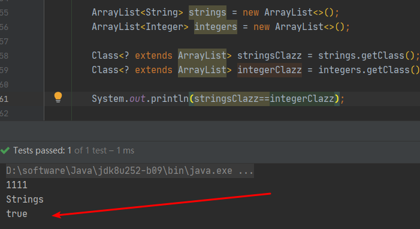

# 泛型的引出

Object 类型可以接受任意的数据类型。于是，假设有这样一个要求：定义一个消息的程序类，要发送的消息可能有字符串、整型、浮点型...

```java
class Message {
    private Object content ;

    public Object getContent() {
        return content;
    }

    public void setContent(Object content) {
        this.content = content;
    }
}

public class TestDemo {

    public static void main(String[] args) {
        Message message = new Message();
        message.setContent(99.99);
        // 强制向下转型
        String content = (String) message.getContent();
        System.out.println(content);
    }
}
```

程序原本是打算设置一个double类型的消息，但是由于开发者的失误，将整个程序有diuble强转为了String，所以最终会产生ClassCastException异常，而最让所有开发者不能接受的是，此时的问题并不是在程序编译的时候发现的，而是在程序执行的时候发现行。

正式因为有了这种强制性的类型转换，所以才导致了整个程序存在严重的安全隐患，所以在JDK1.5后引入了泛型（Generic）以解决程序中可能存在的ClassCastException。


# 泛型的定义

泛型，即“参数化类型”。一提到参数，最熟悉的就是定义方法时有形参，然后调用此方法时传递实参。那么参数化类型怎么理解呢？顾名思义，就是将类型由原来的具体的类型参数化，类似于方法中的变量参数，此时类型也定义成参数形式（可以称之为类型形参），然后在使用/调用时传入具体的类型（类型实参）。

泛型的本质是为了参数化类型（在不创建新的类型的情况下，通过泛型指定的不同类型来控制形参具体限制的类型）。也就是说在泛型使用过程中，操作的数据类型被指定为一个参数，这种参数类型可以用在类、接口和方法中，分别被称为泛型类、泛型接口、泛型方法。


```java
class Message<T> {
    private T content ;

    public T getContent() {
        return content;
    }

    public void setContent(T content) {
        this.content = content;
    }
}

public class TestDemo {

    public static void main(String[] args) {
        Message<Integer> message = new Message();
        message.setContent(99);
        // 编译时就错误
        // message.setContent(99.99);
        Integer content = message.getContent();
        System.out.println(content);
    }
}
```

**注意：**

- 如果在定义泛型类型的时候只允许设置类，即：如果要设置为基本数据类型则就必须通过包装类来进行处理；

- JDK1.7之后的版本允许  `Message<Integer> message = new Message<>();`  

    ​									 `Message<Integer> message = new Message();`

- 如果使用了定义泛型的类，但是没有传递泛型 如 `Message message = new Message();` ，那么就可以认为泛型是Object！和不加泛型一致了。JDK之所以允许这样操作主要是为了照顾JDK1.5之前的用户写的代码


# 泛型通配符引入

**来看一个泛型放入参数的例子：**

```java
public class TestDemo {

    public static void main(String[] args) {
        Message<Integer> message = new Message<>();
        message.setContent(99);
        info(message);

    }

    public static void info(Message<String>  message) {

        System.out.println(message.getContent());
    }
}
```

泛型作为参数时，如果当传入的泛型类型（Integer）和参数泛型类型（String）不匹配时，那么程序就会出现编译错误。


有人说，简单把String这个泛型去掉就好了！

```java
public class TestDemo {

    public static void main(String[] args) {
        Message<Integer> message = new Message<>();
        message.setContent(99);
        info(message);

    }

    // 去除泛型
    public static void info(Message  message) {

        System.out.println(message.getContent());
    }
}
```

的确，这样程序可以正常的运行。也就是说，如果在info()方法上的Message参数不追究具体的泛型，那么此时就描述的是Object类型，那么意味着之前所作的泛型操作设计就全部毁灭了。所以对于此时泛型引用传递的操作来讲最佳的实现方案就是，可以接收所有的泛型对象，但是**不允许进行内容的修改**，而为了实现这样的要求，可以使用”？“作为通配符来进行控制。


> ？ 通配符

```java
public class TestDemo {

    public static void main(String[] args) {
        Message<Integer> message = new Message<>();
        message.setContent(99);
        info(message);

    }

    public static void info(Message<?>  message) {

        
        // 只允许 读，不允许修改message
        System.out.println(message.getContent());
    }
}
```

此时在info()方法中使用了 ”？“ 作为了泛型的通配符，这就可以接受所有的泛型类型的对象实例。但是不允许进行内容的修改。只允许内容的获取。而在 ”？“通配符的操作基础之上，Java又给出了两个子通配符的处理格式：

- 设置泛型的上限 （？ extends 类）：只能够使用当前类或者当前类的子类作为泛型类型；
- 设置泛型的下限 （？ super 类）：只能够使用当前类或者当前类的父类作为泛型类型；

```java
public class TestDemo {

    public static void main(String[] args) {
        Message<Integer> message = new Message<>();
        message.setContent(99);
        info(message);

    }

    public static void info(Message<? extends Number>  message) {

        System.out.println(message.getContent());
    }
}
```


# 泛型接口

```java
public interface IMessage<T> {
    void send(T t) ;
}
```


**实现类方式一：**

```java
public class MessageImpl<T> implements IMessage<T> {
    @Override
    public void send(T t) {
        System.out.println(t);
    }
}
```


**实现类方式二：**

```java
public class MessageImpl2 implements IMessage<String> {
    @Override
    public void send(String s) {
        System.out.println(s);
    }
}
```


# 泛型方法

```java
public static <T extends Number> void fun(T ...args) {

    for (T arg : args) {

        System.out.println(arg);
    }
}
```


**用途：**

一般需要配合反射使用。


# 类型擦除

简单的说就是，类型参数只存在于编译期，在运行时，Java 的虚拟机 ( JVM ) 并不知道泛型的存在。



