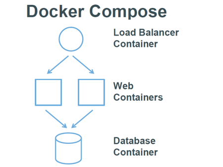

#  什么是Docker


目前最流行的Linux容器。提供简单易用的容器使用接口。


# 为什么使用Docker


## 1、更快速的交付和部署

> 一次创建或配置，可以在任意地方正常运行。


## **2、更高效的虚拟化**


## **3、更轻松的迁移和扩展**

> Docker 容器几乎可以在任意的平台上运行，包括物理机、虚拟机、公有云、私有云、个人电脑、服务器等。


## **4、更简单的管理**


# Docker 架构概念

Docker是CS架构，主要有**两个**概念：

- **Docker daemon**：运行在宿主机上，Docker守护进程，用户通过Docker client(Docker命令)与Docker daemon交互。
- **Docker client**：Docker 命令行工具，是用户使用Docker的主要方式，Docker client与Docker daemon通信并将结果返回给用户，Docker client也可以通过socket或者RESTful api访问远程的Docker daemon


Docker的三个组成部件：

- **Docker image**:  
    - 只读。
    - 镜像包含需要运行的文件。
    - 镜像用于创建Container，可以创建多个。
    - 由Dockerfile创建 | Docker hub 下载
- **Docker container**：
    - 运行组件
    - 与其他环境隔离
- **Docker hub/registry**：
    - 管理镜像。
    - 可以创建自己的Docker registry。


# 常用命令

拉取docker镜像

```
docker pull image_name
```

查看宿主机上的镜像，Docker镜像保存在/var/lib/docker目录下:

```
docker images
```

删除镜像

```
docker rmi  docker.io/tomcat:7.0.77-jre7   或者  docker rmi b39c68b7af30
```

查看当前有哪些容器正在运行

```
docker ps
```

查看所有容器

```
docker ps -a
```

启动、停止、重启容器命令：

```
docker start container_name/container_id
docker stop container_name/container_id
docker restart container_name/container_id
```

后台启动一个容器后，如果想进入到这个容器，可以使用attach命令：

```
docker attach container_name/container_id
```

删除容器的命令：

```
docker rm container_name/container_id
```

删除所有停止的容器：

```
docker rm $(docker ps -a -q)
```

查看当前系统Docker信息

```
docker info
```

从Docker hub上下载某个镜像:

```
docker pull centos:latest
docker pull centos:latest
```

查找Docker Hub上的nginx镜像

```
docker search nginx
```

执行docker pull centos会将Centos这个仓库下面的所有镜像下载到本地repository。


启动一个容器并且给容器命名

```bash
docker run --name es01 containerId
```

以name启动一个容器

```bash
docker start name
```

检查docker 镜像的情况

```bash
docker image inspect ...
```


## Docker run的参数

- **-t:** 在新容器内指定一个伪终端或终端。
- **-i:** 允许你对容器内的标准输入 (STDIN) 进行交互。
- -d：允许后台运行
- -e：设置环境变量
- --name：指定容器名称
- -p：端口映射 -p 9200:9200
- -P：随机端口映射
- --rm：容器停止后自动删除容器


# Dockerfile

> Dockerfile 定义镜像，依赖镜像来运行容器.


Docker images、container、Dockerfile之间的关系。


## 什么是Dockerfile （makefile差不多，脚本文件）

> 特殊的文件系统。除了提供容器运行时所需的程序、库、资源、配置等文件外，还包含了一些为运行时准备的一些配置参数（如匿名卷、环境变量、用户等）。


镜像定制：定制每一层所添加的配置、文件。把每一层修改、安装、构建、操作的命令都写入一个脚本，用这个脚本来构建、定制镜像。


## Dockerfile 文件格式

```dockerfile
##  Dockerfile文件格式

# 本脚本是基于Ubuntu系统运行nginx。
# This dockerfile uses the ubuntu image
# VERSION 2 - EDITION 1
# Author: docker_user
# Command format: Instruction [arguments / command] ..
 
# 1、第一行必须指定 基础镜像信息
FROM ubuntu
 
# 2、维护者信息
MAINTAINER docker_user docker_user@email.com
 
# 3、镜像操作指令
RUN echo "deb http://archive.ubuntu.com/ubuntu/ raring main universe" >> /etc/apt/sources.list
RUN apt-get update && apt-get install -y nginx
RUN echo "\ndaemon off;" >> /etc/nginx/nginx.conf
 
# 4、容器启动执行指令
CMD /usr/sbin/nginx
```

Dockerfile 分为四部分：**基础镜像信息、维护者信息、镜像操作指令、容器启动执行指令**。


##  构建镜像

```bash
docker build .
```

构建过程在 daemon中 进行。


... To be continued


# Docker-compose 

Dockerfile 可以让用户管理一个单独的应用容器；而Compose则允许用户在一个模板（YAML）中定义一组相关的应用容器（被称为一个project项目）。



Compose 中有两个重要的概念：

- 服务 (service) ：一个应用的容器，实际上可以包括若干运行相同镜像的容器实例。
- 项目 (project) ：由一组关联的应用容器组成的一个完整业务单元，在 docker-compose.yml 文件中定义。