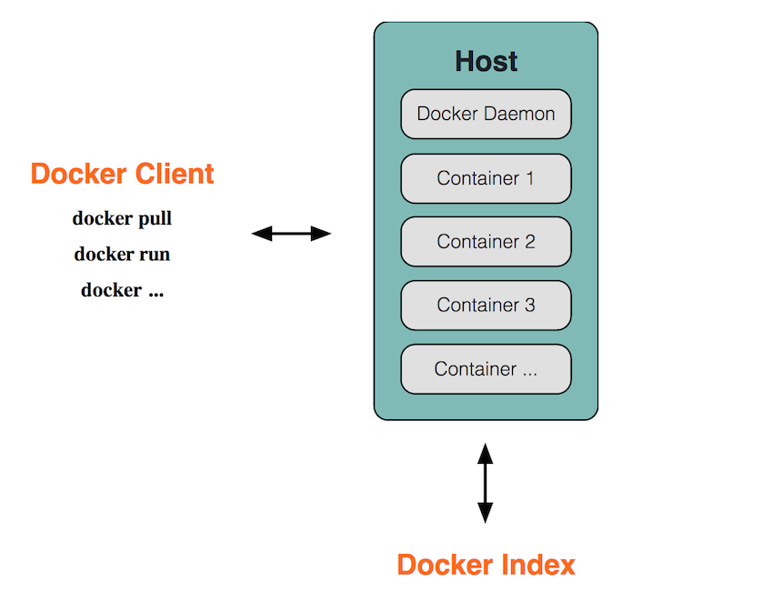
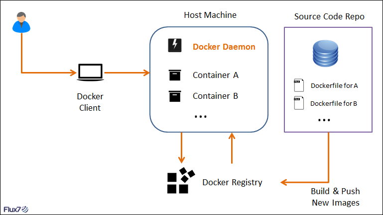

#  一、什么是Docker


目前最流行的Linux容器。提供简单易用的容器使用接口。


# 二、为什么使用Docker


## 1、更快速的交付和部署

> 一次创建或配置，可以在任意地方正常运行。


## **2、更高效的虚拟化**


## **3、更轻松的迁移和扩展**

> Docker 容器几乎可以在任意的平台上运行，包括物理机、虚拟机、公有云、私有云、个人电脑、服务器等。


## **4、更简单的管理**


# 三、Docker 架构概念

Docker是CS架构，主要有**两个**概念：

- **Docker daemon**：运行在宿主机上，Docker守护进程，用户通过Docker client(Docker命令)与Docker daemon交互。
- **Docker client**：Docker 命令行工具，是用户使用Docker的主要方式，Docker client与Docker daemon通信并将结果返回给用户，Docker client也可以通过socket或者RESTful api访问远程的Docker daemon




Docker的三个组成部件：

- **Docker image**:  
    - 只读。
    - 镜像包含需要运行的文件。
    - 镜像用于创建Container，可以创建多个。
    - 由Dockerfile创建 | Docker hub 下载
- **Docker container**：
    - 运行组件
    - 与其他环境隔离
- **Docker hub/registry**：
    - 管理镜像。
    - 可以创建自己的Docker registry。


# 四、Docker的基本操作


## 4.1 安装Docker （CentOS)

> 1. **下载关于Docker的依赖环境**
>
>    yum -y install yum-utils device-mapper-persistent-data lvm2

> 2. **设置Docker的镜像源**
>
>    yum-config-manager --add-repo http://mirros.aliyun.com/docker-ce/linux/centos/docker-ce.repo

> 3. **安装Docker**
>
>    yum makecache fast
>
>    yum -y install docker-ce

> 4. **启动，并设置为开机启动，测试**
>
>    systemctl start docker
>
>    systemctl enable docker (开机启动)
>
>    docker run hello-world(测试)

## 4.2 Docker的中央仓库（registry）

> 1. Docker官方的中央仓库：这个仓库的镜像是最全的，但是下载速度比较慢
>
>    1. https://hub.docker.com
>
> 2. 国内的镜像网站：网易蜂巢、daoCloud.
>
>    1. https://hub.daocloud.io/
>    2. https://c.163yun.com/hub#/home （需要登录）
>
> 3. 公司私有Docker镜像 （添加配置）
>
>    1. 需要在 `/etc/docker/daemon.json`添加如下
>
>       ```json
>       {
>           "registry-mirrors": ["https://registry.docker-cn.com"],
>           "insecure-registries": ["ip:port"]
>       }
>       # 重启两个服务
>       systemctl daemon-reload
>       systemctl restart docker
>       ```
>
>       

## 4.3 镜像的操作

```shell
# 1.拉取镜像到本地
docker pull 镜像名称[:tag]
# 举个例子
docker pull tomcat （默认是去中央仓库拉取）
docker pull daocloud.io/library/tomcat:8.5.15-jre8 (指定镜像仓库)
```

```shell
# 2. 查看全部本地镜像
docker images / docker image ls
```

```shell
# 3.删除镜像
docker rmi 镜像的标识
```

```shell
# 4.镜像的导入导出
# 如果从中央仓库\其他仓库中去下载，总有遇到网络不好的情况
# 所以我们可以将镜像打包，用其他的文件传输方式进行传输

# 4.1 将本地的镜像导出
docker save -o 导出的路径名 镜像id
# 4.2 加载镜像
docker load -i 导出的路径名 # 这样会导致repository和tag都变成<none>
# 4.3 修改名称
docker tag 镜像的id 名称:version
```


## 4.4 容器的操作

```shell
# 1. 运行容器
# 简单操作
docker run 镜像的id|镜像名称[:tag]
# 常用的参数（复杂）
docker run -d -p hostPort:containerPort --name 容器名称 镜像的id|镜像的名称[:tag]
# -d: 代表后台运行容器（daemon）
# -p: 宿主机端口:容器端口
# --name: 指定容器的名称
```

-------------

```shell
# 2.查看正在运行的容器
docker ps [-qa]
# -a: 查看全部的容器，包括没有运行的容器
# -q: 只查看容器的标识
```

------------

```shell
# 3.查看容器的日志
docker logs -f 容器id
# -f: 滚动查看日志的最后几行
```

-----------

```shell
# 4.进入容器内部
docker exec -it 容器id bash
docker attach container_name/container_id
```

```shell
# 5. 因为容器内部不支持vim，所以如果需要修改文件得拷贝到宿主机，修改完再拷贝回去，很麻烦
# vscode连接docker 容器，直接进行文件编辑
# 当在本机\remote-ssh连接到服务器后，服务器上开启了docker的话，点击docker的tab，就能看到信息
# ctrl-shift-p 输入 attatch， 选择 Remote-Containers:Attach to Running Container
# 这样就直接进入docker container啦
```

---------------

```shell
# 6. 停止、删除容器
docker stop 容器id
docker stop $(docker ps -qa)
docker rm 容器id
docker rm $(dcoker ps -qa) # 删除全部容器
```

----------

```shell
# 7. 重启容器
docker start 容器id
```

-----

```shell
# 查看当前系统Docker信息
docker info
```

查找Docker Hub上的nginx镜像

```
docker search nginx
```

执行docker pull centos会将Centos这个仓库下面的所有镜像下载到本地repository。

启动一个容器并且给容器命名

```bash
docker run --name es01 containerId
```

以name启动一个容器

```bash
docker start name
```

检查docker 镜像的情况

```bash
docker image inspect ...
```

## Docker run的参数

- **-t:** 在新容器内指定一个伪终端或终端。
- **-i:** 允许你对容器内的标准输入 (STDIN) 进行交互。
- -d：允许后台运行
- -e：设置环境变量
- --name：指定容器名称
- -p：端口映射 -p 9200:9200
- -P：随机端口映射
- --rm：容器停止后自动删除容器


# 五、Docker应用

## 5.1 准备War包

## 5.2 准备MySQL容器

```shell
# 需要指定一个密码 -e
docker run -d -p 3306:3306 --name mysql5.7 -e MYSQL_ROOT_PASSWORD=admin daocloud.io/library/mysql:5.7.4
```

## 5.3 准备Tomcat容器

```shell
# 运行tomcat容器，将war包部署到Tomcat容器内部即可
docker pull daocloud.io/library/tomcat:8.5.16-jre8
docker run -d -p 8080:8080 --name tomcat 镜像id
# 将war包拷贝到容器中
docker cp 文件名称 容器id:容器内部路径
docker jenkins.war 容器id:/usr/local/tomcat/webapps/
```


# Dockerfile

> Dockerfile 定义镜像，依赖镜像来运行容器.


Docker images、container、Dockerfile之间的关系。




## 什么是Dockerfile （makefile差不多，脚本文件）

> 特殊的文件系统。除了提供容器运行时所需的程序、库、资源、配置等文件外，还包含了一些为运行时准备的一些配置参数（如匿名卷、环境变量、用户等）。


镜像定制：定制每一层所添加的配置、文件。把每一层修改、安装、构建、操作的命令都写入一个脚本，用这个脚本来构建、定制镜像。


## Dockerfile 文件格式

```dockerfile
##  Dockerfile文件格式

# 本脚本是基于Ubuntu系统运行nginx。
# This dockerfile uses the ubuntu image
# VERSION 2 - EDITION 1
# Author: docker_user
# Command format: Instruction [arguments / command] ..
 
# 1、第一行必须指定 基础镜像信息
FROM ubuntu
 
# 2、维护者信息
MAINTAINER docker_user docker_user@email.com
 
# 3、镜像操作指令
RUN echo "deb http://archive.ubuntu.com/ubuntu/ raring main universe" >> /etc/apt/sources.list
RUN apt-get update && apt-get install -y nginx
RUN echo "\ndaemon off;" >> /etc/nginx/nginx.conf
 
# 4、容器启动执行指令
CMD /usr/sbin/nginx
```

Dockerfile 分为四部分：**基础镜像信息、维护者信息、镜像操作指令、容器启动执行指令**。


##  构建镜像

```bash
docker build .
```

构建过程在 daemon中 进行。


... To be continued


# Docker-compose 

Dockerfile 可以让用户管理一个单独的应用容器；而Compose则允许用户在一个模板（YAML）中定义一组相关的应用容器（被称为一个project项目）。


Compose 中有两个重要的概念：

- 服务 (service) ：一个应用的容器，实际上可以包括若干运行相同镜像的容器实例。
- 项目 (project) ：由一组关联的应用容器组成的一个完整业务单元，在 docker-compose.yml 文件中定义。


# 面试

### Docker的四种网络模式是啥


我们在使用docker run创建Docker容器时，可以用--net选项指定容器的网络模式，Docker有以下4种网络模式：

**· host模式，使用--net=host指定。**

**· container模式，使用--net=container:NAME_or_ID指定。**

**· none模式，使用--net=none指定。**

**· bridge模式，使用--net=bridge指定，默认设置。**


Docker中我们一般会使用NameSpace来做资源的隔离。因为Docker是跑在物理服务器上的（宿主机）。隔离的方式有PID的进程隔离，Mount的文件系统隔离，Network的网络隔离。

Netword Namespace提供了一份独立的网络环境，包括网卡、路由、Iptable规则等。能够与其他的Network namespace进行隔离。


当我们使用 host 模式， 容器不会获得一个独立的Network Namespace，容器和宿主机是共用一套网络系统。


当使用Container模式，新创建的容器和指定的容器公用一套Network Namespace，而不是与宿主机共享。


None模式就需要我们手动地为一个容器配置IP、添加网卡、处理路由信息。


Bridge模式。也就是桥模式。每一个容器都会有一个Network Namespace，需要独立设置IP。并将主机上的Docker容器连接到一个虚拟网桥上。


