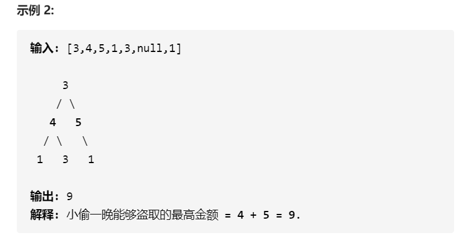
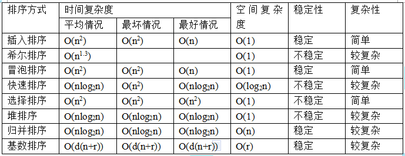

# 图

##  DFS

### 1、机器人的运动范围

> 题目

地上有一个m行和n列的方格。一个机器人从坐标0,0的格子开始移动，每一次只能向左，右，上，下四个方向移动一格，但是不能进入行坐标和列坐标的数位之和大于k的格子。 例如，当k为18时，机器人能够进入方格（35,37），因为3+5+3+7 = 18。但是，它不能进入方格（35,38），因为3+5+3+8 = 19。请问该机器人能够达到多少个格子？


> 思路

注意题目中的移动方式，每次只能移动一格。那么也就是说如果有一次移动中，上下左右四个方向都无法过去，就必须原路返回！

所以就是一道典型的DFS题型。


> 解题特点

DFS中有几个特点

- 记录之前走过的信息（避免重复走）
- 边界明确
- 有一个新格子能否过去的判断条件
- 需要递归


> AC 参考

```python
#coding=utf-8

class Solution:
    def getSum(self, number):
        strNumber = str(number)
        ints = [int(i) for i in list(strNumber)]
        return sum(ints)

    def dfs(self, x, y, threshold, matrix):
        # 1、判断是否越界
        if x<0 or x>=len(matrix) or y<0 or y>=len(matrix[0]):
            return
        
        # 2、在不越界的情况下，判断是否符合条件
        sum_i = self.getSum(x)
        sum_j = self.getSum(y)
        if (sum_i+sum_j>threshold):
            return
        
        # 3、第三个需要返回的是这个点已经visited了
        if matrix[x][y]==1:
            return 
        
        matrix[x][y]=1

        self.dfs(x+1,y,threshold,matrix)
        self.dfs(x,y+1,threshold,matrix)
        self.dfs(x-1,y,threshold,matrix)
        self.dfs(x,y-1,threshold,matrix)


    def movingCount(self, threshold, rows, cols):
        # write code here
        matrix = [[0]*cols for i in range(rows)]
        matrix[0][0]=0
        print(matrix)
        print(matrix[0][1])

        self.dfs(0,0,threshold,matrix)
        print(matrix)
        res=0
        for row in matrix:
            res+=sum(row)
        return res

if __name__ == "__main__":
    res = Solution().movingCount(10, 1, 100)
    print(res)
```

在递归中**先做** `if`不成立的情况，把需要return的情况都列出来后，剩下的就是允许的情况。像这里，有三个不成立的条件，也是一般DFS中常见的三个条件：

- 越界
- 已经访问过了
- 不符合题设的条件

前面两个条件是任务DFS中都存在的，第三个是与题目相关的条件。


### 2、矩阵中路径是否存在


```java
package com.nowcoder.matrix;

import java.util.Arrays;

/**
 * @author Kicc
 * @date 20/7/29 下午 4:02
 */
public class HasPath {

    public boolean hasPath(char[] matrix, int rows, int cols, char[] str)
    {
        // 将一维数组转化成二维矩阵表示
        char[][] myMatrix = switchMatrix(matrix, rows, cols);


        // str 的 下标
        int index = 0;


        int row = 0;
        int col = 0;

        // 出发点可以是矩阵中任意一点
        for (int i = 0; i < rows; i++) {
            for (int j = 0; j < cols; j++) {
                // 每次出发前，都要把index和访问矩阵重置！
                int [][] visited = new int[rows][cols];
                boolean b = goAround(myMatrix, i, j, visited, str, 0);
                if (b) {
                    return true;
                }
            }
        }

        return false;
    }


    /**
     * dfs过程
     * @param matrix 二维矩阵，不变
     * @param row 遍历的横坐标
     * @param col 遍历的纵坐标
     * @param visited 访问矩阵
     * @param str 字符串 不变
     * @param index 当前的字符串下标
     * @return 是否 存在
     */
    private boolean goAround(char[][] matrix, int row, int col, int[][] visited, char[] str, int index){

        int rows = matrix.length;
        int cols = matrix[0].length;
        
        // 1、判断是否越界
        if (row<0 || row>=rows) {
            return false;
        }
        if (col<0 || col>=cols) {
            return false;
        }

        // 2、是否已经访问过
        if (visited[row][col]==1) {
            return false;
        }

        char curr = str[index];
        // 3、是否符合要求
        if (matrix[row][col]!=curr) {
            return false;
        }

        // 三个条件都通过，就算是访问了当前的元素
        visited[row][col] = 1;

        // 4、判断是否到了字符串尾
        if (curr==matrix[row][col] && index==str.length-1){
            return true;
        }

        // 往前走一步
        int thisStep = index+1;

        //上下左右地走
//        System.out.println("向右走");
        boolean b1 =  goAround(matrix, row, col+1, visited, str, thisStep);
//        System.out.println("向下走");
        boolean b2 =  goAround(matrix, row+1, col, visited, str, thisStep);
//        System.out.println("向上走");
        boolean b3 =  goAround(matrix, row-1, col, visited, str, thisStep);
//        System.out.println("向左走");
        boolean b4 =  goAround(matrix, row, col-1, visited, str, thisStep);


        // 只要存在一个路径有就行
        return b1||b2||b3||b4;

    }


    private char[][] switchMatrix(char [] matrix, int rows, int cols) {
        char[][] myMatrix = new char[rows][cols];

        int count = 0;
        int row = 0;
        int col = 0;

        for (char c : matrix) {
            if (count!=0 && count%cols==0) {
                row++;
                col=0;
            }
            myMatrix[row][col] = c;
            col++;
            count++;
        }
        
        
        return myMatrix;
    }
}
```


## BFS

### 1、Dijkstra 算法

> 算法特点

**BFS、有向图\无向图、单源最短、带权重（大于0）**


> 算法思路

是一个贪心策略：包含了一个顶点集合、一个dis数组

- **顶点集合：**确定了源点到其他点的最短路径后，可以把这些确定的点加入集合
- **dis数组**：保存了源点到其他顶点目前情况下的最短路径


> 实例说明


初始状态下：

- 顶点集合：{v1}

- dis数组：

    

可达不可达是要看顶点集合的，刚开始的顶点就只有v1，即便可以看到v4 可以通过 v1-v3-v4到达，但是v3不在集合中，所以无法使用。


**操作：**

寻找dis数组中最小的数：10。加入对应的顶点v3: {v1, v3}。 说明v1到v3的最短路径现在已经确定了。同时更新v3相关的其他顶点的最短路径。


**重复操作：**

寻找dis数组中最小的数：30。加入对应的顶点v5: {v1, v3, v5}。 说明v1到v5的最短路径现在已经确定了。同时更新v5相关的其他顶点的最短路径。


**重复操作：**

寻找dis数组中最小的数：50。加入对应的顶点v5: {v1, v3, v5, v4}。 说明v1到v4的最短路径现在已经确定了。同时更新v4相关的其他顶点的最短路径。


**重复操作：**

寻找dis数组中最小的数：60。加入对应的顶点v5: {v1, v3, v5, v4, v6}。 说明v1到v6的最短路径现在已经确定了。同时更新v6相关的其他顶点的最短路径。


v1-v2不可达。


# 链表

### 1、LRU缓存机制  LinkedHashMap应用

运用你所掌握的数据结构，设计和实现一个  LRU (最近最少使用) 缓存机制。它应该支持以下操作： 获取数据 get 和 写入数据 put 。

获取数据 get(key) - 如果关键字 (key) 存在于缓存中，则获取关键字的值（总是正数），否则返回 -1。
写入数据 put(key, value) - 如果关键字已经存在，则变更其数据值；如果关键字不存在，则插入该组「关键字/值」。当缓存容量达到上限时，它应该在写入新数据之前删除最久未使用的数据值，从而为新的数据值留出空间。

```java
class LRUCache {

    public LRUCache(int capacity) {
    }

    public int get(int key) {

    }

    public void put(int key, int value) {

    }

}
```

> 用例

```java
/* 缓存容量为 2 */
LRUCache cache = new LRUCache(2);
// 你可以把 cache 理解成一个队列
// 假设左边是队头，右边是队尾
// 最近使用的排在队头，久未使用的排在队尾
// 圆括号表示键值对 (key, val)

cache.put(1, 1);
// cache = [(1, 1)]

cache.put(2, 2);
// cache = [(2, 2), (1, 1)]

cache.get(1);       // 返回 1
// cache = [(1, 1), (2, 2)]
// 解释：因为最近访问了键 1，所以提前至队头
// 返回键 1 对应的值 1

cache.put(3, 3);
// cache = [(3, 3), (1, 1)]
// 解释：缓存容量已满，需要删除内容空出位置
// 优先删除久未使用的数据，也就是队尾的数据
// 然后把新的数据插入队头

cache.get(2);       // 返回 -1 (未找到)
// cache = [(3, 3), (1, 1)]
// 解释：cache 中不存在键为 2 的数据

cache.put(1, 4);    
// cache = [(1, 4), (3, 3)]
// 解释：键 1 已存在，把原始值 1 覆盖为 4
// 不要忘了也要将键值对提前到队头
```


> 思路

要求的时间复杂度是O(1)，说明

- cahe必须是有时序的，以区分最近使用和不是最近使用
- 查找不能是链表的查找，应该是数组或者Map的查找
- 因为 get 方法可以改变 cache中元素的时许，所以插入和删除的操作也必须是 O(1)，所以不能是数组

就以上三点，可以得到。这样的一个数据结构：插入删除O(1)、查找O(1)、有时序。

不能是数组，也不能是链表。要有两者的优点。

**LinkedHashMap**


在LinkedList之上加了一个哈希表。查找的速度变快！


> 算法

```java
class LRUCache2 {

    LinkedHashMap<Integer, Integer> map = new LinkedHashMap<Integer, Integer>();
    int cap = 0;

    public LRUCache2(int capacity) {

        this.cap = capacity;
    }

    public int get(int key) {
        // 不存在就返回 -1 
        if (!map.containsKey(key)) {
            return -1;
        }
        // 使用过之后需要标记
        makeRecently(key);

        // 返回元素
        return map.get(key);
    }

    public void put(int key, int value) {
        // 如果存在，就需要修改
        // 但是不能在链表的原处修改，
        // 修改完后的元素是最近使用的
        // 那么可以先删除，再加入
        if (map.containsKey(key)) {
            map.remove(key);
            map.put(key, value);
            // 注意，这里就需要返回了
            // 不要再执行下面的代码
            return;
        }

        // 如果要溢出
        if (cap==map.size()) {
            // 删除第一个
            Integer next = map.keySet().iterator().next();
            map.remove(next);
            // add
            map.put(key, value);
        } else {
            map.put(key, value);
        }


    }

    // 其实就是先删除再加入
    private void makeRecently(int key) {
        Integer val = map.get(key);
        map.remove(key);
        map.put(key, val);
    }
}
```


# 二叉树


### 补充：红黑树

> 定义

二叉查找树，每一个节点增加一个存储位表示节点的颜色。通过几个约束保证红黑树中的任意一条有根到叶子节点的路径不会超过另一条路径的2倍。由此达到一种平衡。

因为红黑树设计出来的目的是用来加快二叉查找树的查找速度，而减少树的深度是一种减少查找次数非常有效的方式，跟数据库中的B+树类似的思想。


> 为什么要有红黑树，查找树不行吗？

二叉的查找树在插入的元素比较特殊的情况下会退化成一个链表或者近似链表的结构。这样的结构查询效率很低。


> 五个性质  保证  树的高度始终是  logN

1、结点是红色或者黑色

2、不能出现连续的两个红色节点

3、根节点是黑色的

4、每一个叶子节点都是黑色的null节点

5、对于任意一个节点而言，其到NULl节点的每一条路径所包含的黑色节点个数一致


> 旋转

- 左旋
- 右旋

在插入和删除节点的过程中，很有可能会破坏红黑树的几个性质，因此需要通过树的旋转或者节点颜色的变化来达到平衡。


### 1、二叉查找树 第k小元素

> 分析

**哪个节点是最小的？第二小的是哪个？**

- 最左端的节点永远是最小值
- 第二小的值肯定是最小值的父节点
- 如果父节点有右子树的话：
    - 第三小的值是右子树的最左节点
    - 
- 如果父节点没有右子树的话：
    - 第三小的值是父父节点
    - 


按照这个思路：

1. 初始化一个Stack
2. 如果当前节点存在，进栈。 curr= curr.left
3. 重复第二步，直到当前节点==null
4. 取出栈顶元素，是否是最小第k个  (--k==0) return node
    1. 如果是，输出
    2. 如果不是，什么都不做
5. 另当前元素为栈顶元素的右子树。 curr = node.right


> 代码 

```java
public class KthNode1 {

    TreeNode KthNode(TreeNode pRoot, int k)
    {
        TreeNode node = null;
        if (pRoot==null || k==0) {
            return null;
        }
        Deque<TreeNode> treeNodes = new ArrayDeque<>();
        TreeNode curr = pRoot;

        // 只要栈和树有一个不是空的
        while (!treeNodes.isEmpty() || curr!=null) {
            // 一直插入左子树
            while (curr!=null) {
                treeNodes.push(curr);
                curr = curr.left;
            }
            // 取出栈顶元素
            node = treeNodes.pop();
            if ((--k)==0) {
                return node;
            }
            // 当前元素为栈顶的右子树 （如果是null，下次循环会再取栈顶元素）
            curr = node.right;
        }

        return null;
    }
}
```


> 核心考察点：1、递归；2、栈结构的使用


### 2、最近公共祖先

> 思路

我们可以用**哈希表**存储所有节点的父节点，然后我们就可以利用节点的父节点信息从 p 结点开始不断**往上跳**，并记录已经访问过的节点，再从 q 节点开始不断往上跳，如果碰到已经访问过的节点，那么这个节点就是我们要找的最近公共祖先。

> 算法

从根节点开始遍历整棵二叉树，用哈希表记录每个节点的父节点指针。
从 p 节点开始不断往它的祖先移动，并用数据结构记录已经访问过的祖先节点。
同样，我们再从 q 节点开始不断往它的祖先移动，如果有祖先已经被访问过，即意味着这是 p 和 q 的深度最深的公共祖先，即 LCA 节点。

```java
public class LowestCommonAncestor {

    // 子树 => 父节点
    private Map<Integer, TreeNode> fatherMap = new HashMap<>();
    // 向上保存p\q 开始的父节点
    private Set<Integer> parents = new HashSet<>();

    public TreeNode lowestCommonAncestor(TreeNode root, TreeNode p, TreeNode q) {
        fatherMap.put(root.val, null);
        dfs(root);
        while (p!=null) {
            parents.add(p.val);
            p = fatherMap.get(p);
        }
        while (q!=null) {
            if (parents.contains(q.val)) {
                return q;
            }
            q = fatherMap.get(q.val);
        }
        return null;
    }


    // 完成整棵树的自底向上
    public void dfs(TreeNode node) {
        if (node.left!=null) {
            fatherMap.put(node.left.val, node);
            dfs(node.left);
        }
        if (node.right!=null) {
            fatherMap.put(node.right.val, node);
            dfs(node.right);
        }
    }
}
```


### 3、二叉树原地展开为链表

给定一个二叉树，[原地](https://baike.baidu.com/item/原地算法/8010757)将它展开为一个单链表。


> 思路

根据图可知，是以前序遍历的方式展开的。又因为题设中要求必须是原地展开，也就是 root 不变。那么使用 额外的Arraylist存储前序遍历的 方法就不可行。

可以比较容易地看出，节点5放到了4的后面。4是root节点左子树的最右边的节点，而5是root节点右子树的第一个节点。

对于任何一个节点node而言，都有这么一个规律：

node 左子树中的最右边节点 是 node右子树第一个节点的前驱节点。

因此，我们只要对于当前节点 curr

- 找到左子树中的最后节点 pre
- pre.right = curr.right
- pre.right = pre.left
- pre.left = null

最后 curr = curr.right


> 算法

```java
public void flatten(TreeNode root) {
    TreeNode curr = root;

    while (curr!=null) {
        if (curr.left!=null) {
            TreeNode next = curr.left;
            TreeNode pre = next;
            // 当前节点左子树的最右节点为pre
            while (pre.right!=null) {
                pre = pre.right;
            }
            // 把当前节点的右子树放到pre的右子树
            pre.right = curr.right;
            // 把curr的左子树放到右子树上
            curr.right = curr.left;
            // 左子树设置为空
            curr.left = null;
        }


        curr = curr.right;
    }
}
```


### 4、在相邻的节点无法同时取的情况下，求二叉树的最大和

在上次打劫完一条街道之后和一圈房屋后，小偷又发现了一个新的可行窃的地区。这个地区只有一个入口，我们称之为“根”。 除了“根”之外，每栋房子有且只有一个“父“房子与之相连。一番侦察之后，聪明的小偷意识到“这个地方的所有房屋的排列类似于一棵二叉树”。 如果两个直接相连的房子在同一天晚上被打劫，房屋将自动报警。

计算在不触动警报的情况下，小偷一晚能够盗取的最高金额。





> 我的思路

如果父节点已经选了，那么子节点就不选，孙子节点就能选。隔一层选取。最终根据root节点的选择与否，输出最大值。

> 分析

**我的思路**存在一个问题，当父节点选取之后，子节点确实无法选择；但是父节点不选，并不意味着子节点必须选取。而是在 【选】 与 【不选】 中取最大值。

> 正确做法

我们可以用 f(o) 表示选择 o 节点的情况下，o 节点的子树上被选择的节点的最大权值和；g(o) 表示不选择 o 节点的情况下，o 节点的子树上被选择的节点的最大权值和；l 和 r 代表 o 的左右孩子。

- 当 o 被选中时，o 的左右孩子都不能被选中，故 o 被选中情况下子树上被选中点的最大权值和为 l 和 r 不被选中的最大权值和相加，即 f(o) = g(l) + g(r)。
- 当 o 不被选中时，o 的左右孩子可以被选中，也可以不被选中。对于 o 的某个具体的孩子 x，它对 o 的贡献是 x 被选中和不被选中情况下权值和的较大值。


最终的实现可以借助HashMap<TreeNode, Integer>，表示node节点的最大值。

因为一个节点的最大值是根据后续节点的值推算出来的，因此我们需要使用后序遍历。

> 代码

```java
package com.nowcoder.tree;

import com.nowcoder.util.BinaryTree;
import com.nowcoder.util.TreeNode;

import java.util.HashMap;
import java.util.Map;

/**
 * @author Kicc
 * @date 20/8/5 上午 10:13
 * 在上次打劫完一条街道之后和一圈房屋后，小偷又发现了一个新的可行窃的地区。这个地区只有一个入口，
 * 我们称之为“根”。 除了“根”之外，每栋房子有且只有一个“父“房子与之相连。
 * 一番侦察之后，聪明的小偷意识到“这个地方的所有房屋的排列类似于一棵二叉树”。
 * 如果两个直接相连的房子在同一天晚上被打劫，房屋将自动报警。
 *
 * 计算在不触动警报的情况下，小偷一晚能够盗取的最高金额。
 *
 * 来源：力扣（LeetCode）
 * 链接：https://leetcode-cn.com/problems/house-robber-iii
 * 著作权归领扣网络所有。商业转载请联系官方授权，非商业转载请注明出处。
 */
public class Rob {

    public static void main(String[] args) {
//        int[] nums = new int[]{3,4,5,1,3,-1,1};
        int[] nums = new int[]{3,2,3,-1,3,-1,1};
        BinaryTree tree = new BinaryTree(nums);
        int rob = new Rob().rob(tree.getRoot());
        System.out.println(rob);
    }

    // f表示选择了当前节点
    private Map<TreeNode, Integer> f = new HashMap<TreeNode, Integer>();
    // g表示没有选择当前节点
    private Map<TreeNode, Integer> g = new HashMap<TreeNode, Integer>();


    public int rob(TreeNode root) {
        dfs(root);
        int max = Math.max(f.getOrDefault(root, 0), g.getOrDefault(root, 0));
        return max;

    }

    private void dfs(TreeNode node) {
        if (node==null) {
            return;
        }

        // 后序遍历
        dfs(node.left);
        dfs(node.right);

        
        f.put(node, node.val + g.getOrDefault(node.left,0)+g.getOrDefault(node.right,0));
        g.put(node, Math.max(f.getOrDefault(node.left, 0), g.getOrDefault(node.left, 0))
                + Math.max(f.getOrDefault(node.right, 0), g.getOrDefault(node.right, 0)));

    }

}
```


### 5、验证二叉树的前序序列化


> 分析

假设有槽点这个概念：一个坑位

一个非空的节点可以 创造两个两个 子节点的位置。一个 # 节点不能创建 子节点的位置，每一个节点都消耗一个节点的剩余。


> 代码

```java
public boolean isValidSerialization(String preorder) {
    int slot = 0;
    String[] chars = preorder.split(",");
    if (chars.length==0) {
        return false;
    } else {
        if (chars[0].equals("#")) {
            slot = 0;
        } else {
            slot = 2;
        }
    }

    for (int i = 0; i < chars.length; i++) {
        if (i==0) {
            continue;
        }

        if (slot<0) {
            return false;
        }

        if (chars[i].equals("#")) {
            slot--;
        } else {
            slot++;
        }

    }

    if (slot==0) {
        return true;
    }

    return false;
}
```


# 数学


# 递归


# 动态规划

> 原理

动态规划一般是关于求最值的问题。某个最值的求解问题 可以向下分解为子问题，子问题又可以继续分解为子问题。最终到达一个可知的初始状态值。这样的作法避免了重复的计算某些值。


- 动态规划问题的一般形式是**求最值**
- 核心问题：**穷举**
    - 存在【**子重叠问题**】，需要加上【备忘录】、【DP Table】
    - 具备**最优子结构**
- 查找**状态转移方程**


**基本流程：**

明确「状态」 -> 定义 dp 数组/函数的含义 -> 明确「选择」-> 明确 base case。


### 1、经典硬币题-A

给定不同面额的硬币 coins 和一个总金额 amount。编写一个函数来计算可以凑成总金额所需的最少的硬币个数。如果没有任何一种硬币组合能组成总金额，返回 -1。


**1、明确状态**

原问题和子问题中变化的变量。硬币的数量是无限的，唯一的状态是金额 amount

**2、dp函数的定义**

`dp[n]` 表示至少需要 dp[n] 个硬币 才能凑齐 n

**3、明确选择**

因为总共有三个面值的硬币。 凑齐n，可以是

- 凑齐 n-1，加 一个1
- 凑齐 n-2，加 一个2
- 凑齐 n-5，加一个5


> 代码

```java
class Solution {
    public int coinChange(int[] coins, int amount) {

        // 如果coin中有1，且只有1，那么最多也就需要amount个硬币
        int[] dp = new int[amount+1];
        // 在coin中只有1的情况下，dp[?] 的最大值也只能到amount
        Arrays.fill(dp, amount+1);
		// 初始状态
        dp[0] = 0;

        for (int i = 1; i < amount+1; i++) {
            for (Integer coin: coins) {
                // dp[负数]就没必要了
                if (i-coin>=0) {
                    dp[i] = Math.min(dp[i], 1+dp[i-coin]);
                }

            }
        }

        // 如果dp[?]==amount+1，说明这个是凑不出来的，返回-1
        return  dp[amount] <= amount ? dp[amount] : -1;
    }

}
```


# 数组

### 1、求输入流的中位数


> 题目分析

**为什么要搞一个输入流，而不是直接给一个数组？**

动态性。


> 解法1

得到完整的数组之后，排序，分奇数、偶数。


> 解法2

维护输入流有序，每次都是一个插入排序操作


> 解法3

维护一个大顶堆和一个小顶堆。

- 大顶堆是数组的前半部分**Pre**。存小值，peek() 取出的是最大值。
- 小顶堆是数组的后半部分**Post**。存大值，peek() 取出的是最小值。
- 保证 len(Pre) <= len(Post)


```java
package com.nowcoder.array;

import java.util.ArrayList;
import java.util.Collections;
import java.util.Comparator;
import java.util.PriorityQueue;


/**
 * @author Kicc
 * @date 20/7/29 下午 7:59
 */

// 解法1
public class GetMedian {

    private ArrayList<Integer> arrays = new ArrayList<>();

    public void Insert(Integer num) {
        arrays.add(num);
    }

    public Double GetMedian() {
        Collections.sort(arrays);
        for (Integer array : arrays) {
            System.out.println(array);
        }

        Double res = null;
        int length = arrays.size();
        if ((length&1)==0) {
            int little = arrays.get(length/2-1);
            int big = arrays.get(length/2);
            res = (little + (big-little)/2.0);
        } else {
            res = arrays.get(length/2) * 1.0;
        }
        return res;
    }
}

// 解法3
class GetMedian2 {

    // 后半段：小顶堆,默认
    private PriorityQueue<Integer> post = new PriorityQueue<>();

    //前半段：大顶堆
    private PriorityQueue<Integer> pre = new PriorityQueue<>(new Comparator<Integer>() {
        @Override
        public int compare(Integer o1, Integer o2) {
            return o2.compareTo(o1);
        }
    });

    private int count = 0;

    /**
     * 始终保持 len(pre) <= len(post)
     * @param num
     */
    public void Insert(Integer num) {
        count++;

        if ((count&1)==1) {
            // 插入第奇数个，要插入post
            // 但不一定是这个num，可能是pre中取出来的num
            if (!pre.isEmpty() && pre.peek() > num) {
                // 把num放入pre
                // 取出堆顶元素
                pre.offer(num);
                num = pre.poll();
            }
            // 更新后的num插入post
            post.offer(num);
        } else {
            // 插入第偶数个，要插入pre
            // 但不一定是这个num，可能是post中取出来的num
            if (!post.isEmpty() && post.peek() < num) {
                post.offer(num);
                num = post.poll();
            }
            pre.offer(num);
        }
        System.out.println("前半段：");
        System.out.println(pre);
        System.out.println("后半段：");
        System.out.println(post);

    }

    public Double GetMedian() {
        if ((count&1)==1) {
            return post.peek() * 1.0;
        } else {
            return pre.peek() + (post.peek()-pre.peek()) / 2.0;
        }
    }

    public PriorityQueue<Integer> getPre() {
        return pre;
    }

    public PriorityQueue<Integer> getPost() {
        return post;
    }
}
```


### 2、TwoSum

如果假设输入一个数组 `nums` 和一个目标和 `target`，**请你返回 `nums` 中能够凑出 `target` 的两个元素的值**，比如输入 `nums = [5,3,1,6], target = 9`，那么算法返回两个元素 `[3,6]`。可以假设只有且仅有一对儿元素可以凑出 `target`。


> 思路

1、用HashMap保存遍历过的元素，只需要一遍。**排除重复元素很麻烦**

- 如果要求输出的是 index，而不是元素本身，那么用HashMap方式会好一点

2、排序 + 双指针。可以比较方便地排除**重复元素**

- 如果要求输出的元素本身而不是index，用双指针会好一点
- 因为排序之后会将原来的index打乱，输出后的index不是原本的index。要处理的话得再加一个映射

```java
// Map做法，输出的是index
public int[] twoSum(int[] nums, int target) {
    HashMap<Integer, Integer> map = new HashMap<>();

    for (int i = 0; i < nums.length; i++) {
        int curr = nums[i];
        int residual = target - curr;
        if (map.containsKey(residual)) {
            return new int[]{map.get(residual), i};
        }
        map.put(curr, i);
    }
    return null;
}
```


```java
// 输出的是元素本身
public int[] twoSum3(int[] nums, int target) {
    // 先排序
    Arrays.sort(nums);

    int lo = 0;
    int hi = nums.length-1;

    while (lo < hi) {
        int left = nums[lo] ;
        int right = nums[hi] ;
        if (left + right < target) {
            lo++;
        } else if (left + right > target) {
            hi--;
        } else {
            return new int[]{left, right};
        }
    }

    return null;

}
```


> 如果不止存在一对符合条件的答案

比如说输入为 `nums = [1,3,1,2,2,3], target = 4`，那么算法返回的结果就是：`[[1,3],[2,2]]`。需要跳过中间重复的元素。

```java
public List<List<Integer>> twoSum3(int[] nums, int target) {
    // 先排序
    Arrays.sort(nums);

    List<List<Integer>> arrayLists = new ArrayList<>();

    int lo = 0;
    int hi = nums.length-1;

    while (lo < hi) {
        int left = nums[lo] ;
        int right = nums[hi] ;
        int sum = left + right ;
        if (sum < target) {
            // 跳过重复元素
            while (lo < hi && nums[lo]==left) {
                lo++;
            }

        } else if (sum > target) {
            // 跳过重复元素
            while (lo < hi && nums[hi]==right) {
                hi--;
            }
        } else {
            ArrayList<Integer> integers = new ArrayList<>();
            integers.add(left);
            integers.add(right);
            arrayLists.add(integers);

            // 跳过重复元素
            while (lo < hi && nums[lo]==left) {
                lo++;
            }
            // 跳过重复元素
            while (lo < hi && nums[hi]==right) {
                hi--;
            }

        }
    }

    return arrayLists;

}
```


### 3、ThreeSum

给你一个包含 n 个整数的数组 nums，判断 nums 中是否存在三个元素 a，b，c ，使得 a + b + c = 0 ？请你找出所有满足条件且不重复的三元组。

注意：答案中不可以包含重复的三元组。


考虑一些特殊的情况 `nums = [0,0,0]`  `nums = [0,0,0,0]`

从TwoSum出发，确定三元组的第一个元素之后， 去后续的数组中寻找符合条件的 二元组。

```java
// 方法签名
class Solution {
    public List<List<Integer>> threeSum(int[] nums) {
    }
}
```


> 算法

```java
package com.nowcoder.array;

import java.util.*;

/**
 * @author Kicc
 * @date 20/7/30 下午 4:02
 */
public class ThreeSum {

    public static void main(String[] args) {
//        int [] nums = {-1, 0, 1, 2, -1, -4};
        int [] nums = {0,0,0,0,0,0,0,0};

        List<List<Integer>> lists = new ThreeSum().threeSum(nums);

        for (List<Integer> list : lists) {
            System.out.println(list);
        }
    }


    public List<List<Integer>> threeSum(int[] nums) {
        // 第一步还是排序
        Arrays.sort(nums);
        List<List<Integer>> arrayLists = new ArrayList<>();
        int lo = 0;
        // lo 表示第一个元素的下标
        while(lo < nums.length) {


            int curr = nums[lo];

            // 二元组的target
            int target = 0 - curr;

            List<List<Integer>> twoSum = twoSum2(nums, lo, target);
            // 如果当前这个curr没有合适的二元组
            if (twoSum.size()!=0) {
                arrayLists.addAll(twoSum);
            }
            // 先加1
            lo++;
            // 再跳过同样的curr，避免重复
            while (lo < nums.length-1 && nums[lo]==curr) {
                lo++;
            }

        }
        return arrayLists;
    }


    public List<List<Integer>> twoSum2(int[] nums, int start, int target) {
        // start为lo+1，因为排过序了
        int lo = start+1, hi = nums.length-1;
        List<List<Integer>> arrayLists = new ArrayList<>();
        // 双指针开始，和twoSum一一样的。
        while (lo < hi) {
            int left = nums[lo];
            int right = nums[hi];
            int sum = left + right;
            if (sum<target) {
                while (lo< hi && nums[lo]==left) {
                    lo++;
                }
            }

            else if (sum>target) {
                while (hi>lo && nums[hi]==right) {
                    hi--;
                }
            } else {
                ArrayList<Integer> arrayList = new ArrayList<>();
                arrayList.add(nums[start]);
                arrayList.add(nums[lo]);
                arrayList.add(nums[hi]);
                arrayLists.add(arrayList);

                while (lo< hi && nums[lo]==left){
                    lo++;
                }

                while (hi>lo && nums[hi]==right) {
                    hi--;
                }
            }


        }

        return arrayLists;
    }


    }
```


### 4、4Sum

给定一个包含 n 个整数的数组 nums 和一个目标值 target，判断 nums 中是否存在四个元素 a，b，c 和 d ，使得 a + b + c + d 的值与 target 相等？找出所有满足条件且不重复的四元组。

注意：

答案中不可以包含重复的四元组。


> 思路

与从2Sum => 3Sum的思路一致，遍历第一个数，从后续的数组中选择合适的三元组。**无限套娃**


> 代码

```java
package com.nowcoder.array;

import java.util.ArrayList;
import java.util.Arrays;
import java.util.List;

/**
 * @author Kicc
 * @date 20/7/31 上午 10:43
 */
public class FourSum {

    public static void main(String[] args) {
//        int[] nums = {1, 0, -1, 0, -2, 2};
//        int[] nums = {-2,-2, -1,0,0,1,2};
        int[]nums = {0,0,0,0};
        int target = 1;

        List<List<Integer>> lists = new FourSum().fourSum(nums, target);
        System.out.println(lists);
    }


    public List<List<Integer>> fourSum(int[] nums, int target) {

        Arrays.sort(nums);

        List<List<Integer>> res = new ArrayList<>();
        int lo = 0;

        while (lo < nums.length) {
            int first = nums[lo];

            List<List<Integer>> lists = threeSum(nums, lo, target - first);
            if (!lists.isEmpty()) {
                res.addAll(lists);
            }
            // 1、保证不越界
            // 2、避免重复
            while (lo<nums.length && nums[lo]==first) {
                lo++;
            }

        }

        return res;

    }


    public List<List<Integer>> threeSum(int[] nums, int start, int target) {

        int first = nums[start];
        int lo = start + 1;
        int length = nums.length;
        List<List<Integer>> arrayLists = new ArrayList<>();
        while (lo < length) {
            int second = nums[lo];


            List<List<Integer>> lists = twoSum(nums, lo, target - second, first);

            if (!lists.isEmpty()){
                arrayLists.addAll(lists);
            }
            // 1、保证不越界
            // 2、避免重复
            while (lo<length && nums[lo]==second) {
                lo++;
            }

        }

        return arrayLists;
    }


    /**
     * 在nums[start+1:-1]区间中寻找合适的二元组
     * @param nums 原数组
     * @param start [a,b,c,d] 中 b的下标
     * @param target target = c + d
     * @param first a = first
     * @return 四元组列表
     */
    public List<List<Integer>> twoSum(int[] nums, int start, int target, int first) {
        int lo = start + 1;
        int hi = nums.length-1;

        List<List<Integer>> arrayLists = new ArrayList<>();

        while (lo < hi) {
            int left = nums[lo];
            int right = nums[hi];

            int sum = left + right ;
            if (sum > target) {
                while (lo<hi && right == nums[hi]) {
                    hi--;
                }
            } else if (sum < target) {
                while (lo<hi && left==nums[lo]) {
                    lo++;
                }
            } else {
                ArrayList<Integer> list = new ArrayList<>();
                list.add(first);
                list.add(nums[start]);
                list.add(nums[lo]);
                list.add(nums[hi]);
                arrayLists.add(list);

                while (lo<hi && nums[lo]==left) {
                    lo++;
                }

                while (lo<hi && nums[hi]==right) {
                    hi--;
                }
            }


        }
        return arrayLists;
    }
}
```

**与3Sum的区别：**

TwoSum方法直接返回的是四元组，而不是四元组。


# 字符串


# 排序

牢记八大排序的算法、实现、空间复杂度、时间复杂读、稳定性分析。


### 1 简单选择

> 不稳定 【9 2 5 8 5】
>
> 时间复杂度 O(n2)

```java
package com.nowcoder.sort;

/**
 * @author Kicc
 * @date 20/7/26 下午 8:11
 * 简单选择排序的实现
 */
public class EasySort implements Sort {

    /**
     * 每一轮；
     * 选出一组中最大的数放到最后
     * 比如 [3,7,5,9,2,4]
     * 第一轮：
     *     [3,7,5,4,2,9]
     * @param array
     */
    @Override
    public void sort(int [] array) {
        if (array.length==0 || array.length==1) {
            return;
        }

        int count = array.length;
        int max = 0;
        int index = -1;
        for (int i = 0; i < array.length; i++) {

            count = array.length - i;
            index = -1 ;
            max = 0;
            for (int j = 0; j < count; j++) {
                if (array[j]-max>0) {
                    max = array[j] ;
                    index = j;
                }
            }
            if (index!=count-1) {
                // 需要交换
                swap(array, index, array.length-i-1);
            }
        }

    }


}
```


### 2 冒泡排序

> 稳定，相等的元素不会交换
>
> 时间复杂度O(n2)

```java
package com.nowcoder.sort;

/**
 * @author Kicc
 * @date 20/7/26 下午 9:24
 */
public class BubbleSort implements Sort {

    /**
     * 最原始的冒泡排序。
     * 带一点优化的版本：
     *             如果某一次循环已经有序，就break
     *
     * @param array
     */
    @Override
    public void sort(int[] array) {

        int length = array.length;

        //每次循环需要遍历的个数
        int count = 0;

        // 优化的标识
        boolean flag = false;

        for (int i = 0; i < length-1; i++) {

            count = length;
            flag = false;
            for (int j = 0; j < count-1; j++) {
                if (array[j]>array[j+1]) {
                    swap(array, j, j+1);
                    flag = true;
                }
            }
            if (!flag) {
                break;
            }
        }
    }
}
```


### 2.x 鸡尾酒排序

> 鸡尾酒排序最糟或是平均所花费的次数都是O(n²)，但如果序列在一开始已经大部分排序过的话，会接近O(n)。
>
> 稳定

```java
package com.nowcoder.sort;

/**
 * @author Kicc
 * @date 20/7/26 下午 9:32
 * 鸡尾酒排序
 */
public class CockTailSort implements Sort {

    /**
     * 数组中的数字本是无规律的排放，
     * 先找到最小的数字，把他放到第一位，然后找到最大的数字放到最后一位。
     * 然后再找到第二小的数字放到第二位，再找到第二大的数字放到倒数第二位。
     * 以此类推，直到完成排序。
     * @param array
     */
    @Override
    public void sort(int[] array) {
        int length = array.length;

        if (length==0 || length==1) {
            return;
        }

        int i, left = 0, right = length-1;

        while (left<right) {
            
            // 大的往后
            for (i = left; i < right; i++) {
                if (array[i] > array[i+1]) {
                    // 前向大于后向
                    swap(array, i, i+1);
                }
            }
            right--;

            // 小的往前
            for (i = right-1; i > left; i--) {
                if (array[i-1]>array[i]) {
                    // 前向大于后向
                    swap(array, i-1, i);
                }
            }
            left++;
        }

    }
}
```


### 3 插入排序

> 稳定，相等的元素次序不变

将循环退出的条件写到循环里

```java
package com.nowcoder.sort;

/**
 * @author Kicc
 * @date 20/7/26 下午 9:45
 * 插入排序
 */
public class InsertSort implements Sort {

    /**
     * 假定前面的array是有序的，
     * 每次选择一个元素去前面有序数组中找到合适的位置插入
     * @param array
     */
    @Override
    public void sort(int[] array) {

        int length = array.length;

        if (length==0 || length==1) {
            return;
        }

        int i = -1;
        for (int j = 1; j < length; j++) {

            int curr = array[j] ;
            i = j-1;
            // 将循环退出的条件写到循环里
            for (; i >=0 && (array[i]>curr); i--) {
				// 有序列依次后移
                array[i+1] = array[i];
            }
            // 把当前点插入合适位置
            array[i+1] = curr;
        }


    }
}
```


### 4 快速排序

> 不稳定
>
> 递归
>
> 借助partition方法：返回的是pivot应该所在的index


就**空间复杂度**来说，主要是递归造成的栈空间的使用，最好情况，递归树的深度为log2n，其空间复杂度也就为O(logn)，最坏情况，需要进行n‐1递归调用，其空间复杂度为O(n)，平均情况，空间复杂度也为O(logn)。


```java
package com.nowcoder.sort;

/**
 * @author Kicc
 * @date 20/7/26 下午 10:30
 * 快速排序
 */
public class QuickSort implements Sort {


    /**
     * 它的基本思想是：
     * 通过一趟排序将要排序的数据分割成独立的两部分，
     * 其中一部分的所有数据都比另外一部分的所有数据都要小，
     * 然后再按此方法对这两部分数据分别进行快速排序，
     * 整个排序过程可以递归进行，
     * 以此达到整个数据变成有序序列
     * @param array
     */
    @Override
    public void sort(int[] array) {
        int length = array.length;

        if (length==0 || length==1) {
            return;
        }
        quickSort(array, 0, length-1);
    }

    public void quickSort(int[] array, int left, int right) {
        if (left<right) {
            int q  =  partition(array, left, right);
            quickSort(array, left, q-1);
            quickSort(array, q+1, right);
        }
    }

   /**
     * 寻找pivot对应的index
     * 从left到right遍历，以array[right]作为pivot
     * i 从0开始，代表大于pivot的数
     * j 是遍历的计数器，代表小于pivot的数
     * 而遍历过程中，遇到比pivot小的数，swap(array, i, j)
     * 遍历结束后，再把pivot换过去，swap(array, right, i+1)
     * @param array
     * @param left
     * @param right
     * @return pivot交换过后的index
     */
    private int partition(int [] numbers, int left, int right) {
        int x = numbers[right] ;
        int i = left-1;
        for (int j = left; j < right; j++) {
            if (numbers[j] <= x) {
                i+=1;
                swap(numbers, i, j);
            }
        }
        swap(numbers, i+1, right);
        return i+1;
    }
}
```


### 5 希尔排序

> 希尔排序(Shell's Sort)是[插入排序](https://baike.baidu.com/item/插入排序/7214992)的一种又称“缩小增量排序”（Diminishing Increment Sort），是直接插入[排序算法](https://baike.baidu.com/item/排序算法/5399605)的一种更高效的改进版本。希尔排序是非稳定排序算法。
>
> 时间复杂度 O(nlog2n)


希尔排序是把记录按下标的一定增量分组，对每组使用直接插入排序算法排序；随着增量逐渐减少，每组包含的关键词越来越多，当增量减至1时，整个文件恰被分成一组，[算法](https://baike.baidu.com/item/算法/209025)便终止。


希尔排序是基于插入排序的以下两点性质而**提出改进方法**的：

1. 插入排序在对几乎已经排好序的数据操作时，效率高，即可以达到线性排序的效率。
2. 但插入排序一般来说是低效的，因为插入排序每次只能将数据移动一位。


**时间复杂度情况如下：**（n指待排序序列长度）
 **1) 最好情况：**序列是正序排列，在这种情况下，需要进行的比较操作需（n-1）次。后移赋值操作为0次。即O(n)
 **2) 最坏情况：**O(nlog2n)。
 **3) 渐进时间复杂度（平均时间复杂度）：**O(nlog2n)


第一次增量 = length / 2；

第二次增量 = 第一次增量 / 2；

第三次增量 = 第二次增量 / 4；

...

```java
package com.nowcoder.sort;

/**
 * @author Kicc
 * @date 20/7/27 上午 12:07
 * 希尔排序
 */
public class ShellSort implements Sort {

    /**
     * 三个for
     * 1、gap的变化：for(gap=n/2; gap>0; gap/=2)
     * 2、n=gap开始的自增，表示每个分组 for(n=gap;n<length;n++)；对应插入排序 for(n=1;n<length;n++)
     * 3、每个分组下的插入排序 for(j=n-gap; j>=0 && (curr<array[j]); j+=gap)
     * 对应 插入排序 for(j=n-1;;j+=1)
     * @param array
     */
    @Override
    public void sort(int[] array) {
        int length = array.length;

        if (length==0 || length==1) {
            return;
        }

        for (int gap = length/2; gap > 0 ; gap/=2) {
            
            // 里边两个for循环和插入排序是一样的，步长变成了gap而已
            int j;
            for (int i = gap; i < length; i++) {

                int curr = array[i];
                j = i-gap;
                for (; j >=0 && (curr<array[j]) ; j-=gap) {
                    array[j+gap] = array[j];
                }
                array[j+gap] = curr;
            }
        }
    }
}
```

​	 

代码中的 `i`的变化，因为分成了多组，各组之间是交替执行的。这个跟插入排序理解起来有所不同。不过本质都一样的。


### 6 堆排序

> 不稳定


> 什么是堆

- 满足父节点始终大于\小于左右子树的完全二叉树。


> 一棵二叉树如何调整为最大堆


因为是一棵完全二叉树，所以从最后一个叶子节点的父节点开始向上遍历：

- 如果父节点的值小于子节点：交换
- 交换过后，新的父节点小于下面的子节点：继续交换
- 得到最大值的堆顶后交换 swap(array, 0, length-i)


> 完成堆排序的三个方法

1. init：初始化方法，构造一个最大堆
2. adjust(array, index, length)：
    1. array是需要排序的数组
    2. index是当前的节点的index，如图上红色的节点
    3. length是需要排序的长度，并不是整个array都需要进行排序


```java
package com.nowcoder.sort;

/**
 * @author Kicc
 * @date 20/7/27 上午 11:39
 * 堆排序
 */
public class HeapSort implements Sort {

    /**
     * 所有的过程都用数组表示就可以了，不需要转为二叉树的形式
     * 分为三个部分：
     * 1、初始化：将数组（二叉树）初始化为最大堆，调用了adjust方法
     * 2、调整：adjust(array, index, length)：基础的调整方法
     * 3、排序：for n in range(length-1, -1, -1)
     * @param array
     */
    @Override
    public void sort(int[] array) {
        heapSort(array);
    }


    /**
     * 转为最大堆
     * @param array
     */
    private void init(int[] array) {
        int length = array.length;
        int father_index = (length-1)/2;

        for (int i = father_index; i >= 0; i--) {
            adjust(array, i, length);
        }
    }

    /**
     * 为从(length/2)开始的每个节点进行堆操作，单个函数只针对一次调整
     * @param array
     * @param index 红色的节点
     * @param length 需要排序的array长度 比最大的下标大1
     */
    private void adjust(int [] array, int index, int length) {
        // index的左子树
        int left = 2*index+1;
        if (left+1>length) {
            // 超出了需要排序的范围
            return;
        }
        int right = left+1;

        int bigger = -1;
        // 挑选max(left, right)
        if (right<=length-1) {
            // right最大为length-1
            if (array[left]>array[right]) {
                bigger = left;
            } else {
                bigger = right;
            }
        } else {
            // 否则没有right
            bigger = left;
        }

        // bigger与index比较
        if (array[index]>=array[bigger]) {
            return;
        } else {
            swap(array, index, bigger);
            adjust(array, bigger, length);
        }

    }

    /**
     * 1、初始化 构造最大堆
     * 2、swap(array, 0, i)
     * 3、adjust(array, 0, i)：自上而下的调整
     * @param array
     */
    private void heapSort(int [] array) {
        init(array);
        int length = array.length;

        for (int i = length-1; i >= 0 ; i--) {
            swap(array, i, 0);
            // 自上而下的调整，从0开始
            adjust(array, 0, i);
        }
    }


}
```


只有初始化的第一次需要 


从 (length-1)/2到0过一遍，之后的每一次从0开始就可以


### 7 归并排序

> 稳定的，两个有序的组合成一个有序的组过程中不会破坏其稳定性
>
> 时间复杂度


```java
package com.nowcoder.sort;

/**
 * @author Kicc
 * @date 20/7/27 下午 12:59
 */
public class MergeSort implements Sort {

    /**
     *
     * @param array
     */
    @Override
    public void sort(int[] array) {

        int length = array.length;

        if (length==0 || length==1) {
            return;
        }

        mergeSort(array,0, length-1);
    }


    private void mergeSort(int[] array, int left, int right) {
        if (left>=right) {
            return;
        }

        int mid = left + (right-left)/2;
        mergeSort(array, left, mid);
        mergeSort(array, mid+1, right);
        merge(array, left, mid, right);
    }

    /**
     * 合并 array[left:mid] array[mid+1:right]
     * 两个数组都是有序的
     * @param array
     * @param left
     * @param mid 
     * @param right
     */
    private void merge(int [] array, int left, int mid, int right) {
        int l = left;
        int r = mid+1;
        int [] temp = new int[right-left+1];
        int index = 0;
        while (l<=mid && r<=right) {
            if (array[l]<array[r]) {
                temp[index++]=array[l];
                l++;
            } else {
                temp[index++]=array[r];
                r++;
            }
        }
        if (r<=right) {
            while (r<=right) {
                temp[index++] = array[r];
                r++;
            }
        }
        if (l<=mid) {
            while (l<=mid) {
                temp[index++] = array[l];
                l++;
            }
        }

        // 把临时数组的值赋给array
        for (int i = left; i <= right; i++) {
            array[i] = temp[i-left];
        }
    }
}
```


### 8 基数排序

> 稳定
>
> 时间空间复杂度 跟其他的不一样


### 总结

