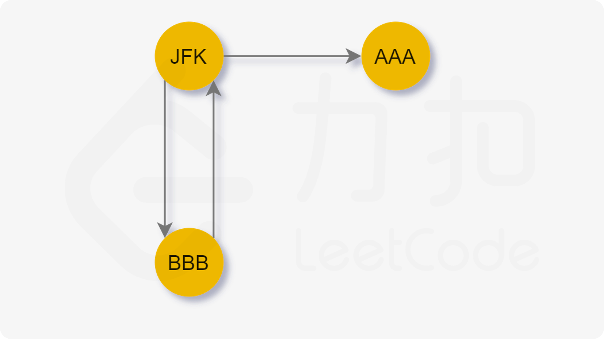
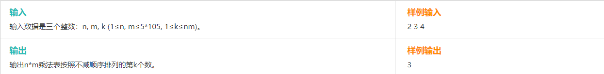

# 图

##  DFS

### 1、机器人的运动范围

> 题目

地上有一个m行和n列的方格。一个机器人从坐标0,0的格子开始移动，每一次只能向左，右，上，下四个方向移动一格，但是不能进入行坐标和列坐标的数位之和大于k的格子。 例如，当k为18时，机器人能够进入方格（35,37），因为3+5+3+7 = 18。但是，它不能进入方格（35,38），因为3+5+3+8 = 19。请问该机器人能够达到多少个格子？


> 思路

注意题目中的移动方式，每次只能移动一格。那么也就是说如果有一次移动中，上下左右四个方向都无法过去，就必须原路返回！

所以就是一道典型的DFS题型。


> 解题特点

DFS中有几个特点

- 记录之前走过的信息（避免重复走）
- 边界明确
- 有一个新格子能否过去的判断条件
- 需要递归


> AC 参考

```python
#coding=utf-8

class Solution:
    def getSum(self, number):
        strNumber = str(number)
        ints = [int(i) for i in list(strNumber)]
        return sum(ints)

    def dfs(self, x, y, threshold, matrix):
        # 1、判断是否越界
        if x<0 or x>=len(matrix) or y<0 or y>=len(matrix[0]):
            return
        
        # 2、在不越界的情况下，判断是否符合条件
        sum_i = self.getSum(x)
        sum_j = self.getSum(y)
        if (sum_i+sum_j>threshold):
            return
        
        # 3、第三个需要返回的是这个点已经visited了
        if matrix[x][y]==1:
            return 
        
        matrix[x][y]=1

        self.dfs(x+1,y,threshold,matrix)
        self.dfs(x,y+1,threshold,matrix)
        self.dfs(x-1,y,threshold,matrix)
        self.dfs(x,y-1,threshold,matrix)


    def movingCount(self, threshold, rows, cols):
        # write code here
        matrix = [[0]*cols for i in range(rows)]
        matrix[0][0]=0
        print(matrix)
        print(matrix[0][1])

        self.dfs(0,0,threshold,matrix)
        print(matrix)
        res=0
        for row in matrix:
            res+=sum(row)
        return res

if __name__ == "__main__":
    res = Solution().movingCount(10, 1, 100)
    print(res)
```

在递归中**先做** `if`不成立的情况，把需要return的情况都列出来后，剩下的就是允许的情况。像这里，有三个不成立的条件，也是一般DFS中常见的三个条件：

- 越界
- 已经访问过了
- 不符合题设的条件

前面两个条件是任务DFS中都存在的，第三个是与题目相关的条件。


### 2、矩阵中路径是否存在


```java
package com.nowcoder.matrix;

import java.util.Arrays;

/**
 * @author Kicc
 * @date 20/7/29 下午 4:02
 */
public class HasPath {

    public boolean hasPath(char[] matrix, int rows, int cols, char[] str)
    {
        // 将一维数组转化成二维矩阵表示
        char[][] myMatrix = switchMatrix(matrix, rows, cols);


        // str 的 下标
        int index = 0;


        int row = 0;
        int col = 0;

        // 出发点可以是矩阵中任意一点
        for (int i = 0; i < rows; i++) {
            for (int j = 0; j < cols; j++) {
                // 每次出发前，都要把index和访问矩阵重置！
                int [][] visited = new int[rows][cols];
                boolean b = goAround(myMatrix, i, j, visited, str, 0);
                if (b) {
                    return true;
                }
            }
        }

        return false;
    }


    /**
     * dfs过程
     * @param matrix 二维矩阵，不变
     * @param row 遍历的横坐标
     * @param col 遍历的纵坐标
     * @param visited 访问矩阵
     * @param str 字符串 不变
     * @param index 当前的字符串下标
     * @return 是否 存在
     */
    private boolean goAround(char[][] matrix, int row, int col, int[][] visited, char[] str, int index){

        int rows = matrix.length;
        int cols = matrix[0].length;
        
        // 1、判断是否越界
        if (row<0 || row>=rows) {
            return false;
        }
        if (col<0 || col>=cols) {
            return false;
        }

        // 2、是否已经访问过
        if (visited[row][col]==1) {
            return false;
        }

        char curr = str[index];
        // 3、是否符合要求
        if (matrix[row][col]!=curr) {
            return false;
        }

        // 三个条件都通过，就算是访问了当前的元素
        visited[row][col] = 1;

        // 4、判断是否到了字符串尾
        if (curr==matrix[row][col] && index==str.length-1){
            return true;
        }

        // 往前走一步
        int thisStep = index+1;

        //上下左右地走
//        System.out.println("向右走");
        boolean b1 =  goAround(matrix, row, col+1, visited, str, thisStep);
//        System.out.println("向下走");
        boolean b2 =  goAround(matrix, row+1, col, visited, str, thisStep);
//        System.out.println("向上走");
        boolean b3 =  goAround(matrix, row-1, col, visited, str, thisStep);
//        System.out.println("向左走");
        boolean b4 =  goAround(matrix, row, col-1, visited, str, thisStep);


        // 只要存在一个路径有就行
        return b1||b2||b3||b4;

    }


    private char[][] switchMatrix(char [] matrix, int rows, int cols) {
        char[][] myMatrix = new char[rows][cols];

        int count = 0;
        int row = 0;
        int col = 0;

        for (char c : matrix) {
            if (count!=0 && count%cols==0) {
                row++;
                col=0;
            }
            myMatrix[row][col] = c;
            col++;
            count++;
        }
        
        
        return myMatrix;
    }
}
```


### 3、克隆图

给你无向 **[连通](https://baike.baidu.com/item/连通图/6460995?fr=aladdin)** 图中一个节点的引用，请你返回该图的 [**深拷贝**](https://baike.baidu.com/item/深拷贝/22785317?fr=aladdin)（克隆）。

图中的每个节点都包含它的值 `val`（`int`） 和其邻居的列表（`list[Node]`）。

```java
class Node {
    public int val;
    public List<Node> neighbors;
}
```


> 分析

这明显是一道遍历的题，DFS的题目就一个核心。记录访问过的点。

这里我们用什么数据结构表示已经访问过的点呢？ ===》  Map<Node, Node> 前面一个Node表示原来图中的Node，后面的Node表示新生成图中的Node。

对于当前的节点 node， 他有 n 个 neighbors， 所以我们遍历 `neighbors`，都执行clone操作。


> 代码

```java
/*
// Definition for a Node.
class Node {
    public int val;
    public List<Node> neighbors;
    
    public Node() {
        val = 0;
        neighbors = new ArrayList<Node>();
    }
    
    public Node(int _val) {
        val = _val;
        neighbors = new ArrayList<Node>();
    }
    
    public Node(int _val, ArrayList<Node> _neighbors) {
        val = _val;
        neighbors = _neighbors;
    }
}
*/

class Solution {

    private Map<Node, Node> map = new HashMap<>();

    public Node cloneGraph(Node node) {
        if (node==null) {
            return node;
        }
		
        // 判断是不是已经存在map中
        // 是的话，就直接返回这个node
        if (map.containsKey(node)) {
            return map.get(node);
        }

        // 创建一个新的node
        Node cloneNode = new Node(node.val, new ArrayList<Node>());
        // 与当前的node关联起来
        map.put(node, cloneNode);

        // 遍历当前node的neighbors
        for (Node neighbor: node.neighbors) {
            cloneNode.neighbors.add(cloneGraph(neighbor));
        }

        return cloneNode;


    }
}
```


### 4、欧拉图的实践

332.重新安排行程

给定一个机票的字符串二维数组 [from, to]，子数组中的两个成员分别表示飞机出发和降落的机场地点，对该行程进行重新规划排序。所有这些机票都属于一个从 JFK（肯尼迪国际机场）出发的先生，所以该行程必须从 JFK 开始。

**说明:**

如果存在多种有效的行程，你可以按字符自然排序返回最小的行程组合。例如，行程 ["JFK", "LGA"] 与 ["JFK", "LGB"] 相比就更小，排序更靠前
所有的机场都用三个大写字母表示（机场代码）。
假定所有机票至少存在一种合理的行程。

**示例 1:**

输入: [["MUC", "LHR"], ["JFK", "MUC"], ["SFO", "SJC"], ["LHR", "SFO"]]
输出: ["JFK", "MUC", "LHR", "SFO", "SJC"]

**示例 2:**

输入: [["JFK","SFO"],["JFK","ATL"],["SFO","ATL"],["ATL","JFK"],["ATL","SFO"]]
输出: ["JFK","ATL","JFK","SFO","ATL","SFO"]
解释: 另一种有效的行程是 ["JFK","SFO","ATL","JFK","ATL","SFO"]。但是它自然排序更大更靠后。

**示例 3：**

输入：[["JFK","KUL"],["JFK","NRT"],["NRT","JFK"]]

输出：["JFK","NRT","JFK","KUL"] 虽然KUL的字母序更小，但是它这条路是死胡同，必须要先走NRT


> 分析

这是欧拉图、欧拉半图的实际应用。

- 欧拉图：通过图中所有边恰好一次且行遍所有顶点的通路称为欧拉通路
- 通过图中所有边恰好一次且行遍所有顶点的回路称为欧拉回路
- 具有欧拉回路的无向图称为欧拉图。
- 具有欧拉通路但不具有欧拉回路的无向图称为半欧拉图



我们把到 AAA的这条路叫做 死胡同，因为无法回来了。


**我们期望的是：**

当我们贪心地选择字典序最小的节点前进时，我们可能先走入「死胡同」，从而导致无法遍历到其他还未访问的边。于是我们希望能够遍历完当前节点所连接的其他节点后再进入「死胡同」。


那么我们如果能将死胡同先加入栈，最后只要倒序一下。就能得到最终的结果了


> 代码


```java
class Solution {
        Map<String, List<String>> map = new HashMap<>();
    List<String> list = new ArrayList<>();
    public List<String> findItinerary(List<List<String>> tickets) {


        for (List<String> ticket : tickets) {
            String from = ticket.get(0);
            String to = ticket.get(1);
            List<String> orDefault = map.getOrDefault(from, new ArrayList<>());
            orDefault.add(to);
            orDefault.sort((s1, s2)->{
                return s1.compareTo(s2);
            });
            map.put(from, orDefault);
        }

        String from = "JFK";
        int size = tickets.size();
        dfs(from);
        Collections.reverse(list);
        return list;
    }

    private void dfs(String curr) {
        // 如果是死胡同，while false, 直接将curr加入栈中
        while (map.containsKey(curr) && map.get(curr).size()>0) {
            String tmp = map.get(curr).get(0);
            map.get(curr).remove(0);
            dfs(tmp);
        }
        list.add(curr);
    }
}
```


**整体逻辑**

1. 由于题目中说必然存在一条有效路径(至少是半欧拉图)，所以算法不需要回溯（既加入到结果集里的元素不需要删除）
2. 整个图最多存在一个死胡同(出度和入度相差1），且这个死胡同一定是最后一个访问到的，否则无法完成一笔画。
3. DFS的调用其实是一个拆边的过程（既每次递归调用删除一条边，所有子递归都返回后，再将当前节点加入结果集保证了结果集的逆序输出），一定是递归到这个死胡同（没有子递归可以调用）后递归函数开始返回。所以死胡同是第一个加入结果集的元素。
4. 最后逆序的输出即可。


### 5、钥匙和房间（841）

有 N 个房间，开始时你位于 0 号房间。每个房间有不同的号码：0，1，2，...，N-1，并且房间里可能有一些钥匙能使你进入下一个房间。

在形式上，对于每个房间 i 都有一个钥匙列表 rooms[i]，每个钥匙 rooms[i][j] 由 [0,1，...，N-1] 中的一个整数表示，其中 N = rooms.length。 钥匙 rooms[i][j] = v 可以打开编号为 v 的房间。

最初，除 0 号房间外的其余所有房间都被锁住。

你可以自由地在房间之间来回走动。

如果能进入每个房间返回 true，否则返回 false。

**示例 1：**

```bash
输入: [[1],[2],[3],[]]
输出: true
解释:  
我们从 0 号房间开始，拿到钥匙 1。
之后我们去 1 号房间，拿到钥匙 2。
然后我们去 2 号房间，拿到钥匙 3。
最后我们去了 3 号房间。
由于我们能够进入每个房间，我们返回 true
```

**示例 2：**

```
输入：[[1,3],[3,0,1],[2],[0]]
输出：false
解释：我们不能进入 2 号房间。
```


> 分析

典型的一道DFS搜索题

从房间0开始，判断是不是可达所有的房间。也就是所有的节点是不是连通的。

注意设置一个  `boolean[] visit;`

因为房间0是一定可以进入的（默认就从这里开始），那么进入到dfs方法中的房间都是已经在访问了。

主体 = 循环 + 递归


> 代码

```java
private Set<Integer> res = new HashSet();
int num ;
boolean[] visit;
public boolean canVisitAllRooms(List<List<Integer>> rooms) {
    int n = rooms.size();
    visit = new boolean[n];
    num=0;
    dfs(rooms, 0);


    return num==n;
}

private void dfs(List<List<Integer>> rooms, int x) {
    visit[x]=true;
    num++;
    for (Integer key : rooms.get(x)) {
        if (visit[key]==false) {
            dfs(rooms, key);
        }
    }
}
```


## BFS

### 1、Dijkstra 算法

> 算法特点

**BFS、有向图\无向图、单源最短、带权重（大于0）**


> 算法思路

是一个贪心策略：包含了一个顶点集合、一个dis数组

- **顶点集合：**确定了源点到其他点的最短路径后，可以把这些确定的点加入集合
- **dis数组**：保存了源点到其他顶点目前情况下的最短路径


> 实例说明


初始状态下：

- 顶点集合：{v1}

- dis数组：

    

可达不可达是要看顶点集合的，刚开始的顶点就只有v1，即便可以看到v4 可以通过 v1-v3-v4到达，但是v3不在集合中，所以无法使用。


**操作：**

寻找dis数组中最小的数：10。加入对应的顶点v3: {v1, v3}。 说明v1到v3的最短路径现在已经确定了。同时更新v3相关的其他顶点的最短路径。


**重复操作：**

寻找dis数组中最小的数：30。加入对应的顶点v5: {v1, v3, v5}。 说明v1到v5的最短路径现在已经确定了。同时更新v5相关的其他顶点的最短路径。


**重复操作：**

寻找dis数组中最小的数：50。加入对应的顶点v5: {v1, v3, v5, v4}。 说明v1到v4的最短路径现在已经确定了。同时更新v4相关的其他顶点的最短路径。


**重复操作：**

寻找dis数组中最小的数：60。加入对应的顶点v5: {v1, v3, v5, v4, v6}。 说明v1到v6的最短路径现在已经确定了。同时更新v6相关的其他顶点的最短路径。


v1-v2不可达。


## 并查集

> 常用的领域

需要按照一定的顺序将属于同一组的元素所在的集合合并，其间要反复查找一个元素在哪个集合中。如果使用普通的数据结构，时间复杂度会非常大。


### 定义

并查集是一种树型的数据结构，用于处理一些不相交[集合](https://baike.baidu.com/item/集合/2908117)（*Disjoint Sets*）的合并及查询问题。常常在使用中以森林来表示。

### 概念

- **合并**（Union）：把两个不相交的集合合并为一个集合
- **查询**（*Find*）：查询两个元素是否在同一个集合中


先明确几个概念
1.集合树：所有节点以代表节点为父节点构成的多叉树
2.节点的代表节点：可以理解为节点的父节点，从当前节点出发，可以向上找到的第一个节点
3.集合的代表节点：可以理解为根节点，意味着该集合内所有节点向上走，最终都能到达的节点
来个图帮助理解


**初始化**

每一个节点都是独立的，自己是自己的代表节点。

我们用一个数组来表示

vector = [0, 1, 2, 3, 4, 5]，设置一个零，用起来比较方便。


**遍历**

[[1,2], [3,4], [3,2], [1,4], [1,5]]

**每次遍历需要达到 vector[idx] = idx 这个状态**

1. 对于第一个[1,2]

    vector[1]  = 1  |  vector[2] = **2**  满足状态

    进行赋值 vector[1] = **2**, vector[2] = **2**

2. 对于第二个[3,4]

    vector[3] = 3  |  vector[4] = **4**   满足状态

    进行赋值 vector[3] = **4**,  vector[4] = **4**

3. 对于第三个[3,2]

    vector[3] = 4  |  vector[2] = **2**   不满足状态

    vector[4] = 4 满足

    进行赋值 vector[4] = **2**,  vector[2] = **2**

4. 对于第四个[1,4]

    vector[1] = 2  |  vector[4] = 2  不 满足状态

    vector[2] = 2  |  vector[4] = 2   不满足

    vector[2] = 2  |  vector[2] = 2  满足 且 指向同一个节点，此时会成环

    **直接返回[1, 4]**

5. 对于第五个[1, 5]

    

### 1、无向图的冗余路径

在本问题中, 树指的是一个连通且无环的无向图。

输入一个图，该图由一个有着N个节点 (节点值不重复1, 2, ..., N) 的树及一条附加的边构成。附加的边的两个顶点包含在1到N中间，这条附加的边不属于树中已存在的边。

结果图是一个以边组成的二维数组。每一个边的元素是一对[u, v] ，满足 u < v，表示连接顶点u 和v的无向图的边。

返回一条可以删去的边，使得结果图是一个有着N个节点的树。如果有多个答案，则返回二维数组中最后出现的边。答案边 [u, v] 应满足相同的格式 u < v。

**示例 1：**

输入: [[1,2], [1,3], [2,3]]
输出: [2,3]
解释: 给定的无向图为:

```
  1
 / \
2 - 3
```

**示例 2：**

输入: [[1,2], [2,3], [3,4], [1,4], [1,5]]
输出: [1,4]
解释: 给定的无向图为:

```
5 - 1 - 2
    |   |
    4 - 3
```


> 分析

并查集的直接应用。

1、初始化vector数组

2、遍历edges，当前两个节点是不是已经在同一集合中？如果是，直接返回

3、因为测试用例说一定存在可以返回的edge，因此最后循环结束后返回null也可以


> 代码

```java
class Solution {
    public int[] findRedundantConnection(int[][] edges) {
        
        int[] vector = new int[1001] ;

        for (int i=0; i<1001; i++) {
            vector[i] = i;
        }

        for (int i=0; i<edges.length; i++) {
            int node1 = edges[i][0] ;
            int node2 = edges[i][1] ;
            int rep1 = find(vector, node1);
            int rep2 = find(vector, node2);
            if (rep1!=rep2) {
                vector[rep1]=rep2;
            } else {
                return edges[i];
            }
        }

        return new int[]{0,0};
    }

    private int find(int[] vec, int index) {
        while (index!=vec[index]) {
            index = vec[index];
        }
        return index;
    }
}
```


### 2、有向图的冗余路径

在本问题中，有根树指满足以下条件的有向图。该树只有一个根节点，所有其他节点都是该根节点的后继。每一个节点只有一个父节点，除了根节点没有父节点。

输入一个有向图，该图由一个有着N个节点 (节点值不重复1, 2, ..., N) 的树及一条附加的边构成。附加的边的两个顶点包含在1到N中间，这条附加的边不属于树中已存在的边。

结果图是一个以边组成的二维数组。 每一个边 的元素是一对 [u, v]，用以表示有向图中连接顶点 u 和顶点 v 的边，其中 u 是 v 的一个父节点。

返回一条能删除的边，使得剩下的图是有N个节点的有根树。若有多个答案，返回最后出现在给定二维数组的答案。

**示例 1:**

输入: [[1,2], [1,3], [2,3]]
输出: [2,3]
解释: 给定的有向图如下:

```
  1
 / \
v   v
2-->3
```

**示例 2:**

输入: [[1,2], [2,3], [3,4], [4,1], [1,5]]
输出: [4,1]
解释: 给定的有向图如下:

```
5 <- 1 -> 2
     ^    |
     |    v
     4 <- 3
```


> 分析

由第一题的无向图变成了有向图。而且题目的意思是，只要删除一条合适的边，整个图就可以变成一棵有根树。

需要考虑的两张情况：（不需要考虑入度大于2的，这个与题设不符合）

1. 有某个节点的入度是2，那么肯定是要去删除与这个节点连接的边。
    1. 如果现在没有用这条边，剩下的节点可以组成一个有根树，那么这条边就是所求的
2. 如果没有一个节点的入度是2，那么就考虑入度是1的节点：而且肯定是一个有向的环图
    1. 我们遍历所有的边，如果删除当前的这条边，剩下的节点可以组成一棵有根树，那么这条边就是所求的


> 代码

```java
package com.nowcoder.unionSet;

import java.util.Arrays;

/**
 * @author Kicc
 * @date 20/9/18 下午 1:36
 * [[1,2], [2,3], [3,4], [4,1], [1,5]]
 */
public class FindRedundantDirectedConnection {

    public static void main(String[] args) {
        int[][] edges = new int[][] {
                {1,2},
                {2,3},
                {3,4},
                {4,1},
                {1,5}
        };
        int[] redundantDirectedConnection = new FindRedundantDirectedConnection().findRedundantDirectedConnection(edges);

        System.out.println(Arrays.toString(redundantDirectedConnection));
    }


    public int[] findRedundantDirectedConnection(int[][] edges) {

        // 1.边的个数
        int number = edges.length+1;


        // 2.计算入度
        int[] inDegrees = new int[number];
        for (int i = 0; i < edges.length; i++) {
            int[] cur = edges[i];
            inDegrees[cur[1]]++;
        }


        // 3.1 尝试删除入度为2的边, 遍历edges
        // 如果剩余的不构成环，说明可以删除这条边
        for (int i = number-2; i >= 0 ; i--) {
            if (inDegrees[edges[i][1]]==2) {
                if (!judgeCircle(edges, i)) {
                    return edges[i];
                }
            }
        }

        // 3.2 尝试删除入度为1的节点
        // 如果没有入度为2的节点，那么肯定是存在环
        // 我们只要找到这个环上的任意一个边（倒序），删除就可以
        for (int i = number-2; i >= 0; i--) {
            if (inDegrees[edges[i][1]]==1) {
                if (!judgeCircle(edges, i)) {
                    return edges[i];
                }
            }
        }


        return new int[]{0,0};

    }

    /**
     * 将 removeEdgeIndex 去掉以后，剩下的有向边是否构成环
     *
     * @param edges
     *  len             结点总数（从 1 开始，因此初始化的时候 + 1）
     * @param removeEdgeIndex 删除的边的下标
     * @return 构成环，返回 true
     */
    private boolean judgeCircle(int[][] edges, int removeEdgeIndex) {
        int len = edges.length;
        UnionSet unionSet = new UnionSet(len+1) ;

        for (int i = 0; i < len; i++) {
            if (i==removeEdgeIndex) {
                // 跳过需要移除的边，就是删除的意思
                continue;
            }

            if (!unionSet.union(edges[i][0], edges[i][1])) {
                // 如果两个节点合并失败，说明在合并之前他们已经连通
                return true;
            }
        }
        // 返回false就说明这是一棵有根树
        return false;
    }
}
```


```java
package com.nowcoder.unionSet;

/**
 * @author Kicc
 * @date 20/9/18 下午 1:25
 */
public class UnionSet {

    int[] parent ;

    public UnionSet(int number) {
        parent = new int[number] ;
        for (int i = 0; i < number; i++) {
            parent[i]=i;
        }
    }


    /**
     * 找x的根节点
     * @param x
     * @return
     */
    private int find(int x) {
        while (x!=parent[x]) {
            x = parent[x] ;
        }

        return x;
    }

    /**
     * 如果合并成功返回 true
     * @param x
     * @param y
     * @return
     */
    public boolean union(int x, int y) {
        int rootX = find(x);
        int rootY = find(y);

        if (rootX!=rootY) {
            parent[rootX] = rootY;
            return true;
        } else {
            return false;
        }
    }

}
```


# 链表

### 1、LRU缓存机制  LinkedHashMap应用

运用你所掌握的数据结构，设计和实现一个  LRU (最近最少使用) 缓存机制。它应该支持以下操作： 获取数据 get 和 写入数据 put 。

获取数据 get(key) - 如果关键字 (key) 存在于缓存中，则获取关键字的值（总是正数），否则返回 -1。
写入数据 put(key, value) - 如果关键字已经存在，则变更其数据值；如果关键字不存在，则插入该组「关键字/值」。当缓存容量达到上限时，它应该在写入新数据之前删除最久未使用的数据值，从而为新的数据值留出空间。

```java
class LRUCache {

    public LRUCache(int capacity) {
    }

    public int get(int key) {

    }

    public void put(int key, int value) {

    }

}
```

> 用例

```java
/* 缓存容量为 2 */
LRUCache cache = new LRUCache(2);
// 你可以把 cache 理解成一个队列
// 假设左边是队头，右边是队尾
// 最近使用的排在队头，久未使用的排在队尾
// 圆括号表示键值对 (key, val)

cache.put(1, 1);
// cache = [(1, 1)]

cache.put(2, 2);
// cache = [(2, 2), (1, 1)]

cache.get(1);       // 返回 1
// cache = [(1, 1), (2, 2)]
// 解释：因为最近访问了键 1，所以提前至队头
// 返回键 1 对应的值 1

cache.put(3, 3);
// cache = [(3, 3), (1, 1)]
// 解释：缓存容量已满，需要删除内容空出位置
// 优先删除久未使用的数据，也就是队尾的数据
// 然后把新的数据插入队头

cache.get(2);       // 返回 -1 (未找到)
// cache = [(3, 3), (1, 1)]
// 解释：cache 中不存在键为 2 的数据

cache.put(1, 4);    
// cache = [(1, 4), (3, 3)]
// 解释：键 1 已存在，把原始值 1 覆盖为 4
// 不要忘了也要将键值对提前到队头
```


> 思路

要求的时间复杂度是O(1)，说明

- cahe必须是有时序的，以区分最近使用和不是最近使用
- 查找不能是链表的查找，应该是数组或者Map的查找
- 因为 get 方法可以改变 cache中元素的时许，所以插入和删除的操作也必须是 O(1)，所以不能是数组

就以上三点，可以得到。这样的一个数据结构：插入删除O(1)、查找O(1)、有时序。

不能是数组，也不能是链表。要有两者的优点。

**LinkedHashMap**


在LinkedList之上加了一个哈希表。查找的速度变快！


> 算法

```java
class LRUCache2 {

    LinkedHashMap<Integer, Integer> map = new LinkedHashMap<Integer, Integer>();
    int cap = 0;

    public LRUCache2(int capacity) {

        this.cap = capacity;
    }

    public int get(int key) {
        // 不存在就返回 -1 
        if (!map.containsKey(key)) {
            return -1;
        }
        // 使用过之后需要标记
        makeRecently(key);

        // 返回元素
        return map.get(key);
    }

    public void put(int key, int value) {
        // 如果存在，就需要修改
        // 但是不能在链表的原处修改，
        // 修改完后的元素是最近使用的
        // 那么可以先删除，再加入
        if (map.containsKey(key)) {
            map.remove(key);
            map.put(key, value);
            // 注意，这里就需要返回了
            // 不要再执行下面的代码
            return;
        }

        // 如果要溢出
        if (cap==map.size()) {
            // 删除第一个
            Integer next = map.keySet().iterator().next();
            map.remove(next);
            // add
            map.put(key, value);
        } else {
            map.put(key, value);
        }


    }

    // 其实就是先删除再加入
    private void makeRecently(int key) {
        Integer val = map.get(key);
        map.remove(key);
        map.put(key, val);
    }
}
```


### 2、合并K个有序链表

合并 k 个排序链表，返回合并后的排序链表。请分析和描述算法的复杂度。

```
输入:
[
  1->4->5,
  1->3->4,
  2->6
]
输出: 1->1->2->3->4->4->5->6
```


> 分析

合并两个有序链表简单。那么k个呢？

第0个和第1个合并，再与第2个合并.....


> 代码

```java
/**
 * Definition for singly-linked list.
 * public class ListNode {
 *     int val;
 *     ListNode next;
 *     ListNode(int x) { val = x; }
 * }
 */
class Solution {
    public ListNode mergeKLists(ListNode[] lists) {
        ListNode node = null;

        for (int i=0; i<lists.length; i++) {
            node = merge2(node, lists[i]);
        }

        return node;

    }

    private ListNode merge2(ListNode a, ListNode b) {

        if (a==null) {
            return b;
        } 
        if (b==null) {
            return a;
        }

        if (a==null && b==null) {
            return null;
        }

        ListNode res = new ListNode(0);
        ListNode node = res;

        while (a!=null && b!=null) {
            if (a.val>b.val) {
                res.next = b;
                b = b.next;
            } else {
                res.next = a;
                a = a.next;
            }
            res = res.next;
        }

        if (a!=null) {
            res.next = a;
        }

        if (b!=null) {
            res.next = b;
        }

        return node.next;
    }
}
```


### 3、链表转二叉树

给定一个单链表，其中的元素按升序排序，将其转换为高度平衡的二叉搜索树。

本题中，一个高度平衡二叉树是指一个二叉树每个节点 的左右两个子树的高度差的绝对值不超过 1。

示例:

给定的有序链表： [-10, -3, 0, 5, 9],

一个可能的答案是：[0, -3, 9, -10, null, 5], 它可以表示下面这个高度平衡二叉搜索树：

    	 	 0
     		/ \
          -3   9
         /   /
       -10  5


> 分析

明显的递归 + 分治。

中间的数是每一颗树的根。 0 是最明显的根。（因为需要做到平衡）

1、转化为数组，通过下标标记方便转化。

2、直接用链表。构造一个辅助函数 寻找middle


> 代码

一、转化为数组

```java
public class List2Tree {

    public static void main(String[] args) {
        int[] nums = new int[]{
                -10, -3, 0, 5, 9
        };
//        ListNode node = ListNode.readArray(nums);
        ListNode node = new ListNode();

        TreeNode treeNode = new List2Tree().sortedListToBST(node);
        System.out.println(treeNode.val);
        System.out.println(treeNode.right.val);
        System.out.println(treeNode.left.val);
    }


    public TreeNode sortedListToBST(ListNode head) {
        TreeNode tree = new TreeNode(-1);
        if (head==null) {
            System.out.println("==null");
            return tree;
        }

        Integer[] integers = ListToArray(head);

        System.out.println(Arrays.toString(integers));
        TreeNode treeNode = arrayToBST(integers, 0, integers.length-1);

        return treeNode;
    }

    private Integer[] ListToArray(ListNode head) {
        List<Integer> list = new ArrayList<>();
        ListNode node = head;
        while(node!=null) {
            list.add(node.val);
            node = node.next;
        }

        Integer[] res = list.stream().toArray(Integer[]::new);
        return res;
    }

    private TreeNode arrayToBST(Integer[] nums, int start, int end) {
        if (start > end) {
            return null;
        }

        int middle = start + (end - start)/2;
        TreeNode cur = new TreeNode(nums[middle]);

        cur.left = arrayToBST(nums, start, middle-1);
        cur.right = arrayToBST(nums, middle+1, end);

        return cur;
    }
}
```


二、直接使用链表

```java

class Solution {
    public TreeNode sortedListToBST(ListNode head) {
        return buildTree(head, null);
    }

    public TreeNode buildTree(ListNode left, ListNode right) {
        if (left == right) {
            return null;
        }
        ListNode mid = getMedian(left, right);
        TreeNode root = new TreeNode(mid.val);
        root.left = buildTree(left, mid);
        root.right = buildTree(mid.next, right);
        return root;
    }

    public ListNode getMedian(ListNode left, ListNode right) {
        ListNode fast = left;
        ListNode slow = left;
        while (fast != right && fast.next != right) {
            fast = fast.next;
            fast = fast.next;
            slow = slow.next;
        }
        return slow;
    }
}

```


### 4、快乐数

编写一个算法来判断一个数 n 是不是快乐数。

「快乐数」定义为：对于一个正整数，每一次将该数替换为它每个位置上的数字的平方和，然后重复这个过程直到这个数变为 1，也可能是 无限循环 但始终变不到 1。如果 可以变为  1，那么这个数就是快乐数。

如果 n 是快乐数就返回 True ；不是，则返回 False 。

**示例：**

```
输入：19
输出：true
解释：
12 + 92 = 82
82 + 22 = 68
62 + 82 = 100
12 + 02 + 02 = 1
```


> 分析

当前的数字和下一个数字可以用一个函数联系起来。每一个数字依次连接起来，就很像是一个链表。

然后我们使用快慢指针，判断是不是会有环。


> 代码

```python
class Solution:
    def isHappy(self, n: int) -> bool:
        def getNext(number):
            total = 0
            while number>0:
                number, digit = divmod(number, 10)
                total += digit**2
            return total

        slow = n
        fast = getNext(n)
		# 这里使用的是 and 不是 or
        while fast!=1 and fast!=slow:
            slow = getNext(slow)
            fast = getNext(getNext(fast))
        
        return fast==1
```


### 5、寻找重复数

给定一个包含 n + 1 个整数的数组 nums，其数字都在 1 到 n 之间（包括 1 和 n），可知至少存在一个重复的整数。假设只有一个重复的整数，找出这个重复的数。

**示例 1:**

```
输入: [1,3,4,2,2]
输出: 2
```

**示例 2:**

```
输入: [3,1,3,4,2]
输出: 3
```


说明：

1. 不能更改原数组（假设数组是只读的）。
2. 只能使用额外的 O(1) 的空间。
3. 时间复杂度小于 O(n2) 。
4. 数组中只有一个重复的数字，但它可能不止重复出现一次。


> 分析

莉莉丝游戏的后台笔试题。Leetcode 287题。

这里的解法是用快慢指针，将题目转换成一个寻找链表环入口的问题。

为什么这里会有一个环呢？


对于这个么一个数组，我们可以看成是 0->1->4->6->3->....不断有 index和value连接的链表结构。

因为存在重复的数字，那么这个链表结构肯定存在环。所以问题就可以自然的转化为寻找环的入口。

只是之前的链表是依次往下遍历，现在是使用index来寻找。


> 代码

```java
class Solution {
    public int findDuplicate(int[] nums) {
        int fast = 0;
        int slow = 0;
		
        // 让快慢指针第一次相遇
        do {
            fast = nums[nums[fast]];
            slow = nums[slow];
        } while (fast!=slow);

        // 第二次相遇必然是在入口
        slow = 0;
        while (slow!=fast) {
            fast = nums[fast];
            slow = nums[slow];
        }

        return slow;
    }
}
```


### 6、复杂链表的复制 offer35

请实现 copyRandomList 函数，复制一个复杂链表。在复杂链表中，每个节点除了有一个 next 指针指向下一个节点，还有一个 random 指针指向链表中的任意节点或者 null。

**示例 1：**


输入：head = [[7,null],[13,0],[11,4],[10,2],[1,0]]
输出：[[7,null],[13,0],[11,4],[10,2],[1,0]]


> 分析

可以用常规的迭代方式，遍历到最后一个节点。

由于涉及到next和random两个量，用递归的方式做更加方便


```java
// 代码主体
Node copy = new Node(cur.val);

copy.next = dfs(cur.next);
copy.random = dfs(cur.random);

return copy;
```


> 代码

```java
/*
// Definition for a Node.
class Node {
    int val;
    Node next;
    Node random;

    public Node(int val) {
        this.val = val;
        this.next = null;
        this.random = null;
    }
}
*/
class Solution {
	private HashMap<Node, Node> map = new HashMap<>();
    public Node copyRandomList(Node head) {
        if (head==null) {
            return null;
        }
        
		Node res = dfs(head);
        
        return res;
    }
    
    
    private Node dfs(Node cur) {
        if (cur==null) {
            return null;
        }
        
        if (map.containsKey(cur)) {
            return map.get(cur);
        }
        
        Node copy = new Node(cur.val);
        
        // 别忘记加载map
        map.put(node, copy);
        
        copy.next = dfs(cur.next);
        copy.random = dfs(cur.random);
        
        
        return copy;
    }
}
```


# 二叉树


### 补充：红黑树

> 定义

二叉查找树，每一个节点增加一个存储位表示节点的颜色。通过几个约束保证红黑树中的任意一条有根到叶子节点的路径不会超过另一条路径的2倍。由此达到一种平衡。

因为红黑树设计出来的目的是用来加快二叉查找树的查找速度，而减少树的深度是一种减少查找次数非常有效的方式，跟数据库中的B+树类似的思想。


> 为什么要有红黑树，查找树不行吗？

二叉的查找树在插入的元素比较特殊的情况下会退化成一个链表或者近似链表的结构。这样的结构查询效率很低。


> 五个性质  保证  树的高度始终是  logN

1、结点是红色或者黑色

2、不能出现连续的两个红色节点

3、根节点是黑色的

4、每一个叶子节点都是黑色的null节点

5、对于任意一个节点而言，其到NULl节点的每一条路径所包含的黑色节点个数一致


> 旋转

- 左旋
- 右旋

在插入和删除节点的过程中，很有可能会破坏红黑树的几个性质，因此需要通过树的旋转或者节点颜色的变化来达到平衡。


> 与BST和AVL树的区别

- 红黑树是牺牲了严格的高度平衡的优越条件为代价，它只要求部分地达到平衡要求，降低了对旋转的要求，从而提高了性能。
- 红黑树能够以O(log2 n)的时间复杂度进行搜索、插入、删除操作。此外，由于它的设计，任何不平衡都会在三次旋转之内解决
- 相比于BST，因为红黑树可以能确保树的最长路径不大于两倍的最短路径的长度，所以可以看出它的查找效果是有最低保证的。
- 最坏的情况下也可以保证O(logN)的，这是要好于二叉查找树的。因为二叉查找树最坏情况可以让查找达到O(N)。
- 红黑树的算法时间复杂度和**AVL相同**，但统计性能比AVL树更高，所以在插入和删除中所做的后期维护操作肯定会比红黑树要耗时好多
- 但是他们的查找效率都是O(logN)，所以红黑树应用还是高于AVL树的.


### 1、二叉查找树 第k小元素

给定一个二叉搜索树，编写一个函数 `kthSmallest` 来查找其中第 **k** 个最小的元素。

**说明：**
你可以假设 k 总是有效的，1 ≤ k ≤ 二叉搜索树元素个数。

**示例 1:**

```
输入: root = [3,1,4,null,2], k = 1
   3
  / \
 1   4
  \
   2
输出: 1
```

示例 2:

```
输入: root = [5,3,6,2,4,null,null,1], k = 3
       5
      / \
     3   6
    / \
   2   4
  /
 1
输出: 3
```


> 分析

**哪个节点是最小的？第二小的是哪个？**

- 最左端的节点永远是最小值
- 第二小的值肯定是最小值的父节点
- 如果父节点有右子树的话：
    - 第三小的值是右子树的最左节点
    - 
- 如果父节点没有右子树的话：
    - 第三小的值是父父节点
    - 


按照这个思路：

1. 初始化一个Stack
2. 如果当前节点存在，进栈。 curr= curr.left
3. 重复第二步，直到当前节点==null
4. 取出栈顶元素，是否是最小第k个  (--k==0) return node
    1. 如果是，输出
    2. 如果不是，什么都不做
5. 另当前元素为栈顶元素的右子树。 curr = node.right


> 代码 

```java
public class KthNode1 {

    TreeNode KthNode(TreeNode pRoot, int k)
    {
        TreeNode node = null;
        if (pRoot==null || k==0) {
            return null;
        }
        Deque<TreeNode> treeNodes = new ArrayDeque<>();
        TreeNode curr = pRoot;

        // 只要栈和树有一个不是空的 (重要)
        while (!treeNodes.isEmpty() || curr!=null) {
            // 一直插入左子树
            while (curr!=null) {
                treeNodes.push(curr);
                curr = curr.left;
            }
            // 取出栈顶元素
            node = treeNodes.pop();
            if ((--k)==0) {
                return node;
            }
            // 当前元素为栈顶的右子树 （如果是null，下次循环会再取栈顶元素）
            curr = node.right;
        }

        return null;
    }
}
```


> 核心考察点：1、递归；2、栈结构的使用


### 2、最近公共祖先


> 思路

我们可以用**哈希表**存储所有节点的父节点，然后我们就可以利用节点的父节点信息从 p 结点开始不断**往上跳**，并记录已经访问过的节点，再从 q 节点开始不断往上跳，如果碰到已经访问过的节点，那么这个节点就是我们要找的最近公共祖先。

> 算法

从根节点开始遍历整棵二叉树，用哈希表记录每个节点的父节点指针。
从 p 节点开始不断往它的祖先移动，并用数据结构记录已经访问过的祖先节点。
同样，我们再从 q 节点开始不断往它的祖先移动，如果有祖先已经被访问过，即意味着这是 p 和 q 的深度最深的公共祖先，即 LCA 节点。

```java
public class LowestCommonAncestor {

    // 子树 => 父节点
    private Map<Integer, TreeNode> fatherMap = new HashMap<>();
    // 向上保存p\q 开始的父节点
    private Set<Integer> parents = new HashSet<>();

    public TreeNode lowestCommonAncestor(TreeNode root, TreeNode p, TreeNode q) {
        fatherMap.put(root.val, null);
        dfs(root);
        while (p!=null) {
            parents.add(p.val);
            p = fatherMap.get(p);
        }
        while (q!=null) {
            if (parents.contains(q.val)) {
                return q;
            }
            q = fatherMap.get(q.val);
        }
        return null;
    }


    // 完成整棵树的自底向上
    public void dfs(TreeNode node) {
        if (node.left!=null) {
            fatherMap.put(node.left.val, node);
            dfs(node.left);
        }
        if (node.right!=null) {
            fatherMap.put(node.right.val, node);
            dfs(node.right);
        }
    }
}
```


**解法2** （递归）

```kotlin
class Solution {
    public TreeNode lowestCommonAncestor(TreeNode root, TreeNode p, TreeNode q) {
       // 如果树为空，直接返回null
        if(root == null) return null; 
        // 如果 p和q中有等于 root的，那么它们的最近公共祖先即为root（一个节点也可以是它自己的祖先）
        if(root == p || root == q) return root; 
        // 递归遍历左子树，只要在左子树中找到了p或q，则先找到谁就返回谁
        TreeNode left = lowestCommonAncestor(root.left, p, q); 
        // 递归遍历右子树，只要在右子树中找到了p或q，则先找到谁就返回谁
        TreeNode right = lowestCommonAncestor(root.right, p, q); 
        // 如果在左子树中 p和 q都找不到，则 p和 q一定都在右子树中，右子树中先遍历到的那个就是最近公共祖先（一个节点也可以是它自己的祖先）
        if(left == null) return right; 
        // 否则，如果 left不为空，在左子树中有找到节点（p或q），这时候要再判断一下右子树中的情况，如果在右子树中，p和q都找不到，则 p和q一定都在左子树中，左子树中先遍历到的那个就是最近公共祖先（一个节点也可以是它自己的祖先）
        else if(right == null) return left; 
        //否则，当 left和 right均不为空时，说明 p、q节点分别在 root异侧, 最近公共祖先即为 root
        else return root; 
    }
}
```


### 2.1 二叉搜索树的最近公共祖先

与原题的变化是 将普通的二叉树  ==> 二叉搜索树，题目是变得更简单了。

可以直接用迭代的方式寻找祖先。

```java
class Solution {
    public TreeNode lowestCommonAncestor(TreeNode root, TreeNode p, TreeNode q) {
        while(root != null) {
            if(root.val < p.val && root.val < q.val) // p,q 都在 root 的右子树中
                root = root.right; // 遍历至右子节点
            else if(root.val > p.val && root.val > q.val) // p,q 都在 root 的左子树中
                root = root.left; // 遍历至左子节点
            else break;
        }
        return root;
    }
}
```


### 3、二叉树原地展开为链表

给定一个二叉树，[原地](https://baike.baidu.com/item/原地算法/8010757)将它展开为一个单链表。


> 思路

根据图可知，是以前序遍历的方式展开的。又因为题设中要求必须是原地展开，也就是 root 不变。那么使用 额外的Arraylist存储前序遍历的 方法就不可行。

可以比较容易地看出，节点5放到了4的后面。4是root节点左子树的最右边的节点，而5是root节点右子树的第一个节点。

对于任何一个节点node而言，都有这么一个规律：

node 左子树中的最右边节点 是 node右子树第一个节点的前驱节点。

因此，我们只要对于当前节点 curr

- 找到左子树中的最后节点 pre
- pre.right = curr.right
- pre.right = pre.left
- pre.left = null

最后 curr = curr.right


> 算法

```java
public void flatten(TreeNode root) {
    TreeNode curr = root;

    while (curr!=null) {
        if (curr.left!=null) {
            TreeNode next = curr.left;
            TreeNode pre = next;
            // 当前节点左子树的最右节点为pre
            while (pre.right!=null) {
                pre = pre.right;
            }
            // 把当前节点的右子树放到pre的右子树
            pre.right = curr.right;
            // 把curr的左子树放到右子树上
            curr.right = curr.left;
            // 左子树设置为空
            curr.left = null;
        }


        curr = curr.right;
    }
}
```


### *4、在相邻的节点无法同时取的情况下，求二叉树的最大和 

在上次打劫完一条街道之后和一圈房屋后，小偷又发现了一个新的可行窃的地区。这个地区只有一个入口，我们称之为“根”。 除了“根”之外，每栋房子有且只有一个“父“房子与之相连。一番侦察之后，聪明的小偷意识到“这个地方的所有房屋的排列类似于一棵二叉树”。 如果两个直接相连的房子在同一天晚上被打劫，房屋将自动报警。

计算在不触动警报的情况下，小偷一晚能够盗取的最高金额。


> 我的思路

如果父节点已经选了，那么子节点就不选，孙子节点就能选。隔一层选取。最终根据root节点的选择与否，输出最大值。

> 分析

**我的思路**存在一个问题，当父节点选取之后，子节点确实无法选择；但是父节点不选，并不意味着子节点必须选取。而是在 ==【选】 与 【不选】 中取最大值==。

> 正确做法

我们可以用 f(o) 表示选择 o 节点的情况下，o 节点的子树上被选择的节点的最大权值和；g(o) 表示不选择 o 节点的情况下，o 节点的子树上被选择的节点的最大权值和；l 和 r 代表 o 的左右孩子。

- 当 o 被选中时，o 的左右孩子都不能被选中，故 o 被选中情况下子树上被选中点的最大权值和为 l 和 r 不被选中的最大权值和相加，即 f(o) = g(l) + g(r)。
- 当 o 不被选中时，o 的左右孩子可以被选中，也可以不被选中。对于 o 的某个具体的孩子 x，它对 o 的贡献是 x 被选中和不被选中情况下权值和的较大值。


最终的实现可以借助HashMap<TreeNode, Integer>，表示node节点的最大值。

因为一个节点的最大值是根据后续节点的值推算出来的，因此我们需要使用==后序遍历==。

> 代码

```java
package com.nowcoder.tree;

import com.nowcoder.util.BinaryTree;
import com.nowcoder.util.TreeNode;

import java.util.HashMap;
import java.util.Map;

/**
 * @author Kicc
 * @date 20/8/5 上午 10:13
 * 在上次打劫完一条街道之后和一圈房屋后，小偷又发现了一个新的可行窃的地区。这个地区只有一个入口，
 * 我们称之为“根”。 除了“根”之外，每栋房子有且只有一个“父“房子与之相连。
 * 一番侦察之后，聪明的小偷意识到“这个地方的所有房屋的排列类似于一棵二叉树”。
 * 如果两个直接相连的房子在同一天晚上被打劫，房屋将自动报警。
 *
 * 计算在不触动警报的情况下，小偷一晚能够盗取的最高金额。
 *
 * 来源：力扣（LeetCode）
 * 链接：https://leetcode-cn.com/problems/house-robber-iii
 * 著作权归领扣网络所有。商业转载请联系官方授权，非商业转载请注明出处。
 */
public class Rob {

    public static void main(String[] args) {
//        int[] nums = new int[]{3,4,5,1,3,-1,1};
        int[] nums = new int[]{3,2,3,-1,3,-1,1};
        BinaryTree tree = new BinaryTree(nums);
        int rob = new Rob().rob(tree.getRoot());
        System.out.println(rob);
    }

    // f表示选择了当前节点
    private Map<TreeNode, Integer> f = new HashMap<TreeNode, Integer>();
    // g表示没有选择当前节点
    private Map<TreeNode, Integer> g = new HashMap<TreeNode, Integer>();


    public int rob(TreeNode root) {
        dfs(root);
        int max = Math.max(f.getOrDefault(root, 0), g.getOrDefault(root, 0));
        return max;

    }

    private void dfs(TreeNode node) {
        if (node==null) {
            return;
        }

        // 后序遍历
        dfs(node.left);
        dfs(node.right);
		
        
        // 左右子树是独立计算的
        f.put(node, node.val + g.getOrDefault(node.left,0)+g.getOrDefault(node.right,0));
        g.put(node, Math.max(f.getOrDefault(node.left, 0), g.getOrDefault(node.left, 0))
                + Math.max(f.getOrDefault(node.right, 0), g.getOrDefault(node.right, 0)));

    }

}
```


### 5、验证二叉树的前序序列化


> 分析

假设有槽点这个概念：一个坑位

一个非空的节点可以 创造两个两个 子节点的位置。一个 # 节点不能创建 子节点的位置，每一个节点都消耗一个节点的剩余。


> 代码

```java
public boolean isValidSerialization(String preorder) {
    int slot = 0;
    String[] chars = preorder.split(",");
    if (chars.length==0) {
        return false;
    } else {
        if (chars[0].equals("#")) {
            slot = 0;
        } else {
            slot = 2;
        }
    }

    for (int i = 0; i < chars.length; i++) {
        if (i==0) {
            continue;
        }

        if (slot<0) {
            return false;
        }

        if (chars[i].equals("#")) {
            slot--;
        } else {
            slot++;
        }

    }

    if (slot==0) {
        return true;
    }

    return false;
}
```


### 6、二叉树的子结构判断 

> 先序 + 判断子结构

输入两棵二叉树A和B，判断B是不是A的子结构。(约定空树不是任意一个树的子结构)

B是A的子结构， 即 A中有出现和B相同的结构和节点值。


> 分析

- 因为子结构可以是二叉树中任意一个节点开始的，所以我们必须要遍历每一个结点。那么我们可以使用先序遍历。用 `isSubStructure(A, B)`方法表示
- 对于A中的任意一个节点来说，我们判断以当前根节点的子树是不是包含了B，对应的是 `judge(A,B)`


对于 `judge(A,B)` 来说：

-  如果B为空，说明齐活了。是一个子结构  ==》true
- 如果A为空，说明不是子结构 （B还不为空  ==》false
- 如果 `A.val!=B.val`，说明这个节点为根的话是不行的  ==》 false
- 如果 `A.val==B.val`，说明这个节点为根可以，递归执行 `judge(A.left,B.left) && judge(A,right, B.right)`


对于`isSubStructure(A, B) `来说：

- 判断root是不是 judge中要求的根节点
- 判断`root.left`是不是符合子结构
- 判断`root.right`是不是符合子结构


> 代码

```java
class Solution {
    public boolean isSubStructure(TreeNode A, TreeNode B) {
        if (A==null ||B==null) {
            return false;
        }
		
        // 前序遍历
        return judge(A, B) || isSubStructure(A.left, B) || isSubStructure(A.right, B);

    }

    private boolean judge(TreeNode tree1, TreeNode tree2) {
        if (tree2==null) {
            return true;
        }

        if (tree1==null) {
            return false;
        }

        if (tree1.val!=tree2.val) {
            return false;
        } else {

        // 说明val相等
            return judge(tree1.left, tree2.left) && judge(tree1.right, tree2.right);
        }

    }
}
```


### 7、二叉树的子树判断 (isSameTree)

给定两个非空二叉树 s 和 t，检验 s 中是否包含和 t 具有相同结构和节点值的子树。s 的一个子树包括 s 的一个节点和这个节点的所有子孙。s 也可以看做它自身的一棵子树。


> 分析

当两棵树相等的时候，也符合子树的要求。因此我们按照这个思路构建辅助函数 `isSameTree(A, B)`

```java
private boolean isSameTree(TreeNode tree1, TreeNode tree2) {
    if (tree2==null && tree1==null) {
        return true;
    }

    if (tree1==null || tree2==null) {
        return false;
    }

    if (tree1.val!=tree2.val) {
        return false;
    } else {

        // 说明val相等
        return judge(tree1.left, tree2.left) && judge(tree1.right, tree2.right);
    }

}
```


在主函数里，我们为A树的每一个节点都去测试 是不是跟B一样

**注意**：当s为空的时候，说明不行了。

```java
public boolean isSubtree(TreeNode s, TreeNode t) {
    if (s==null) {
        return false;
    }

    return isSubtree(s.left, t) || isSubtree(s.right, t) || isSameTree(s, t);
}
```


### 8、二叉树的最小深度

给定一个二叉树，找出其最小深度。

最小深度是从根节点到最近叶子节点的最短路径上的节点数量。

**说明:** 叶子节点是指没有子节点的节点。


> 分析

我自己的想法很简单：直接递归求最小深度。但是容易忽视 [1,2, null, 3]这种情形，答案应该是3，而不是1.

很多人写出的代码都不符合 1,2 这个测试用例，是因为没搞清楚题意

题目中说明:叶子节点是指没有子节点的节点，这句话的意思是 1 不是叶子节点

题目问的是到叶子节点的最短距离，所以所有返回结果为 1 当然不是这个结果

另外这道题的关键是搞清楚递归结束条件


- 叶子节点的定义是左孩子和右孩子都为 null 时叫做叶子节点  

- 当 root 节点左右孩子都为空时，返回 1
- 当 root 节点左右孩子有一个为空时，返回不为空的孩子节点的深度
- 当 root 节点左右孩子都不为空时，返回左右孩子较小深度的节点值 


> 代码

```java
class Solution {
    public int minDepth(TreeNode root) {
        if(root == null) return 0;
        //这道题递归条件里分为三种情况
        //1.左孩子和有孩子都为空的情况，说明到达了叶子节点，直接返回1即可
        if(root.left == null && root.right == null) return 1;
        //2.如果左孩子和由孩子其中一个为空，那么需要返回比较大的那个孩子的深度        
        int m1 = minDepth(root.left);
        int m2 = minDepth(root.right);
        //这里其中一个节点为空，说明m1和m2有一个必然为0，所以可以返回m1 + m2 + 1;
        if(root.left == null || root.right == null) return m1 + m2 + 1;
        
        //3.最后一种情况，也就是左右孩子都不为空，返回最小深度+1即可
        return Math.min(m1,m2) + 1; 
    }
}
```


### 9、二叉树的层平均值

给定一个非空二叉树, 返回一个由每层节点平均值组成的数组。


> 分析

一开始想用层次遍历，标记每一个层的最后一个节点。但是这种数据结构不好设计。

其实用List

​    List<Integer> counts = new ArrayList<>();

​    List<Double> sums = new ArrayList<>();

一个用来保存某一层的节点个数、一个用来保存某一层的节点sum。


> 代码

```java
/**
 * Definition for a binary tree node.
 * public class TreeNode {
 *     int val;
 *     TreeNode left;
 *     TreeNode right;
 *     TreeNode(int x) { val = x; }
 * }
 */
class Solution {
    public List<Double> averageOfLevels(TreeNode root) {
        List<Integer> counts = new ArrayList<>();
        List<Double> sums = new ArrayList<>();
        dfs(root, 0, counts, sums);
        List<Double> averages = new ArrayList<>();

        for (int i=0; i<counts.size(); i++) {
            averages.add(sums.get(i) *1.0 / counts.get(i));
        }


        return averages;

    }


    private void dfs(TreeNode node, int level, List<Integer> counts, List<Double> sums) {
        if (node==null) {
            return;
        }

        // 关键判断 （counts.get(0) 就代表第0层）
        if (level>=counts.size()) {
            sums.add(node.val*1.0);
            counts.add(1);
        } else {
            sums.set(level, sums.get(level)+node.val);
            counts.set(level, counts.get(level)+1);
        }

        dfs(node.left, level+1, counts, sums);
        dfs(node.right, level+1, counts, sums);
    }
}
```


### 10、迭代完成中序遍历

与递归不同的是，迭代方法来实现中序遍历是需要显式地维护一下栈。而递归是把栈隐藏在调用中。

> 代码

```java
class Solution {
    public List<Integer> inorderTraversal(TreeNode root) {
        List<Integer> res = new ArrayList<Integer>();
        Deque<TreeNode> stk = new LinkedList<TreeNode>();
        while (root != null || !stk.isEmpty()) {
            while (root != null) {
                // 关键点1：不断添加左子树
                stk.push(root);
                root = root.left;
            }
            // 2.弹出顶
            root = stk.pop();
            res.add(root.val);
            // 复制为右子树
            root = root.right;
        }
        return res;
    }
}
```


### 11、层次遍历，每层单独输出 offer 32

从上到下按层打印二叉树，同一层的节点按从左到右的顺序打印，每一层打印到一行。

 

例如:
给定二叉树: [3,9,20,null,null,15,7],

    	3
       / \
      9  20
        /  \
       15   7

返回其层次遍历结果：

```
[
  [3],
  [9,20],
  [15,7]
]
```


函数签名：

```java
public List<List<Integer>> levelOrder(TreeNode root)
```


> 分析

与直接的层次遍历相比，增加了一个逐层输出的条件。同样用队列做。用一个for循环将同一层的节点的输出。

```java
// i 是当前的这个queue大小，这样一开始只有根节点的时候，size=1
// 根节点结束之后，把第二层加入，queue的size是第二层的节点数量。
for (int i=queue.size(); i>0; i--)
```

其他部分的代码没有什么变化


> 代码

```java
class Solution {
    public List<List<Integer>> levelOrder(TreeNode root) {
        List<List<Integer>> list = new ArrayList<>();
        if (root==null) {
            return list;
        }
        Queue<TreeNode> queue = new LinkedList<>();
        queue.offer(root);

        while (!queue.isEmpty()) {
            List<Integer> temp = new ArrayList<>();

            for (int i=queue.size(); i>0; i--) {
                TreeNode node = queue.poll();

                temp.add(node.val) ;
                if (node.left!=null) {
                    queue.offer(node.left) ;
                }

                if (node.right!=null) {
                    queue.offer(node.right);
                }
            }
            list.add(temp);
        }
        return list;
    }
}
```


### 12、监控二叉树

给定一个二叉树，我们在树的节点上安装摄像头。

节点上的每个摄影头都可以监视**其父对象、自身及其直接子对象。**

计算监控树的所有节点所需的最小摄像头数量。

**示例 1：**


```
输入：[0,0,null,0,0]
输出：1
解释：如图所示，一台摄像头足以监控所有节点。
```


> 分析

想用矩阵的dfs来做，从根节点出发。遍历所有的节点，遍历过的结果设置为visited，遍历到当前节点后，将最多可能的四个节点都设置为监控到了。

如果遇到一个没监控过的，sum+=1

最终需要判断一下 `dfs(root) 和 dfs(root.left)+dfs(root.right)` 哪个小

基于这个思路有代码1。

相同的测试用例【执行代码】输出正确，【提交】输出不对。挺奇怪的。

> 代码1

```java
/**
 * Definition for a binary tree node.
 * public class TreeNode {
 *     int val;
 *     TreeNode left;
 *     TreeNode right;
 *     TreeNode(int x) { val = x; }
 * }
 */
class Solution {
    private static int sum = 0;
    public int minCameraCover(TreeNode root) {
        if (root==null) {
            return 0;
        }

        // 特殊情况的处理
        if (root.left==null && root.right==null) {
            return 1;
        }

        int number = numberOfNode(root);

        if (number<=3) {
            return 1;
        }
        
        int a = 0;
        int b = 0;
        int c = 0;
        TreeNode root1 = clone(root);
        TreeNode root2 = clone(root);
        

        dfs(root);
        a = sum;
        // System.out.println(sum);
        
        
        sum = 0;
        if (root1.left!=null) {
            dfs(root1.left);
            // System.out.println(sum);
            b = sum;
        }

        sum = 0;
        if (root2.right!=null) {
            dfs(root2.right);
            c = sum;
        }
        
        // System.out.println(a +" " + b + " " + c);
        int x = b+c;

        return Math.min(a, x);
    }

    private void dfs(TreeNode node) {
        if (node==null) {
            return;
        }

        if (node.val==-1) {
            // 直接递归
            dfs(node.left);
            dfs(node.right);
        } else {
            // 处理完之后，再递归
            sum+=1;
            if (node.left!=null) {
                node.left.val=-1;
            }
            if (node.right!=null) {
                node.right.val=-1;
            }
            node.val=-1;

            dfs(node.left);
            dfs(node.right);
        }
    }


    private TreeNode clone(TreeNode root) {
        if (root==null) {
            return null;
        }

        TreeNode node = new TreeNode(root.val);
        node.left = clone(root.left);
        node.right = clone(root.right);

        return node;
    }

    private int numberOfNode(TreeNode node) {
        if (node==null) {
            return 0;
        }
        return 1+numberOfNode(node.left)+numberOfNode(node.right);
    }
}

```


> AC的解析

除根节点外，每一个节点都是父节点的子节点，所以：
1、根节点没有父节点，要考虑自己
2、非根节点只考虑子节点即可，因为自己会被作为父节点的子节点被考虑到


那么一个节点可能的状态就只有三种：(用0 1 2 表示)

- 0：没有拍别人也没有被人拍，但是我需要被覆盖，所有需要被拍
- 1：被拍了
- 2：拍别人

**当一个节点的左右子树是**

0：那么当前节点需要增设一个摄像头，返回2；

2：那么子树已经拍了别人，我是被子树拍到了，所以我不需要拍，返回1；

1：子树被拍了，说明不是子树去拍别人，那么我是需要被拍的


最终判断根节点，如果根节点的左右子树是1，那么根节点就需要增设一个监控


> 代码


```java
/**
 * Definition for a binary tree node.
 * public class TreeNode {
 *     int val;
 *     TreeNode left;
 *     TreeNode right;
 *     TreeNode(int x) { val = x; }
 * }
 */
class Solution {
    private int sum = 0;
    public int minCameraCover(TreeNode root) {
        if (dfs(root)==0) {
            // 需要被人拍
            sum++;
        }
        return sum;
    }

    public int dfs(TreeNode node) {
        if (node==null) {
            return 1;
        }

        int leftState = dfs(node.left) ;
        int rightState = dfs(node.right) ;

        if (leftState==0 || rightState==0) {
            sum++; // 加一个摄像头
            return 2; // 拍别人
        } else if (leftState==2 || rightState==2) {
            // 左右都被拍了,不是主动拍
            // 所有当前需要被人拍
            return 1;
        } else {
            // 子树可以拍别人
            // 需要父节点被拍了
            return 0;
        }

    }
}
```


### 13、二叉搜索树=>双向链表

输入一棵二叉搜索树，将该二叉搜索树转换成一个排序的循环双向链表。要求不能创建任何新的节点，只能调整树中节点指针的指向。

 


> 分析

因为是二叉搜索树，所以肯定是要用到中序遍历。保证有序的序列。

那么怎么把前后的节点联系起来呢。原本的二叉树，只有父节点指向子节点。现在需要让子节点也指向父节点，那么我们需要设置一个pre节点。通过这个节点来完成子节点到父节点的指向。

代码的整体骨架如下：

```java
void dfs(Node node) {
    if (node==null) {
        return;
    }
    // 中序
    dfs(node.left);
    
    // 中间逻辑填充
    
    dfs(node.right);
}
```

接下来就是考虑对于当前节点node，如何编写逻辑。

由于一开始pre节点没有初始化，如果我们遇到了最左端的节点，此时的pre是null，而除了这个节点外，pre就不为null了。所以

```java
if (pre!=null) {
    // 不是第一次遇到
} else {
    // 第一次遇到
}
```

pre的含义是指当前node的上一个node，所以不是第一次遇到的话，pre.right = node; 第一次的话，我们再定义一个变量head=node

同时每一次使 node.left = pre; 保证 双向的连接

最后pre = node，类似于链表的后移


> 代码

```java
class Solution {
    Node pre;
    Node head;
    public Node treeToDoublyList(Node root) {
        if (root==null) {
            return null;
        }
        
        dfs(root);
        // dfs之后的pre指向最后一个节点
        head.left = pre;
        pre.right = head;
        
        return head;
    }
    
    private void dfs(Node node) {
        if (node==null) {
            return;
        }
        dfs(node.left);
        if (pre!=null) {
            pre.right = node;
        } else {
            head = node;
        }
        
        node.left = pre;
        pre = node;
            
        dfs(node.right);
    }
}
```


### 14、填充每个节点的下一个右侧节点指针


每一层有一个从左向右的链表。

**进阶：**

- 你只能使用常量级额外空间。
- 使用递归解题也符合要求，本题中递归程序占用的栈空间不算做额外的空间复杂度。


> 分析

第一想法是使用层次遍历，把每一层都连接起来。这个符合 题目的要求，但是不符合**进阶**的要求。


> 层次遍历代码


```java
/*
// Definition for a Node.
class Node {
    public int val;
    public Node left;
    public Node right;
    public Node next;

    public Node() {}
    
    public Node(int _val) {
        val = _val;
    }

    public Node(int _val, Node _left, Node _right, Node _next) {
        val = _val;
        left = _left;
        right = _right;
        next = _next;
    }
};
*/

class Solution {
    public Node connect(Node root) {
        if (root==null) {
            return null;
        }
        Queue<Node> queue = new LinkedList<>();
        queue.offer(root);
        while (!queue.isEmpty()) {
            int size = queue.size();
            Node head = queue.peek();
            for (int i=size; i>0; i--) {
                if (i==size) {
                    queue.poll();
                    if (head.left!=null) {
                        queue.offer(head.left);
                    }

                    if (head.right!=null) {
                        queue.offer(head.right);
                    }
                    continue;
                }
                Node cur = queue.poll();
                head.next = cur;
                head = head.next;
                if (cur.left!=null) {
                    queue.offer(cur.left);
                }

                if (cur.right!=null) {
                    queue.offer(cur.right);
                }
            }
        }

        return root;
    }
}
```


进阶的要求是不允许使用其他额外的内存空间。那么可以用上一层x来帮助下一层x+1。这样当进入下一层的时候，已经将链表串起来。


```java
class Solution {
    Node last = null, nextStart = null;

    public Node connect(Node root) {
        if (root == null) {
            return null;
        }
        Node start = root;
        while (start != null) {
            last = null; // 当前的上一个节点
            nextStart = null; // 下一层的第一个节点
            for (Node p = start; p != null; p = p.next) {
                if (p.left != null) {
                    handle(p.left);
                }
                if (p.right != null) {
                    handle(p.right);
                }
            }
            // 当前遍历结束之后，将下一层的起始节点赋值给start
            start = nextStart;
        }
        return root;
    }

    public void handle(Node p) {
		// 只有每层非第一个节点的时候需要赋值
        if (last != null) {
            last.next = p;
        } 
        // 只有第一个节点的时候，需要进行赋值
        if (nextStart == null) {
            nextStart = p;
        }
        // 每次都要更新
        last = p;
    }
}
```


# 堆

### 1、leetcode[767. 重构字符串](https://leetcode-cn.com/problems/reorganize-string/)

给定一个字符串S，检查是否能重新排布其中的字母，使得两相邻的字符不同。

若可行，输出任意可行的结果。若不可行，返回空字符串。

**示例 1:**

输入: S = "aab"
输出: "aba"
**示例 2:**

输入: S = "aaab"
输出: ""

> 分析

第一个想法是计数所有的字母，然后按照出现的次数从大到小进行排序。然后依次将字母取出来。

这个解法在多数的case下都是正确的，但是并不是正确的做法。

题解中提到：使用堆进行求解。

1. 构造`[26]int`，为26个字母进行计数
2. 判断可不可行。
   1. 设字符串长度为n，n为偶数时，每个字母出现的次数不能超过`n/2` 写成`(n+1)/2也对`
   2. n为奇数时，每个字母出现的次数不能超过`(n+1)/2`
3. 构造最大堆，是根据字母出现的次数进行排列
4. 将所有的（次数大于0）字母加入最大堆
5. 循环
   1. 每次取2个（会取出堆顶和次堆顶）
   2. 对应的字母次数-1
   3. 再把字母加入最大堆（如果加入的字母次数仍然排第一第二，那么堆重排后，这两个字母依然是堆顶和次堆顶）

> 代码

```go
var cnt [26]int

type hp struct {
	sort.IntSlice
}

func (h hp) Less(i, j int) bool {
	return cnt[h.IntSlice[i]] > cnt[h.IntSlice[j]]
}

func (h *hp) Push(v interface{}) {
	h.IntSlice = append(h.IntSlice, v.(int))
}

func (h *hp) Pop() interface{} {
	a := h.IntSlice
	v := a[len(a)-1]
	h.IntSlice = h.IntSlice[:len(a)-1]
	return v
}

func (h *hp) push(v int) {
	heap.Push(h, v)
}

func (h *hp) pop() int {
	return heap.Pop(h).(int)
}
func reorganizeString(s string) string {
    n := len(s)
    if n <= 1 {
        return s
    }

    cnt = [26]int{}
    maxCnt := 0
    for _, ch := range s {
        ch -= 'a'
        cnt[ch]++
        if cnt[ch] > maxCnt {
            maxCnt = cnt[ch]
        }
    }
    if maxCnt > (n+1)/2 {
        return ""
    }

    // 初始化自己的h
    h := &hp{}
    // 将大于0的字母加入最大堆
    for i, c := range cnt[:] {
        if c > 0 {
            h.IntSlice = append(h.IntSlice, i)
        }
    }
    // 使用heap初始化
    heap.Init(h)

    ans := make([]byte, 0, n)
    for len(h.IntSlice) > 1 {
        // 取两个数
        i, j := h.pop(), h.pop()
        // 转成字母对应的byte
        ans = append(ans, byte('a'+i), byte('a'+j))
        // 如果依然大于0,就加回到最大堆
        if cnt[i]--; cnt[i] > 0 {
            h.push(i)
        }
        if cnt[j]--; cnt[j] > 0 {
            h.push(j)
        }
    }
    // 判断一下最后还有没有剩余（奇偶性）
    if len(h.IntSlice) > 0 {
        ans = append(ans, byte('a'+h.IntSlice[0]))
    }
    // 可以直接将[]byte 转成string
    return string(ans)
}


func max(a ...int) int {
	res := a[0]
	for _, v := range a[1:] {
		if v > res {
			res = v
		}
	}
	return res
}

```


# 数学

### 补充：位运算实现加减乘除

**加法**

00001101 + 00001001

不考虑进位：得到 00000100  ==> 通过 ^ 运算符

只考虑进位：得到 00010010 ===> 通过 ( & ) << 运算符

>  代码

```csharp
// 递归写法
int add(int num1, int num2){
    if(num2 == 0)
        return num1;
    int sum = num1 ^ num2;
    int carry = (num1 & num2) << 1;
    return add(sum, carry);
}

// 迭代写法
int add(int num1, int num2){
    int sum = num1 ^ num2;
    int carry = (num1 & num2) << 1;  
    while(carry != 0){
        int a = sum;
        int b = carry;
        sum = a ^ b;
        carry = (a & b) << 1;  
    }
    return sum;
}
```


**减法**

加法的逆运算，只需要注意要将负数转成补码形式即可

> 代码

```csharp
/*
* num1: 减数
* num2: 被减数
*/
int substract(int num1, int num2){
    int subtractor = add(~num2, 1);// 先求减数的补码（取反加一）
    int result = add(num1, subtractor); // add()即上述加法运算　　
    return result ;
}
```


**乘法**

```java
public int multiply2(int a, int b) {
    int mA = a > 0 ? a : add(~a, 1);
    int mB = b > 0 ? b : add(~b, 1);

    int count = 0;
    int res = 0;
    while (count < mB) {
        // 看上面的图 mB 对应的是 1110
        if ((mB & 1)!=0) {
            res = add(res, mA);
        }
        // 1110 => 111
        mB >>= 1;
        // 1101 ==> 11010
        mA <<= 1;
    }

    if ((a ^ b) < 0) {
        return add(~res, 1);
    }
    return res;
}
```


**除法**

```java
public int divide2(int a, int b) {
    // 求绝对值
    int mA = a > 0 ? a : add(~a, 1);
    int mB = b > 0 ? b : add(~b, 1);

    int quotient = 0;// 商
    int remainder = 0;// 余数

    for (int i = 31; i >= 0; i--) {
        if ((mA>>i) >= mB) {
            // 商保存的是倍数
            quotient = add(quotient, 1<<i);
            // 被除数减去的是真实的数字，不是倍数
            mA = subtract(mA, mB<<i);
        }
    }

    // 确定商的符号
    if((a ^ b) < 0){
        // 如果除数和被除数异号，则商为负数
        quotient = add(~quotient, 1);
    }
    // 确定余数符号
    remainder = b > 0 ? mA : add(~mA, 1);
    return quotient;// 返回商
}
```


### 1、1~n整数中1出现的次数

输入一个整数 n ，求1～n这n个整数的十进制表示中1出现的次数。

例如，输入12，1～12这些整数中包含1 的数字有1、10、11和12，1一共出现了5次。

**示例 1：**

```
输入：n = 12
输出：5
```

**示例 2：**

```
输入：n = 13
输出：6
```

> 分析

将 1 ~ n 的个位、十位、百位、...的 1 出现次数相加，即为 1 出现的总次数。


- **cur=0**


- **cur=1**


- **cur=2...9**


> 代码

```java
class Solution {
    public int countDigitOne(int n) {
        int high = n;
        int low = 0;
        int digit = 1;
        int curr = 0;
        int res = 0;
        while (high!=0) {
            curr = high%10;
            high/=10;
            if (curr==0) {
                res+=high*digit;
            } else if (curr==1) {
                res+=high*digit+low+1;
            } else {
                res+=(high+1)*digit;
            }

            digit*=10;
            low = n%digit;
        }

        return res;
    }
}
```


### 2、数字序列中的某一位数字

数字以0123456789101112131415…的格式序列化到一个字符序列中。在这个序列中，第5位（从下标0开始计数）是5，第13位是1，第19位是4，等等。

请写一个函数，求任意第n位对应的数字。

 **示例 1：**

```
输入：n = 3
输出：3
```

**示例 2：**

```
输入：n = 11
输出：0
```

> 分析

https://leetcode-cn.com/problems/shu-zi-xu-lie-zhong-mou-yi-wei-de-shu-zi-lcof/solution/mian-shi-ti-44-shu-zi-xu-lie-zhong-mou-yi-wei-de-6/

1. 算是多少位的数字
2. 定位到具体是哪个整数
3. 去这个整数中寻找数字


> 代码

```java
class Solution {
    public int findNthDigit(int n) {
        int digit = 1; // 1 2 3...
        // 需要使用long
        long  start = 1L; //1 10 100\
        long count = 9L; // 1 + 1*9 + 2*9*10 + 3*9*100 + ...
        while (count < n) {
            n -= count;

            digit+=1;
            start*=10;
            count = digit*9*start;

        }

        long number = start + (n-1)/digit ;
		
        // 转整数
        return Long.toString(number).charAt((n-1)%digit)-'0';
    }


}
```


### 3、把数组排成最小的数

输入一个非负整数数组，把数组里所有数字拼接起来排成一个数，打印能拼接出的所有数字中最小的一个。

**示例 1:**

```
输入: [10,2]
输出: "102"
```

**示例 2:**

```
输入: [3,30,34,5,9]
输出: "3033459"
```

> 分析

我的第一想法：

1. 将 [3,30,34,5,9] ===> [33, 30, 34, 55, 99]
2. 排序
3. 合并

发现有问题： 824 和 8247 这两个数字 按照上面做的话  会得到 8248247，但应该是8247824.

于是，我以外改成 [824,8247] ===> [8248, 8247]。但是遇到 [12,121] 和 [32,323]，无论哪一种都是不对的。所以这种想法是错误的。


**正确方法一：排序**

将数字全部转化为字符串，对于两个字符串 x, y： 比较`` int(x+y) <> int(y+x)``

- 前者大，就将 x 和 y在原来序列中的位置交换


> 代码

```java
public class MinNumber {

    public static void main(String[] args) {
//        int[] nums = new int[]{824,938,1399,5607,6973,5703,9609,4398,8247};
        int[] nums = new int[]{999999998,999999997,999999999};
        String s = new MinNumber().minNumber(nums);
        System.out.println(s);
    }

    public String minNumber(int[] nums) {
        // 通过排序算法每次比较 string(x)+string(y)<>string(y)+string(x)
        int length = nums.length;

        for (int i = 0; i < length; i++) {
            for (int j = 0; j < length-i-1; j++) {
                String one = String.valueOf(nums[j]);
                String two = String.valueOf(nums[j+1]);
                // 注意相加后的数字可能大于Integer.MAX
                long i1 = Long.parseLong(one + two);
                long i2 = Long.parseLong(two + one);
                if (i1>i2) {
                    swap(nums, j, j+1);
                }
            }
        }
        StringBuilder sb = new StringBuilder();

        for (int num : nums) {
            sb.append(num);
        }
        return sb.toString();
    }

    private void swap(int[] nums, int index1, int index2) {
        int temp = nums[index1];
        nums[index1] = nums[index2];
        nums[index2] = temp;
    }
}
```


### 4、数组中数字出现的次数

一个整型数组 `nums` 里除两个数字之外，其他数字都出现了两次。请写程序找出这两个只出现一次的数字。要求时间复杂度是O(n)，空间复杂度是O(1)。

 

**示例 1：**

```
输入：nums = [4,1,4,6]
输出：[1,6] 或 [6,1]
```

**示例 2：**

```
输入：nums = [1,2,10,4,1,4,3,3]
输出：[2,10] 或 [10,2]
```


> 分析

要求时间复杂度是O(n)，空间复杂度是O(1)。

表示不能用Map，不能用双循环。

一次循环是求不出来的，那么两次循环。只能用一个变量来保存某个值。 ===> 异或

`4 ^ 1 ^ 4 ^ 6 => 1 ^ 6` 相同的数字异或之后就是0，所以全部的数字异或之后就是两个不同的数字异或。

```visual basic
[1,2,10,4,1,4,3,3] ==> 分组 [1,1,3,3,4,4,2] [10] ==> 各自异或
```

直接看代码吧。

> 代码

```java
class Solution {
    public int[] singleNumbers(int[] nums) {
        int xor = 0;

        // 对所有的数字做一遍异或
        for (int num : nums) {
            xor ^= num;
        }

        // xor 假设为 01010
        // 说明 a, b的第二位、第四位是不同的
        // 那么第二位就可以作为划分的依据
        int bit = 1;
        while ((bit & xor)==0) {
            // bit = 0001：0000==0
            // bit = 0010：0010!=0
            bit <<= 1;
        }

        int a = 0;
        int b = 0;

        for (int num : nums) {
            // 这里的分组只要把 不同的两个数字 a b分出来就可以了
            // 所以判断的条件是 a b 不同的那一位
            if ((num&bit)==0) {
                a ^= num;
            } else {
                b ^= num;
            }
        }
        return new int[]{a,b};
    }
}
```


### 5、数字中数字出现的次数

在一个数组 `nums` 中除一个数字只出现一次之外，其他数字都出现了三次。请找出那个只出现一次的数字。

**示例 1：**

```
输入：nums = [3,4,3,3]
输出：4
```


**示例 2：**

```
输入：nums = [9,1,7,9,7,9,7]
输出：1
```


> 分析

与上一题的区别是，重复的数字变成了三个；不重复的数字只有一个。

考虑继续用异或的话，三个相同的数字异或的结果还是本身，那没有什么意义。因此不是用异或。

考虑3个数字的特点？每个位相加，对3取余数。 用一个 32长度的数组保存每一个位

- 遍历nums
- 对于每一个num，遍历31位，累加保存
- 保存完之后，对32位长度的数组遍历
    - 对3取余数，保存每位余数


> 代码

```java
public class Solution56_2 {
	
    public int singleNumber(int[] nums) {//本算法同样适用于数组nums中存在负数的情况
        if(nums.length==0) return -1;//输入数组长度不符合要求，返回-1;
        int[] bitSum = new int[32];//java int类型有32位，其中首位为符号位
        int res=0;
        for(int num:nums){
            int bitMask=1;//需要在这里初始化，不能和res一起初始化
            for(int i=31;i>=0;i--){//bitSum[0]为符号位
            	//这里同样可以通过num的无符号右移>>>来实现，否则带符号右移(>>)左侧会补符号位，对于负数会出错。
            	//但是不推荐这样做，最好不要修改原数组nums的数据
                if((num&bitMask)!=0) bitSum[i]++;//这里判断条件也可以写为(num&bitMask)==bitMask,而不是==1
                bitMask=bitMask<<1;//左移没有无符号、带符号的区别，都是在右侧补0
            }
        }
        for(int i=0;i<32;i++){//这种做法使得本算法同样适用于负数的情况
            res=res<<1;
            res+=bitSum[i]%3;//这两步顺序不能变，否则最后一步会多左移一次
        }
        return res;
    }
}
```


### 6、快速幂

实现函数double Power(double base, int exponent)，求base的exponent次方。不得使用库函数，同时不需要考虑大数问题。


**示例 1:**

```
输入: 2.00000, 10
输出: 1024.00000
```

**示例 2:**

```
输入: 2.10000, 3
输出: 9.26100
```


> 分析

快速幂的实现，题目本身没有什么难度。但是需要考虑的边界问题比较多。比如说 x = 0、负数，n = 0、负数。 n的值达到了int的最大值等。

`  public double myPow(double x, int n) {}`

根据函数签名分分情况：

- x == 0: return 0
- n < 0: n=-n; x=1/x；


就只有上述两种，目的是将n转化为正数。x是不是负数对结果没有什么影响。

由于存在n的上界，因此可以用一个long整数保存n

long nn =  n;


> 代码

```java
public double myPow(double x, int n) {
    if (x==0) {
        return 0.0;
    }
    long nn = n;
    double res = 1.0;
    double base = x;

    if (nn < 0) {
        base = 1 / base ;
        nn = -nn;
    }
	
    // 快速幂过程
    while (nn!=0) {
        if ((nn&1)==1) {
            res = res * base;
        }

        base*=base;
        nn>>=1;
    }

    return res;
}
```


### 7、求质因数

功能:输入一个正整数，按照从小到大的顺序输出它的所有质因子（重复的也要列举）（如180的质因子为2 2 3 3 5 ）

最后一个数后面也要有空格


> 分析

从 2 开始一直 往上走。关键是**退出循环的条件**。


> 代码

```java


import java.util.ArrayList;
import java.util.List;
import java.util.Scanner;

public class Main {

    public static void main(String[] args) {

        Scanner in = new Scanner(System.in);

        while (in.hasNext()) {
            long num = in.nextLong();
            List<Long> fenjie = fenjie(num);
            for (Long aLong : fenjie) {
                System.out.print(aLong + " ");
            }

        }

    }

    private static List<Long> fenjie(long num) {
        long f = 2;
        List<Long> list = new ArrayList<>();
        // 跳出的条件是 f*f > num
        while (f*f <= num) {
            while ((num % f)==0) {
                list.add(f);
                num /= f;
            }
            f++;
        }

        if (num>1) {
            list.add(num);
        }
        return list;
    }


}


```

#### 补充：求 1~n 之间所有的素数 之  素数筛法

```java
    private int howMany(int n) {
        int sqrt = (int)Math.sqrt(n);
        // 用一个 n+1大小的数组 保存所有的数
        boolean[] num = new boolean[n+1];
        // 一个合数的最大质因数 一定 小于 sqrt
        for (int i=2; i<=sqrt; i++) {
            int index = 2;
            while (i*index<=n) {
                // 把所有的合数  设置为 true
                num[index*i] = true;
                index++;
            }
        }

        int res = 0;
        for (int i = 2; i <=n; i++) {
            if (num[i]==false) {
//                System.out.print(i+ " ");
                res++;
            }
        }

        return res;
    }
```


### 8、百度乘法表

```
题目描述
度度熊和爷爷在玩一个乘法表游戏。乘法表的第i行第j列位置的元素为i*j，并且乘法表下标编号从1开始，比如2 × 3乘法表为1 2 32 4 6爷爷十分聪明，对于n*m的乘法表，只要度度熊给出一个数k，爷爷就能立刻告诉度度熊乘法表中元素按照不减顺序排列之后，第k个元素是多少。你能重复这个游戏吗？
```




> 分析

每一行、每一列都是有序的数组。

给定一个数字 number，如何求小于等于这个数的个数有多少个？记为**S**

`number/1 + number/2 + number/3 + ... + number/m` ，并且每个数不能超过 n

那么，我们可以用一个矩阵上的二分查找来做。left = 0, right = m*n, 循环退出的条件是 left > right。

每次判断的条件是

- 每次的**S**>k，right = mid-1
- 每次的**S**<k，left = mid + 1


> 代码

```java
package com.nowcoder.exam;

import java.util.Arrays;
import java.util.Scanner;

/**
 * @author Kicc
 * @date 20/8/21 下午 2:36
 * 百度乘法表
 */
public class baidu1 {

    public static void main(String[] args) {
        Scanner in = new Scanner(System.in);

        long m = in.nextLong();
        long n = in.nextLong();
        long k = in.nextLong();

        long left = 0;
        long right = m*n;

        while (left<=right) {
            long mid = left+(right-left)/2;
            // 当前这个值是比k要多的，那么只要这个值减一是比k要少的
            // 就说明了这个数肯定是答案
            if (getSum(m, n, mid)>=k && getSum(m, n, mid-1)<k) {
                System.out.println(mid);
                break;
            }
            else if (getSum(m, n, mid)>=k) {
                right = mid - 1;
            } else {
                left = mid + 1;
            }
        }

    }

    private static long getSum(long m, long n, long num) {
        long res = 0;
        for (int i = 1; i <= m; i++) {
            res += Math.min(n, num/i);
        }
        return  res;
    }
}
```

**注意：**

由于m*n的值可能会超过 Integer.MAX_VALUE，因此我们需要使用 Long


### 9、约瑟夫环 剑指offer 62

0,1,,n-1这n个数字排成一个圆圈，从数字0开始，每次从这个圆圈里删除第m个数字。求出这个圆圈里剩下的最后一个数字。

例如，0、1、2、3、4这5个数字组成一个圆圈，从数字0开始每次删除第3个数字，则删除的前4个数字依次是2、0、4、1，因此最后剩下的数字是3。


> 分析

题目中没有给出一个int[]，只是给了两个数字，一个m一个n。我们可以定义一个 nums = list(range(n))，不断重复删除列表中元素的整个过程，最终剩下一个元素就是需要求的元素。


或者用数学的方法，我们不需要定义一个列表。总共的删除次数是确定的 = n-1次。


> 代码

```java
class Solution {
    public int lastRemaining(int n, int m) {
        int ans = 0;
        // 最后一轮剩下2个人，所以从2开始反推
        for (int i = 2; i <= n; i++) {
            ans = (ans + m) % i;
        }
        return ans;
    }
}
```


### 10、基本计算器 leetcode227

实现一个基本的计算器来计算一个简单的字符串表达式的值。

字符串表达式仅包含非负整数，`+`， `-` ，`*`，`/` 四种运算符和空格 ` `。 整数除法仅保留整数部分。

**示例 1:**

```
输入: "3+2*2"
输出: 7
```

**示例 2:**

```
输入: " 3/2 "
输出: 1
```

**示例 3:**

```
输入: " 3+5 / 2 "
输出: 5
```


> 分析

四则运算 + 括号，总体框架都差不多。 对于一个算式 ：`3+5/2` 可以分解到以下几个部分： `+3 +5 /2` 一个符号带一个数字（这个数字可能不是一位数）


如果符号是加减，可以直接压入栈中：+3 +5，当我们是一个乘除，那么就不能直接压入栈，而是和栈顶的元素做运算，再把结果压入栈中。如果加了括号，那么就是一个递归。

对于递归，我们需要关注的是递归的出口和递归的返回值。这里的递归出口就是遇到了 `)` 返回值也就是这个括号中的运算结果。


> 代码

```java
/**
 * 只包含+ -的算式
 * @param s
 * @return
 */
public int plusAndSub(String s) {
    char[] chars = s.toCharArray();

    int num = 0;
    char sign = '+' ;
    Deque<Integer> stack = new ArrayDeque<>();
    for (int i = 0; i < chars.length; i++) {
        char c = chars[i];
        if (isDigit(chars[i])) {

            num = (int)num*10+(c-'0');
        }

        if (!isDigit(c) || i==chars.length-1) {
            // 遇到了符号 + -
            switch (sign) {
                case '+':
                    stack.push(num);
                    break;
                case '-':
                    stack.push(-num);
                    break;
            }
            sign = chars[i];
            num = 0;
        }
    }

    int res = 0;
    while (!stack.isEmpty()) {
        res += stack.pop();
    }

    return res ;
}
```


```java
/**
 * 不带括号的加减乘除
 * @param s
 * @return
 */
public int sizeyunsuan(String s) {

    char[] chars = s.toCharArray();
    char sign = '+' ;
    int num = 0;

    Deque<Integer> stack = new ArrayDeque<>();

    for (int i = 0; i < chars.length; i++) {
        char c = chars[i];

        if (isDigit(c)) {
            num = num*10+(c-'0');
        }

        // 如果是符号，同时把空字符过滤了
        // 或者是遍历到最后一个数字了
        if ((!isDigit(c) && c!=' ') || i==chars.length-1) {
            // 不是数字 是符号
            int top = 0;
            switch (sign) {
                // 这里是最需要关注的点
                // sign是上一次的符号，而不是当前这个符号
                case '+':
                    stack.push(num);
                    break;
                case '-':
                    stack.push(-num);
                    break;
                case '*':
                    top = stack.pop();
                    stack.push(top*num);
                    break;
                case '/':
                    top = stack.pop();
                    stack.push(top/num);
                    break;
            }
            num = 0;
            sign = c;
        }
    }

    int res = 0 ;
    while (!stack.isEmpty()) {
        res += stack.pop();
    }

    return res ;
}
```


```java
    /**
     * 带小括号的运算
     * @param s
     * @return 返回的是运算的结果以及 ’(‘ 对应的 ’)’ 位置
     */
    public int[] withParent(String s, int start) {
        char[] chars = s.toCharArray();

        char sign = '+';
        int num = 0 ;
        Deque<Integer> stack = new ArrayDeque<>();

        int end = 0;

        for (int i = start; i < chars.length; i++) {
            char c = chars[i];

            if (isDigit(c)) {
                num = num*10+(c-'0');
            }

            if (c=='(') {
                int[] nums = withParent(s, i+1);
                num = nums[0] ;
                i = nums[1];
            }

            if ((!isDigit(c) && c!=' ') || i==chars.length-1) {
                // 不是数字 是符号
                int top = 0;
                switch (sign) {
                    // sign 是上一次的
                    case '+':
                        stack.push(num);
                        break;
                    case '-':
                        stack.push(-num);
                        break;
                    case '*':
                        top = stack.pop();
                        System.out.println("top = " + top);
                        stack.push(top*num);
                        break;
                    case '/':
                        top = stack.pop();
                        stack.push(top/num);
                        break;
                }
                num = 0;
                sign = c;
            }

            if (c==')') {
                // 添加右括号的位置
                end = i ;
                break;
            }
        }


        int res = 0 ;
        while (!stack.isEmpty()) {
            res += stack.pop();
        }

        return new int[]{res, end} ;
    }
```


# 递归

### 1、正则表达式匹配

请实现一个函数用来匹配包含'. '和'*'的正则表达式。模式中的字符'.'表示任意一个字符，而'*'表示它前面的字符可以出现任意次（含0次）。在本题中，匹配是指字符串的所有字符匹配整个模式。例如，字符串"aaa"与模式"a.a"和"ab*ac*a"匹配，但与"aa.a"和"ab*a"均不匹配。

**示例 1:**

```
输入:
s = "aa"
p = "a"
输出: false
解释: "a" 无法匹配 "aa" 整个字符串。
```

**示例 2:**

```
输入:
s = "aa"
p = "a*"
输出: true
解释: 因为 '*' 代表可以匹配零个或多个前面的那一个元素, 在这里前面的元素就是 'a'。因此，字符串 "aa" 可被视为 'a' 重了一次。
```

**示例 3:**

```
输入:
s = "ab"
p = ".*"
输出: true
解释: ".*" 表示可匹配零个或多个（'*'）任意字符（'.'）。
```

**示例 4:**

```
输入:
s = "aab"
p = "c*a*b"
输出: true
解释: 因为 '*' 表示零个或多个，这里 'c' 为 0 个, 'a' 被重复一次。因此可以匹配字符串 "aab"。
```

**示例 5:**

```
输入:
s = "mississippi"
p = "mis*is*p*."
输出: false
```


> 分析

可以用动态规划实现，比较麻烦。还是用之前一直用的递归来完成。


分情况（边界情况先不考虑）：

- **p**中的 * 符号必须跟在一个字母后面，他们可以组成一个整体。
- 只考虑 **p** 的第二个字符是不是 * ：
    - 如果是 *， 
        - **p** 的 字母* 匹配了 s[0]， 接着往下走 `递归(s[1:], p)`
        - **p** 的 字母* 没有匹配s[0], 接着往下走 `递归(s, p[2:])`
    - 如果不是 *，那么`p[0]==s[0] && 递归(s[1:], p[1:])` 


> 代码（不考虑边界的架子）

```java
public class Regex {

    public boolean isMatch(String s, String p) {

        if (p.length()>1 && p.charAt(1)=='*') {
            // 是*
            // 分2种情况：1、s[1:], p  这是匹配上了，所以需要加comp 判断
            // 2、s, p[2:]， 这是没有匹配上，所以不需要判断comp

            return isMatch(s, p.substring(2)) || (comp(s, p) && isMatch(s.substring(1), p));

        } else {
            // 不是*
            // 那么第一位置就必须comp
            return comp(s, p) && isMatch(s.substring(1), p.substring(1));
        }


    }

    /**
     * 判断第一个字符是不是匹配
     * @param s
     * @param p
     * @return
     */
    private boolean comp(String s, String p) {
         if (p.charAt(0)=='.') {
             return true;
         } else {
             return p.charAt(0)==s.charAt(0);
         }
    }
}
```


> 代码 （考虑边界）

```java
public boolean isMatch(String s, String p) {

    if (p.length()==0) {
        return s.length()==0;
    }

    if (p.length()>1 && p.charAt(1)=='*') {
        // 是*
        // 分2种情况：1、s[1:], p  这是匹配上了，所以需要加comp 判断
        // 2、s, p[2:]， 这是没有匹配上，所以不需要判断comp
		// 因为我们要开始递归了，这里所有的判断条件是针对p的，因此s也需要判断一下
        return isMatch(s, p.substring(2)) || (s.length()>0 && comp(s, p) && isMatch(s.substring(1), p));

    } else {
        // 不是*， 或者p.length()==1
        // 那么第一位置就必须comp
        // 因为我们要开始递归了，这里所有的判断条件是针对p的，因此s也需要判断一下
        return s.length() > 0 && comp(s, p) && isMatch(s.substring(1), p.substring(1));
    }


}

/**
 * 判断第一个字符是不是匹配
 * @param s
 * @param p
 * @return
 */
private boolean comp(String s, String p) {
     if (p.charAt(0)=='.') {
         return true;
     } else {
         return p.charAt(0)==s.charAt(0);
     }
}
```

边界是要去判断 `s.length() > 0` 


### 2、ip判断

给定一个只包含数字的字符串，复原它并返回所有可能的 IP 地址格式。

有效的 IP 地址 正好由四个整数（每个整数位于 0 到 255 之间组成，且不能含有前导 0），整数之间用 '.' 分隔。

例如："0.1.2.201" 和 "192.168.1.1" 是 有效的 IP 地址，但是 "0.011.255.245"、"192.168.1.312" 和 "192.168@1.1" 是 无效的 IP 地址。

**示例 1：**

```
输入：s = "25525511135"
输出：["255.255.11.135","255.255.111.35"]
```

**示例 2：**

```
输入：s = "0000"
输出：["0.0.0.0"]
```


> 分析

将 IP 分成四部分， 判断每一部分是不是一个合理的数值 0~255。如果有这么一组符合条件，就加入 StringBuilder

可以用三个下标来分割 `i, j, k `

`String part1 = sub(0,i)`

`String part2 = sub(i,j)`

`String part3 = sub(j, k)`

`String part4 = sub(k)`


构造一个辅助函数判断 四部分是不是 **都** 满足条件。

这里的难度是对 `i, j, k`的取值。

`i = 1 ~len-3 && i < 4` `j = i+1~len-2 && j < i+4` `k= j+1 ~ len-1 && k<j+4` 


> 代码

```java
package com.nowcoder.recursive;

import java.util.ArrayList;
import java.util.List;

/**
 * @author Kicc
 * @date 20/8/9 下午 11:10
 */
public class IPCopy {

    public static void main(String[] args) {
        List<String> strings = new IPCopy().restoreIpAddresses("25525511134");
        strings.forEach(System.out::println);
    }

    public List<String> restoreIpAddresses(String s) {
        int len = s.length();
        List<String> list = new ArrayList<>();

        if (len<4) {
            return list;
        }

        for (int i = 1; i < Math.min(4, len-2); i++) {
            for (int j = i+1; j < Math.min(i+4, len-1); j++) {
                for (int k = j+1; k < Math.min(j+4, len); k++) {

                    String s1 = s.substring(0, i);
                    String s2 = s.substring(i, j);
                    String s3 = s.substring(j, k);
                    String s4 = s.substring(k);

                    if (valid(s1)&&valid(s2)&&valid(s3)&&valid(s4)) {
                        StringBuilder sb = new StringBuilder();
                        sb.append(s1).append(".");
                        sb.append(s2).append(".");
                        sb.append(s3).append(".");
                        sb.append(s4);
                        list.add(sb.toString());
                    }

                }
            }
        }
        return list;
    }

    private boolean valid(String str) {
        if (str.length()>3) {
            return false;
        }

        if (str.length()!=1 && str.charAt(0)=='0') {
            return false;
        }

        if (Integer.parseInt(str)<=255) {
            return true;
        }
        return false;
    }

}
```


# 动态规划

> 原理

动态规划一般是关于求最值的问题。某个最值的求解问题 可以向下分解为子问题，子问题又可以继续分解为子问题。最终到达一个可知的初始状态值。这样的作法避免了重复的计算某些值。


- 动态规划问题的一般形式是**求最值**
- 核心问题：**穷举**
    - 存在【**子重叠问题**】，需要加上【备忘录】、【DP Table】
    - 具备**最优子结构**
- 查找**状态转移方程**


**基本流程：**

明确「状态」 -> 定义 dp 数组/函数的含义 -> 明确「选择」-> 明确 base case。


### 1、经典硬币题-A

给定不同面额的硬币 coins 和一个总金额 amount。编写一个函数来计算可以凑成总金额所需的最少的硬币个数。如果没有任何一种硬币组合能组成总金额，返回 -1。


**1、明确状态**

原问题和子问题中变化的变量。硬币的数量是无限的，唯一的状态是金额 amount

**2、dp函数的定义**

`dp[n]` 表示至少需要 dp[n] 个硬币 才能凑齐 n

**3、明确选择**

因为总共有三个面值的硬币。 凑齐n，可以是

- 凑齐 n-1，加 一个1
- 凑齐 n-2，加 一个2
- 凑齐 n-5，加一个5


> 代码

```java
class Solution {
    public int coinChange(int[] coins, int amount) {

        // 如果coin中有1，且只有1，那么最多也就需要amount个硬币
        int[] dp = new int[amount+1];
        // 在coin中只有1的情况下，dp[?] 的最大值也只能到amount
        Arrays.fill(dp, amount+1);
		// 初始状态
        dp[0] = 0;

        for (int i = 1; i < amount+1; i++) {
            for (Integer coin: coins) {
                // dp[负数]就没必要了
                if (i-coin>=0) {
                    dp[i] = Math.min(dp[i], 1+dp[i-coin]);
                }

            }
        }

        // 如果dp[?]==amount+1，说明这个是凑不出来的，返回-1
        return  dp[amount] <= amount ? dp[amount] : -1;
    }

}
```


### 2、n个骰子的点数

把n个骰子扔在地上，所有骰子朝上一面的点数之和为s。输入n，打印出s的所有可能的值出现的概率。

 

你需要用一个浮点数数组返回答案，其中第 i 个元素代表这 n 个骰子所能掷出的点数集合中第 i 小的那个的概率。

**示例 1:**

```
输入: 1
输出: [0.16667,0.16667,0.16667,0.16667,0.16667,0.16667]
```

**示例 2:**

```
输入: 2
输出: [0.02778,0.05556,0.08333,0.11111,0.13889,0.16667,0.13889,0.111
```


> 分析

1. 如果以数学的角度来看，我们计算出n个骰子总共可以得到的点数总和，以及每一种点数的数量与n的一个等式关系。那么我们就可以直接计算出这个 数组。 
    - 但是这种纯数学的方式一般不提倡使用，先不说你能不能在一定的时间内推导出这个计算公式。本身这种做法也不是算法题的标准解法。
2. 动态规划。可以很明显的看到，n个骰子和n-1个骰子之间肯定存在关系，是一种动态变化的情况。


想想DP的步骤：

1. 状态确定
    1. 显然，dp[i] 来表示是不够的。需要二维
    2. `dp[i][j] `代表 i个骰子得到 j的点数有多少种组合
2. 转移方程
    1. `do[i][j] = dp[i-1][j-1]+dp[i-1][j-2]+dp[i-1][j-3]+dp[i-1][j-4]+dp[i-1][j-5]+dp[i-1][j-6]`
    2. 解释：新增的一枚骰子，可以是 `1~6`之中的任何数字。
3. 边界处理
    1. `dp[1][1~6]=1`

> 代码

```java
class Solution {
    // 一枚 1-6
    // 2: 2-12
    // 3: 3-18
    // n: n-6n
    public double[] twoSum(int n) {

        int[][] dp = new int[n+1][6*n+1];
        for (int i=1; i<=6; i++) {
            dp[1][i]=1;
        }

        int count = 0;

        for (int i=2; i<=n; i++) {
            // 骰子数量 从 2-n （状态1）
            for (int j = i; j <= 6 * i; j++) {
                // 点数 从i 到 6i （状态2）

                for (int k = 1; k <= 6; k++) {
                    if ((j - k) >= 0) {
                        // 状态转移
                        dp[i][j] += dp[i - 1][j - k];
                    }

                }

            }

        }

        for (int i = n; i <= 6*n; i++) {
            count+=dp[n][i];
        }

        double[] res = new double[5*n+1];

        for (int i = n; i <= 6*n; i++) {
            res[i-n]=1.0*dp[n][i]/count;
        }


        return res;
    }
}
```


### 3、回文子串

给定一个字符串，你的任务是计算这个字符串中有多少个回文子串。

具有不同开始位置或结束位置的子串，即使是由相同的字符组成，也会被视作不同的子串。

**示例 1：**

```
输入："abc"
输出：3
解释：三个回文子串: "a", "b", "c"
```


> 分析

最朴素的解法：把所有的子串求出来。判断能不能成为一个回文串。中心拓展法效率比较高。

动态规划。`dp[i][j]`表示 `s[i:j+1]`的子串是不是回文。（==保存的是True、False，不是能包含多少个回文子串==）

初始化：`dp = [[True]*n for _ in range(n)]`

状态转移方程：

- 相邻的两个元素：`dp[x][x+1] = (s[x]==s[x+1])`
- 超过两个元素：`dp[x][y] = dp[x+1][y-1] and (s[x]==s[y])`


> 代码

```python
class Solution:
    def countSubstrings(self, s: str) -> int:
        length = len(s)
        # 初始化全部为True
        dp = [[False for _ in range(length)] for _ in range(length)]
        
        for dis in range(length):
            # 以间隔长度为单位遍历
            for x in range(length):
                y = x + dis
                if y>=length:
                    break
                if dis==0:
                    # x == y
                    dp[x][y]=True
                elif dis==1:
                    # dp[i][i+1]
                    dp[x][y]=(s[x]==s[y])
                else:
                    # dis > 1
                    dp[x][y] = dp[x+1][y-1] and (s[x]==s[y])
        
        res = 0
        for i in range(length):
            res += sum(dp[i])
        return res
```


### 4、0-1背包问题详解


首先，明确一下什么是背包问题：

给你一个可装载重量为`W`的背包和`N`个物品，每个物品有重量和价值两个属性。其中第`i`个物品的重量为`wt[i]`，价值为`val[i]`，现在让你用这个背包装物品，最多能装的价值是多少？

举个简单的例子，输入如下：

```java
N = 3, W = 4
wt = [2, 1, 3]
val = [4, 2, 3]
```

算法返回 6，选择前两件物品装进背包，总重量 3 小于`W`，可以获得最大价值 6。

0-1表示一个物品要么装，要么不装。不能只装一部分。这与之后的**完全背包**问题区别开来。


符合动态规划题目的标准：

**基本流程：**

明确「状态」 -> 定义 dp 数组/函数的含义 -> 明确「选择」-> 明确 base case。


**1、明确状态**

有背包容量、有物品重量、有物品的价值。这三个里，与我们能不能放入背包相关的是 **背包的容量** 以及 **物品的重量**，最终的 **总价值** 才是与 **物品的价值** 挂钩的。因为我们所穷举出所有的情况，所以不需要在状态中考虑 **物品的价值**。


**2、dp的定义**

既然这里有两个状态，那么肯定是一个二维的数组。 每一维代表了其中一个状态。 `dp[i][wt]` 

- `i` 表示前面 `i` 个物品：范围 `1~N`
- `wt` 表示背包的容量：范围 `1~W`


**3、明确选择**

我能选择什么？

面对当前这个物品，我能选择的就是 【装】或者 【不装】。然后看看是 【装】价值高还是 【不装】价值高。

- 【装】：`dp[i][wt] = dp[i-1][wt-w[i]] + value[i] `，因为装了 `i`，那么需要减去 `w[i]`的重量，看看前面 `i-1`个物品 在 减去 `w[i]`重量后能最多装多少。
    - 跟完全背包对比：`dp[i][j] = dp[i][j-wt[i]]+value[i]`
- 【不装】：`dp[i][wt] = dp[i-1][wt]` 。因为不装，所以不用变。就是当前重量下，装 `i-1`的价值。


**4、明确base**

`dp[...][0]=0`

`dp[0][...]=0`


**5、状态的变化**

```java
for i in range(1,i+1):
	// 物品正序遍历 
	for v in range(n, 0):
		// 重量（体积）倒序遍历
```


**6、优化成一维向量**

```java
for i=1..N
    for v=V..0
        f[v]=max{f[v],f[v-c[i]]+w[i]};
```


**7、初始化细节问题**

我们看到的求最优解的背包问题题目中，事实上有两种不太相同的问法。有的题目要求“恰好装满背包”时的最优解，有的题目则并没有要求必须把背包装满。一种区别这两种问法的实现方法是在初始化的时候有所不同。

- 如果是第一种问法，==要求恰好装满背包==，那么在初始化时除了f[0]为0其它f[1..V]均设为-∞，这样就可以保证最终得到的f[N]是一种恰好装满背包的最优解。
- 如果==并没有要求必须把背包装满==，而是只希望价格尽量大，初始化时应该将f[0..V]全部设为0。


### 5、完全背包


背包问题都用动态规划来求解。

找到**状态**：

- 背包的容量
- 每个物品

**选择**：装进背包 | 不装进背包

`int[][] dp = new int[n][w]`  `dp[i][j]` 表示：0-i的物品，放入容量为j的背包。（最少需要xxxxx）

在不同的题目中，这个具体含义有变化，但是本质都是一样的。


**框架：**

```java
int dp[N+1][amount+1]
dp[0][..] = 0
dp[..][0] = 1

for i in [1..N]: // 状态1遍历
    for j in [1..amount]: // 状态2遍历
        把物品 i 装进背包, // 选择1
        不把物品 i 装进背包 // 选择2 
return dp[N][amount]
```


注意明确base


**例题1 旅游住店的住宿最少天数**
你要出去旅游，有N元的预算住酒店，有M家酒店供你挑选，这些酒店都有价格X。 
需要你正好花完这N元住酒店（不能多，也不能少）最少能住几晚？
返回最少住的天数，没有匹配的返回-1* 
比如你有1000元，所有酒店都是大于1000的，则返回-1* 
比如你有1000元，有1家1000元的，有1家300，有1家700。则最少能住1晚，最多住2晚（300+700）。返回1* 
比如你有1000元，有1家387元，有1家2元，有一家611，则返回3（3家各住1天）* 
比如你有1000元，有1家1元的，有一家2元的，有一家1001元的，则返回500（1元的1000天，2元的500天）
输入
n个int，最后一个int为你拥有的钱，0, n-2为酒店的价格
输出
返回最少住的天数，没有匹配的返回-1


> 分析

一看就很像是一道完全背包的题目。1000元总金额就是背包容量。每一个酒店的价格就是物品。选择就是住不住酒店。

`dp[i][j]` 表示 我用j的钱， 去住0-i 的酒店，最少可以住几晚？


```java
package com.nowcoder.exam;

import java.util.Arrays;
import java.util.Scanner;

/**
 * @author Kicc
 * @date 20/9/13 上午 10:19
 * 你要出去旅游，有N元的预算住酒店，有M家酒店供你挑选，这些酒店都有价格X。
 *
 * 需要你正好花完这N元住酒店（不能多，也不能少）最少能住几晚？返回最少住的天数，没有匹配的返回-1
 *
 * * 比如你有1000元，所有酒店都是大于1000的，则返回-1
 *
 * * 比如你有1000元，有1家1000元的，有1家300，有1家700。则最少能住1晚，最多住2晚（300+700）。返回1
 *
 * * 比如你有1000元，有1家387元，有1家2元，有一家611，则返回3（3家各住1天）
 *
 * * 比如你有1000元，有1家1元的，有一家2元的，有一家1001元的，则返回500（1元的1000天，2元的500天）
 *
 * 输入描述：
 * n个int，最后一个int为你拥有的钱，[0, n-2]为酒店的价格
 *
 * 输出描述：
 * 返回最少住的天数，没有匹配的返回-1
 *
 *
 * 例子：1001 1002 1003 2001 1000
 *
 * 输出 -1
 */
public class AnHeng1 {

    private static int res = 0;

    public static void main(String[] args) {
        Scanner in = new Scanner(System.in);
        while (in.hasNextLine()) {
            String s = in.nextLine();
            String[] s1 = s.split(" ");
            int[] nums = new int[s1.length-1];

            for (int i = 0; i < s1.length - 1; i++) {
                nums[i]=Integer.parseInt(s1[i]);
            }

            int money = Integer.parseInt(s1[s1.length-1]);

            Arrays.sort(nums);

            int index = nums.length-1;
            for (int i = 0; i < nums.length; i++) {
                if (nums[i]>money) {
                    index = i-1;
                    break;
                }
            }

            int days = days(nums, money);

            if (days==Integer.MAX_VALUE) {
                System.out.println(-1);
            } else {
                System.out.println(days);
            }
        }
    }

    private static int days(int[] nums, int money) {
        int n = nums.length;

        // 用 dp[i][j] 表示 用 0-i的酒店，用来凑j元。最少是多少天
        int[][] dp = new int[n][money+1];

        // 初始化
        for (int i = 0; i < n; i++) {
            dp[i][0] = 0;
        }

        int max = Integer.MAX_VALUE;

        for (int i = 0; i < money + 1; i++) {
            // 只用第一个酒店
            if (i%nums[0]==0) {
                dp[0][i]=i/nums[0];
            } else {
                dp[0][i] = max;
            }
        }

        for (int i = 1; i < n; i++) {
            // 状态1
            for (int j = 0; j < money + 1; j++) {
                // 状态2
                int tmp = max;
                // 使用第i个
                if (j-nums[i]>=0 && dp[i][j-nums[i]]!=max) {
                    tmp =  dp[i][j-nums[i]]+1;
                }
                // 我不使用 第i个，那么就继承前面
                dp[i][j] = Math.min(dp[i-1][j], tmp);
            }
        }

        return dp[n-1][money];
    }
}
```


### 6、最长递增子序列的个数

给定一个未排序的整数数组，找到最长递增子序列的个数。

**示例 1:**

```
输入: [1,3,5,4,7]
输出: 2
解释: 有两个最长递增子序列，分别是 [1, 3, 4, 7] 和[1, 3, 5, 7]。
```


**示例 2:**

```
输入: [2,2,2,2,2]
输出: 5
解释: 最长递增子序列的长度是1，并且存在5个子序列的长度为1，因此输出5。
```


> 分析

**定义状态**
dp[i]表示以ii位置结尾，即nums[i]值结尾的，最长连续递增序列的长度

dpdp初始化为1，因为nums[i]自身可以形成一个长度为1的最长递增序列

遍历[0...i][0...i],再套一层[0...j][0...j],其中j＜ij＜i

当nums[j]＜nums[i],说明以[...j,i][...j,i]这段可以形成最长递增序列，长度是dp[j]+1,其中dp[j]dp[j]是以j为结尾的最长递增序列的长度
当nums[j]≥nums[i],以[...j,i][...j,i]是不能形成最长递增序列的，为dp[i],其被初始化为1了


`dp[i]` 表示以 `nums[i]` 结尾的子序列的最长长度。

假设我们已经知道 `dp[...4]` 现在需要求 `dp[5]` 

遍历 `j=0~4` 如果 `nums[5]>nums[j]`，说明可以和前面组成更长的一个序列。此时 `dp[i]=dp[j]+1`

至此，我们可以求出的是最长递增子序列的**最大长度**。


题目中，需要我们求解是是这个**最大长度**出现的次数。

我们可以在上面遍历的时候，用另外一个数组来记录这个次数的变化。 `int[] counter = new int[nums.length];`

判断的条件为：

- 第一次遇到更长的 `if (dp[j]+1) > dp[i]`，说明长度要增加了 。此时 `counter[i]=counter[i]`
- 不是第一次遇到 `else if (dp[j]+1 == dp[i]) ` ，此时 `coutner[i] += counter[j]`
- 每次不是**加1**，而是增加 counter[j]


> 代码

```java
public int findNumberOfLIS(int[] nums) {
    // dp[i] 表示以 nums[i]结尾的最长子序列长度(好理解)
    int[] dp = new int[nums.length];
    // counters[i] 表示 以nums[i]结尾的子序列有多少个最大长度
    int[] counters = new int[nums.length];
    if (nums.length==0) {
        return 0;
    }
    Arrays.fill(dp,1);
    Arrays.fill(counters,1);
    int _max = 0;
    for (int i=0; i<nums.length; i++) {
        for (int j=0; j<i; j++) {
            if (nums[i]>nums[j]) {
                // 只有大于的时候是第一次，等于不是第一次
                if (dp[j]+1>dp[i]) {
                    dp[i] = dp[j]+1;
                    // 第一次
                    counters[i] = counters[j];
                } else if ( dp[j]+1 == dp[i]) {
                    // 不是第一次
                    counters[i] += counters[j];
                }
            }
            _max = Math.max(_max, dp[i]);
        }

        int res = 0;
        for (int i = 0; i < dp.length; i++) {
            if (dp[i]==_max) {
                res += counters[i];
            }
        }

        return res;

}
```


### 7、硬币问题1 leetcode 面试题08.11

硬币。给定数量不限的硬币，币值为25分、10分、5分和1分，编写代码计算n分有几种表示法。(结果可能会很大，你需要将结果模上1000000007)


> 分析

可以看到硬币的数量是无限的，那么就应该是完全背包的问题。

按照框架流程来思考：状态是什么？如何转移？base case又是什么？

1. **状态：**按照完全背包的思路，创建一个二维数组 `dp[n][m]` n代表的是前i个硬币，m代表的是恰好得到m金钱。而`dp[n][m]`就代表用前n个硬币，凑齐m金额，能达到的最多种数。
2. **状态转移：**转移的方式其实和dp的==定义密切相关==。如果dp是最少种数，那么会用Math.min；如果是最多，那么会用Math.max或者选和不选相加。
    1. 如果不选（不能选），也就是 `i-coins[i]<0` ==> `dp[i][j] = dp[i-1][j]%100000007`
    2. 如果可以选，那么需要把选和不选的情况都加起来 `dp[i][j] = (dp[i-1][j] + dp[i][j-coins[i]]) % 100000007`
3. **base case：** 因为是一个二维数组 就需要关注 `dp[0][j] 和 dp[i][0]` 如果一个硬币都不选的话，`dp[0][j]=0` 如果金额是0的话，`dp[i][0]=1` 这里是认为凑齐零元也算一种。


> 代码

```java
class Solution {
    public int waysToChange(int n) {
        // 对于一个完全背包问题：容量是n
        // 物品是：[1,5,10,25]
        // dp[i][j] 应该代表：选用1-i个物品，体积（金额）恰好为j的最多个数
        
        int[] nums = {1,5,10,25};
        int[][] dp = new int[4][n+1]; // i是0-3，0代表第一个硬币选取

        // dp[0][j] = 1; (只用1)
        for (int j=1; j<n+1; j++) {
            dp[0][j]=1;
        }
        // dp[i][0] = 1;
        for (int i=0; i<4; i++) {
            dp[i][0]=1;
        }

        for (int i=1; i<4; i++) {
            // 状态1
            for (int j=0; j<n+1; j++) {
                // 状态2
                
                // 选i
                if (j>=nums[i]) {
                    // 当前这个硬币可以选，也可以不选 
                    dp[i][j] = (dp[i-1][j] + dp[i][j-nums[i]]) % 1000000007;
                } else {
                    // j<nums[i]
                    // 当前这个硬币不能选
                    dp[i][j] = dp[i-1][j] % 1000000007;
                }
            }
        }

        int res = dp[3][n];
        return res;
    }
}
```


### 8、一和零 leetcode 474

在计算机界中，我们总是追求用有限的资源获取最大的收益。

现在，假设你分别支配着 m 个 0 和 n 个 1。另外，还有一个仅包含 0 和 1 字符串的数组。

你的任务是使用给定的 m 个 0 和 n 个 1 ，找到能拼出存在于数组中的字符串的最大数量。每个 0 和 1 至多被使用一次。

**示例 1:**

```
输入: strs = ["10", "0001", "111001", "1", "0"], m = 5, n = 3
输出: 4
解释: 总共 4 个字符串可以通过 5 个 0 和 3 个 1 拼出，即 "10","0001","1","0" 。
```


> 分析

题目很像是背包问题。0-1背包。因为资源的数量是有限的。这里需要分清楚哪个是背包，哪个是物品的体积，哪个是物品的价值。

m个0是背包1，n个1是背包2. 所以这里有两个背包。字符串数组种的每一个数是物品（**所占用的0、1个数是体积**），且每个字符串只能选择一次（每一个的**价值都是1**）


所以总体的思路就应该是

```python
for str in strs:
    # 遍历数组(物品、正序)
    for i in range(m, 0):
        # 背包1容量的变化 （体积、逆序）
       	for j in range(n, 0):
            # 背包2容量的变化 （体积、逆序）
            
            ... # 更新
```


因为是0-1背包，本来是一维数组dp。状态转移的方式是


现在出现了两个背包，就需要添加一层循环，dp也变成了二维。如果对应没有优化前的话，需要一个三维的dp数组。

所以现在的更新方式：(选当前这个str | 不选当前这个str)

`dp[i][j] = Math.max(dp[i][j], dp[i-nums[0]][j-nums[1]]+1)`


> 代码

```java
class Solution {
    public int findMaxForm(String[] strs, int m, int n) {

        // dp[i][j] 用 i个0, j个1的最大数量。
        int[][] dp = new int[m+1][n+1];

        for (String str: strs) {
            // 计算当前这个字符串中的0、1数量
            int[] nums = calc(str);
            for (int i=m; i>=nums[0]; i--) {
                for (int j=n; j>=nums[1]; j--) {
                    // 选当前这个字符串 | 不选
                    dp[i][j] = Math.max(dp[i][j], dp[i-nums[0]][j-nums[1]]+1);
                }
            }
        }

        return dp[m][n];
    }

    private int[] calc(String s) {
        int[] res = new int[2];
        for (int i=0; i<s.length(); i++) {
            res[s.charAt(i)-'0']++;
        }

        return res;
    }
}
```


### *9、收集秋叶 LCP19

小扣出去秋游，途中收集了一些红叶和黄叶，他利用这些叶子初步整理了一份秋叶收藏集 leaves， 字符串 leaves 仅包含小写字符 r 和 y， 其中字符 r 表示一片红叶，字符 y 表示一片黄叶。
出于美观整齐的考虑，小扣想要将收藏集中树叶的排列调整成「红、黄、红」三部分。每部分树叶数量可以不相等，但均需大于等于 1。每次调整操作，小扣可以将一片红叶替换成黄叶或者将一片黄叶替换成红叶。请问小扣最少需要多少次调整操作才能将秋叶收藏集调整完毕。


> 分析

不会做。看的题解。建议使用DP。

**1、明确状态**

第一个状态是叶子的颜色（红和黄）；第二个状态是字符的位置index；所以总共是两个状态。

`dp[i][j]` 表示 `0~i`的叶子处于颜色状态（0、1、2）需要操作的最少次数。`j=0|1|2 0表示左边的red，1表示中间的yellow，2表示右边的red`

**2、如何转移**

当`j==0`：`dp[i][0] = dp[i-1][0]+isYellow(i)` 如果 位置 i 是黄色叶子，那么就需要加1

当`j==1`：`dp[i][1] = Math.min(dp[i-1][1], dp[i-1][0]) +  isRed(i)`. 之前的叶子状态可以是1，也可以是0.两者取小值

当`j==2`：`dp[i][2] = Math.min(dp[i-1][1], dp[i-1][2]) + isYellow(i)`. 之前的状态可以是1， 也可以是2.


**3、base case**

明显的 `dp[0][0] = isYellow(0)`

同时 `dp[0][1] = Max` `dp[0][2] = Max`  `dp[1][2] = Max` 表示都不可以达到这三种状态


> 代码

```java
class Solution {
    public int minimumOperations(String leaves) {
        int n = leaves.length();
        int[][] dp = new int[n+1][3];
        int max = n+2;
        dp[0][0] = leaves.charAt(0)=='y'?1:0;
        dp[0][1]=max;
        dp[1][2]=max;
        dp[0][2]=max;

        for (int i=1; i<n; i++) {
            int isRed = leaves.charAt(i)=='r'?1:0;
            int isYellow = leaves.charAt(i)=='y'?1:0;

            dp[i][0]=dp[i-1][0]+isYellow;
            dp[i][1]=Math.min(dp[i-1][0], dp[i-1][1]) + isRed;

            if (i>=2) {
                dp[i][2]=Math.min(dp[i-1][1], dp[i-1][2]) + isYellow;
            }
        }

        return dp[n-1][2];
    }
}
```


# 数组

### 1、求输入流的中位数


> 题目分析

**为什么要搞一个输入流，而不是直接给一个数组？**

动态性。


> 解法1

得到完整的数组之后，排序，分奇数、偶数。


> 解法2

维护输入流有序，每次都是一个插入排序操作


> 解法3

维护一个大顶堆和一个小顶堆。

- 大顶堆是数组的前半部分**Pre**。存小值，peek() 取出的是最大值。
- 小顶堆是数组的后半部分**Post**。存大值，peek() 取出的是最小值。
- 保证 len(Pre) <= len(Post)


```java
package com.nowcoder.array;

import java.util.ArrayList;
import java.util.Collections;
import java.util.Comparator;
import java.util.PriorityQueue;


/**
 * @author Kicc
 * @date 20/7/29 下午 7:59
 */

// 解法1
public class GetMedian {

    private ArrayList<Integer> arrays = new ArrayList<>();

    public void Insert(Integer num) {
        arrays.add(num);
    }

    public Double GetMedian() {
        Collections.sort(arrays);
        for (Integer array : arrays) {
            System.out.println(array);
        }

        Double res = null;
        int length = arrays.size();
        if ((length&1)==0) {
            int little = arrays.get(length/2-1);
            int big = arrays.get(length/2);
            res = (little + (big-little)/2.0);
        } else {
            res = arrays.get(length/2) * 1.0;
        }
        return res;
    }
}

// 解法3
class GetMedian2 {

    // 后半段：小顶堆,默认
    private PriorityQueue<Integer> post = new PriorityQueue<>();

    //前半段：大顶堆
    private PriorityQueue<Integer> pre = new PriorityQueue<>(new Comparator<Integer>() {
        @Override
        public int compare(Integer o1, Integer o2) {
            return o2.compareTo(o1);
        }
    });

    private int count = 0;

    /**
     * 始终保持 len(pre) <= len(post)
     * @param num
     */
    public void Insert(Integer num) {
        count++;

        if ((count&1)==1) {
            // 插入第奇数个，要插入post
            // 但不一定是这个num，可能是pre中取出来的num
            if (!pre.isEmpty() && pre.peek() > num) {
                // 把num放入pre
                // 取出堆顶元素
                pre.offer(num);
                num = pre.poll();
            }
            // 更新后的num插入post
            post.offer(num);
        } else {
            // 插入第偶数个，要插入pre
            // 但不一定是这个num，可能是post中取出来的num
            if (!post.isEmpty() && post.peek() < num) {
                post.offer(num);
                num = post.poll();
            }
            pre.offer(num);
        }
        System.out.println("前半段：");
        System.out.println(pre);
        System.out.println("后半段：");
        System.out.println(post);

    }

    public Double GetMedian() {
        if ((count&1)==1) {
            return post.peek() * 1.0;
        } else {
            return pre.peek() + (post.peek()-pre.peek()) / 2.0;
        }
    }

    public PriorityQueue<Integer> getPre() {
        return pre;
    }

    public PriorityQueue<Integer> getPost() {
        return post;
    }
}
```


### 2、TwoSum

如果假设输入一个数组 `nums` 和一个目标和 `target`，**请你返回 `nums` 中能够凑出 `target` 的两个元素的值**，比如输入 `nums = [5,3,1,6], target = 9`，那么算法返回两个元素 `[3,6]`。可以假设只有且仅有一对儿元素可以凑出 `target`。


> 思路

1、用HashMap保存遍历过的元素，只需要一遍。**排除重复元素很麻烦**

- 如果要求输出的是 index，而不是元素本身，那么用HashMap方式会好一点

2、排序 + 双指针。可以比较方便地排除**重复元素**

- 如果要求输出的元素本身而不是index，用双指针会好一点
- 因为排序之后会将原来的index打乱，输出后的index不是原本的index。要处理的话得再加一个映射

```java
// Map做法，输出的是index
public int[] twoSum(int[] nums, int target) {
    HashMap<Integer, Integer> map = new HashMap<>();

    for (int i = 0; i < nums.length; i++) {
        int curr = nums[i];
        int residual = target - curr;
        if (map.containsKey(residual)) {
            return new int[]{map.get(residual), i};
        }
        map.put(curr, i);
    }
    return null;
}
```


```java
// 输出的是元素本身
public int[] twoSum3(int[] nums, int target) {
    // 先排序
    Arrays.sort(nums);

    int lo = 0;
    int hi = nums.length-1;

    while (lo < hi) {
        int left = nums[lo] ;
        int right = nums[hi] ;
        if (left + right < target) {
            lo++;
        } else if (left + right > target) {
            hi--;
        } else {
            return new int[]{left, right};
        }
    }

    return null;

}
```


> 如果不止存在一对符合条件的答案

比如说输入为 `nums = [1,3,1,2,2,3], target = 4`，那么算法返回的结果就是：`[[1,3],[2,2]]`。需要跳过中间重复的元素。

```java
public List<List<Integer>> twoSum3(int[] nums, int target) {
    // 先排序
    Arrays.sort(nums);

    List<List<Integer>> arrayLists = new ArrayList<>();

    int lo = 0;
    int hi = nums.length-1;

    while (lo < hi) {
        int left = nums[lo] ;
        int right = nums[hi] ;
        int sum = left + right ;
        if (sum < target) {
            // 跳过重复元素
            while (lo < hi && nums[lo]==left) {
                lo++;
            }

        } else if (sum > target) {
            // 跳过重复元素
            while (lo < hi && nums[hi]==right) {
                hi--;
            }
        } else {
            ArrayList<Integer> integers = new ArrayList<>();
            integers.add(left);
            integers.add(right);
            arrayLists.add(integers);

            // 跳过重复元素
            while (lo < hi && nums[lo]==left) {
                lo++;
            }
            // 跳过重复元素
            while (lo < hi && nums[hi]==right) {
                hi--;
            }

        }
    }

    return arrayLists;

}
```


### 3、ThreeSum

给你一个包含 n 个整数的数组 nums，判断 nums 中是否存在三个元素 a，b，c ，使得 a + b + c = 0 ？请你找出所有满足条件且不重复的三元组。

注意：答案中不可以包含重复的三元组。


考虑一些特殊的情况 `nums = [0,0,0]`  `nums = [0,0,0,0]`

从TwoSum出发，确定三元组的第一个元素之后， 去后续的数组中寻找符合条件的 二元组。

```java
// 方法签名
class Solution {
    public List<List<Integer>> threeSum(int[] nums) {
    }
}
```


> 算法

```java
package com.nowcoder.array;

import java.util.*;

/**
 * @author Kicc
 * @date 20/7/30 下午 4:02
 */
public class ThreeSum {

    public static void main(String[] args) {
//        int [] nums = {-1, 0, 1, 2, -1, -4};
        int [] nums = {0,0,0,0,0,0,0,0};

        List<List<Integer>> lists = new ThreeSum().threeSum(nums);

        for (List<Integer> list : lists) {
            System.out.println(list);
        }
    }


    public List<List<Integer>> threeSum(int[] nums) {
        // 第一步还是排序
        Arrays.sort(nums);
        List<List<Integer>> arrayLists = new ArrayList<>();
        int lo = 0;
        // lo 表示第一个元素的下标
        while(lo < nums.length) {


            int curr = nums[lo];

            // 二元组的target
            int target = 0 - curr;

            List<List<Integer>> twoSum = twoSum2(nums, lo, target);
            // 如果当前这个curr没有合适的二元组
            if (twoSum.size()!=0) {
                arrayLists.addAll(twoSum);
            }
            // 先加1
            lo++;
            // 再跳过同样的curr，避免重复
            while (lo < nums.length-1 && nums[lo]==curr) {
                lo++;
            }

        }
        return arrayLists;
    }


    public List<List<Integer>> twoSum2(int[] nums, int start, int target) {
        // lo为start+1，因为排过序了
        int lo = start+1, hi = nums.length-1;
        List<List<Integer>> arrayLists = new ArrayList<>();
        // 双指针开始，和twoSum一一样的。
        while (lo < hi) {
            int left = nums[lo];
            int right = nums[hi];
            int sum = left + right;
            if (sum<target) {
                while (lo< hi && nums[lo]==left) {
                    lo++;
                }
            }

            else if (sum>target) {
                while (hi>lo && nums[hi]==right) {
                    hi--;
                }
            } else {
                ArrayList<Integer> arrayList = new ArrayList<>();
                arrayList.add(nums[start]);
                arrayList.add(nums[lo]);
                arrayList.add(nums[hi]);
                arrayLists.add(arrayList);

                while (lo< hi && nums[lo]==left){
                    lo++;
                }

                while (hi>lo && nums[hi]==right) {
                    hi--;
                }
            }


        }

        return arrayLists;
    }


    }
```


### 4、4Sum

给定一个包含 n 个整数的数组 nums 和一个目标值 target，判断 nums 中是否存在四个元素 a，b，c 和 d ，使得 a + b + c + d 的值与 target 相等？找出所有满足条件且不重复的四元组。

注意：

答案中不可以包含重复的四元组。


> 思路

与从2Sum => 3Sum的思路一致，遍历第一个数，从后续的数组中选择合适的三元组。**无限套娃**


> 代码

```java
package com.nowcoder.array;

import java.util.ArrayList;
import java.util.Arrays;
import java.util.List;

/**
 * @author Kicc
 * @date 20/7/31 上午 10:43
 */
public class FourSum {

    public static void main(String[] args) {
//        int[] nums = {1, 0, -1, 0, -2, 2};
//        int[] nums = {-2,-2, -1,0,0,1,2};
        int[]nums = {0,0,0,0};
        int target = 1;

        List<List<Integer>> lists = new FourSum().fourSum(nums, target);
        System.out.println(lists);
    }


    public List<List<Integer>> fourSum(int[] nums, int target) {

        Arrays.sort(nums);

        List<List<Integer>> res = new ArrayList<>();
        int lo = 0;

        while (lo < nums.length) {
            int first = nums[lo];

            List<List<Integer>> lists = threeSum(nums, lo, target - first);
            if (!lists.isEmpty()) {
                res.addAll(lists);
            }
            // 1、保证不越界
            // 2、避免重复
            while (lo<nums.length && nums[lo]==first) {
                lo++;
            }

        }

        return res;

    }


    public List<List<Integer>> threeSum(int[] nums, int start, int target) {

        int first = nums[start];
        int lo = start + 1;
        int length = nums.length;
        List<List<Integer>> arrayLists = new ArrayList<>();
        while (lo < length) {
            int second = nums[lo];


            List<List<Integer>> lists = twoSum(nums, lo, target - second, first);

            if (!lists.isEmpty()){
                arrayLists.addAll(lists);
            }
            // 1、保证不越界
            // 2、避免重复
            while (lo<length && nums[lo]==second) {
                lo++;
            }

        }

        return arrayLists;
    }


    /**
     * 在nums[start+1:-1]区间中寻找合适的二元组
     * @param nums 原数组
     * @param start [a,b,c,d] 中 b的下标
     * @param target target = c + d
     * @param first a = first
     * @return 四元组列表
     */
    public List<List<Integer>> twoSum(int[] nums, int start, int target, int first) {
        int lo = start + 1;
        int hi = nums.length-1;

        List<List<Integer>> arrayLists = new ArrayList<>();

        while (lo < hi) {
            int left = nums[lo];
            int right = nums[hi];

            int sum = left + right ;
            if (sum > target) {
                while (lo<hi && right == nums[hi]) {
                    hi--;
                }
            } else if (sum < target) {
                while (lo<hi && left==nums[lo]) {
                    lo++;
                }
            } else {
                ArrayList<Integer> list = new ArrayList<>();
                list.add(first);
                list.add(nums[start]);
                list.add(nums[lo]);
                list.add(nums[hi]);
                arrayLists.add(list);

                while (lo<hi && nums[lo]==left) {
                    lo++;
                }

                while (lo<hi && nums[hi]==right) {
                    hi--;
                }
            }


        }
        return arrayLists;
    }
}
```

**与3Sum的区别：**

TwoSum方法直接返回的是四元组，而不是四元组。


### 5、构建乘积数组

给定一个数组 A[0,1,…,n-1]，请构建一个数组 B[0,1,…,n-1]，其中 B 中的元素 B[i]=A[0]×A[1]×…×A[i-1]×A[i+1]×…×A[n-1]。不能使用除法。


**示例:**

```
输入: [1,2,3,4,5]
输出: [120,60,40,30,24]
```


> 分析

不允许使用除法，那么肯定不是一次遍历。

也不会是双循环，这样复杂度高了。

两次循环。

第一次从左到右计算出累乘的左边，第二次计算出累乘的右边。

- 第一次：`[1,1,2,6,24]`
- 第二次：`[120,60,20,5,1]`

对应相乘就是最终的结果啦

> 代码

```java
class Solution:
    def constructArr(self, a: List[int]) -> List[int]:
        b = [1]*len(a)
        for i in range(1, len(a)):
            b[i] = b[i-1]*a[i-1]

        tmp = 1
        for j in range(len(a)-2, -1, -1):
            tmp = tmp*a[j+1]
            b[j] = b[j]*tmp

        return b
```


### 6、接雨水

给定 *n* 个非负整数表示每个宽度为 1 的柱子的高度图，计算按此排列的柱子，下雨之后能接多少雨水。


上面是由数组 [0,1,0,2,1,0,1,3,2,1,2,1] 表示的高度图，在这种情况下，可以接 6 个单位的雨水（蓝色部分表示雨水）。 

> 分析

对于某一个点而言，计算这个点可以接多少水？

在这个点的左右两侧寻找最高的柱子，记为maxLeft, maxRight。那么可接的雨水量=min(maxLeft, minRight)-nums[index]


先用两次O(N)遍历:

1. 从左到右，找每一个点的maxLeft
2. 从右到左，找每一个点的maxRight


> 代码

```java
class Solution {
    public int trap(int[] height) {
        if (height.length==0) {
            return 0;
        }

        int[] maxLeft = new int[height.length];
        int[] maxRight = new int[height.length];

        int tmp = 0;
        for (int i=0; i<height.length; i++) {
            if (height[i]>tmp) {
                tmp = height[i];
            }
            maxLeft[i] = tmp;
        }

        tmp = 0;
        for (int i=height.length-1; i>=0; i--) {
            if (height[i]>tmp) {
                tmp = height[i];
            }
            maxRight[i] = tmp;
        }

        int res = 0;

        for (int i = 0; i < height.length; i++) {
            res += Math.min(maxLeft[i], maxRight[i]) - height[i];
        }

        return res;
    }
}
```


### 7、复写零 leetcode 1089

给你一个长度固定的整数数组 arr，请你将该数组中出现的每个零都复写一遍，并将其余的元素向右平移。

注意：请不要在超过该数组长度的位置写入元素。

要求：请对输入的数组 就地 进行上述修改，不要从函数返回任何东西。

示例 1：

输入：[1,0,2,3,0,4,5,0]
输出：null
解释：调用函数后，输入的数组将被修改为：[1,0,0,2,3,0,0,4]
示例 2：

输入：[1,2,3]
输出：null
解释：调用函数后，输入的数组将被修改为：[1,2,3]

> 分析

使用两次遍历：

1. 第一次遍历寻找最后一个数字的下标
2. 第二次遍历从后往前，把数字填充进去


> 代码

```java
class Solution {
    public void duplicateZeros(int[] arr) {
        int i=0;
        int zero=0;
        int length = arr.length-1;

        while (i<=length) {
            // 第一步：判断是否为0
            if (arr[i]==0) {
                zero++;
            }

            // 在i++之前，先做判断是否已经结束
            // 这样做的好处是，对于这么一个数组 [8,4,5,0,0,0,0,7]
            // zero会定位到第三个0，而i只定位到第二个零
            // 符合条件。如果i也定位到第三个零，那么总共的数组长度就变成9了。
            if (zero+i>=length) {
                break;
            }

            i++;
        }

        while (i>=0) {
            arr[length--]=arr[i];
            // 这里的 && 后面判断很重要。
            // 如果已经越界，那么这个0是不应该加入进来的
            if (arr[i]==0 && (i+zero<=arr.length-1)) {
                arr[length--]=0;
            }
            i--;
        }

    }
}
```


**总结一下：**

第一个遍历：zero++, 判断, i++

第二个遍历：加 0之前判断是否越界


### 8、找两个有序数组中的中位数 leetcode 4

给定两个大小为 m 和 n 的正序（从小到大）数组 `nums1` 和 `nums2`。请你找出并返回这两个正序数组的中位数。


> 分析

假设有两个数组A、B。

A = [a0, a1, ..., ai-1, ai, ... am-1]

B = [b0, b1, ..., bj-1, bj, ... bn-1]


要找到一个中位数，我们只要保证 

` ai > bj-1 && bj>ai-1 && len(right) == len(left) 或者 len(left)+1`

为保证划分后的两个数组长度相等，设 `half = (m+n+1)//2` , 我们只要找到符合条件的 `i`

同时为了提高查找的效率，可以使用二分查找来进行。


**注意：**为了保证查找不出错，我们需要使 m < n 


> 代码

```java
class Solution {
    public double findMiddleSortedArrays(int[] A, int[] B) {
        int m = A.length;
        int n = B.lenght;
        
        if (m>n) {
            int[]  temp = A;
            A = B;
            B = temp;
            
            int t1 = m;
            m = n;
            n = t1;
        }
        
        
        if (m==0) {
            if (n%2==1) {
                
            } else {
                
            }
        }
        
        int imin = 0;
        int imax = m;
        int half = (m+n+1)/2;
        
        while (imin<=imax) {
            // 二分查找
            int i = (imin+imax)/2;
            int j = half - i ;
            
            if (i>0 && A[i-1]>B[j]) {
                // i is too big
                imax = i - 1;
            } else if (i<m && A[i]<B[j-1]) {
                // i is too small
                imin = i + 1;
            } else {
                // find the right i
                double max_of_left = 0;
                double min_of_right = 0;
                
                if (i==0) {
                    max_of_left = B[j-1];
                } else if (j==0) {
                    max_of_left = A[i-1];
                } else {
                    max_of_left = Math.max(A[i-1], B[j-1]);
                }
                
                if ((m+n)%2==1) {
                    return max_of_left;
                } else {
                    if (i==m) {
                        min_of_right = B[j];
                    } else if (j==n) {
                        min_of_right = A[i];
                    } else {
                        min_of_right = Math.min(A[i], B[j]);
                    }
                    
                    return 0.5 * (max_of_left + min_of_right);
                }
                
            }
        }
        
    }
}
```


### 9、颜色分类 leetcode 75

给定一个包含红色、白色、蓝色，一共n个元素的数组。原地对它们进行排序，使得相同颜色的元素相邻，并按照红色、白色、蓝色顺序排列。

此题中，我们使用整数0、1、2分别表示红色、白色、蓝色。

**示例：**

```
输入：[2,0,2,1,1,0]
输出：[0,0,1,1,2,2]
```

**进阶：**

能否只用一趟遍历？

> 分析

如果可以遍历两次的话，那么就用计数排序。记录0、1、2分别的个数。最后填充一下即可。

现在只能用一次遍历的话，很好的办法是用一个双指针。初始化分别指向数组的两端。两个指针慢慢向中间靠拢，直至相等。

指针p0用于交换0；指针p2用于交换2；

遍历数组时，如果当前元素为0，则交换nums[i] 和 nums[p0] 同时p0++；如果当前元素为2，则交换nums[i] 和 nums[p2] 同时p2--。

同时需要i--，就是万一把1换到0前面了就不行了。所以需要往前退一步。


> 代码

```java
class Solution {
    public void sortColors(int[] nums) {
        
    }
}
```


# 字符串

### 1、最长不含重复字符串的子字符串

请从字符串中找出一个最长的不包含重复字符的子字符串，计算该最长子字符串的长度。	

示例 1:

```
输入: "abcabcbb"
输出: 3 
解释: 因为无重复字符的最长子串是 "abc"，所以其长度为 3。
```

示例 2:

```
输入: "bbbbb"
输出: 1
解释: 因为无重复字符的最长子串是 "b"，所以其长度为 1。
```

示例 3:

```
输入: "pwwkew"
输出: 3
解释: 因为无重复字符的最长子串是 "wke"，所以其长度为 3。
     请注意，你的答案必须是 子串 的长度，"pwke" 是一个子序列，不是子串。
```


> 分析

设置一个start记录当前子串的开始下标，设置一个Map，记录当前已经遍历到的字符

- 如果当前的字符已经遇到过
    - 更新  `max = Math.max(max, i-start)`
    - 更新 `start = Math.max(start, map.get(chars[i])+1)` 这里注意需要和当前的start进行比较，start是不允许变小的。
    - 更新 `map.put(chars[i], i)`

**注意**

遍历完字符串之后，需要再更新一遍max。


> 代码

```java

class Solution {
        public int lengthOfLongestSubstring(String s) {

            int max = 0;
            int start = 0;

            Map<Character, Integer> map = new HashMap<>();

            char[] chars = s.toCharArray();
            int len = s.length();
            for (int i=0; i<len; i++) {
                if (map.containsKey(chars[i])) {
                    max = Math.max(max, i-start);
                    start = Math.max(map.get(chars[i])+1, start);
                    map.put(chars[i], i);
                } else {
                    map.put(chars[i], i);
                }

            }
            // 注意更新最后一次
            max = Math.max(max, len-start);

            return max;

        }
}
```


### 2、丑数

我们把只包含质因子 2、3 和 5 的数称作丑数（Ugly Number）。求按从小到大的顺序的第 n 个丑数。

**示例:**

```
输入: n = 10
输出: 12
解释: 1, 2, 3, 4, 5, 6, 8, 9, 10, 12 是前 10 个丑数。
```


> 代码

```java
class Solution {
    public int nthUglyNumber(int n) {
        int a = 0;
        int b = 0;
        int c = 0;
        int[] dp = new int[n];
        dp[0] = 1;
        int min = 0;

        for (int i = 1; i < n; i++) {
            int n2 = 2 * dp[a];
            int n3 = 3 * dp[b];
            int n5 = 5 * dp[c];

            min = Math.min(n2, Math.min(n3, n5));
            if (min==n2) {
                a++;
            }

            if (min==n3) {
                b++;
            }

            if (min==n5) {
                c++;
            }
            dp[i] = min;
        }
        return dp[n-1];
    }
}
```


### 3、表示数字的字符串

请实现一个函数用来判断字符串是否表示数值（包括整数和小数）。例如，字符串"+100"、"5e2"、"-123"、"3.1416"、"-1E-16"、"0123"都表示数值，但"12e"、"1a3.14"、"1.2.3"、"+-5"及"12e+5.4"都不是。

 

> 分析

- `.` 之前不能出现 `.` 或者 `e`
- `e` 之前不能出现 `e` ，必须是数字。
    - 遇到`e` 之后，重新设置 `numSeen=false`
- 遇到的是 0-9的数字，设置 `numSeen=true`
- 遇到 `+ -` 只能放在 `index=0` 或者 `e\E`的后面一位
- 其他的字符直接返回 false


> 代码

```java
class Solution {
    public boolean isNumber(String s) {
        if(s == null || s.length() == 0){
            return false;
        }
        //标记是否遇到相应情况
        boolean numSeen = false;
        boolean dotSeen = false;
        boolean eSeen = false;
        char[] str = s.trim().toCharArray();
        for(int i = 0;i < str.length; i++){
            if(str[i] >= '0' && str[i] <= '9'){
                numSeen = true;
            }else if(str[i] == '.'){
                //.之前不能出现.或者e
                if(dotSeen || eSeen){
                    return false;
                }
                dotSeen = true;
            }else if(str[i] == 'e' || str[i] == 'E'){
                //e之前不能出现e，必须出现数
                if(eSeen || !numSeen){
                    return false;
                }
                eSeen = true;
                numSeen = false;//重置numSeen，排除123e或者123e+的情况,确保e之后也出现数
            }else if(str[i] == '-' || str[i] == '+'){
                //+-出现在0位置或者e/E的后面第一个位置才是合法的
                if(i != 0 && str[i-1] != 'e' && str[i-1] != 'E'){
                    return false;
                }
            }else{//其他不合法字符
                return false;
            }
        }
        return numSeen;
    }
}

```


### 4、最长单词

给定一组单词words，编写一个程序，找出其中的最长单词，且该单词由这组单词中的其他单词组合而成。若有多个长度相同的结果，返回其中字典序最小的一项，若没有符合要求的单词则返回空字符串。

**示例：**

```bash
输入： ["cat","banana","dog","nana","walk","walker","dogwalker"]
输出： "dogwalker"
解释： "dogwalker"可由"dog"和"walker"组成。
```


> 涉及的知识点

- 多关键字的数组排序 （构造Comparator)
- 递归调用 （设计


> 分析

根据题目的意思，这里有3个限制条件。

- 最长 （但是是表面上的最长里面的一个，是符合另外两个条件的最长
- 字典序最小
- 可以由其他字符串组合成 （至少有两个其他的字符串组合


对于最长的解释是：

`["asbdgbisdfgbs","cbz", "cbzcbz"]` 在这个例子中，答案是 `cbzcbz` 。他不是最长的，但是是符合其他两个条件下最长的。


而且可以看到 `cbz` 被用了两次，说明是可以重复使用的。


**第一步**

完成最长 + 字典序的排序

长度的优先级 > 字典序的优先级。 因此我们需要构造一个 `Comparator`

```java
private Comparator<String> lengthThenDictComp = new Comparator<String>() {
    @Override
    public int compare(String o1, String o2) {
        int cr = 0;
        int a = o2.length()-o1.length();
        if (a!=0) {
            // 长度不同
            cr = a>0?2:-1;
        } else {
            cr = o1.compareTo(o2);
        }
        return cr;
    }
};
```

这里的优先级是根据整数的大小的判断的。 正数越大，优先级越高。


**第二步**


构造一个方法，有两个参数 `String word, HashSet<String> set` 返回能不能在set中找到word的组合。

```java
private boolean find(HashSet<String> set, String word) {
	//递归退出条件
    if (word.length()==0) {
        return true;
    }
    // 遍历word
    for (int i = 0; i < word.length(); i++) {
        // 递归调用
        if (set.contains(word.substring(0, i+1)) && find(set, word.substring(i+1))) {
            return true;
        }
    }

    return false;
}
```


**第三步**

从最长的字符串开始遍历，判断其他的字符串能否组成它。 我们借助一个 HashSet来完成。

```java
HashSet<String> set = new HashSet<>(Arrays.asList(words));
```


```java
for (String word : words) {
    // 将本身移除，不然肯定是true
    set.remove(word);
    if (find(set, word)) {
        return word;
    }

}
```


最终，如何无法返回一个字符串，就返回 ""


> 完整代码

```java
package com.nowcoder.array;

import java.util.Arrays;
import java.util.Collections;
import java.util.Comparator;
import java.util.HashSet;

/**
 * @author Kicc
 * @date 20/8/20 下午 4:42
 * 给定一组单词words，编写一个程序，找出其中的最长单词，且该单词由这组单词中的其他单词组合而成。若有多个长度相同的结果，返回其中字典序最小的一项，若没有符合要求的单词则返回空字符串。
 */
public class LongestWord {
    private Comparator<String> lengthThenDictComp = new Comparator<String>() {
        @Override
        public int compare(String o1, String o2) {
            int cr = 0;
            int a = o2.length()-o1.length();
            if (a!=0) {
                // 长度不同
                cr = a>0?2:-1;
            } else {
                cr = o1.compareTo(o2);
            }
            return cr;
        }
    };


    public static void main(String[] args) {
        String[] words = new String[]{
                "ttaaaa","pp","tpa","kpaqkt","tktpqq","aqppatp"
        };
        String[] words1 = new String[] {
                "qlmql","qlmqlmqqlqmqqlq","mqqlqmqqlqmqqlq","mqqlq","mqqlqlmlsmqq","qmlmmmmsm","lmlsmqq","slmsqq","mslqssl","mqqlqmqqlq"
        };
        String s = new LongestWord().longestWord(words1);
        System.out.println(s);
    }

    public String longestWord(String[] words) {
        if (words.length==0) {
            return null;
        }
        if (words.length==1) {
            return words[0];
        }

        Arrays.sort(words, lengthThenDictComp);

        HashSet<String> set = new HashSet<>(Arrays.asList(words));

        for (String word : words) {
            set.remove(word);
            if (find(set, word)) {
                return word;
            }

        }

        return "";

    }


    /**
     * 在set中找到可以组合成word的小字符串
     * @param set
     * @param word
     * @return
     */
    private boolean find(HashSet<String> set, String word) {

        if (word.length()==0) {
            return true;
        }
        // 遍历word
        for (int i = 0; i < word.length(); i++) {
            if (set.contains(word.substring(0, i+1)) && find(set, word.substring(i+1))) {
                return true;
            }
        }

        return false;
    }
}
```


### 5、最短回文串

给定一个字符串 ***s***，你可以通过在字符串前面添加字符将其转换为回文串。找到并返回可以用这种方式转换的最短回文串。

**示例 1:**

```
输入: "aacecaaa"
输出: "aaacecaaa"
```

**示例 2:**

```
输入: "abcd"
输出: "dcbabcd"
```

>分析

暴力的解法 、中心拓展法、马拉车法都能用来求解回文串问题。前面两个方法在这个问题中会超时。Manacher方法的话，写起来太过于复杂，在正常的笔试、面试中使用的可能性也比较低。

解法:

用python的字符串比较， 估计底层有优化。


> 代码

```python
class Solution:
    def shortestPalindrome(self, s: str) -> str:
        length = len(s)
        if length==0:
            return ""
        reverse = s[::-1]

        for i in range(0, length):
            if reverse[i:]==s[:length-i]:
                break
        return  reverse[:i]+s
```


# 栈

### 1、可以返回最小值的栈结构

定义栈的数据结构，请在该类型中实现一个能够得到栈的最小元素的 min 函数在该栈中，调用 min、push 及 pop 的时间复杂度都是 O(1)。

 


> 分析

题目中说的是定义一种栈数据结构，最原始的想法就是有一个栈保存元素，再定义个变量来保存min。

但是 pop 之后，min 可能被弹出了，那怎么记录上一个的min呢？

大概是得用一个数组类型的结构，那么就定义一个双栈。


> 代码

```java
package com.nowcoder.stack;

import java.util.ArrayDeque;
import java.util.Deque;

/**
 * @author Kicc
 * @date 20/8/6 下午 1:52
 */
public class MinStack {
    private Deque<Integer> data ;
    private Deque<Integer> minQueue ;

    /** initialize your data structure here. */
    public MinStack() {
        data = new ArrayDeque();
        minQueue = new ArrayDeque();
    }

    public void push(int x) {
        data.push(x);
        if (minQueue.size()==0 || x<minQueue.peek()) {
            minQueue.push(x);
        } else {
            minQueue.push(minQueue.peek());
        }
    }

    public void pop() {
        minQueue.pop();
        data.pop();
    }

    public int top() {
        return data.peek();
    }

    public int min() {
        return minQueue.peek();
    }
}
```


### 2、栈的压入、弹出序列

输入两个整数序列，第一个序列表示栈的压入顺序，请判断第二个序列是否为该栈的弹出顺序。假设压入栈的所有数字均不相等。例如，序列 {1,2,3,4,5} 是某栈的压栈序列，序列 {4,5,3,2,1} 是该压栈序列对应的一个弹出序列，但 {4,3,5,1,2} 就不可能是该压栈序列的弹出序列。


> 分析

求怎么样的弹出顺序是合理的。

当我先弹出4，那么 1、2、3都顺序必然是固定的；当我先弹出3，那么1 、2的顺序就是固定的。

```java
package com.nowcoder.stack;

import com.nowcoder.string.ValidPreOrder;

import java.util.Stack;

/**
 * @author Kicc
 * @date 20/8/6 下午 2:08
 */
public class ValidPushPop {

    public static void main(String[] args) {
        int[] pushed = new int[]{1,2,3,4,5};
        int[] popped = new int[]{4,5,3,2,1};


        boolean b = new ValidPushPop().validateStackSequences(pushed, popped);
        System.out.println(b);
    }

    public boolean validateStackSequences(int[] pushed, int[] popped) {
        Stack<Integer> stack = new Stack();

        int index = 0;
        for (int i=0; i<pushed.length; i++) {
			// 插入元素
            stack.push(pushed[i]);
			
            // 判断 栈顶的元素和pop是不是一致，是的话就模拟pop
            while (!stack.isEmpty() && stack.peek()==popped[index]) {
                stack.pop();
                index++;
            }
        }
        // 结束之后，如何stack没有被清空，那么就是错的
        if (stack.size()==0) {
            return true;
        }
        return false;
    }
}
```


# 队列

### 1、滑动窗口最大值

给定一个数组 `nums` 和滑动窗口的大小 `k`，请找出所有滑动窗口里的最大值。

**示例:**

```bash
输入: nums = [1,3,-1,-3,5,3,6,7], 和 k = 3
输出: [3,3,5,5,6,7] 
解释: 

  滑动窗口的位置                最大值
---------------               -----
[1  3  -1] -3  5  3  6  7       3
 1 [3  -1  -3] 5  3  6  7       3
 1  3 [-1  -3  5] 3  6  7       5
 1  3  -1 [-3  5  3] 6  7       5
 1  3  -1  -3 [5  3  6] 7       6
 1  3  -1  -3  5 [3  6  7]      7

```


> 分析

最暴力的解法就是给每一个窗口都求一次最大值。这样的时间复杂度是 O(kn)

想到之前做过一题是 MaxDeque， 可以在O(1)的条件下返回 Deque中的最大值。简直就是为这道理设计的。

那么问题就简单了，先将前面 `k` 个元素加入 `deque`，再遍历数组，不断求每次的最大值


> 代码

```java
class Solution {
    // 这部分代码简单
    // 只要把下面的队列实现好了，就没问题
    public int[] maxSlidingWindow(int[] nums, int k) {
        int len = nums.length;
        if (len<=0) {
            return new int[0];
        }

        MaxQueue deque = new MaxQueue();
        for (int i=0; i<k; i++) {
            deque.push_back(nums[i]);
        }


        int[] res = new int[len-k+1];
        res[0] = deque.max_value();

        for (int i=k; i<len; i++) {
            deque.pop_front();
            deque.push_back(nums[i]);
            res[i-k+1] = deque.max_value();
        }

        return res;

    }
}

class MaxQueue {

    Deque<Integer> deque = null;
    Deque<Integer> deque2 = null;


    public MaxQueue() {
        deque =  new ArrayDeque<>();
        deque2 =  new ArrayDeque<>();
    }

    public int max_value() {
        if (deque.isEmpty()) {
            return -1;
        }

        return deque2.peek();

    }

    public void push_back(int value) {
        deque.offer(value);

		
        // 小的数字可以直接添加进来
        // 大的数字（value）需要把前面比它小的都干掉
        while (!deque2.isEmpty() && value>deque2.getLast()) {
            deque2.pollLast();
        }
        deque2.offer(value);

    }

    public int pop_front() {

        if (deque.isEmpty()) {
            return -1;
        }
        Integer poll = deque.poll();
        // 删除一个就够了，不需要while一直删除
        // 举例：[-7,-8,7,5,7,1,6,0]
        if (poll.equals(deque2.peek())) {
            deque2.poll();
        }

        return poll;
    }

}
```


# 排序

牢记八大排序的算法、实现、空间复杂度、时间复杂读、稳定性分析。


### 1 简单选择

> 不稳定 【9 2 5 8 5】
>
> 时间复杂度 O(n2)

```java
package com.nowcoder.sort;

/**
 * @author Kicc
 * @date 20/7/26 下午 8:11
 * 简单选择排序的实现
 */
public class EasySort implements Sort {

    /**
     * 每一轮；
     * 选出一组中最大的数放到最后
     * 比如 [3,7,5,9,2,4]
     * 第一轮：
     *     [3,7,5,4,2,9]
     * @param array
     */
    @Override
    public void sort(int [] array) {
        if (array.length==0 || array.length==1) {
            return;
        }

        int count = array.length;
        int max = 0;
        int index = -1;
        for (int i = 0; i < array.length; i++) {

            count = array.length - i;
            index = -1 ;
            max = 0;
            for (int j = 0; j < count; j++) {
                if (array[j]-max>0) {
                    max = array[j] ;
                    index = j;
                }
            }
            if (index!=count-1) {
                // 需要交换
                swap(array, index, array.length-i-1);
            }
        }

    }


}
```


### 2 冒泡排序

> 稳定，相等的元素不会交换
>
> 时间复杂度O(n2)

```java
package com.nowcoder.sort;

/**
 * @author Kicc
 * @date 20/7/26 下午 9:24
 */
public class BubbleSort implements Sort {

    /**
     * 最原始的冒泡排序。
     * 带一点优化的版本：
     *             如果某一次循环已经有序，就break
     *
     * @param array
     */
    @Override
    public void sort(int[] array) {

        int length = array.length;

        //每次循环需要遍历的个数
        int count = 0;

        // 优化的标识
        boolean flag = false;

        for (int i = 0; i < length-1; i++) {

            count = length;
            flag = false;
            for (int j = 0; j < count-1; j++) {
                if (array[j]>array[j+1]) {
                    swap(array, j, j+1);
                    flag = true;
                }
            }
            if (!flag) {
                break;
            }
        }
    }
}
```


### 2.x 鸡尾酒排序

> 鸡尾酒排序最糟或是平均所花费的次数都是O(n²)，但如果序列在一开始已经大部分排序过的话，会接近O(n)。
>
> 稳定

```java
package com.nowcoder.sort;

/**
 * @author Kicc
 * @date 20/7/26 下午 9:32
 * 鸡尾酒排序
 */
public class CockTailSort implements Sort {

    /**
     * 数组中的数字本是无规律的排放，
     * 先找到最小的数字，把他放到第一位，然后找到最大的数字放到最后一位。
     * 然后再找到第二小的数字放到第二位，再找到第二大的数字放到倒数第二位。
     * 以此类推，直到完成排序。
     * @param array
     */
    @Override
    public void sort(int[] array) {
        int length = array.length;

        if (length==0 || length==1) {
            return;
        }

        int i, left = 0, right = length-1;

        while (left<right) {
            
            // 大的往后
            for (i = left; i < right; i++) {
                if (array[i] > array[i+1]) {
                    // 前向大于后向
                    swap(array, i, i+1);
                }
            }
            right--;

            // 小的往前
            for (i = right-1; i > left; i--) {
                if (array[i-1]>array[i]) {
                    // 前向大于后向
                    swap(array, i-1, i);
                }
            }
            left++;
        }

    }
}
```


### 3 插入排序

> 稳定，相等的元素次序不变

将循环退出的条件写到循环里

```java
package com.nowcoder.sort;

/**
 * @author Kicc
 * @date 20/7/26 下午 9:45
 * 插入排序
 */
public class InsertSort implements Sort {

    /**
     * 假定前面的array是有序的，
     * 每次选择一个元素去前面有序数组中找到合适的位置插入
     * @param array
     */
    @Override
    public void sort(int[] array) {

        int length = array.length;

        if (length==0 || length==1) {
            return;
        }

        int i = -1;
        for (int j = 1; j < length; j++) {

            int curr = array[j] ;
            i = j-1;
            // 将循环退出的条件写到循环里
            for (; i >=0 && (array[i]>curr); i--) {
				// 有序列依次后移
                array[i+1] = array[i];
            }
            // 把当前点插入合适位置
            array[i+1] = curr;
        }


    }
}
```


### 4 快速排序

> 不稳定
>
> 递归
>
> 借助partition方法：返回的是pivot应该所在的index


就**空间复杂度**来说，主要是递归造成的栈空间的使用，最好情况，递归树的深度为log2n，其空间复杂度也就为O(logn)，最坏情况，需要进行n‐1递归调用，其空间复杂度为O(n)，平均情况，空间复杂度也为O(logn)。


```java
package com.nowcoder.sort;

/**
 * @author Kicc
 * @date 20/7/26 下午 10:30
 * 快速排序
 */
public class QuickSort implements Sort {


    /**
     * 它的基本思想是：
     * 通过一趟排序将要排序的数据分割成独立的两部分，
     * 其中一部分的所有数据都比另外一部分的所有数据都要小，
     * 然后再按此方法对这两部分数据分别进行快速排序，
     * 整个排序过程可以递归进行，
     * 以此达到整个数据变成有序序列
     * @param array
     */
    @Override
    public void sort(int[] array) {
        int length = array.length;

        if (length==0 || length==1) {
            return;
        }
        quickSort(array, 0, length-1);
    }

    public void quickSort(int[] array, int left, int right) {
        if (left<right) {
            int q  =  partition(array, left, right);
            quickSort(array, left, q-1);
            quickSort(array, q+1, right);
        }
    }

   /**
     * 寻找pivot对应的index
     * 从left到right遍历，以array[right]作为pivot
     * i 从0开始，代表大于pivot的数
     * j 是遍历的计数器，代表小于pivot的数
     * 而遍历过程中，遇到比pivot小的数，swap(array, i, j)
     * 遍历结束后，再把pivot换过去，swap(array, right, i+1)
     * @param array
     * @param left
     * @param right
     * @return pivot交换过后的index
     */
    private int partition(int [] numbers, int left, int right) {
        int x = numbers[right] ;
        int i = left-1;
        for (int j = left; j < right; j++) {
            if (numbers[j] <= x) {
                i+=1;
                swap(numbers, i, j);
            }
        }
        swap(numbers, i+1, right);
        return i+1;
    }
}
```


### 5 希尔排序

> 希尔排序(Shell's Sort)是[插入排序](https://baike.baidu.com/item/插入排序/7214992)的一种又称“缩小增量排序”（Diminishing Increment Sort），是直接插入[排序算法](https://baike.baidu.com/item/排序算法/5399605)的一种更高效的改进版本。希尔排序是非稳定排序算法。
>
> 时间复杂度 O(nlog2n)


希尔排序是把记录按下标的一定增量分组，对每组使用直接插入排序算法排序；随着增量逐渐减少，每组包含的关键词越来越多，当增量减至1时，整个文件恰被分成一组，[算法](https://baike.baidu.com/item/算法/209025)便终止。


希尔排序是基于插入排序的以下两点性质而**提出改进方法**的：

1. 插入排序在对几乎已经排好序的数据操作时，效率高，即可以达到线性排序的效率。
2. 但插入排序一般来说是低效的，因为插入排序每次只能将数据移动一位。


**时间复杂度情况如下：**（n指待排序序列长度）
 **1) 最好情况：**序列是正序排列，在这种情况下，需要进行的比较操作需（n-1）次。后移赋值操作为0次。即O(n)
 **2) 最坏情况：**O(nlog2n)。
 **3) 渐进时间复杂度（平均时间复杂度）：**O(nlog2n)


第一次增量 = length / 2；

第二次增量 = 第一次增量 / 2；

第三次增量 = 第二次增量 / 4；

...

```java
package com.nowcoder.sort;

/**
 * @author Kicc
 * @date 20/7/27 上午 12:07
 * 希尔排序
 */
public class ShellSort implements Sort {

    /**
     * 三个for
     * 1、gap的变化：for(gap=n/2; gap>0; gap/=2)
     * 2、n=gap开始的自增，表示每个分组 for(n=gap;n<length;n++)；对应插入排序 for(n=1;n<length;n++)
     * 3、每个分组下的插入排序 for(j=n-gap; j>=0 && (curr<array[j]); j+=gap)
     * 对应 插入排序 for(j=n-1;;j+=1)
     * @param array
     */
    @Override
    public void sort(int[] array) {
        int length = array.length;

        if (length==0 || length==1) {
            return;
        }

        for (int gap = length/2; gap > 0 ; gap/=2) {
            
            // 里边两个for循环和插入排序是一样的，步长变成了gap而已
            int j;
            for (int i = gap; i < length; i++) {

                int curr = array[i];
                j = i-gap;
                for (; j >=0 && (curr<array[j]) ; j-=gap) {
                    array[j+gap] = array[j];
                }
                array[j+gap] = curr;
            }
        }
    }
}
```

​	 

代码中的 `i`的变化，因为分成了多组，各组之间是交替执行的。这个跟插入排序理解起来有所不同。不过本质都一样的。


### 6 堆排序

> 不稳定


> 什么是堆

- 满足父节点始终大于\小于左右子树的完全二叉树。


> 一棵二叉树如何调整为最大堆


因为是一棵完全二叉树，所以从最后一个叶子节点的父节点开始向上遍历：

- 如果父节点的值小于子节点：交换
- 交换过后，新的父节点小于下面的子节点：继续交换
- 得到最大值的堆顶后交换 swap(array, 0, length-i)


> 完成堆排序的三个方法

1. init：初始化方法，构造一个最大堆
2. adjust(array, index, length)：
    1. array是需要排序的数组
    2. index是当前的节点的index，如图上红色的节点
    3. length是需要排序的长度，并不是整个array都需要进行排序


```java
package com.nowcoder.sort;

/**
 * @author Kicc
 * @date 20/7/27 上午 11:39
 * 堆排序
 */
public class HeapSort implements Sort {

    /**
     * 所有的过程都用数组表示就可以了，不需要转为二叉树的形式
     * 分为三个部分：
     * 1、初始化：将数组（二叉树）初始化为最大堆，调用了adjust方法
     * 2、调整：adjust(array, index, length)：基础的调整方法
     * 3、排序：for n in range(length-1, -1, -1)
     * @param array
     */
    @Override
    public void sort(int[] array) {
        heapSort(array);
    }


    /**
     * 转为最大堆
     * @param array
     */
    private void init(int[] array) {
        int length = array.length;
        int father_index = (length-1)/2;

        for (int i = father_index; i >= 0; i--) {
            adjust(array, i, length);
        }
    }

    /**
     * 为从(length/2)开始的每个节点进行堆操作，单个函数只针对一次调整
     * @param array
     * @param index 红色的节点
     * @param length 需要排序的array长度 比最大的下标大1
     */
    private void adjust(int [] array, int index, int length) {
        // index的左子树
        int left = 2*index+1;
        if (left+1>length) {
            // 超出了需要排序的范围
            return;
        }
        int right = left+1;

        int bigger = -1;
        // 挑选max(left, right)
        if (right<=length-1) {
            // right最大为length-1
            if (array[left]>array[right]) {
                bigger = left;
            } else {
                bigger = right;
            }
        } else {
            // 否则没有right
            bigger = left;
        }

        // bigger与index比较
        if (array[index]>=array[bigger]) {
            return;
        } else {
            swap(array, index, bigger);
            adjust(array, bigger, length);
        }

    }

    /**
     * 1、初始化 构造最大堆
     * 2、swap(array, 0, i)
     * 3、adjust(array, 0, i)：自上而下的调整
     * @param array
     */
    private void heapSort(int [] array) {
        init(array);
        int length = array.length;

        for (int i = length-1; i >= 0 ; i--) {
            swap(array, i, 0);
            // 自上而下的调整，从0开始
            adjust(array, 0, i);
        }
    }


}
```


只有初始化的第一次需要 


从 (length-1)/2到0过一遍，之后的每一次从0开始就可以


### 7 归并排序

> 稳定的，两个有序的组合成一个有序的组过程中不会破坏其稳定性
>
> 时间复杂度


```java
package com.nowcoder.sort;

/**
 * @author Kicc
 * @date 20/7/27 下午 12:59
 */
public class MergeSort implements Sort {

    /**
     *
     * @param array
     */
    @Override
    public void sort(int[] array) {

        int length = array.length;

        if (length==0 || length==1) {
            return;
        }

        mergeSort(array,0, length-1);
    }


    private void mergeSort(int[] array, int left, int right) {
        if (left>=right) {
            return;
        }

        int mid = left + (right-left)/2;
        mergeSort(array, left, mid);
        mergeSort(array, mid+1, right);
        merge(array, left, mid, right);
    }

    /**
     * 合并 array[left:mid] array[mid+1:right]
     * 两个数组都是有序的
     * @param array
     * @param left
     * @param mid 
     * @param right
     */
    private void merge(int [] array, int left, int mid, int right) {
        int l = left;
        int r = mid+1;
        int [] temp = new int[right-left+1];
        int index = 0;
        while (l<=mid && r<=right) {
            if (array[l]<array[r]) {
                temp[index++]=array[l];
                l++;
            } else {
                temp[index++]=array[r];
                r++;
            }
        }
        if (r<=right) {
            while (r<=right) {
                temp[index++] = array[r];
                r++;
            }
        }
        if (l<=mid) {
            while (l<=mid) {
                temp[index++] = array[l];
                l++;
            }
        }

        // 把临时数组的值赋给array
        for (int i = left; i <= right; i++) {
            array[i] = temp[i-left];
        }
    }
}
```


### 8 基数排序

> 稳定
>
> 时间空间复杂度 跟其他的不一样


### 总结


### 数组的相对排序

给你两个数组，arr1 和 arr2，

arr2 中的元素各不相同
arr2 中的每个元素都出现在 arr1 中
对 arr1 中的元素进行排序，使 arr1 中项的相对顺序和 arr2 中的相对顺序相同。未在 arr2 中出现过的元素需要按照升序放在 arr1 的末尾。


提示：

arr1.length, arr2.length <= 1000
0 <= arr1[i], arr2[i] <= 1000
arr2 中的元素 arr2[i] 各不相同
arr2 中的每个元素 arr2[i] 都出现在 arr1 中


> 分析

仔细考虑提示，因为arr[i]是 0到1000的，所以可以考虑使用一个1001长度的数字来保存可能出现的数字。

然后一个一个输出


> 代码

```go
func relativeSortArray(arr1 []int, arr2 []int) []int {
    nums := make([]int, 1001)
    res := make([]int, len(arr1))

    for _, v := range arr1 {
        nums[v]+=1
    }

    index := 0
    for _, v := range arr2 {
        for nums[v] > 0 {
            res[index] = v
            index += 1 
            nums[v] -= 1
        }
    }

    for i:=0; i<len(nums); i++ {
        for nums[i] > 0 {
            res[index] = i
            index += 1
            nums[i] -= 1
        }
    }

    return res
}
```


### leetcode 406 根据身高重建队列

假设有打乱顺序的一群人站成一个队列。 每个人由一个整数对(h, k)表示，其中h是这个人的身高，k是排在这个人前面且身高大于或等于h的人数。 编写一个算法来重建这个队列。

注意：
总人数少于1100人。

**示例**

```
输入:
[[7,0], [4,4], [7,1], [5,0], [6,1], [5,2]]

输出:
[[5,0], [7,0], [5,2], [6,1], [4,4], [7,1]]
```


> 分析

提示1

What can you say about the position of the shortest person?
If the position of the shortest person is *i*, how many people would be in front of the shortest person?

提示2

Once you fix the position of the shortest person, what can you say about the position of the second shortest person?

从最小的h开始处理，每次可以固定身高当前最矮同学的位置。同时把这个位置去除掉。按照下面的方式进行

```
[ 0, 1, 2, 3, 4, 5 ] [ 4, 4 ] 4
[ 0, 1, 2, 3, 5 ]    [ 5, 2 ] 2
[ 0, 1, 3, 5 ]       [ 5, 0 ] 0
[ 1, 3, 5 ]          [ 6, 1 ] 3
[ 1, 5 ]             [ 7, 1 ] 5
[ 1 ]                [ 7, 0 ] 1
[ [ 5, 0 ], [ 7, 0 ], [ 5, 2 ], [ 6, 1 ], [ 4, 4 ], [ 7, 1 ] ]
```


> 代码

```go
func reconstructQueue(people [][]int) [][]int {
    // 排序 h升序 k降序
    sort.Slice(people, func(i, j int) bool {
        x, y := people[i], people[j]
        xh, yh := x[0], y[0]
        xk, yk := x[1], y[1]
        if xh == yh {
            return xk > yk
        } else {
            return xh < yh
        }
    })

    length := len(people)
    slice := make([]int, length)
    res := make([][]int, length)

    for i:=0; i<length; i++ {
        slice[i] = i
        res[i] = make([]int, 2)
    }

    for i:=0; i<len(people); i++ {
        h, k := people[i][0], people[i][1]
        index := slice[k]
        res[index][0] = h
        res[index][1] = k
        slice = append(slice[:k], slice[k+1:]...)
    }

    return res
}
```


## Java中的集合排序


### 1 HashMap的排序

#### a 只按照Value进行排序

本身的Map是无序的，无法直接进行排序操作。

可以将Map的EntrySet加入一个可排序的集合，如List。


**一、构造比较器**

```java
class ValueComparator<K extends Comparable<? super K>, V extends Comparable<? super V>>
    implements Comparator<Map.Entry<K, V>> {
    
    @Override
    public int compare(Map.Entry<K, V> o1, Map.Entry<K, V> o2) {
        int cmp = o1.getValue().compareTo(o2.getValue());
        return cmp;
    }
}
```


经过代码的实践，发现虽然我只对Value进行排序，但是默认会将Key也按照字典序排序。


#### b 先按照Value进行排序，再按照Key进行排序

```java
class ValueThenKeyComparator<K extends Comparable<? super K>, V extends Comparable<? super V>>
    implements Comparator<Map.Entry<K, V>> {
    
    @Override
    public int compare(Map.Entry<K, V> o1, Map.Entry<K, V> o2) {
        int cmp = o1.getValue().compareTo(o2.getValue());
        if (cmp!=0) {
            return cmp;
        } else {
            return o1.getKey().compareTo(o2.getKey());
        }
    }
}
```


**Java8 Stream 写法**

```java
// 已经获取了Map
List<Map.Entry<Integer, Integer>> list = map.entrySet().stream().sorted(Map.Entry.comparingByValue()).collect(Collectors.toList());

List<Map.Entry<Integer, Integer>> reversedList = map.entrySet().stream().sorted(Collections.reverseOrder(Map.Entry.comparingByValue())).collect(Collectors.toList());
```


**构造内部类转化Map**

如果我的Map是  HashMap<String,Integer>，我可以构造一个类。

```java
class Helper {
    private String key;
    private Integer value;
    
	// getter setter    
}
```


基于这个类，构造 `Comparator`

```java
// 基于第一个字段排序
Comparator<Helper> comparedByKey = Comparator.comparing( Helper::getKey, Comparator.reverseOrder());

// 基于第二个字段排序
Comparator<Helper> comparedByValue = Comparator.comparing( Helper::getValue );

// 组合排序：通过thenComparing
Comparator<Helper> comparedByAll = comparedByKey.thenComparing(comparedByValue);

// 使用
list.stream().sorted(comparedByAll).collect(Collectors.toList());
```


### leetcode164 最大间距

给定一个无序的数组，找出数组在排序之后，相邻元素之间最大的差值。

如果数组元素个数小于 2，则返回 0。

**示例 1:**

输入: [3,6,9,1]
输出: 3
解释: 排序后的数组是 [1,3,6,9], 其中相邻元素 (3,6) 和 (6,9) 之间都存在最大差值 3。

**示例 2:**

输入: [10]
输出: 0
解释: 数组元素个数小于 2，因此返回 0。

**说明:**

你可以假设数组中所有元素都是非负整数，且数值在 32 位有符号整数范围内。
请尝试在线性时间复杂度和空间复杂度的条件下解决此问题。

> 分析

要求需要线性空间、时间复杂度内完成。如果直接用排序算法，那么只需要时间复杂度、不涉及到新空间的开辟。所以这道题是用空间来换时间。那么就想想什么排序需要开辟额外的空间，同时保证时间复杂度为线性。

1. 归并排序：需要空间复杂度，但是时间复杂度不是线性
2. 基数排序：满足条件。都是O(N)
3. 桶排序：不是最基本的桶排序，需要优化。


很巧妙的一点需要注意到，最大间隔的最小值（在固定的nums下）为 `(max - min ) / (n-1)`。也就是完全均分的时候这个间隔是最小的。（且都一样）

那么我们就是需要对 `n-2`个数放入合适的桶中。（为什么是n-2呢？）因为每个桶的上下界是确定的，对于每一个数字，我们需要去寻找放置这个数字的桶。

而最终的目标是比较相邻桶之间的间隔：例如有桶N、桶N+1.我们需要计算 桶N+1中的min - 桶N中的max。


还没有说到为什么是n-2，原因是我们需要放入的数字不包括max和min，桶的个数要比n-2多，多多少都无所谓（保证至少有一个empty)。所以选桶的个数是n-1。


> 代码

```go
type pair struct {
	max int
	min int
}

func maximumGap(nums []int) int {
	if len(nums) < 2 {
		return 0
	}

	n := len(nums)
	maxNum := max(nums...)
	minNum := min(nums...)

	// 桶排序 需要放入桶中的数字是n个
	// 这里向上向下取整无所谓，向下取整 interval就小一点，桶的个数就多一点
	interval := (maxNum - minNum) / (n - 1)
	// fmt.Printf("interval = %d\n", interval)
	// 不能小于1
	interval = max(interval, 1)

	bucketSize := (maxNum-minNum)/interval + 1
	// 需要设置的桶的个数和interval能对应上就可以
	buckets := make([]pair, bucketSize)

	for i := range buckets {
		buckets[i] = pair{-1, -1}
	}

	for _, v := range nums {
		// 计算v该放在哪个桶
		id := (v - minNum) / interval

		if buckets[id].max == -1 {
			buckets[id].max = v
			buckets[id].min = v
		} else {
			buckets[id].max = max(buckets[id].max, v)
			buckets[id].min = min(buckets[id].min, v)
		}

	}

	lastMax := minNum
	ans := -1

	for i := 0; i < bucketSize; i++ {
		//  桶中没有任何元素 这里用max判定也可以 只是为了判断有没有元素
		if buckets[i].min == -1 {
			continue
		}
		ans = max(ans, buckets[i].min-lastMax)
		lastMax = buckets[i].max
	}

	return ans
}

func max(a ...int) int {
	res := a[0]
	for _, v := range a[1:] {
		if v > res {
			res = v
		}
	}
	return res
}

func min(a ...int) int {
	res := a[0]
	for _, v := range a[1:] {
		if v < res {
			res = v
		}
	}
	return res
}
```


# 分治

> 概念

把一个复杂的问题分成两个或更多的相同或相似的子问题，再把子问题分成更小的子问题……直到最后子问题可以简单的直接求解，原问题的解即子问题的解的合并。**如排序算法(快速排序，归并排序)**


> 四个特征

 1) 该问题的规模缩小到一定的程度就可以容易地解决

  2) 该问题可以分解为若干个规模较小的相同问题，即该问题具有最优子结构性质。

  3) 利用该问题分解出的子问题的解**可以合并为该问题的解；**

  4) 该问题所分解出的各个子问题是相互独立的，**即子问题之间不包含公共的子子问题。**


3 、4是比较重要的点，如果不符合3、4的问题，一般就使用DP来解决。


### 1、数组中的逆序对

在数组中的两个数字，如果前面一个数字大于后面的数字，则这两个数字组成一个逆序对。输入一个数组，求出这个数组中的逆序对的总数。

**示例 1:**

```
输入: [7,5,6,4]
输出: 5
```


> 分析！！

直接说，用的算法是归并排序！

在归并的过程中，顺便把逆序对的个数也计算出来！

举例说明：

经过之前的归并，最终得到了两个有序的列表：`[8,12,15] 和 [9, 11, 14]`

如何从两个有序的列表得到`[8,12,15,9,11,14]` 这个数组的逆序对呢？

对于8来说，没有比它小的数字，它没有逆序对；

对于12来说，9和11都比它小，有两个逆序对；

对于15来说，能和12组成逆序对的，肯定可以跟15组成逆序对；同时它又包含了一个14


用代码逻辑表示上述过程就是：

```java
private int merge(int[] nums, int left,int mid,int right) {

int i = left;
int j = mid+1;
int res = 0;
int[] tmp = new int[right-left+1];
int index = 0;
// 上个数字包含了多少个逆序对
int last = 0;
// 单独属于当前这个数字的逆序对又是几个
int cur = 0;
while (i<=mid && j<=right) {
    if (nums[i]>nums[j]) {
        // 当左边的数字大，就是累计当前这个数字的逆序对
        cur+=1;
        tmp[index++]=nums[j];
        j+=1;
    } else {
        // 一旦左边的数字小，那么把上次的逆序对继承过来
        // 同时加上自己累积的逆序对
        res+=cur+last;
        last+=cur;
        cur=0;
        tmp[index++]=nums[i];
        i+=1;
    }
}
// 同样把之前的逆序对都继承过来
while (i<=mid) {
    res+=(last+cur);
    tmp[index++]=nums[i];
    i+=1;
}

while (j<=right) {
    tmp[index++]=nums[j];
    j+=1;
}
```


递归实现所有归并代码即可


> 代码

```java
class Solution {
    public int reversePairs(int[] nums) {
        int res = mergeSort(nums, 0, nums.length - 1);
        return res;
    }

    private int mergeSort(int[] nums, int left, int right) {
        if (left>=right) {
            return 0;
        }

        int mid = (left+right)/2;
        int l = mergeSort(nums, left, mid);
        int r = mergeSort(nums, mid+1, right);
        if (nums[mid]<=nums[mid+1]) {
            // 如果左边的最大 < 右边的最小
            // 就不存在逆序对
            return l+r;
        }
        int cross = merge(nums, left, mid, right);
        return cross+l+r;

    }

    private int merge(int[] nums, int left,int mid,int right) {

        int i = left;
        int j = mid+1;
        int res = 0;
        int[] tmp = new int[right-left+1];
        int index = 0;
        int last = 0;
        int cur = 0;
        while (i<=mid && j<=right) {
            if (nums[i]>nums[j]) {
                cur+=1;
                tmp[index++]=nums[j];
                j+=1;
            } else {
                res+=cur+last;
                last+=cur;
                cur=0;
                tmp[index++]=nums[i];
                i+=1;
            }
        }
        while (i<=mid) {
            res+=(last+cur);
            tmp[index++]=nums[i];
            i+=1;
        }

        while (j<=right) {
            tmp[index++]=nums[j];
            j+=1;
        }

        for (int k = left; k <= right; k++) {
            nums[k]= tmp[k-left];
        }

        return res;
    }

}
```


### 2、多数元素

给定一个大小为 n 的数组，找到其中的多数元素。多数元素是指在数组中出现次数大于 ⌊ n/2 ⌋ 的元素。

你可以假设数组是非空的，并且给定的数组总是存在多数元素。

**示例 1:**

```
输入: [3,2,3]
输出: 3
```

**示例 2:**

```
输入: [2,2,1,1,1,2,2]
输出: 2
```


> 分析

因为是一道简单题，可以用HashMap（需要空间复杂度），可以用排序，时间复杂度 O(nlogn)，还可以用分治等。

推荐的时间复杂度是O(n)的解法是 **摩尔投票**

遍历一遍，如果 `count==0: x=nums[i]` 

根据 `x<>nums[i]` ，觉得 count++ 还是 count--


> 代码

```java
class Solution {
    public int majorityElement(int[] nums) {
        int count = 0;
        int x = 0;
        for (int i=0; i<nums.length; i++) {
            if (count==0) {
                x = nums[i];
            }
            if (x==nums[i]) {
                count++;
            } else {
                count--;
            }
        }
        return x;
    }
}
```


# 递归

### 1、把数字翻译成字符串

给定一个数字，我们按照如下规则把它翻译为字符串：0 翻译成 “a” ，1 翻译成 “b”，……，11 翻译成 “l”，……，25 翻译成 “z”。一个数字可能有多个翻译。请编程实现一个函数，用来计算一个数字有多少种不同的翻译方法。>

**示例：**

```bash
输入: 12258
输出: 5
解释: 12258有5种不同的翻译，分别是"bccfi", "bwfi", "bczi", "mcfi"和"mzi"
```

> 2020/8/9 晚上，新华智云 笔试题。自己没有想出思路。


> 我的思路

示例中给出了五个字符串，我想当然的认为是先求字符串，然后对字符串个数进行统计。这样需要把所有的字符串的都求出来。很复杂。


> 分析

看清题目，要求的是个数。从数字本身去分析，都有着什么样的特点。

- 0-9 这十个数字。只能翻译成 一个字母。 a - j

- 10-25这16个数字。可以翻译成两种字母组合。 10：k / ba
- 26-99这些数字，只能翻译成一种字母组合。26：cg

从数字的最后开始，每次取2位，判断是不是落在10-25区间。如果是，说明可以拆分。

**这道题其实就是一个递归：递归出口是num是只有一位数，以xyzcba为例，先取最后两位（个位和十位）即ba，如果ba>=26，必然不能分解成f(xyzcb)+f(xyzc)，此时只能分解成f(xyzcb);但还有一种情况，就是ba<=9,也就是该数十位上为0，此时也不能分解。**


> 代码

```java
private static int translate(int number) {

    if (number<=9) {
        return 1;
    }

    // abcdxy
    int xy = number%100;

    if (xy>=26 ||  xy<=9) {
        return translate(number/10);
    } else {
        return translate(number/100) + translate(number/10);
    }


}
```


### *2、预测赢家

给定一个表示分数的非负整数数组。 玩家 1 从数组任意一端拿取一个分数，随后玩家 2 继续从剩余数组任意一端拿取分数，然后玩家 1 拿，…… 。每次一个玩家只能拿取一个分数，分数被拿取之后不再可取。直到没有剩余分数可取时游戏结束。最终获得分数总和最多的玩家获胜。

给定一个表示分数的数组，预测玩家1是否会成为赢家。你可以假设每个玩家的玩法都会使他的分数最大化。


**示例 1：**

```java
输入：[1, 5, 2]
输出：False
解释：一开始，玩家1可以从1和2中进行选择。
如果他选择 2（或者 1 ），那么玩家 2 可以从 1（或者 2 ）和 5 中进行选择。如果玩家 2 选择了 5 ，那么玩家 1 则只剩下 1（或者 2 ）可选。
所以，玩家 1 的最终分数为 1 + 2 = 3，而玩家 2 为 5 。
因此，玩家 1 永远不会成为赢家，返回 False 。
```


**示例 2：**

```java
输入：[1, 5, 233, 7]
输出：True
解释：玩家 1 一开始选择 1 。然后玩家 2 必须从 5 和 7 中进行选择。无论玩家 2 选择了哪个，玩家 1 都可以选择 233 。
     最终，玩家 1（234 分）比玩家 2（12 分）获得更多的分数，所以返回 True，表示玩家 1 可以成为赢家。
```


> 分析

后续的选择会影响之前的分数，有点像二叉树中的第四题。

二叉树中是直接使用后序遍历，先去寻找后面选择的结果。本质上来说就是一种递归实现。

现在，我们假设有一个递归函数 `helper`，里面的参数应该是什么？

因为每次选择是左端或者右端，那么应该有一个 `i,j`来代表坐标号。


因此 `helper(int[] nums, int i, int j)` 。对于这么一个函数，因为它是递归的，我们需要确定递归的出口是什么。

每次要么选 `i` 要么选 `j`，当 `i==j`时，只能选一个数。

那么**返回值**又是什么呢？

- 如果我选择 `nums[i]` ，后续的子问题就是 `helper(nums, i+1, j)`
- 如果我选择`nums[j]`，后续的子问题就是`helper(nums, i, j-1)`

所以，我可以返回 `nums[i]-helper(nums, i+1, j)` 和 `nums[j]-helper(nums, i, j-1)` 中的最大数。

表示：当前的这个选择比之后的选择大多少。


> 代码

```java
class Solution {

    public boolean PredictTheWinner(int[] nums) {
        int length = nums.length;
        if (length==1) {
            return true;
        }

        int res = helper(nums, 0, length-1);
        // 第一个选择是不是会大于0
        return res>=0;
    }

    private int helper(int[] nums, int i, int j) {
        if (i==j) {
            return nums[i];
        }

        // 当前这个玩家选择了左边的之后，比后面的子问题大多少
        int choice1 = nums[i] - helper(nums, i+1, j);
        // 当前这个玩家选择了右边的之后，比后面的子问题大多少
        int choice2 = nums[j] - helper(nums, i, j-1);

        if (choice1>choice2) {
            return choice1;
        } else {
            return choice2;
        }
    }
}
```


**问题:** 可以明显的观察到，递归的过程中，出现了很多的重复访问。对于这个问题，只要加一个备忘录就行。将访问过的元素保存起来，下次遇到的时候直接用。


```java
class Solution {
        private int[][] memo;

    public boolean PredictTheWinner(int[] nums) {
        int length = nums.length;
        if (length==1) {
            return true;
        }

        memo = new int[length][length];
        int res = helper(nums, 0, length-1);
        return res>=0;
    }

    private int helper(int[] nums, int i, int j) {
        if (i==j) {
            memo[i][j]=nums[i];
            return nums[i];
        }

        // 备忘录的使用
        if (memo[i][j]!=0) {
            return memo[i][j];
        }

        // 当前这个玩家选择了左边的之后，比后面的子问题大多少
        int choice1 = nums[i] - helper(nums, i+1, j);
        // 当前这个玩家选择了右边的之后，比后面的子问题大多少
        int choice2 = nums[j] - helper(nums, i, j-1);

        if (choice1>choice2) {
            // 添加备忘录
            memo[i][j]=choice1;
            return choice1;
        } else {
            memo[i][j]=choice2;
            return choice2;
        }


    }
}
```


# 回溯

DFS类型


### 1、数独解法

数独是一个我们都非常熟悉的经典游戏，运用计算机我们可以很快地解开数独难题，现在有一些简单的数独题目，请编写一个程序求解。 

  如有多解，输出一个解 

##### **输入描述:**

```
输入9行，每行为空格隔开的9个数字，为0的地方就是需要填充的。
```

##### **输出描述:**

```
输出九行，每行九个空格隔开的数字，为解出的答案。
```


> 分析

暴力的解法在这道题目中不可行，因为我们不清楚有多少的位置是0.

抛开程序，一般我们在玩数独的时候，最naive的做法就是一步一步尝试，如果错了就退回来。就是一种**回溯**的解法。

那么，我们怎么设置回溯呢？


> dfs 的逻辑

数独要求的是：

- 每一行是1-9不重复的9个数
- 每一列是1-9不重复的9个数
- 每一块是1-9不重复的9个数


那么，定义三个变量

- ArrayList<HashSet<Integer>> rows ： 总共 9 行
- ArrayList<HashSet<Integer>> cols ：  总共 9 列
- ArrayList<HashSet<Integer>> squs ： 总共 9 格

初始dfs

```java
// data：矩阵
// index 0~81
dfs(data, rows, cols, squs, index=0)
```

如果

- index==81：return true

- m = index/9, n = index%9; 

    - ```bash
        data[m][n]!=0 => dfs(index+1)
        ```

- 遍历 1-9，看看是不是已经存在在三个变量的HashSet中了。


```java
package com.nowcoder.huawei;

import java.util.ArrayList;
import java.util.Arrays;
import java.util.HashSet;
import java.util.Scanner;

/**
 * @author Kicc
 * @date 20/8/6 下午 6:01
 */
public class HuaweiShudu {

    public static void main(String[] args) {
        Scanner in = new Scanner(System.in);

        int[][] matrix = new int[9][9];
        for (int i = 0; i < 9; i++) {
            String s = in.nextLine();
            String[] s1 = s.split(" ");
            for (int j = 0; j < 9; j++) {
                matrix[i][j]=Integer.parseInt(s1[j]);
            }
        }

        ArrayList<HashSet<Integer>> rows = new ArrayList<>();
        ArrayList<HashSet<Integer>> cols = new ArrayList<>();
        ArrayList<HashSet<Integer>> squs = new ArrayList<>();

        // 初始化9个Set
        for (int i = 0; i < 9; i++) {
            rows.add(new HashSet<>());
            cols.add(new HashSet<>());
            squs.add(new HashSet<>());
        }


        for (int i = 0; i < 9; i++) {
            for (int j = 0; j < 9; j++) {
                if (matrix[i][j]!=0) {
                    // 把不是0的元素加入到三个变量中
                    rows.get(i).add(matrix[i][j]);
                    cols.get(j).add(matrix[i][j]);
                    squs.get(i/3*3+j/3).add(matrix[i][j]);
                }
            }
        }

        dfs(matrix, rows, cols, squs, 0);

        for (int i = 0; i < 9; i++) {
            for (int j = 0; j < 9; j++) {
                if (j!=8) {
                    System.out.print(matrix[i][j]+" ");
                } else {
                    System.out.print(matrix[i][j]);
                }
                
            }
            System.out.println();
        }
        
    }


    private static boolean dfs(int[][] matrix,
                        ArrayList<HashSet<Integer>> rows,
                        ArrayList<HashSet<Integer>> cols,
                        ArrayList<HashSet<Integer>> squs,
                        int index) {
        // 退出的条件 1
        if (index==81) {
            return true;
        }

        // m:横坐标
        // n：纵坐标
        // k:第k个块
        int m = index/9;
        int n = index%9;
        int k = m/3*3+n/3;

        // 退出条件 2
        if (matrix[m][n]!=0) {
            return dfs(matrix, rows, cols, squs, index+1);
        } else {
            for (int i = 1; i <= 9; i++) {
                // 遍历1-9，三个变量中都没有这个值，就试试看这个值i
                if (!rows.get(m).contains(i) && !cols.get(n).contains(i) && !squs.get(k).contains(i)) {
                    matrix[m][n]=i;
                    rows.get(m).add(i);
                    cols.get(n).add(i);
                    squs.get(k).add(i);
                    if (dfs(matrix, rows, cols, squs, index+1)) {
                        return true;
                    }
                    // 之所以要重新设置回来，
                    // 是因为当前的这个数字符合，并不代表全局就符合
                    // 因此需要重新设置
                    matrix[m][n]=0;
                    rows.get(m).remove(i);
                    cols.get(n).remove(i);
                    squs.get(k).remove(i);
                }
            }
            return false;
        }


    }
}
```


### 2、子集

给定一个可能包含重复元素的整数数组 ***nums***，返回该数组所有可能的子集（幂集）。

**说明：**解集不能包含重复的子集。

**示例:**

```
输入: [1,2,2]
输出:
[
  [2],
  [1],
  [1,2,2],
  [2,2],
  [1,2],
  []
]
```


> 分析

题目的意思是对于0-len(nums)的每组数组，做一下组合操作，且不重复。

> 代码

```python
class Solution(object):

    def subsetsWithDup(self, nums):
        """
        :type nums: List[int]
        :rtype: List[List[int]]
        """

        nums.sort()
        temp = []
        ans = list()
        self.handler(nums, 0, temp, ans)

        return ans


    def handler(self, nums, start, temp, ans):
        """
        nums=[1], [2], [1,2], [2,2], [1,2,2]
        """
        ans.append(temp[:])

        for i in range(start, len(nums)):
          # 筛去重复元素
            if i>start and nums[i]==nums[i-1]:
                continue
            
            temp.append(nums[i])
            self.handler(nums, i+1, temp, ans)
            temp.pop(len(temp)-1)
```


# 全排列问题

### 1、简单求字符串的全排列

输入一个字符串，打印出该字符串中字符的所有排列。

 

你可以以任意顺序返回这个字符串数组，但里面不能有重复元素。

 

示例:

```
输入：s = "abc"
输出：["abc","acb","bac","bca","cab","cba"]
```


> 分析

众所周知，处理全排列有两种方式：

- 递归求解：确定前面的数，后面的排列
- 字典序：已知上一个序列，求下一个序列。


第一种方法复杂度比较高。比较繁琐。


<hr>

我用第二种，先想想如何求**下一个排列**

字典序的做法是

1. 从序列的末尾往前找，找到第一个不是降序排序的元素， 也就是PEAK，整个序列中最大的数
    - 4 5 6 **8** 3 2 1
2. 在[PEAK ：end]中从后往前寻找第一个比 6 （peak-1对应的数） 大一点的数，这里就是8
    - 交换 6 和 8 的位置
    - 得到 4 5 8 6 3 2 1
3. 将  8 之后的序列按照升序重新排序
    - 因为PEAK之前的序列原本是降序排序的，因此我们只需要调换头尾的位置即可
    - l, r = r, l
    - l++
    - r--


<hr>

>  如何根据求出下一个排列来求全排列？

- Sort
- 不断查询排列是否已经完全降序
    - 若不是，则求下一个排列
    - 若是，则结束


> 代码


```java
package com.nowcoder.permutation;

import java.util.ArrayList;
import java.util.Arrays;

/**
 * @author Kicc
 * @date 20/8/6 下午 11:01
 */
public class NextPermutation {

    public static void main(String[] args) {
        char[] cs = {'1', '2', '4', '5', '3'};
        String s = "aabb";
        String[] permutation = new NextPermutation().permutation(s);
        for (String s1 : permutation) {
            System.out.println(s1);
        }
    }

    public String[] permutation(String s) {
        char[] chars = s.toCharArray();
        // 排序
        Arrays.sort(chars);
        // 定义返回的String数组
        ArrayList<String> list = new ArrayList<>();
        // 加入每一次的排列数
        list.add(char2String(chars));
        while (!reversed(chars)) {
            nextPermutation(chars);
            list.add(char2String(chars));
        }
        String[] res = list.toArray(new String[list.size()]);
        return res;

    }

    private String char2String(char[] cs) {

        String res = "";
        for (char c : cs) {
            res+=c;
        }
        return res;
    }


    /**
     * 判断是不是已经到全排列的最后一个了
     * @param cs
     * @return
     */
    private boolean reversed(char[] cs) {
        int index = 0;
        int len = cs.length;
        // 注意这里的>=, 缺少等于无法处理有重复元素的情况
        while (index<len-1 && cs[index]>=cs[index+1]) {
            index++;
        }
        if (index==len-1) {
            return true;
        } else {
            return false;
        }
    }

    private void nextPermutation(char[] cs) {
        int PEAK = cs.length-1;

        // Step 1：find the peak
        while (PEAK>0 && cs[PEAK-1]>=cs[PEAK]) {
            PEAK--;
        }

        // Step 2：find the minimum larger
        int index = cs.length-1;
        while (index>0 && cs[PEAK-1]>=cs[index]) {
            index--;
        }
        char temp = cs[PEAK-1];
        cs[PEAK-1] = cs[index];
        cs[index] = temp;


        // Step 3：reverse
        int l = PEAK;
        int r = cs.length-1;
        while (l<r) {
            swap(cs, l, r);
            l++;
            r--;
        }

    }


    void swap(char[] nums, int index1, int index2) {
        char temp = nums[index1];
        nums[index1] = nums[index2];
        nums[index2] = temp;
    }
}
```


# 滑动窗口问题

有几个关键点：

- 左右指针 `left=0, right=0`
- 两者都是往右移动
- 用 Map 保存内容
- 先`right++` ，更新Map，或者其他变量
- 满足条件后 `left++`，直到条件不满足


```java
int left = 0, right = 0;

while (right < s.size()) {
    // 增大窗口
    window.add(s[right]);
    right++;
    ... // 更新代码

    while (window needs shrink) {
		... // 更新代码
        // 缩小窗口
        window.remove(s[left]);
        left++;
    }
}
```


### 1、最小覆盖子串

给你一个字符串 S、一个字符串 T 。请你设计一种算法，可以在 O(n) 的时间复杂度内，从字符串 S 里面找出：包含 T 所有字符的最小子串。

> 分析

按照滑动窗口的框架来思考，用一个 Map来保存T，用一个Map来保存S。

初始化第一个Map，把所有的字符都添加进去。

然后开始套用框架

注意在...处更新Map


```java
/* 滑动窗口算法框架 */
void slidingWindow(string s, string t) {
    unordered_map<char, int> need, window;
    for (char c : t) need[c]++;

    int left = 0, right = 0;
    int valid = 0; 
    while (right < s.size()) {
        // c 是将移入窗口的字符
        char c = s[right];
        // 右移窗口
        right++;
        // 进行窗口内数据的一系列更新
        ...

        /*** debug 输出的位置 ***/
        printf("window: [%d, %d)\n", left, right);
        /********************/

        // 判断左侧窗口是否要收缩
        while (window needs shrink) {
            // d 是将移出窗口的字符
            char d = s[left];
            // 左移窗口
            left++;
            // 进行窗口内数据的一系列更新
            ...
        }
    }
}
```


> 代码

```java
package com.nowcoder.slideWindow;

import com.nowcoder.math.MinNumber;

import java.util.HashMap;

/**
 * @author Kicc
 * @date 20/8/25 下午 6:30
 * 给你一个字符串 S、一个字符串 T 。请你设计一种算法，可以在 O(n) 的时间复杂度内，从字符串 S 里面找出：包含 T 所有字符的最小子串。
 *
 * 滑动窗口有套路！
 * left = right = 0
 * need = HashMap(需要的字符)
 * window = HashMap()
 * 1. right 右移，更新window
 * 2. 满足 need.size == window.size
 *    2.1 开始left++，直到不满足 need.size==window.size
 */
public class MinWindow {
    public static void main(String[] args) {
        String s = new MinWindow().minWindow("ADOBECODEBANC", "ABC");
        System.out.println(s);
    }

    public String minWindow(String s, String t) {
        int left = 0;
        int right = 0;

        HashMap<Character, Integer> need = new HashMap<Character, Integer>();
        HashMap<Character, Integer> window = new HashMap<Character, Integer>();

        char[] ts = t.toCharArray();
        for (char c : ts) {
            need.put(c, need.getOrDefault(c, 0)+1);
        }

        // 两个与最终输出结果相关的两个量
        int len = Integer.MAX_VALUE;
        int start = 0;
        // 因为need中的相同的字符要求的个数不一定是一个，所以只要window.get(ch)==need.get(ch)时候，这个字符才算收集齐了
        int valid = 0;
        while (right<s.length()) {
            char cur = s.charAt(right);
            right++;

            // 右移过程中的更新
            if (need.containsKey(cur)) {
                window.put(cur, window.getOrDefault(cur, 0)+1);

                // 要判断条件符合
                if (window.get(cur).equals(need.get(cur))) {
                    valid++;
                }
            }


            while (valid==need.size()) {
                // 先更新答案
                if (right-left<len) {
                    len = right-left;
                    start = left;
                }

                // 需要left++
                char ch = s.charAt(left);
                left++;
				
                // 左移过程中的更新 （和右移的更新很像）
                if (need.containsKey(ch)) {
                    if (window.get(ch).equals(need.get(ch))) {
                        // 因为要left++,这个字符要被移除一个，所以肯定不相等了
                        valid--;
                    }
                    // 因为left++, 把window中的对应字符移除一个
                    window.put(ch, window.getOrDefault(ch, 0)-1);
                }


            }
        }

        if (len==Integer.MAX_VALUE) {
            return "";
        } else {
            return s.substring(start, start+len);
        }
    }
}
```


### 2、字符串的排列

给定两个字符串 **s1** 和 **s2**，写一个函数来判断 **s2** 是否包含 **s1** 的排列。

换句话说，第一个字符串的排列之一是第二个字符串的子串。

**示例1:**

```
输入: s1 = "ab" s2 = "eidbaooo"
输出: True
解释: s2 包含 s1 的排列之一 ("ba").
```

**示例2:**

```
输入: s1= "ab" s2 = "eidboaoo"
输出: False
```


> 分析

根据滑动窗口的框架，先是right++，再是left++。不过这道题可以很明确的知道 right-left是一个定值。

先将s2中长度为 s1.length()的子串加入 window，判断是不是满足条件 `valid==need.size()`

然后开始 right++, left++

每次加入一个右边的新字符，删除一个左边的新字符。判断每次加减之后是不是满足 `valid==need.size()`


> 代码

```java
package com.nowcoder.slideWindow;

import java.util.HashMap;
import java.util.Iterator;
import java.util.Map;

/**
 * @author Kicc
 * @date 20/8/25 下午 11:59
 * 给定两个字符串 s1 和 s2，写一个函数来判断 s2 是否包含 s1 的排列。
 *
 * 换句话说，第一个字符串的排列之一是第二个字符串的子串。
 *
 * right - left = s1.length()
 * 每一次只判断进来的char 和 出去的char 对 valid的影响
 * 如果某一次调整后 valid==need.size()。说明有了
 */
public class CheckInclusion {

    public static void main(String[] args) {
        boolean b = new CheckInclusion().checkInclusion("ab", "a");
        System.out.println(b);
    }

    public boolean checkInclusion(String s1, String s2) {
        if (s1.length()>s2.length()) {
            return false;
        }

        int left = 0;
        int right = 0;

        Map<Character, Integer> need = new HashMap<>();
        Map<Character, Integer> window = new HashMap<>();

        for (int i=0; i<s1.length(); i++) {
            char cur = s1.charAt(i);
            need.put(cur, need.getOrDefault(cur, 0)+1);
        }

        int valid = 0;

        while (right<s1.length()) {
            // 先拓展到s1的长度
            char c = s2.charAt(right);
            right++;
            if (need.containsKey(c)) {
                window.put(c, window.getOrDefault(c, 0)+1);
            }
        }

        // 判断是不是符合条件
        Iterator<Map.Entry<Character, Integer>> iterator = need.entrySet().iterator();
        while (iterator.hasNext()) {
            Map.Entry<Character, Integer> next = iterator.next();
            Character key = next.getKey();
            if (need.get(key).equals(window.get(key))) {
                valid++;
            }
        }

        if (valid==need.size()) {
            return true;
        }

        while (right<s2.length()) {
            // right++, left++
            char remove = s2.charAt(left);
            char add = s2.charAt(right);
            left++;
            right++;

            // 添加右边的字符
            if (need.containsKey(add)) {
                Integer addBefore = window.getOrDefault(add, 0);
                Integer addAfter = addBefore+1;
                window.put(add, addAfter);
                if (addBefore.equals(need.get(add))) {
                    valid--;
                }
                if (addAfter.equals((need.get(add)))) {
                    valid++;
                }
            }

            // 删除左边的字符
            if (need.containsKey(remove)) {
                Integer removeBefore = window.getOrDefault(remove, 0);
                Integer removeAfter = removeBefore-1;
                window.put(remove, removeAfter);
                if (removeBefore.equals(need.get(remove))) {
                    valid--;
                }
                if (removeAfter.equals((need.get(remove)))) {
                    valid++;
                }

            }

            if (valid==need.size()) {
                // 找到了
                return true;
            }

        }

        return false;
    }

}
```


# 随机算法问题


### 1、面试经典问题——如何从非负整数 [0, N) 中等概率不重复地选择 K 个数


#### 1.最简单的办法

while (select`<`k) {
     每次从0~N-1中选取一个数
     如果跟之前的是重复的，则继续随机选取
     选到一个不重复的之后，加入result[]
}

最终就得到了K个不重复的随机值


#### 2.优化第一种算法

在判断是否重复上可以使用HashSet来加速判断
缺点就是需要申请额外的空间来保存HashSet

这种时间复杂度比较高，如果说N非常大，我每一次选取都是从N个数中去随机找一个，而且还可能是重复的。


#### 3.也是空间换时间

RandomSelect.java中的算法

```java
for (int i = 0; i < K; i++) {
    int choose = random.nextInt(N - i);
    result[i] = numbers[choose];
    numbers[choose] = numbers[N - i - 1];
}

```

假设 0 1 2 3 4 5，总共六个数
for循环的第一次：从0~5中随机选取一个数，这里分两种情况来讲：
1. choose==5：那么将5加入result，同时把numbers的最后一个数赋值到choose位置，刚好都是5，所以现在是0 1 2 3 4 5 六个数
2. choose==0~4：那么将numbers[choose]加入result，同时把numbers的最后一个数赋值到choose位置，无论是0~4的哪一个数
比如说是0，则六个数变成：5 1 2 3 4 5
比如说是1，则六个数变成：0 5 2 3 4 5
...
而for循环的下一次遍历是从前五个数中随机选取了，也就是自动去掉了上一次选取的数。


#### 4.蓄水池抽象算法

```java
int[] reservior = new int[K] ;

// reservior的初始化
for (int i = 0; i < K; i++) {
    reservior[i]=data[i] ;
}

Random random = new Random();

for (int i = K; i < N; i++) {
    int i1 = random.nextInt(i+1);
    if (i1 < K) {
        reservior[i1]=data[i];
    }
}

```


**算法思路大致如下：**

如果接收的数据量小于m，则依次放入蓄水池。
当接收到第i个数据时，i >= m，在[0, i]范围内取以随机数d，若d的落在[0, m-1]范围内，则用接收到的第i个数据替换蓄水池中的第d个数据。
重复步骤2。

这个算法可以保证等概率。


**证明：**

0~N-1中的任意一个数在最后可以留在结果（蓄水池）中的概率（被选上的概率） =  这个数据进入蓄水池的概率 * 在进入之后一直到结束没有被替换的概率。

或者

**第i个接收到的数据最后能够留在蓄水池中的概率 **= **第i个数据进入过蓄水池的概率*****之后第i个数据不被替换的概率**（第i+1到第N次处理数据都不会被替换）。

对于 `i` ，我们分两种情况：

1. `i = 0~K-1`
2. `i = K~N-1`


***进入蓄水池概率***

对于第一种情况，数据`i`进入蓄水池的概率是 1.因为是我们直接放进去的

对于第二种情况，数据`i` 进入蓄水池的概率 `K/i` 因为每次从 `random.nextInt(i+1)` 选一个数，这个数要小于K，才替换。


***不被替换的概率***

对于第一种情况：我们知道在每一轮，一个数被选中替换的概率是 `1/i+1` ，那么不被替换的概率是 `i/i+1`。`i=K~N` 

所以把接下去的每一轮的不被替换概率累乘：`K/K+1 * K+1/K+2 * ... * N-1/N = K/N`

对于第二种情况：跟上面第一种情况类似，对于`i`，它从`i+1`开始可能被替换，每次被替换的概率也是 `i/i+1`。同样累乘得到`i/N`。


那么分别对于两种情况，数据留在蓄水池中概率是 `1*K/N = K/N` 和 `K/i * i/N = K/N` 。所以每一个数据是等概率的。


