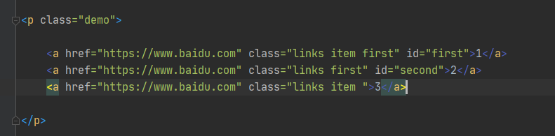
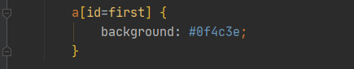
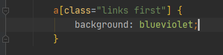
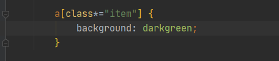
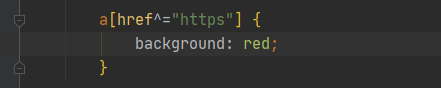
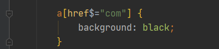

# 什么是CSS

## 1.1、什么是CSS 

Cascading Style Sheets：层叠级联样式表

CSS ：表现（美化网页）


## 1.2、发展过程

CSS 1.0

CSS 2.0

CSS 2.1

CSS 3.0


## 1.3、快速入门

style标签

若在html文件中写CSS，尽量放在 <head> 中，包裹在 <style>标签中。


外部引用：

```html
<link rel="stylesheet" href="css/style.css">
```

把所有的css样式放在style.css文件中。


## 1.4、四种导入方式

- ```html
    <h2 style="color: blue">行内样式</h2>
    ```

- ```html
    <style>
        h2 {
            color: blueviolet;
        }
    </style>
    ```

- ```html
    <link rel="stylesheet" href="css/style.css">
    ```

    ```html
    <style>
        @import url("css/style.css");
    </style>
    ```


# 选择器

> 选择页面上的某一个或者某一类元素


## 2.1 基本选择器

**一、标签选择器**

会将所有的标签都格式化


**二、类选择器**

指定具体的class，使所有的 特定class 统一样式。

```html
<h2>h2 - 1 </h2>
<h2 class="kicc">h2 - 2 </h2>
```


==用 . 开头==

```css
.kicc {
    color: brown;
}
```

且类选择器的优先级要高于标签选择器。


**三、ID选择器**

id跟class类似。但是全局唯一。

优先级最高。

==用 # 开头==


## 2.2 层次选择器

一、后代选择器

```html
body p {
    background: #0f4c3e;
}
```


二、儿子选择器

```
body>p {
    background: #0f4c3e;
}
```


三、相邻兄弟选择器 (只有一个，下面那个)

```
.active + p {
    background: #0f4c3e;
}
```


四、通用兄弟选择器 （向下的所有指定元素）

```html
.active~p {
    background: #0f4c3e;
}
```


**==四种层次选择器可以组合使用==**

```html
#hello~li p{
    background: chocolate;
}
```


## 2.3 结构伪类选择器


```html

/*ul下的第一个li */

ul li:first-child {
    background: darkolivegreen;
}

/*p标签的父类下的第一个元素，如果这个元素不是p，不生效；*/
p:nth-child(1) {
background: darkolivegreen;
}

/*p标签的父类下的第一type为p的元素，*/
p:nth-of-type(2) {
background: darkolivegreen;
}
```


## 2.4 属性选择器

有这样的几个标签：



选择a标签并且有属性id，且属性为first的：




选择a标签并且有属性class，且属性为"links first"



选择a标签并且有属性class，且属性==包含=="item"




正则匹配：以https开头




正则匹配：以com结尾




