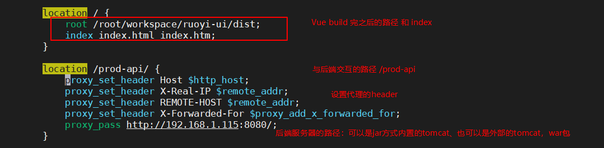
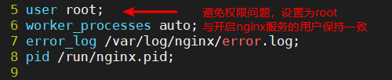

# 1. Vue 概述


# W 打包


## W.1 下载依赖

```bash
# 根据package.json下载前端依赖
npm install --unsafe-perm registry=https://registry.npm.taobao.org
```


## W.2 build

```bash
# 生产环境build
npm run build:prod
```

> 可以得到dist文件夹：包含首页以及静态资源文件。


# X.  Nginx 部署


## X.1 Nginx服务器安装

```bash
yum install epel-release

yum install nginx

systemctl enable nginx # 开机启动

systemctl start nginx # 启动
```


> 如果服务器开启了防火墙，则需要同时打开 80（HTTP）和 443（HTTPS）端口。

```bash
sudo firewall-cmd --permanent --zone=public --add-service=http
sudo firewall-cmd --permanent --zone=public --add-service=https
sudo firewall-cmd --reload
```


> 可以通过 http://IP 验证访问。


## X.2 配置文件和最佳实践

**每一种方式安装 （源码编译、yum、rpm等）都有对应的安装路径。**

- 通过以上方式安装的 Nginx，所有相关的配置文件都在 /etc/nginx/ 目录中。

- Nginx 的主配置文件是 /etc/nginx/nginx.conf。
    为了使 Nginx 配置更易于维护，建议为每个服务（域名）创建一个单独的配置文件。

- 每一个独立的 Nginx 服务配置文件都必须以 .conf 结尾，并存储在 /etc/nginx/conf.d 目录中。您可以根据需求，创建任意多个独立的配置文件。

- 独立的配置文件，建议遵循以下命名约定，比如你的域名是 kaifazhinan.com，那么你的配置文件的应该是这样的 /etc/nginx/conf.d/kaifazhinan.com.conf，如果你在一个服务器中部署多个服务，当然你也可以在文件名中加上 Nginx 转发的端口号，比如 kaifazhinan.com.3000.conf，这样做看起来会更加友好。

- 如果你的配置中有很多重复的代码，那么建议你创建一个 /etc/nginx/snippets 文件夹，在这里面存放所有会被复用的代码块，然后在各个需要用到的 Nginx 的配置文件中引用进去，这样可以更方便管理和修改。

- Nginx 日志文件（access.log 和 error.log ）位于 /var/log/nginx/ 目录中。建议为每个独立的服务配置不同的访问权限和错误日志文件，这样查找错误时，会更加方便快捷。
    你可以将要部署的代码文件，存储在任何你想的位置，但是一般推荐存放在下列位置中的其中一个：

    - /home/<user_name>/<site_name>
    - /var/www/<site_name>
    - /var/www/html/<site_name>
    - /opt/<site_name>
    - /usr/share/nginx/html


## X.3 配置文件编辑






