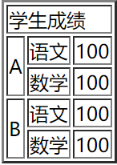
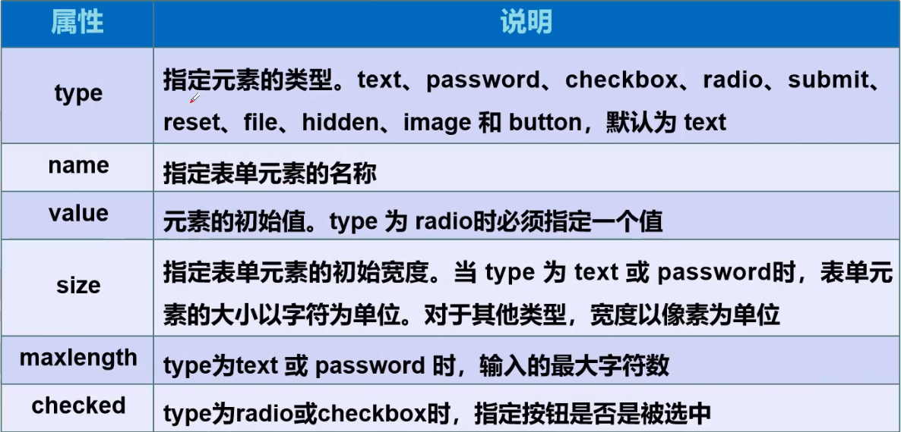

# 1. html

> W3C标准

- 结构化标准语言 （HTML、XML）
- 表现标准语言（CSS）
- 行为标准（DOM，ECMAScript）


> 网页基本信息

- DOCTYPE：告诉浏览器，我们要使用的规范是什么。默认 **html**。
- meta：描述性标签。**<font color='red'>描述网站的元信息</font>**。


> 基本标签

- 段落标签：<p></p>
- 换行标签：<br/>
- 水平线标签：<hr/>
- 字体样式：
    - 粗体：<strong></strong>
    - 斜体：<em></em>
- 注释和特殊符号
    - 注释： <!-- -->
    - 空格：%nbsp；
    - &gt；
    - &lt；
    - &copy；


> 图像标签

```html

- path: url
- 图像的代替文件
- 鼠标悬停提示文字
- 图像宽度
- 图像高度
```


> 链接标签


```html
<a href="path" target="">文字</a>
- targer： 表示窗口在哪里打开
		 _blank： 在新标签打开；默认是当前页面打开
		 _self： 在当前网页下打开
```

> > 锚链接


```html
<!-- 定义 锚链接的点： 用name 定义-->
<a name="here">锚链接展示</a>

<!-- 加 # 跳转锚链接 -->
<a href="图像标签.html#here">跳转到锚链接</a>
```

> >功能性链接


邮箱链接：

```html
<a href="mailto:948209147@qq.com">发邮件给我</a>
```

qq链接：

```html
<a target="_blank" href="http://wpa.qq.com/msgrd?v=3&uin=&site=qq&menu=yes"></a>
```

> 列表

1. 有序列表

```html
<ol>
    <li>Java</li>
    <li>Python</li>
</ol>
```

2. 无序列表

```html
<ul>
    <li>Java</li>
    <li>Python</li>
</ul>
```

3. 自定义列表

```html
<!-- 
dl: 标签
dt：列表名称	 
dd：列表内容
-->
<dl>
    <dt></dt>
    
    <dd>Java</dd>
    <dd>Python</dd>
</dl>
```


> 表格

属性：

- table
- tr
- td

```html
<table border="2px" >
    <tr>
        <td colspan="3">学生成绩</td>

    </tr>
    <tr>
        <td rowspan="2">A</td>
        <td>语文</td>
        <td>100</td>
    </tr>
    <tr>
        <td>数学</td>
        <td>100</td>
    </tr>
    <tr>
        <td rowspan="2">B</td>
        <td>语文</td>
        <td>100</td>
    </tr>
    <tr>
        <td>数学</td>
        <td>100</td>
    </tr>
</table>
```



> 媒体元素 （音频、视频）


```html
<video src="path" controls></video>

<audio src="path" controls></audio>
```


> 页面结构

```html
<header>
    <h2>网页头部</h2>
</header>

<nav>
    <h2>导航</h2>
</nav>

<footer>
    <h2>网页脚步</h2>
</footer>

<section>
    <h2>网页主体</h2>
</section>
```


> 网页内联嵌套

```html
<iframe src="https://www.baidu.com" name="hello" frameborder="0" width="1000px" height="500px">

</iframe>


<a href="first.html" target="hello">点击跳转</a>
```

首先展示了内联页面 hello：是百度的主页。 点击跳转后，内联页面跳转为first.html。

> 表单

```html
<form method="post/get" action="表示向何处发送表单数据">
    
</form>
```

表单中的绝大多数控件都用 <input type="">；其中 submit， reset等不需要些名称，自动就是“提交”，“重置”。


method：

- get：直接显示到url中。（不安全）
- post：不显示在url中。


> input 属性



- name：用于数据交互。
- id：用户代码交互。
- value：给元素赋值，如果是button类，就是按钮的名称。


> 下拉框

```html
<p>国家：
    <select name="select1">
        <option value="China">中国</option>
        <option value="USA">美国</option>
        <option value="Germany">德国</option>
        <option value="Switzerland" selected>瑞士</option>
    </select>
```


> 单选框

```html
<p>性别：
    <input type="radio" name="gender" value="1"/>男
    <input type="radio" name="gender" value="0"/>女
</p>
```


> 多选框

```html
<p>爱好：
    <input type="checkbox" value="1" name="hobby"/>吃
    <input type="checkbox" value="3" name="hobby"/>喝
    <input type="checkbox" value="2" name="hobby" checked/>玩
</p>
```

value是用来前后端交互传递参数的，name-value 可以认为是key-value。


> 文本域 （多行）

```html
<p>
    <textarea name="textarea" id="textArea1" cols="30" rows="10">
        文本内容
    </textarea>
</p>
```


> 文件域

```html
<p>
    <input type="file" name="files">
    <input type="button" value="上传" name="upload">
</p>
```


