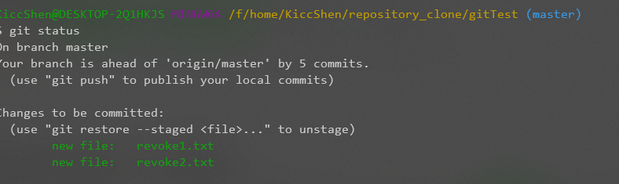
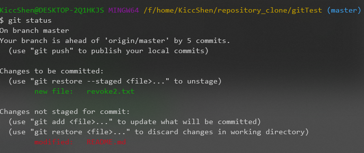
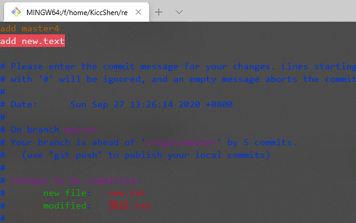
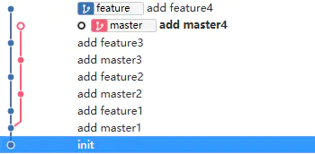
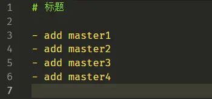
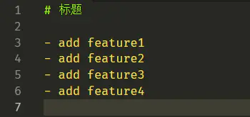
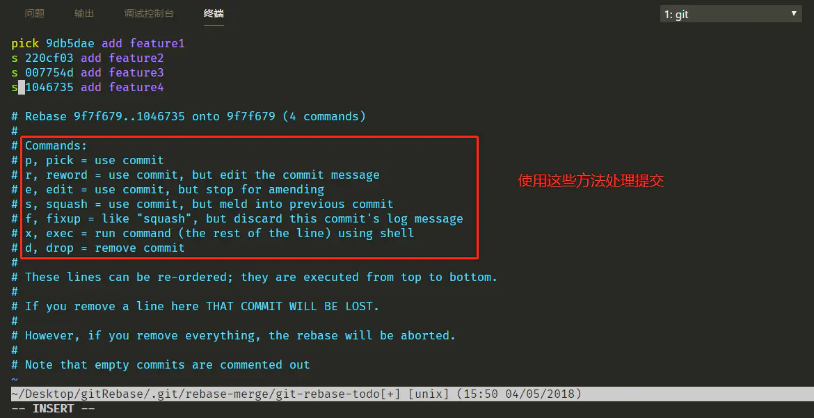
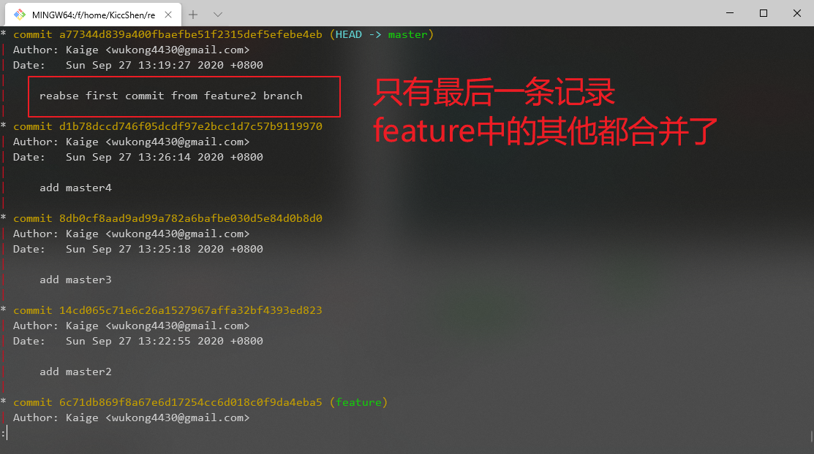

# 本地工作区状态


- Untracked：一个新创建的文件就是未被跟踪的。
- Unmodified：一个已经在仓库里、但是没有被修改过的文件。
- Modified：已经在仓库里且被修改过还没有add过的文件。
- Staged：git add之后的文件。放到了暂存区中。


# 常见（忘）命令


## 本地工作区查看

- 查看工作区状态

```bash
# 查看文件的状态
# 常见状态：
# 1.Changes to be committed: 下面的文件已经被添加到暂存区 （git add后，但是没有commit）
# 2.Changes not staged for commit: 文件被修改过，但是还没有放到暂存区。
# 3.Untracked files: 在本地新增的文件，还没有跟git同步过
git status
```

```bash
# 简化状态输出信息
# 输出格式：状态 文件名
# 状态包括：M、MM、A、??; 
# M=修改过未add，
# MM有部分修改过的已经add，也有部分未add，
# A=已经add，
# ??=新创建的文件未add
git status -s / git status --short
```


- 查看暂存区（Staged）和没有add的文件之间区别

```bash
# 查看修改过的文件和之前暂存区的区别 （这里修改文件不包括Untracked)
# 如果 git add . 之后 执行 git diff 将不会输出任何信息，因为都add了。
git diff
```

```bash
# 查看暂存起来的变化
# 已暂存文件和最后一次提交的差异
git diff --staged / git diff --cached
```


- 提交

```bash
# 结合git add
# 将自动把所有已经跟踪过的文件暂存起来一并提交，（我觉得不好）
git commit -a 
```


- 移除文件

```bash
# 把文件从实际目录下移除，同时也从暂存区里移除
# -f：用于删除之前修改过或已经放到暂存区的文件
git rm -f file
```

```bash
# 把文件从暂存区里移除，保留本地文件
# 也就是这个文件我不跟踪了
# 常用场景：当你忘记添加 .gitignore 文件，不小心把一个很大的日志文件或一堆 .a 这样的编译生成文件添加到暂存区时
git rm --cached file
```


- 移动文件

```bash
# 跟Shell一样，可以用来重命名
# 实际上一条mv命令 = mv file1 file2; git rm file1; git add file2;
git mv file1 file2
```


- 日志输出

```bash
# 查看最近的三条log
git log -3
```

```bash
# 直观的输出多个commit之间的联系
git log --graph
```

```bash
# -p 会显示每次提交所引入的差异, 使用 -2 选项来只显示最近的两次提交
git log -p -2
```

```bash
# 看到每次提交的简略统计信息
git log --stat
```

```bash
# --pretty 允许定义多种输出的格式
git log --pretty=oneline/full/fuller/short
```

> 当项目比较庞大，commit次数很多的时候，需要用各种筛选策略定位需要的日志
>
> git log --各种参数

| 选项  | 说明                                          |
| :---- | :-------------------------------------------- |
| `%H`  | 提交的完整哈希值                              |
| `%h`  | 提交的简写哈希值                              |
| `%T`  | 树的完整哈希值                                |
| `%t`  | 树的简写哈希值                                |
| `%P`  | 父提交的完整哈希值                            |
| `%p`  | 父提交的简写哈希值                            |
| `%an` | 作者名字                                      |
| `%ae` | 作者的电子邮件地址                            |
| `%ad` | 作者修订日期（可以用 --date=选项 来定制格式） |
| `%ar` | 作者修订日期，按多久以前的方式显示            |
| `%cn` | 提交者的名字                                  |
| `%ce` | 提交者的电子邮件地址                          |
| `%cd` | 提交日期                                      |
| `%cr` | 提交日期（距今多长时间）                      |
| `%s`  | 提交说明                                      |


| 选项              | 说明                                                         |
| :---------------- | :----------------------------------------------------------- |
| `-p`              | 按补丁格式显示每个提交引入的差异。                           |
| `--stat`          | 显示每次提交的文件修改统计信息。                             |
| `--shortstat`     | 只显示 --stat 中最后的行数修改添加移除统计。                 |
| `--name-only`     | 仅在提交信息后显示已修改的文件清单。                         |
| `--name-status`   | 显示新增、修改、删除的文件清单。                             |
| `--abbrev-commit` | 仅显示 SHA-1 校验和所有 40 个字符中的前几个字符。            |
| `--relative-date` | 使用较短的相对时间而不是完整格式显示日期（比如“2 weeks ago”）。 |
| `--graph`         | 在日志旁以 ASCII 图形显示分支与合并历史。                    |
| `--pretty`        | 使用其他格式显示历史提交信息。可用的选项包括 oneline、short、full、fuller 和 format（用来定义自己的格式）。 |
| `--oneline`       | `--pretty=oneline --abbrev-commit` 合用的简写。              |


| 选项                  | 说明                                       |
| :-------------------- | :----------------------------------------- |
| `-<n>`                | 仅显示最近的 n 条提交。                    |
| `--since`, `--after`  | 仅显示指定时间之后的提交。                 |
| `--until`, `--before` | 仅显示指定时间之前的提交。                 |
| `--author`            | 仅显示作者匹配指定字符串的提交。           |
| `--committer`         | 仅显示提交者匹配指定字符串的提交。         |
| `--grep`              | 仅显示提交说明中包含指定字符串的提交。     |
| `-S`                  | 仅显示添加或删除内容匹配指定字符串的提交。 |


## 撤销操作

> 只要一个文件跟Git联系过一次（add commit过）那么基本上都是可以找回丢失的文件的


### 从暂存区撤出

添加了两个新的文件 `revoke1.txt` 和 `revoke2.txt`。 现在希望从暂存区中撤去一个。

```bash
# 确认目前的状态
git status
```



git 提示了我们可以使用 `git restore --staged <file>` 命令来撤销。


### 撤销对文件的修改

当我们修改了一个文件



可以看到 README.md 已经被我们修改了。但是我突然不想要这些修改了。想丢弃，怎么办呢？

- 第一种办法，就是手动的去修改源文件。把之前修改过的地方一个一个的都撤销掉。（得撤销很多次）
- 第二种办法，git status 给了我们提示：`git restore <file>` 就可以将该文件的所有修改丢弃。


### 将遗漏的文件合并到上一次的提交

有时候我们提交完了才发现漏掉了几个文件没有添加，或者提交信息写错了。 此时，可以运行带有 `--amend` 选项的提交命令来重新提交：

```bash
git commit -m "提交新的文件"
# 想起来好像有一个文件忘记提交了
# 添加这个文件
git add new.txt
# 使用--amend 回到上一次的提交
$ git commit --amend
```



这样，会将新添加的 `new.txt` 文件 和 上次提交的所有内容认为是同一次提交。


## 远程仓库操作

```bash
# 查看远程仓库的简写和URL
git remote -v

$ git remote -v
origin  https://gitee.com/kicc/JavaGuide.git (fetch)
origin  https://gitee.com/kicc/JavaGuide.git (push)
```


- **拉取到本地**

```bash
# 运行 git remote add <shortname> <url> 添加一个新的远程 Git 仓库，同时指定一个方便使用的简写
$ git remote add pb https://github.com/paulboone/ticgit
$ git remote -v
origin	https://github.com/schacon/ticgit (fetch)
origin	https://github.com/schacon/ticgit (push)
pb	https://github.com/paulboone/ticgit (fetch)
pb	https://github.com/paulboone/ticgit (push)

# 现在你可以在命令行中使用字符串 pb 来代替整个 URL。
# 可以执行 git fetch <remote>来拉取。 
git fetch pb
```

> 须注意 `git fetch` 命令只会将数据下载到你的本地仓库——它并不会自动合并或修改你当前的工作。合并需要手动。

```bash
# 如果【当前】分支设置了跟踪远程分支，git pull 命令来自动抓取后合并该远程分支到当前分支。
git pull
```


- **推送到远程**

```bash
# 这个命令很简单：git push <remote> <branch>,把本地分支推送到服务器
git push origin master
```

> 只有当你有所克隆服务器的写入权限，并且之前没有人推送过时，这条命令才能生效。
>
> 如果push时，其他协作者已经push过了。则必须先fetch最新的内容进行合并后才能push。


- **假设有两个远程分支oschina和github**

****

```bash
#添加github
git remote add origin https://github.com/xxx(仓库地址)
#添加oschina
git remote add oschina https://git.oschina.net/xxxx(仓库地址)
#提交到oschina
git push oschina master(分支名)
#提交到github
git push origin master(分支名)
#从oschina更新
git pull oschina master
#从github更新
git pull origin master
```


- **远程仓库的重命名与移除**

```bash
# 你可以运行 git remote rename 来修改一个远程仓库的简写名
$ git remote rename pb paul
$ git remote
origin
paul
```


```bash
# 移除一个远程仓库，这个远程仓库相关的远程跟踪分支以及配置信息都被删除。
$ git remote remove paul
$ git remote
origin
```


## 别名

给 commit \ status \  checkout \  branch 起一个简短的名字

```bash
git config --global alias.co checkout
git config --global alias.br branch
git config --global alias.ct commit
git config --global alias.st status
# 显示最近的一次commit
git config --global alias.last "log -1 HEAD"
# 显示所有分支的log
git config --global alias.showlig "log --oneline --decorate --graph --all"
```


## 分支 branch

### 基础介绍

每一次commit都会创建一个指针节点，指向父节点（上一次的commit）。而每次保存的是一个当前数据的快照（Snapshot）


而我们熟知的`master`分支是默认创建的。


当我们创建一个新的分支时

```bash
git branch testing
```


有两个指针指向了同一个 commit的快照

**那么，我们如何确定当前时是处于哪个分支呢？**  ==HEAD指针==


我们用HEAD这个特殊指针来指示到底是哪一个分支。

> 由于 Git 的分支实质上仅是包含所指对象校验和（长度为 40 的 SHA-1 值字符串）的文件，所以它的创建和销毁都异常高效。 创建一个新分支就相当于往一个文件中写入 41 个字节（40 个字符和 1 个换行符），如此的简单能不快吗？


### 切换分支

```bash
git checkout testing
```


在`testing`分支上提交一次新的commit


切换回master


### 删除分支

```bash
# 删除本地分支
git branch -d <branchName>

# 删除远程分支
git push origin --delete <branchName>
```


### 分支合并

在git中，有两种方式可以将一个branch合并到另一个branch上。


#### 场景介绍

我们创建了两个分支，一个master、一个feature



两个分支交替的进行了commit。每个分支分别有4个commit。


在master分支中，文本的内容是



在feautre分支中，文本的内容是




#### merge

```bash
# 将feature分支的内容（4个commit）合并到master
git checkout master
git merge feature
```

合并完成之后，会按照时间顺序，将feature分支上的commit和master分支上的commit都杂糅在一起。

不管是主分支还是特征分支上的每一个commit都会被记录，最后合并的时候还需要额外创建一个commit来记录。


**优点：**信息非常详细。不会遗漏任何一条提交记录。

**缺点：**试想，我们对于一个小功能的修改就提交了很多次，那么在做代码回滚的时候，需要查看很多很多的commit，比较消耗时间和精力。


#### rebase

```bash
# 同样也是将feature分支的commit合并到master上
git checkout feature
# 开始变基
git rebase master
```

当执行完 `git rebase master` 之后，会将文件中冲突的地方标识出来，需要自己对冲突进行操作之后，再执行

```bash
# 修改冲突后，继续执行
# 先把修改后的内容add
git add <file>
git rebase --continue
```

如果还有冲突，重复上面的步骤继续解决就可以。直到解决完毕所有的冲突。

然后到master分支上进行合并

```bash
# 合并
git checkout master
git merge feature
```


这样feature上的所有提交信息也还是会全部显示在 `git log`中。


但是，我们可以通过交互模式，将多个feature中的commit合并成一个或者少数个。

```bash
# 开启rebase 交互模式
# 选取最近的四个commit （来自feauture）
git rebase -i HEAD~4
```

会跳出来这么一个界面



上面代表的是四个commit，通过修改原本的 `pick` 选取对应的方法。

通常我们用 `s (squash)` 来进行分支的合并。

我只保留一个commit

那么最终就 log




#### 总结

- 当我们需要保留非常详细的各个分支上的commit记录时，我们最好就使用 `git merge` ，既方便，也简单。
- 当发现自己修改某个功能时，频繁进行了`git commit`提交时，发现其实过多的提交信息没有必要时，可以尝试`git rebase`。


#### 实际应用

1. 开发某个网站。
2. 为实现某个新的用户需求，创建一个分支。
3. 在这个分支上开展工作。

正在此时，你突然接到一个电话说有个很严重的问题需要紧急修补。 你将按照如下方式来处理：

1. 切换到你的线上分支（production branch）。
2. 为这个紧急任务新建一个分支，并在其中修复它。
3. 在测试通过之后，切换回线上分支，然后合并这个修补分支，最后将改动推送到线上分支。
4. 切换回你最初工作的分支上，继续工作。


`master`作为主（线上）分支，我正在`iss53`这个分支上开展工作，如图


突然，需要去修复线上分支的一个bug

首先，确保`iss53`这个分支的任务都已经提交

```bash
git st
git commit -a 
```

然后切换回`master`分支

```bash
git checkout master
```

开始创建紧急修复分支，并处理完所有的任务

```bash
$ git checkout -b hotfix
Switched to a new branch 'hotfix'
$ vim index.html
$ git commit -a -m 'fixed the broken email address'
[hotfix 1fb7853] fixed the broken email address
 1 file changed, 2 insertions(+)
```


测试确保所有的任务都是执行通过的，接着切换回`master` 进行合并。

```bash
$ git checkout master
$ git merge hotfix
Updating f42c576..3a0874c
Fast-forward
 index.html | 2 ++
 1 file changed, 2 insertions(+)
```


`merge`会将所有commit的信息都详细地记录下来。当完成合并之后，`hotfix`分支也就不需要了，可以删除。那么分支情况会如下所示

```bash
git branch -d hotfix
```


接着，继续`iss53`的工作，完成后，切换回`master`并将分支进行合并。因为 `iss53`不是从C4分出来的，而是更早的C2，因此，他们之间会存在冲突（hotfix修改的部分）。这样的合并不是一个简单的`fast-forward`，而会自动地新建一个commit。如下


出现冲突后，文件中会出现类似

```html
<<<<<<< HEAD:index.html
<div id="footer">contact : email.support@github.com</div>
=======
<div id="footer">
 please contact us at support@github.com
</div>
>>>>>>> iss53:index.html
```

`=======` 上方的内容是当前HEAD（master）中的内容；`========`下方的内容是合并进来的冲突内容。我们进行取舍。修改成

```html
<div id="footer">contact : email.support@github.com</div>
```

解决冲突后，

```bash
git add <file>
git commit -m "conflicts solved, merge branches"
git branch -d iss53
```

最后将`iss53`分支删除。


```bash
1
```


```bash
1
```


```bash
1
```


```bash
1
```


```bash
1
```

