# 1 NoSQL 概述


## 1.1 为什么使用？

> 1. 单机模型

最早的单机服务器上，我们只需要使用单个的数据库就够使用了。毕竟用户的访问量没有那么大。


> 2. Memcached（缓存）+ MySQL + 垂直拆分

- 网站80%的请求都是读，每次都要取数据库中查询的话效率太低了。

- 为了减少服务器的压力，我们就可以使用缓存来保证效率。

    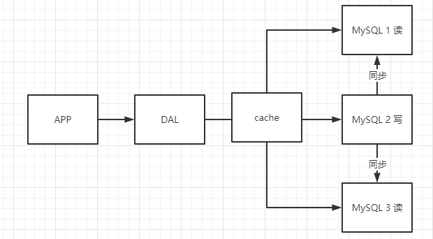

    

- 发展过程：优化数据结构和索引 ==》文件缓存（IO）==》Memcached

缓存技术主要是来解决**读**的问题。


> 3. 水平拆分 分库分表 MySQL集群


> 为什么要用？

- 数据量增长的速度非常快，单单用关系型数据库很难处理。
- MySQL来存储些比较大的文件，博客，图片时，效率不高。需要依赖另一种专门处理的数据库。


## 1.2 什么是NoSQL

很多的数据类型：用户的个人信息，社交网络，地理信息等。这些数据类型的存储不需要一个固定的格式。不需要多余的操作就可以横向扩展的。 就像 Map <String, Object>

> NoSQL 特点

​	**解耦！**

1. 方便扩展：数据之间没有关系，很容易扩展。

2. 大数据量高性能：Redis 一秒写8W，读取11W。NoSQL的缓存记录级，是一种细粒度的缓存。

3. 数据类型是多样性的：不需要事先设计数据库。随去随用。如果是数据量大的表，一开始很难设计好。

4. 传统RDBMS和NoSQL

    ```yaml
    传统RDBMS
    - 结构化组织
    - SQL 语言
    - 数据和关系都存在单独的表中
    - 操作，数据定义语言
    - 严格的一致性
    - 基础的事务
    ```

    ```
    NoSQL
    - 不仅仅是数据
    - 没有固定的查询语言
    - 从多种存储方式：键值对存储，列存储，文档存储，图形数据库
    - 最终一致性，保证最终一致就可以
    - CAP定理 和 BASE
    - 高性能，高可用，高可扩展
    ```

    

> 了解：3V+3高

- 大数据的3V：用来描述问题；
    - 海量Volume
    - 多样Variety
    - 实时Velocity
- 3高需求：
    - 高并发
    - 高可扩 （随时水平拆分，+服务器）
    - 高性能

最佳实践：NoSQL + RDBMS。


# 架构演进（阿里）


**一、 商品的各种数据信息**

```bash
# 1、商品的基本信息
	名称、价格、商家信息
	关系型数据库就可以解决。 MySQL / Oracle
	淘宝内部的MySQL不是大家用的MySQL
	
	
# 2、商品的描述、评论（文字比较多）
	文档型数据库：MongoDB

# 3、图片
	分布式文件系统 FastDFS
	- 淘宝自己的 TFS
	- Hadoop   HDFS
	- 阿里云    oss
	
# 4、商品的关键字（搜索）
	- 搜索引擎 solr elasticsearch
	
# 5、商品热门的波段信息
	- 内存数据库
	- Redis Tair、Memcache
	
# 6、商品的交易，外部的支付接口
	- 三方应用
```


**二、大型互联网中的问题**

- 数据类型太多了
- 数据源繁多，经常重构
- 数据要改造的话，大面积改造？

解决办法：统一数据服务层框架缓存模块 UDSL

> 在网站APP与各种数据库相关底层中间加上一层统一的数据处理层。屏蔽底层细节。方便程序员编程。
>
> 程序员不需要去了解每一个底层数据库或者搜索引擎的具体细节。只要用一个统一的接口操作一切就可以。


# NoSQL的四种类型


**KV键值对**：

- 新浪：Redis
- 美团：Redis+Tair
- 阿里、百度：Redis——memcache


**文档型数据库（bson格式）**：

- MongoDB（一般必须要掌握）
    - MongoDB是一个基于分布式文件存储的数据库，C++编写，主要用来处理大量的文档。
    - MongoDB是一个介于关系型数据库和NoSQL之间的一种产品。MongoDB是非关系型数据库中功能最丰富，最像关系型数据的。
- CouchDB


**列存储的数据库**：

- HBase
- 分布式文件系统


**图数据库**：

- neo4j


# Redis 入门

## 概述

> Redis = Remote Dictionary Server 远程字典服务

Redis 是 开源、C语言编写、支持网络、可基于内存、可持久化、K-V数据库，提供多种语言API。 

Redis支持各种不同方式的排序。与memcached一样，为了保证效率，数据都是缓存在内存中。区别的是redis会周期性的把更新的数据写入磁盘或者把修改操作写入追加的记录文件，并且在此基础上实现了master-slave(主从)同步。


> Redis 能干嘛？

1、内存存储、持久化。持久化就聊 rdb和aof。

2、效率高，可以用于高速缓存。

3、发布订阅系统

4、地图信息分析

5、计时器、计数器（微信浏览量）

6、.....


> 特性

1、多样化数据类型

2、持久化

3、集群

4、事务


> 


## Linux 安装

1. 下载redis-6.0.x.tar.gz

2. ```bash
    tar -zxvf redis-.tar.gz
    cd redis-.tar.gz
    ```

3. ```bash
    # make
    # 安装在/usr/local/bin
    make
    make install
    ```

查看：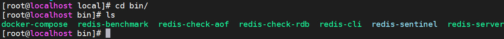

4. 拷贝解压包下的redis.conf到 /usr/local/bin/redisconfig

> 我们以后就修改这个配置文件进行启动。

5. redis不是默认后台启动的，修改配置文件。

    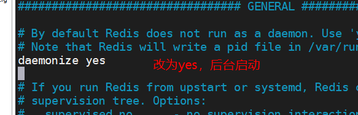


6. 启动redis服务：通过配置文件启动 redis-server

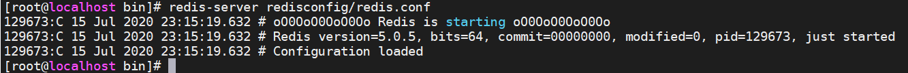

7. 测试连接：使用redis-cli 指定端口号 （-h 指定host ip）

    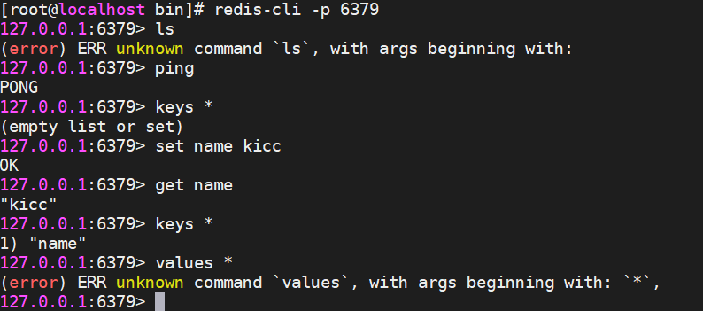

8. 退出redis服务：server & cli

    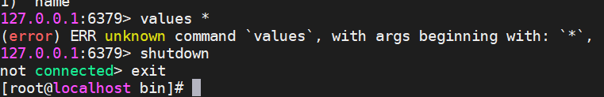

    9.后续使用单机多port的集群方式。


## 性能测试

**redis-benchmark**

redis 性能测试工具可选参数如下所示：

| 序号 | 选项      | 描述                                       | 默认值    |
| :--- | :-------- | :----------------------------------------- | :-------- |
| 1    | **-h**    | 指定服务器主机名                           | 127.0.0.1 |
| 2    | **-p**    | 指定服务器端口                             | 6379      |
| 3    | **-s**    | 指定服务器 socket                          |           |
| 4    | **-c**    | 指定并发连接数                             | 50        |
| 5    | **-n**    | 指定请求数                                 | 10000     |
| 6    | **-d**    | 以字节的形式指定 SET/GET 值的数据大小      | 3         |
| 7    | **-k**    | 1=keep alive 0=reconnect                   | 1         |
| 8    | **-r**    | SET/GET/INCR 使用随机 key, SADD 使用随机值 |           |
| 9    | **-P**    | 通过管道传输 <numreq> 请求                 | 1         |
| 10   | **-q**    | 强制退出 redis。仅显示 query/sec 值        |           |
| 11   | **--csv** | 以 CSV 格式输出                            |           |
| 12   | **-l**    | 生成循环，永久执行测试                     |           |
| 13   | **-t**    | 仅运行以逗号分隔的测试命令列表。           |           |
| 14   | **-I**    | Idle 模式。仅打开 N 个 idle 连接并等待。   |           |

```bash
# 测试 100个并发 每个并发100000条请求
redis-benchmark -h localhost -p 6379 -c 100 -n 100000
```

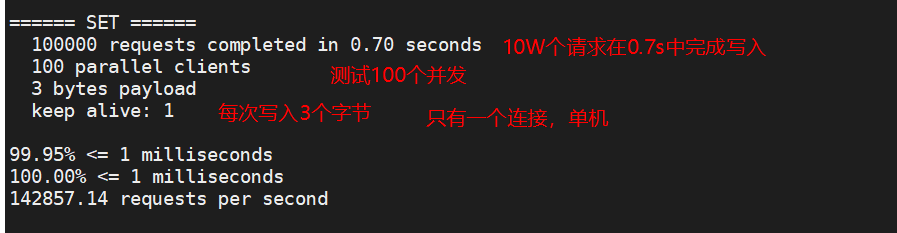


## 基础的知识

>  redis默认有16个数据库。在redis.conf中可以设置个数。15个初始化都是空的。

默认使用的是第0个数据库，可以使用  ==select n== 切换数据库 .


清空当前数据库 `flushdb`

```bash
127.0.0.1:6379> flushdb
OK
127.0.0.1:6379> keys *
(empty list or set)

```

情况所有数据库 `flushall`


> Redis 是单线程的！

Redis的速度是很快的，官方表示，Redis是基于内存操作的，CPU不是Redis的性能瓶颈。Redis是瓶颈是根据机器的内存和网络带宽，既然可以使用单线程来实现，就使用单线程了。

Reids是C语言写的，官方数据 100000+QPS，完全不比同样使用 Key-Value的Memcache差。


**为什么单线程还这么快？**

1、误区1：高性能的服务器一定是多线程的

2、误区2：多线程一定比单线程效率高。（上下文的切换消耗资源的）


核心：Redis是将全部的数据放在内存中的。所以用单线程去操作效率就高。用了多线程的上下文切换还不如单线程。


# 五大数据类型

> 介绍

Redis 是一个开源（BSD许可）的，内存中的数据结构存储系统，它可以用作==数据库==、==缓存==和==消息中间件MQ==。 它支持多种类型的数据结构，如 [字符串（strings）](http://www.redis.cn/topics/data-types-intro.html#strings)， [散列（hashes）](http://www.redis.cn/topics/data-types-intro.html#hashes)， [列表（lists）](http://www.redis.cn/topics/data-types-intro.html#lists)， [集合（sets）](http://www.redis.cn/topics/data-types-intro.html#sets)， [有序集合（sorted sets）](http://www.redis.cn/topics/data-types-intro.html#sorted-sets) 与范围查询， [bitmaps](http://www.redis.cn/topics/data-types-intro.html#bitmaps)， [hyperloglogs](http://www.redis.cn/topics/data-types-intro.html#hyperloglogs) 和 [地理空间（geospatial）](http://www.redis.cn/commands/geoadd.html) 索引半径查询。 Redis 内置了 [复制（replication）](http://www.redis.cn/topics/replication.html)，[LUA脚本（Lua scripting）](http://www.redis.cn/commands/eval.html)， [LRU驱动事件（LRU eviction）](http://www.redis.cn/topics/lru-cache.html)，[事务（transactions）](http://www.redis.cn/topics/transactions.html) 和不同级别的 [磁盘持久化（persistence）](http://www.redis.cn/topics/persistence.html)， 并通过 [Redis哨兵（Sentinel）](http://www.redis.cn/topics/sentinel.html)和自动 [分区（Cluster）](http://www.redis.cn/topics/cluster-tutorial.html)提供高可用性（high availability）。

### Redis-Key

下表给出了与 Redis 键相关的基本命令：

| 序号   | 命令及描述                                                   |
| :----- | :----------------------------------------------------------- |
| ==1==  | [DEL key](https://www.runoob.com/redis/keys-del.html) 该命令用于在 key 存在时删除 key。 |
| 2      | [DUMP key](https://www.runoob.com/redis/keys-dump.html) 序列化给定 key ，并返回被序列化的值。 |
| ==3==  | [EXISTS key](https://www.runoob.com/redis/keys-exists.html) 检查给定 key 是否存在。 |
| ==4==  | [EXPIRE key](https://www.runoob.com/redis/keys-expire.html) seconds 为给定 key 设置过期时间，以秒计。 |
| 5      | [EXPIREAT key timestamp](https://www.runoob.com/redis/keys-expireat.html) EXPIREAT 的作用和 EXPIRE 类似，都用于为 key 设置过期时间。 不同在于 EXPIREAT 命令接受的时间参数是 UNIX 时间戳(unix timestamp)。 |
| 6      | [PEXPIRE key milliseconds](https://www.runoob.com/redis/keys-pexpire.html) 设置 key 的过期时间以毫秒计。 |
| 7      | [PEXPIREAT key milliseconds-timestamp](https://www.runoob.com/redis/keys-pexpireat.html) 设置 key 过期时间的时间戳(unix timestamp) 以毫秒计 |
| 8      | [KEYS pattern](https://www.runoob.com/redis/keys-keys.html) 查找所有符合给定模式( pattern)的 key 。 |
| ==9==  | [MOVE key db](https://www.runoob.com/redis/keys-move.html) 将当前数据库的 key 移动到给定的数据库 db 当中。 |
| 10     | [PERSIST key](https://www.runoob.com/redis/keys-persist.html) 移除 key 的过期时间，key 将持久保持。 |
| 11     | [PTTL key](https://www.runoob.com/redis/keys-pttl.html) 以毫秒为单位返回 key 的剩余的过期时间。 |
| ==12== | [TTL key](https://www.runoob.com/redis/keys-ttl.html) 以秒为单位，返回给定 key 的剩余生存时间(TTL, time to live)。 |
| 13     | [RANDOMKEY](https://www.runoob.com/redis/keys-randomkey.html) 从当前数据库中随机返回一个 key 。 |
| 14     | [RENAME key newkey](https://www.runoob.com/redis/keys-rename.html) 修改 key 的名称 |
| 15     | [RENAMENX key newkey](https://www.runoob.com/redis/keys-renamenx.html) 仅当 newkey 不存在时，将 key 改名为 newkey 。 |
| 16     | [SCAN cursor [MATCH pattern\] [COUNT count]](https://www.runoob.com/redis/keys-scan.html) 迭代数据库中的数据库键。 |
| ==17== | [TYPE key](https://www.runoob.com/redis/keys-type.html) 返回 key 所储存的值的类型。 |


### String 

```bash
127.0.0.1:6379> select 1
OK
127.0.0.1:6379[1]> keys *
1) "age"
127.0.0.1:6379[1]> type name
none
127.0.0.1:6379[1]> type age
string
127.0.0.1:6379[1]> keys *
1) "age"
127.0.0.1:6379[1]> type age
string
127.0.0.1:6379[1]> APPEND age 1     # append string
(integer) 3
127.0.0.1:6379[1]> type age
string
127.0.0.1:6379[1]> get age
"251"
127.0.0.1:6379[1]> STRLEN age
(integer) 3
127.0.0.1:6379[1]> APPEND age ",岁"   # 中文占了三个长度
(integer) 7
127.0.0.1:6379[1]> get age
"251,\xe5\xb2\x81"
127.0.0.1:6379[1]>

#################################################
# 自增 自减 步长
127.0.0.1:6379[1]> set views 0
OK
127.0.0.1:6379[1]> get views
"0"
127.0.0.1:6379[1]> INCR views   # i++
(integer) 1
127.0.0.1:6379[1]> DECR views	# i--
(integer) 0
127.0.0.1:6379[1]> type views
string
127.0.0.1:6379[1]> INCRBY views 1-
(error) ERR value is not an integer or out of range
127.0.0.1:6379[1]> INCRBY views 10  # i+n
(integer) 10
127.0.0.1:6379[1]> DECRBY views 6	# i-n
(integer) 4
127.0.0.1:6379[1]>
#################################################
# 字符串范围
127.0.0.1:6379[1]> set key1 "What's your name?"
OK
127.0.0.1:6379[1]> GETRANGE key1 0 4    # 闭区间截取字符串
"What'"
127.0.0.1:6379[1]> GETRANGE key1 0 -1   # 获取全部
"What's your name?"
127.0.0.1:6379[1]>


#################################################
# “存”对象，实际上还是String，但是长的像json
127.0.0.1:6379[1]> set user:1 {name:kicc,age:22}
OK
127.0.0.1:6379[1]> DEL user:1:name
(integer) 1
127.0.0.1:6379[1]> DEL user:1:age
(integer) 1
127.0.0.1:6379[1]> mset user:1:name zhangsan user:1:age 11
OK
127.0.0.1:6379[1]> keys *
1) "user:1:name"
2) "user:1"
3) "user:1:age"
127.0.0.1:6379[1]> mget user:1:name user:1:age
1) "zhangsan"
2) "11"
127.0.0.1:6379[1]>

# 以Bilibili用户的关注数举例，我们可以在redis中这样存储
mset uid:xxxxxxx:follow 0 # 初始关注数为0
incr uid:xxxxxxx:follow  # 有新的关注
decr uid:xxxxxxx:follow  # 有人取消关注
#################################################
```


下表列出了常用的 redis 字符串命令：

| 序号   | 命令及描述                                                   |
| :----- | :----------------------------------------------------------- |
| 1      | [SET key value](https://www.runoob.com/redis/strings-set.html) 设置指定 key 的值 |
| 2      | [GET key](https://www.runoob.com/redis/strings-get.html) 获取指定 key 的值。 |
| ==3==  | [GETRANGE key start end](https://www.runoob.com/redis/strings-getrange.html) 返回 key 中字符串值的子字符 闭区间 |
| ==4==  | [GETSET key value](https://www.runoob.com/redis/strings-getset.html) 将给定 key 的值设为 value ，并返回 key 的旧值(old value)。 |
| 5      | [GETBIT key offset](https://www.runoob.com/redis/strings-getbit.html) 对 key 所储存的字符串值，获取指定偏移量上的位(bit)。 |
| 6      | [MGET key1 [key2..\]](https://www.runoob.com/redis/strings-mget.html) 获取所有(一个或多个)给定 key 的值。 **原子性操作** 所有获取都要成功或者都失败 |
| 7      | [SETBIT key offset value](https://www.runoob.com/redis/strings-setbit.html) 对 key 所储存的字符串值，设置或清除指定偏移量上的位(bit)。 |
| ==8==  | [SETEX key seconds value](https://www.runoob.com/redis/strings-setex.html) 将值 value 关联到 key ，并将 key 的==过期时间==设为 seconds (以秒为单位)。 |
| ==9==  | [SETNX key value](https://www.runoob.com/redis/strings-setnx.html) 只有在 key ==不存在==时设置 key 的值。 |
| ==10== | [SETRANGE key offset value](https://www.runoob.com/redis/strings-setrange.html) 用 value 参数覆写给定 key 所储存的字符串值，从偏移量 offset 开始。 |
| 11     | [STRLEN key](https://www.runoob.com/redis/strings-strlen.html) 返回 key 所储存的字符串值的长度。 |
| 12     | [MSET key value [key value ...\]](https://www.runoob.com/redis/strings-mset.html) 同时设置一个或多个 key-value 对。  **原子性操作** 所有获取都要成功或者都失败 |
| 13     | [MSETNX key value [key value ...\]](https://www.runoob.com/redis/strings-msetnx.html) 同时设置一个或多个 key-value 对，当且仅当所有给定 key 都不存在。**原子性操作** |
| 14     | [PSETEX key milliseconds value](https://www.runoob.com/redis/strings-psetex.html) 这个命令和 SETEX 命令相似，但它以==毫秒==为单位设置 key 的生存时间，而不是像 SETEX 命令那样，以秒为单位。 |
| 15     | [INCR key](https://www.runoob.com/redis/strings-incr.html) 将 key 中储存的数字值增一。 |
| 16     | [INCRBY key increment](https://www.runoob.com/redis/strings-incrby.html) 将 key 所储存的值加上给定的增量值（increment） 。 |
| 17     | [INCRBYFLOAT key increment](https://www.runoob.com/redis/strings-incrbyfloat.html) 将 key 所储存的值加上给定的浮点增量值（increment） 。 |
| 18     | [DECR key](https://www.runoob.com/redis/strings-decr.html) 将 key 中储存的数字值减一。 |
| 19     | [DECRBY key decrement](https://www.runoob.com/redis/strings-decrby.html) key 所储存的值减去给定的减量值（decrement） 。 |
| 20     | [APPEND key value](https://www.runoob.com/redis/strings-append.html) 如果 key 已经存在并且是一个字符串， APPEND 命令将指定的 value 追加到该 key 原来值（value）的末尾。 |


### List

基本的数据类型。Redis列表是简单的字符串列表，按照插入顺序排序。你可以添加一个元素到列表的头部（左边）或者尾部（右边）

Redis 列表命令

下表列出了列表相关的基本命令：

| 序号   | 命令及描述                                                   |
| :----- | :----------------------------------------------------------- |
| 1      | [BLPOP key1 [key2 \] timeout](https://www.runoob.com/redis/lists-blpop.html) 移出并获取列表的第一个元素， 如果列表没有元素会阻塞列表直到等待超时或发现可弹出元素为止。 |
| 2      | [BRPOP key1 [key2 \] timeout](https://www.runoob.com/redis/lists-brpop.html) 移出并获取列表的最后一个元素， 如果列表没有元素会阻塞列表直到等待超时或发现可弹出元素为止。 |
| 3      | [BRPOPLPUSH source destination timeout](https://www.runoob.com/redis/lists-brpoplpush.html) 从列表中弹出一个值，将弹出的元素插入到另外一个列表中并返回它； 如果列表没有元素会阻塞列表直到等待超时或发现可弹出元素为止。 |
| 4      | [LINDEX key index](https://www.runoob.com/redis/lists-lindex.html) 通过索引获取列表中的元素 |
| 5      | [LINSERT key BEFORE\|AFTER pivot value](https://www.runoob.com/redis/lists-linsert.html) 在列表的元素前或者后插入元素 |
| 6      | [LLEN key](https://www.runoob.com/redis/lists-llen.html) 获取列表长度 |
| 7      | [LPOP key](https://www.runoob.com/redis/lists-lpop.html) 移出并获取列表的第一个元素 |
| 8      | [LPUSH key value1 [value2\]](https://www.runoob.com/redis/lists-lpush.html) 将一个或多个值插入到列表头部 |
| 9      | [LPUSHX key value](https://www.runoob.com/redis/lists-lpushx.html) 将一个值插入到已存在的列表头部 |
| 10     | [LRANGE key start stop](https://www.runoob.com/redis/lists-lrange.html) 获取列表指定范围内的元素 |
| 11     | [LREM key count value](https://www.runoob.com/redis/lists-lrem.html) 移除列表元素 |
| 12     | [LSET key index value](https://www.runoob.com/redis/lists-lset.html) 通过索引设置列表元素的值 |
| ==13== | [LTRIM key start stop](https://www.runoob.com/redis/lists-ltrim.html) 对一个列表进行修剪(trim)，就是说，让列表只保留指定区间内的元素，不在指定区间之内的元素都将被**删除**。类似于Python中的切片 |
| 14     | [RPOP key](https://www.runoob.com/redis/lists-rpop.html) 移除列表的最后一个元素，返回值为移除的元素。 |
| 15     | [RPOPLPUSH source destination](https://www.runoob.com/redis/lists-rpoplpush.html) 移除列表的最后一个元素，并将该元素添加到另一个列表并返回 |
| 16     | [RPUSH key value1 [value2\]](https://www.runoob.com/redis/lists-rpush.html) 在列表中添加一个或多个值 |
| 17     | [RPUSHX key value](https://www.runoob.com/redis/lists-rpushx.html) 为已存在的列表添加值 |

```bash
redis 127.0.0.1:6379> LPUSH runoobkey redis
(integer) 1
redis 127.0.0.1:6379> LPUSH runoobkey mongodb
(integer) 2
redis 127.0.0.1:6379> LPUSH runoobkey mysql
(integer) 3
redis 127.0.0.1:6379> LRANGE runoobkey 0 10

1) "mysql"
2) "mongodb"
3) "redis"
```

只用LPUSH或者RPUSH的话，存放类似于stack存储。

LPUSH和RPUSH合起来使用的话，就是一个双端队列。

```bash
127.0.0.1:6379[1]> FLUSHALL
OK
127.0.0.1:6379[1]> LPUSH list1 one
(integer) 1
127.0.0.1:6379[1]> LPUSH list1 two
(integer) 2
127.0.0.1:6379[1]> LPUSH list1 three
(integer) 3
127.0.0.1:6379[1]> RPUSH list1 four
(integer) 4
127.0.0.1:6379[1]> RPUSH list1 five
(integer) 5
127.0.0.1:6379[1]> RPUSH list1 six
(integer) 6
127.0.0.1:6379[1]> LRANGE list1 0 -1
1) "three"
2) "two"
3) "one"
4) "four"
5) "five"
6) "six"
127.0.0.1:6379[1]>

```

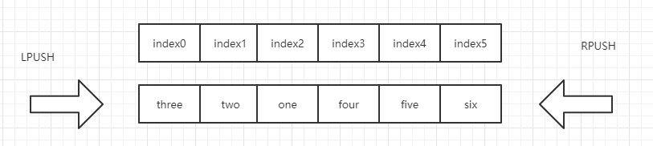

因为只有LINDEX没有RINDEX，所以只能从左侧开始数。

> 这种结构就可以用来做MQ。


### Set

Redis 的 Set 是 String 类型的无序集合。集合成员是唯一的，这就意味着集合中不能出现重复的数据。

Redis 中集合是通过哈希表实现的，所以添加，删除，查找的复杂度都是 O(1)。

下表列出了 Redis 集合基本命令：

| 序号 | 命令及描述                                                   |
| :--- | :----------------------------------------------------------- |
| 1    | [SADD key member1 [member2\]](https://www.runoob.com/redis/sets-sadd.html) 向集合添加一个或多个成员    **存** |
| 2    | [SCARD key](https://www.runoob.com/redis/sets-scard.html) 获取集合的成员数     **获取个数** |
| 3    | [SDIFF key1 [key2\]](https://www.runoob.com/redis/sets-sdiff.html) 返回给定所有集合的差集 |
| 4    | [SDIFFSTORE destination key1 [key2\]](https://www.runoob.com/redis/sets-sdiffstore.html) 返回给定所有集合的差集并存储在 destination 中 |
| 5    | [SINTER key1 [key2\]](https://www.runoob.com/redis/sets-sinter.html) 返回给定所有集合的交集   **存**   case：共同关注 up主 |
| 6    | [SINTERSTORE destination key1 [key2\]](https://www.runoob.com/redis/sets-sinterstore.html) 返回给定所有集合的交集并存储在 destination 中 |
| 7    | [SISMEMBER key member](https://www.runoob.com/redis/sets-sismember.html) 判断 member 元素是否是集合 key 的成员 |
| 8    | [ SMEMBERS key](https://www.runoob.com/redis/sets-smembers.html) 返回集合中的所有成员   **取** |
| 9    | [SMOVE source destination member](https://www.runoob.com/redis/sets-smove.html) 将 member 元素从 source 集合移动到 destination 集合    **删 + 存** |
| 10   | [SPOP key](https://www.runoob.com/redis/sets-spop.html) 移除并返回集合中的一个**随机**元素   **删** |
| 11   | [SRANDMEMBER key [count\]](https://www.runoob.com/redis/sets-srandmember.html) 返回集合中一个或多个**随机**数       **取** |
| 12   | [SREM key member1 [member2\]](https://www.runoob.com/redis/sets-srem.html) 移除集合中一个或多个成员    **删** |
| 13   | [SUNION key1 [key2\]](https://www.runoob.com/redis/sets-sunion.html) 返回所有给定集合的并集   **取** |
| 14   | [SUNIONSTORE destination key1 [key2\]](https://www.runoob.com/redis/sets-sunionstore.html) 所有给定集合的并集存储在 destination 集合中   **存** |
| 15   | [SSCAN key cursor [MATCH pattern\] [COUNT count]](https://www.runoob.com/redis/sets-sscan.html) 迭代集合中的元素 |


> 微博，B站将用户的所有关注放在一个set中，将他的粉丝放到另一个set中。


### Hash

Redis hash 是一个 string 类型的 field 和 value 的映射表，hash 特别适合用于存储对象。

下表列出了 redis hash 基本的相关命令：

| 序号 | 命令及描述                                                   |
| :--- | :----------------------------------------------------------- |
| 1    | [HDEL key field1 [field2\]](https://www.runoob.com/redis/hashes-hdel.html) 删除一个或多个哈希表字段        **删** |
| 2    | [HEXISTS key field](https://www.runoob.com/redis/hashes-hexists.html) 查看哈希表 key 中，指定的字段是否存在。 |
| 3    | [HGET key field](https://www.runoob.com/redis/hashes-hget.html) 获取存储在哈希表中指定字段的值。    **取** |
| 4    | [HGETALL key](https://www.runoob.com/redis/hashes-hgetall.html) 获取在哈希表中指定 key 的所有字段和值      **取**多个 |
| 5    | [HINCRBY key field increment](https://www.runoob.com/redis/hashes-hincrby.html) 为哈希表 key 中的指定字段的**整数值**加上增量 increment 。      **自增**, 设置负数就是减法 |
| 6    | [HINCRBYFLOAT key field increment](https://www.runoob.com/redis/hashes-hincrbyfloat.html) 为哈希表 key 中的指定字段的**浮点数**值加上增量 increment 。 |
| 7    | [HKEYS key](https://www.runoob.com/redis/hashes-hkeys.html) 获取所有哈希表中的字段        **只取key** |
| 8    | [HLEN key](https://www.runoob.com/redis/hashes-hlen.html) 获取哈希表中字段的数量 |
| 9    | [HMGET key field1 [field2\]](https://www.runoob.com/redis/hashes-hmget.html) 获取所有给定字段的值     **取指定的key的value** |
| 10   | ==[HMSET key field1 value1 [field2 value2 \]](https://www.runoob.com/redis/hashes-hmset.html) 同时将多个 field-value (域-值)对设置到哈希表 key 中。== |
| 11   | [HSET key field value](https://www.runoob.com/redis/hashes-hset.html) 将哈希表 key 中的字段 field 的值设为 value 。 |
| 12   | [HSETNX key field value](https://www.runoob.com/redis/hashes-hsetnx.html) 只有在字段 field 不存在时，设置哈希表字段的值。 |
| 13   | [HVALS key](https://www.runoob.com/redis/hashes-hvals.html) 获取哈希表中所有值。     **只取value** |
| 14   | [HSCAN key cursor [MATCH pattern\] [COUNT count]](https://www.runoob.com/redis/hashes-hscan.html) 迭代哈希表中的键值对。 |

```bash
127.0.0.1:6379[1]> HGETALL myhash
1) "name"
2) "kicc"
3) "age"
4) "23"
5) "sex"
6) "male"
7) "nation"
8) "china"
# 获取hash：显示方式 key value key value ...
```

> hash变更的数据user  name  age，尤其是用户信息之类的，经常变动的信息! Hash更适合于对象的存储。
>
> set user:1:name kicc user:1:age 23， 这种存String的方式“存”对象不是那么好。


### Zset

在set的基础上，**增加了一个值**。zset myset score value，增加了一个排序的功能。

 ```bash
#  存储
127.0.0.1:6379[1]> ZADD myset 1 one
(integer) 1
127.0.0.1:6379[1]> zadd myset 2 tow 3 three
(integer) 2
127.0.0.1:6379[1]> ZRANGE myset 0 -1
1) "one"
2) "tow"
3) "three"
127.0.0.1:6379[1]> ZRANGE myset 0 1
1) "one"
2) "tow"
127.0.0.1:6379[1]>

 ```


```bash
# 升序排序
127.0.0.1:6379[1]> zadd salary 5000 xiaoming
(integer) 1
127.0.0.1:6379[1]> zadd salary 2000 xiaohong
(integer) 1
127.0.0.1:6379[1]> zadd salary 500 libai
(integer) 1
127.0.0.1:6379[1]> ZRANGE salary 0 -1
1) "libai"
2) "xiaohong"
3) "xiaoming"
127.0.0.1:6379[1]> ZRANGEBYLEX salary 0 -1
(error) ERR min or max not valid string range item
127.0.0.1:6379[1]> ZRANGEBYLEX salary -inf +inf
(error) ERR min or max not valid string range item

1) "libai"
2) "xiaohong"
3) "xiaoming"
127.0.0.1:6379[1]> ZRANGEBYSCORE salary 0 1000
1) "libai" 
127.0.0.1:6379[1]> ZRANGEBYSCORE salary 0 10000 withscores  # 附带scores
1) "libai"
2) "500"
3) "xiaohong"
4) "2000"
5) "xiaoming"
6) "5000"
127.0.0.1:6379[1]> ZRANGEBYSCORE salary 0 10000 withscores limit 0 1
1) "libai"
2) "500"
127.0.0.1:6379[1]>

# 从大到小排序
127.0.0.1:6379[1]> ZREVRANGE salary 0 -1 withscores
1) "xiaoming"
2) "5000"
3) "xiaohong"
4) "2000"
5) "libai"
6) "500"


######################################################
# 移除zrem

127.0.0.1:6379[1]> ZRANGE salary 0 -1
1) "libai"
2) "xiaohong"
3) "xiaoming"
127.0.0.1:6379[1]> zrem salary xiaoming
(integer) 1
127.0.0.1:6379[1]> ZRANGE salary 0 -1
1) "libai"
2) "xiaohong"
127.0.0.1:6379[1]> ZCARD salary
(integer) 2

```

> 具体的更多的方法根据API看看。

case：

- 普通消息1、重要消息2，进行带权重的判断。
- 排行榜应用的实现。存入一个zset。方便排序比较。


> 面试常客

**谈谈你对Zset的理解？**

Zset的数据结构是一种跳表，即SkipList

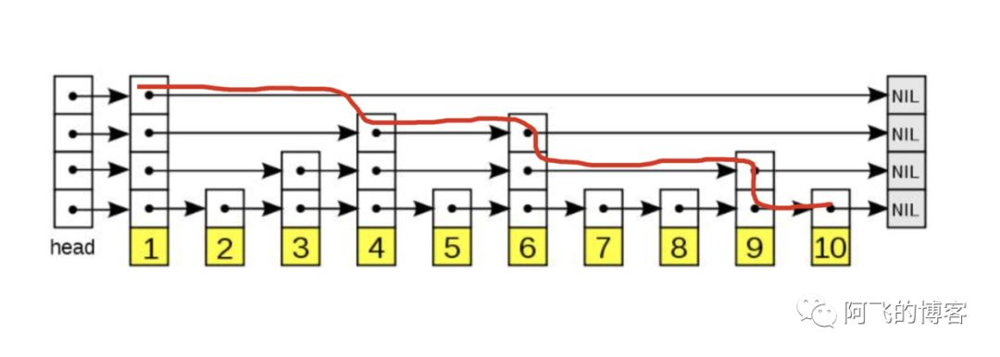


**Zset可以实现多关键字的排序吗**

可以的。类似于MySQL中的以多个列为参数进行order by。

（实际中，我们如果不要求实时性，可以每隔1分钟从MySQL中读取，排好序的List，存入Redis）

如果我们就是要用Redis来实现，我们不会在Redis-cli中写入命令。都是通过Java连接Redis来做的，那么我们可以构造一个特殊的score，这个``score = function(x, y, z)` 用它来进行排序。 其实和Java中的多关键字排序类似。


## 三种特殊数据类型


### Geospatial 地理空间

> 面试

传入一个经度、纬度、地点名称。这样就构造了一个具有地理信息的地点。


朋友的定位，附近的人


> 添加地理位置

```bash
# geoadd 添加地理位置
# 一般在Java程序中调用API或者文件全部导入 
127.0.0.1:6379[1]> GEOADD china:city 
116.40 39.90 beijing 
121.47 31.23 shanghai 
106.50 29.53 chongqing 
114.05 22.52 shenzhen 
120.16 30.24 hangzhou
(integer) 5
127.0.0.1:6379[1]>

```


> 获取地理位置 geopos

```bash
127.0.0.1:6379[1]> GEOPOS china:city shenzhen hangzhou
1) 1) "114.04999762773513794"
   2) "22.5200000879503861"
2) 1) "120.1600000262260437"
   2) "30.2400003229490224"

```


> 两个地点之间的距离 geodist

返回两个给定位置之间的距离。

如果两个位置之间的其中一个不存在， 那么命令返回空值。

指定单位的参数 unit 必须是以下单位的其中一个：

- **m** 表示单位为米。 **默认**
- **km** 表示单位为千米。
- **mi** 表示单位为英里。
- **ft** 表示单位为英尺

```bash
127.0.0.1:6379[1]> GEODIST china:city beijing chongqing
"1464070.8051"
127.0.0.1:6379[1]> GEODIST china:city beijing chongqing km
"1464.0708"

```


> georadius

我附近的人。通过半径来查询

以给定的经纬度为中心， 返回键包含的位置元素当中， 与中心的距离不超过给定最大距离的所有位置元素

```bash
# 以 120 30 为中心 找 china:city 中 500km内的点
127.0.0.1:6379[1]> GEORADIUS china:city 120 30 500 km
1) "hangzhou"
2) "shanghai"
127.0.0.1:6379[1]>

```


> GEORADIUSBYMEMBER

这个命令和 [GEORADIUS](http://www.redis.cn/commands/georadius.html) 命令一样， 都可以找出位于指定范围内的元素， 但是 `GEORADIUSBYMEMBER` 的中心点是由给定的位置元素决定的， 而不是像 [GEORADIUS](http://www.redis.cn/commands/georadius.html) 那样， 使用输入的经度和纬度来决定中心点


> GEO底层的实现原理：就是ZSET

```bash
# 查看所有
127.0.0.1:6379[1]> ZRANGE china:city 0 -1
1) "chongqing"
2) "shenzhen"
3) "hangzhou"
4) "shanghai"
5) "beijing"
# 移除指定元素
127.0.0.1:6379[1]> zrem china:city shenzhen
(integer) 1

```


> 面试问题：Geospatial底层是用什么实现的？

因为经常需要用到排序这个特性，Geo的底层其实是用Zset进行实现的。同时通过GetHash技术进行数值填充。因为本身输入的参数是有经度和纬度两个参数，我们需要借助GeoHash运算得到一个一维的长度为52的整数编码。将这个值作为score值输入Zset中。同样，在获取的时候，通过排序得到对应的Hash数值，再反解码得到经纬度。

**总体流程**

总之，Redis中处理这些地理位置坐标点的思想是：二维平面坐标点 --> 一维整数编码值 --> zset(score为编码值) --> zrangebyrank(获取score相近的元素)、zrangebyscore --> 通过score(整数编码值)反解坐标点 --> 附近点的地理位置坐标。


### Hyperloglog：用来计数

> 什么是基数

A {1, 3, 5, 7, 9, 7}

B {1, 3, 5, 7, 8}

基数（不重复的元素） = 9，可接受误差。


看似和HashSet没有什么区别，都是用来做除重的。

但当参与问题中的变量达到一定数量级的时候，再简单的问题都会变成一个难题。假设 APP 中日活用户达到`百万`或`千万以上级别`的话，我们采用 `HashMap` 的做法，就会导致程序中占用大量的内存。


> 简介

Redis 2.8.9 更新了hyperloglog的数据结构！它是用来做**基数统计**的算法！

HyperLogLog 的优点是，在输入元素的数量或者体积非常非常大时，计算基数所需的空间总是固定 的、并且是很小的。

下表列出了 redis HyperLogLog 的基本命令：PF开头

| 序号 | 命令及描述                                                   |
| :--- | :----------------------------------------------------------- |
| 1    | [PFADD key element [element ...\]](https://www.runoob.com/redis/hyperloglog-pfadd.html) 添加指定元素到 HyperLogLog 中。 |
| 2    | [PFCOUNT key [key ...\]](https://www.runoob.com/redis/hyperloglog-pfcount.html) 返回给定 HyperLogLog 的基数估算值。 |
| 3    | [PFMERGE destkey sourcekey [sourcekey ...\]](https://www.runoob.com/redis/hyperloglog-pfmerge.html) 将多个 HyperLogLog 合并为一个 HyperLogLog |

```bash
127.0.0.1:6379[1]> PFADD mykey1 a b c d e f g h i j  # 创建第一组元素
(integer) 1
127.0.0.1:6379[1]> PFCOUNT mykey1	# 统计基数
(integer) 10
127.0.0.1:6379[1]> PFADD mykey2 i k a f g ga w e r h sd x c z a q	# 创建第一组元素
(integer) 1
127.0.0.1:6379[1]> PFCOUNT mykey2	# 统计基数
(integer) 15
127.0.0.1:6379[1]> PFMERGE mykey3 mykey1 mykey2	# 合并两个hyperloglog
OK
127.0.0.1:6379[1]> PFCOUNT mykey3	# 不重复的元素
(integer) 18

```

应用场景：

- 统计计数，比如用户的访问数。同一个用户的多次访问只算一次。


如果允许误差错误，那么就可以使用Hyperloglog，大数据下更有效。

如果不允许一点错误，就使用set或者自己的数据类型。


详细数学推导：https://juejin.im/post/6844903785744056333#heading-10


### Bitmap

> 两个状态码的场景就很适用。

case：

- 统计用户信息，活跃、不活跃。

- 登录、未登录。
- 365天打卡。365个0，打卡就是1，不是打卡就0。

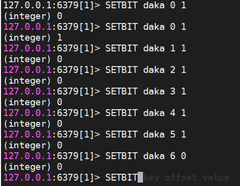

假设统计一周七天的打卡情况，没打卡就是0， 打卡了就是1.

```bash
setbit key offset value
```

上图表示的意思就是0-5天都打卡了，但是第7天没有打卡。

现在我需要统计打卡的总天数，我只要获取多少个1就可以了。！


**查看某一天是否打卡：**

```bash
127.0.0.1:6379[1]> GETBIT daka 4
(integer) 1
127.0.0.1:6379[1]> GETBIT daka 6
(integer) 0
127.0.0.1:6379[1]> GETBIT daka 5
(integer) 1

```


**统计打卡的天数：**

```bash
# 统计这周打卡记录
127.0.0.1:6379[1]> BITCOUNT daka
(integer) 6

```


> 面试

这个就是Redis实现的BloomFilter，BloomFilter非常简单，如下图所示，假设已经有3个元素a、b和c，分别通过3个hash算法h1()、h2()和h3()计算然后对一个bit进行赋值，接下来假设需要判断d是否已经存在，那么也需要使用3个hash算法h1()、h2()和h3()对d进行计算，然后得到3个bit的值，恰好这3个bit的值为1，这就能够说明：**d可能存在集合中**。再判断e，由于h1(e)算出来的bit之前的值是0，那么说明：**e一定不存在集合中**：

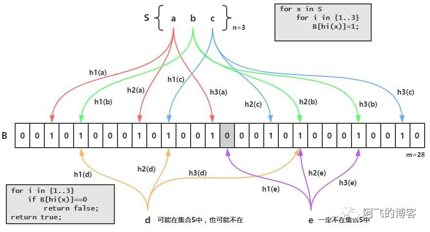

BloomFilter

需要说明的是，bitmap并不是一种真实的数据结构，它本质上是**String**数据结构，只不过操作的粒度变成了位，即bit。因为String类型最大长度为512MB，所以bitmap最多可以存储2^32个bit。


## 事务

Redis事务的本质：一组命令的集合！一组事务中的所有命令都会被序列化，在事务执行过程中，会按顺序执行！

一次性、顺序性、排他性。执行一些命令。

```
------ 队列   set   set   set  执行 -------
```

==Redis事务没有隔离级别的概念！==

所有的命令在事务中，并没有直接被执行！只有发起执行命令的时候才会被执行。  Exec

==Redis单挑命令是保存原子性的，但是事务不保证原子性！==

Redis事务：

- 开启事务（multi）
- 命令入队（）
- 执行事务（Exec）

> 正常执行一组事务

```bash
# 执行一组事务
127.0.0.1:6379[1]> multi
OK
127.0.0.1:6379[1]> set k1 v1
QUEUED
127.0.0.1:6379[1]> set k2 v2
QUEUED
127.0.0.1:6379[1]> get k1
QUEUED
127.0.0.1:6379[1]> set k3 v3
QUEUED
127.0.0.1:6379[1]> exec
1) OK
2) OK
3) "v1"
4) OK

```

> 放弃一组事务

```bash

127.0.0.1:6379[1]> multi
OK
127.0.0.1:6379[1]> set k1 v1
QUEUED
127.0.0.1:6379[1]> set k2 v2
QUEUED
127.0.0.1:6379[1]> get k1
QUEUED
127.0.0.1:6379[1]> set k4 v4
QUEUED
127.0.0.1:6379[1]> discard
OK
127.0.0.1:6379[1]> get k4
(nil)
```


> 编译型异常（代码有问题、命令有错），事务中所有的命令都不会被执行


> 运行时异常（比如1/0），如果事务队列中存在语法性错误，那么执行命令的时候，其他命令是可以正常执行的。错误的那句不执行。


> 监控！

乐观锁：

- 很乐观。认为什么时候都不会出现问题。就不会加锁。更新数据的时候判断一下，在过程中是否有人修改过数据。**（每次比较一个version字段）**
- 获取version
- 更新的时候比较version是否有无改动


悲观锁：

- 很悲观！什么时候都会出现问题。必须加锁。（加锁肯定影响性能）

> Redis的监控  watch 命令 是一种乐观锁

**一、正常的执行**

```bash
127.0.0.1:6379[1]> set money 100
OK
127.0.0.1:6379[1]> set out 0
OK
127.0.0.1:6379[1]> watch money   # 监视money对象
OK
127.0.0.1:6379[1]> multi 	# 事务正常结束，数据期间没有发生变动
OK
127.0.0.1:6379[1]> DECRBY money 20
QUEUED
127.0.0.1:6379[1]> INCRBY out 20
QUEUED
127.0.0.1:6379[1]> exec
1) (integer) 80
2) (integer) 20

```


**二、测试多线程修改值**

```bash
127.0.0.1:6379[1]> watch money   # 监视money对象
OK
127.0.0.1:6379[1]> multi 	# 事务还没有执行exec，但是有另一个线程先改变了money的值，事务就会执行失败
OK
127.0.0.1:6379[1]> DECRBY money 20
QUEUED
127.0.0.1:6379[1]> INCRBY out 20
QUEUED
127.0.0.1:6379[1]> exec  # 通过监视money对象，发现exec的时候跟进入事务的时候money已经被改变了！ 所以不能执行成功
(nil)
127.0.0.1:6379[1]> unwatch   # 放弃之前的监视
OK
```

执行失败怎么办？

1. unwatch 放弃之间对对象的监视
2. 再次watch监视
3. 重新执行之前的事务（再过一遍）


## Jedis

使用Jedis来操作Redis

> 什么是Jedis 是Redis官方推荐的Java连接开发工具！使用Java操作Redis中间件！如果你要使用Java操作Redis，那么一定要对Jedis十分的熟悉！

```xml
依赖导入
<dependencies>
    <dependency>
        <groupId>redis.clients</groupId>
        <artifactId>jedis</artifactId>
        <version>2.9.0</version>
    </dependency>

    <dependency>
        <groupId>com.alibaba</groupId>
        <artifactId>fastjson</artifactId>
        <version>1.2.70</version>
    </dependency>
</dependencies>
```


测试连接

```java
public class TestPing {

    public static void main(String[] args) {
        // 1、 new jedis对象
        Jedis jedis = new Jedis("192.168.1.114", 6379);
        System.out.println(jedis);
        String name = jedis.get("name");
        System.out.println(name);

        System.out.println(jedis.ping());

    }
}
```

> Jedis的所有方法和redis-cli的命令都是一一对应的。


**Jedis操作事务**

```java
public class TestPing {

    public static void main(String[] args) {
        // 1、 new jedis对象
        Jedis jedis = new Jedis("192.168.1.114", 6379);
        JSONObject jsonObject = new JSONObject();
        jsonObject.put("name", "kicc");
        jsonObject.put("age", 23);


        // 开启事务
        Transaction multi = jedis.multi();
		// 如果要监控
        jedis.watch()
        try {
			
            multi.set("user1", jsonObject.toJSONString());
            // 执行
            multi.exec();
        } catch (Exception e) {
            // 放弃事务
            multi.discard();
            e.printStackTrace();
        } finally {
            jedis.close();
        }
        
    }
}
```


## SpringBoot整合

spring-security、spring-data和springboot是同一层级的框架。

说明：在SpringBoot2.x之后，原来使用的jedis被替换为lettuce？

jedis：采用的直连，多个线程操作的话，是不安全的。如果想要避免不安全的，使用jedis pool连接池！ 更像BIO

lettuce：采用netty，实例可以再多个线程中进行共享，不存在线程不安全的情况！可以减少线程数量。更像NIo


> 整合测试一下

老规矩，先看看源码

```java
@Configuration(proxyBeanMethods = false)
@ConditionalOnClass(RedisOperations.class)
@EnableConfigurationProperties(RedisProperties.class)
@Import({ LettuceConnectionConfiguration.class, JedisConnectionConfiguration.class })
public class RedisAutoConfiguration {

   @Bean
   @ConditionalOnMissingBean(name = "redisTemplate") // 如果我们自定义一个redisTemplate，就可以把这个覆盖
   // 默认的redisTempalte没有过多的设置，不实现序列化
   // 两个泛型都是Object，我们使用需要强转为<String, Object>
   public RedisTemplate<Object, Object> redisTemplate(RedisConnectionFactory redisConnectionFactory)
         throws UnknownHostException {
      RedisTemplate<Object, Object> template = new RedisTemplate<>();
      template.setConnectionFactory(redisConnectionFactory);
      return template;
   }

    // 因为最常用的是String类型的redis，因此额外多一个StringRedisTemplate
    // StringRedisTemplate就是把 key\value\hashKey\hashValue都设置成了String类型
   @Bean
   @ConditionalOnMissingBean  
   public StringRedisTemplate stringRedisTemplate(RedisConnectionFactory redisConnectionFactory)
         throws UnknownHostException {
      StringRedisTemplate template = new StringRedisTemplate();
      template.setConnectionFactory(redisConnectionFactory);
      return template;
   }

}
```


看看用法：

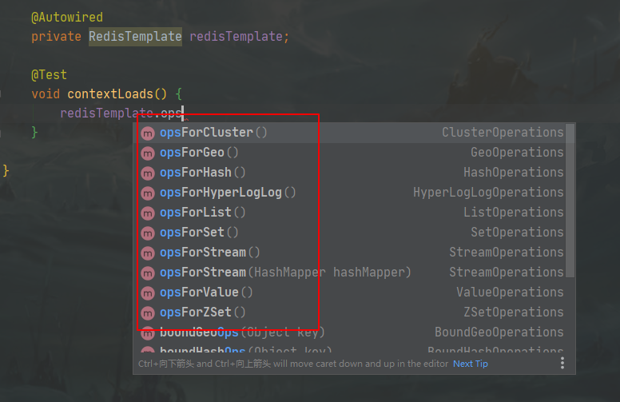

.opsForXxxx用于操作不同的数据类型。ForValue是操作String类型。


**无法连接Redis：**

```bash
# 开放防火墙端口
firewall-cmd --zone=public --add-port=6379/tcp --permanent
```


- 获取redis的连接

    ```java
    RedisConnection connection = redisTemplate.getConnectionFactory().getConnection();
    // 用connection操作flushdb flushAll操作！
    connection.flushAll();
    ```

- 来个get set

    ```java
    @Test
    void contextLoads() {
        RedisConnection connection = redisTemplate.getConnectionFactory().getConnection();
        connection.flushAll();
        
        redisTemplate.opsForValue().set("name", "kicc");
        redisTemplate.opsForValue().get("name");
    }
    ```


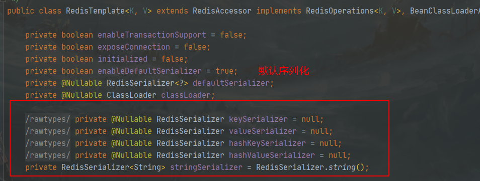

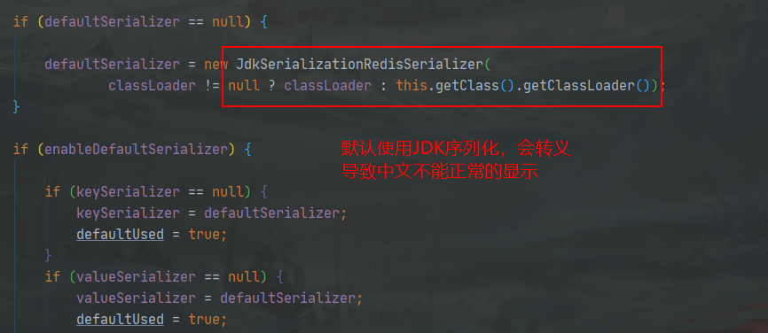

> 因为默认的ReidsTemplate配置不是很多，所以最好是自己配置一下。


真实开发中，都传递Json对象。

```java
@Test
void test() {

    User kicc = new User("Kicc", "123456...");

    String s = JSON.toJSONString(kicc);
    // 存入一个user序列化为Json的String
    redisTemplate.opsForValue().set("user", s);
    
    Object user = redisTemplate.opsForValue().get("user");
    System.out.println(user);

}
```

查看Redis-cli

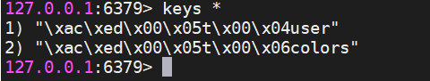

**显示是用问题的。**

解决办法：

- 将redisTemplate的key的序列化方式改为StringRedisSerialize

    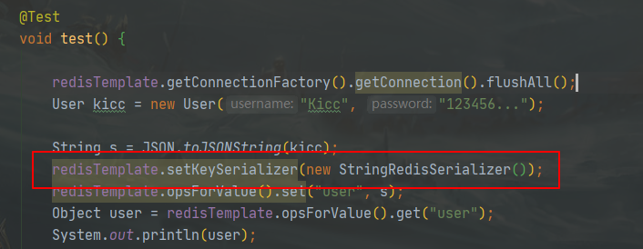

- 直接使用StringRedisTemplate 

- 我们需要编写一个自己的redis配置。

    ```java
    @Configuration
    public class RedisConfig {
    
        /**
         *
         * @param redisConnectionFactory
         * @return
         * @throws UnknownHostException
         */
        @Bean
        public RedisTemplate<String, Object> redisTemplate(RedisConnectionFactory redisConnectionFactory)
                throws UnknownHostException {
            RedisTemplate<String, Object> template = new RedisTemplate<>();
            template.setConnectionFactory(redisConnectionFactory);
    
            // FastJson序列化配置，不需要ObjectMapper
            FastJsonRedisSerializer fastJsonRedisSerializer = new FastJsonRedisSerializer(Object.class);
    
    
            ObjectMapper objectMapper = new ObjectMapper();
            objectMapper.setVisibility(PropertyAccessor.ALL, JsonAutoDetect.Visibility.ANY);
            //objectMapper.enableDefaultTyping(ObjectMapper.DefaultTyping.NON_FINAL); 这个方法在jackson Since 2.10版本中移除掉了
            objectMapper.activateDefaultTyping(BasicPolymorphicTypeValidator.builder().build(),ObjectMapper.DefaultTyping.NON_FINAL);
    
            Jackson2JsonRedisSerializer<Object> jackson2JsonRedisSerializer = new Jackson2JsonRedisSerializer<>(Object.class);
            jackson2JsonRedisSerializer.setObjectMapper(objectMapper);
    
    		// 给key设置String的序列化方式
            template.setKeySerializer(new StringRedisSerializer());
            // 给value设置String的序列化方式， 目前没看出了fastJson的序列化和JackSon的区别
            template.setValueSerializer(jackson2JsonRedisSerializer);
            // 给hashkey设置String的序列化方式
            template.setHashKeySerializer(new StringRedisSerializer());
            // 给hashValue设置String的序列化方式
            template.setHashValueSerializer(jackson2JsonRedisSerializer);
    		
            // 加载配置
            template.afterPropertiesSet();
    
    
            return template;
        }
    }
    ```


**提取最常用的操作编写RedisUtils工具类，过一遍很适合把RedisTemplate快速掌握！**

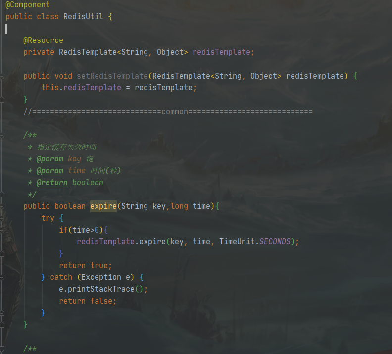


## Redis 过期策略

主要有两种思路，一种是定期删除，另一种是惰性删除。


### 定期删除

> 设定一个时间，在 Redis 中默认是每隔 100ms 就随机抽取一些设置了过期时间的 key，检查其是否过期，如果过期就删除。

注意这里是随机抽取一些设置了过期时间的 key ，而是扫描所有，试想这样一个场景，如果我有 100w 个设置了过期时间的 key ，如果每次都全部扫描一遍，基本上 Redis 就死了， CPU 的负载会非常的高，全部都消耗在了检查过期 key 上面。


### 惰性删除

> 惰性删除的意思就是当 key 过期后，不做删除动作，等到下次使用的时候，发现 key 已经过期，这时不在返回这个 key 对应的 value ，直接将这个 key 删除掉。

这种方式有一个致命的弱点，就是会有很多过期的 key-value 明明已经到了过期时间，缺还在内存中占着使用空间，大大降低了内存使用效率。

**所以 Redis 的过期策略是：定期删除 + 惰性删除。** 但是，还是不保险，定期+惰性也没能在一定时间内删除过多的 key的话，那咋办？


### 内存淘汰制度

> 用来解决过期策略不足

- noeviction: 当内存不足以容纳新写入数据时，新写入操作会报错。这个一般没啥人用吧，太傻了。
- allkeys-lru：当内存不足以容纳新写入数据时，在键空间中，移除最近最少使用的 key（这个是最常用的）。
- allkeys-random：当内存不足以容纳新写入数据时，在键空间中，随机移除某个 key。这个一般没人用吧，为啥要随机，肯定是把最近最少使用的 key 给干掉啊。
- volatile-lru：当内存不足以容纳新写入数据时，在设置了过期时间的键空间中，移除最近最少使用的 key（这个一般不太合适）。
- volatile-random：当内存不足以容纳新写入数据时，在设置了过期时间的键空间中，随机移除某个 key。这个一般也没人用吧。
- volatile-ttl：当内存不足以容纳新写入数据时，在设置了过期时间的键空间中，有更早过期时间的 key 优先移除。

面试官：来给爷写一个LRU 

[LRU的实现]: ../刷题/数据结构与算法.md#链表


## Redis.conf详解

配置时，都靠配置文件来启动！

> 内存大小设置，大小写不敏感

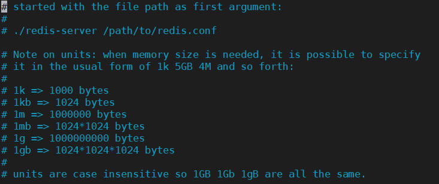

> 包含多个配置文件

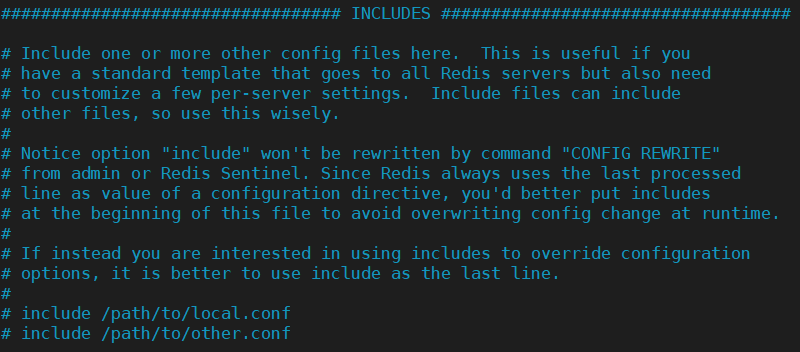


> 网络

一、绑定的IP

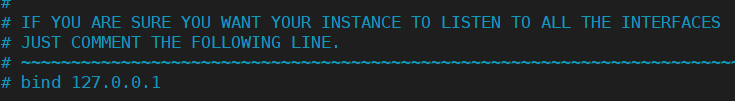


二、


> 通用

```bash
daemonize yes # 后台守护进程方式
pidfile /var/run/redis_6379.pid  # 如果以后台方式运行，我们就需要指定一个pid进程文件

# 日志
# Specify the server verbosity level.
# This can be one of:
# debug (a lot of information, useful for development/testing)
# verbose (many rarely useful info, but not a mess like the debug level)
# notice (moderately verbose, what you want in production probably)  生产环境使用
# warning (only very important / critical messages are logged)	
loglevel notice

# 文件名 ”“表示标准输出
logfile ""


```


> 快照

持久化操作。在规定的时间内，执行了多少次操作，则会持久化到文件。 .rdb 和 .aof文件。

redis 是 内存数据库，如果没有持久化，数据断电即失。

```bash

# 
#   In the example below the behaviour will be to save:
#   after 900 sec (15 min) if at least 1 key changed
#   after 300 sec (5 min) if at least 10 keys changed
#   after 60 sec if at least 10000 keys changed
#
#   Note: you can disable saving completely by commenting out all "save" lines.
#
#   It is also possible to remove all the previously configured save
#   points by adding a save directive with a single empty string argument
#   like in the following example:
#
#   save ""

save 900 1   # 900秒 超过一个key修改，进行持久化
save 300 10  # 30秒内 超过10个key修改，进行持久化
save 60 10000 # 高并发下的持久化策略

# 
stop-writes-on-bgsave-error yes

# 是否压缩rdb文件，需要消耗cpu
rdbcompression yes
# 检查rdb文件的校验
rdbchecksum yes

# rdb的文件和路径
dbfilename dump.rdb
dir ./

```


> Replication 主从复制


> Security 安全

```bash
# 密码的设置
127.0.0.1:6379> ping
PONG
127.0.0.1:6379> config get requiredpass
(empty list or set)
127.0.0.1:6379> config get requirepass
1) "requirepass"
2) ""
127.0.0.1:6379> config set requirepass 123456
OK
127.0.0.1:6379> ping
(error) NOAUTH Authentication required.
127.0.0.1:6379> auth 123456
OK
127.0.0.1:6379> ping
PONG

```


> 客户端限制

```bash

# maxclients 10000

# 如果内存满了，怎么处理
# maxmemory-policy noeviction
# 6个策略
noeviction:默认策略，不淘汰，如果内存已满，添加数据是报错。
allkeys-lru:在所有键中，选取最近最少使用的数据抛弃。
volatile-lru:在设置了过期时间的所有键中，选取最近最少使用的数据抛弃。
allkeys-random: 在所有键中，随机抛弃。
volatile-random: 在设置了过期时间的所有键，随机抛弃。
volatile-ttl:在设置了过期时间的所有键，抛弃存活时间最短的数据。
```


> APPEND ONLY MODE aof模式

```bash
# 默认使用rdb持久化，所以不开启aof。一般rdb够用了。
appendonly no

# 默认文件名
appendfilename "appendonly.aof"

# 同步策略
# appendfsync always
appendfsync everysec
# appendfsync no


```


## Redis持久化

内存数据化必须要有的功能。

#### RDB


在指定时间间隔内将内存中的数据集快照写入磁盘，恢复时将快照文件直接读入内存。

> 如何操作？

Redis会单独创建（fork）一个子进程来进行持久化，会先将数据写入到一个临时文件中，待持久化过程都结束了，再用这个临时文件替换上次持久化文件。整个过程中，主进程不进行IO操作。保证的性能。如果需要进行大规模的数据恢复，且对于数据恢复的完整性==不是非常敏感==，那么RDB的方式比AOF更加高效。RDB的缺点就是最后一次持久化之后的数据可能丢失。

RDB保存的文件是 dump.rdb

> 触发规则

1、save的规则满足的条件下，会自动触发rdb规则

2、执行flushall命令时

3、退出redis


> 恢复rdb文件

只需要将rdb文件放在我们redis启动目录下就可以，redis启动的时候会自动检查dump.rdb。不需要手动导入。

```bash

127.0.0.1:6379> config get dir
1) "dir"
2) "/usr/local/bin"
127.0.0.1:6379>

```

优点：

- 适合大规模的数据恢复
- 对数据的完整性要求不高（万一最后一次还没来得及持久化）
- RDB'数据恢复的速度很快
- 开启子进程进行持久化的操作，对于主进程的读写操作的影响小

缺点：

- 需要一定的时间间隔修改； 万一宕机，最后一次数据的修改就没了。这段时间可能是几分钟。
- fork时，会占用一定内存空间。当数据快照文件非常大的时候，服务可能会有一定时间的暂停。
- 


#### AOF （Append Only File)

将我们所有的命令都记录下来，history，恢复的时候重新把命令执行一遍。

> 使用 AOF 做持久化，每一个写命令都通过write函数追加到 appendonly.aof 中,


以日志的形式来记录每个写操作，将Redis执行过的所有指令记录下来**（读操作不记录）**，只许追加文件但不可以改写文件，redis驱动之初会读取该文件重新构建数据，换言之，redis重启的话就根据日志文件的内容将指令从前到后执行一次以完成数据的恢复工作

==Aof保存的是 appendonly.aof文件==。大规模数据情况下，恢复起来比较慢。

redis.conf默认不开启aof，需要手动开启。


来看一下appendonly.aof长什么样子

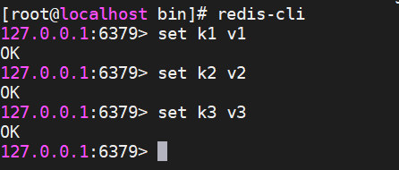

```bash
# 查看appendonly.aof文件
*2
$6
SELECT
$1
0
*3
$3
set
$2
k1
$2
v1
*3
$3
set
$2
k2
$2
v2
*3
$3
set
$2
k3
$2
v3

```

我们插入了三个key-value，查看.aof文件后发现，保存的就是所有的操作记录。	

假设现在我们人为修改了aof文件，文件毫无疑问地遭到了破坏！那么我们重启redis-server之后是无法直接连接上的！（因为有错误！）

此时，我们需要使用 redis-check-aof 来帮助恢复。


```bash
# 修复
redis-check-aof --fix appendonly.aof
```


> 优点和缺点

优点：

- 每一次修改都同步 （默认每秒修改）。文件的完整性更好。最多就丢不到一秒的数据
- AOF 日志文件以 `append-only` 模式写入，所以没有任何磁盘寻址的开销，写入性能非常高，而且文件不容易破损，即使文件尾部破损，也很容易修复。
- 

缺点：

- 性能不高，aof修复的速度远远不如rdb。
- Aof的运行效率也不行。（写操作）
- AOF的文件很大，比RDB要大


#### 两个的直观比较


**区别：**

- RDB持久化是指在指定的时间间隔内将内存中的数据集快照写入磁盘，实际操作过程是fork一个子进程，先将数据集写入临时文件，写入成功后，再替换之前的文件，用二进制压缩存储。

- AOF持久化以日志的形式记录服务器所处理的每一个写、删除操作，查询操作不会记录，以文本的方式记录，可以打开文件看到详细的操作记录。


#### 使用建议

当同时开启RDB和AOF时，redis重启后会优先载入AOF文件来恢复数据。因为通常情况下，AOF文件保存的数据要比RDB更加完整。

> 性能建议

- 因为RDV文件只用作后备用途，建议只在Slave上持久化RDB文件。而且15分钟一次备份就够。只保留save 900 1这条规则。
- 如果Enable AOF，好处是最恶劣情况下也只会丢失不超过两秒的数据，启动脚本较简单只load自己的aof文件就可以。代价是带来了持续的IO，**二是AOF rewrite的最后将rewrite过程中产生的新数据写到新文件造成的阻塞几乎是不可避免的。**只要硬盘许可，应该尽量减少AOF rewrite的频率。AOF重写的基础大小默认是64M，太小了！可以设置为5G，默认超过原大小100%大小重写可以改到适当的百分数。
- 如果不Enable AOF，仅仅靠Master-Slave Replication 实现高可用性也可以，能省掉一大笔IO，也减少了rewrite时候带来的系统波动。代价是如果Master和Slave同时倒掉，会丢失十几分钟的数据，启动脚本也要比较两个Master\Slave中的RDB文件，载入较新的哪个，微博就是这种架构。


## Redis发布订阅

Redis 发布订阅 （pub/sub） 是一种消息通信模式：发送者(pub)发送消息，订阅者(sub)接受消息。**微信公众号、微博等关注系统**

Redis客户端可以订阅任意数量的频道。

订阅/发布消息图：

需要三部分：1、消息发送者，2、频道，3、消息订阅者

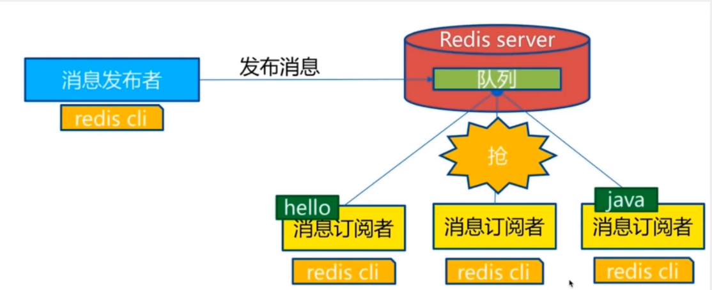


下图展示了频道 channel1 ， 以及订阅这个频道的三个客户端 —— client2 、 client5 和 client1 之间的关系：


当有新消息通过 PUBLISH 命令发送给频道 channel1 时， 这个消息就会被发送给订阅它的三个客户端：


下表列出了 redis 发布订阅常用命令：

| 序号 | 命令及描述                                                   |
| :--- | :----------------------------------------------------------- |
| 1    | [PSUBSCRIBE pattern [pattern ...\]](https://www.runoob.com/redis/pub-sub-psubscribe.html) 订阅一个或多个符合给定模式的频道。 |
| 2    | [PUBSUB subcommand [argument [argument ...\]]](https://www.runoob.com/redis/pub-sub-pubsub.html) 查看订阅与发布系统状态。 |
| 3    | [PUBLISH channel message](https://www.runoob.com/redis/pub-sub-publish.html) 将信息发送到指定的频道。 |
| 4    | [PUNSUBSCRIBE [pattern [pattern ...\]]](https://www.runoob.com/redis/pub-sub-punsubscribe.html) 退订所有给定模式的频道。 |
| 5    | [SUBSCRIBE channel [channel ...\]](https://www.runoob.com/redis/pub-sub-subscribe.html) 订阅给定的一个或多个频道的信息。 |
| 6    | [UNSUBSCRIBE [channel [channel ...\]]](https://www.runoob.com/redis/pub-sub-unsubscribe.html) 指退订给定的频道。 |

**测试：**

- 打开一个redis-cli，开启订阅

    ```bash
    127.0.0.1:6379> SUBSCRIBE kuangshenshuo
    Reading messages... (press Ctrl-C to quit)
    1) "subscribe"
    2) "kuangshenshuo"
    ```

- 打开另一个redis-cli，发布消息

    ```bash
    127.0.0.1:6379> PUBLISH kuangshenshuo "hello everyone!"
    (integer) 1
    ```

    第一个cli中可以看到发送的消息：

    ```bash
    127.0.0.1:6379> SUBSCRIBE kuangshenshuo
    Reading messages... (press Ctrl-C to quit)
    1) "subscribe"
    2) "kuangshenshuo"
    3) (integer) 1
    1) "message"  # 消息
    2) "kuangshenshuo"	# 频道
    3) "hello everyone!"	# 具体内容
    ```

- 

> 原理

Redis是使用C实现，通过分析Redis源码里的pubsub.c文件。可以了解发布和订阅机制的底层。

Redis通过PUBLISH、SUBSCRIBE和PSUBSCRIBE等命令实现发布和订阅功能。

通过SUBSCRIBE命令订阅某频道之后，redis-server里维护了一个字典，字典的键就是一个个channel，而字典的值则是一个链表，链表中保存了所有订阅这个channel的客户端。SUBSCRIBE命令的关键，就是将客户端添加到给定channel的订阅链表中。

通过PUBLISH命令向订阅者发送消息，redis-server会使用给定的频道作为键，在它所维护的channel字典中查找记录了订阅这个频道的所有客户端链表，遍历这个链表，将消息发布给所有订阅者。


> 使用场景

1、实时消息系统

2、实时聊天 （频道当作聊天室，将消息回显给所有人即可）

3、订阅，关注系统都是可以的。

4、稍微复杂的场景就有使用MQ来完成。


## Redis主从复制

高可用，哨兵模式

高可用是分为两步走的：

1. 主从复制保证了读的高可用，但是当Master宕机的时候，写操作就不行了
2. 哨兵模式使Master宕机的时候，slave可以接替Master的任务。从而实现写的高可用


### 概念

主从复制，是指将一台Redis服务器的数据，复制到其他Redis服务器。前者称为（Master/Leader)。后者就是（Slave/follower）。

==数据的传输是单向的==，只能从Master到Slave。一般我们用Master来进行写操作，Slave进行读操作。使读写分离，提高性能。


**主从复制的作用**：

1、数据冗余：数据热备份，持久化之外的一种数据冗余方式

2、故障恢复：当一个节点出现问题的时候，可以 由其他备份机器正常工作并故障快速恢复

3、负载均衡：分担一台服务器压力

4、高可用（集群）基石：除了上述作用以外，主从复制还是哨兵和集群能够实施的基础，因此说主从复制是Redis高可用的基础。


查看服务器信息：

```bash
127.0.0.1:6379> info replication
# Replication
role:master  # 角色名
connected_slaves:0  # 从机状态
master_replid:46ea288c6299cbc0e2c1df4f3c82785b7b332044
master_replid2:0000000000000000000000000000000000000000
master_repl_offset:0
second_repl_offset:-1
repl_backlog_active:0
repl_backlog_size:1048576
repl_backlog_first_byte_offset:0
repl_backlog_histlen:0

```


> 使用一主二从进行测试

模式1

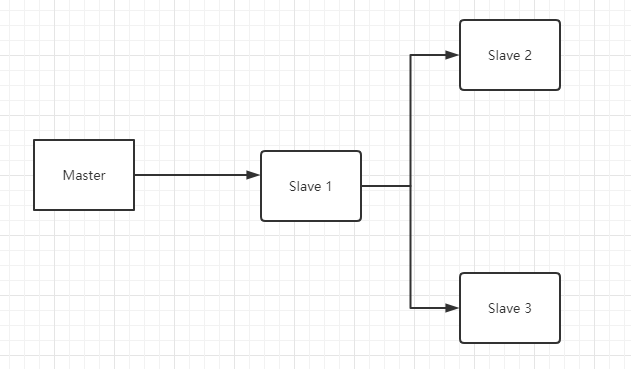

模式2

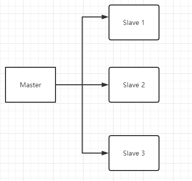

模式3...

> 保证有一个主机就可以，从机怎么连接无所谓的。


因为我们启动Server是读取配置文件的，所以对于每一个Server，都需要单独配置一个自己的redis.conf。

需要配置的项：

- port
- pid
- dump.rdb
- logfile

在没有配置从机之前，所有的server都是主机，相互之间也没有联系。配置只需要将从机找到自己的Master就可以了。

**cli中配置：**

```bash
# 这样的配置是暂时的，如果需要永久有效在redis.conf文件中replication一节中配置即可。
SLAVEOF HOST PORT
```

cli中恢复master（从slave）

```bash
SLAVEOF no one
```


在这个配置文件中配置后就是永久的主从关系了！

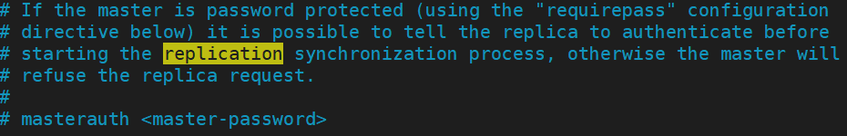


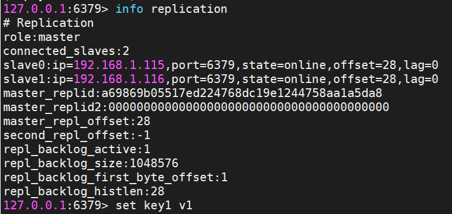

**默认情况下，只有主机可以写，从机只能读取。**


> 复制原理

Slave**启动**并且**成功连接**到master后会发送一个sync同步命令

Master接到命令，启动后台的存盘进程，同时收集所有接受到的用于修稿数据集命令，在后台进程执行完毕之后，master将传送的整个数据文件到slave，完成一次同步。

- 全量复制：Master将当前内存中的所有数据通过bgsave存到RDB文件中，发送给slave, slave的服务在接受到数据库文件数据后，将其存盘并加载到内存中。
    - 从 Redis 2.8.18 版开始支持无盘复制，master一边遍历内存，一边将序列化的内容传递给slave
- 增加复制：Master继续将新的所有收集到的修改命令依次传给slave，并完成同步

==但是只要是重新连接master，一次完全同步（全量复制）将被自动执行==


**问题：当一个主机宕机时，从机依旧是从机。无法进行写操作。**

如果master断开，使用命令 `SLAVEOF no one`，使从机成为一个主机。


### 哨兵模式 （Sentinel）

[哨兵模式详解]: https://www.geekdigging.com/2020/07/16/8662209381/


> 当一个主机宕机，就自动会出现一个新的主机

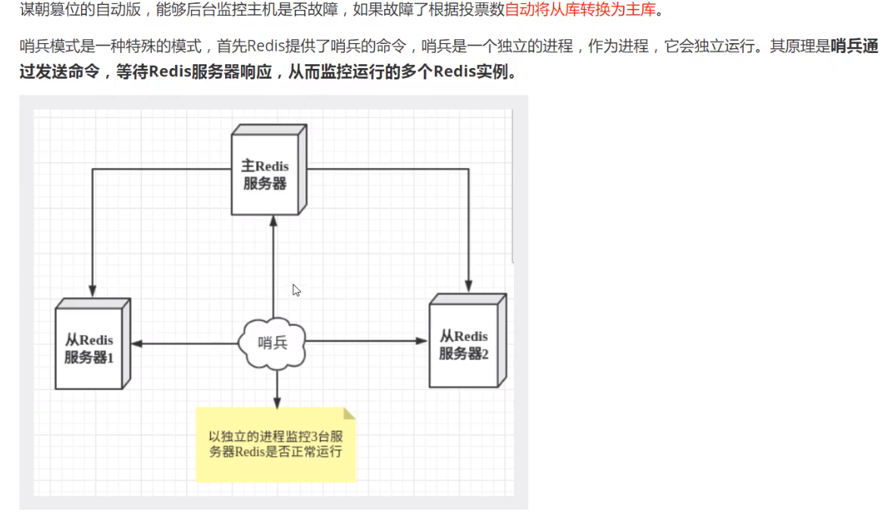

哨兵是一个独立的进程，通过不断地与服务器交互，判断各个服务器的状态。当有一个服务器不响应的时候，就已经挂了。这个时候哨兵将做出行动解决问题。


> 哨兵测试

目前是一主二从状态。

### Redis Sentinel规划

|      IP       | 端口号 |           角色           |
| :-----------: | :----: | :----------------------: |
| 192.168.1.114 |  6379  |       Redis Master       |
| 192.168.1.115 |  6379  | Redis Master/Slave（默认 |
| 192.168.1.116 |  6379  | Redis Master/Slave（默认 |
| 192.168.1.114 | 26379  |         Sentinel         |
| 192.168.1.115 | 26379  |         Sentinel         |
| 192.168.1.116 | 26379  |         Sentinel         |


启动顺序：Master -> Slave -> Sentinel


1、配置哨兵文件sentinel.conf

```bash
# myredis【主机】 的名字 自定义 最后的1表示需要多少个哨兵同意
# 三个ip的sentinel.conf文件都一致
# redis-server的配置不一样
sentinel monitor myredis 127.0.0.1 1
```

2、启动哨兵

**启动完三个server之后，启动三个哨兵。**

```bash
redis-sentinel redisconfig/sentinel.conf
```

```bash
[root@localhost bin]# redis-sentinel redisconfig/sentinel.conf
59458:X 20 Jul 2020 16:36:27.988 # oO0OoO0OoO0Oo Redis is starting oO0OoO0OoO0Oo
59458:X 20 Jul 2020 16:36:27.988 # Redis version=5.0.5, bits=64, commit=00000000, modified=0, pid=59458, just started
59458:X 20 Jul 2020 16:36:27.988 # Configuration loaded
59458:X 20 Jul 2020 16:36:27.989 * Increased maximum number of open files to 10032 (it was originally set to 1024).
                _._
           _.-``__ ''-._
      _.-``    `.  `_.  ''-._           Redis 5.0.5 (00000000/0) 64 bit
  .-`` .-```.  ```\/    _.,_ ''-._
 (    '      ,       .-`  | `,    )     Running in sentinel mode
 |`-._`-...-` __...-.``-._|'` _.-'|     Port: 26379
 |    `-._   `._    /     _.-'    |     PID: 59458
  `-._    `-._  `-./  _.-'    _.-'
 |`-._`-._    `-.__.-'    _.-'_.-'|
 |    `-._`-._        _.-'_.-'    |           http://redis.io
  `-._    `-._`-.__.-'_.-'    _.-'
 |`-._`-._    `-.__.-'    _.-'_.-'|
 |    `-._`-._        _.-'_.-'    |
  `-._    `-._`-.__.-'_.-'    _.-'
      `-._    `-.__.-'    _.-'
          `-._        _.-'
              `-.__.-'

59458:X 20 Jul 2020 16:36:27.990 # WARNING: The TCP backlog setting of 511 cannot be enforced because /proc/sys/net/core/somaxconn is set to the lower value of 128.
59458:X 20 Jul 2020 16:36:27.990 # Sentinel ID is 86d767573fdce18845ed8e82d8f13774fd70a2d0
59458:X 20 Jul 2020 16:36:27.990 # +monitor master myredis 127.0.0.1 6379 quorum 1
59458:X 20 Jul 2020 16:36:27.991 * +slave slave 192.168.1.115:6379 192.168.1.115 6379 @ myredis 127.0.0.1 6379
59458:X 20 Jul 2020 16:36:27.991 * +slave slave 192.168.1.116:6379 192.168.1.116 6379 @ myredis 127.0.0.1 6379

```

SHUTDOWN MASTER 【模拟主机宕机】

```bash
59458:X 20 Jul 2020 16:36:58.026 # +sdown slave 192.168.1.116:6379 192.168.1.116 6379 @ myredis 127.0.0.1 6379
59458:X 20 Jul 2020 16:36:58.027 # +sdown slave 192.168.1.115:6379 192.168.1.115 6379 @ myredis 127.0.0.1 6379
59458:X 20 Jul 2020 16:38:02.216 # +sdown master myredis 127.0.0.1 6379
59458:X 20 Jul 2020 16:38:02.216 # +odown master myredis 127.0.0.1 6379 #quorum 1/1
59458:X 20 Jul 2020 16:38:02.216 # +new-epoch 1
59458:X 20 Jul 2020 16:38:02.216 # +try-failover master myredis 127.0.0.1 6379
59458:X 20 Jul 2020 16:38:02.216 # +vote-for-leader 86d767573fdce18845ed8e82d8f13774fd70a2d0 1
59458:X 20 Jul 2020 16:38:02.216 # +elected-leader master myredis 127.0.0.1 6379
59458:X 20 Jul 2020 16:38:02.216 # +failover-state-select-slave master myredis 127.0.0.1 6379
59458:X 20 Jul 2020 16:38:02.269 # -failover-abort-no-good-slave master myredis 127.0.0.1 6379
59458:X 20 Jul 2020 16:38:02.322 # Next failover delay: I will not start a failover before Mon Jul 20 16:44:03 2020

59458:X 20 Jul 2020 16:44:03.065 # +new-epoch 2
59458:X 20 Jul 2020 16:44:03.065 # +try-failover master myredis 127.0.0.1 6379
59458:X 20 Jul 2020 16:44:03.066 # +vote-for-leader 86d767573fdce18845ed8e82d8f13774fd70a2d0 2
59458:X 20 Jul 2020 16:44:03.066 # +elected-leader master myredis 127.0.0.1 6379
59458:X 20 Jul 2020 16:44:03.066 # +failover-state-select-slave master myredis 127.0.0.1 6379
59458:X 20 Jul 2020 16:44:03.133 # -failover-abort-no-good-slave master myredis 127.0.0.1 6379
59458:X 20 Jul 2020 16:44:03.196 # Next failover delay: I will not start a failover before Mon Jul 20 16:50:03 2020
# 重新打开Master，自动恢复
59458:X 20 Jul 2020 16:45:09.170 * +reboot master myredis 127.0.0.1 6379
59458:X 20 Jul 2020 16:45:09.269 # -sdown master myredis 127.0.0.1 6379
59458:X 20 Jul 2020 16:45:09.269 # -odown master myredis 127.0.0.1 6379

57537:X 20 Jul 2020 18:45:41.866 # +failover-end-for-timeout master redis-master 192.168.1.115 6379
57537:X 20 Jul 2020 18:45:41.866 # +failover-end master redis-master 192.168.1.115 6379
57537:X 20 Jul 2020 18:45:41.866 * +slave-reconf-sent-be slave 192.168.1.114:6379 192.168.1.114 6379 @ redis-master 192.168.1.115 6379
57537:X 20 Jul 2020 18:45:41.866 * +slave-reconf-sent-be slave 192.168.1.116:6379 192.168.1.116 6379 @ redis-master 192.168.1.115 6379
# 主机switch
57537:X 20 Jul 2020 18:45:41.866 # +switch-master redis-master 192.168.1.115 6379 192.168.1.116 6379
57537:X 20 Jul 2020 18:45:41.866 * +slave slave 192.168.1.114:6379 192.168.1.114 6379 @ redis-master 192.168.1.116 6379
57537:X 20 Jul 2020 18:45:41.866 * +slave slave 192.168.1.115:6379 192.168.1.115 6379 @ redis-master 192.168.1.116 6379
57537:X 20 Jul 2020 18:46:11.867 # +sdown slave 192.168.1.115:6379 192.168.1.115 6379 @ redis-master 192.168.1.116 6379


#  当主机挂了之后，哨兵检测到了，会在几分钟后进行处理看看 主机会不会及时修复
# 如果没有及时修复，就开始投票
# 如果及时修复了，就恢复原样

# 选出来新的master后，之前的master重新连接后就会自动变成slave

+sdown 表示哨兵主观认为数据库下线
+odown 表示哨兵客观认为数据库下线
+try-failover 表示哨兵开始进行故障恢复
+failover-end 表示哨兵完成故障修复，其中包括了领头哨兵的选举、备选从数据库的选择等等较为复杂的过程
+switch-master表示主数据库从115服务器迁移到116服务器
+slave列出了新的主数据库的2个从数据库，而哨兵并没有彻底清除51服务器的实力信息，这是因为停止的实例有可能会在将来恢复，哨兵会让其重新加入进来

```


优点：

1. 哨兵集群，基于主从复制模式，拥有所有的主从配置优点
2. 主从可以切换，故障可以转移，系统高可用
3. 哨兵模式的主从切换自动进行，又方便又健壮

缺点：

1. Redis在线扩容麻烦，集群容量一旦到达上限，在线扩容十分麻烦
2. 实现哨兵模式的配置其实很麻烦


具体的配置的redis的压缩包里有默认的 sentinel.conf

```bash
##sentinel实例之间的通讯端口

# – 以后台进程模式运行
daemonize yes
# – 哨兵的端口号，该端口号默认为26379。
port 27000

#redis-master

# – redis-master是主数据的别名，考虑到故障恢复后主数据库的地址和端口号会发生变化，哨兵提供了命令可以通过别名获取主数据库的地址和端口号。
# – 192.168.1.51 7000为初次配置时主数据库的地址和端口号，当主数据库发生变化时，哨兵会自动更新这个配置，不需要我们去关心。
# –2，该参数用来表示执行故障恢复操作前至少需要几个哨兵节点同意，一般设置为N/2+1(N为哨兵总数)。
sentinel monitor redis-master 192.168.1.51 7000 2

# – 如果master在多少秒内无反应哨兵会开始进行master-slave间的切换，使用“选举”机制
sentinel down-after-milliseconds redis-master 5000

# – 如果在多少秒内没有把宕掉的那台master恢复，那哨兵认为这是一次真正的宕机，而排除该宕掉的master作为节点选取时可用的node然后等待一定的设定值的毫秒数后再来探测该节点是否恢复，如果恢复就把它作为一台slave加入哨兵监测节点群并在下一次切换时为他分配一个“选取号”。

sentinel failover-timeout redis-master 900000

sentinel parallel-syncs redis-master 2

# redis的密码
sentinel auth-pass redis-master 123456

logfile "/data/bd/redis/sentinel/sentinel.log"                       
```


## Redis Cluster

前面提到，主从复制+哨兵模式都是在解决高可用的问题。

但是有一个大问题，如果需要将大量的数据写入缓存，单机Master的写操作无法满足，该怎么办？


> 集群

可以做到在多台机器上，部署多个 Redis 实例 （一机多Redis），每个实例存储一部分的数据，同时每个 Redis 主实例可以挂载 Redis 从实例，实现了 Redis 主实例挂了，会自动切换到 Redis 从实例上来。

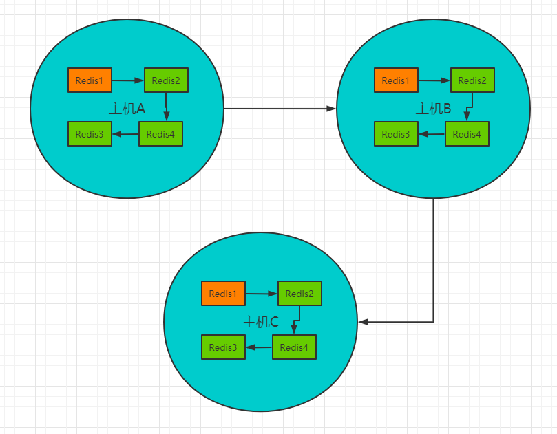

**Redis cluster**，主要是针对海量数据+高并发+高可用的场景。redis cluster 支撑 N 个 redis master node，每个 master node 都可以挂载多个 slave node。这样整个 redis 就可以横向扩容了。如果你要支撑更大数据量的缓存，那就横向扩容更多的 master 节点，每个 master 节点就能存放更多的数据了。


集群模式和原理详细介绍 https://juejin.im/post/6844904039163887629


捡几个重点的叙述一下：

**slot（槽）**：总共是0-16384个，平均分配给每一个master。

**各个master之间数据通信**：开启一个10000+6379端口，用p2p的方式在节点之间通信，最终达到数据一致。

**处理请求**：Redis先计算key对应的槽，根据槽去寻找目标节点。

**故障发现**：当某个节点A给另外一个节点B 发送ping信号时，没有pong响应。并判断当前时间和最后一次ping通的时间间隔超过阈值，主观下线；之后A开始在集群内部进行传播这个判断。如果集群中超过半数节点也ping不通B，那么就投票==>客观下线。

**故障恢复**：

- 资格检查：从节点和主节点的断线时间不能过长
- 准备选举：让复制偏移量大的从节点优先发起选举
- 选举投票：其他的master给投票，如果票数超过一半，就竞选。没有就再等下一个从节点
- 替换master：成功竞选。


**集群构建**：假设创建3个master、3个slave

- 创建6个ip不同的节点，一开始都是master，之间也没有关系

- ```bash
    redis-cli --cluster create 127.0.0.1:6479 127.0.0.1:6480 127.0.0.1:6481 \
    127.0.0.1:6482 127.0.0.1:6483  127.0.0.1:6484 --cluster-replicas 1
    
    ```

    通过命令，能自动的创建master和slave

- 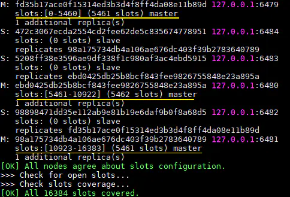

- 

**集群扩容**

- add-node：添加一个新的节点
- reshard：分配一定数量的槽。（成为master）
- add-node：添加另一个新的节点
- 绑定到新的master上。


## Redis缓存穿透和雪崩

（面试高频，工作常用）

Redis缓存的使用中，最要害的问题是==一致性问题==。


### 缓存穿透 大面积查询不到

> 概念

用于想要查询一个数据，发现redis缓存中没有，也就是缓存没有命中，于是向持久层数据库发起查询。**发现也没有**，于是本次查询失败。当用户很多的时候，缓存都没有命中，于是都去请求了持久层数据库。这会给持久层数据库造成很大的压力，这时候相等于出现了缓存穿透。

**总有傻逼要特特意搞事情**， 不按照常理发起请求


**像这种你如果不对参数做校验，数据库id都是大于0的，我一直用小于0的参数去请求你，每次都能绕开Redis直接打到数据库，数据库也查不到，每次都这样，并发高点就容易崩掉了。**

`一般业务流程`


先查询缓存，缓存不命中再查询数据库。 然后将查询结果放在缓存中即使数据不存在，**也需要创建一个缓存**，用来防止穿库。这里需要区分一下数据是否存在。 如果数据不存在，缓存时间可以设置相对较短，防止因为主从同步等问题，导致问题被放大。

这个流程中存在薄弱的问题是，当用户量太大时，我们会缓存大量数据空数据，并且一旦来一波冷用户，会造成雪崩效应。


> 解决方案

一般来说，大公司Redis集群多，不怕攻击，几个宕机也不怕。

小公司集群少，但是黑客估计也没兴趣来攻击。

**一、布隆过滤器  Bloom Filter**

利用高效的**数据结构和算法**快速判断出你这个Key是否在数据库中存在，不存在你return就好了，存在你就去查了DB刷新KV再return。


**二、缓存空对象**

- 查询数据库后也没有查询到，那就更新缓存，存一个【null】、【位置错误】、【稍后重试】这些值。
- 这些值的expire可以设置的短一点。保证不要短时间大量访问就可以。
- 对于明显恶意的访问请求通过服务器配置将这个IP加入黑名单。


**三、在接口层增加校验**

比如用户鉴权校验，参数做校验，不合法的参数直接代码Return，比如：id 做基础校验，id <=0的直接拦截等。

尽可能地区想用户会传些什么奇奇怪怪的参数过来！

**举个简单的例子，你这个接口是分页查询的，但是你没对分页参数的大小做限制，调用的人万一一口气查 Integer.MAX_VALUE 一次请求就要你几秒，多几个并发你不就挂了么？是公司同事调用还好大不了发现了改掉，但是如果是黑客或者竞争对手呢？在你双十一当天就调你这个接口会发生什么，就不用我说了吧。这是之前的Leader跟我说的，我觉得大家也都应该了解下。**


### 缓存击穿 单点爆破

>  概述

如一个微博热点，大量的用户同时访问同一个热点。持续的大并发集中访问一个key，这个key在**失效的瞬间**，持续的大并发就穿破缓存，直接请求数据库。击穿！

当某个key在过期的瞬间，有大量的请求并发访问，这类数据一般是热点数据，由于缓存过期，会同时访问数据库来查询最新数据，并且回写缓存，会导致数据库瞬间压力变大。


> 解决方案

**1 设置热点数据永远不过期, 针对于热点数据的不怎么更新的情况**

从缓存层面来看，没有设置过期时间，所以不会出现热点key过期后产生的问题。

**2 加互斥锁**

分布式锁：使用分布式锁，保证对于每个key同时只有一个线程去查询后端服务，其他线程没有获得分布式锁的权限，因此只需要等待即可。这种方式将高并发的压力转移到了分布式锁，因此对分布式锁的考验很大。


**3 如果热点数据更新的很频繁**

利用一个定时的线程在缓存过期之前 主动地重新构建缓存或者延迟过期时间。保证在一定的时间段内可以一直访问。


### 缓存雪崩

> 概念

缓存雪崩，是指在某一个时间段，缓存**集中过期失效**。大量的请求全部落入数据库，数据库抵挡不住就挂了。

比如：

- Redis宕机，大量的请求直接落到数据库
- 双11过1点大量缓存失效。通常会手动停掉一下服务，保证主要的服务可用！==（不允许退款服务）==


> 解决方案

**一、Redis高可用**

多增加点Redis服务器。（异地多活）

**二、限流降级 （SpringCloud）**

停止某些服务。

可以设置每秒的请求，有多少能通过组件，剩余的未通过的请求，怎么办？**走降级**！可以返回一些默认的值，或者友情提示，或者空白的值。

好处：只要不是数据库服务全崩，用户大不了就多刷新几次。总能刷出来。

**例子：**这个在目前主流的互联网大厂里面是最常见的，你是不是好奇，某明星爆出什么事情，你发现你去微博怎么刷都空白界面，但是有的人又直接进了，你多刷几次也出来了，现在知道了吧，那是做了降级，牺牲部分用户的体验换来服务器的安全，可还行？

**三、数据预热**

- 在正式部署之前，我先把可能的数据先预先访问一遍，这样部分可能大量访问的数据就会加载到缓存中。在即将发生大并发访问前手动触发加载缓存不同的key，设置不同的过期时间，让缓存失效的时间尽量均匀！

- 在批量往**Redis**存数据的时候，把每个Key的失效时间（Expire）都加个**随机值**就好了，这样可以保证数据不会在同一时间大面积失效，我相信，Redis这点流量还是顶得住的。

    ```bash
    setRedis（Key，value，time + Math.random() * 10000）；
    ```

- 或者设置热点数据**永远不过期**，有更新操作就更新缓存就好了（比如运维更新了首页商品，那你刷下缓存就完事了，不要设置过期时间），电商首页的数据也可以用这个操作，保险。


# 面试常见

### 用过Redis吗？说说是什么？

好。考察我对于Redis的定义和特点。说全面点。

Redis是一个由**C语言**开发的一个**开源**的高性能 **Key-Value** 内存数据库。==（定义）==可以用作数据库、缓存、消息中间件==（用来干啥）==它是一种NoSQL类型的数据库。==(点明不是关系型数据库)==

具体再展开来说说：

Redis作为一个内存数据库，

- 它的**性能**非常优秀，读写的速度非常快。根据官方的数字显示，Redis有超过10W的QPS。
- Redis是单进程**单线程**的。且线程安全。==I/O 多路复用机制==，这个是单线程依然这么强的原因之一
    - Redis 6.0 之后 引入了多线程模型
- 支持的**数据类型**很丰富。有五个基本数据类型，以及三种特殊的数据类型。
- 支持**持久化**。根据持久化策略定时保存到磁盘中。重启Redis时自动加载。
- 高可用。支持哨兵模式、主从复制。
- 可以作为分布式锁。
- 除了可以用户数据库、缓存之外，还可以用来做消息中间件
- 同时支持发布订阅功能。（所有订阅了某个频道的client，会在服务器发布新内容时，立即收到消息）


**单线程**

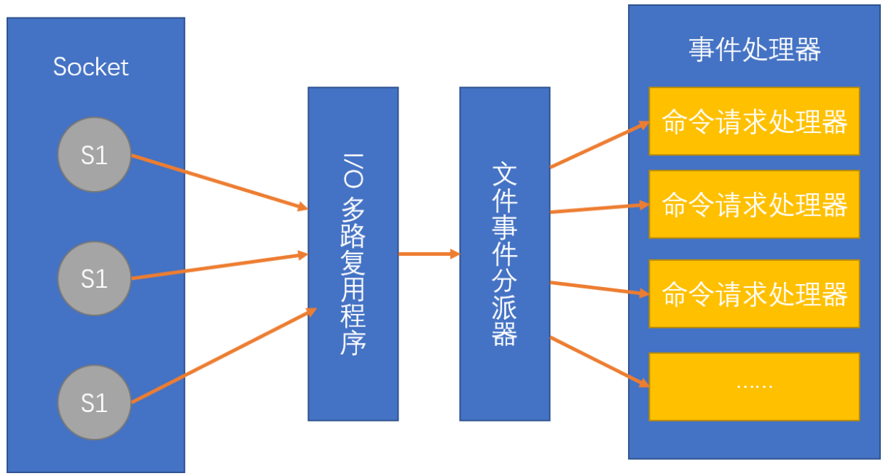


### 数据类型应用场景总结

| 类型                   | 简介                                                    | 特性                                                         | 场景                                       |
| ---------------------- | ------------------------------------------------------- | ------------------------------------------------------------ | ------------------------------------------ |
| string（字符串）       | 二进制安全                                              | 可以包含任何数据，比如jpg图片或者序列化对象                  | ---                                        |
| Hash（字典）           | 键值对集合，即编程语言中的map类型                       | 适合存储对象，并且可以像数据库中的update一个属性一样只修改某一项属性值 | 存储、读取、修改用户属性                   |
| List（列表）           | 链表（双向链表）                                        | 增删快，提供了操作某一元素的api                              | 最新消息排行；消息队列                     |
| set（集合）            | hash表实现，元素不重复                                  | 添加、删除、查找的复杂度都是O(1)，提供了求交集、并集、差集的操作 | 共同好友；利用唯一性，统计访问网站的所有Ip |
| sorted set（有序集合） | 将set中的元素增加一个权重参数score，元素按score有序排列 | 数据插入集合时，已经进行了天然排序                           | 排行榜；带权重的消息队列                   |


### 过期键的删除策略

（1）：立即删除。在设置键的过期时间时，创建一个回调事件，当过期时间达到时，由时间处理器自动执行键的删除操作。
 （2）：惰性删除。键过期了就过期了，不管。每次从dict字典中按key取值时，先检查此key是否已经过期，如果过期了就删除它，并返回nil，如果没过期，就返回键值。
 （3）：定时删除。每隔一段时间，对expires字典进行检查，删除里面的过期键。

> redis使用的过期键值删除策略

惰性删除加上定期删除，两者配合使用。


### 缓存有哪些类型

缓存的类型分为：**本地缓存**、**分布式缓存**和**多级缓存**。

#### 本地缓存：

**本地缓存**就是在进程的内存中进行缓存，比如我们的 **JVM** 堆中，可以用 **LRUMap** 来实现，也可以使用 **Ehcache** 这样的工具来实现。

本地缓存是内存访问，没有远程交互开销，性能最好，但是受限于单机容量，一般缓存较小且无法扩展。


#### 分布式缓存：

**分布式缓存**可以很好得解决这个问题。

分布式缓存一般都具有良好的水平扩展能力，对较大数据量的场景也能应付自如。缺点就是需要进行远程请求，性能不如本地缓存。


#### 多级缓存：

为了平衡这种情况，实际业务中一般采用**多级缓存**，本地缓存只保存访问频率最高的部分热点数据，其他的热点数据放在分布式缓存中。

在目前的一线大厂中，这也是最常用的缓存方案，单考单一的缓存方案往往难以撑住很多高并发的场景。


#### 淘汰策略

一般的剔除策略有 **FIFO** 淘汰最早数据、**LRU** 剔除最近最少使用、和 **LFU** 剔除最近使用频率最低的数据几种策略

整一个最常用的LRU算法


#### 数据不一致

缓存不一致产生的原因一般是主动更新失败，例如更新 DB 后，更新 **Redis** 因为网络原因请求超时；或者是异步更新失败导致。

解决的办法是，如果服务对耗时不是特别敏感可以增加重试；如果服务对耗时敏感可以通过异步补偿任务来处理失败的更新，或者短期的数据不一致不会影响业务，那么只要下次更新时可以成功，能保证最终一致性就可以。


### Redis 有哪几种数据类型

- String
- List
- Set
- Zset
- Hash
- GeoSpatial
- Hyperloglog
- Bitmap


### 为什么redis需要把所有数据放到内存中？

Redis 是一个基于内存的缓存数据库，为了达到最快的读写速度，通过异步的方式将数据写入磁盘。所以Redis具有快速读写和持久化的特征。

磁盘的IO速度是 很慢的，远远不能跟内存的速度相比。要是以后CPU的价格跟现在的机械硬盘一样便宜。直接放在cpu寄存器中读写都可以。


### Redis是单线程的还是多线程的？

Redis是单线程的。

**问：那么为什么要设计成单线程的而不是设计成多线程？**

没必要。Redis是基于内存的数据库。对于Redis的读写操作来说，瓶颈不是CPU的执行效率，而是内存以及网络带宽情况。

相反，如果用多线程。CPU会频繁地切换内存，反而导致了很多不必要的线程切换开销。得不偿失。


### Redis的数据分片是什么？

Sharding。

为了使得集群能够水平扩展，首要解决的问题就是如何将整个**数据集按照一定的规则分配到多个节点上**，常用的数据分片的方法有：范围分片，哈希分片，一致性哈希算法，哈希槽等。


### Redis的回收策略有哪些？

- volatile-lru：从已设置过期时间的数据集（server.db[i].expires）中挑选最近最少使用的数据淘汰

- volatile-ttl：从已设置过期时间的数据集（server.db[i].expires）中挑选将要过期的数据淘汰-

- volatile-random：从已设置过期时间的数据集（server.db[i].expires）中任意选择数据淘汰

-  allkeys-lru：从数据集（server.db[i].dict）中挑选最近最少使用的数据淘汰

- allkeys-random：从数据集（server.db[i].dict）中任意选择数据淘汰

- no-enviction（驱逐）：禁止驱逐数据。当内存满了，那么就只能读不允许写 （直接返回Error）


### Redis为什么需要做内存的回收？

当服务器中的内存不足够让redis继续加入新的键值对时，内存不足就容易引发错误。

同时，不正确的回收策略是有可能导致回收过久，系统长期停顿而引发错误。


### 与Memcache相比，Redis的优势体现在哪里?

1. 数据类型更加丰富
2. redis的速度更快
3. redis支持数据的持久化
4. Redis在3.x 之后原生支持集群


### 主从的同步策略有哪两种？

- 全量同步
- 增量同步

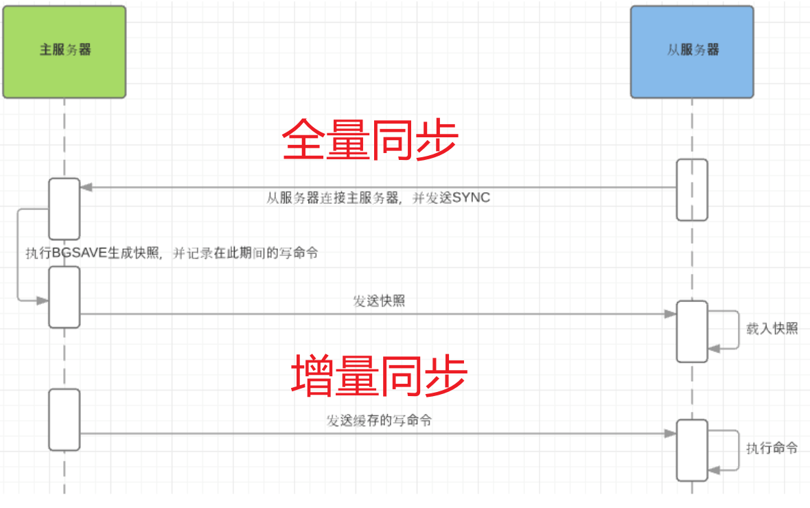


### 内部编码

String、Set、Hash、List、Zset等都是对外的数据类型。Redis内部实现的话还有更细分的数据结构。

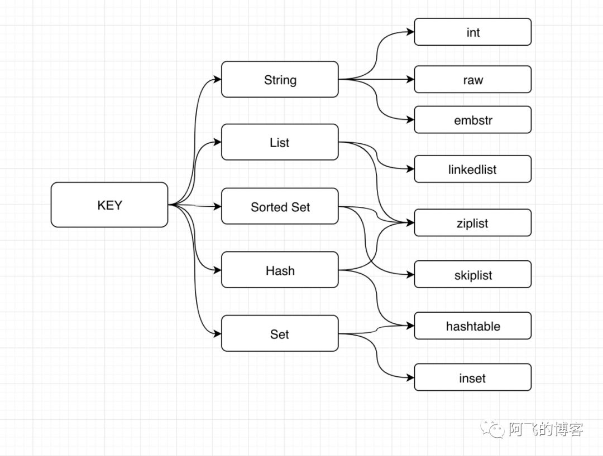

一种数据结构可能有多个不同的底层实现，这样做的好处是：

- 如果底层代码需要更新，我们不需要去关注内部编码实现。使用过程没有任何变化
- 在不同的应用场景下，可以通过设置去自主的选择不同的底层实现。提高性能。


# 基于Redis分布式锁实现商品秒杀


## 1、分布式锁的使用场景

在用户对商品进行下单的时候，如果商户正在对商品改价，同时用户正在支付，就可能出现并发问题，这个时候就需要串行化操作，防止出现业务问题。


## 2、分布式锁的核心机制

互斥锁


## 3、常见分布式锁的解决方案

- Redis分布式锁
- Zookeeper 分布式锁
- Etcd分布式锁


在单机情况下，Redis可以很好的完成任务。但是拓展到集群的时候，Redis分布式锁就不好用了。因为它无法保证一致性问题。

> 在master节点宕机的瞬间，master和slave节点之间的数据可能是不一致的。这将会导致服务a从master节点拿到了锁a，然后master节点宕机，在slave节点尚未完全同步完master的数据之前，服务b将从slave节点上成功拿到同样的锁a。


## 4、基于Redis的实现


