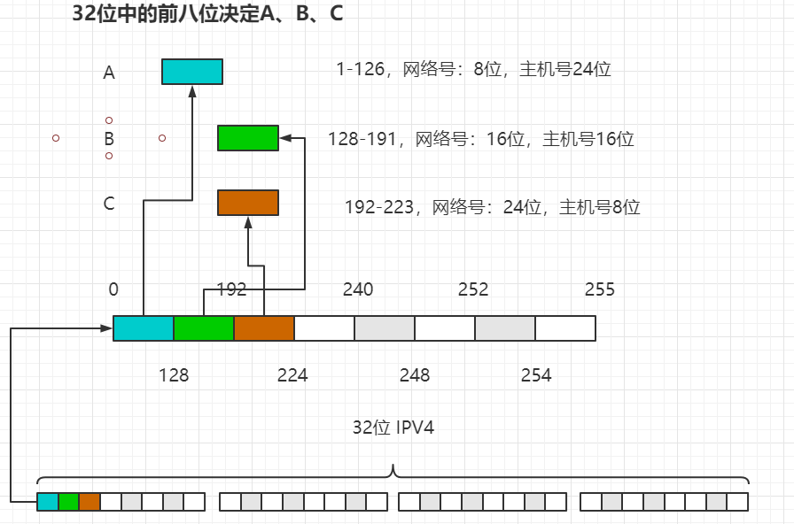
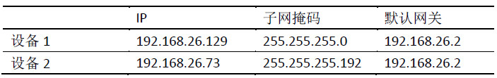
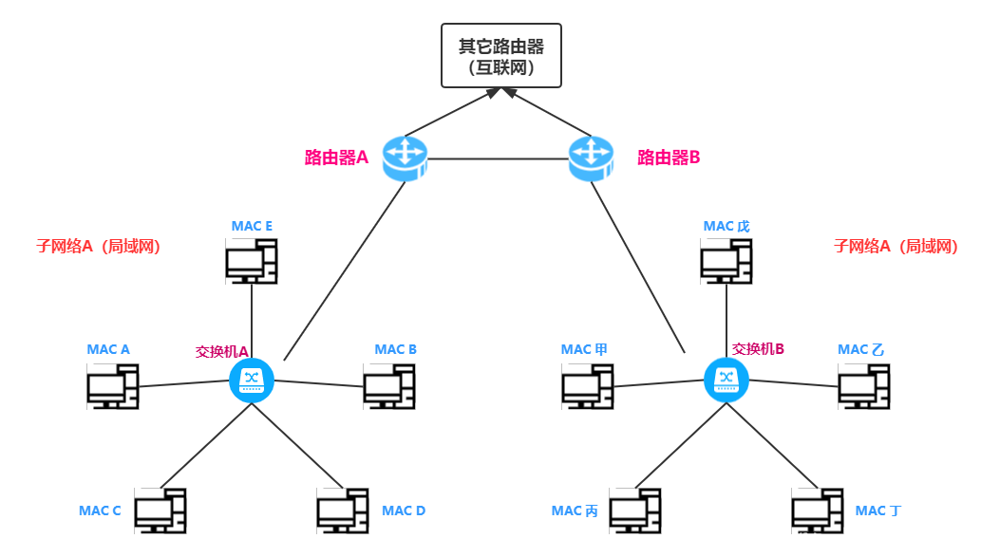
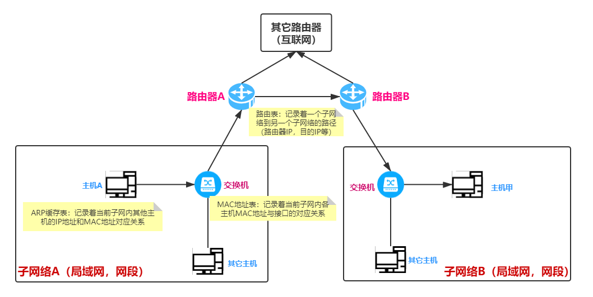

# 基础知识点

### 二进制

> 为什么计算机内部是用二进制？

- 二进制和十进制的转化很方便。
- 原始的机器是打孔的，以0 和 1进行区分
- 用二进制的位计算速度非常快
- 网络中传输的数据都是二进制的bit流

> 为什么计算出从0开始？

迪杰斯特拉提到，从0开始计数可以更好的表示范围。因为计算机中传递都都是二进制的bit流， 0 1 两个数字只需要一个位，0 1 2 3 只需要2个位，如果从1开始，1 2需要两个位，1 2 3 4需要2个bit。这样就乱了。

| 二进制 从0 开始 | 从1开始  |
| --------------- | -------- |
| 0 = 0000        | 1 = 0001 |
| 1 = 0001        | 2 = 0010 |
| 2 = 0010        | 3 = 0011 |
| 3 = 0011        | 4 = 0100 |
| 4 = 0100        | 5 = 0101 |
|                 |          |

> > 从零开始编号的阵列不会造成索引范围重叠，是最好的表示方法，从零开始暗示与实数同样的[开，半开和闭区间](https://zh.wikipedia.org/wiki/區間)。Dijkstra偏好这惯例的细节以空序列说明，它可以用更自然的（a≤i<a？）不等式来表示，相较于用闭合“区间”的（a≤i≤(a-1)？）不等式。而且以自然的半开“区间”不等式来看，子序列的长度等于上界减去下界（a≤i<b给出(b-a)的i可能值，其中的a，b，i都是自然数）

#### 补码、源码、反码、移码

> 计算机中的数字都用补码表示
>
> 注意：0的补码反码都为0.

**原码**：

- 最高位：表示正负
- 其他位：数字的绝对值

**补码**：

- 如果是正数：和原码一致
- 如果是负数：原码 -> 反码 ->  +1

**反码**：

- 如果是正数：和原码一致
- 如果是负数：原码基础上，符号位不变，其他位取反

**移码**：

- 在补码的基础上，对符号位取反 ？ （有啥意思）

# 网络

### IP地址段

> 网络地址

- A段网络：1-126
- B段网络：128-191
- C段网络：192-223

C段网络还可以再分，目的是为了节省主机。不造成浪费。

- 将8位主机段分成2份，那么子网的掩码是 `255.255.255.128`, 可用主机号：1-126/129-254。 0 和128代表各个子段的**网关**，127和255代表各个子段的**广播地址**。
- 将8位主机段分成4份，那么子网的掩码是 `255.255.255.192`, 可用主机号：1-62/65-126/129-190/193-254。 0、64、128、192代表各个子段的**网关**，63、127、191、255代表各个子段的**广播地址**。

### 子网

接着上面的IP地址继续说，32位的IP地址可以划分为三个部分：

- 网络号 （A、B、C）
- 子网ID
- 主机ID

对于A类网络（8位网络号），可用24位来进行子网的划分；

对于B类网络（16位网络号），可用16位来进行子网的划分；

对于C类网络（24位网络号），可用8位来进行子网的划分；

**IP子网掩码设定:**

假设B类网络154.71.0.0，没有子网的话一共有65,534台主机。划分子网时，按照以下方法：

- 1位用作子网ID，15位用作主机ID：那么子网数为2^1，第一个子网是0，第二个子网是1。每一个子网的主机数是2^15-2，或32，766。
- 2位用作子网ID，14位用作主机ID：那么子网数为2^2，四个子网0，1，2，3。每一个子网的主机数是2^14-2，或16，382。

假设一个B类网络中有10个子网，需要4位表示子网（2^4=16，2^3=8），12位用作主机ID，每一子网最多4，094台主机。

### 两台主机之间通信

网络通信的两种主要方式：

1. 如果两个设备位于同一个网络下，那么它们之间的通信是不需要网关的支持的（不需要路由的转发）
2. 如果两个设备不是同一个网络下，那么需要网关的支持。

对于设备1、2来说，它们并不能直接通信。因为两者的不处于同一个子网。通信需要网关的支持。如果没有配置网关，那么是无法进行通信的。

**网络通信示意图：**

路由器用于不同子网间的网络通信；交换机用于同一子网下的网络通信。

**1、同一网段下数据通信**

> 在**同一网段中两个主机**数据交换时，如果主机A的ARP表中有主机B的IP地址和MAC地址对应关系，只需要发送一个数据包的请求；如果没有查到主机B相关的IP地址和MAC地址对应关系，需要先广播一个ARP请求获取主机B的MAC地址，然后再发送数据包请求。

**2、不同网段下的主机通信**

> 1 主机A通过发送ARP请求，获取网关MAC地址。这时就有了目标主机B的IP地址和网关MAC地址。主机A会更新本地的ARP缓存表
> 2 使用主机**B的IP地址**和**网关MAC**地址转发数据包，发送数据。
> 3 交换机收到数据包，会把网关MAC地址和接口更新到MAC地址表。
> 3 数据包经由子网络A的交换机到网关，再到路由器，路由器经过各种转发，找到主机B所在的子网络B。（`现在通常指的网关就是路由器的IP`）
> 4 子网络B中交换机接收到数据，会查询MAC地址表
> 5 查询到主机B的MAC地址与接口对应的关系。数据转发到主机B
> 6 主机B会更新本地的ARP缓存表，记录主机A的IP地址与MAC地址。
> 7 数据包应答过程和发送过程一样

**总结**
1 主机A和主机B在同一个子网络，主机A向主机B发送数据，需要知道`主机B的MAC地址`和`主机B的IP地址`
2 主机A和主机B不在同一个子网络，主机A向主机B发送数据，需要知道`网关的MAC地址`和`主机B的IP地址`